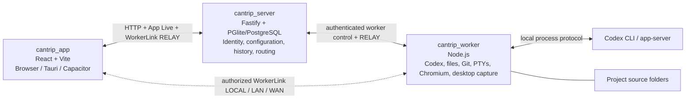

# Cantrip

Cantrip is a local-first, self-hostable coding-agent workspace powered by the open-source Codex CLI. It combines Codex chats, real and supervised terminals, persistent file editing, an embedded Code workspace, Git and GitHub tooling, automations, a global command palette, and remote browser and desktop surfaces across desktop, browser, iOS, and Android clients.

The project is inspired by the Codex desktop experience, but its architecture is designed around a server and independent workers. The local development path runs the app, server, and one worker on the same computer. The hosted path runs an authenticated PostgreSQL-backed control plane with independently enrolled workers and browser, desktop, or mobile clients.

> Cantrip is under active development. Anonymous loopback use remains the fastest development path; password and account modes, secure worker enrollment, Redis-backed relay coordination, quotas, audit events, and production deployment assets are implemented for hosted evaluation. Review the [hosted deployment guide](docs/HOSTED_DEPLOYMENT.md) and [acceptance ledger](docs/HOSTED_RELAY_ACCEPTANCE.md) before exposing a server publicly.

## What Cantrip does

Cantrip organizes work into projects backed by a GitHub repository, an imported
local Git checkout, or a worker-bound non-Git folder. From the project picker,
create an empty Cantrip-owned folder, attach a directory that already exists on
a selected worker, import a repository discovered in a workspace, or create or
import a public or private GitHub repository. Cantrip detects Git when an
existing directory is attached. A local Git project receives Git, source
attachment, and safe relocation capabilities; a verified GitHub remote also
enables GitHub collaboration surfaces. Local Git projects do not receive
Cantrip-managed secondary worktrees. A ready managed folder or local Git
project can later use the explicit conversion flow to enter the full GitHub
project lifecycle. Every project resolves to a source folder on a worker and
can contain an ordered mix of:

GitHub imports keep a one-click worker-managed default and also support an
exact path on the selected worker. Cantrip can keep the canonical clone in its
managed storage while creating one external symlink/junction, clone directly
to a missing path, or attach an existing matching Primary checkout without
mutating it. Attached checkouts remain user-owned and cannot be deleted by
Cantrip. All runtime operations use the canonical checkout; raw worker paths
cross the server only as opaque worker routing handles. See the
[project repository placement guide](docs/PROJECT_REPOSITORY_PLACEMENT.md).

- Codex chats with phased Markdown responses, normalized plans/reasoning/tools/subagents/usage activity, drag-and-drop, paste, and picker attachments, large-paste attachments, image input for capable providers including Grok, per-message Default/Plan/Goal modes, model and reasoning selection, steering, prompt queues, cooperative pause/resume/stop controls, compaction commands, forking, renaming, duplication, and selectable sandbox/approval profiles. An explicit warning-gated YOLO profile is available when unrestricted, approval-free execution is genuinely intended.
- Task-backed chats for large jobs. **Direct** Tasks queue an ordinary Agent
  turn; opt-in **Plan + Goal** Tasks run read-only planning, support question
  rounds and revision-safe plan edits, then finalize into Goal implementation
  on the same Codex thread. Every runnable cycle enters the durable
  account-global scheduler and waits for an eligible configured Task Worker
  with capacity. Task state survives tab changes, desktop pop-outs, worker
  outages, archive/restore, server restarts, and—on Git-capable projects—safe
  relocation between compatible ready sources. See [the Tasks
  contract](docs/TASKS.md).
- Native macOS and Windows import of compatible local ChatGPT Codex chats as
  resumable Cantrip-managed forks. See
  [the Codex chat import guide](docs/CODEX_CHAT_IMPORT.md).
- Real PTY terminal tabs that run in the project folder on the worker, recognize clickable links, and expose an Esc/Shift/arrow command bar above the software keyboard on mobile. A terminal can also become a durable service: the worker starts its saved command at boot, restarts it after an unexpected exit, retains its live PTY for later attachment, and exposes stop, disable, and restart controls.
- Codex-compatible project Run environments with platform-specific saved
  actions, revision-checked CLI/MCP execution, headless worker-owned PTYs,
  encrypted terminal materialization, and durable secondary-worktree setup.
  See [the Run environment guide](docs/RUN_CONFIGURATIONS.md).
- Finder-style Explorer tabs with a lazy expandable directory tree and file
  sizes. Git-backed projects also show local Git state and asynchronously
  hydrated last-commit metadata. Files open in preview or structured visual
  mode and can switch to a persistent Monaco editor with conflict-safe saves;
  the selected file, draft, cursor, scroll position, and undo history survive
  ordinary tab changes.
- Embedded Cantrip Code tabs backed by the selected worker and checkout, with the project pretrusted, Cantrip's chosen theme applied on startup, and unnecessary onboarding/chat surfaces hidden.
- Worker-streamed Browser tabs for project-related web pages, with
  WorkerLink-routed keyboard, mouse, wheel, and mobile touch input while
  Chromium and its persistent profile remain on the worker.
- Saved and feature-managed tunnels that expose explicit worker-local services
  on Tauri desktop loopback without opening inbound worker ports. See
  [the tunnels guide](docs/TUNNELS.md).
- One-click Remote Desktop tabs for the project worker's screen.
- On Git-capable projects, a unified Git tab. History includes a branch graph,
  refs and tags, every known
  worktree HEAD, per-worktree WIP state, clickable commit inspection and
  revision patches, staged and unstaged changes, commits, branches, stashes,
  conflict resolution, and pull/push operations. Projects whose remote is a
  verified accessible GitHub repository also receive Issues and Pull Requests
  views with GitHub-backed management. See
  [the Git client guide](docs/GIT_CLIENT.md).

Folder-origin projects have two ownership modes:

- **Managed folder:** Cantrip creates an empty UUID-derived directory beneath
  the selected workspace's Cantrip-managed storage on the selected worker.
  Unlinking preserves it so it can be added again by path. Permanent deletion
  is available only through a separate checkbox and an additional warning
  confirmation.
- **Attached folder:** Cantrip resolves an existing directory on the selected
  worker and leaves it user-owned. The desktop add dialog can browse when that
  worker is linked to the same desktop installation; otherwise enter an
  absolute path on the selected worker. Cantrip can unlink and later reattach
  the folder, but it never offers to delete an attached folder's files.

Project display names may repeat in either mode. Both modes support Agents,
Tasks, terminals, Explorer, Code, Browser, Remote Desktop, tunnels, shares,
scripts, policies, skills, MCP, and project automations.
An attached directory that is already a Git checkout is registered as a local
Git project and may attach matching ready sources on other workers. A verified
GitHub remote adds collaboration features. Running `git init` after a non-Git
folder is added does not silently change its capabilities; use the explicit
conversion flow instead. See [the folder-project contract](docs/FOLDERS.md).

On macOS and Windows desktop builds, each project's actions menu includes
**Reveal in Finder** or **Reveal in File Explorer**. Selecting it normally
mounts a writable, authorized network share over WorkerLink, which selects
`LOCAL`, `LAN`, `WAN`, then server `RELAY`. Hold **Shift** while
selecting the action to bypass the network share and open the physical project
directory, but only when the desktop can prove that it owns the matching local
worker and path. For a remote worker, the Shift shortcut is intentionally a
silent no-op. Browser and mobile clients do not show the native reveal action.
See [the project network-share guide](docs/PROJECT_NETWORK_SHARES.md).

Each project belongs permanently to exactly one server-owned workspace chosen
when it is created or imported. A workspace groups the projects shown in the
sidebar and also defines its managed or attached storage context; membership
never duplicates repository, tab, or runtime state. Pressing Shift twice opens the global command palette at the top
of the app: it searches context-aware actions, detected scripts for the selected
project, and projects across every workspace. Choosing a project switches to
its workspace when needed. Choosing a script sends it to an idle selected
terminal or opens an appropriately grouped project terminal. Tabs can be
renamed, reordered, grouped, split, popped out on desktop, or closed with the
middle mouse button; projects themselves are never removed by middle-click.

Settings are stored by the server for the current Cantrip identity rather than in browser cookies. They include System/Light/Dark appearance, optional high contrast, reusable Agent Policies, model providers, models, and the default model. **Settings → Usage** displays reconciled logical server storage, separate server-known worker attachment estimates, current UTC-day server bandwidth, and retained history; no account limits are currently enforced. See the [account resource usage contract](docs/ACCOUNT_USAGE.md) for exact measurement, retention, privacy, and operational semantics. **Settings → Logs** adds a bounded live console for the current client, the desktop-owned embedded server, and account-linked workers—even when the selected worker is reached remotely through the server. Filter by chat/turn, request, worker, automation/job, project, or surface IDs to follow an operation without exposing prompts, terminal I/O, or page/desktop contents. See the [service log guide](docs/SERVICE_LOGS.md) for source availability, correlation, redaction, retention, verification, and troubleshooting. Provider support currently includes:

- Ollama and other worker-local endpoints.
- OpenAI-compatible APIs such as OpenRouter.
- Z.ai GLM Coding Plan through Codex's Responses integration. Cantrip supplies
  the documented Coding Plan endpoint and model catalog and supports ordered
  fallback alongside other provider routes.
- Portable ChatGPT, Grok, and SuperGrok account providers authenticated through
  Codex. The app seals static API keys. Authorized workers obtain and seal OAuth
  credentials, while the server stores only opaque envelopes. Workers decrypt
  credentials for use. For OAuth, they refresh and reseal bundles locally and
  keep five-minute access-token leases in memory.

Models are logical profiles with one or more ordered provider routes. Provider
settings aggregate weekly usage across portable accounts while retaining each
account's individual limits and reset time. A profile
such as `GPT-5.6 Sol` can prefer one ChatGPT account, fall back to another when
its reported weekly usage is exhausted, and then use an OpenAI-compatible
route such as OpenRouter. Grok profiles can likewise pool multiple SuperGrok
accounts. Each route keeps its provider-specific model name and
optional reasoning override. Cantrip records the concrete route used for a
turn and only retries another route automatically when the first attempt fails
before producing command or file activity.

The chat composer context meter combines context-window consumption with the
7-day account availability reported by the selected model's primary portable
provider. ChatGPT and SuperGrok both expose aggregate and per-account details,
including reset times; an omitted zero-valued SuperGrok reading is treated as
0% used rather than as missing usage data.

The app can switch between the structured chat view and the linked live Codex console. A newly opened console initializes the Codex CLI with the model selected in the composer, so a conversation can begin in either interface.

### Persistent tab groups

Project surfaces are organized into server-owned tab groups. In the desktop and
wide-browser layout, each group is one sidebar row and has a horizontal top bar;
a singleton is simply a one-member group. Drag a singleton sidebar row into the visible top bar to
join it, drag top tabs to reorder them, or drag a top tab back to the sidebar to
split it. These interactions use revision-checked server mutations, so compact
and mobile clients observe the same membership and order even though their
bottom navigation selects surfaces directly and does not expose grouping drag
and drop. The active member inside each group remains local to each window.

On Tauri, the pop-out action opens the complete group rather than one isolated
surface. A group has at most one local pop-out owner; selecting its row in the
main sidebar focuses that window. Closing an ordinary pop-out never deletes its
group or tabs. Tab dragging is intentionally scoped to the current window on
every platform: dragging outside a Tauri window neither creates a new pop-out
nor docks into another window. Use the explicit pop-out action when a group
needs its own desktop window. See
[docs/TAB_GROUPS.md](docs/TAB_GROUPS.md) for the model, failure semantics, and
QA matrix.

## Architecture

Cantrip is split into three deployable applications plus one shared protocol package:



### `cantrip_app`

The React frontend is the control surface. Vite provides the browser
development build, Tauri provides the desktop shell, and Capacitor packages the
native iOS and Android clients. The app sends authoritative snapshots and
mutations only through the server and never assumes project files exist on the
client device. After server authorization, live feature bytes may use a scoped
WorkerLink carrier directly between the app and worker, with relay fallback.

### `cantrip_server`

The server is the control plane and configuration authority. It announces deployment and authentication capabilities, owns the Cantrip user/account settings and Policies, stores projects and durable conversation history, tracks worker presence, persists worktree observations plus project-wide logical branch leases, reconciles per-account logical storage and meters server-carried bandwidth, and authorizes operations on the correct worker checkout. The former durable-workflow UI, API, runtime, and persistence have been removed. It stores ChatGPT and Grok OAuth bundles only as opaque endpoint-encrypted envelopes. Authorized workers decrypt, refresh, and reseal them locally; the server authorizes revision-fenced envelope fetch/reseal and global sign-out.

Local development uses embedded PGlite under `.cantrip/dev/`. A PostgreSQL `DATABASE_URL` can be supplied for a standalone database. Source files and attachment bytes are not copied into the server database. The server stores attachment metadata with conversation history and relays bounded upload and preview chunks to the owning worker.

### `cantrip_worker`

The worker is the machine that actually performs work. It owns Cantrip-managed
folder directories, managed and direct repository clones, placement ownership
records, and physical Git worktrees; validates and operates attached user-owned
folder and repository roots; runs Git and GitHub CLI operations where
applicable; provides filesystem access; hosts PTY processes and supervised
terminal services; supervises Codex runtimes; keeps the embedded Code server
warm; runs Browser-tab Chromium sessions; and captures and controls its own
desktop for Remote Desktop tabs. Provider URLs, repository paths, and
Browser-tab addresses are resolved from the worker machine, which is important
once the server and worker live on different hosts. Worker-local ChatGPT and
Grok access leases remain in memory; normal operation does not create
worker-local `auth.json` or `grok-auth.json` credentials.

Chat attachments are staged beneath the worker's private Cantrip data
directory, outside project sources and Git worktrees. Server control-plane
authorization remains mandatory; resource-granted WorkerLink sessions may then
carry live feature traffic over LOCAL, LAN, WAN, or RELAY routes. See [ADR
0003](docs/adr/0003-worker-owned-chat-attachments.md) for the attachment-specific
relay, model-capability fallback, limits, and storage boundary.

### `packages/protocol`

`@cantrip/protocol` contains the Zod-validated contracts shared by the app, server, and worker. It keeps transport and persisted data boundaries explicit as the three applications evolve independently.

Codex App Server versions and negotiated features follow the explicit policy in
[`docs/CODEX_RUNTIME_COMPATIBILITY.md`](docs/CODEX_RUNTIME_COMPATIBILITY.md).
The normalized transcript surface and its reasoning/secret boundary are
documented in
[`docs/CODEX_EVENT_NORMALIZATION.md`](docs/CODEX_EVENT_NORMALIZATION.md).
Portable provider authentication, migration, lifecycle, threat boundaries, and
manual cross-platform validation are documented in
[`docs/PROVIDER_AUTHENTICATION.md`](docs/PROVIDER_AUTHENTICATION.md).
Codex-compatible environment discovery, Run/setup lifecycle, CLI and MCP
commands, limits, and threat controls are documented in
[`docs/RUN_CONFIGURATIONS.md`](docs/RUN_CONFIGURATIONS.md).

## Current deployment model

The current local mode has one anonymous Cantrip user and no Cantrip sign-in screen. `pnpm dev` or `pnpm devtop` starts the server and a local worker together, so the app connects immediately. A packaged Tauri desktop app carries its own production server, worker, Node.js runtime, and PGlite migrations. It starts those services on a private dynamic loopback port and stops them with the app.

The account area in the main sidebar is also the server switcher. Its **Add server** action saves a named server origin in client bootstrap storage, tests `/api/bootstrap`, and switches every HTTP and WebSocket request after a reload. The built-in **Local** profile always selects the desktop-bundled stack in a release build and the normal development stack in `devtop`. Server profiles contain no credentials; hosted sessions remain in server-owned HttpOnly cookies.

Signed-in users can choose **Sign in mobile device** from the same server menu. Cantrip displays a two-minute QR grant containing the server identity, its phone-reachable origin, and an opaque one-use code. The mobile sign-in screen scans and verifies that identity, saves the server profile, consumes the code once, and receives a normal independently revocable HttpOnly session. Passwords and existing session cookies are never encoded in the QR.

Standalone server and worker packages establish the deployable boundary for the hosted control plane. The server supports anonymous loopback mode, protected single-user password sessions, email/password account sessions, tenant ownership, independently revocable worker enrollment, versioned encryption of provider API keys, portable provider-account OAuth credentials, and MCP secret values at rest, fail-closed hosted HTTP/origin/proxy configuration, account/worker traffic quotas, liveness/readiness probes, protected Prometheus metrics, active-session visibility, owner-scoped append-only security audit events, Redis-backed multi-instance worker/live routing, and database-fenced project-automation dispatch claims that recover after a server replica crash.

Production Linux server/worker images, PostgreSQL/Redis Compose services,
Caddy and Nginx proxy examples, explicit migrations, and backup/restore guidance
live in the [hosted deployment guide](docs/HOSTED_DEPLOYMENT.md). Native server
and worker archives remain self-contained and require no external Node runtime.
The [hosted relay acceptance ledger](docs/HOSTED_RELAY_ACCEPTANCE.md) maps the
security and multi-instance guarantees to their automated checks and records
the practical smoke-test boundary for each release candidate.

Conversation history and configuration live on the server, so they remain
readable when a worker is unavailable. Project files and live runtime state
remain on the worker. GitHub-backed conversations relocate through explicit
compatible-checkout handoff; local Git conversations can relocate only to a
matching attached ready source. Non-Git folder conversations cannot relocate;
their filesystem-backed actions remain unavailable until the owning worker
reconnects.

The app keeps one versioned application-control WebSocket per selected server
profile for committed state notifications and cache synchronization. HTTP
remains authoritative for snapshots and mutations, with bounded disconnected
recovery polling. See the [live transport contract](docs/LIVE_TRANSPORT.md) and
[measured audit](docs/LIVE_TRANSPORT_AUDIT.md).

Network forwarding uses the [unified tunnel framework](docs/TUNNELS.md): the
server owns definitions and authorization, `tunnel-data-plane-v1` runs inside
WorkerLink reliable streams, and explicit endpoint placements preserve the path
to future worker-to-worker adapters without claiming that feature is available
today.

## Codex-native customization and project automations

Cantrip extends one agent runtime instead of maintaining Claude CLI and Codex
backends. Codex App Server remains responsible for threads, turns, tools,
approvals, skills, hooks, MCP, plans, goals, and subagents. The app inventories
and capability-gates those native surfaces, exposes commands and skills in one
palette, and can translate recognized external Claude/Cursor data into inert
Codex-native records without executing imported scripts.

Simple project automations can schedule a protected prompt and optionally gate
it on one condition: a worker-side script must exit with code 0, or the
repository must have at least a configured number of open GitHub issues. A
false condition records a skipped run instead of dispatching the prompt.

The former durable workflow product has been removed. Its app UI, public server
APIs, server repositories/scheduler/executor, and worker handlers are absent;
former paths now receive the ordinary not-found response. Legacy database
tables and shared protocol/encryption types remain, but old rows are not
recovered or executed. See the [retired workflow boundary](docs/WORKFLOW_ORCHESTRATION.md)
and [legacy-data operations](docs/WORKFLOW_OPERATIONS.md); the
[implementation audit](docs/WORKFLOW_IMPLEMENTATION_AUDIT.md) and
[architecture decision](docs/adr/0004-codex-native-workflow-control-plane.md)
are historical records.

Cantrip-specific agent operations are exposed through a worker-owned managed
MCP server. Its typed catalog covers Policies, worktrees, execution targets,
Explorer, Terminal, Browser, and bounded client controls while ordinary file
and Git work continues to use ordinary shell commands. The worker-authenticated
Rust CLI remains available to humans, scripts, diagnostics, and agents as a
fallback. See the [managed MCP guide](docs/MCP.md) and
[CLI guide](docs/CLI.md).

### Reusable Agent Policies

Policies are owner-scoped Markdown instruction documents stored by Cantrip
Server. Root **Settings → Policies** can create a blank policy or copy the
packaged Manual Change Protocol template, then search, edit, enable/disable,
mark/unmark Mandatory, and keyboard- or pointer-sort the resulting policies.
Nonmandatory policies can be assigned from Workspace or Project Settings; a
project receives the ordered union of mandatory, workspace-inherited, and
direct assignments without duplicates.

The current packaged catalog has no `suggestedDefault` entry, so account
bootstrap records its current version without creating a Policy. The immutable
Manual Change Protocol template remains available for an explicit copy. Policy
rows, assignments, optimistic versions, and bootstrap state stay on the server
and are isolated by account.

For project execution, the server selects enabled `ide`/`both` Policies using
public assignment, Mandatory, and ordering metadata, and the worker decrypts
their summaries into bounded application context. Standalone Chat selects all
enabled `chat`/`both` Policies and the worker injects their full bodies. The
server never constructs this semantic context. Agents prefer managed MCP
`policy_list` and `policy_read`; the CLI exposes the same effective project set
as a fallback:

```console
cantrip policy list
cantrip policy read manual-change-protocol
cantrip --json policy list
```

`policy read` always returns the current body and only for a policy effective
in the resolved project. Policy changes publish live invalidations to other
Settings windows. The first implementation permits at most 64 effective
summaries and 32 KiB of encoded summary context; an oversized set rejects the
turn with a consolidation instruction instead of silently dropping policies.
See [the Policies design and behavior guide](docs/POLICIES.md).

## Agent-managed worktrees

Every GitHub-backed project has a non-removable **Primary** worktree at the
project source path. Additional worktrees are worker-created checkouts beneath
Cantrip's private worker data directory, or external checkouts discovered by
Git reconciliation. Primary placement may be selected as an exact worker path
during import or per-worker replica provisioning; secondary worktree target
paths remain worker-controlled. See
[project repository placement](docs/PROJECT_REPOSITORY_PLACEMENT.md) for the
separate ownership and deletion contract.

Chats default to **Agent managed**. Such a chat may inspect Primary, ask
Cantrip's Codex-native worktree tools to acquire or create an isolated lane,
finish the current turn, and continue transparently in a worktree-specific
runtime. **Pinned** chats stay on the checkout selected by the user until they
are returned to Agent managed. One server-owned transcript spans every lane,
and past messages retain the worktree and execution-lane attribution that
produced them.

The sidebar remains flat: a compact worktree icon appears only on secondary
checkout tabs. The active Chat, Terminal, Explorer, and Git header contains
a worktree control. Terminals and Explorers are physically bound to one
checkout; linked Codex consoles follow their parent chat. Browser tabs and the
Git Issues and Pull Requests views remain project-level. Git History selects
one checkout for Git actions while showing markers and virtual WIP rows for
every known worktree.

Worktree removal never deletes its branch. Primary cannot be removed, dirty or
locked worktrees require explicit handling, running chats and terminals block
unsafe removal, and external worktrees require explicit authorization. Server
metadata remains visible while a worker is offline. See
[docs/WORKTREES.md](docs/WORKTREES.md) for user behavior, safety rules, API
boundaries, and the development test matrix.

Non-Git folder projects do not expose this worktree model. Their Agent, Task,
Terminal, Explorer, Code, and automation operations all resolve to the one
worker-owned execution root. Local Git projects expose Git plus matching source
attachment/relocation but still reject secondary-worktree operations. Agent
writes follow the selected permission profile.

## Repository layout

```text
Cantrip/
├── cantrip_app/       # React/Vite UI, Tauri shell, Capacitor configuration
├── cantrip_site/      # Public React/Vite marketing site
├── cantrip_server/    # API, persistence, identity, and worker routing
├── cantrip_worker/    # Codex runtime, terminals, files, Git, and GitHub access
├── cantrip_cli/       # Worker-authenticated Rust command-line interface
├── cantrip_codex/     # Pinned upstream Codex source and source manifest
├── cantrip_code/      # Pinned browser-native Code OSS distribution
├── packages/          # Protocol, crypto, logging, version, and shared UI packages
├── managed_runtimes/  # Pinned portable web/search runtimes
├── deploy/            # Hosted services, containers, and proxy examples
├── docs/              # Current contracts plus labeled historical delivery records
└── package.json       # Root development and verification commands
```

The canonical domain is `cantrip.art`. Desktop and mobile application identifiers use `art.cantrip`.

## Requirements

For browser development:

- Node.js 22 or newer.
- pnpm 11 (the exact version is declared in `package.json`).
- Git.
- GitHub CLI (`gh`) authenticated with `gh auth login`, or a worker-local
  `GH_TOKEN`, when testing GitHub import, creation, and conversion. Managed
  folder creation does not require GitHub authentication.
- Rustup. Cantrip builds its pinned Codex CLI source with the exact toolchain
  declared by `cantrip_codex/upstream/codex-rs/rust-toolchain.toml`.
- A Chromium-family browser for worker-streamed Browser tabs. Cantrip discovers
  Chrome, Chromium, Brave, Edge, and Vivaldi in their conventional install
  locations. Set `CANTRIP_CHROMIUM_EXECUTABLE` to an explicit executable when
  using another installation or a managed Chromium build.
- Ollama when testing a local Ollama model.

Desktop development additionally requires the [Tauri 2 prerequisites](https://v2.tauri.app/start/prerequisites/) for your operating system, including a Rust toolchain and the required macOS, Windows, or Linux system packages. See [COMPILING.md](COMPILING.md) for Cantrip's complete clean-machine setup, native packaging, and Capacitor Android/iOS instructions.

## Install

From the repository root:

```shell
pnpm install
```

Defaults are suitable for local development. The first development start builds
the pinned Codex source; subsequent starts reuse Cargo's cache. Copy
`.env.example` into your preferred environment setup if you need to override
ports, data directories, the server origin, or local model metadata.

## Command quick reference

Run these commands from the repository root. The sections below explain the
development stacks and artifacts in more detail.

### Run

| Command             | Purpose                                                                          |
| ------------------- | -------------------------------------------------------------------------------- |
| `pnpm dev`          | Run the protocol watcher, server, worker, and browser app.                       |
| `pnpm devtop`       | Run the same local stack with the stable default Tauri development profile.      |
| `pnpm dev:profile`  | Inspect, create, or explicitly repair a backed-up development installation.      |
| `pnpm site`         | Run only the public marketing site at <http://127.0.0.1:5174>.                   |
| `pnpm dev:server`   | Run a separate account-mode server with disposable PostgreSQL.                   |
| `pnpm dev:postgres` | Run the browser stack against disposable PostgreSQL in Docker instead of PGlite. |

### Build and verify

| Command             | Purpose                                                                                                            |
| ------------------- | ------------------------------------------------------------------------------------------------------------------ |
| `pnpm build`        | Build every workspace package, including the browser app and marketing site production bundles.                    |
| `pnpm typecheck`    | Type-check every workspace package without running tests.                                                          |
| `pnpm test`         | Run Cantrip Code script and extension tests plus every workspace test suite.                                       |
| `pnpm check`        | Run the complete pre-commit gate: safety checks, pinned-source verification, type-checking, tests, and formatting. |
| `pnpm format`       | Format the repository with Prettier.                                                                               |
| `pnpm format:check` | Check formatting without changing files.                                                                           |

### Package

| Command                        | Artifact                                                                     |
| ------------------------------ | ---------------------------------------------------------------------------- |
| `pnpm package:server`          | Standalone server tree for the current platform.                             |
| `pnpm package:worker`          | Standalone worker tree with Codex and Cantrip Code for the current platform. |
| `pnpm package:services`        | Both standalone service trees.                                               |
| `pnpm package:desktop-runtime` | Local server and worker runtime staged for Tauri.                            |
| `pnpm package:app`             | Native Tauri installer or application bundle.                                |
| `pnpm bundle`                  | Current-platform server, worker, and embedded desktop release artifacts.     |
| `pnpm package:all`             | Alias for `pnpm bundle`.                                                     |
| `pnpm release`                 | Fast-forward `release` to synchronized `main` and start release automation.  |

## Browser development with `pnpm dev`

```shell
pnpm dev
```

This starts the shared protocol watcher, Cantrip server, local worker, and Vite app. Open:

- App: <http://127.0.0.1:5173>
- Server: <http://127.0.0.1:4310>

Vite hot module replacement updates the app as frontend files change. The Node server and worker also restart automatically when their source changes. Press `Ctrl+C` once in the root terminal to stop every process started by the command.

Local database files, worker-owned repository clones, and managed project
folders are stored under `.cantrip/dev/` and are ignored by Git.

Direct repository placements and the external side of managed links can live
outside `.cantrip/dev/`. They are not included merely by backing up the worker
data directory; preserve those paths separately when they contain dirty or
unpushed work. See
[project repository placement](docs/PROJECT_REPOSITORY_PLACEMENT.md#backup-and-recovery).

To test multiple accounts without replacing the anonymous local server, run
`pnpm dev:server` in another terminal. It starts an isolated, disposable
PostgreSQL database on `127.0.0.1:54330` and an account-mode server on
<http://127.0.0.1:4320>. Public test registration is enabled. Add
`http://127.0.0.1:4320` through Cantrip's server
switcher, then create as many test accounts as needed. The command can run
beside `pnpm dev` or `pnpm devtop`; pressing `Ctrl+C` stops both its server and
database, and the database is discarded.

Browser tabs launch headless Chromium on the selected worker and render CDP
screencast frames inside the normal React layout. Server authorization and
signaling establish a resource-scoped WorkerLink; frames and input then use the
best available LOCAL, LAN, WAN, or RELAY carrier. The app never receives
Chromium's debugging URL.
Persistent browser profiles live under the worker data directory at
`.cantrip/dev/worker/browser/profiles/` by default and are ignored by Git.
The same canvas renderer is used by Vite, Tauri, Capacitor-compatible clients,
and desktop pop-out windows. Browser processes automatically restart against
the same profile and last known URL after an ordinary Chromium crash. Copying a
page selection or pasting local clipboard text requires an explicit toolbar
action; Cantrip does not continuously synchronize browser and device
clipboards.

Remote Surfaces use the same server-authorized WorkerLink transport. Direct
LOCAL, LAN, and WAN routes are preferred when policy and connectivity permit;
the authenticated server relay remains the fallback and carries all traffic
when no direct route succeeds. Every route is tied to the granted resource and
worker generation, so discovering a worker endpoint never grants another
surface or exposes native runtime credentials. See [the WorkerLink carrier
ADR](docs/adr/0010-tauri-native-worker-link-carrier.md) and [the live transport
guide](docs/LIVE_TRANSPORT.md).

### Remote Desktop tabs

Choose **Remote Desktop** from a project's add-tab menu. There is no setup
dialog: the server resolves the project's source worker, asks that worker to
verify screen capture, persists a tab named `Remote Desktop`, and opens it.
Hostnames, ports, display names, and passwords are not part of the managed
desktop API.

The worker captures its current display and injects explicit pointer,
keyboard, and clipboard actions. Encoded frames and input use the same scoped
WorkerLink routing as Browser tabs, including direct carriers and server relay
fallback. No dedicated inbound worker listener or native desktop-control
credential is exposed.

Remote Desktop defaults to a best-effort 30 FPS native capture pipeline and
can target 15, 30, or at most 60 FPS from Settings. Adaptive, data-saver,
balanced, and sharp quality profiles continuously tune JPEG quality and
resolution against their bandwidth budget and client render feedback. Capture
and encoding are pipelined, and clients discard stale undecoded frames instead
of accumulating input-to-display latency. Workers that cannot load the fast
native capture module retain the lower-frame-rate compatibility backend.

The worker operating system still enforces local permissions. macOS workers
need Screen Recording and Accessibility permission for the Node process that
runs Cantrip. Windows uses its native desktop APIs. Linux workers require a
supported graphical session; headless or restricted Wayland sessions may not
offer a capturable desktop. If the worker cannot capture its display, the
one-click request fails without creating a broken tab and reports the worker's
diagnostic.

### Remote Surface limits and troubleshooting

The current local worker admits at most four live Remote Surface sessions and
four simultaneous client attachments per surface. Main and popout windows each
count as an attachment. WorkerLink applies independent per-lane frame, queue,
credit, and bandwidth limits. Disposable realtime frames retain current plus
latest state and may be dropped when superseded; congestion on reliable input
or event traffic resets the affected stream so the client can reconnect instead
of continuing with corrupted ordering. The older 8 MiB feature-WebSocket queue
applies only to deprecated compatibility transport.

- **Worker offline:** the surface reports a recoverable error and retries its
  server connection. Start or reconnect the assigned worker; the durable tab
  remains on the server.
- **Chromium missing:** install Chrome, Chromium, Brave, Edge, or Vivaldi on the
  worker, or set `CANTRIP_CHROMIUM_EXECUTABLE` to a worker-local executable.
  Restart the worker after changing it.
- **WAN direct unavailable:** verify the WorkerLink STUN and UDP policy. The
  session falls back to server RELAY; WorkerLink never uses TURN.
- **Remote Desktop unavailable:** grant the worker process screen-capture and
  input-control permissions, then restart the worker. The creation request
  probes capture before persisting a tab.

Remote Surface logs contain lifecycle and validation errors only. Frame bytes,
screenshots, keystrokes, clipboard contents, and browser cookies
must never be logged.

## Marketing site development with `pnpm site`

```shell
pnpm site
```

This runs only the `cantrip_site` React/Vite package at
<http://127.0.0.1:5174>. It does not start the Cantrip server, worker, or app.
The site follows the operating-system color scheme by default and retains an
explicit System, Light, or Dark choice in browser storage.

Build or preview just the production marketing site with:

```shell
pnpm --filter @cantrip/site build
pnpm --filter @cantrip/site preview
```

## Desktop development with `pnpm devtop`

```shell
pnpm devtop
```

`devtop` runs the same protocol, server, and worker development stack, but launches the frontend inside the Tauri desktop window instead of asking you to open the standalone browser app. Tauri starts its Vite hot-reload server on <http://127.0.0.1:1420>, separately from the browser-development port.

The default Tauri development identity is a named profile stored in shared Git
metadata, not in a build directory or individual worktree. Its application
identifier, native installation catalog, and profile key therefore survive
branch changes, worktree replacement, rebuilds, and deletion of transient
`.cantrip/dev/tauri/target` output. On its first launch after this migration,
the default profile adopts the primary checkout's existing
`.cantrip/dev/tauri-dev.conf.json` identifier rather than generating a new one.

On macOS, `devtop` keeps its development-only native key in the stable
application-local profile rather than Apple Keychain. This avoids repeated
system-password prompts when ad-hoc debug binaries are rebuilt. The vault is
owner-readable only and is not used by packaged builds; production macOS
custody remains in Keychain. `devtop` never opens Apple Keychain and never
probes the legacy origin-scoped WebCrypto record, because WebKit can route that
record through Keychain too.

Use `pnpm dev:profile inspect` to print the active profile name, installation
ID, custody provider, catalog/migration state, and relevant non-secret paths.
For a deliberately clean lane, run
`pnpm dev:profile create update-test`, then
`pnpm devtop -- --profile update-test`. Existing profile names are never reset
or replaced implicitly; choose a new name for another clean lane.

If an older anonymous development profile already lost its only key, stop the
development stack and run `pnpm dev:profile repair-encryption [name]`. The
command first backs up the server database and native installation directory,
refuses account profiles or recoverable protected domain payloads, then removes
only the unrecoverable encryption registry state. The installation ID remains
stable and the next launch provisions its key in the development vault without
a Keychain prompt or recovery-acknowledgement screen.

In development builds, webview `console.*` output, failed HTTP requests, uncaught errors, unhandled promise rejections, failed resource loads, and Content Security Policy violations are forwarded to the `desktop` lane in the `devtop` terminal. Entries use a `[client:<window>:<level>]` prefix and include source context when the webview provides it, so failures in the main window and pop-outs can be distinguished without opening Web Inspector. Request query strings and embedded URL credentials are removed before logging.

The default server and worker lanes also write their normalized records to
`.cantrip/dev/logs/`, and the desktop lane persists client/native records there.
Named clean profiles use `.cantrip/dev-profiles/<name>/logs/`.
Open **Settings → Logs** to compare those same component events, inspect a
remote worker from another client, or export a filtered diagnostic. The server
source appears only for the matching embedded local server; Cantrip never
exposes hosted-server process logs through an HTTP endpoint. See
[docs/SERVICE_LOGS.md](docs/SERVICE_LOGS.md) for the correlation and smoke-test
runbook.

Do not run the complete `pnpm dev` and `pnpm devtop` stacks simultaneously with the default configuration because they still share the Cantrip server and worker. A separately running browser Vite process on port 5173 no longer prevents `devtop` from starting. Press `Ctrl+C` in the `devtop` terminal to stop the Tauri app and all processes it started.

## Build

```shell
pnpm build
```

The root build runs each workspace package's build script. It compiles the
shared protocol, server, and worker TypeScript and creates production Vite
bundles for `cantrip_app` and `cantrip_site` in their package-local `dist/`
directories. It does not create standalone service directories or a native
desktop installer; use the packaging commands for those distributable
artifacts.

## Packaging and standalone services

Packages are assembled for the operating system and architecture running the command. This matters for worker dependencies such as PTYs, screen capture, and image processing, which include native binaries.

```shell
pnpm package:server          # artifacts/cantrip-server-<platform>-<arch>
pnpm package:worker          # artifacts/cantrip-worker-<platform>-<arch>
pnpm package:services        # both standalone service trees
pnpm package:desktop-runtime # stage the local services used by Tauri
pnpm package:app             # native Tauri installer/bundle for this platform
pnpm bundle                  # native service/client archives for this platform
pnpm package:all             # alias for pnpm bundle
```

macOS packages set `CFBundleVersion` from `GITHUB_RUN_NUMBER` in CI and the
current Git commit count locally so Launch Services can distinguish successive
builds. Set `CANTRIP_APP_BUILD_VERSION` to a positive numeric build version when
packaging needs an explicit reproducible override.

Standalone service directories include a platform-matched Node.js runtime, compiled JavaScript, production dependencies, startup scripts, and a focused `.env.example`. Worker packages also include the native `cantrip` CLI. They do not require Node.js to be installed on the host. Copy `.env.example` to `.env`, create a short-lived worker link code while signed into the server, put it in the worker environment for its first start, then remove it after enrollment. The worker persists its unique credential in its data directory and initiates every connection through `CANTRIP_SERVER_URL`; no inbound worker port is exposed. The shared `CANTRIP_WORKER_TOKEN` path is limited to explicit loopback `pnpm dev` and embedded Tauri bootstraps.

Settings → Workers provides the supported onboarding and management surface. The desktop app detects its bundled local worker automatically and offers **Add this machine** when connected to a hosted server; the authenticated app completes that machine's enrollment without making the user copy a link code. It shows internal and remote machines, presence, runtime capabilities, project-source associations, and credential activity. Remote workers can be renamed, rotated, revoked, unlinked, or relinked without deleting server-owned projects and conversations. Internal embedded/development workers are marked and protected from rename or removal. The desktop app can launch hidden at login, and closing its main window leaves its linked workers online through the system tray. On macOS, Command-Q closes Cantrip's windows without stopping those services; explicit Quit actions ask for confirmation before shutting the worker and server down.

Run `pnpm release` from a clean `main` branch to pull `origin/main` and
fast-forward `origin/release`. That branch update starts the native release
workflow, which builds separate Server, Worker, and Desktop artifacts for
macOS ARM64 and Windows x64, an unsigned Android release APK, and an iOS archive
in parallel. The iOS lane uploads its signed archive to TestFlight, while the
APK is attached to the same versioned GitHub release as the desktop and service
artifacts. The macOS application and DMG are Developer ID signed, notarized,
and stapled. Both desktop targets publish separately signed Tauri updater
payloads; the release remains a draft until every platform artifact, signature,
the TestFlight upload, and the static `latest.json` manifest have completed.
Release packaging runs only when that branch advances, uses
content-addressed caches for the pinned Codex and Cantrip Code runtimes, and
tags releases with the repository's `major.minor.commit-count` version. The
command never force-pushes a divergent release branch. See
[docs/DISTRIBUTION.md](docs/DISTRIBUTION.md) for the artifact flow, environment
contract, desktop lifecycle, and current security boundary.

### Explicit desktop updates

Packaged macOS and Windows Tauri builds expose **Check for updates** in General
Settings. Cantrip never checks, downloads, or installs an update at startup or
on a timer. A manual check shows the installed and available versions, release
date, and safely rendered GitHub release Markdown before enabling a separate
**Update and restart** action.

The native coordinator downloads only over HTTPS and verifies the release with
the updater public key embedded in the installed app. It reports progress,
allows cancellation while downloading, and prevents duplicate update attempts.
Before stopping the bundled runtime, Cantrip checks for active local chats,
queued prompts, terminal services, and background jobs and requires another
confirmation when any are present. It then replaces the complete desktop
bundle and restarts the app; remote servers and workers are never upgraded by
this action.

An app installed before updater support does not contain the verification key
or native coordinator. Install one updater-enabled DMG or NSIS release manually
before using in-app updates. Signing-key provisioning and recovery procedures
are documented in [docs/DISTRIBUTION.md](docs/DISTRIBUTION.md#desktop-updater-signing-and-recovery).

## Test with Ollama

Cantrip starts without a model provider or default model. To test with Ollama,
start Ollama, then add an Ollama provider and the model you want through
**Settings → Models**. The usual local endpoint is
`http://127.0.0.1:11434/v1`. Provider configuration remains server-owned rather
than being stored in the browser.

## PostgreSQL development

PGlite requires no separate database process. To test against disposable PostgreSQL through Docker instead:

```shell
pnpm dev:postgres
```

The example connection settings are documented in `.env.example` and `compose.dev.yml`.

## Verification

Run the complete repository check before committing:

```shell
pnpm check
```

That command rejects oversized tracked files, verifies the pinned Cantrip Code
and Codex source trees, type-checks every package, runs the Cantrip Code script
and extension tests plus all workspace test suites, and finishes with the
Prettier check. Useful focused commands include:

```shell
pnpm typecheck
pnpm test
pnpm check:large-files
pnpm --filter @cantrip/protocol test
pnpm --filter @cantrip/server test
pnpm --filter @cantrip/worker test
pnpm --filter @cantrip/app test
pnpm --filter @cantrip/site build
```

The opt-in Z.ai end-to-end smoke test uses the bundled Codex runtime and only
runs when a real Coding Plan key is explicitly supplied:

```shell
ZAI_CODING_PLAN_API_KEY=... pnpm --filter @cantrip/worker exec vitest run test/zai-live.test.ts
```

Worktree-focused tests and manual PGlite/PostgreSQL checks are documented in
[docs/WORKTREES.md](docs/WORKTREES.md#development-validation).

For Remote Surface browser testing, start the deterministic local fixture and
open its printed URL in a Cantrip Browser tab:

```shell
pnpm qa:remote-surfaces
```

To verify only the Tauri Rust shell:

```shell
cargo check --manifest-path cantrip_app/src-tauri/Cargo.toml
```

## Pinned runtime maintenance

`pnpm dev` and `pnpm devtop` call `pnpm dev:prepare` automatically. That
preparation builds the shared protocol and pinned Codex runtime, then reuses or
builds the fingerprinted Cantrip Code distribution. A matching cached Code
build remains a fast no-op; missing or stale builds are repaired automatically.
Most contributors do not need to invoke the lower-level runtime commands
directly.

| Command                    | Purpose                                                     |
| -------------------------- | ----------------------------------------------------------- |
| `pnpm codex:verify`        | Verify the vendored Codex source manifest.                  |
| `pnpm codex:build`         | Build the pinned Codex CLI for the host platform.           |
| `pnpm codex:clean`         | Remove the local pinned Codex build output.                 |
| `pnpm code:source:verify`  | Verify the vendored Cantrip Code source and patch manifest. |
| `pnpm code:build`          | Build the fingerprinted Cantrip Code distribution.          |
| `pnpm code:ready`          | Fast-check that the expected Cantrip Code build exists.     |
| `pnpm code:verify`         | Fully verify Cantrip Code source and build contents.        |
| `pnpm code:extension:test` | Run the Cantrip Code workbench extension tests.             |
| `pnpm code:dev`            | Run the ready Cantrip Code distribution on port 9888.       |
| `pnpm code:clean`          | Remove local Cantrip Code build and development output.     |

Updating either pinned upstream is a deliberate maintainer workflow. Follow
[the Cantrip Code guide](docs/CODE.md) before using `code:fetch`, `code:merge`,
`code:patch`, or `code:divergence`, and follow
[the Codex runtime policy](docs/CODEX_RUNTIME_COMPATIBILITY.md) before using
`codex:sync`.

## Mobile and packaged clients

Capacitor is configured with the `art.cantrip` identifier. The native iOS and
Android projects are checked in so their signing, permissions, app icons, and
store configuration remain reviewable. After changing the web client or
Capacitor configuration, synchronize the native projects before opening the
platform IDE:

```shell
pnpm --filter @cantrip/app cap:sync
pnpm --filter @cantrip/app cap:open:ios
pnpm --filter @cantrip/app cap:open:android
```

Advancing the `release` branch also runs dedicated mobile CI lanes. Android
produces an intentionally unsigned `Cantrip_<version>_android_unsigned.apk` and
adds it to the GitHub release. iOS archives `art.cantrip` with Apple
Distribution signing and uploads it to App Store Connect for TestFlight
processing. The GitHub release is not published if either mobile lane fails.
See [docs/DISTRIBUTION.md](docs/DISTRIBUTION.md#mobile-release-lanes) for the
required iOS Actions secrets.

Browser-only and mobile clients cannot bootstrap a Node server or worker. They use the same server switcher to select a reachable standalone server. Tauri development keeps the root-orchestrated hot-reload stack, while a production desktop bundle supervises its internal server and worker automatically.

The mobile shell provides bottom navigation for project surfaces, native haptic
feedback on tab press and long-press reset, safe-area-aware layouts, a terminal
keyboard command bar, QR-assisted sign-in, and touch-correct Browser input and
scrolling. Authoritative state and WorkerLink authorization still come from the
selected Cantrip server; live feature bytes may use a direct scoped carrier.
Camera access is used only for the sign-in scanner, and no local server option
is presented outside Tauri.

## Further design

See [docs/FULL_DESCRIPTION.md](docs/FULL_DESCRIPTION.md) for the current system
map and links to authoritative feature contracts. The original [foundational
plan](docs/PLAN.md) is retained as a historical design record. The accepted
[multi-worker architecture contract](docs/MULTI_WORKER_ARCHITECTURE.md) defines
project replicas, execution placement, synchronization, and safe chat
relocation
