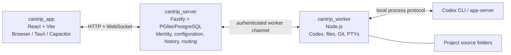

# Cantrip

Cantrip is a local-first, self-hostable coding-agent workspace powered by the open-source Codex CLI. It combines Codex chats, real terminals, project files, Git tooling, and lightweight browser tabs in one interface.

The project is inspired by the Codex desktop experience, but its architecture is designed around a server and independent workers. Today, the supported development path runs the app, server, and one worker on the same computer. The same boundaries are intended to support a hosted server, multiple workers, and browser, desktop, or mobile clients later.

> Cantrip is under active development. Local single-user mode is the current target; hosted accounts, secure worker enrollment, relays, and production multi-worker switching are not ready yet.

## What Cantrip does

Cantrip organizes work into GitHub-backed projects. Each project has one source folder owned by a worker and can contain an ordered mix of:

- Codex chats with Markdown responses, command/file activity, per-message model selection, steering, prompt queues, compaction commands, forking, renaming, and duplication.
- Real PTY terminal tabs that run in the project folder on the worker.
- Read-only Explorer tabs with a source or Markdown preview for supported text files.
- Browser tabs for project-related web pages.
- Git history with a branch graph, refs and tags, current checkout state, staged and unstaged changes, commits, branches, pull/push operations, and GitHub issue browsing and management.

Settings are stored by the server for the current Cantrip identity rather than in browser cookies. They include System/Light/Dark appearance, optional high contrast, model providers, models, and the default model. Provider support currently includes:

- Ollama and other worker-local endpoints.
- OpenAI-compatible APIs such as OpenRouter.
- Isolated ChatGPT account providers authenticated through Codex, including account status and available usage information when Codex exposes it.

Models are logical profiles with one or more ordered provider routes. A profile
such as `GPT-5.6 Sol` can prefer one ChatGPT account, fall back to another when
its reported weekly usage is exhausted, and then use an OpenAI-compatible
route such as OpenRouter. Each route keeps its provider-specific model name and
optional reasoning override. Cantrip records the concrete route used for a
turn and only retries another route automatically when the first attempt fails
before producing command or file activity.

The app can switch between the structured chat view and the linked live Codex console. Ordinary terminal, Explorer, browser, chat, and project tabs can be renamed and reordered together.

## Architecture

Cantrip is split into three deployable applications plus one shared protocol package:



### `cantrip_app`

The React frontend is the control surface. Vite provides the browser development build, Tauri provides the desktop shell, and Capacitor stubs reserve the mobile path. The app knows the server URL but never connects directly to a worker or assumes project files exist on the client device.

### `cantrip_server`

The server is the control plane and configuration authority. It announces deployment and authentication capabilities, owns the Cantrip user/account settings, stores projects and durable conversation history, tracks worker presence, and routes every file, terminal, Git, and Codex operation to the correct worker.

Local development uses embedded PGlite under `.cantrip/dev/`. A PostgreSQL `DATABASE_URL` can be supplied for a standalone database. Source files are not copied into the server database.

### `cantrip_worker`

The worker is the machine that actually performs work. It owns project source folders, clones repositories, runs Git and GitHub CLI operations, provides filesystem access, hosts PTY processes, and supervises Codex runtimes. Provider URLs such as `localhost` are resolved from the worker machine, which is important once the server and worker live on different hosts.

Workers communicate through the server. There is intentionally no app-to-worker connection mode.

### `packages/protocol`

`@cantrip/protocol` contains the Zod-validated contracts shared by the app, server, and worker. It keeps transport and persisted data boundaries explicit as the three applications evolve independently.

## Current deployment model

The current local mode has one anonymous Cantrip user and no Cantrip sign-in screen. `pnpm dev` or `pnpm devtop` starts the server and a local worker together, so the app connects immediately.

The architecture leaves room for a future cloud server to route several outbound-connected workers—for example, a desktop, laptop, and VPS—to web, desktop, and mobile clients. That mode will require real accounts, worker enrollment, secure remote transport, and possibly a relay. Those capabilities should not be inferred from the current local development authentication.

Conversation history and configuration live on the server, so they remain readable when a worker is unavailable. Project files and live runtime state remain on the worker. Moving a conversation to another worker will therefore require a compatible checkout and an explicit handoff rather than pretending that uncommitted files moved automatically.

## Repository layout

```text
Cantrip/
├── cantrip_app/       # React/Vite UI, Tauri shell, Capacitor configuration
├── cantrip_server/    # API, persistence, identity, and worker routing
├── cantrip_worker/    # Codex runtime, terminals, files, Git, and GitHub access
├── packages/protocol/ # Shared runtime-validated contracts
├── docs/PLAN.md       # Product architecture and phased roadmap
└── package.json       # Root development and verification commands
```

The canonical domain is `cantrip.art`. Desktop and mobile application identifiers use `art.cantrip`.

## Requirements

For browser development:

- Node.js 22 or newer.
- pnpm 11 (the exact version is declared in `package.json`).
- Git.
- GitHub CLI (`gh`) authenticated with `gh auth login`, or a worker-local `GH_TOKEN`, to list and clone accessible repositories.
- Codex CLI for Codex-backed chats and ChatGPT account providers.
- Ollama when testing a local Ollama model.

Desktop development additionally requires the [Tauri 2 prerequisites](https://v2.tauri.app/start/prerequisites/) for your operating system, including a Rust toolchain and the required macOS, Windows, or Linux system packages.

## Install

From the repository root:

```shell
pnpm install
```

Defaults are suitable for local development. Copy `.env.example` into your preferred environment setup if you need to override ports, data directories, the server origin, or the default local model.

## Browser development with `pnpm dev`

```shell
pnpm dev
```

This starts the shared protocol watcher, Cantrip server, local worker, and Vite app. Open:

- App: <http://127.0.0.1:5173>
- Server: <http://127.0.0.1:4310>

Vite hot module replacement updates the app as frontend files change. The Node server and worker also restart automatically when their source changes. Press `Ctrl+C` once in the root terminal to stop every process started by the command.

Local database files and worker-owned repository clones are stored under `.cantrip/dev/` and are ignored by Git.

## Desktop development with `pnpm devtop`

```shell
pnpm devtop
```

`devtop` runs the same protocol, server, and worker development stack, but launches the frontend inside the Tauri desktop window instead of asking you to open the standalone browser app. Tauri still starts Vite internally, so frontend hot module replacement works in the desktop window.

Do not run `pnpm dev` and `pnpm devtop` simultaneously with the default configuration because both use the same server and Vite ports. Press `Ctrl+C` in the `devtop` terminal to stop the Tauri app and all processes it started.

## Test with Ollama

The development seed includes an Ollama provider at `http://127.0.0.1:11434/v1` and a `gemma4:26b` model entry. Make the configured model available in Ollama, start Ollama, then select that model in Cantrip. Providers and model names can be changed from Settings without storing credentials in the browser.

## PostgreSQL development

PGlite requires no separate database process. To test against disposable PostgreSQL through Docker instead:

```shell
pnpm dev:postgres
```

The example connection settings are documented in `.env.example` and `compose.dev.yml`.

## Verification

Run the complete repository check before committing:

```shell
pnpm check
```

That command runs TypeScript checks, all Vitest suites, and the Prettier check. Other useful commands are:

```shell
pnpm build
pnpm test
pnpm typecheck
pnpm format
pnpm format:check
```

To verify only the Tauri Rust shell:

```shell
cargo check --manifest-path cantrip_app/src-tauri/Cargo.toml
```

## Mobile and packaged clients

Capacitor is configured with the `art.cantrip` identifier, but native iOS and Android projects are intentionally not checked in yet. They can be generated when mobile work begins:

```shell
pnpm --filter @cantrip/app cap:add:ios
pnpm --filter @cantrip/app cap:add:android
pnpm --filter @cantrip/app cap:sync
```

Browser-only and mobile clients cannot bootstrap a Node server or worker. Packaged remote clients will connect to a separately running Cantrip server using `VITE_CANTRIP_SERVER_URL`. The local Tauri development command currently runs the local stack through the root orchestrator.

## Further design

See [docs/PLAN.md](docs/PLAN.md) for the security model, durable chat design, worker protocol, future account and pairing flows, multi-worker handoff constraints, and phased roadmap.
