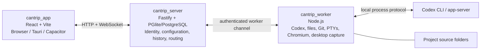

# Cantrip

Cantrip is a local-first, self-hostable coding-agent workspace powered by the open-source Codex CLI. It combines Codex chats, real terminals, project files, Git tooling, and lightweight browser tabs in one interface.

The project is inspired by the Codex desktop experience, but its architecture is designed around a server and independent workers. Today, the supported development path runs the app, server, and one worker on the same computer. The same boundaries are intended to support a hosted server, multiple workers, and browser, desktop, or mobile clients later.

> Cantrip is under active development. Local single-user mode is the current target. Standalone server and worker packages can be used on trusted networks, but hosted accounts, secure worker enrollment, and production multi-user access are not ready yet.

## What Cantrip does

Cantrip organizes work into GitHub-backed projects. Each project has one source folder owned by a worker and can contain an ordered mix of:

- Codex chats with phased Markdown responses, normalized plans/reasoning/tools/subagents/usage activity, arbitrary file attachments, large-paste attachments, per-message Default/Plan/Goal modes, model selection, steering, prompt queues, cooperative pause/resume, compaction commands, forking, renaming, and duplication.
- Real PTY terminal tabs that run in the project folder on the worker.
- Read-only Explorer tabs with a source or Markdown preview for supported text files.
- Worker-streamed Browser tabs for project-related web pages.
- One-click Remote Desktop tabs for the project worker's screen.
- Git history with a branch graph, refs and tags, every known worktree HEAD, per-worktree WIP state, clickable commit inspection and revision patches, staged and unstaged changes, commits, branches, pull/push operations, and GitHub issue browsing and management. See [the Git client guide](docs/GIT_CLIENT.md).

Settings are stored by the server for the current Cantrip identity rather than in browser cookies. They include System/Light/Dark appearance, optional high contrast, model providers, models, and the default model. Provider support currently includes:

- Ollama and other worker-local endpoints.
- OpenAI-compatible APIs such as OpenRouter.
- Isolated ChatGPT account providers authenticated through Codex, including account status and available usage information when Codex exposes it.

Models are logical profiles with one or more ordered provider routes. A profile
such as `GPT-5.6 Sol` can prefer one ChatGPT account, fall back to another when
its reported weekly usage is exhausted, and then use an OpenAI-compatible
route such as OpenRouter. Each route keeps its provider-specific model name and
optional reasoning override. Cantrip records the concrete route used for a
turn and only retries another route automatically when the first attempt fails
before producing command or file activity.

The app can switch between the structured chat view and the linked live Codex console. Ordinary terminal, Explorer, browser, chat, and project tabs can be renamed and reordered together.

### Persistent tab groups

Project surfaces are organized into server-owned tab groups. Each group is one
sidebar row and has an always-visible horizontal top bar; a singleton is simply
a one-member group. Drag a singleton sidebar row into the visible top bar to
join it, drag top tabs to reorder them, or drag a top tab back to the sidebar to
split it. These grouping operations work in Vite, Capacitor, and Tauri and use
one revision-checked server mutation, so refreshes and other clients see the
same membership and order. The active member inside each group remains local to
each window.

On Tauri, the pop-out action opens the complete group rather than one isolated
surface. A group has at most one local pop-out owner; selecting its row in the
main sidebar focuses that window. Closing an ordinary pop-out never deletes its
group or tabs. Tab dragging is intentionally scoped to the current window on
every platform: dragging outside a Tauri window neither creates a new pop-out
nor docks into another window. Use the explicit pop-out action when a group
needs its own desktop window. See
[docs/TAB_GROUPS.md](docs/TAB_GROUPS.md) for the model, failure semantics, and
QA matrix.

## Architecture

Cantrip is split into three deployable applications plus one shared protocol package:



### `cantrip_app`

The React frontend is the control surface. Vite provides the browser development build, Tauri provides the desktop shell, and Capacitor stubs reserve the mobile path. The app knows the server URL but never connects directly to a worker or assumes project files exist on the client device.

### `cantrip_server`

The server is the control plane and configuration authority. It announces deployment and authentication capabilities, owns the Cantrip user/account settings, stores projects, durable conversation history, workflow definitions, runs, and triggers, tracks worker presence, persists worktree observations and chat execution leases, and routes every file, terminal, Git, Codex, and workflow operation to the correct worker checkout.

Local development uses embedded PGlite under `.cantrip/dev/`. A PostgreSQL `DATABASE_URL` can be supplied for a standalone database. Source files and attachment bytes are not copied into the server database. The server stores attachment metadata with conversation history and relays bounded upload and preview chunks to the owning worker.

### `cantrip_worker`

The worker is the machine that actually performs work. It owns project source folders and their physical Git worktrees, clones repositories, runs Git and GitHub CLI operations, provides filesystem access, hosts PTY processes, supervises worktree-specific Codex runtimes, runs Browser-tab Chromium sessions, and captures and controls its own desktop for Remote Desktop tabs. Provider URLs and Browser-tab addresses are resolved from the worker machine, which is important once the server and worker live on different hosts.

Chat attachments are staged beneath the worker's private Cantrip data directory, outside project sources and Git worktrees. Workers communicate through the server. There is intentionally no app-to-worker connection mode. See [ADR 0003](docs/adr/0003-worker-owned-chat-attachments.md) for the attachment transport, model-capability fallback, limits, and storage boundary.

### `packages/protocol`

`@cantrip/protocol` contains the Zod-validated contracts shared by the app, server, and worker. It keeps transport and persisted data boundaries explicit as the three applications evolve independently.

Codex App Server versions and negotiated features follow the explicit policy in
[`docs/CODEX_RUNTIME_COMPATIBILITY.md`](docs/CODEX_RUNTIME_COMPATIBILITY.md).
The normalized transcript surface and its reasoning/secret boundary are
documented in
[`docs/CODEX_EVENT_NORMALIZATION.md`](docs/CODEX_EVENT_NORMALIZATION.md).

## Current deployment model

The current local mode has one anonymous Cantrip user and no Cantrip sign-in screen. `pnpm dev` or `pnpm devtop` starts the server and a local worker together, so the app connects immediately. A packaged Tauri desktop app carries its own production server, worker, Node.js runtime, and PGlite migrations. It starts those services on a private dynamic loopback port and stops them with the app.

The account area in the main sidebar is also the server switcher. Its **Add server** action saves a named server origin in client bootstrap storage, tests `/api/bootstrap`, and switches every HTTP and WebSocket request after a reload. The built-in **Local** profile always selects the desktop-bundled stack in a release build and the normal development stack in `devtop`. Server profiles contain no credentials; multi-account authentication is intentionally a later milestone.

Standalone server and worker packages establish the deployable boundary for a future cloud control plane. The server can bind remotely only with the explicit `CANTRIP_ALLOW_INSECURE_REMOTE=true` acknowledgement. Until account authentication and worker enrollment land, use that mode only on a trusted private network or behind an authenticating reverse proxy; it is not safe to expose directly to the public internet.

Conversation history and configuration live on the server, so they remain readable when a worker is unavailable. Project files and live runtime state remain on the worker. Moving a conversation to another worker will therefore require a compatible checkout and an explicit handoff rather than pretending that uncommitted files moved automatically.

The app keeps one versioned application-control WebSocket per selected server
profile for committed state notifications and cache synchronization. HTTP
remains authoritative for snapshots and mutations, with bounded disconnected
recovery polling. See the [live transport contract](docs/LIVE_TRANSPORT.md) and
[measured audit](docs/LIVE_TRANSPORT_AUDIT.md).

## Codex-native customization and workflows

Cantrip extends one agent runtime instead of maintaining Claude CLI and Codex
backends. Codex App Server remains responsible for threads, turns, tools,
approvals, skills, hooks, MCP, plans, goals, and subagents. The app inventories
and capability-gates those native surfaces, exposes commands and skills in one
palette, and can translate recognized external Claude/Cursor data into inert
Codex-native records without executing imported scripts.

Above that runtime, Cantrip provides a durable, data-only workflow control
plane. Immutable revisions can compose agent, verification, reduction,
condition, approval-gate, map, pipeline, and repeat-until nodes with explicit
budgets, bounded concurrency, pause/cancel/retry controls, and isolated
worktrees for mutation. Workflows can be authored directly, generated with
Codex assistance, saved from completed runs, or imported/exported as reviewed
repository data.

Schedule, scoped API, credentialed webhook, normalized Git/GitHub, and saved
command triggers all create the same durable run records. Unattended execution
requires trusted, preauthorized revisions and permission manifests; the UI
creates triggers disabled until an operator explicitly enables them. This is a
local/trusted-network product boundary today, not a public multi-user automation
service or a raw GitHub HMAC webhook receiver.

See the [orchestration contract](docs/WORKFLOW_ORCHESTRATION.md),
[operator and recovery guide](docs/WORKFLOW_OPERATIONS.md),
[implementation audit](docs/WORKFLOW_IMPLEMENTATION_AUDIT.md), and
[architecture decision](docs/adr/0004-codex-native-workflow-control-plane.md).

## Agent-managed worktrees

Every GitHub-backed project has a non-removable **Primary** worktree at the
project source path. Additional worktrees are worker-created checkouts beneath
Cantrip's private worker data directory, or external checkouts discovered by
Git reconciliation. The app never chooses an unrestricted filesystem path.

Chats default to **Agent managed**. Such a chat may inspect Primary, ask
Cantrip's Codex-native worktree tools to acquire or create an isolated lane,
finish the current turn, and continue transparently in a worktree-specific
runtime. **Pinned** chats stay on the checkout selected by the user until they
are returned to Agent managed. One server-owned transcript spans every lane,
and past messages retain the worktree and execution-lane attribution that
produced them.

The sidebar remains flat: a compact worktree icon appears only on secondary
checkout tabs. The active Chat, Terminal, Explorer, and History header contains
a worktree control. Terminals and Explorers are physically bound to one
checkout; linked Codex consoles follow their parent chat. Browser and Issues
tabs remain project-level. History selects one checkout for Git actions while
showing markers and virtual WIP rows for every known worktree.

Worktree removal never deletes its branch. Primary cannot be removed, dirty or
locked worktrees require explicit handling, running chats and terminals block
unsafe removal, and external worktrees require explicit authorization. Server
metadata remains visible while a worker is offline. See
[docs/WORKTREES.md](docs/WORKTREES.md) for user behavior, safety rules, API
boundaries, and the development test matrix.

## Repository layout

```text
Cantrip/
├── cantrip_app/       # React/Vite UI, Tauri shell, Capacitor configuration
├── cantrip_site/      # Public React/Vite marketing site
├── cantrip_server/    # API, persistence, identity, and worker routing
├── cantrip_worker/    # Codex runtime, terminals, files, Git, and GitHub access
├── cantrip_codex/     # Pinned upstream Codex source and source manifest
├── packages/protocol/ # Shared runtime-validated contracts
├── docs/PLAN.md       # Product architecture and phased roadmap
└── package.json       # Root development and verification commands
```

The canonical domain is `cantrip.art`. Desktop and mobile application identifiers use `art.cantrip`.

## Requirements

For browser development:

- Node.js 22 or newer.
- pnpm 11 (the exact version is declared in `package.json`).
- Git.
- GitHub CLI (`gh`) authenticated with `gh auth login`, or a worker-local `GH_TOKEN`, to list and clone accessible repositories.
- Rustup. Cantrip builds its pinned Codex CLI source with the exact toolchain
  declared by `cantrip_codex/upstream/codex-rs/rust-toolchain.toml`.
- A Chromium-family browser for worker-streamed Browser tabs. Cantrip discovers
  Chrome, Chromium, Brave, Edge, and Vivaldi in their conventional install
  locations. Set `CANTRIP_CHROMIUM_EXECUTABLE` to an explicit executable when
  using another installation or a managed Chromium build.
- Ollama when testing a local Ollama model.

Desktop development additionally requires the [Tauri 2 prerequisites](https://v2.tauri.app/start/prerequisites/) for your operating system, including a Rust toolchain and the required macOS, Windows, or Linux system packages.

## Install

From the repository root:

```shell
pnpm install
```

Defaults are suitable for local development. The first development start builds
the pinned Codex source; subsequent starts reuse Cargo's cache. Copy
`.env.example` into your preferred environment setup if you need to override
ports, data directories, the server origin, or the default local model.

## Command quick reference

Run these commands from the repository root. The sections below explain the
development stacks and artifacts in more detail.

### Run

| Command             | Purpose                                                                          |
| ------------------- | -------------------------------------------------------------------------------- |
| `pnpm dev`          | Run the protocol watcher, server, worker, and browser app.                       |
| `pnpm devtop`       | Run the same local stack with the Tauri desktop app.                             |
| `pnpm site`         | Run only the public marketing site at <http://127.0.0.1:5174>.                   |
| `pnpm dev:postgres` | Run the browser stack against disposable PostgreSQL in Docker instead of PGlite. |

### Build and verify

| Command             | Purpose                                                                                                            |
| ------------------- | ------------------------------------------------------------------------------------------------------------------ |
| `pnpm build`        | Build every workspace package, including the browser app and marketing site production bundles.                    |
| `pnpm typecheck`    | Type-check every workspace package without running tests.                                                          |
| `pnpm test`         | Run Cantrip Code script and extension tests plus every workspace test suite.                                       |
| `pnpm check`        | Run the complete pre-commit gate: safety checks, pinned-source verification, type-checking, tests, and formatting. |
| `pnpm format`       | Format the repository with Prettier.                                                                               |
| `pnpm format:check` | Check formatting without changing files.                                                                           |

### Package

| Command                        | Artifact                                                                     |
| ------------------------------ | ---------------------------------------------------------------------------- |
| `pnpm package:server`          | Standalone server tree for the current platform.                             |
| `pnpm package:worker`          | Standalone worker tree with Codex and Cantrip Code for the current platform. |
| `pnpm package:services`        | Both standalone service trees.                                               |
| `pnpm package:desktop-runtime` | Local server and worker runtime staged for Tauri.                            |
| `pnpm package:app`             | Native Tauri installer or application bundle.                                |
| `pnpm package:all`             | Standalone services and the native desktop app.                              |

## Browser development with `pnpm dev`

```shell
pnpm dev
```

This starts the shared protocol watcher, Cantrip server, local worker, and Vite app. Open:

- App: <http://127.0.0.1:5173>
- Server: <http://127.0.0.1:4310>

Vite hot module replacement updates the app as frontend files change. The Node server and worker also restart automatically when their source changes. Press `Ctrl+C` once in the root terminal to stop every process started by the command.

Local database files and worker-owned repository clones are stored under `.cantrip/dev/` and are ignored by Git.

Browser tabs launch headless Chromium on the selected worker and render CDP
screencast frames inside the normal React layout. Navigation and input travel
through the Cantrip server; the app never receives Chromium's debugging URL.
Persistent browser profiles live under the worker data directory at
`.cantrip/dev/worker/browser/profiles/` by default and are ignored by Git.
The same canvas renderer is used by Vite, Tauri, Capacitor-compatible clients,
and desktop pop-out windows. Browser processes automatically restart against
the same profile and last known URL after an ordinary Chromium crash. Copying a
page selection or pasting local clipboard text requires an explicit toolbar
action; Cantrip does not continuously synchronize browser and device
clipboards.

Remote Surfaces always retain the authenticated server-routed WebSocket data
plane. A deployment can additionally configure relay-only WebRTC by setting
`CANTRIP_TURN_URLS` and `CANTRIP_TURN_SHARED_SECRET` on the server. The server
derives short-lived TURN REST credentials for each attachment and never sends
the shared secret to an app or worker. Browser frames then use an unordered
loss-tolerant data channel while input and control messages use an ordered data
channel. Negotiation failure automatically keeps the live WebSocket stream.
Direct ICE candidates are deliberately disabled, preserving the rule that apps
do not connect to workers. See `.env.example` for TTL and timeout overrides.

### Remote Desktop tabs

Choose **Remote Desktop** from a project's add-tab menu. There is no setup
dialog: the server resolves the project's source worker, asks that worker to
verify screen capture, persists a tab named `Remote Desktop`, and opens it.
Hostnames, ports, display names, and passwords are not part of the managed
desktop API.

The worker captures its current display and injects explicit pointer,
keyboard, and clipboard actions. Encoded frames and input travel app ↔ server
↔ worker over the same authenticated WebSocket or relay-only WebRTC Remote
Surface transport as Browser tabs. No listener is exposed on the worker and an
app never receives a worker address or native desktop-control credential.

Remote Desktop defaults to a best-effort 30 FPS native capture pipeline and
can target 15, 30, or at most 60 FPS from Settings. Adaptive, data-saver,
balanced, and sharp quality profiles continuously tune JPEG quality and
resolution against their bandwidth budget and client render feedback. Capture
and encoding are pipelined, and clients discard stale undecoded frames instead
of accumulating input-to-display latency. Workers that cannot load the fast
native capture module retain the lower-frame-rate compatibility backend.

The worker operating system still enforces local permissions. macOS workers
need Screen Recording and Accessibility permission for the Node process that
runs Cantrip. Windows uses its native desktop APIs. Linux workers require a
supported graphical session; headless or restricted Wayland sessions may not
offer a capturable desktop. If the worker cannot capture its display, the
one-click request fails without creating a broken tab and reports the worker's
diagnostic.

### Remote Surface limits and troubleshooting

The current local worker admits at most four live Remote Surface sessions and
four simultaneous client attachments per surface. Main and popout windows each
count as an attachment. WebSocket queues are bounded at 8 MiB: disposable
Browser visual frames may be dropped under pressure, while congestion on a
reliable input channel deliberately resets the connection so the client can
reconnect instead of continuing with a corrupted byte stream. Frame payloads
are capped at 4 MiB by the shared protocol.

- **Worker offline:** the surface reports a recoverable error and retries its
  server connection. Start or reconnect the assigned worker; the durable tab
  remains on the server.
- **Chromium missing:** install Chrome, Chromium, Brave, Edge, or Vivaldi on the
  worker, or set `CANTRIP_CHROMIUM_EXECUTABLE` to a worker-local executable.
  Restart the worker after changing it.
- **TURN unavailable:** relay-only WebRTC negotiation times out and the same
  session continues over WebSocket. Check the TURN URLs, REST shared secret,
  firewall, and TLS certificate if WebRTC is expected; do not add host/direct
  ICE candidates as a workaround.
- **Remote Desktop unavailable:** grant the worker process screen-capture and
  input-control permissions, then restart the worker. The creation request
  probes capture before persisting a tab.

Remote Surface logs contain lifecycle and validation errors only. Frame bytes,
screenshots, keystrokes, clipboard contents, and browser cookies
must never be logged.

## Marketing site development with `pnpm site`

```shell
pnpm site
```

This runs only the `cantrip_site` React/Vite package at
<http://127.0.0.1:5174>. It does not start the Cantrip server, worker, or app.
The site follows the operating-system color scheme by default and retains an
explicit System, Light, or Dark choice in browser storage.

Build or preview just the production marketing site with:

```shell
pnpm --filter @cantrip/site build
pnpm --filter @cantrip/site preview
```

## Desktop development with `pnpm devtop`

```shell
pnpm devtop
```

`devtop` runs the same protocol, server, and worker development stack, but launches the frontend inside the Tauri desktop window instead of asking you to open the standalone browser app. Tauri starts its Vite hot-reload server on <http://127.0.0.1:1420>, separately from the browser-development port.

Do not run the complete `pnpm dev` and `pnpm devtop` stacks simultaneously with the default configuration because they still share the Cantrip server and worker. A separately running browser Vite process on port 5173 no longer prevents `devtop` from starting. Press `Ctrl+C` in the `devtop` terminal to stop the Tauri app and all processes it started.

## Build

```shell
pnpm build
```

The root build runs each workspace package's build script. It compiles the
shared protocol, server, and worker TypeScript and creates production Vite
bundles for `cantrip_app` and `cantrip_site` in their package-local `dist/`
directories. It does not create standalone service directories or a native
desktop installer; use the packaging commands for those distributable
artifacts.

## Packaging and standalone services

Packages are assembled for the operating system and architecture running the command. This matters for worker dependencies such as PTYs, screen capture, and image processing, which include native binaries.

```shell
pnpm package:server          # artifacts/cantrip-server-<platform>-<arch>
pnpm package:worker          # artifacts/cantrip-worker-<platform>-<arch>
pnpm package:services        # both standalone service trees
pnpm package:desktop-runtime # stage the local services used by Tauri
pnpm package:app             # native Tauri installer/bundle for this platform
pnpm package:all             # standalone services plus the desktop app
```

Standalone service directories include compiled JavaScript, production dependencies, startup scripts, and a focused `.env.example`. They require Node.js 22 or newer on the host. Copy `.env.example` to `.env`, configure matching `CANTRIP_WORKER_TOKEN` values, then launch `start.sh` or `start.cmd`. The worker initiates its connection with `CANTRIP_SERVER_URL`; no inbound worker port is exposed.

The `Package distributions` GitHub Actions workflow builds separate Server, Worker, and Desktop artifacts on macOS, Linux, and Windows. See [docs/DISTRIBUTION.md](docs/DISTRIBUTION.md) for the environment contract, desktop lifecycle, and current security boundary.

## Test with Ollama

The development seed includes an Ollama provider at `http://127.0.0.1:11434/v1` and a `gemma4:26b` model entry. Make the configured model available in Ollama, start Ollama, then select that model in Cantrip. Providers and model names can be changed from Settings without storing credentials in the browser.

## PostgreSQL development

PGlite requires no separate database process. To test against disposable PostgreSQL through Docker instead:

```shell
pnpm dev:postgres
```

The example connection settings are documented in `.env.example` and `compose.dev.yml`.

## Verification

Run the complete repository check before committing:

```shell
pnpm check
```

That command rejects oversized tracked files, verifies the pinned Cantrip Code
and Codex source trees, type-checks every package, runs the Cantrip Code script
and extension tests plus all workspace test suites, and finishes with the
Prettier check. Useful focused commands include:

```shell
pnpm typecheck
pnpm test
pnpm check:large-files
pnpm --filter @cantrip/protocol test
pnpm --filter @cantrip/server test
pnpm --filter @cantrip/worker test
pnpm --filter @cantrip/app test
pnpm --filter @cantrip/site build
```

Worktree-focused tests and manual PGlite/PostgreSQL checks are documented in
[docs/WORKTREES.md](docs/WORKTREES.md#development-validation).

For Remote Surface browser testing, start the deterministic local fixture and
open its printed URL in a Cantrip Browser tab:

```shell
pnpm qa:remote-surfaces
```

To verify only the Tauri Rust shell:

```shell
cargo check --manifest-path cantrip_app/src-tauri/Cargo.toml
```

## Pinned runtime maintenance

`pnpm dev` and `pnpm devtop` call `pnpm dev:prepare` automatically. That
preparation builds the shared protocol and pinned Codex runtime, then confirms
that the fingerprinted Cantrip Code distribution is ready. Most contributors
do not need to invoke the lower-level runtime commands directly.

| Command                    | Purpose                                                     |
| -------------------------- | ----------------------------------------------------------- |
| `pnpm codex:verify`        | Verify the vendored Codex source manifest.                  |
| `pnpm codex:build`         | Build the pinned Codex CLI for the host platform.           |
| `pnpm codex:clean`         | Remove the local pinned Codex build output.                 |
| `pnpm code:source:verify`  | Verify the vendored Cantrip Code source and patch manifest. |
| `pnpm code:build`          | Build the fingerprinted Cantrip Code distribution.          |
| `pnpm code:ready`          | Fast-check that the expected Cantrip Code build exists.     |
| `pnpm code:verify`         | Fully verify Cantrip Code source and build contents.        |
| `pnpm code:extension:test` | Run the Cantrip Code workbench extension tests.             |
| `pnpm code:dev`            | Run the ready Cantrip Code distribution on port 9888.       |
| `pnpm code:clean`          | Remove local Cantrip Code build and development output.     |

Updating either pinned upstream is a deliberate maintainer workflow. Follow
[the Cantrip Code guide](docs/CODE.md) before using `code:fetch`, `code:merge`,
`code:patch`, or `code:divergence`, and follow
[the Codex runtime policy](docs/CODEX_RUNTIME_COMPATIBILITY.md) before using
`codex:sync`.

## Mobile and packaged clients

Capacitor is configured with the `art.cantrip` identifier, but native iOS and Android projects are intentionally not checked in yet. They can be generated when mobile work begins:

```shell
pnpm --filter @cantrip/app cap:add:ios
pnpm --filter @cantrip/app cap:add:android
pnpm --filter @cantrip/app cap:sync
```

Browser-only and mobile clients cannot bootstrap a Node server or worker. They use the same server switcher to select a reachable standalone server. Tauri development keeps the root-orchestrated hot-reload stack, while a production desktop bundle supervises its internal server and worker automatically.

## Further design

See [docs/PLAN.md](docs/PLAN.md) for the security model, durable chat design, worker protocol, future account and pairing flows, multi-worker handoff constraints, and phased roadmap.
