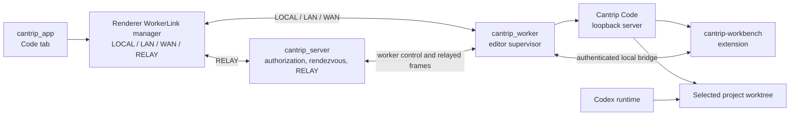

# Cantrip Code integration architecture

- Status: shared transport/session architecture implemented; final local soak
  and multi-platform QA remain
- Scope: browser-native Code OSS workbench hosted by `cantrip_worker`
- Source location: `cantrip_code/` in the Cantrip monorepo
- Immediate upstream: OpenVSCode Server
- Upstream editor: Code OSS

Global, end-to-end encrypted user settings and the folderless graphical
Settings workbench are documented in [CODE_SETTINGS.md](CODE_SETTINGS.md).

## 1. Decision

Cantrip maintains a thin, browser-native Code OSS distribution called
**Cantrip Code** directly in this monorepo under `cantrip_code/`. The fork uses
OpenVSCode Server as its immediate upstream and Code OSS as the underlying
editor. Cantrip does not embed Microsoft VS Code Server, depend on a user's
desktop VS Code installation, or use CDP pixel streaming as the primary editor
experience.

Cantrip Code is part of the worker release. Each worker package contains the
exact editor build tested with that worker's protocol and bundled Cantrip
extension. The editor cannot independently update itself or advance its
upstream revision at runtime. Updating Cantrip Code is an explicit Cantrip
source change, review, and release operation.

This approach provides a real browser-rendered workbench with crisp text,
clipboard and input-method support, accessibility, integrated terminals, Git,
extensions, and editor webviews while preserving Cantrip's server-authorized,
worker-owned architecture. WorkerLink may carry approved bytes directly over
LOCAL, LAN, or WAN, with server RELAY as the final route.

## 2. Goals

- Add a first-class `Code` project tab alongside Chat, Terminal, Explorer,
  History, Issues, and Browser.
- Host the editor process on the worker that owns the selected project files.
- Bind each Code tab to a specific project, worker, and worktree.
- Keep settings, extensions, editor state, and workspace state on the worker.
- Allow Codex and the editor to operate on the same saved filesystem without
  introducing a second conversation or agent control plane.
- Synchronize Cantrip themes, external agent edits, dirty-buffer state, active
  files, selections, Git state, and worktree identity through a bundled
  extension.
- Route all authorization through `cantrip_server`; carry remote access over an
  exact WorkerLink tunnel grant using LOCAL, LAN, WAN, or RELAY.
- Keep upstream merges repeatable and reviewable with pinned revisions,
  scripted imports, a minimal ordered patch set, and compatibility checks.
- Compile Cantrip Code during Cantrip builds and bundle it into the matching
  worker artifact. No production worker downloads or builds the editor on first
  use.

## 3. Non-goals

- Reproducing Microsoft-branded VS Code Server or depending on its hosted-use
  license.
- Sharing or modifying a user's live desktop VS Code profile in place.
- Automatically following OpenVSCode Server or Code OSS release channels.
- Committing compiled editor bundles, dependency caches, or packaged workers to
  Git.
- Making unsaved editor buffers directly visible to Codex in the first release.
- Turning the editor into a separate Cantrip control plane.
- Using CDP screencasting as the default editor transport. It remains only a
  possible diagnostic or unsupported-platform fallback.

## 4. Monorepo layout

```text
Cantrip/
├── cantrip_app/
├── cantrip_server/
├── cantrip_worker/
├── cantrip_code/
│   ├── extensions/
│   │   └── cantrip-workbench/
│   ├── patches/
│   ├── resources/
│   ├── scripts/
│   └── upstream.json
├── packages/
│   └── protocol/
├── scripts/
│   └── cantrip-code/
│       ├── fetch-upstream.mjs
│       ├── merge-upstream.mjs
│       ├── apply-patches.mjs
│       ├── verify-upstream.mjs
│       └── report-divergence.mjs
└── pnpm-workspace.yaml
```

`cantrip_code/` contains real source tracked by this repository. It is not a
Git submodule, a nested repository, a runtime checkout, or an optional external
dependency. Generated build output remains ignored.

## 5. Upstream and patch management

The upstream relationship is:

```text
Code OSS
  └── OpenVSCode Server
        └── Cantrip Code
```

The committed `cantrip_code/upstream.json` pins the exact revisions and Cantrip
patch-set version:

```json
{
  "schemaVersion": 1,
  "source": "https://github.com/gitpod-io/openvscode-server",
  "version": "<OpenVSCode version>",
  "ref": "<OpenVSCode release ref>",
  "openvscodeServerCommit": "<commit SHA>",
  "vscodeCommit": "<commit SHA>",
  "patchset": 1,
  "registry": "https://open-vsx.org"
}
```

An upstream update is a deliberate repository change:

1. Fetch the explicitly selected OpenVSCode Server revision.
2. Import it into `cantrip_code/` without touching unrelated monorepo files.
3. Record the corresponding Code OSS revision.
4. Produce a machine-readable and human-readable divergence report.
5. Reapply the ordered Cantrip patch series.
6. Restore or rebuild Cantrip-owned extensions, resources, and product data.
7. Run editor, worker, proxy, packaging, and integration validation.
8. Review and merge the update through the normal worktree and pull-request
   workflow.

The tooling must never silently select a newer revision. It should fail clearly
when patches no longer apply, expected upstream files move, product metadata is
incompatible, or the extension API changes.

Each direct upstream patch must include metadata explaining:

- why the change cannot live in `cantrip-workbench`;
- the upstream revision against which it was authored;
- the affected files and behavior;
- how to validate it; and
- whether it may be removed after a known upstream change.

Prefer extension APIs and product configuration over workbench modifications.
Expected direct patches are limited to concerns such as product branding,
proxy/base-path bootstrapping, secure Cantrip session initialization, framing
policy, bundled-extension registration, and server transport hooks.

## 6. Repository-size policy

The upstream source may be imported in mechanically identifiable chunks if a
single push becomes impractical. Suitable boundaries include manifests and
legal notices, build tooling, core source, workbench/server source, built-in
extensions, and Cantrip-owned integration files.

Chunking commits does not bypass GitHub's individual-file size limit. The
repository must therefore never track:

- compiled Cantrip Code distributions;
- packaged worker archives;
- `node_modules` or package-manager stores;
- editor caches and temporary build trees;
- generated source maps intended only for release artifacts; or
- downloaded toolchains and runtimes.

CI will reject oversized tracked files and verify the relevant ignore rules.
Packaged output belongs in CI artifacts, releases, and the Cantrip
distribution system rather than Git history. When a single mechanical upstream
snapshot pushes safely, retaining that clear import boundary is preferable to
arbitrary commit splitting.

## 7. Build and release policy

Cantrip Code is versioned as a component of the worker:

```text
Cantrip worker <version>
├── protocol <compatible version>
├── Cantrip Code <pinned revision>
├── cantrip-workbench <compatible version>
└── required runtime
```

A worker release must contain the Cantrip Code build for that worker's target
platform and architecture. It does not contain editor builds for every target.

```text
cantrip-worker-darwin-arm64/
├── bin/cantrip-worker
└── resources/
    └── cantrip-code/
        ├── bin/
        ├── out/
        ├── extensions/
        ├── product.json
        └── legal/
```

The worker verifies an embedded manifest before starting the editor and refuses
to launch an incomplete or incompatible build. Cantrip Code must not fetch a
new editor build, self-update, change extension API versions independently, or
follow Microsoft/OpenVSCode update channels.

Future worker updates carry Cantrip Code updates through the same signed worker
artifact and rollback mechanism. This preserves a tested compatibility unit and
prevents an upstream editor release from breaking an already-installed worker.

Packaging uses a target-oriented interface. Each native target must be built
on a matching host:

```bash
pnpm build
pnpm package:server --target linux-x64
pnpm package:worker --target darwin-arm64
pnpm package:worker --target linux-arm64
pnpm package:worker --target windows-x64
pnpm package:app --target darwin-arm64
```

## 8. Development workflow

Normal Cantrip development must not rebuild Code OSS for every application,
server, or worker edit. Local development uses a cached build keyed by the
pinned upstream revision, Cantrip patch set, bundled extension source, and
target platform.

```bash
pnpm code:build
pnpm code:dev
pnpm code:clean
pnpm code:verify
```

`pnpm dev` and `pnpm devtop`:

1. Determine the required Cantrip Code build fingerprint.
2. Reuse a matching cached build when present.
3. Build the required distribution automatically when it is missing or stale.
4. Print build progress while preparing a new distribution.

`pnpm devtop` is a deliberately local-only validation stack. It sets
`CANTRIP_LOCAL_ONLY=true` for the debug desktop shell, which prevents retained
linked-worker profiles from autostarting beside the local development worker.
This guard does not change packaged builds or ordinary non-local debug launches.

The implemented cache lives under ignored `.cantrip-code/cache/builds/`, shared
through Git's common repository directory so sequential worktrees reuse the
same artifact. `CANTRIP_CODE_CACHE_DIR` may override the shared state
root. The cache is keyed by the pinned source manifest, product overrides,
ordered patch series, bundled extension tree, build schema, platform, and
architecture. Its lightweight manifest records build identity, target,
entrypoint, and workbench compatibility metadata. Startup and packaging reject
only conditions that prevent the editor from running correctly; they do not
inventory or hash the distribution's files.

`pnpm code:dev` may run the editor-specific watch workflow when actively
developing the fork. Clean CI and release builds always compile from the pinned
source and verify that the working tree does not influence the artifact.

## 9. Runtime architecture



When an Explorer editor owner opens:

1. The server resolves the project, worker, worktree, profile, and authorization.
2. The server acquires the one transient shared transport root for the complete
   owner/authentication/server/worker/key identity, or reuses the exact current
   root.
3. The server asks the selected worker to open one logical editor session and
   installs an opaque, explicitly authorized route grant on the shared worker
   endpoint.
4. The worker verifies the embedded Cantrip Code distribution and creates or
   reuses the generated `.code-workspace` file.
5. The unlocked client supplies the transport's protected tunnel record and
   random data-plane key; the server persists only ciphertext and routing IDs.
6. The worker exposes one loopback transport endpoint. Requests beneath
   `/sessions/<opaque-grant>/code/` are dispatched only to the session on the
   server-controlled allowlist for that grant.
7. Tauri acquires one process-owned localhost forward bridged into the renderer
   WorkerLink manager. A browser renderer acquires one pooled WorkerLink-backed
   transport and exposes a separate same-origin adapter URL for each logical
   session.
8. LOCAL, LAN, WAN, and RELAY carry identical endpoint-encrypted inner tunnel
   frames; route mobility does not change the Code URL or protection.

The attachment URL carries the selected generated workspace path as an encoded
remote-workspace selector. It is not an editor credential; the browser's first
editor authentication message is translated to the raw process token only at
the authorized worker-local tunnel boundary.

The editor port and raw editor token are never exposed directly, and the server
never assumes it can open an inbound connection to a worker. One complete
security identity owns one project-agnostic physical Code transport in the
unified tunnel control plane. Every Explorer owner owns a separately revocable,
project/worktree-authorized logical session lease beneath that transport. A
tab close removes only its route grant and logical worker session. The physical
transport is released only after the final logical lease or an authoritative
worker/security identity change. HTTP and WebSocket bytes travel through the
same bounded stream identities, endpoint AEAD, credit flow control, routing,
disconnect cleanup, counters, and worker transport used by other protected
tunnels. Code-specific authentication and header translation exists only at
the trusted client and worker-local edges.

The worker-local endpoint performs base-path, header, CSP, and initial
WebSocket-auth translation. The dedicated server Code surface and plaintext
compatibility adapter no longer exist. The endpoint is bound to the shared
transport identity and an explicit route-grant allowlist. Knowing a session ID
or another route grant is not authorization. Removing one grant immediately
blocks new access to that session without rotating the endpoint or disturbing
other grants.

This extends the worker-owned surface principles in
[`adr/0002-worker-owned-remote-surfaces.md`](adr/0002-worker-owned-remote-surfaces.md),
while using browser-native rendering instead of a screencast canvas because
Cantrip controls the editor application and its framing behavior.

### Shared transport and logical-session ownership

The physical transport key is the canonical combination of:

```text
account/owner
+ authenticated connection and client-session generation/incarnation
+ logical server and normalized server URL
+ worker and worker-process generation
+ security scope and protected-key revision
+ server control-plane generation
```

Every field participates in equality. Logout/login as the same user, a new
client-session incarnation, server switch, worker replacement, control-plane
restart, or encryption-key rotation retires the old generation rather than
reusing it by user ID or tunnel ID alone.

The server owns a transient transport root and exact per-session leases. The
worker owns `transport -> authorized route grant -> Code session` mappings.
The desktop process owns the physical native forward and hands exact
generation-fenced leases to renderers. A browser renderer pools one
WorkerLink reference and reliable tunnel stream while retaining a separate
adapter, route base, HTTP budget, socket budget, and exact iframe binding for
each session. React mounts and tab preview/pin state are consumers; none is the
source of physical transport truth. Operational values read by asynchronous
editor work synchronize only after React commits, so a speculative or
abandoned render cannot change a live session open or recovery decision.

Browser public URLs remain
`/__cantrip_code/<adapter-id>/code/...`. The internal route grant never appears
in that URL, the service-worker protocol, logs, or the generated workbench base
path. The app rewrites the virtual path to the opaque session route only at the
trusted tunnel edge. Service-worker HTTP routing uses a private,
generation-fenced `MessagePort` registered by a same-origin top-level client.
Registration also creates a random browser-local root lease; the service worker
requires that lease for the first navigation and every root replacement, then
strips it before the request enters the physical tunnel. The lease is not a
server credential and adapter UUID knowledge alone cannot mint it. The worker
binds accepted navigation to the exact frame client and rejects unregistered or
sibling-frame requests. Authorized HTML contains a private
adapter-generation, frame-nonce, and root-lineage tuple. The injected shim
wraps OpenVSCode's module/classic `blob:` workers and registers each exact
worker client before importing the original blob, buffering early message and
connect events until authorization completes. The wrapper clones known object
URLs before user code can revoke them and reuses one stable wrapper URL for an
equivalent `SharedWorker`, preserving native worker lifetime and identity
semantics. Nested blob workers inherit the same bounded lineage. Root
replacement rotates a lineage epoch and revokes the old descendant set;
in-flight HTTP contexts from the old epoch are canceled before response
lineage can be injected, and pending recovery challenges resolve closed rather
than surviving an epoch change. Terminated clients are pruned before enforcing
the hard bound, and every asynchronous admission rechecks that epoch after
yielding. Workbench WebSocket
commands and events carry the exact adapter generation and frame nonce in
addition to being bound to the iframe `WindowProxy`; replacing the frame
retires only its pending/live child sockets. Service-worker process restart
performs bounded adapter recovery and then challenges the exact requesting
`Client` for the private lineage tuple before readmitting it. Adapter UUID or
virtual-URL knowledge can request recovery but never grants access. Recovery
discovery broadcasts only a SHA-256 adapter fingerprint, and the page accepts
it only from its current controller before matching it to a locally owned
adapter. Pages still controlled by the pre-v2 worker wait until the registered
protocol-v2 replacement actually controls the page rather than registering an
adapter with a non-controlling worker. A controlling-worker change proactively
restores all live adapters without replacing their sessions or transport.

The browser pool keeps a keyed closing barrier through final attachment
deletion. A same-identity reopen waits for that exact generation to finish, so
old and replacement physical transports never overlap. Late releases remain
entry, generation, transport, and lease fenced and cannot affect the
replacement.

Pooling is renderer-local in a web browser. Multiple browser windows still
share the one server transport root, worker endpoint/listener, Code process,
and logical-session authority, but each window has one independently owned
WorkerLink reference and tunnel stream. Sharing one JavaScript transport across
browser processes would require a `SharedWorker` or equivalent browser broker
and is not implied by a module-global map. Tauri ownership is below React and
process-wide, so desktop windows and pop-outs share the native forward.

The normal Explorer path requires shared transport protocol v2. Legacy
one-tunnel ownership is entered only for the explicit machine-readable
compatibility codes `shared-code-transport-requires-single-server` and
`shared-code-transport-unsupported`; generic conflicts, authorization
failures, missing resources, and network failures never downgrade. Dedicated
durable Code-tab and global Code-settings surfaces still use their existing
narrow legacy contracts because their server resources are not Explorer
logical-session leases. They do not participate in Explorer pooling and must
not be mistaken for a compatibility fallback inside the v2 Explorer path.

## 10. Isolation and security

Cantrip Code and its extensions execute with the same practical trust level as
a worker terminal. The UI must communicate that the editor can read, modify,
execute, and delete files, start processes, read credentials available to the
worker account, and use the worker's network.

Required controls include:

- bind the editor server to loopback on a random port;
- use short-lived, session-specific attachment credentials;
- map every proxy token to one known tunnel attachment, worker, Code tab, and
  editor session, and reject arbitrary proxy destinations or mismatched tab and
  session identities;
- keep raw editor and extension-host credentials worker-local;
- translate the browser's initial editor authentication frame only inside the
  authorized worker tunnel, so attachment clients never receive the raw editor
  connection token;
- isolate editor content from Cantrip API and cookie authority despite the
  same-origin virtual URL;
- never forward Cantrip application cookies to the editor;
- disable Workspace Trust prompts and treat Cantrip-selected roots as trusted;
- log session lifecycle without logging tokens or extension secrets; and
- revoke attachments when the tab, account session, worker, or editor session
  is stopped.

Browser Code is materialized beneath the web-app origin at
`/__cantrip_code/<adapter>/code/` by a service-worker-backed virtual adapter.
Its protected HTTP and WebSocket traffic travels through the authorized
WorkerLink and worker-local translation boundary. Native clients use a loopback
forward. Hosted deployments must not configure a second public Code hostname,
listener, or upstream. Exact adapter/root/iframe bindings, CSP, and the absence
of reusable Cantrip credentials at the editor boundary provide the isolation;
an application-origin path alone is not authority.

## 11. Worker-owned state

The packaged editor is immutable. Mutable editor state remains in the worker's
data directory:

```text
worker-data/
└── code/
    ├── profiles/<profile-id>/
    │   ├── user-data/
    │   └── extensions/
    ├── workspaces/<project-id>/<worktree-id>.code-workspace
    ├── sessions/<session-id>/
    ├── state/
    └── logs/
```

Generated workspace files remain outside the cloned repository so opening an
editor does not dirty Git. The initial profile model is one persistent Cantrip
Code profile per Cantrip user and worker, with optional additional profiles as
a later feature.

The first-run flow may offer to import selected settings and an extension list
from a local VS Code installation. It must not reuse or copy a live native
`user-data-dir` wholesale. Cantrip-owned profiles avoid profile locks,
incompatible storage, accidental credential copying, and corruption.

Open VSX is the default extension registry. Users may install a local VSIX after
an explicit action. Microsoft Marketplace access and proprietary Microsoft
extensions require separate licensing review and are not assumed by this plan.

### Global customization surface

**Settings → Code** owns a sub-tab bar for native Code OSS **Settings** and
**Extensions**. Both presentations share one retained folderless settings
session, iframe, protected attachment, worker connection, and Code process.
Authenticated bridge controls switch the existing workbench in place and
restore the selected presentation after reload, recovery, or reconnect. The
visible worker selector chooses the worker-local profile; changing it retires
the previous attachment before opening the replacement.

The Extensions presentation exposes only the primary Extensions sidebar,
extension detail editors, and required native dialogs, progress, notifications,
and reload/restart prompts. Other workbench chrome remains hidden. A settings
CAS conflict blocks only the Settings presentation and cannot block worker-local
extension management.

Extension lifecycle is native Code OSS: Open VSX search, install/uninstall,
global enable/disable, manual update checking and Update All, prerelease
selection, and VSIX installation. Auto-check and auto-install are pinned off,
recommendations are suppressed, and workspace-only enablement actions are
removed from this folderless presentation. Required Cantrip bridge and theme
extensions are forced enabled and protected below the UI against disable,
uninstall, replacement, downgrade, VSIX/gallery collision, and profile import.

Native VSIX selection remains preferred. Because it relies on browser file
system APIs unavailable on supported WebKit/mobile surfaces, Cantrip provides a
16 MiB single-file fallback matching the protected browser request boundary. It
sends the package directly through the authenticated attachment to a
mode-`0600` worker temporary file, invokes the
native Code OSS installer for validation and installation, then removes the
temporary directory on success, failure, or cancellation. Worker startup
clears crash remnants and replaces a stale upload-root symlink without following
it. The fallback accepts bytes from an explicit file choice, never an arbitrary
worker path or remote URL. Neither the package nor raw extension state crosses
the Cantrip server persistence boundary. See
[`CODE_SETTINGS.md`](CODE_SETTINGS.md) for the detailed data flow and validation
checklist.

## 12. Tabs, workers, and worktrees

`Code` is a durable project tab type with the same lifecycle expectations as
the other project tabs:

- rename and mixed drag sorting;
- desktop pop-out support;
- automatic reconnection;
- worker and worktree indicators;
- reload, restart editor, and stop editor actions; and
- server-owned tab metadata with worker-owned runtime state.

Each Code tab is pinned to one worker and worktree at a time. Opening another
worktree creates or retargets a Code tab with a different generated workspace.
An agent-managed worktree move does not silently retarget an already-open
editor; Cantrip prompts the user to switch that tab or open another one. This
avoids changing the meaning of open editors and terminals unexpectedly.

The worktree identity and rules follow [`WORKTREES.md`](WORKTREES.md) and
[`adr/0001-agent-managed-worktree-execution.md`](adr/0001-agent-managed-worktree-execution.md).

## 13. Cantrip workbench extension

`cantrip-workbench` is bundled and versioned with the worker/editor pair. It
communicates with the worker over an authenticated local socket and is the
preferred location for Cantrip-specific behavior.

The worker compatibility manifest records the bundled extension version and
editor build metadata. Worker startup verifies that the matching
`extensions/cantrip-workbench/package.json` is present before an editor may
launch. The extension bridge accepts only its per-session token on a random
loopback listener and bounds incoming messages.

Initial responsibilities:

- report dirty and unsaved editors;
- execute `Save All` before an agent turn when configured;
- notify editors about external filesystem changes after agent writes;
- report the active file and selection;
- synchronize Cantrip light, dark, and high-contrast themes;
- expose current worker, project, branch, and worktree identity;
- surface Git status changes;
- show agent-edit and save-conflict warnings; and
- provide Cantrip commands and status items without deeply patching the
  workbench.

Conversation history and agent execution remain owned by the server and worker.
The extension reports editor context and coordinates filesystem safety; it does
not send model requests or become an alternative route to Codex.

The extension starts its authenticated bridge connection immediately after
registering its commands. Presentation and layout initialization proceeds
independently, so it cannot serialize bridge availability behind nonessential
workbench chrome. Active-editor state includes the exact URI, workspace-relative
path, selection, and a topology proof only when one active group contains one
active tab for that resource. The worker accepts that state only from the current
authoritative authenticated socket.

## 14. Saved-file and agent coordination

Codex and Cantrip Code operate on the same selected worktree, so saved edits and
Git operations become visible to both through the filesystem. Unsaved buffers
require an explicit policy.

The initial default is `save before agent turn`:

1. Before dispatching a turn, the worker asks the extension for dirty editors.
2. The extension saves them when the user's policy allows automatic saving.
3. If saving fails or the policy requires confirmation, the chat reports the
   blocking files instead of silently racing the agent.
4. The worker starts the turn only after the saved-file boundary is established.
5. Agent file events cause the extension to refresh affected clean buffers and
   warn before replacing a dirty buffer.

Direct access to unsaved in-memory editor contents may be designed later. It is
not required for the first implementation.

The implemented turn boundary asks every open Code session for the selected
worktree to prepare before the server acquires the chat execution lane. The
extension's `always`, `ask`, and `never` policies either save, block with the
affected editors, or explicitly permit the turn. Agent file-change activity is
collected during the turn and returned to each matching editor at completion;
clean buffers use the workbench file watcher and Explorer/Git refresh, while
dirty overlaps remain untouched and are surfaced as conflicts.

## 15. Theme behavior

Cantrip Code always follows the active Cantrip appearance. Light, Dark, High
Contrast Light, and High Contrast Dark map to matching themes bundled with
`cantrip-workbench`; there is no independent per-tab editor theme mode.

The worker writes the matching theme into the generated workspace without
overwriting the user's global editor preference. It also retains the current
appearance in the authenticated workbench bridge, broadcasts changes to every
main-window or pop-out surface for the session, and reapplies it whenever a
surface reconnects. This makes a late extension startup or transient bridge
disconnect converge on the current Cantrip theme instead of retaining a stale
editor appearance.

## 16. Protocol and persistence additions

Worker capability negotiation should report at least:

```text
code.available
code.version
code.upstreamRevision
code.patchset
code.transport = web-proxy
```

Initial worker operations:

```text
code.probe
code.open
code.status
code.stop
code.saveAll
code.getDirtyEditors
code.setTheme
code.prepareAgentTurn
code.agentTurnState
```

The server stores durable Code-tab metadata and attachment state, while the
worker owns process, profile, workspace, and filesystem state. A session record
must identify its project, worker, worktree, profile, editor build, lifecycle
status, last attachment, and last error without storing editor credentials.

## 17. Lifecycle

- Worker startup prewarms the one compatible Code process/profile and keeps it
  alive for that worker process's lifetime; editor ownership never stops it.
- Opening an Explorer owner creates one logical session/route and acquires the
  existing physical transport generation.
- Reloading the app reattaches to the existing session when possible.
- A crashed editor is relaunched with the same profile and generated workspace.
- Closing a tab releases only its adapter, exact transport lease, route grant,
  and logical session. Other sessions and the Code process remain untouched.
- Releasing the final session releases the shared transport root; it does not
  stop the worker-lifetime Code process.
- An explicit session stop terminates that logical session, not the shared
  process while the worker remains online.
- Worker shutdown terminates editor processes cleanly.
- A worker update replaces the embedded editor and performs compatible profile
  migrations before accepting Code sessions.
- Main and pop-out windows may attach concurrently to the same worker-owned
  editor session. Each renderer receives its own short-lived surface attachment
  and releases it when the view closes or switches tabs.
- The shared physical Code transport remains available while at least one
  logical session lease exists; releasing the last lease removes its managed
  ephemeral tunnel and worker endpoint without stopping the Code process.

### Authoritative transport and logical-session lifetimes

One protected Code transport is the Code physical lifetime root. Its
opaque generation is bound to the logical server, owner/account,
authentication session, protected-content key revision, worker, server
control-plane generation, and worker-process generation captured when the root
is created. Project, Explorer, worktree, Code runtime, and route-grant authority
remain on each logical Code session lease beneath that root. Those Code
root/session leases are fenced by the Code transport generation. The shared
WorkerLink session plus its grants and streams have independent leases and may
serve other consumers. A client heartbeat never supplies an expiry or security
identity.

The desktop reports active attachment health through the route-independent
lease path. WorkerLink separately renews the exact server/owner/account
session/client/worker-generation authority and resource grant. Native forwards
rotate short-lived, generation-scoped bridge claims without changing their
stable listener. A transient renewal failure preserves still-valid authority
for bounded retry. Code-root authority expiry or replacement retires that root
and its Code children. WorkerLink session, grant, attachment, or stream
expiry/revocation retires the affected attachment or stream but does not by
itself retire the server Code root. Attachment credential rotation may replace
the attachment ID beneath the same browser client and Code root.

Reliable Code streams stay pinned to their current carrier while healthy. On
carrier failure, the owner reacquires current exact attachment authority and
opens a replacement stream through the best available LOCAL, LAN, WAN, or RELAY
route. Newly opened streams use a newly available better route; ordinary
carrier readiness, promotion, and demotion do not mutate the server-authorized
route generation.

Multi-replica deployments route WorkerLink coordination and RELAY frames to the
owning server process. Explorer shared Code v2 remains process-local, however:
when relay coordination is enabled, its shared attachment route rejects with
`shared-code-transport-requires-single-server`. Shared Code v2 therefore
requires process-local mode with relay coordination disabled. A deliberately
affinity-routed deployment works only if coordination is also disabled; sticky
requests do not bypass the current coordinator gate. An explicit compatibility
path may instead enter legacy one-tunnel ownership.

### Worker command reconnect continuity

The command channel has two distinct loss states. A raw WebSocket close first
enters a 15-second `reconnecting` grace. Existing Code roots, WorkerLink
sessions, resource grants, tunnel endpoints, and their worker-side destinations
remain allocated, but new commands fail while no socket is connected. A
terminal `offline` event is emitted only when that grace expires or the
lifecycle is explicitly revoked. Resource owners subscribe to terminal offline
state; diagnostics and connection indicators may still observe the immediate
raw interruption.

Reconnect reuse requires the exact authenticated owner, credential identifier,
and worker-process connection generation. The worker creates the opaque random
generation once per process and reuses it for every socket attempt. A matching
reconnect cancels only the cleanup timer for that generation. Owner, credential,
or process-generation mismatch first retires the old lifecycle completely;
authentication rejection and explicit shutdown also bypass grace. Legacy
workers that omit the generation can still connect, but the server treats each
socket as an unverifiable lifecycle and does not promise resource continuity.

All socket input is fenced by the currently attached socket, and all deferred
cleanup and coordinated relay presence work is fenced by its connection/claim
generation. Repeated failed retries cannot extend the original grace deadline.
Generation-aware workers offer explicit legacy and authenticated-ready
WebSocket subprotocols. Older servers keep their default first-protocol
selection and therefore preserve their original raw-open behavior; the current
server selects `cantrip-worker-auth-ready-v1` only for the worker command route.
Other WebSocket routes retain first-offered selection so tunnel-secret
subprotocols are unchanged. Under the authenticated-ready protocol, raw
WebSocket open begins only protocol negotiation. The server advertises
`pending` before asynchronous authentication, then queues `ready` before the
socket becomes command-visible after owner validation and atomic local/shared
bridge attachment. WebSocket ordering therefore prevents a command from
overtaking readiness. Until it receives matching, ordered `pending` and `ready`
messages, the worker keeps command outcomes queued, does not start keepalive or
data-plane traffic, and does not cancel its original grace deadline. Older
workers omit the generation and receive no new handshake messages.

Legacy workers may still flush on raw open, so the server retains a bounded
compatibility buffer until bridge subscriptions exist. Each socket is limited
to 1,024 events or 8 MiB, with a 64 MiB process-wide byte budget, at most 32
pending handshakes, and a 10-second socket deadline. A dead, timed-out, or
overflowing socket is rejected before it can activate, reset grace, or commit a
relay claim. Exact claim rollback and socket/attachment-generation fences make
late async completions harmless. No credential, token, payload, or protected
path is added to lifecycle telemetry.

### Retained workbench and route continuity

Explorer owns one inline workbench for each exact Explorer/worktree security
identity. The identity includes the logical server, owner/account,
authentication and encryption revision, worker, Explorer, and worktree. The
client gives prewarm permission only to the existing two-owner sidebar preview
pool. Each explicit owner may start its actual workbench without selecting a
file, retain its attachment and iframe while hidden, and reveal the same frame
for its first selection. Pinning preserves the promoted live owner and starts
the bounded successor in the vacated pool slot. Ordinary inactive, pinned, and
durable Code tabs do not inherit this permission and remain dormant until
activated. The idle retention deadline is 30 minutes; explicit close, bounded
expiry, or any identity change retires an owner. Online worker transitions wake
bounded recovery automatically. Pop-outs remain separate renderer owners and
do not create a competing hidden prewarm for the inline Explorer surface.

When a session has an initial file, the worker first resolves its canonical
real path, verifies that it is a regular file inside the authorized workspace,
and then freezes that file into the attachment's OpenVSCode startup URL. Raw
renderer workspace and startup selectors are rejected. OpenVSCode may therefore
load the file while the workbench starts on any authorized WorkerLink carrier.
The first matching navigation may omit the later bridge `openFile`
command only when the current authenticated extension socket reports the same
relative path and equivalent canonical file URI with a reconciled one-group,
one-tab topology. That startup candidate is consumed once. Missing or
mismatched state and every later navigation retain the existing acknowledged
bridge command.

The sidebar keeps populated file-tree rows and expansion state mounted during a
pin handoff; only the existing path-level pin indicator changes. A whole-tree
loading replacement remains reserved for genuine initial Explorer or directory
loading.

The workbench bridge carries a generation and uses bounded ping/ack liveness.
A stale bridge reconnects beneath the retained profile, session, attachment,
route, and iframe when those owners are still valid. File-open, presentation,
theme, and recovery operations have bounded deadlines and cancellation. Theme
updates are sent in-band, and presentation is only changed when the requested
state differs.

Native route health probes the protected data plane. A failed carrier reacquires
current attachment authority and reconnects on the same native listener without
changing the protected attachment, worker Code session, workbench URL, or
iframe. Reliable streams remain pinned while healthy; new or reopened streams
use the best currently available LOCAL, LAN, WAN, or RELAY route. Native and
worker command WebSockets require Pong within a deadline. Multiplexed streams
use bounded queues, explicit credit and backpressure, and per-stream
cancellation so one congested connection does not retire healthy siblings.

Browser Code uses the same protected transport identity through its same-origin
service worker and WebSocket shim. One renderer-local WorkerLink reference and
reliable tunnel stream serve all matching Explorer logical sessions. Each
session has its own random public adapter URL, private
generation-fenced `MessagePort`, browser-local root-navigation lease, opaque
internal route grant, exact iframe binding, and per-session HTTP/WebSocket
budgets. Open/readiness,
heartbeat/Pong, reconnect, send queues, and buffered-byte accounting are
bounded. Service-worker restart re-registers the private adapters while keeping
the WorkerLink and logical server sessions. A valid reconnect keeps the existing
transport; lease or security-identity expiry ends only the exact affected
generation.

Editor-only file navigation is transient and does not rewrite workspace or
runtime persistence that is excluded from restoration. Durable workbench
navigation and genuine presentation changes remain persisted. Generated
workspace/session artifacts are removed only at final retirement, never while
owned by a live or reconnecting session.

Local macOS functional acceptance confirmed warm file switching in the retained
editor-only workbench. Deterministic tests cover 2/5/10/16-minute retention,
14.5/15.1-second readiness fencing, one-second worker reconnect, reconnect-grace
cleanup, identity retirement, hidden/selected inline ownership, pop-out
ownership, WorkerLink carrier failure/reconnect and route selection, and sidebar
online retry. The user waived a fresh real-time long-idle UI soak, so no measured
sub-second 2/5/10/16-minute result is claimed. Multi-platform and multi-replica
real-environment QA remain open.

Concurrent views share the editor process, persistent profile, generated
workspace, and filesystem state without transferring control between windows.
Expired or revoked surface attachments render a bounded recovery document that
asks their owning app view to obtain a fresh credential.

The worker persists only non-secret session identity and reconstructs compatible
sessions as offline after restart. A new authorized attachment lazily relaunches
the immutable editor with its existing profile and generated workspace. Active
tunnel streams prevent eviction; after the last stream closes, the editor stays
warm for `CANTRIP_CODE_IDLE_TIMEOUT_MS` and is then reclaimed without deleting
profile, extension, or workspace state. Every editor runs beneath a detached
process guard that terminates the complete editor process group if its worker
parent disappears, including abrupt supervisor or desktop-shell termination.

## 18. Historical implementation phases

The following phases record the delivery plan used before the current Cantrip
Code implementation. They are not a current feature inventory or an open gate.

### Phase 0: licensing, import, and prototype gate

- Record upstream licenses and notices.
- Establish `cantrip_code/`, pinned upstream metadata, sync scripts, patch
  conventions, and ignored build paths.
- Build OpenVSCode Server from the monorepo on one supported development target.
- Open one Cantrip worktree through an authenticated WorkerLink tunnel.
- Embed the browser-native workbench in a Code tab.

### Phase 1: tab and runtime lifecycle

- Add Code-tab protocol and persistence.
- Supervise the worker-local editor process.
- Generate per-worktree workspace files.
- Add attachment, reconnect, restart, idle shutdown, and stop behavior.

### Phase 2: profiles and theme integration

- Persist worker-owned settings and extensions.
- Add Open VSX and explicit VSIX installation.
- Add optional settings/extension-list import.
- Bundle Cantrip themes and keep every Code surface synchronized with Cantrip.

### Phase 3: agent/editor bridge

- Bundle `cantrip-workbench`.
- Add dirty-buffer reporting and save-before-turn behavior.
- Synchronize external file changes, active file, selection, Git status, and
  worktree identity.
- Add conflict and agent-edit notifications.

### Phase 4: packaging and supported targets

- Compile Cantrip Code as part of each worker target build.
- Embed and read the editor compatibility manifest in worker artifacts.
- Exercise macOS, Linux, and Windows targets and supported architectures.
- Integrate editor compatibility into worker updates and rollback design.

### Phase 5: multi-worker and multi-client hardening

- Validate offline and reconnect behavior across remote workers.
- Add control leases and explicit read-only attachments where appropriate.
- Test simultaneous app, desktop pop-out, web, and mobile clients.
- Measure tunnel backpressure, process limits, idle eviction, and recovery.

## 19. Historical prototype acceptance gate

This gate records the prototype criteria used during implementation. Current
upstream updates are governed by the live acceptance gate in section 20.

The project should not proceed beyond the prototype until it demonstrates:

- browser-native DOM rendering rather than image streaming;
- working terminal, Git, search, Markdown preview, editor webviews, and extension
  host;
- working clipboard, keyboard shortcuts, input methods, accessibility, and
  drag-and-drop;
- Cantrip menus and dialogs rendering above the embedded surface;
- settings and extensions surviving app, server, worker, and editor restarts;
- exact project/worktree isolation;
- refresh and reconnect without exposing a raw worker port;
- an origin isolated from Cantrip application APIs and credentials;
- a clean build from pinned monorepo source; and
- a worker package containing the exact tested editor build.

## 20. Upstream-update acceptance gate

A Cantrip Code upstream update cannot merge until:

- the pinned revision and license inventory are updated;
- all Cantrip patches apply or are deliberately rewritten;
- the divergence report contains no unexplained changes;
- `cantrip-workbench` builds against the new extension API;
- HTTP and WebSocket proxying works through the protected WorkerLink tunnel;
- terminal, Git, search, Markdown, webviews, and extension host pass smoke tests;
- Tauri embedding and pop-out windows work;
- Cantrip menus continue to overlay the editor surface;
- theme synchronization works in all appearance modes;
- settings and extensions survive restart;
- dirty-buffer protection and agent file refresh work;
- each supported worker target packages successfully; and
- the previous worker/editor release remains available for rollback.

The resulting editor is therefore an immutable, reviewed component of a
specific worker release: source-owned by the Cantrip monorepo, upstreamed by
explicit scripts and patches, and updated only when Cantrip itself is updated.
