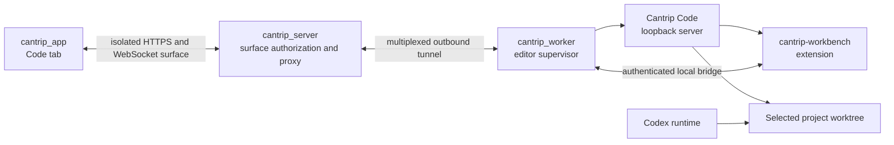

# Cantrip Code Integration Plan

- Status: implementation in progress
- Scope: browser-native Code OSS workbench hosted by `cantrip_worker`
- Source location: `cantrip_code/` in the Cantrip monorepo
- Immediate upstream: OpenVSCode Server
- Upstream editor: Code OSS

## 1. Decision

Cantrip will maintain a thin, browser-native Code OSS distribution called
**Cantrip Code** directly in this monorepo under `cantrip_code/`. The fork will
use OpenVSCode Server as its immediate upstream and Code OSS as the underlying
editor. Cantrip will not embed Microsoft VS Code Server, depend on a user's
desktop VS Code installation, or use CDP pixel streaming as the primary editor
experience.

Cantrip Code is part of the worker release. Each worker package contains the
exact editor build tested with that worker's protocol and bundled Cantrip
extension. The editor cannot independently update itself or advance its
upstream revision at runtime. Updating Cantrip Code is an explicit Cantrip
source change, review, and release operation.

This approach provides a real browser-rendered workbench with crisp text,
clipboard and input-method support, accessibility, integrated terminals, Git,
extensions, and editor webviews while preserving Cantrip's server-routed,
worker-owned architecture.

## 2. Goals

- Add a first-class `Code` project tab alongside Chat, Terminal, Explorer,
  History, Issues, and Browser.
- Host the editor process on the worker that owns the selected project files.
- Bind each Code tab to a specific project, worker, and worktree.
- Keep settings, extensions, editor state, and workspace state on the worker.
- Allow Codex and the editor to operate on the same saved filesystem without
  introducing a second conversation or agent control plane.
- Synchronize Cantrip themes, external agent edits, dirty-buffer state, active
  files, selections, Git state, and worktree identity through a bundled
  extension.
- Route all remote access through `cantrip_server`; the app must never connect
  directly to a worker.
- Keep upstream merges repeatable and reviewable with pinned revisions,
  scripted imports, a minimal ordered patch set, and compatibility checks.
- Compile Cantrip Code during Cantrip builds and bundle it into the matching
  worker artifact. No production worker downloads or builds the editor on first
  use.

## 3. Non-goals

- Reproducing Microsoft-branded VS Code Server or depending on its hosted-use
  license.
- Sharing or modifying a user's live desktop VS Code profile in place.
- Automatically following OpenVSCode Server or Code OSS release channels.
- Committing compiled editor bundles, dependency caches, or packaged workers to
  Git.
- Making unsaved editor buffers directly visible to Codex in the first release.
- Turning the editor into a separate Cantrip control plane.
- Using CDP screencasting as the default editor transport. It remains only a
  possible diagnostic or unsupported-platform fallback.

## 4. Monorepo layout

```text
Cantrip/
├── cantrip_app/
├── cantrip_server/
├── cantrip_worker/
├── cantrip_code/
│   ├── extensions/
│   │   └── cantrip-workbench/
│   ├── patches/
│   ├── resources/
│   ├── scripts/
│   └── upstream.json
├── packages/
│   └── protocol/
├── scripts/
│   └── cantrip-code/
│       ├── fetch-upstream
│       ├── merge-upstream
│       ├── apply-patches
│       ├── verify-upstream
│       └── report-divergence
└── pnpm-workspace.yaml
```

`cantrip_code/` contains real source tracked by this repository. It is not a
Git submodule, a nested repository, a runtime checkout, or an optional external
dependency. Generated build output remains ignored.

## 5. Upstream and patch management

The upstream relationship is:

```text
Code OSS
  └── OpenVSCode Server
        └── Cantrip Code
```

The committed `cantrip_code/upstream.json` pins the exact revisions and Cantrip
patch-set version:

```json
{
  "openvscodeServer": "<commit SHA>",
  "vscode": "<commit SHA>",
  "cantripPatchset": 1
}
```

An upstream update is a deliberate repository change:

1. Fetch the explicitly selected OpenVSCode Server revision.
2. Import it into `cantrip_code/` without touching unrelated monorepo files.
3. Record the corresponding Code OSS revision.
4. Produce a machine-readable and human-readable divergence report.
5. Reapply the ordered Cantrip patch series.
6. Restore or rebuild Cantrip-owned extensions, resources, and product data.
7. Run editor, worker, proxy, packaging, and integration validation.
8. Review and merge the update through the normal worktree and pull-request
   workflow.

The tooling must never silently select a newer revision. It should fail clearly
when patches no longer apply, expected upstream files move, product metadata is
incompatible, or the extension API changes.

Each direct upstream patch must include metadata explaining:

- why the change cannot live in `cantrip-workbench`;
- the upstream revision against which it was authored;
- the affected files and behavior;
- how to validate it; and
- whether it may be removed after a known upstream change.

Prefer extension APIs and product configuration over workbench modifications.
Expected direct patches are limited to concerns such as product branding,
proxy/base-path bootstrapping, secure Cantrip session initialization, framing
policy, bundled-extension registration, and server transport hooks.

## 6. Repository-size policy

The upstream source may be imported in mechanically identifiable chunks if a
single push becomes impractical. Suitable boundaries include manifests and
legal notices, build tooling, core source, workbench/server source, built-in
extensions, and Cantrip-owned integration files.

Chunking commits does not bypass GitHub's individual-file size limit. The
repository must therefore never track:

- compiled Cantrip Code distributions;
- packaged worker archives;
- `node_modules` or package-manager stores;
- editor caches and temporary build trees;
- generated source maps intended only for release artifacts; or
- downloaded toolchains and runtimes.

CI will reject oversized tracked files and verify the relevant ignore rules.
Packaged output belongs in CI artifacts, releases, and the future Cantrip
distribution system rather than Git history. When a single mechanical upstream
snapshot pushes safely, retaining that clear import boundary is preferable to
arbitrary commit splitting.

## 7. Build and release policy

Cantrip Code is versioned as a component of the worker:

```text
Cantrip worker <version>
├── protocol <compatible version>
├── Cantrip Code <pinned revision>
├── cantrip-workbench <compatible version>
└── required runtime
```

A worker release must contain the Cantrip Code build for that worker's target
platform and architecture. It does not contain editor builds for every target.

```text
cantrip-worker-darwin-arm64/
├── bin/cantrip-worker
└── resources/
    └── cantrip-code/
        ├── bin/
        ├── out/
        ├── extensions/
        ├── product.json
        └── legal/
```

The worker verifies an embedded manifest before starting the editor and refuses
to launch an incomplete or incompatible build. Cantrip Code must not fetch a
new editor build, self-update, change extension API versions independently, or
follow Microsoft/OpenVSCode update channels.

Future worker updates carry Cantrip Code updates through the same signed worker
artifact and rollback mechanism. This preserves a tested compatibility unit and
prevents an upstream editor release from breaking an already-installed worker.

Expected packaging commands should converge on a target-oriented interface:

```bash
pnpm build
pnpm package:server --target linux-x64
pnpm package:worker --target darwin-arm64
pnpm package:worker --target linux-arm64
pnpm package:worker --target windows-x64
pnpm package:app --target darwin-arm64
```

## 8. Development workflow

Normal Cantrip development must not rebuild Code OSS for every application,
server, or worker edit. Local development uses a cached build keyed by the
pinned upstream revision, Cantrip patch set, bundled extension source, and
target platform.

```bash
pnpm code:build
pnpm code:dev
pnpm code:clean
pnpm code:verify
```

`pnpm dev` and `pnpm devtop` should:

1. Determine the required Cantrip Code build fingerprint.
2. Reuse a matching cached build when present.
3. Print a clear `pnpm code:build` instruction when it is missing or stale.
4. Avoid silently beginning a long Code OSS build as part of normal startup.

The implemented cache lives under ignored `.cantrip-code/cache/builds/`, shared
through Git's common repository directory so sequential worktrees reuse the
same immutable artifact. `CANTRIP_CODE_CACHE_DIR` may override the shared state
root. The cache is keyed by the pinned source manifest, product overrides,
ordered patch series, bundled extension tree, build schema, platform, and
architecture. Each cached distribution has a complete file inventory with
sizes, executable flags, and SHA-256 hashes. Development startup checks
identity and its entrypoint; release packaging and `code:verify` validate the
complete inventory.

`pnpm code:dev` may run the editor-specific watch workflow when actively
developing the fork. Clean CI and release builds always compile from the pinned
source and verify that the working tree does not influence the artifact.

## 9. Runtime architecture



When a Code tab opens:

1. The server resolves its project, worker, worktree, profile, and authorization.
2. The server asks the selected worker to open or resume an editor session.
3. The worker verifies the embedded Cantrip Code distribution.
4. The worker creates or reuses the generated `.code-workspace` file.
5. Cantrip Code binds to a random worker-loopback port.
6. The worker creates an authenticated outbound tunnel to the server.
7. The server issues a short-lived attachment URL on an isolated surface origin.
8. The app embeds that URL and reconnects through the server after transient
   disconnects.

The editor port is never exposed directly and the server never assumes it can
open an inbound connection to a worker. The HTTP and WebSocket tunnel is a
dedicated multiplexed streaming data plane rather than a sequence of ordinary
worker command messages.

This extends the worker-owned surface principles in
[`adr/0002-worker-owned-remote-surfaces.md`](adr/0002-worker-owned-remote-surfaces.md),
while using browser-native rendering instead of a screencast canvas because
Cantrip controls the editor application and its framing behavior.

## 10. Isolation and security

Cantrip Code and its extensions execute with the same practical trust level as
a worker terminal. The UI must communicate that the editor can read, modify,
execute, and delete files available to the worker account.

Required controls include:

- bind the editor server to loopback on a random port;
- use short-lived, session-specific attachment credentials;
- map every proxy token to one known worker process and reject arbitrary proxy
  destinations;
- keep raw editor and extension-host credentials worker-local;
- isolate editor content from the Cantrip application origin;
- never forward Cantrip application cookies to the editor;
- preserve workspace trust instead of silently disabling it;
- log session lifecycle without logging tokens or extension secrets; and
- revoke attachments when the tab, account session, worker, or editor session
  is stopped.

Hosted deployments should use a dedicated surface origin, such as a wildcard
surface subdomain. Local desktop deployments may use a separate loopback origin
or port. A path on the authenticated Cantrip application origin is insufficient
because editor content and third-party extensions must not inherit access to
Cantrip APIs or credentials.

## 11. Worker-owned state

The packaged editor is immutable. Mutable editor state remains in the worker's
data directory:

```text
worker-data/
└── code/
    ├── profiles/<profile-id>/
    │   ├── user-data/
    │   └── extensions/
    ├── workspaces/<project-id>/<worktree-id>.code-workspace
    ├── sessions/<session-id>/
    ├── state/
    └── logs/
```

Generated workspace files remain outside the cloned repository so opening an
editor does not dirty Git. The initial profile model is one persistent Cantrip
Code profile per Cantrip user and worker, with optional additional profiles as
a later feature.

The first-run flow may offer to import selected settings and an extension list
from a local VS Code installation. It must not reuse or copy a live native
`user-data-dir` wholesale. Cantrip-owned profiles avoid profile locks,
incompatible storage, accidental credential copying, and corruption.

Open VSX is the default extension registry. Users may install a local VSIX after
an explicit action. Microsoft Marketplace access and proprietary Microsoft
extensions require separate licensing review and are not assumed by this plan.

## 12. Tabs, workers, and worktrees

`Code` is a durable project tab type with the same lifecycle expectations as
the other project tabs:

- rename and mixed drag sorting;
- desktop pop-out support;
- automatic reconnection;
- worker and worktree indicators;
- reload, restart editor, and stop editor actions; and
- server-owned tab metadata with worker-owned runtime state.

Each Code tab is pinned to one worker and worktree at a time. Opening another
worktree creates or retargets a Code tab with a different generated workspace.
An agent-managed worktree move does not silently retarget an already-open
editor; Cantrip prompts the user to switch that tab or open another one. This
avoids changing the meaning of open editors and terminals unexpectedly.

The worktree identity and rules follow [`WORKTREES.md`](WORKTREES.md) and
[`adr/0001-agent-managed-worktree-execution.md`](adr/0001-agent-managed-worktree-execution.md).

## 13. Cantrip workbench extension

`cantrip-workbench` is bundled and versioned with the worker/editor pair. It
communicates with the worker over an authenticated local socket and is the
preferred location for Cantrip-specific behavior.

Initial responsibilities:

- report dirty and unsaved editors;
- execute `Save All` before an agent turn when configured;
- notify editors about external filesystem changes after agent writes;
- report the active file and selection;
- synchronize Cantrip light, dark, and high-contrast themes;
- expose current worker, project, branch, and worktree identity;
- surface Git status changes;
- show agent-edit and save-conflict warnings; and
- provide Cantrip commands and status items without deeply patching the
  workbench.

Conversation history and agent execution remain owned by the server and worker.
The extension reports editor context and coordinates filesystem safety; it does
not send model requests or become an alternative route to Codex.

## 14. Saved-file and agent coordination

Codex and Cantrip Code operate on the same selected worktree, so saved edits and
Git operations become visible to both through the filesystem. Unsaved buffers
require an explicit policy.

The initial default is `save before agent turn`:

1. Before dispatching a turn, the worker asks the extension for dirty editors.
2. The extension saves them when the user's policy allows automatic saving.
3. If saving fails or the policy requires confirmation, the chat reports the
   blocking files instead of silently racing the agent.
4. The worker starts the turn only after the saved-file boundary is established.
5. Agent file events cause the extension to refresh affected clean buffers and
   warn before replacing a dirty buffer.

Direct access to unsaved in-memory editor contents may be designed later. It is
not required for the first implementation.

## 15. Theme behavior

Code tabs expose an editor theme preference:

```text
Editor theme
  Follow Cantrip (default)
  Independent
```

Follow mode maps Cantrip Light, Dark, High Contrast Light, and High Contrast
Dark to matching bundled editor themes. The bridge applies this choice to the
generated workspace or session without overwriting the user's global editor
preference. Independent mode leaves all editor theme decisions to the user.

## 16. Protocol and persistence additions

Worker capability negotiation should report at least:

```text
code.available
code.version
code.upstreamRevision
code.patchset
code.transport = web-proxy
```

Initial worker operations:

```text
code.probe
code.open
code.status
code.stop
code.saveAll
code.getDirtyEditors
code.setTheme
```

The server stores durable Code-tab metadata and attachment state, while the
worker owns process, profile, workspace, and filesystem state. A session record
must identify its project, worker, worktree, profile, editor build, lifecycle
status, last attachment, and last error without storing editor credentials.

## 17. Lifecycle

- Opening a tab starts or reuses the compatible editor session.
- Reloading the app reattaches to the existing session when possible.
- A crashed editor is relaunched with the same profile and generated workspace.
- Closing a tab detaches the client but may keep the editor warm for a bounded
  idle period.
- An explicit `Stop editor` action terminates it immediately.
- Worker shutdown terminates editor processes cleanly.
- A worker update replaces the embedded editor and performs compatible profile
  migrations before accepting Code sessions.
- Multiple attached clients initially use a single control lease for operations
  where simultaneous input would be unsafe.

## 18. Implementation phases

### Phase 0: licensing, import, and prototype gate

- Record upstream licenses and notices.
- Establish `cantrip_code/`, pinned upstream metadata, sync scripts, patch
  conventions, and ignored build paths.
- Build OpenVSCode Server from the monorepo on one supported development target.
- Open one Cantrip worktree through an authenticated worker/server tunnel.
- Embed the browser-native workbench in a Code tab.

### Phase 1: tab and runtime lifecycle

- Add Code-tab protocol and persistence.
- Supervise the worker-local editor process.
- Generate per-worktree workspace files.
- Add attachment, reconnect, restart, idle shutdown, and stop behavior.

### Phase 2: profiles and theme integration

- Persist worker-owned settings and extensions.
- Add Open VSX and explicit VSIX installation.
- Add optional settings/extension-list import.
- Bundle Cantrip themes and implement follow/independent behavior.

### Phase 3: agent/editor bridge

- Bundle `cantrip-workbench`.
- Add dirty-buffer reporting and save-before-turn behavior.
- Synchronize external file changes, active file, selection, Git status, and
  worktree identity.
- Add conflict and agent-edit notifications.

### Phase 4: packaging and supported targets

- Compile Cantrip Code as part of each worker target build.
- Embed and verify the editor manifest in worker artifacts.
- Exercise macOS, Linux, and Windows targets and supported architectures.
- Integrate editor compatibility into worker updates and rollback design.

### Phase 5: multi-worker and multi-client hardening

- Validate offline and reconnect behavior across remote workers.
- Add control leases and explicit read-only attachments where appropriate.
- Test simultaneous app, desktop pop-out, web, and mobile clients.
- Measure tunnel backpressure, process limits, idle eviction, and recovery.

## 19. Prototype acceptance gate

The project should not proceed beyond the prototype until it demonstrates:

- browser-native DOM rendering rather than image streaming;
- working terminal, Git, search, Markdown preview, editor webviews, and extension
  host;
- working clipboard, keyboard shortcuts, input methods, accessibility, and
  drag-and-drop;
- Cantrip menus and dialogs rendering above the embedded surface;
- settings and extensions surviving app, server, worker, and editor restarts;
- exact project/worktree isolation;
- refresh and reconnect without exposing a raw worker port;
- an origin isolated from Cantrip application APIs and credentials;
- a clean build from pinned monorepo source; and
- a worker package containing the exact tested editor build.

## 20. Upstream-update acceptance gate

A Cantrip Code upstream update cannot merge until:

- the pinned revision and license inventory are updated;
- all Cantrip patches apply or are deliberately rewritten;
- the divergence report contains no unexplained changes;
- `cantrip-workbench` builds against the new extension API;
- HTTP and WebSocket proxying works through the worker/server tunnel;
- terminal, Git, search, Markdown, webviews, and extension host pass smoke tests;
- Tauri embedding and pop-out windows work;
- Cantrip menus continue to overlay the editor surface;
- theme synchronization works in all appearance modes;
- settings and extensions survive restart;
- dirty-buffer protection and agent file refresh work;
- each supported worker target packages successfully; and
- the previous worker/editor release remains available for rollback.

The resulting editor is therefore an immutable, reviewed component of a
specific worker release: source-owned by the Cantrip monorepo, upstreamed by
explicit scripts and patches, and updated only when Cantrip itself is updated.
