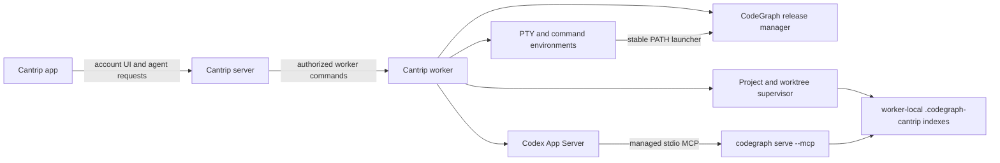

# First-class CodeGraph integration

- Status: Implemented
- Last updated: 2026-08-19
- Upstream: [colbymchenry/codegraph](https://github.com/colbymchenry/codegraph)
- Researched release: [v1.5.0](https://github.com/colbymchenry/codegraph/releases/tag/v1.5.0)

This document is the operational and architectural reference for Cantrip's
managed CodeGraph integration. The original proposal has been retained where
it explains security boundaries and expected behavior; implementation-specific
sections now describe the shipped system.

## Implementation snapshot

The integration was delivered as sequential, independently merged milestones:

- PR #560: verified worker-owned runtime acquisition, privacy enforcement, and
  the stable terminal launcher;
- PR #564: per-worktree indexing, local Git exclusion, bounded jobs, watcher
  recovery, and automatic synchronization;
- PR #567: exact-worktree MCP injection and server-side reserved-name
  enforcement;
- PR #568: rolling-compatible worker status plus server-routed status, sync,
  rebuild, and update-check operations;
- PR #570: worker, project, MCP settings, and chat-inventory presentation; and
- the final hardening PR: non-blocking first installation, candidate MCP
  validation/rollback, expanded failure tests, and this operational update.

Cantrip intentionally does **not** call `codegraph install`, even though the
upstream installer supports Codex CLI. That installer configures a user's
global agents. Cantrip instead synthesizes an immutable MCP definition for the
exact authorized physical worktree of each run. This preserves standalone
Codex configuration and prevents one project, worktree, or worker from leaking
into another.

## 1. Decision

Cantrip treats CodeGraph as a worker-managed development runtime, not as a
user-configured MCP server or a dependency of `cantrip_server`.

Every supported worker:

1. check the upstream GitHub release channel once during each process startup;
2. install or update the correct standalone CodeGraph release for its operating
   system and architecture into worker-owned storage;
3. verify the downloaded artifact before executing it and retain the prior
   verified version for rollback;
4. run `codegraph telemetry off` before indexing or starting an MCP process;
5. expose a stable `codegraph` command in every worker terminal;
6. initialize and continuously synchronize a separate graph for every physical
   project worktree; and
7. inject an immutable, worker-managed CodeGraph MCP server into every
   filesystem-backed Cantrip agent runtime.

Cantrip does **not** run `codegraph install`. The upstream installer is useful
for a standalone Codex CLI installation, but it writes agent configuration such
as `~/.codex/config.toml`. Cantrip already materializes MCP configuration for
each native Codex thread and must not change the worker user's global agent
configuration or add instructions to a repository.

The server remains the control plane and the app continues to talk only to the
server. Source code, graph databases, watcher state, and CodeGraph processes
remain on the worker that owns the checkout.

## 2. Goals

- Make `codegraph` available from normal terminals, terminal services, project
  automation, Codex consoles, and agent command environments.
- Give every Cantrip agent working in a project the upstream
  `codegraph_explore` MCP tool and CodeGraph's native MCP usage guidance.
- Keep each graph current after file edits, branch changes, agent writes, and
  worktree operations without asking the user to run `codegraph sync`.
- Make initial indexing and update progress observable without blocking other
  worker features.
- Show CodeGraph in MCP settings while preventing edit, disable, copy,
  override, or removal operations.
- Work for local, hosted, and multi-worker Cantrip deployments without sending
  graph data through the server.
- Preserve a clean Git worktree; generated CodeGraph data must not appear as a
  tracked or untracked project change.
- Disable CodeGraph telemetry before its first Cantrip-managed use and keep it
  disabled after every update.
- Update from verified upstream release artifacts during worker startup without
  requiring a Cantrip release.
- Degrade CodeGraph independently. A failed download, index, or MCP launch must
  not prevent terminals, Git, files, or non-CodeGraph agent behavior from
  working.

## 3. Non-goals

- Uploading a source graph, symbols, queries, or indexed code to
  `cantrip_server`.
- Sharing one SQLite index between workers, operating systems, replicas, or
  physical worktrees.
- Treating CodeGraph as canonical project data. It is a disposable, rebuildable
  worker cache.
- Running the upstream interactive installer or letting it edit Codex, Cursor,
  Claude, VS Code, or repository configuration.
- Replacing file reads, text search, language servers, or Git when CodeGraph is
  unavailable or does not support a language.
- Interrupting an active agent turn to replace its MCP process immediately
  after an update.
- Allowing arbitrary server or app input to choose an index path on a worker.

## 4. Relevant upstream behavior

The implementation should use CodeGraph's supported interfaces rather than
recreating its parser or graph engine.

- Standalone releases are self-contained and currently cover macOS, Linux, and
  Windows on x64 and arm64.
- `codegraph init <path>` initializes and builds a project's index.
- `codegraph sync` incrementally catches up an existing index.
- `codegraph serve --mcp --path <path>` starts the stdio MCP launcher for an
  explicit project and enables the native file watcher unless `--no-watch` is
  supplied.
- The MCP launcher connects to or starts one detached daemon for the indexed
  project. This lets multiple agents share the same graph without each owning a
  complete parser process.
- The primary MCP surface is `codegraph_explore`; CodeGraph sends its own agent
  guidance in the MCP initialize response.
- The graph is stored beneath a directory inside the project root. The
  `CODEGRAPH_DIR` environment variable may select a plain sibling name such as
  `.codegraph-cantrip`, but not an absolute external path.
- `codegraph telemetry off` persists the choice and deletes unsent telemetry.
  `CODEGRAPH_TELEMETRY=0` and `DO_NOT_TRACK=1` provide process-level defense in
  depth. `CODEGRAPH_NO_UPDATE_CHECK=1` disables CodeGraph's informational
  updater because Cantrip owns release updates.
- `codegraph upgrade` can update a standalone install and refresh agent
  configuration. Cantrip must not call it because that configuration refresh is
  outside Cantrip's ownership boundary.

These facts should be revalidated against the pinned upstream release when the
implementation begins. The upstream project can evolve independently of this
plan.

## 5. Ownership and data flow



### Server responsibilities

- Advertise whether a selected worker has a healthy CodeGraph runtime.
- Return managed CodeGraph MCP status to account and project settings.
- Reserve the managed MCP name so a user-defined server cannot shadow it.
- Ensure every applicable agent dispatch allows the worker to add the managed
  CodeGraph MCP entry.
- Route explicit status, rebuild, and resync commands to the owning worker.
- Persist only bounded health observations and optional account/project policy;
  never persist graph content.

### Worker responsibilities

- Install, verify, update, roll back, and execute the CodeGraph runtime.
- Disable telemetry before first use and after every update.
- Map a canonical project/worktree identity to a canonical local path.
- Own indexing, synchronization, watcher/daemon supervision, and cleanup.
- Add the stable launcher to terminal and automation `PATH` values.
- Add a project-specific managed MCP entry to each Codex run.
- Report bounded version, update, index, and health state to the server.

### App responsibilities

- Display the managed CodeGraph row and worker/index health.
- Never ask the worker directly for status or files.
- Hide edit, remove, disable, and copy actions for the managed MCP row.
- Offer explicit resync/rebuild actions only through server-authorized routes.

## 6. Worker-managed installation and startup updates

### Storage layout

CodeGraph lives under the configured worker data directory so a worker
upgrade does not replace it and the install cannot collide with a user-managed
CodeGraph binary.

```text
<CANTRIP_WORKER_DATA_DIR>/tools/codegraph/
├── bin/
│   ├── codegraph                 # stable Cantrip launcher (or .cmd on Windows)
│   └── current.json              # atomically replaced version pointer
├── versions/
│   ├── <version>-<archive-sha-prefix>/<extracted bundle>
│   └── <previous verified version>/
├── downloads/                    # transient archive and checksum files
├── staging/                      # transient extraction and MCP probes
└── release-cache.json            # ETag and latest validated release record
```

The launcher resolves `current.json` on every invocation. Existing MCP daemon
processes can continue using the executable image with which they started,
while new terminals and MCP launches use the new version immediately.

### Startup sequence

`CodeGraphRuntimeManager.prepare()` creates and publishes the stable launcher
before PTYs and command services are constructed. A cached runtime is validated
and has telemetry disabled synchronously. The release check, download, and
promotion then run in the background; a first installation does not hold up
terminals, Git, files, or Codex. When a verified first install becomes ready,
the worker dynamically creates the project supervisor and applies the latest
server-authorized worktree inventory.

1. Detect the normalized target: `darwin|linux|win32` and `arm64|x64`.
2. Load and validate the last known verified runtime, if present.
3. Make one conditional request to the upstream `releases/latest` endpoint,
   using the cached ETag and a bounded timeout. This check happens on every
   worker process startup; a GitHub rate-limit response records backoff but does
   not stall the worker.
4. If the latest release is absent locally, download the exact target archive
   and `SHA256SUMS` into a unique staging directory.
5. Verify the repository, tag, expected asset name, GitHub API asset digest,
   and published SHA-256. Verification failure deletes staging data and keeps
   the previous runtime. Add GitHub attestation verification when it can be
   performed without depending on a separately installed `gh` binary.
6. Extract defensively: reject absolute paths, `..` traversal, links escaping
   the staging root, unexpected executable layout, and excessive extracted
   size.
7. Run the staged executable's version command and require it to match the
   release tag.
8. Run the staged executable with `telemetry off`, then require a real MCP
   `initialize` response in direct/no-daemon mode. A newly downloaded runtime
   is never selected if privacy suppression or MCP validation fails.
9. Atomically move the verified directory into `versions/`, repeat version,
   telemetry, and MCP validation from its promoted location, and only then
   replace `current.json`; retain at least the previous verified version.
10. Run `telemetry off` again through the selected stable launcher on **every**
    startup, even when no update was installed.
11. Start or reconcile CodeGraph project supervisors when the runtime becomes
    available. Worker readiness is independent of this background completion.

The updater must use GitHub's release API and assets directly rather than
scraping HTML or executing a remote install script. It must never replace the
working version in place.

### Availability and update policy

- With a verified cached runtime, the worker becomes generally available while
  the release check/download proceeds. CodeGraph reports `checking` or
  `updating`; other worker services do not wait.
- On a first install with no cached runtime, CodeGraph reports `installing` and
  project agents start without its tool. The project supervisor and managed
  MCP become available dynamically after the verified install completes.
- An offline check uses the cached runtime. Offline first start reports
  CodeGraph unavailable with a repairable reason.
- After promotion, idle CodeGraph daemons are restarted and new Codex runs use
  the new version. Active turns finish on the previous version and rematerialize
  their managed MCP at the next safe thread resume. No live turn is killed just
  to update CodeGraph.
- If the candidate fails its staged or promoted-location MCP handshake, the
  manager removes the candidate directory and leaves `current.json` pointing
  at the previous verified runtime. The worker reports the bounded diagnostic.
- Cantrip owns update cadence. Set `CODEGRAPH_NO_UPDATE_CHECK=1` in all managed
  CodeGraph processes so its background notification check does not duplicate
  the worker's release manager.

## 7. Telemetry invariant

Telemetry suppression is an ordered startup invariant, not a best-effort UI
preference.

Every startup and every version promotion must execute:

```text
<managed-codegraph> telemetry off
```

Every CodeGraph child process must also receive:

```text
CODEGRAPH_TELEMETRY=0
DO_NOT_TRACK=1
CODEGRAPH_NO_UPDATE_CHECK=1
```

The worker logs command start, version, exit status, duration, and bounded
stderr, but never project code or query arguments. `telemetry off` is
idempotent. A failure makes CodeGraph health `degraded` and prevents a newly
downloaded version from promotion; it does not crash the worker.

The stable terminal launcher applies these variables only to CodeGraph. It must
not set `DO_NOT_TRACK=1` globally for every command in the user's terminal.

## 8. Terminal and command availability

`TerminalManager`, terminal services, project automation, and other worker-owned
command runners prepend the worker's CodeGraph launcher directory to
`PATH`. An existing user-managed CodeGraph remains untouched and Cantrip's
launcher wins only inside Cantrip-owned process environments.

Normal analysis commands pass through unchanged, including `init`, `status`,
`sync`, `query`, `explore`, `callers`, `callees`, `impact`, and `affected`.
Cantrip-owned lifecycle commands need explicit behavior:

- `codegraph upgrade` should invoke or report the worker-managed update path,
  not the upstream installer that rewrites global agent configuration.
- `codegraph install` should explain that MCP installation is already managed
  by Cantrip and offer `--print-config` only through the upstream executable if
  the user explicitly needs it for an external agent.
- `codegraph uninstall` must not remove Cantrip's managed launcher or MCP
  integration. Project-level `uninit` remains available for diagnosis, but the
  supervisor marks the project uninitialized and may rebuild it according to
  managed policy.

The exact interception surface belongs in the launcher, with focused tests, so
upstream self-management cannot corrupt the worker-owned install.

## 9. Project, replica, and worktree lifecycle

Each physical checkout gets its own graph:

```text
<worktree-root>/.codegraph-cantrip/
```

This is required because Primary and secondary worktrees can contain different
revisions, and two workers must never share SQLite locking or daemon state.

### Initialization

- Project clone/relink, replica reconciliation, and worktree creation enqueue
  an idempotent `codegraph init <canonical-root>` job.
- Canonicalize the root and require it to match a server-authorized project
  source or worktree known to the worker. Reject symlink escapes and arbitrary
  paths supplied by the app.
- Use `CODEGRAPH_DIR=.codegraph-cantrip` for every managed command.
- Limit initial indexing concurrency and expose queued/indexing progress. Large
  repositories must not monopolize the worker command channel or delay
  heartbeats.
- A bounded readiness wait may make the graph available to a first agent in a
  small project. A large initial index does not block the agent indefinitely;
  its MCP tool reports indexing/unavailable and Codex falls back to normal file
  tools.

### Continuous synchronization

- Auto-sync is enabled by default and is the managed baseline, not a setting a
  user must opt into.
- Supervise one CodeGraph daemon/watcher per initialized physical worktree
  while its replica is active. Multiple agents proxy to that shared daemon.
- Before an agent launch, run a cheap status check and request an incremental
  `sync` if the watcher reports stale or degraded state.
- File-save bursts, branch switches, rebases, resets, and worktree moves can
  invalidate many paths at once. Debounce reconciliation and let CodeGraph
  perform a catch-up scan instead of dispatching one worker command per file.
- Watcher failure is visible and retried with backoff. It must never silently
  claim a fresh graph.

### Git cleanliness

Do not commit a `.gitignore` change into user repositories. On initialization,
resolve the repository's local Git exclude file and add a marker-owned
`.codegraph-cantrip/` rule idempotently. CodeGraph's index directory also keeps
its own internal ignore file. Folder projects without Git need no exclusion.

### Removal and relinking

- Removing a secondary worktree stops its watcher before the checkout is
  deleted; the derived index disappears with it.
- Unlinking a project while preserving local files stops supervision but may
  retain the index for a fast relink.
- Deleting local project files deletes the graph with the checkout.
- Moving a chat to another worker does not transfer the graph. The destination
  worker initializes or reuses the graph for its own replica.

## 10. Managed MCP injection

### Native Cantrip integration

The worker adds the MCP definition after it resolves the command's canonical
worktree and before `codexMcpConfigOverride()` materializes native
`mcp_servers` configuration:

```json
{
  "name": "codegraph",
  "transport": "stdio",
  "command": "<absolute worker-managed launcher>",
  "args": ["serve", "--mcp", "--path", "<canonical worktree root>"],
  "environment": {
    "CODEGRAPH_DIR": ".codegraph-cantrip",
    "CODEGRAPH_TELEMETRY": "0",
    "DO_NOT_TRACK": "1",
    "CODEGRAPH_NO_UPDATE_CHECK": "1"
  }
}
```

Using `--path` is intentional. It avoids relying on the current working
directory of Codex's MCP child process and prevents a project-less or stale
daemon from serving the wrong graph.

The upstream CodeGraph installer already supports Codex CLI, but Cantrip does
not need it. Cantrip supplies the same stdio MCP definition directly to:

- normal agent turns and resumed chats;
- the linked Codex console;
- project automation agent runs;
- Git-generated agent work;
- chat import and relocation hydration; and
- structured filesystem-backed agent operations when MCP use is compatible
  with their output contract.

Project-less machine tasks omit the managed server because no authorized graph
root exists. Agent runs on an unavailable CodeGraph runtime continue without
the server and receive an explicit bounded diagnostic.

The worker treats project-wide observation as a cache, not as the only source
of authority. If a worker restart or missed observation replay leaves that
in-memory cache empty, an exact bound agent worktree is reauthorized on demand
before MCP injection. This recovery is serialized with normal observation
refreshes and remains bounded to the same 128 supervised roots.

For a user who manually launches `codex` in a Cantrip terminal, the Cantrip
terminal launcher may provide an ephemeral Codex configuration override for
that terminal's current authorized worktree. It must not edit
`~/.codex/config.toml`. A completely external Codex process remains the user's
responsibility.

### Guidance

CodeGraph's MCP initialize response is the primary tool guidance. Cantrip may
also add a small runtime-only developer instruction for native subagents that
do not receive MCP initialize guidance: prefer CodeGraph for structural code
discovery when healthy, do not run install/upgrade/uninit, and fall back to
ordinary file tools when unavailable. Do not write this instruction to a
project `AGENTS.md`.

## 11. Immutable MCP representation

The managed CodeGraph MCP is synthesized from worker capability and selected
project placement. It is not a row in the user-owned `mcp_servers` table.

The durable MCP CRUD protocol remains limited to user-owned rows. CodeGraph is
represented separately by the worker's rolling-compatible `codegraph` health
capability and synthesized by the settings UI. In a live chat, native Codex MCP
inventory identifies the injected server by its reserved name and the app adds
`Managed by Cantrip` and `Read only` badges. This avoids persisting a fake MCP
row or forcing older apps to understand a new user-MCP schema variant.

The trusted client rejects the case-insensitive managed names `codegraph` and
`cantrip` before encrypting create or update requests, and rejects discovered
imports after decrypting and validating their identity binding. The server sees
only endpoint-encrypted configuration plus a key-derived blind index, so it does
not claim plaintext reserved-name enforcement. At runtime the worker decrypts
configured rows, filters any managed-name collision, and then appends the
authoritative managed entries. A legacy or nonconforming encrypted row therefore
cannot shadow either managed server.

Settings display:

- **CodeGraph**;
- a `Managed by Cantrip` and `Read only` badge;
- selected worker and installed version;
- update state;
- project graph state and last successful sync when a project is selected; and
- a bounded failure message with Resync or Rebuild when appropriate.

No edit, delete, disable, copy, authentication, or environment actions appear
for this row. The chat customization inventory identifies the same server
as managed rather than presenting it as an unexplained extra MCP.

## 12. Protocol and status model

The worker heartbeat carries a bounded CodeGraph capability/status shape with:

- availability and supported platform;
- installed, latest-seen, and previous versions;
- update state and last check time;
- telemetry-disabled confirmation;
- runtime health and bounded diagnostic;
- number of ready, indexing, queued, and degraded project roots; and
- whether CLI PATH and MCP injection are active.

The worker exposes commands for:

- `codegraph.status` for one authorized project/worktree;
- `codegraph.sync` for incremental reconciliation;
- `codegraph.rebuild` for a destructive derived-index rebuild; and
- `codegraph.update.check` for an explicit retry in addition to startup checks.

Commands carry canonical project/worktree identities plus protected source and
worktree routing handles. The worker resolves and reauthorizes those handles;
the server and app never receive or dereference the raw filesystem path. This
lets status, sync, and rebuild recover a missing in-memory observation after a
worker restart. Index jobs must not hold the worker's primary command channel
open for their full duration. Return a durable/bounded job identity and publish
progress through normal worker observations.

## 13. Failure and recovery behavior

| Failure                                | Required behavior                                                                                 |
| -------------------------------------- | ------------------------------------------------------------------------------------------------- |
| GitHub unavailable                     | Use the last verified runtime and report a stale update check.                                    |
| No runtime and offline                 | Disable only CodeGraph; keep the worker online.                                                   |
| Hash, digest, or version mismatch      | Delete staging data, retain current runtime, surface a security error.                            |
| Extraction failure                     | Retain current runtime and remove the partial directory.                                          |
| Telemetry suppression failure          | Do not promote the new version; mark the current integration degraded.                            |
| New runtime fails health/MCP handshake | Roll back atomically to the prior verified version.                                               |
| Worker restarts before target replay   | Reauthorize the exact requested worktree and restore MCP/status without blocking unrelated tools. |
| Initial index fails                    | Preserve logs, report degraded state, allow retry/rebuild, and let agents fall back.              |
| Watcher/daemon exits                   | Restart with bounded exponential backoff and run catch-up sync.                                   |
| SQLite lock/corruption                 | Mark the graph degraded; an explicit Rebuild removes only the derived index and creates it again. |
| Worktree disappears                    | Stop supervision and remove its in-memory registration without touching another checkout.         |
| Active turn during update              | Let it finish on the old process; rematerialize at the next safe resume.                          |
| Old server/app during rollout          | Worker omits unsupported status fields and continues normal agents without UI management.         |

All errors should use the existing worker service logging conventions. Include
worker, project, worktree, phase, CodeGraph version, duration, and outcome; do
not log code, symbol queries, repository credentials, or full filesystem paths
in server-visible payloads.

## 14. Security and privacy

- Trust only assets from the configured `colbymchenry/codegraph` GitHub release
  channel and an allowed stable tag format.
- Verify content before execution and promote via atomic filesystem operations.
- Never execute from the downloads or staging directory after a failed check.
- Run CodeGraph with the same OS identity and filesystem permissions as the
  worker; it receives no server credential or provider secret.
- Pass only the selected canonical worktree to `--path`.
- Keep graph databases, daemon sockets, and logs on the worker.
- Do not expose graph contents through a generic server API. Agents access them
  only through their worker-local stdio MCP.
- Disable telemetry and upstream background update checks by command and
  environment as described above.
- Bound downloads, extracted size, logs, status messages, and retry frequency.
- On Windows/WSL or other cross-environment access, use distinct
  `.codegraph-*` directories; never share one index across OS locking domains.

## 15. Delivered milestones

### Milestone 1: runtime acquisition and CLI — complete (PR #560)

- Add target mapping, release metadata client, verified download/extraction,
  atomic current/rollback pointers, and startup update checks.
- Run and verify `telemetry off` on every startup and after update.
- Add the stable launcher and inject it into worker-owned command `PATH`.
- Advertise bounded runtime health.

This milestone is independently useful: `codegraph` works in a terminal even
before Cantrip manages project indexes or MCP.

### Milestone 2: project indexing and auto-sync — complete (PR #564)

- Add the project/worktree supervisor and job scheduler.
- Initialize existing replicas and new worktrees with bounded concurrency.
- Manage local Git excludes without tracked changes.
- Supervise watchers/daemons and publish status, sync, and rebuild commands.

### Milestone 3: immutable MCP injection — complete (PR #567)

- Synthesize the project-specific CodeGraph MCP on the worker.
- Cover every filesystem-backed agent dispatch and safe thread resume.
- Add reserved-name enforcement and managed protocol metadata.
- Add runtime-only fallback guidance for subagents if validation shows it is
  necessary.

### Milestone 4: protocol and routing — complete (PR #568)

- Added rolling-compatible heartbeat/status schemas and project job states.
- Added server-routed status, sync, rebuild, and update-check operations.
- Persisted bounded worktree health observations without source or graph data.

### Milestone 5: settings and operations UI — complete (PR #570)

- Display the read-only managed MCP in global/project settings and chat
  customization inventory.
- Add version, update, indexing, freshness, failure, Resync, and Rebuild states.
- Verify older server/worker degradation and multi-worker placement display.

Every milestone was delivered through its own worktree and squash-merged pull
request rather than one broad implementation branch.

## 16. Validation and evidence

### Automated tests

- `codegraph-runtime.test.ts` exercises all six release targets, safe archive
  paths, a verified first install, launcher privacy variables, conditional
  ETags, cached-offline startup, non-blocking first-offline startup, concurrent
  startup locking, checksum and wrong-version rejection, atomic upgrade
  retention, telemetry ordering, MCP initialization, and candidate rollback.
- `codegraph-supervisor.test.ts` exercises canonical authorization, unrelated
  path rejection, isolated project roots, idempotent local Git exclusion,
  initialization, incremental synchronization, rebuild, server-owned job
  identity, the two-index-operation concurrency bound, burst debounce, and
  filesystem watcher recovery.
- `codegraph-mcp.test.ts` verifies the absolute launcher invocation, exact
  canonical `--path`, privacy environment, and case-insensitive replacement of
  any user shadow with the authoritative managed entry.
- `codegraph-observations.test.ts` verifies serialized refresh, exact-target
  restart recovery, and active-target priority at the 128-root bound.
- protocol tests verify old heartbeat payloads default to unavailable
  CodeGraph capability, preserving rolling compatibility.
- server repository tests reject the reserved name case-insensitively for
  create and update; repository guards also protect existing-row update,
  delete, and copy paths.
- app typechecking and focused settings tests cover capability-omission
  fallback, managed/read-only presentation, and server-routed actions.
- A macOS arm64 native smoke on 2026-08-19 downloaded upstream v1.5.0 through
  the manager, verified telemetry disabled, completed the MCP handshake, then
  initialized and queried a one-file TypeScript graph successfully.

### Remaining release QA matrix

Target selection is unit-tested on every supported combination. Native archive
execution still requires release QA on its host platform:

- macOS x64, Linux arm64/x64, and Windows arm64/x64 install/update; repeat the
  completed macOS arm64 smoke in packaged release QA.
- Clean online start, cached offline start, first offline start, corrupt
  download, and bad release rollback.
- Primary and secondary worktrees on different branches with edits from an
  agent, terminal, Explorer, and Cantrip Code.
- Two simultaneous agents on one worktree and agents on two different
  worktrees.
- Local server/worker, hosted server with local worker, and two-worker project
  placement.
- Terminal `codegraph status`, agent tool discovery/use, immutable MCP settings,
  and explicit Resync/Rebuild.

Failure in an untested native target does not weaken the security boundary: the
worker rejects an unverified or non-handshaking candidate and keeps unrelated
features online. It should nevertheless block claiming that target as manually
QA'd for a release.

## 17. Acceptance criteria

The integration is complete when:

1. A supported worker with no CodeGraph install can start, download the latest
   verified release, disable telemetry, and expose `codegraph` in a terminal.
2. Every subsequent worker startup performs a bounded upstream release check;
   a newer verified release is promoted without a Cantrip update and without
   interrupting active work.
3. A rollback leaves the previous verified runtime usable after a bad update.
4. Adding or relinking a project builds an isolated graph for every worktree,
   keeps it synchronized by default, and does not dirty Git.
5. Every filesystem-backed Cantrip agent receives the managed CodeGraph MCP for
   its exact authorized worktree without running `codegraph install` or
   modifying global Codex configuration.
6. MCP settings visibly list CodeGraph but no client or API can edit, disable,
   shadow, copy, or remove it.
7. Source, graph, and query data remain on the worker; server-visible status is
   bounded metadata only.
8. CodeGraph installation, update, telemetry, index, or watcher failure degrades
   only CodeGraph and produces actionable worker/app diagnostics.

## 18. Implementation touchpoints

The integration is implemented across these areas:

- `cantrip_worker/src/index.ts` for ordered startup and service lifecycle;
- `cantrip_worker/src/codegraph/` for releases, launcher,
  telemetry, indexes, jobs, and supervision;
- `cantrip_worker/src/cli-broker.ts`, terminal managers, and other command
  environment builders for launcher PATH exposure;
- `cantrip_worker/src/worktrees.ts` and replica reconciliation hooks for index
  lifecycle;
- `cantrip_worker/src/codex/app-server.ts` for the final managed MCP injection;
- `packages/protocol/src/mcp-configurations.ts`, worker capability/status, and
  worker-command modules for the managed-name and status contracts;
- `cantrip_server/src/app/routes/worker-maintenance.ts` and
  `cantrip_server/src/db/repository/mcp.ts` for server-authorized actions and
  opaque user MCP persistence;
- `cantrip_app/src/lib/protected-secrets.ts`,
  `cantrip_app/src/components/settings/mcp-server-settings.tsx`, and project/chat
  status surfaces for plaintext reserved-name validation and immutable
  presentation; and
- focused worker, server, protocol, and app tests beside those modules.
