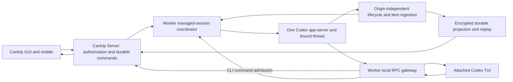

# Codex CLI and GUI mirroring audit

Audit date: September 7, 2026, America/Chicago (September 8 UTC).
Source baseline: `970860ea6b197efaaa491c18fa60b1fa84a743e7`.
Bundled upstream: Codex `0.153.4`, tag `rust-v0.153.4`, commit
`3d2ee51ca2d5db578f328aa75e20aa22c0197c9a`, plus Cantrip's reviewed patches.

## Decision and scope

Cantrip can support an already-running CLI when a new agent chat is created,
with both CLI and GUI controlling and displaying the same conversation. The
existing remote TUI connection is the right foundation. The prerequisite is to
make session configuration, turn ownership, commands and history independent of
which interface initiated the work. Moving the terminal launch earlier, or
adding more transcript polling, does not accomplish that.

**Recommended design:** one worker-owned managed session and native Codex thread;
the TUI and GUI are presentation/control clients of that session. Both use one
authorized command path and one origin-independent event projection. Prepare
the session and attach its CLI at chat creation, without submitting a prompt
or forcing the user out of the GUI. Do not attach a second execution engine or
use terminal text as the conversation database.

The original audit was documentation only (PR #1849). Implementation progress
below records subsequent passes; the source findings and baseline validation
sections remain historical evidence, not claims about the final implementation.
Each implementation pass uses its own PR/worktree and squash automerge.

### Implementation progress

**Pass 1 (#1850) — metadata and existing-thread preparation:** goal reads now use native
`thread/goal/get` directly, including unloaded threads. Existing-thread goal
mutations and plan observation preserve native configuration; a cold preserving
load sends only `threadId`. Plan observation no longer writes its display
fallback into native settings. Missing applied plan information remains a
fallback, not a confirmed native settings snapshot.

Existing-thread preparation is serialized through native resume and MCP catalog
readiness. Identical concurrent configurations reuse the result, while explicit
empty MCP configuration remains an actual configuration operation. An attempted
unsubscribe invalidates cached attachment/configuration/readiness; failed resume
surfaces the actual error without silently creating a replacement conversation.
Runtime teardown invalidates pending preparation, and retired socket/process
callbacks cannot clear replacement runtime state. Managed MCP catalog requests
now attempt the native operation without a capability-inventory prerequisite.

Validation: 114 tests passed across eight focused worker files, including 14
preparation regressions and one actual bundled Codex `0.153.4` protocol test;
worker typecheck and diff/format checks passed. The native test uses an isolated
home, a real stdio MCP fixture and a rejecting local provider, with zero model
requests, turns or tool calls. It proves named-thread minimal resume preserves
settings/MCP and metadata reads preserve plan mode; unloaded durable goal reads
do not start the thread or MCP. The two stale disabled-CUA instruction fixtures
identified during the audit now assert the existing disabled notice explicitly.

**Pass 2 — live empty-thread attachment:**
Pass 1 exposed native resume rejecting newly started unnamed, empty threads
because their history was not yet materialized. Reviewed patch `0010` now
persists the existing durable live recorder and pending creation metadata before
by-ID attachment. It covers concurrent joins and retries after a metadata write
fails with the recorder already visible. Resume-derived metadata remains
deferred until a new append; opening another view does not flush those facts.

The patch handles the typed missing-thread error and the pinned local store's
exact missing-rollout error without inventing a prompt, name or replacement
thread. Ephemeral, archived and unrelated storage/invalid-request failures retain
their error paths. Live paginated metadata writes now require SQLite success,
so a failed insertion is reported and its pending update remains retryable.
Legacy optional metadata-indexing behavior is preserved.

Validation of the updated native test build: all 49 resume tests and all 240
thread-store tests pass using the upstream `ci-test` profile with
`RUST_MIN_STACK=33554432`. The seven independent worker/native protocol tests
also pass against that build. They cover concurrent remote clients for legacy
and paginated history, unchanged thread/session identity and settings, MCP
inventory, settings notifications, reconnect, invalid paths, ephemeral threads,
real storage obstruction/repair and an SQLite-trigger metadata failure followed
by same-session recovery. These fixtures submit no model turn or computer input.
The final packaged release built successfully and passed the same seven protocol
tests. Worker typecheck, format/diff checks and pristine-upstream/patch
verification passed. This verifies native empty-thread attachment, not the full
CLI/GUI integration acceptance matrix below.

**Pass 3 — shared preparation and attachment:**

The worker serializes preparation by authenticated server/owner/worker/chat
identity and recovers the native thread through a private association journal.
It records the actual thread before later configuration, MCP readiness or plan
application can fail. A retry finishes incomplete preparation; subsequent view
attachment preserves root settings. Placement, workspace, provider/account and
route participate in recovery identity. The queue ends before model execution.
The journal supplements canonical server routing and stores neither credentials
nor prompts; command admission and history recovery remain separate work.

Console creation, direct attachment, relay attachment and WorkerLink grants use
one complete server configuration builder, including custom child models and
idle CUA eligibility. Canonical thread binding must succeed before a new console
can launch. Project agent chats use the shared coordinator for GUI preparation
and console attachment. Standalone Chat remains outside console eligibility.
MCP resolution runs after coordinator identity recovery: an omitted list on an
existing preserving attachment remains omitted, while explicit `[]` replaces it
and an unbound or incomplete session receives managed configuration.
Current server routes always supply the complete managed map for cold recovery.
A compatibility caller that cold-resumes with MCP omitted gets native minimal
resume semantics: it cannot recover a transient managed overlay and may start
inherited account MCP. That is not evidence of managed-profile preservation;
durable configuration-revision recovery remains part of the outstanding goal.

Idle MCP sessions expose initialization/catalog operations without granting a
synthetic execution lane. Protected operations require actual active authority.
Replacement and deactivation apply to the exact lane. Each replacement binding
has its own opaque connection file and generation; an old broker cannot overwrite
or remove a successor's file. Only the same live binding reuses a connection.
CLI-originated turn registration is not implemented by this idle-session change.

Reviewed native patches implement three related contracts:

- `0011`: the exact bound remote TUI uses `PreserveExistingThread` and skips the
  startup model-migration prompt. Managed launch omits model/security/cwd overrides
  while retaining local provider bootstrap and the PTY workspace. Ordinary CLI
  launches keep their normal prompt and configuration behavior.
- `0012`: strict thread-scoped managed configuration replaces MCP, developer
  instructions and child defaults while preserving current root settings. New
  starts and cold resumes apply the replacement before MCP initialization;
  shared live engines use `thread/managedConfig/update`. The owned in-memory
  overlay survives ordinary configuration rebuilds and rebases concurrent reloads.
  Validation precedes publication. The response acknowledges configuration, not
  successful MCP initialization; the worker observes the actual catalog.
- `0013`: new empty roots persist a complete owned settings snapshot before
  attachment. Cold recovery restores exactly owned root settings, including
  collaboration mode and canonical permission-profile material, under current
  constraints. Explicit overrides remain authoritative; child/fork/wrong-owner
  settings do not leak into the root. Managed MCP credentials are not persisted
  in native rollout settings and are supplied freshly during preparation.

Actual `thread/closed` and `notLoaded` events invalidate pending preparation and
cached configuration/readiness. Ordinary idle events do not. Late configuration
or plan replies cannot acknowledge a closed thread or replacement runtime.
Only the worker's own unsubscribe/resume replacement can adopt a new preparation
version; an unrelated close during cold resume rejects the stale response.
Full native incarnation/command correlation remains a later pass.

Plan Mode reads now return a live cached mode or an explicitly observational
fallback without starting or loading a native thread. The prior cold read would
initialize inherited account MCP without obtaining a settings notification.
An isolated actual-native regression proves Plan GET leaves `thread/loaded/list`
empty, MCP logs unchanged and provider requests at zero. This is not a complete
native settings read API; desired/effective settings parity remains outstanding.

The patch verifier now actually applies the ordered series to a disposable copy
of manifest-verified source. It no longer checks dependent patches independently
against untouched upstream. Two real-entrypoint regressions prove dependent
patches apply, a broken later patch fails by name, and source/index stay unchanged.
All 6,499 imported files and the 12-patch series verify successfully.

History reads now follow the exact runtime bound during managed preparation,
including its child profile, without selecting a currently executable child
route. The binding includes authenticated server/owner/worker/chat identity,
thread, workspace and root route/account. A live observation uses the existing
transport directly; actual read errors propagate. Without a live binding,
current authorized root bootstrap performs `thread/read` without loading the
native thread or MCP. This retains existing history-baseline semantics; durable
all-turn replay is not implemented by the observation registry.

Cold recovery preserves the selected service tier independently from feature
and model eligibility for an actual request. Patch `0013` captures the merged
caller/snapshot selection before filtering and restores it only to the exact
owned root; request filtering remains unchanged. Strict configuration validation
accepts native custom effort strings and rejects invalid empty/nonstring values.

Validation:

- The standard `pnpm codex:build` completed and the final packaged runtime passed
  all 13 tests across observation, empty-thread attachment, actual remote TUI and
  production worker/coordinator fixtures. These exercise live/reopened/cold views,
  exact session identity, complete root settings, managed catalog/credential
  replacement, sibling isolation, invalid requests and actual storage failure
  followed by same-session recovery.
- The final native app-server resume suite passes all 64 tests. The selected-tier
  ownership test and eight persisted-settings unit tests pass, including actual
  cold recovery with feature filtering disabled. The full thread-store suite
  passed 240 tests before the final tier-only change.
- Worker preparation, coordinator, observation, MCP, terminal, runtime and CUA
  lifetime/child-ownership selections pass 144 tests across 11 files.
- Focused server selections pass 18 tests; two additional regressions exercise
  actual requested and notification-driven reconciliation after real child-route
  selection fails. Two real HTTP/database console cases also pass, covering
  encrypted canonical binding, reuse and persistence failure/retry.
- Managed protocol tests pass four tests; ordered patch-verifier regressions
  pass two. Worker/server typechecks and diff/TypeScript formatting checks pass.
  A read-only Rust formatting check identifies only the existing `TurnPause`
  import ordering introduced by patch `0004`.

Native fixtures use isolated homes and local rejecting providers and synthetic
MCP services, with external plugin marketplace downloads disabled in those test
homes. First start and cold recovery record zero excluded inherited MCP
initializations and zero model requests. The production-worker fixture records
initial native writable-project trust during new-thread creation, then verifies
that view attachment, chat settings changes and cold recovery do not make further
account configuration writes. This does not establish command/default-write
mediation, which remains a later milestone. No desktop input is performed.

**Pass 4 (#1853) — shared native command admission:**

The isolated implementation adds durable admission, dispatch, settlement and
pending-reply records. Worker-protected request/result content is bound to its
chat and operation; keyed digests avoid exposing guessable prompt hashes.
Admission checks canonical placement, thread, route/account and activation.
Dispatch rechecks the exact operation and runtime generation. An uncertain
transport result does not authorize another native dispatch.

A loopback gateway mediates terminal mutations before forwarding them. GUI
controls join the same adapter and pending-interaction resolver. GUI Stop uses
the admitted native session instead of selecting another executable model route.
Preparing a rollback can bind an accepted parent operation without dispatching
its future turn or granting computer-use authority. Excluded Task and standalone
paths retain their existing execution behavior.

Reviewed native work covers managed terminal reply acknowledgment and preventing
implicit account-default writes when changing managed chat settings. A separate
native gate requests fresh admission before each queued or goal-driven turn,
including cold-resume queue wakeups. Its proposed native turn ID is retained
through actual execution. Stop invalidates pending tickets outside the native
per-thread request queue; a new explicit queue/goal start can rearm the runner.
Normal child execution remains under the admitted root's authority.

The final standard packaged build includes reviewed patches `0014` and `0015`;
all 6,499 imported files and the ordered 14-patch series verify. The production
worker gateway, runtime and adapter now pass terminal and queue fixtures against
that binary and real Fastify/PGlite authority. They cover three actual turns,
GUI Stop, fresh activation generations and final canonical idle state. Native
queue/goal tests separately establish admission before model input, rejection of
stale tickets and cold queue gating. These results do not establish the entire
remote-TUI, history and settings acceptance matrix.

Real database integration exposed two receipt defects: native acknowledgment
and terminal evidence needed separate immutable protected records, and a scoped
queue command's nested turn result must not be reconciled as if that command
owned the execution. Both are corrected. GUI cleanup now retains its logical
reservation until the server acknowledges committed completion; Stop and replies
remain independent of this wait. An actual native GUI-parent/queued-successor
fixture proves physical completion alone does not release the successor, and
that the successor starts after canonical completion acknowledgment.

GUI goal/compact/rollback commands carry full managed configuration. Goal creation
uses one durable operation and the native goal runner without a duplicate
synthetic initial turn. Pending-start Stop and delayed queue/goal commands are
fenced by durable cancellation state. Fresh GUI retry admission now preserves
one reserved logical lane while replacing attempt and authority generations;
protected continuation transport and Stop/admission-race tests pass. Initial
preparation runs inside the same cancelable retry boundary, with exact logical
root cancellation retained even before preparation registers. A stopped older
preparation cannot register a turn over a newer request.

The actual packaged runtime passes five real-server/database cases: terminal,
queue, GUI-to-queue handoff, GUI capacity retry and GUI compaction replacement.
The capacity case reproduces native
`active` → `systemError` → `serverOverloaded` → failed completion, waits the
real retry delay, then obtains a fresh admission and completes successfully.
`systemError` revokes CUA without prematurely discarding the admitted turn;
actual closure/not-loaded events still tear it down. The compaction case uses an
actual provider error, prepares the replacement under the shared coordinator,
binds it through canonical continuation admission, and completes a fresh turn.
Its queued successor remains gated until logical completion is acknowledged.
It explicitly attaches a new view; automatic retargeting of an already-open TUI
and transfer of existing queue/history are not established by this test.

That replacement test exposed a reload that discarded the native gate when
ordinary turn inputs omitted managed MCP configuration. The worker now retains
acknowledged managed overlays separately from readiness caches, including the
current runner generation. Omitted inputs inherit the owned overlay; explicit
empty MCP and null child defaults remain removals. Managed configuration changes
use the live update path without self-unsubscribing the sole observer. Catalog
failure does not erase acknowledged ownership; actual closure or transport
replacement does. A successful gate rebind updates the retained generation.

Worker/adapter/coordinator/preparation selections pass 115 tests; root
continuation, cancellation, transport, encryption
and runner selections pass 28. Server admission/approval selections pass 48.
App, worker and server typechecks pass. Ordered upstream verification passes.

A broader worker selection before the final overlay change passed 134 tests
and repeated the same three known
`goal-streaming.test.ts` failures verified on the unchanged pass baseline: two
legacy goal/identity timeouts and the missing first-checkpoint assertion. These
are recorded failures, not successful goal-streaming validation. The final
focused selection above covers the overlay changes; both legacy owned-close
cases also pass a fresh targeted rerun. The packaged five-case native fixture
passes in 29.96 seconds with local synthetic provider responses and real native
protocol/database operations, without mocked admission or execution success.

**Pass 5 (#1854) — one managed queue:**

Post-merge source inspection confirms three independent queue paths: GUI rows
in `queued_prompts`, Codex's durable `thread/queue/*` API, and the interactive
TUI's local `VecDeque`. The TUI drains its local queue into direct turn submits
and ignores `ThreadQueueChanged`; forwarding GUI calls to the native durable
API alone would not produce a shared queue. Native durable queue items contain
only ID, input and client message ID. They do not represent frozen items,
per-item mode/model/effort/custom-child/worktree selection, and enqueue assigns
a fresh ID without deduplicating the client message ID.

The selected owner for managed sessions is therefore **Cantrip's canonical
queue**, retaining those existing product semantics. The worker gateway
serves native-shaped queue reads and mutations from protected canonical data;
managed queue mutations do not also enter Codex's independent scheduler. The
reviewed managed-TUI patch replaces local queue draining with this shared
queue and consumes its revisioned notifications. Ordinary unmanaged CLI behavior
and excluded standalone/Task behavior remain separate.

Implementation requires durable item revisions and dispatch claims tied to the
logical native operation, atomic queue mutation/command settlement, and stable
identities for retry and consumption. An uncertain dispatch retains its claim
for reconciliation rather than replaying the input. Worker-side protection must
preserve the complete native input vector alongside GUI display data. Existing
native queue entries need a fenced, idempotent import before acknowledged
removal; missing entries alone do not prove nonexecution.

This pass also needs recovery for a lost logical-completion acknowledgment.
Physical cleanup is insufficient to release a successor, but a committed exact
logical completion must remain observable and retryable after a notification
failure. Recovery must not depend on another user message or resubmit the turn.
Implementation now includes the canonical revision/claim protocol, gateway
virtualization, protected queue projection, GUI revision-aware edits, and a
durable exact-root logical-completion outbox. Native command receipts distinguish
an actual model turn from acknowledgment of a shell/settings/goal command. The
worker normalizes encrypted GUI edits before admission, so editing a slash
command cannot retain the previous command's execution classification.

The worker seals the complete native input vector under an owner/server/chat/item
encryption domain. Local image/audio bytes are captured before queue acceptance
and projected through the existing attachment store with encrypted metadata for
GUI display. Attachment mappings preserve surviving media IDs across native edits,
remove media deleted in the GUI, and avoid appending the same attachment twice.
Changed bytes cannot overwrite an accepted attachment merely by reusing a command
ID. Failed upload attempts can be abandoned without deleting the completed file
or requiring a worker restart. Remote URLs retain native fetch semantics; these
are not automatically downloaded by queue projection.

GUI edits, removal and reordering now recover a lost response through a read-only
operation-receipt lookup. The original accepted item remains available after
consumption or later edits, so recovery does not reconstruct or resend the
mutation. Missing, mismatched or unavailable receipts leave the action
unconfirmed. The client pins its authentication lifetime before preparing an
edit and rejects a replacement login even for the same account.

Legacy queue transfer preserves uncertain and conflicting records separately
from executable items. The GUI decrypts and displays their saved prompt and
attachment names in a read-only transfer list; a missing native row alone does
not authorize execution. Changes in transfer status advance the canonical queue
revision so connected views can refresh without another input.

The GUI also projects actual start claims for each item revision. Preparing,
starting, unconfirmed and rejected attempts no longer all look like ordinary
waiting prompts. Unresolved claims disable row mutations; rejected attempts
offer an explicit retry. A stale claim cannot label or disable a newer edit.
An explicit queued retry receives a new native root identity through its new
claim, while repeated delivery of the same claim remains idempotent.

Recovered GUI outcomes now carry the original root operation and generation
from the worker command. Server recovery validates that root against its
canonical client message, worker, lane and current lineage before finishing the
logical input and creating its completion outbox entry. Native turn identifiers,
when supplied, are checked too. This closes the surviving-worker/server-reconnect
path; the existing worker transport buffer is memory-only, so this is not proof
of complete worker-restart outcome recovery.

Focused validation currently passes 22 worker input/encryption/attachment tests
and 15 app encryption/API/rendering tests, including observed-revision preservation,
lost-response recovery, authentication replacement, and separate projection of
all three pending transfer states and revision-scoped start controls. App
typecheck passes. The worker transport suite passes 23 tests, including actual
WebSocket reconnect with exact logical roots on successful and failed managed
outcomes, and unchanged legacy outcomes.
The independent completion delivery helper passes seven tests for lost
acknowledgments, restart, persistence failure, shutdown and retry without a UI
reconnect. Worker and real-database integration tests cover goal handoff and
queue transfer; actual native acceptance results are recorded separately below.

The final standard packaged build with reviewed patch `0016` succeeds. Its
actual remote PTY fixture passes canonical idle-Tab addition, stable item IDs,
reorder, edit, deletion with a deliberately dropped committed acknowledgment,
automatic native reconnect, and exact original mutation-envelope recovery. It
records zero model requests and no local queue execution. Initial fixture
failures identified the missing managed idle-Tab path, then two test-input
issues: bracketed paste must be distinct from Enter, and reconnect editing must
wait for the actual TUI reconnect notification.

The actual goal RPC fixture exposed managed cold resume retaining its serialized
thread request handler while waiting for autonomous admission, blocking a
subsequent goal read. Managed cold resume and active goal creation now schedule
their continuation outside that request slot. Native regression coverage proves
first and cold goal reads remain responsive during admission, with durable goal
epochs, Stop and clear, and zero provider requests in those gate-only cases.

All four canonical execution cases pass against the final packaged runtime:
GUI queue input, native queue input, queued goal followed by its successor, and
clearing a goal before its first admission. They use the production queue
dispatcher, GUI HTTP route/native gateway, real Fastify/PGlite admission and actual
native model requests. Plain-input cases obtain the actual start acknowledgment
before model completion and recover original add/start receipts after consumption
without replay. Goal handoff correlates the first turn's exact epoch and keeps
the successor queued until its release. Clear-before-start admits zero goal model
requests, leaves no goal or scheduled wake, and permits exactly one successor.

These fixtures found a reply decoder expecting an RPC envelope where the GUI
adapter stores a direct `TurnStartResponse`; it now accepts both actual producer
shapes while retaining turn/claim correlation. A cleanup timeout was reproduced
when the test immediately raced runtime shutdown's SIGINT with SIGTERM. The
fixture now waits for actual exit before escalation and fails if forced killing
is required. All four final cases terminate successfully; the initial timeout
is not counted as a pass.

The final native source passes all 16 queue RPC tests, 119 terminal queue
compatibility tests, six focused terminal tests, all 64 resume tests, and 190
state tests. The ordered series verifies all 6,499 imported files and 15 patches.
The standard release build completed in 14 minutes 58 seconds, the final remote
PTY case passed, and the four canonical execution cases passed in 21.87 seconds.
These queue tests do not establish the entire integration acceptance matrix.

Local validation also covers 52 real database/recovery cases and 215 focused
worker cases before final acceptance extensions. Server typecheck and repository
decomposition checks pass after extracting the new queue settlement and outbox
helpers without changing their transactions. Completion-delivery wiring remains
under the application bootstrap budget, with all seven focused delivery tests
passing. The large-file check passes. The application decomposition check still
reports `chat-turn-runtime.ts` (baseline 2,248 lines; current 2,260) and unchanged
`task-routes.ts` (2,149), both above its 1,999-line budget. These are recorded
failures; this pass does not claim the full repository check is green.

An independent review reproduced an accepted split-text `/plan` command failing
at dispatch. Classification and execution now share text-prefix handling across
native vector boundaries, preserving intervening rich inputs and later byte
spans. All 25 codec/command tests and worker typecheck pass after this fix.

Committed terminal and goal-control receipts now schedule successor dispatch
without awaiting it. Real authenticated HTTP tests hold that dispatcher open
and still receive the receipt, then verify a detached dispatch rejection is
observed. The durable dispatcher remains the recovery path after a lost wakeup.
Read-only receipt recovery also permits a current authorized view to reconcile
the original operation after its queued model route/account changes. Mutation
admission remains fenced; thread/placement changes still require the separate
continuation and presentation-retargeting work below.

**Pass 6 — durable native history foundation:**

The existing external reader still excludes whole turns containing a `cantrip:`
user client ID and advances its in-memory terminal baseline before canonical
storage commits. The server reconciler also consumes failed import revisions.
Replacing those paths first requires native live/replay identity: the pinned
legacy reducer assigns structural `item-N` IDs and omits many rich completion
records. Matching by text would merge legitimate identical messages and cannot
recover omitted content.

Reviewed patch `0017` introduces optional `managedConfig.canonicalHistory`.
Omission preserves the owned selection; explicit false disables future-turn
retention. Each marked turn retains exact native item lifecycle events, scoped
warnings/errors and terminal evidence alongside ordinary compatibility events.
The common raw-event path covers child activity arriving after the parent ends.
Eligibility follows the original turn, and cold restoration continues its
sequence. A real writer failure followed by repair leaves an observable gap.

Legacy presentation overlays retained native IDs while preserving ordinary
allocation counters, rollback and model history. A late item start cannot erase
completed content. Canonical error attribution preserves the recorded turn and
does not fail a newer turn through its compatibility event. Migration preserves
retained IDs without generating duplicate aliases, and rollback removes early
companion markers with their actual turn. Both migration defects were reproduced
before fixing them.

The additive `thread/read includeHistoryMetadata` response distinguishes source,
retention coverage, explicit item lifecycle, nullable timing, scoped response
usage, warnings and errors. Identical usage is deduplicated; conflicting variants
remain available with an unknown total. Copied source usage is not billed to a
fork. Current native-turn observation remains separate from execution authority.
Content and metadata use the same retained observation. Metadata-only reads omit
turn bodies without loading cold threads or making provider requests.

Paginated reads use ordinary materialized turn/item pages in one SQLite read
transaction, with evidence bounded by its rollout checkpoints and inherited
byte/ordinal boundaries. The decoder uses the same rejection semantics as
materialization. Tests cover a JSONL file ahead of its projection, recovery,
fork cutoffs, partial-fork interruption versus later source completion, and
copied child-prefix exclusion. Paginated starts may insert an initial item but
cannot replace an existing snapshot. The event kind controls this rule, so a
completion with unknown timestamps still replaces its earlier start. A regression
first reproduced completed content being erased by a late start, then passed
through cold rereading after the fix.

The worker-local reader preserves raw native fields, exact user vectors and
client IDs for subsequent worker-side encryption. It does not extend plaintext
`AgentThreadSync` or `chat.sync`. It observes the existing transport without
loading/configuring threads, rejects responses from replaced transports, and
only retries without the metadata parameter after an actual unknown-field RPC
error. Managed preparation retains omitted/false history selections correctly.

Validation:

- The final standard release build passes in 11 minutes 35 seconds. Four actual
  packaged-runtime cases pass for legacy/paginated storage with retention on/off.
  They cover image-only input, exact client IDs, reasoning, repeated identical
  commentary with distinct IDs, a harmless command, scoped usage, reads during
  execution, ordinary/metadata-only reads and cold restart. Explicit disable
  preserves old retained history while future turns use the selected policy.
- The retained cases use actual V2 child spawning through a local synthetic
  provider. The fixture holds the child until after parent completion, verifies
  late parent activity, inherited child retention, physical-thread usage scope,
  and identical parent/child history after another runtime restart. Child usage
  retains the exact originating parent root-turn ID. Against the final bundle,
  all four history cases and three existing actual remote-TUI attachment cases
  pass together (seven tests, 3.60 seconds wall time), without desktop input or
  account model requests. The attachment cases cover managed/unmanaged migration
  prompts, opening, reopening and cold resume of the same configured thread.
- Fixture development exposed provider-format assumptions: V1 namespaced tools
  are not exposed by the custom portable Responses provider, and a copied model
  catalog selected Responses Lite. The fixture now explicitly selects V2 with
  the standard Responses surface and validates its actual `subAgentActivity`
  records. Those initial failures do not establish a product enablement bug.
- All 248 thread-store library tests pass. The strengthened late-start regression
  also passes with a zero completion timestamp. The final history-protocol suite
  passes 69 tests, and both Core retention tests pass. App-server and its test
  targets passed checking before the final storage-only change.
- Worker reader/preparation tests pass 71 cases; worker typecheck and formatting
  pass. Source verification passes for all 6,499 pristine imported files and the
  ordered 16-patch series. The final packaged acceptance and worker typecheck pass.
- A broader Core integration compile remains blocked by the unchanged baseline
  fixture using removed `Op::UserInput`; this is not a passing full-Core result.
- The current `pnpm check` passes the large-file check, then stops at the existing
  decomposition budgets: `chat-turn-runtime.ts` has 2,260 lines and
  `task-routes.ts` has 2,149, above 1,999. Both files are byte-identical to this
  pass's baseline. Later checks in that command did not run.

Retention coverage describes a committed prefix. A failed post-terminal append
with no later checkpoint cannot be inferred from sequence gaps on a cold read.
Durable live-event capture and acknowledged ingestion must address that tail;
this foundation must not mark a whole turn permanently consumed. Full encrypted
ingestion, historical bindings, canonical message mapping, replay acknowledgment
and healthy-UI repair remain subsequent work. Partial-fork outcomes must remain
branch-local even when inherited item identities alias their source. Child
projection must recognize both older collaboration records and V2 activity edges.

**Pass 7 — durable encrypted history foundation:**

This milestone installs authenticated server ingestion and managed-root source
capture, and provides the tested canonical projector/recovery pipeline. It does
not yet connect the automatic projector in `index.ts`; that activation and the
remaining fidelity/recovery work below belong to the next integration pass.
The detailed entries below retain the sequence of implementation evidence, so
an earlier “not yet” statement may be superseded by a later entry.

Final local regression runs pass 184 worker tests across 20 files and 90 server
history tests across three files. The worker run includes all eight actual
pinned-native history/queue cases against isolated fake providers, with native
live cursors and retained turn contexts required. Upstream verification passes
for all 6,499 files and 18 patches. All 94 changed formattable files and
`git diff --check` pass. Worker typechecking passes.

The broad protocol run has 674 passing cases and six failures: three assertions
run from both source and built output. A separate run using the pre-change root
exports reproduces the same three failing assertions (export inventory,
worker-discriminator inventory, and the existing CUA ciphertext-boundary case).
This milestone adds 19 intended runtime exports; it does not repair those older
assertions. The standard repository check still stops at the unchanged
`chat-turn-runtime.ts` and `task-routes.ts` line budgets. These failures are not
reported as a green full-repository check. No CI jobs or user applications were
launched for validation.

After rebasing onto the context-compaction change (#1856), protocol build and
both worker/server typechecks pass. All 164 targeted app-server, session
preparation, history observation/identity and pinned-native history/queue cases
pass across six files. Formatting of the overlapping files and the final diff
check pass. This confirms the combined changes without treating the previously
recorded broad-check failures as resolved.

The new worker-local outbox preserves exact prepared batch bytes under the
worker's chat-content encryption domain. Its identity includes authenticated
server/owner, worker, chat and the future server-owned history binding; runtime
incarnation does not remint the stream. Immutable batch and commit-receipt files
retain sequence and digest correlation. A missing, mismatched, noncontiguous or
failed acknowledgment cannot consume pending work. Failed disk operations remain
errors, and reopening cannot reinterpret a damaged journal as an empty baseline.

A separate delivery pump retries actual read/decrypt/transport/acknowledgment
failures without another UI event. It sends the same prepared bytes after a lost
response. Stopping delivery aborts its request and retains unacknowledged work
for the next pump; it neither owns nor changes native execution/CUA authority.

Initial local validation passes 18 outbox/encryption tests and five delivery
tests. They cover ownership substitution, key rotation, real disk obstructions,
separate handles, an isolated process killed after durable append and recovery in
another process, plus an actual loopback HTTP connection dropped after a fixture
saved its receipt. The HTTP fixture is an in-memory receipt store, **not** proof
of atomic canonical database ingestion. Fourteen existing native reader/command
encryption tests also pass alongside the new outbox coverage.

The server now persists immutable historical bindings from exact current-thread
ownership or an admitted command/session/lane association. Authenticated opening
and recovery can retain an old thread after replacement without acquiring a lane,
granting CUA, or rewriting the current chat status/settings. The binding API is
installed; production managed-root source capture now calls it independently of
native input. Automatic canonical message projection is not connected yet.

An internal ingestion transaction now checks contiguous stream/record/digest
identity and a server-computed digest of the actual opaque payload. It commits
canonical-writer callbacks, turn metadata, the checkpoint, immutable receipt and
pending publication together. Replaying an already committed batch returns the
original receipt without invoking the writer. The worker and server now share
the same receipt schema, including the server commit UUID. The production
repository entry point now invokes an opaque canonical message writer; callers
cannot replace that writer with a no-op. Authenticated open, resolve and ingest
HTTP endpoints and the worker transport client are now connected to this writer;
automatic production live projection is not connected yet. Internal callback transaction tests
remain distinct from the canonical writer's database tests.

Canonical item reservations persist stable message IDs before encryption. An
exact admitted command and observed native turn can alias its original GUI user
message, preserving the original encrypted prompt, attachment references and
attribution. A client-message prefix alone cannot claim that alias. Newly
acknowledged native turns retain their command association after activation
replacement. Older completed commands can recover that index from their actual
stored terminal receipt; declined, incomplete, malformed and wrong-runtime
evidence cannot establish it. This recovery does not alter execution state.

Direct GUI steering input now uses the same historical root-turn lookup as queued
steering. It requires the steering command's applied result before aliasing the
original message; a proposed turn ID or an unacknowledged dispatch is insufficient.
The original activation, thread, runtime generation and native client ID remain
checked after a newer activation replaces it. Recovering that input neither
creates another root-turn owner nor alters the replacement execution state.

The resolver also supports an `existing` association for an already reserved
historical identity. It returns the original message mapping and encrypted GUI
input under authenticated chat/binding ownership without reconstructing a retired
worker's command provenance. It cannot reserve a missing identity, change an
association, or grant execution authority. The projector uses this path for
changed items present in its committed publication checkpoint; first reservations
use the observed-input path below when canonical client correlation is available,
and otherwise still require explicit provenance selection.

The final alias/HTTP selection passes 42 tests, including direct steering before
and after acknowledgment, historical activation replacement, wrong turn/client/
runtime rejection, reserved GUI alias retrieval from another authorized historical
worker binding, missing identities and foreign-owner rejection. All eight real
projector transaction tests pass, including changed-item recovery through the
existing mapping. Protocol build, server/worker typechecks and format/diff checks
pass. The standard repository check again stops at the same two unchanged
decomposition failures; this is not a full-suite success.

First-time canonical user-item mapping now accepts an `observed-input`
association. The server uses the native client ID to locate direct command or
retained queue-input candidates, then verifies the exact observed historical
thread/turn/runtime relationship. A queue-backed command uses its retained claim
revision rather than reserving the same GUI input through both paths. Wrong or
unobserved turns, ambiguous candidates, missing managed provenance and unavailable
queue revisions have explicit errors. An unmanaged native client ID with no
Cantrip input record retains native identity; a missing managed queue revision
must not take that fallback.

Historical input aliases are authenticated by owner, chat and exact native
thread/turn evidence, without requiring the reading worker to be the original
command worker. Original command worker identity remains intact. This permits a
new authorized historical binding to recover a first-time alias after migration,
not merely to read an already reserved one. No execution rights or current
activation are changed. Existing observed-item reservations are reused directly,
including after a lost reply and later disappearance of old queue sources.

The actual projector now selects this path from canonical `userMessage.clientId`,
the field retained by the pinned native protocol. A real HTTP/database projection
test receives the native user item before the command's turn acknowledgment,
leaves its source cursor unconsumed, then recovers after acknowledgment with the
original GUI ciphertext and one message. The final selections pass 46 server
tests and nine projector transaction tests; protocol build and server/worker
typechecks pass. Tests cover direct start/steer, custom queued client IDs, missing
queue revisions, replacement activations and first-time historical-worker
recovery. These are synthetic native observations with real canonical persistence;
the complete native mixed-origin acceptance matrix remains outstanding.

Existing encrypted root assistant and activity messages can also retain their
canonical IDs. The resolver recognizes both historical `root` keys and scoped
root keys only after verifying the admitted command, observed native turn and
the original worker sealer's deterministic message ID. Another identity cannot
claim an already mapped output. Conflicting historical scope aliases are
reported explicitly instead of choosing an arbitrary row. Child, fallback and
plaintext legacy outputs are not yet covered by this resolver.

The `observed-output` recovery association now finds an existing root output's
command from exact historical thread/turn evidence without requiring the worker
to supply an operation ID. It supports first-time recovery by another authorized
historical worker binding. Candidate selection reads retained terminal receipts
without backfilling until ownership is unambiguous; conflicting pre-index
receipts produce a provenance error rather than attempting competing inserts.
Missing commands or output messages leave the source unconsumed and reserve no
new identity. This is an existing-output recovery operation, not the fresh-output
publication policy or a replacement for the pending old-writer cutover.

An actual HTTP/database projector test now waits on an unavailable old output,
then adopts the worker sealer's original message and updates that same encrypted
message after reopening. All ten projector transaction tests and 53 server
item/HTTP tests pass. Protocol build, server/worker typechecks and formatting/diff
checks pass. The standard repository check still stops at the two unchanged
application decomposition budgets described below. The complete mixed-origin production integration,
child/fallback aliases and legacy-writer races remain outstanding.

Encrypted append/upsert now shares the project/chat transaction lock with
canonical ingestion. Once an item has a committed canonical revision, late
legacy writes return that current opaque message rather than overwriting its
content or publishing stale ciphertext. For proven root outputs, both historical
key formats resolve to that same committed row, preventing a late alternate-key
write from creating another message. Alternate IDs still require the worker
sealer's deterministic identity. An uncommitted reservation does not suppress
legacy progress, and failed canonical transactions cannot take ownership.

Local validation passes 59 history/HTTP/retry tests, ten actual HTTP/database
projector tests, the existing authenticated native-event transaction test, and a
separate trigger-induced canonical rollback test. The latter confirms both
message and revision rollback before an ordinary legacy update succeeds. Tests
exercise both concurrent scheduling orders, late root/scoped assistant/activity
writes, forged alternate IDs and foreign-owner rejection. Server typecheck and
format/diff checks pass; the standard check still stops at the unchanged two
decomposition budgets. These use isolated PGlite transactions, not a production
PostgreSQL contention benchmark or full native mixed-origin acceptance run.
Fresh-output handoff before the first canonical commit, already duplicated
historical scope rows and full production projector activation remain unfinished.

The new `output` reservation association lets cooperating bound writers choose
one canonical root-output ID before either encrypts a fresh message. Existing
root/scoped messages are adopted only through the same verified command/turn
provenance as recovery; genuinely new output can reserve native identity without
inventing a GUI command. The sealer accepts an optional output-identity resolver,
and `createNativeHistoryOutputIdentityResolver` joins concurrent lookups and
retains successful mappings for that sealer's lifetime. Failed or unrelated
lookups propagate before encryption and are retryable, never falling back to
another message ID. The native adapter must explicitly identify canonical output;
auxiliary output can deliberately retain its existing sealer identity.

Two actual HTTP/database/encryption projector cases exercise live-writer-first
and projector-first publication and retain one final encrypted message in both
orders. The selection passes 62 server item/HTTP tests, 15 projector/encryption
tests and three focused resolver contract tests. Testing also exposed and fixed
serialization of an undefined optional message correlation field: absent
correlation is now omitted before encryption. The production live-output adapter
wiring below now installs this resolver. Old nonparticipating writers,
child/legacy identity selection, source durability at handoff and full projector
activation still need integration. This does not claim that the full production
handoff is complete.

Both managed CLI-origin execution and GUI project-chat encrypted output now use
the shared resolver from `index.ts`. It lazily opens the historical binding from
the actual admitted command and native thread before encrypting a live root item.
Only direct native `item/` notifications whose normalized ID equals the native
item ID use this path; synthetic aggregates, snapshot/legacy observations and
child aliases retain their existing handling pending their separate provenance
work. GUI publication records scopes by dispatched thread, so delayed output
from an earlier thread does not borrow the replacement thread's binding. The
binding and resolution HTTP requests each have a transport deadline; this does
not impose a native turn or CUA duration limit. Construction makes no requests,
and failed binding/identity requests can retry on subsequent publication.

Local verification uses the actual managed adapter in both fresh-output
HTTP/database projector cases, retaining one final message in both writer orders.
The projector/encryption/resolver selection passes 18 tests; a subsequent focused
resolver run passes five tests including lazy initialization, failed binding
recovery, retained old/new thread scopes and explicit auxiliary handling. Worker
typecheck and format/diff checks pass. The standard check still stops at the two
unchanged decomposition budgets. These fixtures feed normalized synthetic native
notifications; the actual pinned-runtime mixed-origin acceptance run and complete
canonical projector/source-recovery activation remain outstanding.

`NativeHistoryAttachmentStore` now materializes already authorized input bytes
into the ordinary worker attachment store. Its stable UUID includes source item,
input position, metadata and byte digest, and remains compatible with attachment
transfer endpoints. It verifies actual retained bytes, restores missing or
damaged copies from the supplied source, flushes file/directory state, and only
then returns ready opaque metadata. An immutable encrypted descriptor preserves
the exact metadata ciphertext and creation time across reopened handles and
repeated projection. Invalid committed descriptors remain errors, not empty
state; caller-owned bytes are copied and internal buffers are cleared.

An actual HTTP/database projector fixture now commits the resulting attachment
reference and ready replica, removes the local file, reobserves the same input,
and recovers the bytes without duplicating the message/attachment or advancing
its semantic revision. Focused store fixtures cover concurrent handles, reopen,
damaged bytes/descriptors, distinct input positions/content versions, zero-byte
and multichunk files. This is worker file/metadata materialization, not automatic
authorization or import of native paths/URLs. Production input-part selection,
remote checkpoint recovery and the overall projector connection remain outstanding.
The final store/projector selection passes 16 tests, worker typecheck and
format/diff checks pass, and the standard repository check still stops at the
same two unchanged decomposition budgets. No native-runtime attachment acceptance
or complete production materialization is claimed by these fixture results.

The projector now resolves canonical identity before reading/materializing native
attachment bytes. A separate context callback supplies verified presentation and
child scope without file I/O. An admitted GUI input retains its exact protected
message and existing attachment references; transformed native files are not
imported and no new local replica is claimed. Its transformed source remains
encrypted evidence. Unchanged plain/reference-only items still skip reservation
and reencryption, while actual materialized files continue byte verification and
repair on repeated observations.

The HTTP/database replay cases cover both text-only and attached GUI inputs,
unobserved command provenance followed by actual turn acknowledgment, reopen,
identical ciphertext/attachment metadata, no duplicate rows and no invented
replicas. All 19 projector/preparation/attachment tests and worker typecheck pass.
The standard check still stops at the same two unchanged decomposition budgets;
this does not claim the later checks or full native attachment acceptance passed.

Committed item archive pages now include their canonical attachment descriptors,
read with the owning chat/message under the binding transaction. Missing messages
or referenced descriptors produce explicit recovery errors. The worker rejects
descriptors from another chat. Given an authenticated published descriptor,
`NativeHistoryAttachmentStore` verifies its decrypted metadata against the actual
source bytes and stable identity, then durably reuses its exact ciphertext and
creation time. A separate immutable published descriptor takes precedence over a
local precommit candidate, including on reopen and file repair. Conflicting
published descriptors remain errors.

The fixture migrates an existing history binding to a second worker, retrieves
the descriptor through the authenticated archive route, restores real local bytes,
and exercises the production attachment transaction to retain one descriptor and
two ready replicas. Five store cases cover recovery with/without a local candidate,
reopen, byte repair and rejection of conflicting source/published metadata. The
19 projector/store tests, ten HTTP archive tests and final focused migration case
pass; server and worker typechecks pass. This establishes descriptor recovery,
not automatic production migration or remote projector checkpoint bootstrap.
Simultaneous first publication by workers without a committed descriptor still
needs descriptor arbitration; a metadata conflict must not be silently overwritten.

`createNativeHistoryInputMaterializer` now implements native user-input media
selection using the pinned app-server `UserInput` forms. Inline image/audio
base64 becomes owned attachments; local image/audio references are read from the
actual source using the original working directory for relative paths. Reads use
an opened regular file and the existing attachment byte budget. It never follows
assistant/tool paths or downloads external media URLs. Skill and mention inputs
retain their name/path as display text; unsupported inputs keep the renderer’s
explicit notice and full protected source.

Each source part durably records its first materialized attachment. Reobservation
uses those retained bytes even if the original path changes, and can restore a
missing retained file only when the supplied original bytes still match. Changed
source bytes produce an explicit error instead of silently changing history.
Source-part keys ignore object property order. Concurrent immutable publication
must agree on the retained identity. Optional committed descriptors use the
existing cross-worker recovery path. The projector passes verified context to
this adapter only after identity resolution, continuing to skip original GUI
inputs.

The final 27-test selection passes: input/store/projector fixtures and all four
pinned native history foundation cases. The actual native canonical-image cases
now materialize the image returned by native history, render it without an
unavailable-content notice, delete its local copy and restore the same bytes and
identity. The HTTP/database projector test performs the same replay through
encrypted canonical persistence. Worker typecheck passes. The standard check
continues to stop at the unchanged two decomposition budgets. These checks do not
establish automatic live-worker projector activation, remote checkpoint bootstrap,
child lineage resolution or the complete mixed-origin acceptance matrix.

`ManagedNativeHistoryProjection` now owns the canonical retry loop independently
of native turns and transports. Source-persistence notifications synchronously
wake one projector per exact durable binding; reopened handles coalesce, while a
different source journal under the same binding requires explicit recovery.
Binding/adapter creation failures retry without another native event. The pump
opens the real encrypted outbox and projection, preserves staged ciphertext after
failed acknowledgment, and keeps running after source observation retires. A
graceful close drains; forced worker shutdown aborts its transport and waits for
in-flight I/O before encryption may be locked. It never grants or dispatches
native input.

The seven managed-source tests pass, including two HTTP/database cases connecting
`ManagedNativeHistorySources.onPersisted` to the new pump. They cover failed
adapter creation, lost commit acknowledgment, coalesced reopened handles, source
identity mismatch, source retirement, forced worker shutdown and durable-stage
replay in a replacement pump without a native runtime. Worker typecheck passes;
the standard check stops at the unchanged two decomposition budgets. Main-worker
activation remains outstanding: the adapter factory must use original turn
context, and startup must recover unopened sources/checkpoints before the old
history writers are retired. This test wiring is not claimed as production
`index.ts` activation or full mixed-origin native acceptance.

Reviewed native patch `0019` adds exact retained turn contexts to history metadata:
working directory, model, collaboration mode, reasoning effort and frozen child
root-turn attribution. Both legacy and paginated reads use their retained rollout
evidence. Unscoped older baselines are not assigned to adjacent turns. Repeated
contexts deduplicate; changed compaction contexts remain distinct candidates, and
an empty list means unavailable. Only the effective mode is projected, without
copying its developer instructions. Worker parsing preserves this additive field,
and the reducer keeps previously observed contexts when later snapshots omit
them. Original context is protected with the existing encrypted turn metadata.
This supplies evidence for the production adapter; it does not yet select among
conflicting contexts, resolve historical child ownership, or activate the pump.

Context validation passes: 37 worker reader/reducer/encryption tests, all 12
native history-metadata tests, and all four actual pinned CLI history fixtures
with required context assertions. These cover legacy/paginated retention,
changed cwd and collaboration mode between turns, cold restart, compaction
context variants, missing older-runtime metadata and child attribution. The
actual native producer records a root turn's own root-turn ID; child turns retain
the parent's attribution. The fixture now checks those exact IDs rather than
assuming root attribution is null. The standard native release build passes after
correcting the initial ownership error. Worker typecheck passes; the standard
repository check still stops at the unchanged two decomposition budgets. The
production adapter/pump integration and complete mixed-origin acceptance remain
outstanding.

The projector now has a once-per-page evidence preparation hook, and the managed
pump passes the exact source journal to its adapter factory.
`NativeHistoryTurnContextIndex` reads to a verified finite journal head and
indexes retained snapshots beyond the currently replayed page. This avoids a
permanent first-page retry when item events precede the snapshot containing their
context. The index reads incrementally, retries actual I/O failures, does not
chase newly appended records indefinitely, and never advances the projection's
acknowledged cursor. Multiple items reuse the prepared context without a journal
scan per item.

`createNativeHistoryProjectorAdapters` connects this evidence to relative input
materialization, encrypted attachment retention and server-owned canonical root
output resolution. It accepts no current chat cwd/model/mode. Missing or
conflicting original presentation context remains an explicit projection error;
this adapter does not control native input. Child context and output identities
require separately verified lineage callbacks instead of root alias assumptions.

The 17 context/source/managed-pump tests pass. A real HTTP/database case places the
context snapshot at journal record 129, behind the first replay page, imports a
relative image from the original directory while the current directory contains
different bytes, preserves plan mode and two canonical messages, then recovers
after the original file is deleted. All four actual pinned CLI history fixtures
also pass; their canonical-image cases now use the adapter factory instead of
fixture-supplied cwd/mode during materialization and restoration. The final
36-test selection across five worker files passes, including the projection
transaction regressions. Worker typecheck and formatting pass; the standard
check still stops at the same two unchanged decomposition budgets.

Main-worker pump activation remains outstanding. Recovery must bootstrap
canonical revisions and unopened sources, resolve historical child/legacy output
aliases, and preserve Cantrip goal-mode attribution from admitted commands
(native collaboration mode alone distinguishes only default and plan). The
adapter tests do not establish those remaining ownership and migration paths.

Local startup recovery is now implemented in the managed projection pump. Its
optional source directory is scanned without attaching/loading a native session.
The journal recovery iterator loads only existing identities for the exact
owner/server/worker, verifies directory scope and retained record chains, and
reports damaged journals independently. It never invents a missing manifest or
creates a missing recovery directory. Journals already owned by the pump are
recognized from their actual manifest identities without rebuilding their record
indexes on every retry.

Startup scanning retries storage failures independently of input and healthy
journals. Flush/graceful close includes the pending scan; forced shutdown aborts
recovery and awaits its in-flight I/O before returning. The 18 journal/pump tests
pass, covering foreign owner/worker isolation, missing identity preservation,
repair and retry, automatic adapter-based restart without manual wake, a damaged
sibling that does not prevent healthy canonical publication, deduplication, and
shutdown during a held scan. Worker typecheck passes. This is ready for the
main-worker pump constructor to use; that constructor remains uninstalled while
canonical revision and alias recovery are incomplete.

Canonical revision handling still requires correction before concurrent worker
migration is safe: revisions are compared globally. Bootstrap now restores counter
floors for a fresh local projector, but races after that read can still produce
equal revisions with different prepared bytes. Those conflict; lower revisions
are skipped for canonical presentation. Accepted batches
now retain their complete opaque prepared content and predecessor digest in the
receipt transaction, including older item/turn evidence not selected for the UI.
Exact duplicate delivery returns the same receipt without changing that archive.
Receipts created without retained batches remain explicitly source-unavailable;
recovery never substitutes the current UI content for missing history.

The authenticated `archive-batches` endpoint exposes these immutable candidates
across authorized historical bindings for the same chat/thread. Stream/sequence
pagination is pinned to the same committed stream heads as item/turn archives.
The worker validates scope, cursor order and the stored JSONB-stable content
digest, then opens evidence under its original worker/binding encryption context.
It does not compare different workers' revision numbers to choose a winner or
replace a local projector checkpoint. Page sizing bounds transport responses,
not computer-use duration.

The 12 HTTP/PGlite archive/transport tests pass, including decryption of accepted
older evidence without regressing presentation, exact duplicate retry, atomic
rollback of canonical writes and retained batches, changed snapshot rejection,
cross-worker archive recovery, authentication, altered response rejection and
explicit missing historical source. The 67 binding/item regression tests also
pass. Server and worker typechecks pass. The full
repository check still stops at the unchanged `chat-turn-runtime.ts` and
`task-routes.ts` decomposition budgets. Remote bootstrap, equal-revision conflicts
and canonical selection across concurrent historical writers remain outstanding;
retaining accepted candidates alone does not establish complete recovery.

`readNativeHistoryRecovery` now collects canonical item pages, all bound turn
candidates and accepted batch pages under one committed-head snapshot. An actual
`archive-snapshot-changed` HTTP 409 discards the partial result and restarts the
read, with a cancellable delay; authentication, missing binding and crypto errors
propagate instead of being treated as restart instructions. Decryption begins
only after the related opaque pages agree. Missing/stale item evidence and missing
batch source stay explicit in the returned data, and foreign binding revision
numbers are not treated as comparable canonical versions.

The archive-reader HTTP/PGlite run passed 15 tests. New cases commit through the actual
server between paginated resource reads and verify that every resource is reread
before returning current evidence. They also cover an empty archive, cancellation
after an actual conflict, non-retryable authentication/binding/key failures, and
stopping after the first item/turn decrypt in each archive opener and the combined
reader. Worker typechecking passes; the standard check still stops at the same
two unchanged decomposition budgets. This reader does not yet reconstruct a
projector checkpoint, reconcile canonical races, or install the production pump.
A continuously changing archive may require repeated reads; immutable snapshot
recovery and incremental bounds remain part of the remaining integration work.

The managed projection pump now bootstraps its first local stage through the
recovery reader and `restoreNativeHistoryProjectorState`. It reconstructs selected
canonical item sources, retained turn metadata/evidence and publication counter
floors. Counter maxima prevent reuse; they never select a different body or decide
which binding has a newer turn outcome. Disagreeing terminal states stay absent
from the aggregate, with both candidates retained, until a fresh native event
resolves them. Version-one and reduced version-two turn payloads are supported;
unknown formats and missing/stale item sources remain explicit evidence.

Restored unchanged items retain their existing published messages and attachment
references without context/file materialization or reencryption. A source marker
is used only for restored publications; normal local attachment verification still
runs on reobservation. Changed sources follow ordinary identity resolution and
increment above the recovered floor. Initial bootstrap does not advance a source
cursor: the existing durable stage, outbox delivery and receipt-backed checkpoint
still own that transition. A saved local stage is replayed without bootstrapping
or altering its prepared bytes.

The latest 16 HTTP/database tests and 42 managed-pump/projector/reducer tests pass.
The migration case uses actual HTTP, encrypted journals and the real projector
with fixture native frames/presentation context. A new worker preserves the exact
ciphertext of canonical revision seven despite an accepted but unselected started
candidate at revision forty. A later native cursor produces revision forty-one
under the original message ID. Reopening the resulting reduced turn archive
preserves unique evidence; conflicting completed/failed candidates remain explicit
until a fresh turn event resolves them. Worker typechecking passes. These tests
do not establish actual native process migration or the full acceptance matrix.
The production `index.ts` pump constructor remains uninstalled. Concurrent
canonical write/rebase semantics, ordering gaps, aliases and bounded replay still
need completion before activation.

A completely missing local outbox can now recover its original binding's committed
stream through the authenticated archive. The stream manifest stores the retained
receipt prefix and payload digests in a separate encrypted `outbox-baseline`
domain. It never manufactures original batch envelopes or nonces. New records
continue after that prefix with the original predecessor digest; ordinary pending
records and acknowledgments retain their existing checks. Restored receipts can
verify surviving projection-stage bodies against the server's stable content
digest before allowing a checkpoint to advance.

The projection now checks for a verified committed receipt before appending a
stage batch. Thus a lost response followed by complete outbox deletion can recover
the accepted prefix of a multi-batch stage, deliver only the remaining batches,
and preserve the original encrypted stage and message ciphertext. Existing local
stream identities are not replaced; partial/corrupt journals and concurrent stream
advances still require explicit reconciliation. Identity changes during recovery
are rejected before writing a new stream. The managed pump supplies this recovery
callback only to outbox initialization; the history path remains independent of
native input authority.

Validation passed 48 outbox/projection/pump/delivery regression cases, a separate
new partial-stage/outbox-loss case, and 18 HTTP/archive cases across the full run
and a corrected focused rerun. The only initial failure was an overly specific
expected error string for an incomplete prefix; the prefix was correctly rejected.
Coverage includes exact stream/head reuse, append/ACK/reopen, protected baseline
scope tampering, wrong batch bodies, incomplete/unrelated recovery, encryption
identity changes and zero replay of the accepted stage prefix. Worker typechecking
and formatting pass; the standard check still stops at the two unchanged runtime
file budgets. This is not recovery of partially missing journals or a concurrent
writer rebase, and it does not establish the full native acceptance matrix.

Fresh outbox initialization and projector bootstrap now share one coherent archive
read within the managed pump. The snapshot is released as soon as projector state
is reconstructed, or when initialization finishes without projecting (an empty
source or an existing durable stage). A failed initialization or unstaged
projection does not retain its snapshot for retry. Ordinary later pages and a
restart with intact local stages use their durable state without another archive
read. This removes a duplicate download/decrypt pass; no CUA startup latency claim
is established by these history tests. A narrower receipt read, bounded baseline
storage and concurrent writer reconciliation remain follow-ups.

The combined managed-pump/projection suite passes all 29 cases, including the
new shared-read, failed-read/presentation retry and empty-source cases. Worker
typechecking and targeted formatting pass. These checks use actual HTTP/database
and encrypted journals with fixture native observations; production pump
activation and the full native acceptance matrix remain outstanding.

Concurrent publication recovery now has a durable nonacceptance decision. An
actual item/turn revision conflict rolls back the complete canonical attempt to
a database savepoint, then stores a binding-scoped rejection outside that
savepoint. The decision binds the original stream, sequence, record, envelope
digest, predecessor and prepared-content digest. It consumes no stream sequence,
publishes no history and is returned again for the same record even after the
canonical revision changes. An altered request cannot reuse that rejection.
Ordinary validation, authentication or transport failures do not create one.

The authenticated ingest response carries this decision separately from a commit
receipt. The worker validates its exact scope and payload digest before exposing
`NativeHistoryBatchRejectedError`; unrelated responses and ordinary errors never
become permission to replace a batch. The owning unmerged migration contains the
rejection table. The three existing server history suites pass 87 cases, including
lost rejection replies, rollback of earlier message writes before a later item or
turn conflict, canonical advancement, changed requests and altered response
identities. An additional focused case passes for a new historical worker whose
first batch conflicts: the rejection survives, the failed stream insertion is
rolled back, and a corrected record can subsequently commit at sequence one.
Protocol build and worker/server typechecking pass. The standard check
still stops at the same two unchanged runtime decomposition budgets.

This does not yet rebase a worker stage. The next step must retain the original
stage and rejected outbox bytes, use only the matched durable decision to create
a replacement record, preserve any already accepted stage prefix, and rebuild
against current canonical history without new native input. No source checkpoint
may treat a rejection as a commit. Partial local journal recovery, simultaneous
outbox writers and lower-revision candidate reconciliation also remain required.

The outbox can now replace a durably rejected pending record without overwriting
its original bytes. New appends and replacements share an encrypted, append-only
mutation log, so a cross-process append and repair compete for the same immutable
slot. Existing batch files are supported as a fixed legacy prefix. Mutation
headers authenticate that prefix, the owning scope and the predecessor chain.
Later legacy writes are reported as a conflicting prefix, not silently merged.

`replaceRejected` validates the exact server decision against the first
unacknowledged record, retains all original encrypted records and installs a new
identity at the same stream sequence. Every dependent pending record keeps its
exact body but receives a new identity and predecessor chain. Committed records
cannot be replaced, and rejected identities cannot be appended again or counted
as committed. Repeating a successful replacement after reopening returns its
original replacement bytes. `replacement` exposes the immediate successor and
its rejection evidence; multiple replacements remain a retained chain.

The 22 HTTP/archive cases and 39 outbox/delivery/managed-pump cases pass, as does
worker typechecking. Coverage includes real server rejection, committed-prefix
preservation, dependent-tail delivery, lost replacement acknowledgment, repeat
replacement, legacy journals, tampered proof fields and a deterministic race
against an actual second process. An initial idempotency test exposed property
ordering in rejection comparison; normalization through the protocol schema
corrected it. The earlier 34 outbox/projection regression cases also passed.

Automatic projection-stage supersession is still outstanding: the caller in the
new HTTP test prepares the corrected candidate explicitly. The production pump
must freeze a replacement stage before changing the outbox, recover that plan
after crashes, retain accepted stage prefixes, and advance source checkpoints
only after matching commits. Mutation replay currently reads/decrypts the retained
log; bounded replay and compaction remain part of the integration work. This is
not yet an end-to-end fix for an agent encountering a publication conflict.

The managed projection class now performs automatic revision-conflict recovery.
After a verified permanent rejection, it freezes an encrypted rebase plan before
replacing any outbox record. The plan binds the original stage digest, fixed
source range, accepted prefix receipts, rejection and replacement state/batches.
Attempts form an immutable chain; a final stage commit names the active plan
digest. Inspection verifies every retained accepted prefix and matching outbox
replacement. Missing plans, changed ranges, reused batch identities and mismatched
receipts fail without advancing the source checkpoint.

Managed rebase reads current canonical publication floors and replays the retained
local source journal through the failed page's fixed endpoint in bounded reads.
It performs pure reduction first and prepares/encrypts once afterward. This keeps
earlier unmaterialized warnings and unsupported evidence that may not yet have a
canonical item. It does not chase newly arriving source records, issue native
input, require a new agent turn, or impose an execution time limit. Retries after
plan publication reuse that plan and its ciphertext rather than preparing again.

All 31 managed-pump/projection tests pass, along with worker typechecking. New
cases use actual HTTP/database conflicts from another historical binding and
encrypted journals. They cover automatic retry after failures immediately before
and after outbox replacement, retention of earlier unmaterialized evidence, two
successive conflicts after an accepted stage prefix, a lost final commit reply,
reopening without recomputing plans, and rejection of a missing plan. The original
accepted prefix is delivered once; the source checkpoint remains unchanged until
the replacement receipt is recovered.

These are fixture-native observations in the managed class, not production worker
activation or a completed native acceptance matrix. The `index.ts` projection
pump constructor remains absent. Recovery from partial journal loss, competing
stream heads, accepted lower-revision candidates, ordering/alias gaps and bounded
archive/mutation compaction still need completion. The standard check continues
to stop at the two unchanged runtime decomposition budgets.

Current projector writes now carry the exact canonical revision used during
preparation. That basis is separate from the highest archived producer counter;
late item resolution cannot silently refresh it. The server compares it under
the canonical write lock before applying the batch. A changed basis, obsolete
proposal or attempt to regress a completed item produces the same durable
revision rejection used by automatic stage recovery. Older producers without the
new optional field retain their previous archive behavior.

Recovery records the selected canonical revision and lifecycle independently of
counter floors. A retained completed item is not replaced by an older started
observation; the original source remains in the encrypted journal/checkpoint.
New transport coverage commits revision seven, archives an unselected counter
forty, then commits revision eight after preparation. Both a stale proposal forty
one and an obsolete proposal one are rejected without consuming a stream receipt;
a corrected proposal against eight commits. Managed-pump tests also cover a
competing revision five against a prepared revision one, both completed and
started source events, with failures before and after outbox replacement.

The focused transport case and both managed conflict variants pass. The earlier
full runs passed 23 HTTP tests and 31 managed/projection tests; the added started
variant has separate focused coverage. Worker and server typechecking passed
before that test-only extension. These changes still do not activate the main
worker projection pump or establish the complete native acceptance matrix.

All three canonical queue-claim paths now retain the exact encrypted prompt
revision in the claim transaction. A later queue draft cannot replace that
historical snapshot. Queued input aliases validate the consumed claim, exact
operation/generation, custom native client-message ID and observed turn before
preserving the original pending message. A queued steer is correlated through
its recorded root activation and observed native turn, including after a later
activation replaces it; it does not create a second root-turn owner. A queued
goal uses the acknowledged execution attempt rather than the earlier goal
configuration command. Actual pinned-native read-back shows that a goal's
execution turn has no user-message item. Its original queued request is therefore
represented by an explicit canonical `goal-request` component keyed by the claim,
with a separate `queue-goal` association. It cannot masquerade as a native user
item. Pre-upgrade claims can recover snapshots only when the original revision
remains available. Live projector integration is still outstanding.

Message writes, attachment metadata/replica records, native ordering coordinates,
item revisions and the stream receipt commit in one database transaction. Lost
ACKs return the original receipt. Late started items cannot replace completed
content, and conflicting payloads at the same revision reject. These ordering
coordinates are not yet wired into transcript queries or pagination, and stored
attachment replica metadata alone does not prove protected file bytes exist.

The latest focused server run passes 86 tests across native command admission,
history bindings and history items; server typechecking passes. Twelve item
cases include a real trigger-induced failure on the second message in a batch,
rollback of the first message and attachment, successful exact retry, unchanged
original GUI input, terminal revision protection and historical receipt recovery.
An initial test syntax error and an undeclared validator dependency were fixed
before that successful run. No actual native mixed-origin acceptance test has
run for this new writer yet. Seven additional output-alias cases bring the item
file to 19 tests, including real worker message/activity sealing through database
ingestion, decryption of the stored assistant answer and explicit conflicting
scope detection. Nine queue-history cases bring the file to 28 tests: all three
claim paths, retained input after a draft edit, old-claim recovery, rejection of
wrong client/revision/turn evidence, queued steering after root replacement,
goal-attempt provenance and real DB-trigger failure rolling back claim creation.
Worker and server typechecks pass.

The actual pinned-native canonical queue fixture now passes four cases (GUI,
native, goal and goal-clear) against the new schema. For GUI/native queued input,
it reads the actual native user item and retained client ID, resolves the owned
claim to its original encrypted message, ingests it, retries the committed batch,
checks message counts and decrypts the stored canonical row. The goal case
verifies the absence of a native user item and commits/decrypts the separate
claim-backed goal request. This uses an isolated native app-server and local fake
provider; the fixture now explicitly projects through the worker HTTP client and
encrypted file outbox, with real loopback requests to the authenticated history
routes. Stable message resolution precedes encryption, and the canonical receipt
is checked before the outbox acknowledgment. All four cases pass in 11.51 seconds.
This does not yet prove automatic live projector delivery, full transcript
ordering, attachments or restart recovery through the complete production path.

Four additional real HTTP/database cases cover failed canonical persistence,
outbox reopening, a lost committed response and autonomous retry, denied worker
authentication, malformed/cross-binding requests, changed payloads behind an
existing receipt, and mismatched response identities. A real database trigger
rejects the second message and rolls back the first, stream checkpoint and
publication. After repair, the delivery pump sends identical bytes on retry,
decrypts the stored canonical answers and leaves native execution state unchanged.
Malformed responses cannot consume the durable batch. All 19 HTTP and historical
binding tests pass together; worker and server typechecks pass. These fixtures
use local synthetic encrypted content and do not perform desktop input.

The worker runtime now exposes thread-scoped raw history observations before
GUI normalization and origin-based filtering. It captures unknown scoped methods
and late item events, assigns a sequence within the actual transport generation,
and returns both the start and completion boundaries of a snapshot read. A failed
read leaves the observation usable. Runtime replacement closes old subscriptions
and rejects their pending reads. Consumer failures and slow asynchronous writes
do not block native replies or control dispatch; their errors go to the owning
capture consumer instead of being mislabeled malformed native messages.

A separate encrypted source journal retains those raw notifications and snapshot
boundaries before message projection. Its encryption domain cannot be opened as
a prepared server batch. Immutable files preserve the captured identity on retry,
and a missing identity, record or ahead-of-journal checkpoint remains an error.
Replay decrypts bounded pages; an in-memory header index refreshes newly appended
files without retaining all plaintext payloads. The directory/header inventory
still grows with retained history, and checkpoint-based pruning is not implemented.
Source persistence is not a canonical acknowledgment and has no consume method.

Local checks pass 14 observation/reader tests and 29 source/outbox/delivery tests,
including source reopen/key rotation, distinct encryption domains, actual disk
obstruction/repair, duplicate retries and immutable caller data. The final four
pinned-native queue cases pass in 21.92 seconds with live notifications written
automatically through the observation callback, a persisted snapshot boundary,
reopened bounded source replay, and the existing canonical HTTP/outbox assertions.
Fixture teardown closes capture and drains prior writes before deleting files.
Worker and server typechecks pass. These initial checks proved fixture-connected
source capture; subsequent recovery and bootstrap work is described below.

The source capture coordinator now retries exact failed writes in order and
reconciles failed snapshots even with no further activity or UI reconnect. Reads,
writes and projector wakeups have independent retry queues; a failed wakeup does
not append the source again. An explicit snapshot request waits for a read begun
for that request and its durable append. Runtime retirement stops observation
but drains already captured frames. Final teardown rejects incomplete drains
rather than treating pending memory as saved.

Production managed project-session attachment now installs one capture for the
actual chat/thread/transport. Reopening a view reuses it. Capture subscribes
synchronously; the authenticated historical binding request and encrypted source
journal open happen in the background. An actual unbound response retries after
canonical binding succeeds, and an admitted native start can supply exact command
provenance. Binding requests have a per-attempt transport deadline, separate from
native turn or CUA duration. Neither a storage failure nor server disconnection
revokes computer use through this path. Worker teardown stops capture before
locking encryption keys and reports unsaved frame counts without claiming a
canonical acknowledgment. Late records already captured by a replaced transport
retain their original generation while draining into the shared durable journal.

The final focused run passes 27 tests across managed source ownership, capture,
observation and source journaling. Five use real authenticated loopback HTTP and
migrated PGlite to cover delayed canonical binding, view deduplication, disk
obstruction during transport replacement, historical thread recovery, request
timeout and interrupted shutdown. An initial test-only database-accessor mistake
was corrected before the passing run. The four pinned-native queue cases also
pass with the production lifecycle manager, source replay and canonical
HTTP/outbox assertions. The native-origin case obstructs a real source file,
obtains the actual start acknowledgment while storage remains unavailable, then
repairs storage and drains capture with exactly one provider request. Worker
typechecking passes.

This is automatic managed-root source capture, not complete canonical transcript
projection. Item reduction and revision assignment, snapshot/live merge, child
capture and discovery of unopened historical journals remain unfinished.
Transactional source checkpoint recovery is now implemented separately below.
Source events that fail to reach disk before worker loss still require
recovery evidence; these checks do not establish a full worker-crash/live-tail
acceptance result. Production shutdown currently reports unsaved memory rather
than guaranteeing that a failed storage path can drain during process exit.

A new encrypted projection transaction freezes the reducer's next state and
all prepared wire batches before any delivery. Its manifest binds the actual
source and outbox identities to the same owner/server/worker/chat/history binding.
A stage records exact source boundaries and stable batch UUIDs. Recovery reads
that stage rather than rerunning reduction, incrementing revisions or generating
new ciphertext. Only actual, correlated, durable canonical receipts for every
batch permit the source checkpoint and next state to commit. A partially
delivered multi-batch stage cannot advance the cursor; an already acknowledged
batch is not sent again. Even a reduction producing no messages obtains an empty
canonical commit before consuming source evidence.

The transaction has a distinct encryption domain for local state. Source and
outbox scopes are checked from their actual manifests, and a replaced journal or
missing projection identity produces a recovery error rather than resetting the
cursor. Separate handles serialize local staging and immutable publication
rejects a competing writer. An owning capture callback can retry projection
failures independently of UI activity. The production source registry does not
yet install the complete item reducer or this delivery callback.

Five real HTTP/PGlite projection tests cover a lost committed response with exact
ciphertext replay, partial multi-batch delivery, an actual local checkpoint-file
obstruction after canonical commit, recovery of reducer state for the next item
revision, concurrent handles, empty reductions, ownership/journal substitution,
missing identity, and capture-driven automatic retry while the source is idle.
Stored message ciphertext decrypts to the fixture answer; an initial accidental
spread of local manifest fields into the strict wire request was fixed before
the passing run. The combined projection/source/outbox/delivery run passes all
34 cases in 10.25 seconds, and worker typechecking passes. These use a small
fixture reducer, not the complete native item inventory or an actual native
mixed-origin projection. Transaction recovery is validated through fresh journal
handles; process-kill acceptance for this new projection state remains pending.

The transaction ledger currently retains full encrypted state snapshots and
revalidates prior commits. Bounded indexing, checkpoint compaction and a complete
native reducer with concurrent snapshot/live reconciliation are required before
enabling automatic canonical projection in production. This work does not remove
the old origin exclusions or claim complete transcript recovery.

A typed worker-local source reducer now retains native turn/item identities,
per-item lifecycle, raw bodies, nullable measurements, ordering and revisions.
It keeps attachment-only user vectors and their client IDs, separate identical
assistant messages, complete command output, sparse indexed reasoning summaries,
file patches and late child/tool item updates. A completed parent turn does not
automatically complete every item. Scoped usage/warning/settings/unknown payloads
and snapshot thread/lineage headers remain protected state evidence rather than
being silently dropped or sent into ordinary logs. Runtime notification sequence
deduplicates transport replay; it is not part of historical item identity.

Snapshot start boundaries prevent an overlapping read from replacing newer live
items. Missing measurements and summary-only bodies cannot erase fuller captured
state. Historical prefixes/gaps acquire their observed positions while live-only
items remain present. A later item start or delta cannot reopen a completed item.
When completed payloads differ across generations without sufficient ordering
evidence, both versions remain available as an explicit conflict instead of
selecting one by string length or runtime UUID. Canonical and legacy snapshot IDs
remain distinct until their alias provenance is established.

Ten focused reducer cases and five existing projection transaction cases pass.
The four pinned-native queue cases now also reduce reopened captured source pages
and verify every final native snapshot turn status and item payload is represented
under its actual identity kind. The combined run passes 19 tests in 13.69 seconds;
worker typechecking passes. This validates native source reduction, not canonical
rendering of the entire native inventory or the complete mirroring matrix.

There is still a protocol ordering gap: a snapshot response does not establish
whether every subsequently delivered text delta is already included in its body.
For an uncertain snapshot base, the reducer preserves the raw delta for later
reconciliation rather than appending potentially duplicated text. Likewise,
ambiguous cross-generation completions are retained, not fully resolved. The full
goal still requires sufficient native version/cutoff evidence for uninterrupted
mid-turn live projection, explicit rollback/fork semantics, complete canonical
message/activity conversion and alias resolution, and production delivery wiring.
The reducer is currently exercised by fixtures; these limitations are not a claim
that the finished live mirror is implemented. Protected state/evidence growth
also requires the checkpoint/indexing work described above.

A subsequent actual-native streaming fixture reproduced a narrower loss inside
the same transport: after an agent-text delta arrives, a retained history read
still contains the item's empty start payload. Applying that later read erased
the accumulated text and changed its base to an uncertain snapshot, suppressing
subsequent live deltas. Both legacy and paginated retained-history cases failed
the new assertion before the worker reducer fix.

Started snapshots now preserve existing same-transport live fields and their
notification provenance, while allowing previously absent snapshot fields to
enrich the item. This uses lifecycle and source evidence, not string length or
an assumed snapshot completion watermark. An actual completed payload still
settles the item. Four focused cases cover text, command output, reasoning
summaries and file changes. The packaged-native fixture holds its local provider
stream across the snapshot, then verifies continued text before allowing item
completion and compares the final reduced body with the native retained item.

The combined reducer, native foundation, projection transaction and native queue
run passes all 27 cases in 19.38 seconds; worker typechecking passes. The native
foundation still covers both storage modes, retention disabled/enabled, rich
items and cold restart. This closes the reproduced same-transport regression,
not the remaining mid-stream reconnect/cross-generation ordering gap. No native
patch, personal desktop input, worker restart or CI job was needed for this fix.

The next ordering contract is now drafted as reviewed native patch `0018`,
with worker decoding and reduction in the same unmerged lane. For turns whose
actual native start opts into canonical retention, the native sender materializes
public item notifications even with no subscribed presentation. Notifications
carry a transient native epoch, item sequence and predecessor sequence; decimal
strings preserve the complete unsigned 64-bit range. Full history reads can
return those materialized items and their exact cursors. Metadata-only reads
omit the live bodies. The draft resets its cache on actual rollback/listener
teardown and preserves item creation order independently of later item updates.

The worker preserves the cursor through raw capture, encrypted source records
and reducer state. A matching snapshot prefix suppresses already-included deltas;
the exact next predecessor permits streaming after transport replacement. A
missing predecessor remains raw evidence for reconciliation. These cursors are
not durable message identities, commit acknowledgments or execution authority.
Snapshot headers retain cursor evidence without duplicating every live item body
in the reducer's unclassified evidence array.

Initial focused worker validation passed 36 reader/observer/source/reducer cases;
33 compatibility cases also passed against the previously packaged native runtime.
The first native build then exercised reconnect successfully, but both retained
cases failed the metadata-only assertion because that initial patch included live
bodies in metadata-only reads. The final patch corrects that omission and includes
creation-order, cache-reset and absent-timestamp refinements.

The final standard packaged release builds successfully in 10 minutes 28 seconds.
All eight actual-native history and queue cases pass against that bundle in 21.10
seconds, with the new live-history contract required rather than silently skipped.
The retained legacy and paginated cases unsubscribe while the local provider is
held, emit text with no subscribed presentation, recover the full prefix into
empty worker state, resubscribe and verify subsequent streaming before permitting
completion. Metadata-only reads omit live bodies; retained rich items, cold
restart and disabled-retention behavior remain covered. The four canonical queue
cases also use the packaged runtime and actual worker/server/database paths.
The three native live-history unit tests pass, covering exact cursors, Unicode,
late starts/deltas after completion, sparse reasoning indices, creation ordering,
zero timestamps and cache reset. These establish native source recovery, not the
unfinished automatic canonical transcript renderer.

Capture now detects missing same-item predecessor cursors and requests a fresh
native snapshot without blocking input. Contiguous cursors, duplicate events and
sequence gaps belonging only to other items do not trigger extra reads. An added
regression first demonstrated that a successful but stale read stopped repair
prematurely. Capture now retains the unresolved item cursor and retries with
backoff until an item snapshot or completed notification covers that update.
A thread-wide sequence alone cannot prove item recovery. An overlapping read from
an older epoch cannot clear a newer gap; a read begun after a gap can establish
cache replacement and stop futile old-epoch polling without consuming its source
evidence or claiming that old content was recovered.

The final focused worker run passes 61 tests across eight files, including actual
encrypted source journaling, failed reads followed by stale reads and repair with
no new event, later contiguous streaming, and cursor epoch/arrival-order cases.
Worker typechecking passes. The seven owned, unmerged history schema steps were
consolidated into migration `0205`, retaining their ordered SQL and final schema
snapshot; no existing user database or baseline migration was changed. All 47
history binding, HTTP and item tests pass against the consolidated migration.

Complete rollback/fork projection, native cache retention bounds, protected
canonical item conversion, automatic delivery and the rest of the acceptance
matrix remain outstanding. This work is still unmerged and does not establish
the full live mirror.

A worker-local item presentation layer now converts reduced identities into
message drafts independently of input origin and containing-turn completion.
It preserves exact assistant text/whitespace and phase, empty item identities,
input-vector order, full command output and nullable timing. Native user parts
without an authorized materialization get an explicit unavailable-content notice;
rendering never reads a path or fetches a URL supplied by the native item.
The caller can supply previously materialized attachments/references by exact
input-part index. Child scope must match the observed physical thread.

Existing supported activity rendering is reused with each item's own lifecycle.
Reasoning summaries retain all nonempty text without allocating sparse indices;
overflow beyond the display's 100 paragraphs is packed into the final paragraph
while original part boundaries remain in the retained source. One stable activity
identity survives authoritative completion replacing or shortening streamed
summaries. Conflicting versions have an explicit notice and retain all original
candidates. Every draft includes an independent copy of its source item, so the
future durable renderer can preserve data beyond bounded display/raw previews.
This presentation helper does not reserve IDs, encrypt or acknowledge history.

Twenty presentation tests pass, including real assistant message encryption and
decryption, attachment-only input, exact ordering, large command output, sparse
and overflowing summaries, distinct identical messages, child attribution,
unknown/malformed items and conflict evidence. An initial missing notice field and
incorrect test decrypt arguments were corrected before the passing run. The final
combined run passes 45 tests across presentation, reducer, projection transactions
and all four packaged-native history cases. Those actual native retained cases
now render their reduced rich items and check native identities and source bodies.
The projection transaction cases still use their fixture renderer; this does not
claim automatic end-to-end canonical rendering or protected attachment delivery.

Additional pinned item variants (`hookPrompt`, `functionCallOutput`, `sleep` and
`imageGeneration`) currently get explicit unsupported-presentation notices with
retained source bodies. Their full presentation and artifact materialization, archival read-back,
mapping/alias resolution and the production projector callback remain to be
implemented before this layer can replace the old transcript writers. The
subsequent archival write implementation is described below.

Prepared native items can now include complete worker-encrypted source evidence,
separate from the bounded message/activity preview. The authenticated encryption
context binds owner, server, worker, chat, historical binding, physical native
thread, turn, item, identity kind, component and projected revision. The source
contains original native fields, ordering/lifecycle observations and conflicting
candidates. Its own reducer revision remains distinct from the projected message
revision; runtime incarnation is evidence rather than a durable identity key.

The server stores this opaque evidence in the same item/message/receipt transaction.
A failed write rolls it back; an exact replay reuses the saved receipt. An older
producer that omits evidence cannot clear existing archival content or relabel its
revision as current. Prepared evidence with a revision different from its item is
rejected by the shared wire schema. This additive column was generated through
Drizzle and absorbed into the owned, unmerged `0205` migration and final snapshot.
No baseline migration or user database was changed.

The new draft-preparation adapter uses a resolved canonical message mapping,
protects the rendered message and full source evidence, and returns a batch item
for durable staging. An aliased GUI input retains its exact original ciphertext;
the transformed native input is archived separately. Unrelated item mappings or
preserved-message identities reject. This helper performs no delivery or source
acknowledgment. The projection transaction fixture now uses the real item renderer
and preparation adapter with authenticated HTTP/PGlite ingestion, and verifies
archival ciphertext survives a lost committed response and fresh journal handles
without rerendering, reencryption or another canonical write.

The final worker selection passes 41 cases across evidence encryption, draft
preparation, presentation and projection transactions; worker/server typechecks
pass. Evidence tests include complete content exceeding raw-preview limits, key
rotation, unknown fields/conflicts, ownership/identity/revision substitution and
original GUI ciphertext preservation. A real second-message database trigger
proves the first item's message, evidence and receipt roll back together; repaired
retry stores evidence that decrypts to the complete source. The two focused server
cases pass after correcting a test that incorrectly invented a second ingestion
stream instead of continuing the existing one. The preceding server/item HTTP run
passed the other 31 distinct cases. An earlier test run used a stale built protocol
package; rebuilding that dependency exposed the new wire schema and resolved those
missing-export/unknown-field failures. They are not passing initial results.

Authenticated archive reads now retrieve committed item evidence and protected
turn aggregates through the worker API. Both resources use one snapshot token
derived from committed streams across every historical binding for the same
owner/chat/thread. A commit between pages, including a commit from a different
worker, rejects the stale cursor rather than silently assembling mixed versions.
Callers can pin item and turn reads to the same token. Reads neither acknowledge
source consumption nor acquire execution authority.

Item evidence retains its originating worker and binding, allowing decryption
after migration without relabeling that evidence as produced by the reader.
Ingestion rejects mismatched source attribution before canonical writes. Worker
decoding explicitly distinguishes missing, older and current item evidence.
Turn reads preserve candidates from all historical bindings: revisions from two
different workers cannot establish which native observation is newer. Turn
pagination uses explicit database C collation and matching UTF-8 byte ordering
in the client, including non-ASCII IDs, rather than locale-dependent ordering.

The final authenticated HTTP archive selection passes all ten cases using actual
Fastify/PGlite persistence and worker encryption. It covers fresh-client reads,
stable item/turn pagination, migration candidates, stale snapshot rejection,
missing/older evidence, failed attribution without acknowledgment, unauthorized
requests and malformed response correlation. The preceding combined HTTP/item
run passed 38 cases; the final additional case tests Unicode pagination. All 32
worker evidence/turn/preparation/projection tests pass, as do final worker/server
typechecks and diff checks. The repository check still stops at the two unchanged
baseline decomposition failures documented below; later checks did not run.

Canonical archival writes and read/decryption APIs are implemented, but full
checkpoint hydration/reconciliation, artifact file bytes, large-payload transport,
complete item presentation and production projector integration remain
outstanding. These fixtures do not establish full worker-loss recovery or an
automatically mirrored production transcript.

The source-to-canonical projector now uses the actual history reducer instead of
the transaction fixture's per-item counter. Its encrypted checkpoint retains the
reduced source and separate item/turn publication revisions and fingerprints.
Changed items pass through the renderer, batched canonical ID resolution and
worker encryption before the transaction freezes the prepared bytes. Identical
re-observations advance source ordering without reserving new IDs or resealing
unchanged content. Materialization and alias selection are explicit callbacks;
the projector does not infer attachment authority or GUI aliases from text.

Reconciled turn metadata can be protected directly without manufacturing a native
snapshot. Version-2 aggregate content retains the reduced turn and scoped evidence,
including unresolved native fields; version-1 snapshot aggregates remain readable.
An item-only observation does not fabricate a containing turn status, and terminal
turn evidence does not complete individually live items. Source records and
publication revisions become consumed only through the existing staged commit
transaction, after every batch has a verified canonical receipt.

All eight projection transaction cases now use the real projector except the
explicit empty-reduction storage test. Actual Fastify/PGlite cases cover lost
reservation replies, batched resolution, lost committed responses, partial batch
delivery, local checkpoint obstruction and reopening, independent idle retry,
unchanged evidence and live items surviving turn completion. The final combined
run passes 55 tests across projection, turn encryption, reducer and presentation;
worker typecheck and formatting/diff checks pass. These use synthetic native
observations and real canonical persistence, not the final native mixed-origin
acceptance matrix. Production bootstrap still needs the complete alias and
attachment callbacks, journal discovery and checkpoint hydration before this
projector can replace the old writers.

Publication now has its own durable due/attempt records and a bootstrap retry
pump. It waits for actual external live fanout before consuming its row; the
existing best-effort publication wrapper would have swallowed that failure.
The pump retries independently of new native activity and UI reconnects. Local
refresh notifications can repeat after a remote fanout failure; input and
canonical writes are not replayed by this delivery path.

Historical turn records persist encrypted timing/usage/warning/lineage metadata
with per-turn revisions. Conflicting payloads at the same revision reject the
transaction; older revisions and late in-progress observations cannot replace
saved terminal state. Newer coherent terminal metadata can enrich it. Outcomes
remain scoped to the observed thread, so an interrupted copied turn in a
replacement cannot rewrite the source thread's completion. This does not yet
establish exact fork item aliases or current execution-state reconciliation.

The worker prepares and opens actual AES-GCM turn metadata, authenticating its
owner/server/worker/chat/binding/thread/turn, revision, order, status and timestamps.
It preserves native duration, nullable/unavailable evidence, item-view coverage,
response-level usage scopes and unknown native metadata fields. Pinned native
turn timestamps are seconds and are explicitly converted to milliseconds; item
metadata already uses milliseconds. Preparing a source aggregate does not by
itself implement durable revision assignment or snapshot/live merging.

Local server validation passes 30 tests with one existing optional live-fanout
benchmark skipped. Fifteen of those are real migrated PGlite history cases,
including database close/reopen, actual trigger-induced binding/turn insertion
failure, canonical write rollback, lost-ACK recovery, concurrent delivery and
failed external publication followed by independent retry after restart. One
case prepares metadata through the production worker encryption helper, commits
it, restarts the database, opens it through the worker helper, and recovers the
original receipt without repeating the write. These are isolated synthetic
fixtures, not an actual native mixed-origin conversation or a full UI test.
An actual Fastify readiness/shutdown fixture holds external publication open,
closes the database through the application lifecycle, then resumes delivery
after reopening. It verifies startup without a new input, nonblocking shutdown,
and preservation of the pending row when shutdown wins the acknowledgment race.
Worker component validation passes 48 tests across five files, including eleven
turn encryption/metadata cases; worker and server typechecks pass. An initial
worker return-type annotation failed typecheck and was corrected before the
successful rerun.

The final repository check passes the large-file check and still stops at the
unchanged baseline decomposition failures in `chat-turn-runtime.ts` (2,260 lines)
and `task-routes.ts` (2,149). An initially introduced `build-app.ts` budget failure
was fixed by extracting history route/delivery lifecycle installation; bootstrap
is now 1,497 lines, within its 1,500-line budget. Later repository checks did not
run through that command, and no full-suite success is claimed.

This pass still requires remaining fallback/legacy and child/fork aliases,
input provenance without canonical client IDs and queued goal-request projection,
resolution of conflicting historical output scopes, protected
attachment-file integration, native transcript
ordering queries, usage accounting, child live-event capture
and snapshot/live reconciliation, automatic worker projection/delivery integration,
source-generation/journal-loss recovery, and removal of the old memory baselines
and whole-turn exclusions. The initial
file ledger retains acknowledged records and rereads the ledger; bounded replay
and compaction/indexing remain necessary before production integration. POSIX
directory entries are flushed; Windows file contents are flushed but directory
entry power-loss durability is not established. No full mirroring acceptance or
production history-recovery fix is claimed by these component tests.

**Pass 8 — automatic managed-root history projection:**

The main worker now constructs one `ManagedNativeHistory` lifecycle containing
source capture, the canonical projector and startup journal recovery. Each
persisted source wake reaches the projector; existing journals replay without a
new model turn or UI connection. Both managed GUI and native session bindings
use this owner. Historical publication remains separate from live execution,
configuration and CUA authority. Native input does not wait for projection.

Shutdown detaches capture and aborts delivery immediately, then awaits callbacks
that may still use encryption or disk before locking the worker keys. Remaining
unsaved source counts are measured after in-flight appends settle. A detached
native read cannot enqueue more encrypted work and does not hold shutdown open.

Identity resolution now returns existing opaque attachment descriptors with the
same authorized message mapping. A shared scoped reader serves both resolution
and archive pages. The projector passes these descriptors into materialization,
allowing reconstruction of local manifests without replacing canonical
attachment metadata or adding a separate full-archive lookup for every image.
Old mapping responses without attachments remain supported.

The new pinned-native fixture exercises the real GUI runtime entry and a second
remote app-server client on one thread, the installed lifecycle class, actual
HTTP/database ingestion and encrypted messages. It verifies both prompts and
answers, exact retry bytes after a lost commit reply, startup recovery with no
additional model request, and recovery after deleting materialization manifests
while preserving the original published image descriptor. The GUI-entry fixture
uses an independent native input ID; complete admitted GUI-alias/mixed-origin
acceptance remains covered separately and is not inferred from this fixture.
A separate capture test holds a real append across Stop and proves that the
storage barrier waits for it without declaring unpersisted input consumed.

All 186 worker history tests across 21 files pass, including the existing eight
pinned-native history/queue cases and the new shared-lifecycle case. All 90
server history tests pass. Protocol build, worker/server typechecks, formatting
of all 14 changed files and the diff check pass. The standard repository check
still stops at the same unchanged `chat-turn-runtime.ts` and `task-routes.ts`
decomposition budgets; later broad checks were not reached.

This activates the root pipeline; it does not complete child/legacy association,
all rendering inventory, partial-journal/competing-stream recovery, bounded
replay, settings parity, eager startup or the full acceptance matrix. No user
application or desktop interaction was used for these tests.

**Pass 9 — native display items and inline output media:**

Canonical history now presents pinned-native `hookPrompt`, `functionCallOutput`,
`sleep` and `imageGeneration` items using a structured `nativeItem` activity.
Hook fragments retain their run IDs and separate exact text. Tool result strings,
including empty strings and long output, remain activity details rather than
assistant replies. Multimodal output preserves text/image/audio order; encrypted
or unknown parts keep an explicit unavailable entry and the original source.
The chat activity view and Trajectory show/search these labeled details.
Trajectory preserves each part identity instead of collapsing neighboring output
segments that share a native item correlation.

Sleep records distinguish requested wait time from elapsed time established by
item timestamps; completion does not assert the full requested wait occurred.
Image generation shows status, revised prompt, failure information and saved-path
hints, with base64 PNG results materialized as encrypted attachments. Output
paths and remote URLs do not trigger file reads or network fetches. Only native
user inputs retain the existing local-file import behavior. Inline output media
uses the ordinary attachment byte budget and stable activity-component identity,
separate from user attachment identities. Published descriptors are reused after
local manifest loss, preserving their existing ciphertext.

The pinned native fixture now includes a third, actual tool-origin `turn/start` carrying
text/image/text output, followed through live capture, real HTTP/database
publication and message decryption. Both user and tool attachment descriptors
are checked after deleting only local materialization manifests.

Validation: 189 worker history tests across 20 files pass across the focused
regression run and corrected native-fixture rerun. The expanded fixture permits
only the known temporary missing-original-context deferral (item delivery can
precede native context persistence); its publication and recovery assertions
still require the complete canonical result. All 90 server history tests, two
continuation tests and 38 GUI activity/Trajectory tests pass. Protocol/dependency
builds, worker/server/app typechecks, changed-file formatting and diff checks
pass. `pnpm check` still stops at the same two unchanged server decomposition
budgets; later broad checks were not reached. No native patches, CI jobs, user
application launches or desktop interactions were needed.

Remaining history fidelity work includes MCP/dynamic tool result artifacts not
represented by standalone function outputs, assistant memory-citation/question
metadata, complete child/legacy associations and usage/timing coverage. An
explicit presentation-version upgrade is also needed to re-render already
canonicalized unchanged sources when recovery has only their source fingerprint.
This pass does not enable eager startup or establish full GUI/TUI acceptance.

**Pass 10 — automatic descendant history and shared output identity:**

Durable parent activity now discovers child threads independently of an active
parent execution. Before importing a child, the worker reads its actual native
header and verifies the parent chain back to the bound thread. Server bindings
retain immutable root-first ancestry under the same owner, worker and chat;
children inherit the parent's historical project/route provenance. A label or
agentScope alone cannot establish ownership. Foreign parents, reparenting and
cycles are rejected. Actual read/storage failures retry; a native header that
disproves a candidate's ancestry skips only that candidate. Replacement and stop
discard late reads without installing a stale binding.

Child capture remains alive after parent completion. Retained child headers and
original turn context reconstruct depth, parent, root and original root-turn
scope during projection and recovery. When native history exposes child user
input, its text and attachment-only presentation retain child scope rather than
becoming root-user prompts. Live child output and canonical projection now use
one message-identity reservation before encryption. Compatibility child messages
are adopted only with their exact observed root-command turn evidence; unrelated
root keys cannot alias child output.

The actual managed-runtime fixture now starts a real V2 child through its local
provider, holds the child's response until the parent finishes, and verifies
automatic encrypted HTTP/database publication with the original root-turn scope.
Restarting the history lifecycle and deleting only attachment manifests preserves
all root/child message identities and existing attachment ciphertext without a
new native turn. Deterministic coverage includes nested descendants, unrelated
parents, actual-read retries, generation replacement, pending-read shutdown,
shared live output identity and child text/attachment-only input scoping.

Validation: all 196 worker history tests across 21 files pass, including the
managed-runtime fixture and the pinned native history foundation cases. All 17
binding tests and 53 item/alias tests pass against the migrated database. Worker,
server and app typechecks pass. The standard repository check still stops at the
two unchanged server decomposition budgets recorded above; later broad checks
were not reached. No native patch, CI job, user application launch or personal
desktop interaction was needed.

Fixture investigation reproduced the previously documented portable-provider
V1/V2 difference: setting multi-agent eligibility alone did not expose the V1
spawn tool on this fixture's Responses provider. Like the foundation fixture,
it now explicitly supplies V2 model metadata and standard Responses format.
This is not proof of a production model-catalog enablement defect or of complete
model/configuration parity.

At the end of pass 10, native V2 spawn delivered its initial request as agent
communication without a retained display item. Pass 11 below addresses newly
consumed communications without inventing userMessage records. Forked/inherited child histories,
goal/legacy associations and complete main-worker GUI/TUI child acceptance still
need coverage. Other remaining history inventory, presentation upgrades, bounded
replay and settings/eager-startup requirements remain open.

**Pass 11 — retained native agent communications:**

Native patch 0020 assigns a communication identity before both model-context
and display persistence, emits item lifecycle events, and retains a dedicated
`interAgentCommunication` item in legacy and paginated history. Author, recipient,
additional recipients and whether the message triggered a turn remain attached
to the original child turn. This does not submit a new user prompt or duplicate
the communication in model context. TUI live/replay and transcript views render
the item as agent activity rather than an assistant final answer. Worker live,
legacy snapshot and canonical history renderers recognize the same item and
share presentation parsing.

Native encrypted content stays opaque in retained source records; only native
plaintext becomes readable activity detail. A simultaneous plaintext field does
not override an encrypted payload. Canonical history explicitly marks unavailable
text, and opaque payloads are excluded from user-facing raw previews.

Validation: all 197 worker history tests across 21 files pass against the
new native runtime, including active-child communication visibility, encrypted
HTTP/database publication, legacy/paginated retention and cold restart. The 106
renderer/app-server tests, worker/server/app typechecks and 20 GUI activity tests
also pass. Native protocol conversion and core disk/resume tests pass for exact
plaintext, encrypted payloads and shared identity. The final native release build
and TUI renderer test pass, including additional recipients, task/message labels
and hiding a plaintext field when an encrypted payload is also present. All five
actual-runtime cases across the foundation and managed-history fixtures pass
again against that final bundle. These checks establish this communication path;
they do not establish the full GUI/TUI acceptance matrix.
The standard repository check still encounters the two unchanged server
decomposition budgets recorded above. No CI or user application launch is used.

This pass covers communications consumed by the native session. Older raw-only
records and messages still waiting in a mailbox require separate reconstruction
and retention coverage; it does not claim full child-history or lifecycle parity.

**Pass 12 — pending interaction publication and resolution:**

Two deterministic regressions exposed a native resolution notification clearing
numeric request ID `71` when the native response actually resolved string ID
`"71"`, and an asynchronous pending-registration failure receiving no recovery.
Resolution now retains the native ID's type. Pending-request publication explicitly
accepts asynchronous callbacks, catches synchronous/asynchronous failures and
retries the same idempotent metadata while that exact request remains pending.
Resolution, expiry and shutdown cancel delivery; a held transport does not hold
Stop, reply dispatch or turn completion. Native input and replies never enter
this metadata retry loop.

The real pinned runtime/worker/gateway/adapter and Fastify/PGlite fixture now opens
a native user-input question. One case loses the committed registration response,
recovers the identical request, and answers through the GUI command adapter. The
other holds the registration response open, answers through the terminal gateway,
finishes the turn and accepts GUI Stop on the next turn before releasing the old
transport. Worker reply state and the terminal stream converge after native resolution; duplicate replies are rejected,
and exactly one canonical reply operation is admitted. Subsequent turns obtain
fresh authority. These are actual native protocol/database cases, not mocked
approval or model-execution success.

Validation: both regressions failed before the fix; all 163 focused worker tests
across five files pass afterward. All seven native lifecycle cases pass, with the
two question cases passing again after the held-response extension. Worker
typecheck and diff/format checks pass. The broad repository check still stops at
the same two server decomposition budgets recorded above. No additional native
patch, CI job, user application restart or personal desktop interaction was used.

Pending metadata retries are scoped to a surviving runtime request. Full
worker-restart reconstruction of pending interactions, other approval/elicitation
types, automatic presentation retargeting and the remaining whole-product
acceptance matrix still need verification. This pass does not establish those
paths or enable eager startup.

**Pass 13 — GUI settings commands:**

The project-agent command palette now includes `/model` and `/permissions`.
Palette selection and direct composer submission use one local handler to open
the existing model/reasoning dialog or permission-profile menu. Toolbar and slash
entry share controlled open state and the same existing save/validation paths;
other consumers retain uncontrolled picker behavior. Switching chats closes the
local picker. Closing the model dialog clears stale save errors before a later
slash-command opening.

Recognized settings commands are consumed before prompt submission or queued
prompt updates, including when the suggestion menu is dismissed. Unsupported
arguments show local guidance and preserve the draft; they never become model
input. A valid command clears only its text/reference selection, preserving
attachments and the current queue-edit selection. Opening `/model` does not
require a model to have already been selected. Existing relocation and model-save
pending behavior is retained without adding a native readiness gate.

Validation: 40 tests across six focused app files pass, covering local command
routing, whitespace/case/argument handling, picker state, pending operations,
palette discovery and existing model/permission controls. App typecheck and
diff/format checks pass. The broad repository check stops at the same unchanged
two server decomposition budgets. These are component/hook and parser tests,
not a rendered-browser or native settings synchronization acceptance result.
Complete native desired/pending/effective settings, model catalog parity,
active-turn selection policy and the whole-product acceptance matrix remain
outstanding. This pass preserves the existing startup trigger and does not
launch the user's app/worker or CI.

**Pass 14 — native settings correlation and protocol exports:**

Source inspection found the native settings notification reading the current
mutable configuration rather than the immutable snapshot in its applied event.
The update response also discards the native submission ID. The new actual-runtime
fixture fails on the previous packaged binary in both legacy and paginated
history: five requested changes produce five empty acknowledgments, so the
caller cannot correlate them with individual applied snapshots.

Reviewed patch `0021` carries optional managed operation
identity through the queued update, acknowledgment and successful applied event;
converts the exact committed snapshot; and emits a correlated result for no-op
updates. Ordinary uncorrelated callers retain their empty response and existing
deduplication. Operation IDs are correlation metadata, not idempotency keys;
the acknowledgment means queued, not applied. Asynchronous constraint failures
retain the native submission-ID error path. Full worker handling of those errors,
lost acknowledgments and reconnect remains outstanding.

The native schema fixtures and precomputed stable/experimental exports are
regenerated from the patched protocol. This also brings prior managed execution,
configuration and history additions into the packaged CLI's generated API.
Imported upstream remains unchanged; all changes ship in the reviewed patch.

Validation: the final standard packaged release passes all 13 tests across the
settings, observation, empty-thread attachment and managed-worker fixtures.
Settings tests cover both history formats, exact ordered snapshots/submission
IDs, repeated and empty updates, malformed-value rejection followed by recovery,
custom effort strings and service-tier set/omit/clear. Core intentionally reports
a tier clear as `"default"`; desired state must preserve the requested tri-state
separately. The packaged CLI's actual schema-export command is tested too.
These isolated fixtures use no model turns or desktop input. The prior observation
fixture's missing `goalEpoch: null` expectation was also reproduced against the
previous bundle before correction.

All 317 native protocol library tests (plus one intentionally ignored generator),
42 core settings tests and six TUI settings tests pass. Worker typecheck and
diff/TypeScript formatting checks pass. Verification confirms all 6,499 pristine
upstream files and the ordered 20-patch series. The broad repository check stops
at the same unchanged server decomposition budgets (`chat-turn-runtime.ts` and
`task-routes.ts`); later broad checks were not reached. These results do not
establish complete settings synchronization or readiness to enable eager startup.
Worker/server revision ordering, effective state, rejection/recovery handling and
catalog/account mapping remain outstanding.

**Pass 15 — worker settings evidence:**

The worker now retains the complete native settings notification instead of
discarding everything except collaboration mode. A transport-local reader
returns a copied confirmed snapshot plus separate requested patches and their
queue/application/error evidence. This preserves native permission material,
custom efforts, tier values and future JSON fields without claiming that those
values have been mapped into an authorized Cantrip route or permission profile.

Plan preparation uses the operation/submission correlation from patch `0021`.
Queue acknowledgment no longer populates the confirmed Plan Mode cache; pending
intent deduplicates repeated preparation separately. A notification before its
acknowledgment is retained, and a late acknowledgment never overwrites a newer
external selection. Malformed receipts remain unconfirmed, malformed snapshots
leave the prior observation intact, and thread closure/runtime teardown clear
transport evidence and reject stale acknowledgments. The Plan Mode getter stays
observational and retains its explicit display fallback when no native sample
exists. The setter's returned mode is requested intent, not proof of application.

Submission-correlated asynchronous error notifications update the matching
worker request. Early errors wait for the submission ID before attribution;
unrelated turn/child errors are not consumed as settings failures. These worker
tests do not establish native failure isolation: source inspection still finds
native `EventMsg::Error` setting thread system-error state before routing a
settings constraint failure. That native behavior needs its own regression and
correction before the final authority/settings acceptance matrix can pass.

Validation: 178 tests across five focused worker files pass, including full
snapshot retention, queue-versus-applied state, early/late acknowledgment/error
ordering, tier tri-state, stale closure and existing session/observation behavior.
The production-worker fixture passes against the actual packaged native runtime,
and now verifies complete worker snapshots against independently observed native
settings during view attachment and cold recovery. Worker typecheck and
diff/TypeScript format checks pass. `pnpm check` again stops at the unchanged
two server decomposition budgets; later broad checks were not reached.

This pass changes neither the durable command receipt contract nor canonical
server settings. Durable desired/pending/effective revisions, native TUI request
correlation, account/model mapping, active-turn policy, restart recovery and
publication into both views remain outstanding. Transport observation sequence
numbers are explicitly not durable revisions. No app/worker restart, model turn,
desktop input or CI job is used by these fixtures.

**Pass 16 — isolate rejected native settings from running turns:**

A deterministic native regression reproduced a rejected queued settings update
changing a healthy running thread from `Active` to `SystemError`. The fixture
uses the actual Core queue and app-server event handler with a locally gated
provider response. It submits at the queue application boundary directly to
avoid depending on a preview/commit race. The baseline test failed at the status
assertion; with the correction it passes and the original turn completes without
an error. This establishes that failure path, not the cause of every reported
computer-use interruption.

The new typed `threadSettingsUpdateFailed` error retains the settings operation
identity and submission ID. App-server reports the rejected operation without
changing the turn summary or thread status. Core agent status and native history
respect the nonterminal error scope; the TUI displays a warning without ending
its running turn, draining its input queue or recording a fatal-turn error.
Turn-start validation and actual provider/model errors keep their fatal behavior.
The existing nonterminal rollback/steering errors also no longer set system-error
status before their existing handling runs.

Worker settings tracking accepts an operation-correlated rejection before or
without its queue acknowledgment, preserves it after a lost RPC response, and
retains outstanding requests until their response settles. Explicit operation
identity never falls back to a different operation sharing a submission ID.
Contradictory applied/rejected evidence stays uncertain. These changes remain
transport-local; durable revisions and publication of settings results into both
interfaces still belong to the outstanding settings work.

Validation: the baseline native regression failed as expected, the fixed
regression passes, all 297 app-server library tests pass, and 101 focused worker
tests pass. All 319 app-server protocol and 335 Core protocol library tests pass,
including stable/experimental schema consistency; six Core agent-status tests
pass. The larger Core integration test target initially failed to compile because
one existing client fixture still called removed `Op::UserInput`; this pass ports
that fixture to the current typed turn-submission API; its isolated test now
passes. Five additional stale assertions expected no initial owned settings
rollout or omitted its base permission profile. The corrected tests assert the
complete persisted settings, no invented conversation turn and no provider
Responses request. All 19 Core settings integration cases now pass, including
active-turn snapshot/next-turn isolation and immutable postcommit notifications.
All 29 focused live TUI notification tests pass, including the new nonterminal
settings warning and existing fatal-error/completion cases. The standard packaged
release build succeeds, and all 12 actual-bundle tests pass: exported protocol,
settings correlation, production-worker session preparation and empty-thread
attachment/recovery. Verification confirms all 6,499 pristine upstream files and
the ordered 21-patch series. Worker typecheck, TypeScript formatting and diff
checks pass. The broad check still stops at the unchanged server decomposition
budgets; later broad checks were not reached. No personal desktop input or CI ran.

**Pass 17 — durable native settings application evidence:**

Managed thread-settings commands now keep native RPC acceptance separate from
actual application. The worker normalizes missing settings operation IDs before
admission, encrypts the exact forwarded request, and excludes that correlation
metadata from the list of changed settings. GUI plan changes use the managed
mutation dispatcher when it is bound. Before native dispatch, the worker records
an exact operation/thread/transport registration and subscribes to raw native
notifications without reading history or taking a screenshot.

Queued acknowledgments, immutable applied snapshots, typed asynchronous errors,
transport loss and correlation conflicts are distinct encrypted evidence events.
The server stores them under the admitted owner, worker, operation generation,
thread and transport. Its application summary is independent of the original RPC
receipt: a late queue acknowledgment cannot replace applied/rejected evidence;
contradictory outcomes or submission IDs remain uncertain. Evidence publication
neither grants native replay nor completes an active model turn. These historical
facts can be delivered after a runtime replacement without changing the current
runtime's settings selection.

The worker flushes ciphertext before network delivery, retains the exact event
and envelope through a lost response, and retries persistence independently of
native commands. Pending registrations include a presealed recovery event so a
worker restart reports uncertainty using the same identity rather than replaying
the native mutation. Owner/server/worker partitions remain separate. An empty
outbox does not poll; retries use backoff. The HTTP persistence timeout applies
only to evidence delivery, never to model work or computer-use timelines. Generic
command receipts retain their prior shape unless this settings evidence applies.

Validation: 180 focused worker tests and 49 real PGlite/server tests pass. The
latter include the production worker delivery pump and HTTP client against the
authenticated route with a deliberately lost postcommit response; the retry
retains one encrypted event. Worker tests cover early application and rejection,
late/lost acknowledgments, metadata normalization, exact GUI/TUI forwarding,
transport replacement, restart recovery, owner isolation and ciphertext binding.
The existing packaged native runtime passes all three settings fixtures; both
history modes now send actual native notifications through the production
settings observer and encrypted delivery, preserving full snapshots, explicit
service-tier clearing and no-op updates without model inference or snapshots.
Server/worker typechecks and the server repository decomposition check pass.
The broad check still stops at the unchanged
chat-turn-runtime.ts/task-routes.ts decomposition budgets; later broad checks
were not reached. No new native patch, user app/worker restart, desktop input or
CI job is used by this pass.

This is the durable operation-evidence prerequisite, not complete settings
parity. Server-owned desired/pending/effective selection revisions, baseline
settings recovery, model/provider/account mapping, canonical publication into
both views, account defaults, child inheritance and active-turn selection policy
remain outstanding. The evidence count is not a settings revision, and an RPC
receipt's generic applied status alone is not proof that settings were applied.

**Pass 18 — managed provider/account model inventory:**

Managed runtimes now read the enabled Cantrip model routes for their selected
provider/account before generating the native catalog. The authenticated worker
endpoint uses owned provider and worker records, explicit account records, and
batched catalog availability. Discovered account models use the exact account
and applicable worker/global scope; global observations retain canonical routing
precedence. Ollama discovery remains worker-specific. Explicit custom IDs remain
eligible without invented catalog metadata. The response includes public model
metadata and route identities, never credentials or other account records.

Non-ChatGPT native catalogs now include eligible inventory alongside the active
root and custom child models. Native-name duplicates produce one picker entry;
a separate identity resolver preserves an exact selected route, resolves a unique
name, or reports ambiguity/unmapped state without guessing a provider/account.
ChatGPT keeps its own native catalog. This inventory read is not execution
authority: an actual retrieval failure leaves the configured root/child catalog
available and does not reject startup. The inventory client correlates the full
worker/provider/account/kind response and uses the current worker credential.
Its HTTP timeout does not limit turns or CUA timelines.

Validation: 96 focused worker tests and 18 server/catalog tests pass, including
real PGlite repository reads and the production worker client against the
new authenticated HTTP route. Cases cover enabled/disabled routes and accounts,
other owners/providers/accounts/workers, global precedence, custom IDs, alias
ambiguity, native-name deduplication, response correlation, and credential
exclusion. The real packaged native worker fixture accepts the full generated
`model/list`, including a model without metadata, and recovers the same durable
thread with the configured root/child catalog when the inventory read fails.
It performs zero model requests or personal desktop input. Server/worker
TypeScript checks, repository decomposition and diff checks pass. The broad
check still stops at the unchanged chat-turn-runtime.ts/task-routes.ts line
budgets; later broad checks were not reached. No native patch, CI job or user
app/worker restart was needed.

This pass supplies startup inventory and exact identity mapping, not completed
settings synchronization. Refreshing an already-running native picker, applying
the mapping to canonical desired/pending/effective revisions, full service-tier
metadata, explicit provider/account migration, and the complete cross-view
acceptance matrix remain outstanding.

**Pass 19 — implemented: versioned native settings reads:**

The current settings evidence has operation correlation but lacks a shared
version for live notifications and reconnect reads. Server admission order and
HTTP arrival order cannot substitute for native settings application order.
Reviewed patch `0023` adds a read-only `thread/settings/read` on loaded threads,
and an epoch/decimal-revision pair captured under Core's settings state lock.
Changed selected settings advance the revision; no-ops retain it; replacement
Core instances start a different epoch. Applied notifications carry the exact
version with their immutable snapshot. Imported upstream remains unchanged.

The worker has an explicit atomic read method and compares same-epoch versions
without JavaScript integer precision loss. Late older reads cannot regress
confirmed settings, while older applied operation evidence remains recorded.
Contradictory same-version snapshots and unretired epoch changes retain the known
selection. Thread/transport retirement invalidates pending reads and permits a
new baseline. Neither native versions nor observation counters replace the
server's still-required canonical desired/pending/effective revisions, and
thread-default changes do not rewrite a running turn's attribution.

Reads and listener baselines use the same selected-settings snapshot conversion
as applied notifications, rather than a separately resolved environment view.
This keeps version equality meaningful for permission/environment fields too.

Validation: 319 native protocol tests, stable/experimental schema regeneration,
19 native Core settings tests, 125 worker tests, worker typecheck, formatting,
diff checks and pristine-upstream/ordered-patch verification passed. The final
established native release build and all four packaged-CLI read/restart tests
passed. Those tests verify missing-thread reads create no thread, repeated reads
retain their version, changed/no-op operations have exact revision deltas,
reads match applied notifications, and an actual native process restart yields
a new epoch while retaining the selected settings. Local provider/MCP fixtures
verify preparation without inference or account configuration changes.

The Core tests retain actual request assertions proving running-turn settings
stay pinned and the next turn receives the changed selection. Worker read tests
cover a notification arriving ahead of its older read, thread/transport
retirement, wrong-thread replies and native lookup errors. A gateway test checks
reads bypass mutation admission without submitting a synthetic turn.
`pnpm check` stops on existing server decomposition limits: `build-app.ts`
1503/1500, `chat-turn-runtime.ts` 2260/1999 and `task-routes.ts` 2149/1999. None is
modified in this pass. Canonical settings publication and the complete GUI/TUI
acceptance matrix remain outstanding; versioned reads alone do not establish
that integration.

**Pass 20 — shared settings publication and confirmed-state UI ([PR #1870](https://github.com/ArcaneArts/Cantrip/pull/1870)):**

The isolated pass adds a shared native version/snapshot protocol, worker-side
snapshot encryption and keyed content fingerprints, and server state transitions
that distinguish requested intent, unresolved application and observed native
state. Snapshot encryption binds owner/server/chat/worker/thread/runtime/native
version, preserves complete native settings, and does not publish private
instructions. Equal read/notification objects can be compared despite property
order and randomized encryption. Fingerprints are comparable only under the
same encryption key revision; key rotation requires a fresh authorized read
binding and can still decrypt historical ciphertext with its recorded key.

Transition tests cover late observations, exact large revisions, replacement
bindings, old-runtime uncertainty, independent operation settlement and conflicts.
Refreshing a read binding for the same Core retains a newer notification instead
of rolling it back. Observation bindings are not input authority. Publication
errors must not poison or cancel native execution.

The pass now includes migration 0208 and database persistence. Accepted thread
settings commands record encrypted desired intent in the same transaction as
admission; immutable command identity handles replay even after a request leaves
the pending list. Dispatch, transport failure and correlated application facts
update their own request without treating RPC success as settings application.
Evidence writers use the same project/chat/command lock order as admission.
A failed state write rolls back the corresponding admission/evidence transaction.
The requested native source is retained, so an old request cannot acquire the
observation binding of a different runtime.

Owner-scoped GET `/api/chats/:chatId/native-settings` returns durable state, and
POST `/api/chats/:chatId/native-settings/refresh` invokes a real worker
`chat.settings.read` against the currently bound runtime. It neither launches nor
reconfigures the runtime. The read runs outside the database lock. Publication
rechecks placement, account/route, thread, known active runtime and prior binding;
a delayed read cannot replace a newer binding. The worker encrypts the full
versioned result and rejects runtime/association replacement during reading.

Managed runtime selection now starts an independent settings observer. It subscribes
before asking the authenticated server to establish an actual native-read
baseline, then coalesces and encrypts versioned native settings notifications.
The binding includes placement, provider/account, route, thread, runtime and
native epoch. The authenticated observation endpoint rechecks the current source
before writing; ordinary notifications cannot establish a new epoch or reuse a
retired binding. Lost acknowledgments retry the same ciphertext, and failed writes
are not acknowledged. Fresh native reads recover the latest effective selection;
historical command outcomes retain their separate durable evidence journal.

Observer retry, close and reconnect signals are independent of execution/CUA.
Reconnect aborts only an in-flight observation request, then requests a fresh read.
Runtime/association/account retirement closes the observer. Publication errors
remain background diagnostics and do not trigger input replay or worker restart.
HTTP publication emits chat invalidation for the UI consumer. Worker
selection/reconnect/shutdown hooks are wired; the full native TUI acceptance matrix
has not yet been executed for these hooks.

The shared crypto package now owns the browser-compatible snapshot encryption
format. A frozen ciphertext/fingerprint fixture captured from the original
Node implementation verifies compatibility. The browser adapter checks the
caller chat and server-issued source binding, supports historical key revisions,
clears owned key copies, and rejects decryption completed after locking or
changing the authenticated identity.

The GUI query cache stores ciphertext only. A mounted settings view decrypts the
last confirmed snapshot and immediately hides it when its source, account or
encryption lifetime changes. Canonical server revisions prevent delayed reads
from rolling the view back, including revisions beyond JavaScript number precision.
Chat live invalidation and reconnect both refresh this query. Native admission,
dispatch, receipt and application evidence now invalidate settings after commit;
rejected changes do not depend on a new successful native snapshot to become
visible. A database-trigger failure verifies that failed writes publish no state.
Explicit GUI native refresh also notifies the other views after publication.

The agent model dialog consumes this state in a separate last-confirmed section
with model, reasoning, service tier, collaboration mode and pending/rejected/
uncertain status. Opening the dialog performs only a canonical GET. Its explicit
refresh reads the existing session and never starts or reconfigures it. This
display deliberately does not reinterpret an old snapshot as the current route
or overwrite an editable request with the last applied selection.

Validation so far: 71 server tests (actual PGlite migrations, restart, concurrent
commands/evidence, injected persistence failures, authenticated HTTP publication,
source fencing, committed notifications and lost acknowledgment recovery), 52
worker tests, 68 crypto tests, 59 focused GUI tests, protocol/crypto builds,
production app build, and app/worker/server typechecks passed. Three actual
packaged CLI tests of protected native reads were rerun after the crypto move
and passed. The full `pnpm check`
still stops at existing chat-turn-runtime.ts (2260/1999) and task-routes.ts
(2149/1999) line budgets. Grouping related native route installation removed the
build-app.ts overage. An earlier broad app-test invocation also encountered an
unbuilt glitch package and failing dock-rail fixtures; the dependency was built,
and the production app build/focused tests passed, but that full app suite was
not reverified. No CI jobs were launched.

This publication/read milestone is not complete settings synchronization.
GUI/native mutation controllers, decoding/mapping the requested selection,
controlled provider/account migration, complete service-tier/default/custom-child
and permission parity, and the full actual-TUI acceptance matrix remain. Those
are required follow-on work under the original goal; this milestone's tests do
not prove complete desired/pending/effective GUI/TUI control. The isolated
publication/read milestone is tracked in PR #1870; the full goal remains active.

**Pass 21 — explicit shared settings mutation transport:**

The app can prepare one encrypted native settings patch with a caller-supplied
operation ID and submit it to the server's native-settings update endpoint. The
patch preserves omission versus explicit null (including service tier); no stale
composer/default values are filled in. Its encryption binds owner, server, chat,
operation and settings binding in a domain separate from snapshots. Browser
preparation checks authentication and encryption lifetime around WebCrypto and
clears its owned component-key copy. Sending retains the operation ID and opaque
payload, does not retry automatically, and does not store plaintext in query caches.

The server resolves the source against canonical placement, route/account, thread
and runtime without performing a native read or starting a worker. The worker
opens the encrypted patch against that source and uses the same managed native
command admission and dispatch path as TUI settings. The binding identifier is
admission metadata, never a native API parameter; admission and dispatch each
check it under the existing database lock. Historical command replay does not
renew permission to dispatch or restore an old desired state. Full native
permission policy remains enforced; this endpoint does not authorize arbitrary
profile changes or provider/account migrations.

The runtime's explicit update method never starts/resumes a session or writes
bootstrap settings. It tracks pending requests before dispatch, handles native
application arriving before its queue acknowledgment, and rejects a replaced
controller, transport, thread or observed Core. Lost acknowledgments retain
actual application evidence and do not replay input. Existing plan mutations use
the same correlation implementation. Public worker failures use fixed messages;
private native error details remain in the existing encrypted settlement path.

Refreshing the same settings source now retains its binding instead of invalidating
concurrent writes. Native revision ordering handles a late snapshot of that source;
a changed source still rejects an older read. Encryption-key rotation establishes
a fresh binding even at the same native revision. Tests distinguish these cases
rather than treating every successful read as a new native session.

Validation includes the production worker decrypt/update/controller path against
the actual packaged CLI for both legacy and paginated history, with no provider
inference or desktop input. Consecutive updates verify native submission IDs,
application notifications, custom effort strings, no-op updates, and service-tier
set/omit/clear behavior. Focused app/crypto/worker/server tests exercise ownership,
identity changes during encryption/admission, encrypted errors, stable operation
identities, source replacement and key rotation. Validation passed: 93 worker
tests across six files (including the three actual packaged CLI tests), 73 focused
server tests, all 77 crypto tests, 20 app client/encryption tests, protocol/crypto
builds and app/worker/server typechecks. The full repository check still stops at
the existing chat-turn-runtime.ts and task-routes.ts line budgets; no CI was launched.

This pass supplies the explicit control transport and browser client, not complete
picker/controller parity. The next required chain is to route actual GUI selections
through it and preserve native settings on ordinary GUI continuation: current
preparation/loading and turn/start can still restore the server's old model,
reasoning and collaboration values, while managed overlay preparation can reset
custom child settings. Mutable model selection also still participates in runtime
identity and association recovery. Those must be corrected together with effective
model attribution, route mapping, permissions, defaults, service-tier UI and
controlled migration. Full TUI/fake-provider acceptance and eager startup remain
required; this pass's native mutation tests do not prove them.

**Pass 22 — shared model controller and native continuation ([PR #1872](https://github.com/ArcaneArts/Cantrip/pull/1872), merged):**

The current isolated pass connects the composer and `/model` to one native
settings controller. Bound chats show desired/pending/confirmed selections,
decode admitted native TUI settings intents, and submit only explicit changes.
Pending or failed binding reads retain the native loading/error presentation
instead of silently falling back to the bootstrap picker. Component lifetime
tokens prevent a retired submission from blocking or unlocking a newer source.
The inventory endpoint resolves the actual bound worker/provider/account; it
does not accept caller-selected account credentials or infer migration from a
native model string.

Managed GUI continuations now request preservation during preparation and omit
model, effort and collaboration overrides from `turn/start`. Mutable root/child
model choices no longer change the owning process identity; account, provider
configuration, execution profile and skill scope still do. Versioned local
session associations retain same-account thread ownership across route changes,
with exact legacy-scope migration rather than accepting arbitrary old bindings.
Inherited image inputs reach native validation instead of being suppressed by
the stale bootstrap model's capability metadata.

Invalid-compaction replacement captures the actual native choices and waits for
the new thread's correlated application before marking it prepared or handing
it over. Actual source reads bracket restoration; concurrent source changes,
native rejection, closure and cancellation prevent a stale handoff. Recovery of
an already prepared replacement preserves that replacement's own selections and
does not require the retired Core. Incomplete preparation reuses its identified
replacement thread and captures current source choices again. Native settings
contents are not copied into the local association journal.

Reviewed native patches in this pass add a revisioned live managed model catalog,
immutable initial-turn settings evidence, and sparse child/effort/mode updates
with cold-resume child preservation. Catalog refresh occurs at explicit picker
or model-selection boundaries and is shared by concurrent callers; ordinary
turns do not poll inventory. Failed discovery leaves the actual native request
free to run against its existing catalog. The gateway does not serialize Stop
behind model discovery. Initial settings are attributed to the turn's initial
context, not claimed as the settings of every later inference step. Conflicting
captures clear attribution and remain conflicting through encrypted recovery.

Successful discovery replaces the discovered catalog, including removals.
Explicitly configured and currently selected models retain usable metadata;
retired selections are pruned at the next refresh. Fresh discovery takes
precedence over old bootstrap metadata, including when a selected model is later
removed from discovery. The native TUI issues a new model-list request when its
picker opens, so the worker's refresh hook covers subsequent picker openings.

The GUI now has an owner-authorized bulk read for existing encrypted turn
archives. Browser-side authenticated decryption enriches matching existing turn
summaries with immutable initial settings without creating messages or changing
their lifecycle. All binding-local candidates contribute to conflict detection;
older omissions never erase valid live evidence. Reads process the complete
requested history in batches of 32; abort prevents later batches. Full archived
turn aggregates remain larger than a dedicated encrypted initial-settings
projection would be, and historical turns without an existing summary still
need grouping-level presentation.

Validation: consolidated checks passed 245 worker tests, 71 server tests,
41 app tests and 17 crypto tests. A further 41 focused recovery/catalog cases
and 13 replacement unit/native cases cover subsequent fixes; these groups
overlap and are not a unique-test total. Worker, server and app typechecks,
protocol/crypto builds and changed-TypeScript formatting pass. The final native
release bundle built successfully against the reviewed patch series. Six tests
across four suites using that packaged CLI and synthetic local provider passed:
inherited GUI settings and immediate enqueue, dynamic catalog replacement and
outage behavior, replacement restoration, managed MCP cold resume, and immutable
turn-settings correlation. Two actual native TUI fixtures passed for model-only
effort omission, explicit reasoning clears and fallback settings behavior.
No CI or user desktop interaction was used.

`pnpm check` stops at the unchanged chat-turn-runtime.ts (2260/1999) and
task-routes.ts (2149/1999) decomposition budgets; the complete repository check
has not passed.

Native service-tier selection still has one exact-preservation gap. An omitted
selection and explicit standard routing are distinct: the existing native null
update selects standard routing rather than clearing the selection. Replacement
preserves omission when the actual replacement also has no selection, but stops
before handoff if clearing an explicit replacement selection would be required.
A native clear-selection operation and its acceptance tests remain required; this
pass does not claim complete omitted/null/value parity.

At the end of pass 22, historical turns lacking summaries, permissions/defaults,
canonical route attribution, controlled provider/account migration, full
replacement continuity, eager startup and the complete acceptance matrix
remained required. Existing summaries displayed authenticated archived initial
settings, but native turns without summaries still needed the pass-23 grouping
path below.

**Pass 23 — exact tier selection and historical turn attribution:**

This follow-up closes the specific missing settings cases from pass 22 rather
than enabling eager startup before its prerequisites. The native extension is
`thread/settings/update {unsetServiceTier:true}` for exact
absence of a selected override. A supplied `serviceTier`, including null, is
mutually exclusive with that action. Ordinary omission preserves selection;
`serviceTier:null` selects explicit standard routing, as the pinned runtime
actually implements. Native restoration must preserve these distinctions too.
The GUI history path consumes authenticated archive evidence for correlated
native items even when no turn-summary message exists. A client-only evidence
sidecar flows through page loading into root/child trajectory details without
creating a message or lifecycle event. Overlapping pages and live summaries
share exact thread/turn identity; conflicting initial settings remain suppressed.
The tier picker now distinguishes no override from explicit standard routing,
including pending encrypted intents, and changes only fields the user edited.
The unspecified-tier label does not claim the native runtime applies a model
catalog default: this pinned runtime deliberately ignores that catalog value.

Baseline validation against the preserved pass-22 native TUI test executable
passed eight exact managed attachment, defaults-isolation, permission-preservation
and queue fixtures. A broader filter found three snapshot-loading failures
because that executable embeds the removed worktree's source path; those are
not counted as passing validation or diagnosed as product failures. The new native app-server fixture also passed: it distinguishes raw absence
from explicit standard routing, rejects conflicting changes without mutation,
resumes the selection in a fresh process, and omits the outbound service-tier
field afterward. The Core restoration fixture also passed for replacing a priority-configured
runtime with exact absence, no-op version preservation and conflict rejection.
Focused checks passed 63 historical app tests, 11 tier protocol tests, 33 tier
worker tests, 27 tier app tests, five server admission cases and 59 additional
worker policy/gateway/settings cases (overlapping groups). Worker/server/app
typechecks, changed-TypeScript formatting and diff checks pass. The final native release bundle built successfully in 8m37s. Six packaged-CLI
integration tests across four suites passed, including exact unset/null/false
settings correlation, clearing an explicitly selected replacement tier, inherited
GUI choices and managed MCP recovery. Seventeen rendering checks also passed
after aligning history labels with the exact tier semantics. The complete
`pnpm check` still stops
at the unchanged server decomposition budgets recorded in pass 22.

Next permission/default work requires an actual coordinated mutation path.
`chat-runtime-configuration.ts` currently changes the GUI permission selection
through `setChatPermissionProfile`, which writes the chat row without applying
native settings. `managed-native-policy.ts` permits security fields only when
they match the already-authorized profile, so a native picker cannot itself
transition canonical policy. Worker policy is refreshed on managed preparation,
not by the existing GUI route. CUA authorization rereads the chat preference,
so writing desired permissions can revoke an existing turn before native
settings change. Native TUI permission shortcuts also print success after the
RPC enqueue acknowledgment; that acknowledgment can precede a later rejection.
Complete parity must admit the same explicit profile transition from either
origin, update desired and applied state without claiming enqueue is application,
and maintain exact active-turn/CUA authority. Managed TUI permission shortcuts
and popup selections need pending/applied reconciliation as well as the GUI.
Do not merely relax the worker security comparison or echo observed native
settings into authorization after side effects. Native patch 14 already prevents
managed picker choices from silently changing account defaults; the dedicated
explicit-default action and remaining default persistence/readback acceptance
still need completion.

### Pass 24 — coordinated native permission transitions

The app now uses one source-owned
settings controller for model, collaboration mode and permissions. Bound profile
changes carry their binding, operation identity and expected permission revision;
bootstrap-only selection remains separate. The server resolves nullable default
preferences to explicit selected/effective profiles, records pending transitions,
and only advances confirmed policy from correlated versioned native evidence.
Retained same-thread/account/placement selection stays separate from proof of
application in the current native runtime.

Worker changes normalize GUI/TUI transitions before encrypting their exact native
frames, preserve unsupported custom-security rejection, and validate native
resolved security against the complete applied tuple. Local policy refresh follows
durable server publication, not an enqueue response. Migration 0210 keeps account
default changes from revoking retained native policy and emits per-chat authority
notifications only for affected chats. Actual applied policy transitions still
advance the authority generation, including changes with a null default-following
preference. Twelve database behavior tests passed for pinning, stale provenance,
pending/application separation and rollback. The expanded worker selection passed 136 tests across nine files
with typecheck, including explicit unconsumed-input deferral and publication
ordering; app selections passed 51 with typecheck. These results
are partial validation, not the final pass or acceptance matrix.

GUI no-consumption retention now persists the original protected message identity
and exact native input before ending its physical attempt. Existing queue claims
retain the original prompt revision. Retained attachment metadata is not appended
twice; editing the draft rebuilds input from the selected attachments. A late
settlement wakes permission recovery, and a new queue revision gives a fresh
physical start its own operation identity. Transport loss and failures before
native dispatch do not establish permission to replay input.

Existing managed-thread preparation now inherits native security instead of
replaying a captured bootstrap profile. Semantic ownership survives an intentional
idle unsubscribe without retaining a stale security value. Four regressions cover
a concurrent confirmed change, loaded-thread preparation, unsubscribe followed by
a second load, and unchanged new-thread bootstrap behavior.

The combined GUI deferral, adapter, inheritance, publisher and app-server selection
passed 129 tests in five files, with worker typecheck. The separate retained-input
codec selection passed 20 tests. Server recovery/queue selections passed 24 tests
and seven focused regressions. Counts overlap earlier selections and must not be
summed as independent coverage.

Native root/child boundary, active-turn and hard-restart app-server fixtures passed.
The final native TUI patch passed 14 managed fixtures, including pending popup
queues and retained/unretained/uncertain input ownership. Seven shortcut and seven
queue regressions also passed; these selections overlap. The packaged release
build initially exposed an exhaustive MCP event match missing the new settings
notification. Patch 28 now forwards that event through the existing notification
path, and the established full build passed. The built binary passed the real
worker/fake-provider fixture: native model and effort selection survives GUI turns,
permission application exposes the complete canonical security tuple, and stale
bootstrap preparation preserves the applied policy.

Exact encrypted deferred settlements are durably captured before HTTP delivery.
A worker-owned pump retries only the captured receipt, with owner/server/worker
isolation, immutable acknowledgment records, and bounded network cancellation.
It never resubmits input. Retired attempts accept captured no-consumption evidence
only when no conflicting result or native turn was recorded. Recovery neither
finishes a replacement lane nor re-enables stopped autonomy. Native views keep
uncertain full-input backups nonsendable until positive canonical queue evidence.
The recovery tests cover lost acknowledgments, restart before first persistence,
retired GUI attempts, replacement work, observed-turn rejection and Stop.

Final local validation: full workspace `pnpm typecheck` passed; 245 worker tests
in 14 files, 28 server permission/recovery tests, and 54 native command admission
regressions passed against the rebuilt protocol package. The final strengthened
settlement acknowledgment checks passed their six-test selection. App selections
passed 39 tests. These counts overlap earlier selections and are not a total
acceptance-matrix count. `pnpm check` stopped at existing decomposition budgets:
chat-turn-runtime.ts is now 2275 lines (base 2260), and task-routes.ts is 2149
(both limit 1999). The full standard check did not pass. No CI jobs ran.
No eager startup change is enabled by this pass.

**Still outstanding:** completion of authorized command admission, origin-independent
lifecycle/CUA authority, durable all-turn projection/replay,
complete settings parity, eager GUI-first session startup and the full acceptance
matrix. Native-thread replacement also needs complete presentation retargeting
and queue/history continuity; canonical GUI retry handoff alone does not prove
that an already-open TUI follows the replacement. The
original GUI-first launch trigger remains until its prerequisites are
implemented. No user app/worker restart, personal desktop interaction or CI job
has been used.

### Pass 25 — explicit native account defaults

The GUI model picker now has a separate read/preview/save action for native
account defaults on the selected worker. It does not change existing chat
selections or Cantrip's new-chat model preference. The worker invokes the actual
native config API, publishes only the four allowed default fields, and encrypts
both the explicit intent and its narrowed readback. Native config files,
instructions, credentials and unrelated settings never become public payloads.

Writes carry the version from the preview, explicit edits and
`reloadUserConfig: false`. They use the existing durable command-admission path
with account scope; GUI source bindings are checked at routing, admission and
dispatch. Account commands do not enter the chat desired/pending/effective
settings journal. Readback distinguishes a verified save, another intervening
edit, a confirmed write whose read failed, an explicit rejection and an
unconfirmed transport result. Uncertain writes are never automatically repeated.

Reviewed native patch 30 adds `/defaults`: read the account layer, preview the
selection, then explicitly save. Requests run outside the TUI event loop so
controls remain available during I/O. The preview and late results are bound to
the native connection instance and visible thread. Ordinary `/model` choices
continue to affect only the managed chat.

Validation: 55 focused worker tests, 21 server tests and 21 app tests passed,
as did workspace type checks. The final rebuilt pinned native binary passed
both actual native acceptance fixtures: `/defaults` preview without writes,
explicit authorized save, encrypted GUI defaults on the same managed account,
unchanged chat settings, version conflicts, competing writes, null removal,
and the existing canonical queue/reconnect behavior. The isolated fake provider
received no inference request during defaults operations. Imported upstream
remains pristine; the established build produced all three packaged artifacts.
Both native account-defaults unit tests passed. PR #1875 was observed squash-merged
on September 9, 2026 (`9dd48afb56522adf8592227125685e4f84958ed9`);
Primary was fast-forwarded cleanly and the owned lane removed.

`pnpm check` stops at existing decomposition budgets in untouched
`chat-turn-runtime.ts` (2275 lines) and `task-routes.ts` (2149 lines), both over 1999. The focused tests and type checks do not imply that the full repository
check passed. No personal application or worker was launched and no CI jobs ran.

Remaining goal work includes canonical model-to-route attribution, controlled
provider/account migration, full replacement presentation/queue/history
continuity, the remaining all-origin lifecycle and CUA acceptance matrix, and
eager eligible session preparation with GUI-first presentation.

### Pass 26 (#1876, merged) — authenticated selected-model route attribution

Native settings reads and automatic notifications now publish the selected
Cantrip model/route IDs beside the encrypted native snapshot. A separate MAC
binds those public IDs to the owner, server, encryption key, native source/version
and exact settings fingerprint. Catalog recovery can enrich the same native
version without fabricating a native settings change; the durable publication
revision advances only when the metadata changes. Conflicting resolved metadata
at the same native version is rejected, and old observations cannot replace a
newer choice.

The worker resolves within the active provider/account. A known configured route
is retained when inventory omits it instead of substituting a same-name alias.
Ambiguous and missing mappings remain explicit. Publication performs no extra
catalog discovery. The server validates route ownership and provider/account
scope; stale or removed catalog entries discard only unusable attribution, not
the actual native settings. The GUI consumes the mapping only after snapshot
and metadata authentication succeeds.

Selected-model attribution is deliberately separate from the physical session's
route identity. This avoids retiring the command/CUA gateway merely because a
native model selection changed. This pass does not yet change immutable turn or
usage attribution, execution routing, or provider/account migration. Those remain
required follow-up work; a model string is not evidence of an account switch.

Validation: 29 worker settings-read/publication/encryption/model-mapping tests,
23 server settings-state/binding tests, seven PGlite ownership/persistence/restart
cases, and 34 app model-picker/encryption tests passed. The actual pinned native
managed-session fixture passed, including model changes observed on a second
native subscription, authenticated production readback, restoration of the
original choice and unchanged physical route identity. The configured-root
fixture initially exposed a child-model alias overwriting the root mapping;
root precedence was corrected before the passing run. Full workspace typechecks
passed. `pnpm check` still stops at untouched decomposition budgets in
`chat-turn-runtime.ts` (2275 lines) and `task-routes.ts` (2149 lines), both above 1999. No CI, personal desktop input or user-worker restart ran.

The full goal remains incomplete: turn/usage routing and attribution, controlled
provider/account migration, replacement TUI/queue/history continuity, remaining
all-origin lifecycle/CUA acceptance, and eager GUI-first session preparation
still require implementation and verification.

### Pass 27 (#1877, merged) — native turn attribution and usage finalization

The worker now captures selected model/route IDs and effective reasoning at the
actual native turn-start event. The capture has its own thread/turn identity,
separate from both mutable thread settings and the physical session route. Live
usage and turn summaries carry that exact capture; encrypted chat/task wrappers
retain it. The durable native source observation also records it separately from
raw native `initialSettings`, and reducer reconciliation retains it through older
snapshots and runtime replacement. Repeated observations cannot select a new
model merely because the catalog or next-turn settings changed. Missing inventory
remains unavailable attribution and does not prevent native input.

Usage persistence validates worker/account/turn identity and owned routes in the
session provider. Migration 0212 adds the captured evidence to token usage
records. Native evidence supersedes bootstrap attribution, and subsequent usage
or status-only completion updates retain it atomically. Unknown native selection
stays unknown instead of reverting to launch defaults. Conflicting captures and
updates for another retained turn do not overwrite counts. Child usage joins the same source key as child-time finalization, separate from
root usage. Turn summaries preserve attribution even when no tokens were used,
and delayed start/usage observations cannot reopen a finalized usage attempt.

Validation: the actual pinned native replacement fixture holds the synthetic
provider response while changing the thread's selected model. The provider
request, live usage, completed summary and retained source event all identify the
original running model, while the final thread settings reflect the next-turn
choice. The actual managed-queue native fixture and chat/task encryption tests
passed together (16 tests in four files). The reducer/native selection passed
22 tests; the broader app-server, encryption contract, projection and model
mapping selection passed 99 tests. Server validation passed 15 tests including
real migrated PGlite persistence, restart, finalization, stale-turn rejection,
invalid ownership/scope and separate root/child analytics. These selections
overlap and are not a total acceptance count. Full workspace typechecks passed; seven existing agent-time, usage migration
and telemetry dashboard regressions also passed. The generated migration snapshot differs only by the intended nullable column.

Final native replacement/model and CUA child-ownership fixtures pass. Repeated
managed-queue validation exposed an intermittent existing history failure: a
snapshot marks the next goal turn interrupted before its start notification;
the reducer then retains that status despite actual completed notification and
snapshot evidence. The identical test/assertion also fails on unchanged pass 26
(`08d1bbad3`) in a separate checkout. The later failing selection is not counted
as a pass; the source diagnostic and baseline establish a separate required
reconciliation fix, not a model-attribution regression.

`pnpm check` still stops at decomposition budgets: `chat-turn-runtime.ts` is 2319
lines (2275 at this pass's baseline), and untouched `task-routes.ts` is 2149;
both exceed 1999. The focused server repository decomposition check also fails
on unchanged `native-commands.ts` (2399 versus 2000). No CI, personal desktop input
or user-worker restart ran.

This pass does not establish analytics recovery solely from an archived native
snapshot when no captured live usage reached the server. Native capture remains
in protected durable history for recovery; completing the all-origin analytics
projection and immutable message/model-behavior attribution remains required.
Controlled provider/account migration, replacement TUI/queue/history continuity,
remaining lifecycle/CUA acceptance and eager GUI-first preparation also remain
part of the full goal.

### Pass 28 — native history terminal reconciliation

Repeated actual native goal-queue tests exposed a snapshot with `interrupted`,
no completion timestamp, and the same exact live `currentTurnId`, before the
corresponding start notification. The core accessor reads the current engine
turn under its lock; the native history path separately infers interruption
from a lagging status. The prior reducer made that inference permanently win
against the later actual completed notification and retained final snapshot.
The same failure was reproduced on unchanged pass 26, independent of model
attribution.

The worker now retains the contradictory snapshot as evidence and projects its
exact live current turn as in progress. An explicit `turn/completed` supplies
separate durable terminal evidence; it can correct snapshot-only outcomes and
clear superseded error/timing fields. A retained completion timestamp can also
resolve an earlier incomplete snapshot outcome. Real terminal notifications are
not reopened by starts or relabeled by later snapshots. Conflicting actual
terminal notifications remain explicit. Old/unloaded snapshots without live
identity proof retain their existing terminal interpretation.

The evidence survives encrypted projection checkpoints and archived recovery.
Recovery preserves an unambiguous actual completion over a conflicting candidate
from another binding, independent of its revision counter. Conflicting actual
completions stay unresolved rather than selecting whichever binding is listed
last. This changes history interpretation, not execution ownership or Stop/CUA
cancellation; imported native sources and the packaged binary are unchanged.

Validation: five deterministic cases failed before the fix. The final reducer,
terminal and encrypted projection selection passes 47 tests; a separate existing
projection/render/content/context selection passed 58 tests (overlapping counts).
The actual pinned native queue suite passes all four cases, and the formerly
intermittent two-case goal selection passes three additional repetitions.
The encrypted PGlite archive fixture exercises completion evidence, conflicting
snapshot candidates and recovery without a local checkpoint. Full workspace
and final worker typechecks pass. Changed TypeScript format and diff checks pass.
`pnpm check` still stops at the unchanged decomposition failures documented in
pass 27. No CI, desktop input or worker restart was performed.

The remaining full goal still includes all-origin analytics recovery,
message/model-behavior attribution, controlled provider/account migration,
replacement TUI/queue/history continuity, remaining native lifecycle/CUA
acceptance, and then eager GUI-first session preparation.

### Pass 29 — shared native usage identity

Captured native usage now resolves to one owner/chat/thread/turn record, regardless
of the live or recovered observation's source name. Migration 0213 retains old
attempt source names as aliases. The existing live writer uses the same resolver;
late finalization can still address its original attempt name. Exact native-turn
lookup also adopts pre-migration captured rows when a recovery writer has never
seen the original live source name. Multiple native turns within one logical
attempt retain separate records; ambiguous turnless updates cannot overwrite an
arbitrary member of that attempt.

Identity resolution, alias adoption and count/status updates share one transaction
with the existing project-to-chat lock order. Concurrent sources converge on one
row, and failed immutable-capture validation rolls back alias changes. A pending
zero-count row can join an already captured native turn. Separately measured,
uncorrelated legacy rows and duplicate legacy captures remain explicit conflicts;
the migration does not guess which counts should be discarded. Cross-chat source
collisions cannot relabel an existing usage record. Non-chat usage retains its
existing source identity and does not require a managed-chat binding.

Validation: 30 tests in four server files cover migrated PGlite persistence,
restart, concurrent origins, old-source adoption, multi-turn attempts, late
finalization, rollback, ownership, existing usage migration and telemetry
analytics. The repository analytics query confirms one ten-second turn contributes
ten seconds rather than duplicate time. Full workspace typechecks passed before
the final old-source lookup change, followed by a final server typecheck.
The generated migration snapshot changes only the intended aliases column.
`pnpm check` still stops at the unchanged decomposition budgets documented in
pass 27. No native sources, personal application, worker process or CI job were
changed or launched by this pass.

This is the shared identity foundation, not completed archived-history analytics
recovery: durable native-history ingestion still needs to publish reconciled usage
through it. Immutable message/model-behavior attribution, controlled provider/account
migration, replacement presentation/queue/history continuity, remaining native
lifecycle/CUA acceptance and eager GUI-first preparation remain required.

### Pass 30 — native-history usage recovery

The worker projects retained per-response counters into a typed analytics header
alongside encrypted turn evidence. These are distinct provider responses for the
physical native thread, not the thread's cumulative counter or the live API's
latest response. Duplicate observations are deduplicated by response ID; copied
ancestor responses do not create new usage/time rows. Partial retention, disputed
response IDs and unsafe aggregate overflow remain explicit. Known subtotals are
available without claiming a complete provider total. Unknown model selection is
not replaced by today's default, and missing native start timestamps remain null.

Both worker and browser decoders authenticate the analytics header with the
encrypted metadata. Omission preserves the legacy associated-data format. Archive
reads return the header unchanged, and the projector's fingerprint includes the
new projection so retained source evidence can be republished after upgrade.
Migration 0214 adds response evidence to history/usage records and permits an
unknown token-record start time. Calendar/time analytics omit unknown timestamps
rather than fabricating execution at recovery time; raw exports retain nulls and
the partial/complete usage evidence.

Canonical ingestion writes usage in the same transaction as encrypted history.
Failed analytics persistence does not acknowledge the source batch; an exact
retry commits once. Live and recovered writers share the prior pass's native-turn
identity. Retained response sets accumulate without regression from older subsets,
and latest-response GUI finalization cannot replace their totals or a recorded
native terminal outcome. Late response evidence can enrich a terminal turn even
when its accompanying header is still active. Missing current catalog routes
discard unusable new attribution without blocking history or erasing already
captured attribution. Non-native usage retains its existing writer behavior.

Validation: 76 server tests passed across canonical history/HTTP/archive,
attribution, time, dashboard and migration suites. Subsequent targeted coverage
passes all seven usage-recovery cases, including a real database constraint failure
and retry, encrypted archive read after restart, concurrent live/ingestion writes,
late evidence, conflicting counters, absent timing and a removed model route.
The worker projection/render/context selection passed 47 tests; an additional
production source-journal/projector/encrypted HTTP/database case proves recovery
and replay without a live usage callback. The usage/encryption/actual pinned
native selection passed 18 tests, and browser archive crypto passed 12 tests.
These selections overlap and are not a full acceptance-matrix count. The native
fixture's initial post-completion read retained the expected response counters
while still declaring partial retention; no complete checkpoint was inferred.
Workspace typechecks pass. The migration snapshot differs only in the three
intended schema changes. `pnpm check` still stops at the unchanged decomposition
budgets documented in pass 27. Imported native sources and binaries are unchanged;
only isolated synthetic fixtures ran, with no CI or personal desktop input.

Remaining full-goal work includes immutable message/model-behavior attribution,
controlled provider/account migration, replacement TUI/queue/history continuity,
remaining actual native lifecycle/CUA acceptance and eager GUI-first preparation.
Historical evidence without a resolvable model remains explicitly unattributed;
this pass does not claim the remaining attribution or full mirror work is done.

### Pass 31 — immutable native message attribution

Native turn headers now carry the captured turn-start model selection independently
of usage. Worker and browser encryption authenticate this optional header field;
its omission preserves legacy envelopes. The producer uses the exact physical
thread/turn capture, never current thread settings, and changes its publication
fingerprint so retained history can publish attribution after an upgrade.

Canonical ingestion applies owned model/route/provider labels and effective
reasoning to messages mapped to that exact turn. It handles either ordering of
items and turn headers, including zero-usage turns. The captured attribution is
retained separately from the current encrypted header: later snapshots cannot
relabel already attributed messages or new items in that turn. Late active
metadata may contribute the missing capture without reopening a terminal turn.
Preserved GUI input content, desired effort and timestamps remain intact while
its effective execution labels are filled from the native turn. A conditional
SQL update prevents concurrent or late GUI bootstrap labeling from replacing
native attribution. Unknown or unusable model selection remains unknown; catalog
loss does not block history ingestion. Existing labels are retained when a route
is removed. These changes do not modify CUA authority, execution, startup or focus.

Migration 0215 adds three nullable columns: the public authenticated header
selection, separately retained turn capture, and the message capture. It also
retains capture from existing usage headers. Encrypted archives return their
original header fields, not the independently retained capture, preserving AAD.
The existing durable publication invalidates chat messages for turn-only batches
as well as item batches, so late attribution can refresh connected clients.

Validation: 65 server tests passed across message attribution, usage recovery and
canonical item ingestion. Eight final focused message tests passed, including
real migrated PGlite persistence/restart, browser archive decryption, no usage,
both delivery orders, cross-turn isolation, unknown/foreign-worker attribution,
concurrent GUI labeling, late active metadata, route deletion and actual database
constraint failure/rollback/retry. Worker turn crypto and projection passed 31
cases in the initial selection; the new projector case initially used a fixture
route from the wrong provider and correctly remained unattributed. After fixing
the fixture to use its actual bound runtime, that case passed through production
source journal, encrypted HTTP ingestion, database persistence and replay. Six
native/usage cases passed, including the actual pinned native replacement/settings
fixture. Workspace typechecks passed. These are focused results, not proof of the
full acceptance matrix. The migration snapshot differs only in the three intended
columns. `pnpm check` still stops at the unchanged file budgets recorded in pass 27. No CI, live desktop input, user worker restart or native binary change ran.

Remaining: immutable model-behavior observations, controlled provider/account
migration, replacement TUI/queue/history continuity, remaining all-origin native
lifecycle/CUA acceptance, then eager eligible preparation with GUI-default
presentation and the necessary final user demo. The full goal is still active.

### Pass 32 — native attribution for logical-attempt behavior metrics

The live GUI behavior tracker now retains observed native turn IDs and immutable
root/child model captures. Running and final observations carry this evidence
through the existing runtime wrapper. Empty or incomplete native evidence no
longer inherits the launch model. A logical attempt with different captured
selections remains unattributed by model; a mixed or unknown reasoning dimension
is not classified as provider-default reasoning. The actual captured default
(null) remains distinguishable from an evidence gap. Multiple captured physical
turns do not masquerade as one turn, including identical turn IDs on different
threads. Historical per-turn usage and message attribution remain separate.

The behavior writer is extracted from the telemetry repository and serializes
updates by owner/source inside a short database transaction. Capture sets merge
monotonically across concurrent or stale updates, retain conflicts explicitly,
and survive finalization and restart. Source reuse across attempts and captured
worker/account/provider changes are rejected. Owned routes provide usable labels;
missing catalogs cannot fall back to the bootstrap model. Final observations may
receive late attribution without being reopened or losing their recorded metrics.
Migration 0216 adds one nullable native-attribution column. Exports retain the
content-free evidence; legacy records without capture retain their earlier
semantics rather than receiving fabricated retrospective attribution.

Validation: 24 tests passed across native behavior attribution, existing behavior
counters, telemetry dashboard and catalog persistence. The new cases exercise
real migrated PGlite storage, concurrent root/child writes, incomplete/conflicting
captures, omitted late-bootstrap evidence, restart, schema-validated export,
owner/source scope, actual constraint failure/rollback/retry, deleted routes,
late running updates, default-versus-unknown dashboard grouping and the production
runtime wrapper. The actual pinned native replacement/settings fixture passed
with the real activity stream feeding the behavior tracker: the provider request
and behavior capture retain the running model after changing next-turn settings.
Workspace typechecks and changed-file formatting pass. The generated snapshot
changes only the intended column. `pnpm check` still stops at the pre-existing
runtime decomposition issues: chat-turn-runtime is now 2321 lines (two event/result
observation calls added), and task-routes remains 2149, both over 1999. No CI,
personal desktop input, user-worker restart or native binary change ran.

These remain logical-attempt behavior observations collected by the existing
live GUI observer, not a newly invented CLI history-derived behavioral record.
Unavailable historical behavioral signals are not synthesized; canonical
all-origin usage/timing/history recovery is handled by the prior passes. This
pass does not change input authority, execution controls or session startup.
Remaining full-goal work is controlled provider/account migration, replacement
TUI/queue/history continuity, the remaining actual native lifecycle/CUA acceptance,
eager eligible preparation with GUI-default presentation, and the final necessary
user implementation test. The full goal remains active.

### Pass 33 — managed gateway attachment and CLI replacement

An actual direct-gateway TUI fixture reproduced a startup failure before any
model request: the pinned CLI rejected the managed WebSocket capability path.
Earlier PTY coverage used a transparent root-URL proxy, which masked this
production mismatch. Reviewed patch `0031` preserves WebSocket paths while
retaining existing scheme, host, explicit-port, query and fragment validation.
The parser also accepts already-bracketed IPv6 hosts with explicit default ports;
the new regression caught the previous double-bracketing rejection.
The worker continues to authenticate the unguessable gateway path and mediate
commands; this does not expose the underlying native endpoint.

Invalid-compaction continuation now selects a preserving gateway for the
canonically admitted replacement and retargets existing managed CLI surfaces.
Only the TUI process is replaced. Terminal identity, dimensions, subscribers and
stream lifetimes survive; canonical terminal replay resets before the new TUI
renders. Rapid replacements coalesce to the latest selected target, including
view requests that were already awaiting an older handoff. Closing the
presentation cancels pending reattachment; actual child exit, not a timeout,
triggers spawning. Unforwarded keyboard input during reattachment is rejected
rather than replayed into another conversation. Spawn acknowledgment is not a
claim of native readiness; actual later startup exits remain visible/retryable.
Presentation errors do not cancel the admitted native continuation.

The coordinator durably retains committed predecessor identities. A view request
routed before handoff resolves to the replacement instead of changing the chat
back to its old thread. An uncommitted replacement is not exposed as canonical,
and observing its predecessor does not discard the pending recovery record.
Alias recovery is scoped to the same placement/provider/account. Console open,
external synchronization and runner configuration use the resolved thread ID.

Validation: 75 worker tests across five files pass, covering
real PTY exit/respawn, multiple attached views, close/superseding handoffs,
actual executable failure/reopen, gateway behavior and durable coordinator
recovery. Workspace typechecks passed, followed by a worker check after the
final lifecycle edits. The six real-PTY retarget tests passed again after final
review. The final standard packaged native rebuild completed in 9m23s;
all 6,499 imported files and the 30-patch ordered series verify. The actual
direct-gateway replacement fixture passed: the original PTY attachment receives
the replacement's output and submits a subsequent prompt through authenticated
command admission. The synthetic provider receives the exact prompt, both native
views receive the answer, the native runtime process/generation stays unchanged,
and the new turn has CUA authority only on the replacement. This also covers GUI
Stop and later fresh authority. All 12 native tests across four files passed
against the final packaged binary, including TUI attachment, native queue and
replacement-settings regressions. All eight Rust address-parser tests pass.
Changed TypeScript formatting, Rust formatting and diff checks pass.
`pnpm check` still stops at the unchanged 2321/1999 chat-turn-runtime and
2149/1999 task-routes decomposition budgets.

This is presentation continuity for the existing invalid-compaction path, not
provider/account migration or complete historical-turn import into replacement
native threads. Those, full canonical-queue/replacement acceptance, remaining
all-origin lifecycle/CUA validation, eager GUI-first preparation and the final
user implementation test remain required. No CI or personal desktop input ran.

### Pass 34 — recover rejected model context on the same native thread

Managed GUI invalid-compaction recovery now admits a fresh continuation and
resets only the rejected model context in the existing native thread. The next
real turn uses the existing protected-history reconstruction. This replaces the
unnecessary new-thread handoff for this recovery path; the existing replacement
and presentation-retarget APIs remain available for actual thread changes.

Native patch `0032` requires the exact durable last-turn boundary and an idle
native turn lock. It appends and flushes a context-only checkpoint before
mutating live context, preserving existing history, native authorization
transcript, settings, queue, thread identity and the CLI connection. A dedicated
checkpoint marker keeps legacy history projection from inventing a turn and
defaults to false for existing records. Actual storage errors propagate;
failed persistence cannot clear the live model context.

The first packaged test run exposed a real paginated-history error: recovery
used the legacy-only loader. It now reads the latest paginated turn through the
storage projection (one metadata row), retaining the legacy reader for legacy
threads. Both modes pass the native recovery test against actual SQLite storage.

Validation: the final standard packaged build completed in 15m06s; all 6,499
imported files and the ordered 31-patch series verify. All 15 tests across five
native runtime files pass against that binary. The new legacy and paginated
fixtures preserve complete native historical turns, an image attachment, queued
input and settings through recovery and an actual process restart. They reject
active, stale and malformed resets, then prove the next provider request excludes
the rejected model context. The managed queue gate retains pending input until
its owner admits execution; reset itself makes no provider request.

The actual worker/server/database and direct-gateway TUI fixture now completes
invalid-compaction recovery on the original thread, adapter and runtime. A fresh
attachment confirms CLI process generation one, and the original CLI submits a
subsequent turn with fresh exact-turn CUA authority. Existing Stop, later input,
queue, TUI attachment and replacement-settings regressions also pass. The test
initially read process generation from the canonical screen snapshot; the final
assertion reads the actual attachment hydration metadata that owns this field.

All workspace typechecks and 138 focused worker tests pass; the final worker
typecheck also passes after the attachment assertion correction. Native source
selections pass two recovery/storage tests, 30 reconstruction tests and 15 history
serialization/schema tests. The history suite corrects the earlier stale record
variant count and verifies backward-compatible reset-marker serialization.
Changed-file formatting and diff checks pass. Standard `pnpm check` still stops
at the existing 2321/1999 chat-turn-runtime and 2149/1999 task-routes decomposition
budgets. No CI or personal desktop input ran.

Still required: controlled provider/account migration with native history and
queue continuity, remaining all-origin acceptance, GUI-first eager preparation,
and the final user implementation test.

### Pass 35 — portable native history for account migration

A two-provider/two-home probe against the pass-34 packaged runtime confirmed
that a path-only handoff cannot resume paginated history in a destination account:
its native store cannot resolve the source rollout through its own namespace.
Reviewed patch `0033` adds native history export/import as a foundation for the
controlled migration controller. It does not yet expose an app-facing migration.

The worker-private snapshot contains complete native records, persisted thread
metadata and ordered queued input. It follows frozen paginated ancestry, including
older records beyond compacted model context, and preserves exact segment bytes,
ordinals, byte cutoffs, item IDs and event timestamps. It copies only the selected
bounded lineage, not account configuration, credentials or unrelated histories.
A native test caught changed child-history visibility in an initial flattening
approach; preserving the original segments resolves that failure.

`thread/managedHistory/export` flushes the live writer, checks actual native
activity and the expected last turn, and publishes a private artifact without
clobbering another operation. `thread/managedHistory/import` requires an unused,
unloaded destination conversation. It acquires writer locks, stages the original
segments, publishes their directory, rebuilds native projections, restores the
queue transactionally, and publishes root metadata last. A stable operation ID
supports retries after interrupted writes and partial publication. An acknowledged
old import can be retried without rolling back newer destination history or
resurrecting input the destination already removed. RPC results contain local
artifact paths rather than conversation-sized JSON payloads.

Validation:

- The standard packaged native release build completed, verifying all 6,499
  pristine imported files and 32 ordered reviewed patches.
- The actual packaged runtime passes both legacy and paginated transfer cases.
  Real requests move from isolated provider A to B and back to A in a fresh
  namespace, retaining native history and prior input. The fixture checks cold
  restart, exact retries, retained queue IDs, source preservation, conflicting
  destination defaults, and empty prepared-thread transfer with zero inference.
  Active export, stale boundaries, loaded import and existing-source collisions
  are rejected using actual native operations. Queued input remains pending;
  the fixture answers native execution admission requests with a denial instead
  of accidentally running the queue or leaving admission unresolved.
- The native storage test passes nested/compressed ancestry with both inherited
  and child-only visibility, exact message identity, truncated-manifest repair,
  a real staging obstruction, a queue conflict after file publication, and retry
  after removing only the fixture obstruction. App-server compile checks pass.
- The four-file packaged regression selection initially passed 39 tests with one
  stale empty-attachment assertion failing. The same failure reproduced against
  the unchanged pass-34 bundle: the assertion expected old child defaults and an
  unchanged revision after explicit configuration edits. That fixture now uses
  the real read-only settings RPC and verifies current child settings plus exact
  version preservation across view attachment. All eight cases in that file pass
  on rerun; the other three files passed their 32 cases covering context recovery,
  settings and managed queue execution.
- Worker typechecking and both patch-verifier regression tests pass. The standard
  `pnpm check` stops at existing server file-size budgets (`chat-turn-runtime.ts`
  2321/1999 and `task-routes.ts` 2149/1999); it is not reported as passing.

The first packaged build stalled before Cargo: process samples showed
`git apply -` waiting for stdin while its synchronous Node parent waited for the
child. Verification now writes the exact supplied bytes to a disposable patch
file and runs `git apply` with stdin ignored. Ordered real application is still
required, and both dependent-patch and broken-patch tests pass. No CI, personal
application input, user worker restart or real-account inference ran.

Remaining full-goal work includes the durable provider/account handoff controller,
actual credential/runtime routing, CLI retargeting, canonical queue/settings and
attachment continuity, and provider-valid model context. Before enabling the
controller, cover destination reconciliation of SQLite-only memory mode and
section/project/goal state; the history snapshot is not a copy of an account's
whole database. Provider-specific encrypted context must not be blindly reused
across accounts. Eager GUI-first startup and the complete acceptance matrix remain
required after these shared paths work. This storage pass does not establish the
full migration or CLI/GUI integration goal.

### Pass 36 — durable provider handoff arbitration and transport

The server now owns a persisted handoff operation for an eligible project agent
chat. It reserves the source binding and destination route/account, requires
owned destination settings evidence, and atomically commits the canonical runtime
route with its protected settings binding. The native conversation ID and custom
child defaults are retained. Only the owning worker can advance the operation;
errors retain the reservation, and elapsed time never implies cancellation or a
successful switch. Cancellation is permitted before commit, after the worker
restores the source; completion follows destination selection.

Exact retries return the durable phase. If a prepared destination restarts before
commit, its worker can replace the prepared receipt by comparing the recorded
runtime generation. Late receipts cannot overwrite the replacement or alter a
committed operation. Source generations remain retired after completion, including
when a later migration returns to an earlier account. The active-chat uniqueness
constraint and chat history index support these checks without scanning every
chat's operation history.

Native admission/dispatch, GUI execution-lane starts, legacy model/effort writes
and runtime upserts now share the handoff reservation. Late runtime updates cannot
replace the route confirmed by the current native binding. The authenticated
worker HTTP endpoint supports reading and advancing an existing operation; it
cannot independently begin a migration or select another account. The worker
client preserves operation identity after transport failure and rejects receipts
for another chat/worker/operation. New typed native transfer methods call the
actual export/import operation and validate conversation identity, local artifact
paths, cancellation and runtime-generation continuity.

Validation:

- 97 tests pass across nine server files: handoff storage/HTTP recovery plus
  native command admission, settings persistence, permission transitions and
  authority, runtime selection, standalone execution, execution helpers and
  model attribution. Nine handoff cases use the real migrated PGlite database,
  including reopen/recovery, competing reservations, stale/foreign bindings,
  both input origins, a real SQL-trigger write failure and atomic rollback,
  destination-generation replacement, and stale source callbacks. The HTTP case
  uses the real worker client and server endpoint, deliberately discards a
  successful commit response, and recovers the committed phase without repeating
  preparation. These receipts alone do not prove native destination activation.
- Five worker tests pass: three transfer-transport failure cases and the actual
  packaged Codex 0.153.4 legacy/paginated transfer cases through the new adapter.
  The latter preserve the conversation and queue across isolated provider homes,
  make real requests to deterministic local providers, and retain native rejection
  of active/stale/colliding transfers. The pass-35 packaged binary is reused;
  imported upstream and reviewed native patches are unchanged.
- Server and worker typechecks pass. The generated migration changes only the new
  handoff table and its indexes. Diff/format checks pass. The standard `pnpm check`
  still stops at the existing 2321/1999 and 2149/1999 server file-size budgets;
  later stages of that command are not reported as passing.

This pass does not expose provider migration in the GUI or start it automatically.
Still required before that enablement: the worker's durable destination namespace
selection and full handoff executor, actual account/credential routing, source and
destination execution-gate ownership, CLI retargeting, queue/attachment continuity,
SQLite-only state reconciliation and provider-valid context reconstruction. The
server operation and native file transfer must be connected and tested together;
passing these separate boundaries does not establish a completed migration.
Eager GUI-first startup and the full acceptance matrix remain part of the goal.
No CI, personal desktop input, real-account inference or user worker restart ran.

### Pass 37 — conversation storage routing and canonical account configuration

The worker can select a dedicated native history home for a committed provider
handoff while retaining the original native thread ID. Selection records form an
immutable, flushed chain scoped to server, owner, worker and thread. Reopening
the worker reads the same selected home; late publication of an older operation
cannot restore it over a newer selection. An actual storage failure remains
retryable with the same operation identity. A damaged conversation journal does
not prevent unrelated conversations from resolving their own runtimes.

Runtime resolution now carries conversation identity through preparation, input,
settings, history, metadata, plan and interaction paths. Historical interaction
replies carry the owning root conversation separately from a child's request
identity, allowing replies to reach the process that owns its native request.
Standalone chats and commands without an existing selected namespace retain
their previous runtime placement.

The reviewed native patch adds an explicit account user-config file to managed
app-server launches. The destination can store history in its own home while
native config reads and admitted account-default writes use the canonical account
file. Credentials continue through the existing provider/account mechanism;
selection records contain no credentials, raw settings or conversation content.
The worker reads the selected user layer's values and version rather than the
empty base user layer in the conversation home.

Validation:

- 17 worker tests pass across namespace persistence/reopen, duplicate publication,
  stale and foreign routing, actual file failure/recovery, account defaults and
  history-transfer transport failures.
- 26 server interaction-route tests pass, including root routing for historical
  child replies in project and standalone conversations. Server and worker
  typechecks pass.
- The packaged Codex 0.153.4 release build succeeds with the reviewed patch. Four
  actual native cases pass: account defaults with ordinary and separate history
  homes, plus legacy and paginated portable history transfer. The defaults cases
  verify native preparation, preserved thread settings, explicit canonical-file
  writes, cold restart and retained history without inference or copied auth.
  The previous packaged binary passes the ordinary-home control and fails the
  separate-home case because it cannot select the canonical account config.
  Actual native config/read returns layers from highest to lowest precedence;
  the first unprofiled user layer supplies the account values and write version.
- Scoped formatting, native Rust formatting and diff checks pass; imported
  upstream is unchanged.
- The standard check stops at server file-size budgets: chat-turn-runtime.ts is
  2330/1999 lines (nine added routing lines); task-routes.ts remains 2149/1999.
  Later stages of that command are not reported as passing.

The full handoff executor must still connect server reservation, source export,
destination import/configuration, provider-valid context reconstruction,
SQLite-only state reconciliation, commit, namespace publication, CLI retargeting
and queue/attachment continuity. Publication is not yet invoked by an enabled
provider migration controller. The GUI migration picker, eager GUI-first startup
and full acceptance matrix remain required. No live user worker, personal desktop
input, real-account inference or CI is used for this pass.

The remaining native metadata work is concrete: `insert_thread_if_absent` binds
memory mode to `enabled`, while the portable snapshot has no separate persisted
memory-mode field. It also inserts section/project references without importing
their owning records, and the portable importer does not restore thread goals.
Preserve these selected-thread records before enabling the full handoff; do not
copy an account's entire database or assume rollout history contains them.

### Pass 38 — selected-thread native state transfer

Reviewed patch `0035` extends the portable transfer envelope to version 2 with
persisted memory mode, the selected project and ordered roots, the goal and its
continuation deferral. Section identity/appearance and thread ordering retain
their native metadata representation. Version 1 envelopes are rejected rather
than accepted with missing state; both legacy and paginated rollout formats
remain supported.

Destination publication restores the selected goal in its native goal database,
then inserts project/section records and thread metadata in one state-database
transaction. Existing conflicting project, section or goal values are reported
instead of overwritten. A pristine, unreferenced native Pinned section may adopt
the source's customization. Exact interrupted imports can retry, while a visible
completed destination retains later history, memory choices, queue changes and
cleared goals. Only the selected conversation's records are transferred; account
databases and project command-idempotency records are not copied.

The importer also accepts later SessionMeta records in a history segment. Native
legacy memory-mode changes append these records, and native replay allows copied
fork metadata. The first record remains authoritative for segment identity and
ancestry. The former unconditional rejection prevented valid legacy transfers.

Validation:

- The final packaged Codex 0.153.4 release builds successfully with the reviewed
  patch; pristine upstream verification covers 6,499 files and 34 patches.
- Four actual native cases pass: legacy and paginated portable transfer plus
  canonical account configuration in ordinary and separate history homes.
- Transfer cases retain paused goal identity, configuration revision, usage
  counters, project/section presentation and disabled memory mode. Cold restart
  and an old import retry preserve cleared goals, newer memory settings and
  removed queue items. The source goal and history remain intact.
- An actual SQLite INSERT failure rolls back thread/project/section publication.
  Real conflicting section, project and goal records are rejected without
  overwrite, then the same transfer succeeds after the fixture fault is removed.
  Old envelope versions and foreign first-record ownership are rejected.
- The preceding packaged binary fails the new version-2 assertion in both
  history modes. The first candidate exposed the legacy metadata defect; the
  corrected release passes all four cases without weakening identity checks.
- Worker typechecking, scoped formatting, native Rust formatting and diff checks
  pass. The standard check stops at the existing chat-turn-runtime.ts (2330/1999)
  and task-routes.ts (2149/1999) budgets; its later stages did not run.

Full provider handoff orchestration, GUI migration, eager GUI-first startup and
the final acceptance matrix remain outstanding; this pass does not enable
migration. No live user worker, personal desktop input, real-account inference
or CI was used.

### Pass 39 — provider handoff execution and recovery

The owned `codex/managed-provider-handoff` lane now adds authenticated recovery
of a restarted source before commit, or destination after commit. The original
source binding remains immutable so retries of the original reservation still
match. A separate canonical binding and retired-generation journal are persisted
by migration 0218. Recovery compares the current binding, validates the actual
protected settings attribution, and publishes settings and operation state in
one transaction. It cannot change the routing decision or revive a retired
incarnation, including after cancellation. The worker HTTP protocol exposes the
operation-scoped recovery action.

Native destination preparation imports the same conversation into the isolated
home, selects its destination provider/model, and preserves imported settings
while initializing the supplied managed MCP configuration. A private worker
journal persists the original source boundary before export. If native export
succeeds but its response is lost, recovery reads that exact published artifact;
it does not re-export changed source metadata. A receipt digest rejects later
artifact mutation or deletion. Credentials and full configuration are not stored
in this journal.

The worker handoff coordinator now sequences source preparation/recovery,
export/import, model-context reset, destination confirmation, canonical commit,
namespace selection, publication and completion. It rereads the server phase on
retry and does not roll back routing after an uncertain commit response. This
coordinator is now connected to production worker dispatch, isolated destination
runtime creation, full managed MCP composition, canonical association publication
and existing-CLI retargeting. An authenticated configuration endpoint resolves the
exact reserved provider/account and fresh configuration on recovery. Public start,
status and retry endpoints retain one durable operation identity and do not infer
completion from a worker request acknowledgment. GUI selection is not yet wired.

A per-runtime/thread staging hold delays autonomous requests and suppresses staged
window/thread observations until the server completes publication. Other threads
remain available. Explicit abort releases the waiting request, while retirement
permanently rejects source requests. The new settings observer starts after
completion rather than racing an ordinary binding refresh against the reservation.

The combined native/server test now drives the coordinator through authenticated
HTTP, real migrated storage, native export/import/context reset, encrypted settings
and namespace selection in both directions (A → B → A). It drops the first commit
response and cold-restarts the destination engine; recovery resolves only the
committed destination and retains the original native thread. A second variant
now keeps an actual pinned native TUI attached through a real managed gateway,
authenticated command-admission HTTP and the shared publication implementation.
It verifies completed resume receipts, retained native settings, failed-publication
retry, A → B → A terminal replacement and cancellation restoration. The original
cold-source recovery variant remains separate. The TUI variant additionally retains
a real completed native turn, the complete paused-goal response and one canonical
encrypted queued prompt. It reads that same prompt through the replacement TUI
and verifies a synthetic account-backed provider with a separate configuration
home. GUI rendering and active goal/queue execution still require coverage.
Cancellation and authenticated worker reconnect recovery are wired, with focused
validation described below.

Cancellation is now a durable request (migration 0219) serialized against commit.
The public cancel endpoint dispatches separately from an already pending handoff
request. A cancelled request rejects late preparation/commit; a commit that wins
first cannot be rolled back. The worker interrupts its local staging attempt,
restores and republishes the actual source, and only then acknowledges cancellation.
A failed source publication retains the reservation for retry. The prepared
abandoned destination generation is permanently retired, while the source staging
hold is released after cancellation is acknowledged.

Authenticated worker reconnection queries active operations for that exact owner
and worker and redispatches their existing operation identities, including pending
cancellation. An older in-flight request cannot suppress this recovery or remove
the replacement's tracking entry. Ordinary status reads remain read-only.

CLI retargeting now carries destination provider, model and account configuration
home into the saved launch state. Coalesced replacements preserve the latest launch
configuration while changing the endpoint, so the respawned TUI bootstraps the
correct account. The real-child terminal test verifies the account home and
provider arguments across this race. Native publication is now also covered by
the admitted TUI test described above.

Handoff receipts now carry the authenticated worker's reasoning-effort value from
the same native read as the encrypted snapshot. Commit and restart recovery update
the chat's root effort atomically with settings; null selects the default and an
omitted legacy claim leaves the existing value intact. A legacy prepared receipt
can gain this claim without replacing its native version, and conflicting claims
for that same receipt are rejected. Custom child defaults remain unchanged.

Reading an older committed operation without a stored binding now exposes the
actual canonical binding only if it exactly matches the committed receipt. This
allows the worker to compare and replace that binding during cold recovery.
Source recovery also distinguishes the physical provider/account route from a
model selected within that provider in the native CLI. It preserves the actual
source attribution (including unavailable inventory metadata) instead of requiring
the original model name. Destination attribution remains exact, and a source claim
for another provider/account is rejected.

Per-conversation Core replacement is now separate from transport replacement.
Migration 0220 persists retired `(runtimeGeneration, nativeEpoch)` pairs. Recovery
can bind a new Core epoch on the same live transport without retiring that transport;
prepared destination replacement compares both the expected transport generation
and old epoch. Retired epochs cannot be republished through recovery, settings
observations or ordinary settings refresh. Normal settings publication also respects
an active handoff reservation, preventing a concurrent read from replacing the
handoff binding.

The native reload test first established that `thread/unsubscribe` only detaches a
view. Its isolated fixture now uses actual archive/unarchive to replace the Core,
then verifies that the transport stays unchanged and the recovered epoch changes.
This exposed an additional recovery defect: re-importing an acknowledged transfer
could reject a rollout moved by native lifecycle operations. Once preparation is
acknowledged, recovery now resumes the existing destination instead of re-importing
it, and does not require the old source export artifact. Initial import still uses
the immutable journal and validates the export receipt.

The actual native test exposed an existing new-session settings race: plan-mode
preparation returned after enqueue acknowledgment, before Core applied the mode.
New-thread preparation now waits for its correlated application event, using the
same waiter as replacement-settings restoration. Normal existing-thread updates
still expose pending state. Core's generated default mode instructions are not
mistaken for a rejected explicit mode/model/effort selection.

Validation during implementation (final results below):

- All 22 handoff cases at the Core-recovery stage passed with the actual native fixture, including
  source and destination Core reloads on unchanged transports, cold-runtime
  recovery, missing old export after acknowledged import, epoch retirement and
  ordinary settings publication races. A further 22 tests pass across settings
  persistence, publication and write-binding suites. Current protocol build,
  worker typecheck and server typecheck pass.
- Twenty settings/handoff cases passed with the actual native runtime after
  adding effort null/value/legacy/conflict checks and legacy committed-binding
  recovery. The expanded native case also subsequently passed with a cold source
  restart before export and commit, followed by cold destination recovery. The
  source-model fixture required a distinct second route position; that corrected
  focused case passed and verifies cross-provider rejection and same-provider
  effective-model preservation. Worker/server typechecks passed for these changes.
- Cancellation tests passed with actual native destination preparation and an
  actively waiting worker request: local abort, failed source publication,
  source-only retry and final cancellation. The native/database file passed all
  fifteen cases before adding the reconnect case.
- Eighteen current database/HTTP/authenticated-WebSocket cases pass across two
  files (the native case was skipped in that focused run). They cover reconnect
  while an older dispatch is settling, pending cancellation recovery, exact
  owner/worker scope, terminal-operation exclusion and permanent rejection of
  an abandoned prepared destination.
- Seven actual-child terminal replacement tests pass, including preservation of
  the destination account home/provider across coalesced retargets. This does
  not substitute for full native CLI publication coverage.
- The current server typecheck passed. Worker typecheck passed after cancellation,
  saved-launch changes and owned destination cleanup.
- `pnpm check` stops at existing decomposition budgets in `chat-turn-runtime.ts`
  (2330/1999) and `task-routes.ts` (2149/1999). This pass's initial bootstrap
  overflow was corrected by grouping native route registration in the existing
  installer; the later repository-wide checks therefore have not run.
- Thirteen real migrated-database/HTTP cases pass, including source restart,
  committed-destination restart, lost commit response, transaction rollback,
  stale generation rejection, post-cancellation source continuity, public
  start/status/retry and exact configuration access. One case uses the actual
  native runtime for both transfer directions and cold destination recovery.
- Both staging-hold cases pass: unrelated threads remain available, explicit
  abort rejects a waiter, and retired source attempts cannot be released.
- The combined native test found a worker-path alias issue: native export can
  return the canonical macOS path while the configured home uses its symlink
  alias. Recovery now compares the actual file paths via realpath, retaining
  exact artifact identity rather than rejecting the same file by spelling.
- The pinned native runtime passes imported-session preparation with actual MCP
  initialize/tools-list, preserved native settings, zero preparation inference,
  lost export response recovery, artifact corruption and missing-artifact checks.
  Together with native replacement integration and replacement unit cases,
  fifteen tests passed across three files before adding two dedicated plan-race
  unit cases.
- All 124 focused worker cases now pass across app-server, managed-session,
  managed-session-MCP and replacement-settings tests, including the new
  correlated-application and existing-thread pending-update cases. Two old MCP
  fixtures needed native application notifications in addition to acknowledgments.
- Protocol build, server typecheck and worker typecheck passed during development.
  The standard repository check was rerun for the final changes and stopped at
  the same two unchanged decomposition budgets described above.

The real TUI test exposed an admission deadlock: a handoff reserved the chat,
then the preserving `thread/resume` needed to attach its replacement was rejected
as a mutation during that same reservation. Admission and dispatch now permit
attachment only to the actual canonical settings binding. Prepared destinations
before commit, retired runtimes, execution and settings mutations remain blocked.
A database regression covers source attachment, forbidden precommit destination
attachment, committed destination attachment and continued mutation rejection.

Publication now has one production implementation for preserving preparation,
endpoint/gateway creation, saved CLI launch retargeting and old gateway retirement.
It checks the actual prepared thread and runtime, selects the replacement only
after terminal spawning succeeds, and retains obsolete gateways for retirement
across failed retries. This changes only the view; it never stops a shared native
runtime. The fixture initially rejected all native operations, including preserving
resume; it was corrected to use the actual command-session adapter and authenticated
server instead of granting synthetic admission. Only completed admitted resume
receipts count as attachment evidence.

Final validation: all 24 handoff tests pass (two actual native integration
cases), all 76 command-admission/settings regressions pass across four files,
worker/server typechecks pass, and diff whitespace checks pass. The final native
TUI case uses one deterministic fake-provider response to seed an actual native
turn; transfer and attachment make no inference requests. It compares retained
native turns and paused-goal state after publication/restoration, and the real
TUI reads the original encrypted queue entry through authenticated queue routes.
A synthetic Grok account exercises account routing and a separate configuration
home, whose defaults remain unchanged. This does not exercise a real subscription
login or establish active goal/queued-prompt execution after handoff.

Remaining: verify active-goal continuation and queue execution across transfer,
then expose GUI migration, implement eager GUI-first startup and execute the full
acceptance matrix. No live user worker, personal desktop input or CI was used.

### Pass 40 — resume eligible work after handoff finalization

A real native test reproduced a cancellation defect: an active goal whose attempt
had been deferred stayed idle after the handoff restored the already-loaded source.
Releasing the local staging hold did not schedule another native idle check. A
successful transfer to a newly loaded destination already resumed in that test.

Both completion and cancellation now release the hold, start observation and await
a queue-aware native wake through one finalization helper. The existing canonical
queue remains the input owner: pending eligible input takes priority, and durable
Pause/Stop state suppresses the goal wake. Native wake does not rebind a stopped
runner. Finalization callbacks are awaited, so an unsuccessful wake cannot be
silently reported as successful local completion.

The server transaction that finishes a handoff also records a durable queue
notification, creating its revision row when this chat has never used the queue.
Duplicate finish acknowledgments do not increment it again. The worker now awaits
the actual wake attempt before acknowledging a queue notification. A disconnected
or failed request therefore leaves that revision available for the existing delivery
loop to retry, without replaying a prompt or requiring a worker restart.

Validation:

- All 31 cases across the existing handoff suite and the new native execution suite
  pass with the actual pinned app-server. The seven new cases cover completed and
  cancelled transfers with active, paused and explicitly stopped goals, plus a
  cancelled transfer whose immediate wake and first notification delivery fail.
- Active cases obtain real authenticated command admission, produce a deterministic
  local provider response, and retain its completed native turn. The retry case
  checks the durable unacknowledged revision, delivers it again and observes goal
  execution; repeating finish does not create another queue revision.
- Explicit idle Stop uses the same durable compare-and-set as the GUI control.
  Paused native goals remain paused. Neither case sends a provider request.
- The four existing native managed-queue execution cases and two staging cases
  pass; all nine execution-runner cases pass. These are regression coverage, not
  proof of queued-prompt execution across a provider transfer.
- Worker/server typechecks, scoped formatting and diff whitespace checks pass.
  `pnpm check` again stops at the unchanged decomposition budgets in
  `chat-turn-runtime.ts` (2330/1999) and `task-routes.ts` (2149/1999); later chained
  checks did not run. No CI, real provider account, user worker restart or personal
  desktop interaction was used.

Still outstanding: the combined canonical queued-prompt execution/transfer matrix,
GUI provider/account migration selection, eager eligible empty-chat preparation
with GUI-first presentation, and the remaining full acceptance/manual demo. The
active goal remains the complete integration objective.

### Pass 41 — preserve queued input during provider handoffs

Actual native execution tests reproduced a queue/handoff race: a prompt could be
claimed while the handoff reserved its runtime, before native command admission
rejected the dispatch. The canonical prompt then no longer remained simply
pending for execution after the transfer.

Queue claiming and handoff reservation now arbitrate under their existing shared
chat lock. A preparing, prepared or committed handoff keeps the prompt pending;
the queue delivery scan also omits that reserved chat. If an active queue claim
wins first, handoff reservation returns the existing operation-pending error and
preserves that claim. These decisions use the actual durable reservation/claim,
not cached worker availability. Finished or cancelled handoffs release queued
work through the existing canonical delivery path.

Validation:

- All 34 cases in the two server handoff suites pass against the pinned native
  app-server, including three added queue cases: completion, cancellation and a
  claim that wins before reservation.
- The completion/cancellation cases preserve the exact encrypted input, pending
  message and logical model selection through preparing/prepared/committed phases
  as applicable. Actual server queue delivery, recovery dispatch, authenticated
  command admission and native execution then produce exactly one local provider
  request and completed native response. Repeating dispatch produces no second
  execution. The claim-first case leaves its claim intact and rejects the handoff.
- Four existing actual-native managed-queue regressions and 63 command-admission
  and deferred-permission queue tests pass. Server typecheck, scoped formatting
  and diff whitespace checks pass.
- `pnpm check` stops at the unchanged decomposition budgets in
  `chat-turn-runtime.ts` (2330/1999) and `task-routes.ts` (2149/1999); later chained
  checks did not run. No CI, real provider account, personal desktop interaction
  or user worker restart was used.

Scope: the new fixture uses production queue delivery/recovery and an admitted
native turn adapter; it does not render the GUI or exercise the entire production
chat-turn bootstrap. Its transfer changes provider/native model route while
retaining the queued logical model profile. Cross-model queued selection is not
proven by this case.

Next: GUI provider/account migration selection, eager eligible empty-chat
preparation with GUI-first presentation, then the remaining full acceptance and
user demo. The complete integration goal remains active.

### Pass 42 — GUI provider/account transfer controls

The native model picker shared by the composer and `/model` now includes a
provider/account transfer section for bound project agent sessions. It selects
the exact destination route and account, starts the existing durable handoff,
shows its phase/error, retries the same operation and offers cancellation before
commit. Unsaved model-setting edits must be saved or discarded first. The picker
continues to show confirmed native settings; selecting a destination does not
optimistically relabel the current session. The expanded dialog scrolls within
the viewport.

A read-only chat endpoint exposes owned, enabled configured routes/accounts and
the latest durable transfer. It neither starts native work nor treats cached
sign-in, model availability or quota observations as admission prerequisites.
Account labels stay encrypted over the transport/query cache, are authenticated
in the mounted view, and disappear when encryption locks. Credential homes and
credentials are not part of this inventory.

The GUI recovers an existing transfer when reopened. A lost begin response is
reconciled with durable status; if still unconfirmed, retry preserves the exact
operation ID and destination. A definitively rejected request permits correction.
The UI tracks an ongoing transfer after closing the picker and refreshes native
settings as its phase/binding changes. A committed transfer can be retried, but
is not offered cancellation that would pretend the old runtime is still active.

Validation:

- All 26 server handoff cases pass with the pinned actual native runtime enabled.
  New HTTP/repository cases verify owner isolation, read-only discovery, durable
  latest-status recovery, disabled-route/account omission, and enabled accounts
  remaining selectable despite cached signed-out/exhausted-quota observations.
- All 26 focused app cases pass: existing model-picker regressions, rendered
  transfer controls/controller recovery, and API receipt/identity boundaries.
  They cover exact account/route selection, duplicate-click suppression,
  cancellation, reopening a committed transfer, uncertain/rejected requests,
  lost-response reconciliation and encryption-lock invalidation. These app tests
  use deterministic transport fixtures, not a live GUI-to-native transfer.
- Protocol/dependency builds, app/server typechecks, the production app build and
  scoped formatting/diff checks pass. The first app build needed the local
  `@cantrip/glitch` dependency built; the subsequent complete build passed.
- `pnpm check` still stops at unchanged decomposition budgets in
  `chat-turn-runtime.ts` (2330/1999) and `task-routes.ts` (2149/1999); later chained
  checks did not run. No CI, real account/provider inference, personal desktop
  interaction or user worker restart was used.

Still required: eager eligible empty-chat managed preparation and CLI attachment
with GUI-first presentation, remaining full acceptance coverage (including this
GUI selection through native execution), and the user implementation demo. This
pass does not establish the full mirror objective or all cross-model queue cases.

### Pass 43 — eager managed preparation with GUI-first presentation

New project agent-chat creation now persists a preparation job and starts the
shared native configuration path immediately. It binds the native thread before
opening its linked CLI. It submits no synthetic prompt and does not select or
mount the terminal view. Existing chats without preparation records keep their
current launch behavior; standalone Chats are excluded.

An immediate GUI turn joins native preparation, rereads canonical placement and
thread identity, then enters the existing turn runtime. It does not wait for CLI
startup after the native thread is ready. A preparation failure rejects that
join; a later CLI-only failure leaves the prepared native conversation usable.
Concurrent creation requests share preparation and linked-console insertion
resolves its uniqueness race to the existing console.

Preparation state is durable and owner-scoped, with stable console identity and
attempt generations that reject obsolete status writes. Worker reconnect retries
recorded unarchived sessions. A bound reconnect resolves its exact configured
route/account without substituting an account based on cached quota/availability.
The worker encrypts the initially empty console metadata; no plaintext directory,
terminal content or input is persisted by this new path.

The GUI displays preparation, CLI startup and phase-specific failure, with an
explicit retry. Reads do not start sessions. Account changes discard stale retry
results. The worker retains the PTY when the bootstrap attachment detaches, just
as it retains it when a presentation detaches. Explicit terminal closure and
worker shutdown still own process cleanup. Archiving during native preparation
prevents subsequent console creation, and archived chats are excluded from
reconnect preparation.

Validation:

- Eight real migrated-database/service/HTTP cases pass: concurrent preparation,
  immediate join, thread versus console failure, explicit retry, owner isolation,
  read-only status, canonical console reuse, stale generation rejection, immediate
  failure propagation and archive during preparation. Eight existing managed
  console configuration/binding cases also pass; the ensure-call expectation now
  includes explicit owner scope and no fixed startup timeout.
- The new actual pinned-native case passes through the production preparation
  coordinator, worker session coordinator, real encryption, authenticated native
  command/queue routes, managed gateway and real CLI PTY. Native thread binding
  precedes PTY open; a successful admitted native resume is observed with no
  terminal presentation or terminal capability replies. The native history stays
  empty, the fake provider receives zero requests, detaching keeps the process
  alive, and reconnect reuses the same thread/console without another CLI resume.
  This test assembles worker handlers around production components; it is not a
  full running-worker WebSocket or mounted-GUI acceptance test.
- Six rendered GUI cases pass for absent/preparing/starting/prepared state,
  explicit retry and account-switch isolation. These use deterministic transport
  fixtures. App/server/worker typechecks, dependency builds, production app build
  and scoped source formatting/diff checks pass.
- `pnpm check` stops at the unchanged `chat-turn-runtime.ts` (2330/1999) and
  `task-routes.ts` (2149/1999) budgets. This pass's temporary bootstrap overflow
  was removed by extracting managed-turn composition. Later chained checks did
  not run. No CI, real provider account, personal desktop input or worker restart
  was used.

The durable ready receipt acknowledges native preparation plus PTY spawning; it
is not a permanent health assertion or proof of a future model turn. The native
fixture separately verifies successful CLI attachment. Remaining acceptance work
includes full application creation/first-input/view races, failure after PTY
spawn, combined transfer/reconnect/preparation recovery, and the broader matrix
and user demo. This pass does not complete the full CLI/GUI mirror objective.

### Pass 44 — Stop cancels input waiting for startup or admission

The production HTTP first-send fixture reproduced a real cancellation race:
Stop returned `interrupted: true` while native preparation was waiting, but
releasing preparation subsequently accepted the old input with HTTP 202 and
started it. A second migrated-database fixture reproduced a delayed GUI queue
addition resuming autonomy after Stop.

Each explicit accepted Stop now advances a durable chat input revision under
the command-admission chat lock. GUI submissions retain the revision observed
before joining native preparation; admission compares that revision under the
same lock before acquiring an execution lane or accepting input. GUI queue add
and start operations carry the same server-owned revision through queue
admission. This is an actual ordering check against Stop, not a readiness or
capability precondition. Queue observation and unrelated edits are unaffected.

Cancelled admissions persist their rejected operation receipt and return a
machine-readable `cancelled-before-admission` conflict. Replaying that operation
cannot resurrect it, including after database restart. A new submission after
Stop uses the current revision and can start normally; a stale Stop targeting
an earlier activation cannot advance the revision or cancel the new turn.
The normal send and edit/retry routes preserve typed command-error responses.

Validation:

- 78 tests pass across five server files. Four new production `buildApp` HTTP
  cases use real migrated PGlite and a deterministic worker bridge: native
  preparation failure, Stop during native startup, Stop during later Code
  preparation, and first-send/idempotent retry despite CLI-only startup failure.
  Cancelled cases persist no user input and dispatch no model turn; a fresh
  post-Stop input is accepted. The bridge intentionally records then rejects
  model execution, so this proves server admission, not full native mirroring.
- Four new repository/helper cases prove durable rejection across restart and
  replay, fresh input after Stop, stale Stop isolation, repeated explicit Stop,
  and delayed-versus-fresh GUI queue additions. Existing admission, preparation
  and console suites pass in the same run.
- The existing actual pinned-native preparation/CLI attachment test also passes
  with zero provider requests. Server typecheck and scoped formatting/diff
  checks pass. No CI, personal applications, provider accounts, or user worker
  restarts were used.
- `pnpm check` stops at decomposition budgets: `chat-turn-runtime.ts` is now
  2334/1999 lines (2330 before this pass), and `task-routes.ts` remains 2149/1999.
  The subsequent chained checks did not run; this is not a clean full check.

Remaining: combined transfer/reconnect/preparation recovery, post-PTY-spawn
failure reporting, the full bidirectional acceptance matrix, and the user demo.
This pass does not establish the full CLI/GUI mirror objective.

### Pass 45 — reconnect preparation joins provider recovery per chat

Combined migrated-database handoff/preparation tests reproduced eager CLI
preparation contacting the old route while reconnect recovery was still
in progress. The reconnect callback previously waited only for dispatch, not
for the dispatched worker operation to settle. Both successful transfer and
cancellation recovery exhibited this ordering gap.

Handoff reconnect now returns the actual recovery operation promise for each
chat. Eager preparation registers its joinable job immediately, waits for that
chat's recovery, and only then resolves current placement, route and account.
Unrelated chats on the same worker prepare without waiting for another chat's
transfer. A superseded job waiting on an older recovery cannot later claim a
new preparation generation or overwrite the newer prepared session.

The asynchronous HTTP transfer API is unchanged: requests still receive their
accepted durable operation immediately. Recovery is based on actual dispatched
operations, not a cached capability or readiness check. Transfer and preparation
retain their own failure handling and explicit retry semantics.

Validation: the two new combined repository/controller fixtures first failed
because the old route received `chat.thread.ensure` before recovery completed.
After the fix, they verify no premature ensure, an immediate GUI join waiting
for recovery, unaffected preparation of a second chat, and preparation against
the destination after completion or the retained source after cancellation.
A third regression proves a late older reconnect cannot replace the current
ready receipt or dispatch more native work. These use deterministic worker
handlers and real PGlite transactions; they do not establish the entire live
worker/GUI transfer matrix.

Validation results: 39 focused server cases pass, with the two gated native
cases run separately and passing on the pinned binary (including actual CLI
retargeting and cold-destination recovery). The actual native eager preparation
case also passes. Server typecheck and scoped formatting/diff checks pass.
`pnpm check` still stops at unchanged decomposition budgets in
`chat-turn-runtime.ts` (2334/1999) and `task-routes.ts` (2149/1999); later chained
checks did not run. No CI, real provider accounts, personal applications, or
user worker restart was used.

Remaining: post-PTY-spawn failure reporting, full live GUI/worker acceptance for
the combined paths, the remaining bidirectional matrix and the user demo. This
pass does not establish full CLI/GUI mirror completion.

### Pass 46 — detached CLI exit status and retry

A new startup regression reproduced a CLI returning `exited` immediately after
its ready event while eager preparation still persisted `ready`. Preparation
now checks the actual terminal-open result. It also passes its generation to
the worker, which retains that identity on the managed terminal and includes
it in exit observations even when the bootstrap/view attachment has detached.
A retry updates the identity on the retained process; ordinary view attachment
does not clear it.

Authenticated exit handling updates only the matching owner, worker, terminal
and preparation generation. The preparation and terminal status changes share
a transaction. A late ready write cannot revive a failed attempt, and a delayed
exit from an older attempt cannot mark the replacement CLI exited. A successful
retry records the terminal running again. CLI-only failure continues to leave
the prepared native conversation usable from the GUI.

Chat lifecycle invalidations and chat/project resynchronization now refresh the
preparation query. The GUI describes an unavailable CLI and offers the existing
explicit retry, covering both launch failure and a later exit. No permanent
capture, terminal presentation, input, or speculative readiness prerequisite
was added.

Validation:

- 17 server cases pass, including immediate post-ready exit, authenticated
  detached exit handling, owner/worker/terminal/generation isolation, stale
  worker observations, database restart, retry, and late-ready suppression.
  The production notification dispatcher is exercised with a deterministic
  transport and actual migrated PGlite storage.
- The actual pinned-native case now prepares and detaches its real CLI, closes
  only that fixture CLI, observes failed preparation, keeps the native history
  available, and explicitly retries to a second admitted CLI attachment on the
  same conversation. No provider request or synthetic input occurs. Its worker
  lifecycle observer feeds the production repository; the separately tested
  notification dispatcher covers authenticated transport handling.
- Ten worker terminal cases pass, including a real isolated PTY that exits after
  bootstrap detach and reports its newest preparation identity. Thirty-three
  rendered GUI/live-query cases pass. Protocol build, app/server/worker
  typechecks, production app build and scoped formatting/diff checks pass.
- `pnpm check` still stops at unchanged decomposition budgets:
  `chat-turn-runtime.ts` 2334/1999 and `task-routes.ts` 2149/1999. The later chained
  checks did not run. No CI, personal applications, real provider accounts or
  user worker restart was used.

Remaining: the full live GUI/worker bidirectional acceptance matrix, resolution
of full-check failures, and the user implementation demo. This pass does not
claim the complete mirror goal has been verified.

### Pass 47 — turn runtime module boundaries

Extracted the chat turn input/dependency types, input validation and model
configuration, native/legacy execution admission, and scheduled-turn bootstrap
observer into focused modules. Task route dependency types now live separately
from route installation. Existing exported types remain available from their
original modules. Admission checks, operation identities, Stop revision checks,
error messages, timeout semantics and the order of side effects are preserved.
The narrowed execution-lane type crosses the helper boundary only after the
existing runtime admission check succeeds.

Validation:

- Server typecheck passes. Seventy-seven startup/admission, Stop, turn retry,
  outcome recovery, task dispatch and launch-observation cases pass.
- Eight encrypted task relay/lifecycle cases pass through the existing server
  routes. The actual pinned-native preparation/CLI exit/retry case passes with
  no provider request or synthetic input: 86 focused cases in total.
- Application decomposition now passes for all 180 monitored source files;
  the two changed runtime files are within their existing budgets. Scoped
  formatting and diff checks pass.
- `pnpm check` advances past that gate, then stops at the unchanged repository
  decomposition failure: `native-commands.ts` is 2428/2000 lines. Later chained
  checks have not run. No budgets were raised and no CI was launched.

Remaining: resolve the native command repository module boundary, run the full
repository checks and the live bidirectional acceptance matrix, and perform the
user implementation demo. These structural checks and isolated native fixtures
are not evidence that the complete mirror goal has passed.

### Pass 48 — logical native input repository boundary

Moved GUI logical-input continuation, outcome-root resolution, completion and
pending-settings recovery lookup into `NativeLogicalInputRepository`. Shared
placement/context and exact-generation command reads have one helper module.
The existing `NativeCommandRepository` methods remain the public facade.
Transactions, locks, ownership/generation checks, continuation lineage,
completion receipts and queue-claim settlement retain their previous order.
This extraction changes no schema, policy, command payload or native protocol.

Validation:

- All workspace typechecks pass. One hundred focused server cases pass across
  command admission, Stop/startup, logical completion delivery, permission
  deferral and provider handoff arbitration.
- Twelve actual pinned-native worker cases pass across CLI/GUI work, questions
  answered from both surfaces, native queue execution, capacity/compaction/context
  retries, GUI Stop and fresh subsequent-turn authority. These use isolated
  deterministic provider/MCP fixtures, not personal accounts or applications.
- Ten actual pinned-native server handoff execution cases also pass, including
  retained conversation state and queue/goal recovery across provider transfer.
- The application and repository decomposition checks pass. The original
  2428-line native command repository is now 1945 lines, within its unchanged
  2000-line budget. Extracted method bodies were compared against the baseline;
  scoped formatting and diff checks pass.
- `pnpm check` now passes both decomposition gates, workflow removal and Run
  configuration checks. It stops at the existing server-boundary audit parser,
  which rejects the phase-based route registration in
  `internal-native-commands.ts:288`. Later chained checks did not run through
  that command.
- Independently running later checks confirms network tranche one, Code and
  Codex upstream/patch verification, and skill template verification pass.
  Network tranche two fails its operational-protocol field assertions
  (`legacyFeatureTransports`, `workerLinkRelay`); its acceptance verifier fails
  an Explorer test-name assertion. Those files are unchanged by this pass.
  No CI ran and no verification budget was relaxed.

Remaining: resolve the applicable boundary-audit integration, establish the full
live application/worker acceptance matrix, and perform the user demo. Passing
these fixtures does not prove all GUI rendering, reconnect, history and CUA
coexistence requirements together.

### Pass 49 — inventory native command, queue and history routes accurately

The boundary audit previously treated every `${action}` path as a hardcoded
`suspend`/`resume` pair and rejected `${phase}` paths. That both hid the real
native history/queue and CodeGraph endpoints and stopped validation on native
command routes. Route discovery now parses TypeScript syntax, resolves lexical
literal loops and local factory calls, and retains each registration's source,
line, method and handler evidence. It ignores commented/string examples and
rejects unresolved, mutable, escaping or correlated dynamic inputs rather than
inventing routes. Application registration and authorization are unchanged.

Validation: 16 parser regression cases pass, including the actual native command,
queue, history, CodeGraph and remote surface source files, shadowed bindings,
unbraced loops, generic calls and unsupported dynamic factories. Frozen-lockfile
installation and scoped formatting/diff checks pass. Parser dependencies use
versions already present in the lockfile. `pnpm check` passes decomposition,
workflow removal and Run configuration checks, and now parses the application
route corpus. It next stops at the existing unreviewed `agentOperations` digest
mismatch. Reviewed digests and the durable boundary inventory were not blindly
regenerated. No CI, provider requests or desktop input ran.

Remaining: review the actual contract differences before updating the boundary
inventory, continue full live GUI/CLI/worker acceptance and perform the user
demo. This tooling pass does not establish complete product integration.

### Pass 50 — account for retained native state and repair acceptance fixtures

Storage accounting now includes the managed preparation, command, settings,
queue and native history tables introduced by the shared session implementation,
as well as the project presentation tables. Encrypted retained content is counted
as server storage. Indirect ownership follows the owning command, history
binding/stream or queue claim; no new tables are blanket-excluded. A database
regression checks exact row growth, encrypted payload growth and receipt cascade
deletion. The exhaustive manifest test still covers every exported durable table.

Acceptance fixtures now use a connected native observation reducer instead of
mocking only the RPC transport. Preparation verifies that an enqueue receipt and
an unrelated settings event cannot substitute for the matching applied event.
Passive reload preserves managed settings. The actual pinned runtime history
fixture explicitly selects native V2 through its isolated configuration; its old
file-backed model catalog was overridden by the worker's managed catalog. Child
creation, late child history, images/tool output, encryption, lost-receipt replay
and recovery are exercised without a personal account. Provider recovery fixtures
now allocate distinct IDs for newly started native threads. CUA authority fixtures
explicitly enable CUA in their isolated database, leaving the product default off.
The encrypted history round-trip assertion uses original captured attribution,
separate from server-enriched attribution and SQL null representation.

Validation: 101 focused worker cases and 24 server cases pass, including the
actual pinned native history fixture against a loopback fake provider. Worker
and server TypeScript checks, scoped formatting and diff checks pass. `pnpm check`
still stops at the previously recorded unreviewed `agentOperations` boundary
digest. No reviewed digest was changed and no CI or personal desktop input ran.

Broad baseline evidence before these corrections: worker 2,387 passed / 14 failed
/ 44 skipped; server 1,358 passed / 47 failed / 56 skipped; app 2,540 passed /
3 failed / 3 skipped. These are not full-green runs. Four worker run-configuration
failures were caused by the global strict diagnostic environment flags being
redacted as secrets; all 26 cases pass without those flags. Other failures include
older private-label fixtures and changed UI expectations, which this pass does
not blanket-update. The goal-streaming cases remain unresolved: two fixtures lack
a real turn-start event, and the immediate native continuation exposes a dropped
checkpoint during asynchronous completion. Full application acceptance, boundary
inventory review and the user demo remain outstanding.

### Pass 51 — preserve goal checkpoints across immediate continuation

A legacy native goal can emit the next turn start while the previous completion
is awaiting workspace or history reconciliation. Exact-turn guards correctly
prevented stale completion from mutating the new turn, but also discarded its
checkpoint. The runtime now retains one completed segment's text before awaiting
cleanup. A real next start publishes that checkpoint once and resets segment-local
output; normal completion uses the same publication path. It never relaxes the
current-turn authority guard or grants a new turn from item telemetry. Managed
runners still require a fresh command admission for each native turn.

The protocol fixture now emits a real turn-start notification before the stale
start acknowledgement. Its prior item-only sequence could not legitimately
establish the replacement turn. Deterministic regressions reproduce the dropped
checkpoint before the fix and verify immediate continuation, already-published
checkpoint deduplication, no old-text leakage, and rejection of old completion and
acknowledgement events while the new CUA signal remains live. Explicit release
still aborts that signal.

Validation: the full worker suite with the pinned runtime enabled passes 2,404
cases across 262 files; 44 cases are skipped under their existing test
conditions (including two entirely skipped files). The deterministic race tests failed before the fix
and pass afterward. Worker TypeScript, scoped formatting and diff checks pass.
`pnpm check` still stops at the previously recorded unreviewed `agentOperations`
boundary digest; no digest or gate was relaxed. No CI, personal provider inference
or desktop input ran. The full application acceptance matrix, boundary inventory
review, outstanding server/app baseline failures and user implementation demo
remain outstanding.

### Pass 52 — review native boundary inventory and use the actual worker schema

The boundary audit's hand-maintained imported-schema list omitted
`chat.account-defaults`, `chat.settings.update` and `chat.permissions.update`.
Discovery now loads the source `workerCommandSchema` and enumerates its actual
composed discriminated union, including imported and extended schemas. It does
not depend on generated protocol output or scan nested payload literals as
commands. The discovered set contains 292 commands; this repairs audit coverage,
not agent tool discovery or native runtime behavior.

Reviewed the added native admission, queue, history, preparation, settings and
provider-handoff routes against their handlers and protocol payloads. The
inventory now explicitly classifies all 20 native persistence tables and the
native route/worker boundaries. In particular, history resolve preserves
protected input and attachments, queue lookup/start receipts contain protected
results, and prepared handoffs retain encrypted settings snapshots. Those are
endpoint-protected contracts, not metadata-only acknowledgements. Bindings,
activations, pending-request identities and delivery ledgers remain classified
as routing/lifecycle metadata. Internal routes authenticate the owning worker;
GUI routes resolve the application owner and current chat binding. These
classifications do not replace the runtime ownership and admission checks.

The reviewed inventory adds 43 actual routes and removes two nonexistent
CodeGraph suspend/resume routes exposed by the previously repaired parser; the
real loop registers sync/rebuild. It also includes 14 added worker commands and
worker-local `context.compact`. Only the three changed route/worker/agent
contract digests are updated. The unchanged CLI, live-resource, client-control
and tunnel contract sets retain their previous digests. The inventory contains
530 routes and 109 tables, and still rejects unreviewed sets or unclassified
tables.

Validation: all 20 focused route-parser, command-discovery and content-boundary
cases pass. Inventory regeneration and the independent `--check` both pass.
The required `pnpm check` now passes this boundary and network tranche one;
it stops at existing network tranche two source assertions for
`legacyFeatureTransports` and `workerLinkRelay`. Full server/app baseline
failures, the combined acceptance matrix and the user implementation demo
remain outstanding. No runtime behavior, user settings, native input or CI jobs
were changed by this pass.

### Pass 53 — restore validation against the current contracts

Network tranche two now inspects the operational schema exported by the actual
source protocol instead of searching the old barrel for field declarations.
Both required telemetry fields remain present and required by the verifier.
The network acceptance evidence now names the current Explorer ownership,
bounded prewarm, same-editor reconnect and bounded retry cases after reviewing
their assertions. It retains the same feature/topology matrix and does not
infer physical-device results. The static-site build test now expects the
existing dependency-inclusive pnpm selectors while retaining its prohibition
on the repository-wide native build. No deployment manifest changed.

The full check also exposed ten CUA Clippy errors in test code. Redundant test
closures and cloned single-element slices were simplified, the fake unit
backend is constructed directly, and the unchanged routing-group function is
placed before its test module. No input, capture, cancellation or cursor
semantics changed.

Validation: all 206 root script tests, 49 affected Explorer tests, 13 focused
CUA timeline tests, 12 effects tests and the routing-field test pass. CUA
formatting and all-target Clippy pass. The required `pnpm check` now passes the
boundary/network checks, both upstream integrity checks, CLI/CUA linting and
all workspace TypeScript checks. Its subsequent CUA test run passes 111 library
cases but stops in the process suite: 21 pass and
`javascript_host_rendezvous_leaves_native_executor_available` fails because
child stdout does not close before the shutdown deadline. This is not recorded
as a successful full check and the shutdown failure requires separate
investigation. The remaining server/app acceptance failures and manual user
demo are also still outstanding. No CI, personal provider inference or desktop
input ran.

### Pass 54 — isolate helper process launches in the CUA test harness

The reported shutdown failure reproduced in different JavaScript process cases
under the concurrent suite, while the original rendezvous case passed alone.
Thread samples showed the helper still blocked reading stdin, with both native
and JavaScript executors idle: it had not entered shutdown. File-descriptor
inspection then showed a sibling helper retaining both ends of the affected
helper's stdin pipe after the owning parent closed its write handle. That
inherited writer prevented EOF; extending JavaScript or shutdown deadlines would
not address it.

The process fixture now serializes only pipe creation and child launch. Once
spawn returns the guard is released, so independent helpers, host promises and
native operations still execute concurrently. Timeout diagnostics also report
the actual child exit state. No production CUA code or timeout changed, and the
temporary process-sampling/file-descriptor instrumentation was removed.

Validation: the original concurrent suite failed before the change. Six complete
concurrent process-suite runs pass afterward (22 cases per run), retaining the
five-second shutdown deadline. The required `pnpm check` passes all 187 Rust CUA
cases, CUA/CLI lint, all workspace types and 206 root script tests; the CUA script
suite passes 52 cases with two existing skips. It next stops in the CUA protocol
selection: 131 pass and three fail. The remaining failures are the old public
export/worker-command inventory expectations and a control-ciphertext fixture.
They require contract review, not blanket baseline replacement. Full server/app
acceptance and the user demo remain outstanding. No CI, personal provider
inference or desktop input ran.

### Pass 55 — preserve the encrypted CUA payload boundary

The maximum control-ciphertext failure was a production contract mismatch:
endpoint content allows 16 MiB of plaintext, but the shared envelope validator
bounded ciphertext as though AES-GCM did not append its 16-byte authentication
tag. The envelope bound now includes the tag. Plaintext, script, frame and
timeline limits are unchanged. A real endpoint encryption/decryption regression
round-trips the full plaintext boundary, validates its CUA request/response
routing envelopes, and rejects both oversized plaintext and a canonical
ciphertext one byte beyond the boundary.

The public-surface review compares the actual runtime exports at `9c7147979`
with the current namespace: 128 additions, no removals. The test explicitly
names the added effects/timeline, context-compaction and managed-native
contracts while preserving the original 1,946-export fingerprint. Fourteen
reviewed worker commands are similarly excluded before checking the original
ordered command baseline. Existing event and notification fingerprints remain
unchanged; no protocol symbol or command is removed to satisfy the inventory.

Validation: the focused protocol and crypto suites pass 68 and 27 cases.
After rebuilding package outputs, the full protocol and crypto suites pass
697 and 95 cases respectively. The first broad attempts encountered stale
compiled test output and a missing crypto build; they are not recorded as
successful runs. The required `pnpm check` passes lint/types, all 187 Rust CUA
cases and the CUA selections: 134 protocol, 25 crypto, 692 worker, 229 server
(with three skips), and 309 app cases. It then stops in the broader server
suite: 1,362 pass, 44 fail and 56 skip across 247 files. These remaining
acceptance failures are not a green repository check; later chained checks did
not run.

This validates the encrypted envelope boundary, not every transport's maximum
body size. Inspection also found the client-preview operation HTTP route still
uses a 128 KiB body limit; that separate transport boundary needs review. Full
server/app acceptance and the user demo remain outstanding. No CI, personal
provider inference or desktop input ran.

### Pass 56 — validate eager startup and encrypted first input at the server

The worktree API fixtures still assumed thread preparation began when a console
view opened. Assertions and binding-failure injection now surround chat creation,
where eager preparation actually runs. They verify canonical binding before
console creation, one CLI launch without a model turn, reused worker-protected
console state on repeated view opens, and a failed thread binding that creates no
console and recovers through the preparation retry endpoint.

The bridge fixture now handles protected console-state preparation and encrypted
project-turn responses. Prepared native IDs distinguish chats sharing the same
worktree, and a completed turn retains its supplied thread ID. The first-input
case creates two chats on Primary, waits for both preparations, sends distinct
encrypted inputs, and checks each dispatch, retained thread, message identity,
protected input and execution-lane attribution. It uses the current encrypted
wire contracts rather than the removed plaintext request format. The standalone
fork case chooses its initial permission profile before the first native turn;
it no longer bypasses the required managed update path on an already-bound
session. Production authorization and lifecycle code are unchanged.

Validation: all four revised API cases pass; server typecheck passes. Nineteen
startup/recovery cases pass across four additional suites, including the actual
pinned native CLI preparation test with an isolated home and rejecting local
provider. That native case proves zero-inference preparation/attachment; the new
API first-input case uses a fake worker response and is not evidence of complete
native execution or GUI rendering. The first-input test now explicitly sets its
project policy so it passes independently and in suite order. The complete
worktree suite improves from 21 passing/23 failing cases to 25 passing/19 failing
cases; its remaining failures are outside these four updated cases, with no new
failure headings. The required `pnpm check` passes lint/types and the CUA
selections, then stops in the broader server suite with 1,365 passing, 41 failing
and 56 skipped cases. That run included the policy-order failure subsequently
fixed and verified in the complete worktree rerun; it is not reported as a green
repository check. Later chained checks did not run. The full shared GUI/CLI
acceptance matrix and user demo remain outstanding.
No CI, personal provider requests, desktop interaction or user settings changed.

### What “perfect mirror” must mean

It means equivalent conversation and control state, not pixel-identical terminal
and web layouts. Both surfaces must show the same accepted user input, assistant
content, supported tool/agent activity, attachments, settings, pending questions,
queue, usage/timing and authoritative turn outcome. Switching surfaces must not
start, stop, duplicate, forget or reconfigure work.

| Requirement                                              | Current state                                                   | Needed result                                                                                           |
| -------------------------------------------------------- | --------------------------------------------------------------- | ------------------------------------------------------------------------------------------------------- |
| Add an agent tab and immediately boot the CLI            | New chat creation does not launch a console                     | Prepare one bound native thread and one reusable PTY without inference; keep GUI view available/default |
| Correct MCP before first input                           | GUI turn setup is richer than console/ensure setup              | All entry points materialize the same complete, revisioned session configuration                        |
| GUI `/model` behaves like its composer selector          | Explicitly excluded from GUI slash commands                     | Same picker, validation and settings command; native `/model` reconciles back to the same chat          |
| CLI work appears live in GUI                             | External turns mostly use snapshot reconciliation               | All native turns enter the same live projector and durable history                                      |
| GUI work appears in CLI                                  | Same remote thread is already supported                         | Side-effect-free attach/resume, consistent settings and pending interactions                            |
| Stop and follow-ups work from either surface             | Control lookup assumes GUI-owned execution                      | Resolve the actual current native turn; acknowledge each command and input                              |
| History survives reconnect/restart/failure               | Memory baselines and best-effort revisions can lose repair work | Durable acknowledgment, replay and stable native item identity                                          |
| Computer use works after preboot and either input origin | Authority depends on GUI `runTurn` tracking                     | Idle session eligibility separated from exact, revocable native-turn authority                          |

The target applies to managed **agent** chats. The separate standalone Chat
product currently excludes external-console synchronization and has a narrower
tool profile. Do not silently broaden it while enabling agent tabs: define the
experience/context eligibility explicitly and test every eligible placement,
including project/worktree and any supported agent scratch context.

## Evidence and confidence

Findings below are based on current source, relevant revert diffs, upstream
protocol/TUI code, and the focused tests recorded later. Sources are linked by
path with baseline line anchors; symbol names identify the code if lines move.
“Proposed” means work that does not exist yet. A source-supported payload or
missing branch is not presented as proof of every historical screenshot's
runtime cause.

Official documentation describes thread start/resume, lifecycle notifications,
and a read operation that does not subscribe to events. It also identifies the
WebSocket transport as experimental. The version-pinned local implementation is
the authority for Cantrip's integration details. See the
[official app-server documentation](https://learn.chatgpt.com/docs/app-server)
and [CLI command documentation](https://learn.chatgpt.com/docs/developer-commands?surface=cli).
Do not assume that the current public docs exactly match the bundled snapshot.

### Current source map

| Source                                                                                                                                    | Responsibility/evidence                                                                           |
| ----------------------------------------------------------------------------------------------------------------------------------------- | ------------------------------------------------------------------------------------------------- |
| [surface-creation-operations.ts](../cantrip_app/src/components/app/surface-creation-operations.ts#L63), `useProjectChatCreationOperation` | Creates chat and optional initial draft; no eager CLI initialization                              |
| [terminal-context.ts](../cantrip_server/src/app/routes/terminal-context.ts#L48), `installChatLinkedConsoleRoute`                          | Resolves context, ensures thread if needed, persists association, creates/reuses linked terminal  |
| [worker index.ts](../cantrip_worker/src/index.ts#L1436), `agentMcpServers`                                                                | Complete managed MCP composition when attachment/capability material is supplied                  |
| [worker index.ts](../cantrip_worker/src/index.ts#L4552), terminal attach; [thread ensure](../cantrip_worker/src/index.ts#L5619)           | Thin MCP preparation, shared remote endpoint; no-thread launch can omit external-sync preparation |
| [worker index.ts](../cantrip_worker/src/index.ts#L4999), GUI execution; [CUA registration](../cantrip_worker/src/index.ts#L5313)          | Rich chat/lane attachment and actual-turn authority setup                                         |
| [terminal-manager.ts](../cantrip_worker/src/terminal-manager.ts#L175), `codexLaunch`                                                      | `--remote`, optional `resume`, model/effort and hardcoded permission arguments                    |
| [app-server.ts](../cantrip_worker/src/codex/app-server.ts#L5954), `loadThread`                                                            | Configuration fingerprint, start/resume, instructions and managed MCP readiness                   |
| [app-server.ts](../cantrip_worker/src/codex/app-server.ts#L5089), `syncThread` / `prepareExternalSync`                                    | In-memory baseline and filtered history import                                                    |
| [app-server.ts](../cantrip_worker/src/codex/app-server.ts#L6904), `notificationTarget`                                                    | GUI execution lookup used by live event handlers                                                  |
| [app-server.ts](../cantrip_worker/src/codex/app-server.ts#L5518), `interruptChat` / `steerThread`                                         | Controls depend on tracked GUI active turns                                                       |
| [thread-change-reconciliation.ts](../cantrip_server/src/chats/thread-change-reconciliation.ts#L99)                                        | Failed reconcile still consumes a revision                                                        |
| [chat-thread-sync-runtime.ts](../cantrip_server/src/app/runtime/chat-thread-sync-runtime.ts#L55)                                          | History import, status reconciliation and queued-turn release                                     |
| [thread-sync.ts](../cantrip_server/src/chats/thread-sync.ts#L14)                                                                          | Existing `codex-sync:<turn>:<item>` stable message identity                                       |
| [agent-turn-projection.ts](../cantrip_app/src/components/chat/agent-turn-projection.ts#L137)                                              | Rich GUI history/worked-for projection                                                            |
| [chat-resource-refresh.ts](../cantrip_app/src/lib/chat-resource-refresh.ts#L41)                                                           | Live-connected UI disables fallback polling                                                       |
| [slash-commands.ts](../cantrip_app/src/components/chat/slash-commands.ts#L12)                                                             | GUI excludes `/model`, `/permissions`, `/theme`                                                   |
| [use-chat-transcript-controller.ts](../cantrip_app/src/components/chat/use-chat-transcript-controller.ts#L1256)                           | Composer configuration mutations and query invalidation                                           |
| [task-routes.ts](../cantrip_server/src/app/runtime/task-routes.ts#L1853)                                                                  | Durable model configuration update; rejects active runtime edits                                  |
| [execution-lifetime.ts](../cantrip_worker/src/codex/execution-lifetime.ts#L3)                                                             | Exact native turn start/end/replacement and cancellation semantics                                |
| [CUA coordinator](../cantrip_worker/src/computer-use/agent.ts#L160) and [broker](../cantrip_worker/src/mcp/broker.ts#L422)                | Authenticated binding and active native-turn checks                                               |

## What already works and should be retained

### One native runtime is already possible

`CodexAppServer.start` launches `app-server --listen ws://127.0.0.1:0`
([source](../cantrip_worker/src/codex/app-server.ts#L7098)). The linked TUI uses
that live endpoint and `resume <threadId>`. Bundled upstream accepts `--remote`
([CLI options](../cantrip_codex/upstream/codex-rs/cli/src/main.rs#L969)). Its
loaded-thread resume path joins the existing live conversation and registers
the additional connection, rather than reconstructing another execution
([thread_lifecycle.rs](../cantrip_codex/upstream/codex-rs/app-server/src/request_processors/thread_lifecycle.rs#L679)).

This is different from starting independent app-server processes that happen to
read the same rollout file. The latter cannot be the live-mirror design.
Cantrip Server and the browser should continue using the worker boundary;
neither should connect directly to Codex's local endpoint.

### Useful existing building blocks

- Model/provider routing, account-specific `CODEX_HOME`, worker-owned credentials,
  managed server-name precedence, and thread start/resume are already implemented.
- Native turn/item notifications and Cantrip rich normalization already provide
  most of the ingredients for live text, tools, reasoning summaries, usage,
  file changes and turn summaries. Reuse these rather than scraping ANSI output.
- Server canonical messages have stable sync keys. GUI worked-for/history
  projection already consumes structured messages and activities.
- Root/child native turn lifetime tracking correctly distinguishes idle session
  existence from permission to perform CUA during a real turn.
- Long CUA timelines, explicit cancellation, background input and API 19 are
  independent of this audit. Keep untimed managed CUA and human-input coexistence.
- The TUI already has settings update and history hydration protocols. This
  reduces the need for a fork, but does not eliminate integration work.

## Concrete gaps and their consequences

### 1. Early preparation does not reproduce the working MCP configuration

The normal GUI turn passes chat/lane/placement attachment and an enabled flag
derived from computer-use authority to `agentMcpServers`; it registers the actual
authority separately in `onThreadLoaded`. The console ensure and resume paths call it
without the attachment, with computer use defaulting false. General managed
Cantrip and CUA injection require that attachment. Simply calling the console
path during tab creation therefore does not prepare the same tools as the
working GUI turn.

`mergeManagedMcpServers` filters reserved user definitions and lets authoritative
managed definitions win ([managed.ts](../cantrip_worker/src/mcp/managed.ts#L64)).
`codexMcpConfigOverride` emits enabled definitions, required managed servers and
CUA's `js`/`js_reset` with `tool_timeout_sec: 0`
([app-server.ts](../cantrip_worker/src/codex/app-server.ts#L2326)). Preserve both.

`ensureManagedMcpReady` reads actual paginated native tool status, but it also
has a capability-inventory prerequisite and a ten-second readiness window
([source](../cantrip_worker/src/codex/app-server.ts#L5865)). Tool visibility is not
proof that CUA can resolve the current turn. A capability flag is not proof a
real operation would fail. Do not add new inferred preflight gates. Report real
initialization/list/call results and their phases; required MCP startup errors
should remain explicit instead of silently continuing without required tools.

### 2. Metadata reads can become configuration writes

`getPlanMode` and goal paths can call `loadThread` without MCP configuration.
`loadThread` still builds a new fingerprint/configuration and may
unsubscribe/resume the loaded thread. Omitted server input defaults to `[]` in
`cantripChatThreadParams`, producing **“Computer use is not enabled.”**
([instructions](../cantrip_worker/src/codex/app-server.ts#L1910)).

The outgoing replacement instructions are demonstrable. Whether every native
MCP entry is removed depends on upstream merge behavior and needs a pinned
runtime test; this audit does not assert that outcome from the payload alone.
Concurrent metadata, console and turn preparation also need per-session
serialization to avoid conflicting resumes.

Separate **observe**, **ensure loaded with existing configuration**, and
**apply an explicit complete configuration revision**. Omission must mean
unchanged where intended; an explicit authoritative empty list must still mean
disable/remove. A fingerprint is useful for avoiding redundant writes, not as
an independent source of truth that blocks actual operations.

### 3. Attaching a terminal is not guaranteed to preserve settings

Current launch supplies model/effort plus `-a never -s workspace-write`, even
when resuming. Upstream detects session flags as
`OverrideFromCurrentConfig`
([config_persistence.rs](../cantrip_codex/upstream/codex-rs/tui/src/app/config_persistence.rs#L29)).
Ordinary resume can forward model, approval, sandbox and other overrides.
`PreserveExistingThread` already exists and can send only the thread ID
([app_server_session.rs](../cantrip_codex/upstream/codex-rs/tui/src/app_server_session.rs#L1918)).

Some overrides are ignored on a running-thread rejoin
([thread_processor.rs](../cantrip_codex/upstream/codex-rs/app-server/src/request_processors/thread_processor.rs#L94));
this does not prove idle/cold attach is side-effect-free. Establish an explicit
managed attachment contract, test both branches, and remove implicit permission
or model overrides from view attachment. If a narrow reviewed TUI patch is
needed to select preserve-existing semantics, keep it out of pristine upstream.

The no-thread launch path also skips `prepareExternalSync`. Eager startup must
bind the native thread to the Cantrip chat before launching its TUI, rather
than letting an unbound empty TUI invent the session.

### 4. Live tracking and controls assume the GUI started the turn

`notificationTarget` needs `#rootExecutionsByThread`. External CLI lifecycle
events can trigger reconciliation, but assistant/reasoning/command/file deltas
often return early without a GUI execution target. This explains why sharing
the app-server endpoint alone does not give a live mirror.

`interruptChat` and `steerThread` search `#activeTurns`; an externally running
turn may therefore receive no native interrupt or be reported absent. Server
Stop also gates on stored running/waiting state
([chat-execution-control.ts](../cantrip_server/src/app/routes/chat-execution-control.ts#L119)).
A stale projection must not prevent attempting control of a known actual native
turn. Conversely, a late Stop must not cancel the next turn that replaced it.

Follow-up submission uses projected status to decide queue versus new turn
([chat-turn-submission.ts](../cantrip_server/src/app/routes/chat-turn-submission.ts#L118)).
Missing external completion can strand input, while stale idle state can race
an already-running CLI turn. A displayed user bubble is not a native acceptance
acknowledgment.

### 5. Current history sync is a best-effort import, not a durable mirror

`syncThread` selects no turns without its in-memory baseline, excludes baseline
turns, and drops an entire turn containing a `cantrip:` user client ID. It adds
terminal turns to that baseline before server persistence acknowledges them.
Restart clears the baseline; preparing again can baseline history that was
never saved. A mixed GUI/CLI turn can be excluded wholesale.

The server reconciler catches an error and still advances `processedRevision`.
A failed final reconciliation followed by no further activity can leave the UI
stale. A healthy live connection disables polling, so polling is not a complete
repair mechanism either. Status derived from the filtered imported batch is
also not necessarily the current native thread status.

Use stable native identities and durable acknowledged replay instead of
origin-based exclusion. Never acknowledge ingestion before the encrypted
canonical transaction commits. Failed reconciliation must remain dirty and
retryable. A failed observation does not establish completion or cancellation.

### 6. Model configuration has two competing paths

GUI `/model` is explicitly absent. The composer persists Cantrip model IDs,
reasoning and optional subagent selections. Its server route currently rejects
active-runtime edits and does not itself apply native thread settings.

Native `/model` changes TUI context, sends `thread/settings/update`, and also
persists model/effort defaults through config writes
([slash dispatch](../cantrip_codex/upstream/codex-rs/tui/src/chatwidget/slash_dispatch.rs#L296),
[thread settings](../cantrip_codex/upstream/codex-rs/tui/src/app/thread_settings.rs#L21),
[persistence](../cantrip_codex/upstream/codex-rs/tui/src/app/event_dispatch.rs#L2161)).
These are different scopes: effective thread settings, desired chat settings,
and account/user defaults must not be conflated.

The full native `thread/settings/updated` includes model/provider, effort, tier,
permissions and more
([protocol](../cantrip_codex/upstream/codex-rs/app-server-protocol/src/protocol/v2/thread.rs#L289)).
Cantrip's type and handler keep only collaboration mode
([type](../cantrip_worker/src/codex/app-server.ts#L1605),
[handler](../cantrip_worker/src/codex/app-server.ts#L7628)). Consequently CLI model
changes do not update the GUI chat configuration here, and later Cantrip turn
setup can apply its older selection again.

### 7. CUA registration is tied to GUI-owned execution

GUI `onThreadLoaded` registers authority; `resolveComputerUseExecution` requires
a tracked root execution and matching actual root/child turn
([source](../cantrip_worker/src/codex/app-server.ts#L6168)). External
`turn/started` does not create that root. Booting a process, loading a thread,
or seeing a tool in inventory cannot substitute for that ownership.

Retain the correct guarantees in `CodexExecutionLifetime`: no idle grant,
replacement aborts the old turn, terminal-before-start ordering is remembered,
and a stopped turn cannot be resurrected by a late event. The new session
coordinator must enroll CLI-originated actual turns through the same semantics.
Never hold a synthetic “boot turn” open to make MCP work.

### 8. Fidelity includes attachments and unsupported items

Normalization already handles many rich items, but unknown native items become
warnings and live output can be coalesced/bounded. Attachment preservation needs
the external attachment mapping that ordinary `syncThread` does not supply.
Define a supported item inventory and preserve unknown-item identity/type with
an honest placeholder instead of silently deleting history. Restore resolvable
attachments through worker-owned authorized storage. Unavailable source data
must be labeled unavailable, not reconstructed by guesswork.

### 9. Native approvals and Cantrip interactions can have competing responders

The worker's `handleServerRequest` fails closed with “No active Cantrip
interaction channel” when a recognized native request has no GUI-owned callback
([app-server.ts](../cantrip_worker/src/codex/app-server.ts#L8994)). The native
TUI can answer approval/question/MCP elicitation requests directly through its
app-server request handle
([app_server_requests.rs](../cantrip_codex/upstream/codex-rs/tui/src/app/app_server_requests.rs#L207),
[thread_routing.rs](../cantrip_codex/upstream/codex-rs/tui/src/app/thread_routing.rs#L898)).
This is a separate product interaction path, not an unauthenticated Internet
bypass; Codex still has its own permission mechanisms.

Native outgoing requests can target multiple connections, with the first answer
consuming the callback
([outgoing_message.rs](../cantrip_codex/upstream/codex-rs/app-server/src/outgoing_message.rs#L383)).
If both worker and TUI receive the request, worker rejection can race the TUI
reply. This conditional mechanism is established by source; no live race was
reproduced in this audit.

Cantrip's existing GUI reply API validates owner/request, resolution state and
worker/lane identity, then sends a protected worker command
([agent-interactions.ts](../cantrip_server/src/app/routes/agent-interactions.ts#L97)).
The mirror must preserve those checks and designate one native resolver. Both
views show the same request; repeated identical answers can acknowledge the
existing result, while conflicting later answers must not execute twice.

## Proposed architecture

The gateway and unified coordinator are **proposed**, not existing components.
Reuse the existing remote transport. The gateway is where managed TUI mutations
can be correlated/authorized and translated into the same command semantics as
GUI operations; passive event observation alone cannot enforce those semantics
after a direct CLI mutation has already occurred. Read/history/event traffic
can remain native-shaped. Keep the endpoint worker-local, bound to the exact
managed session and authenticated client identity; browser/mobile traffic stays
on the existing server/worker boundary.

CLI mutations, including approval replies and configuration/default writes,
must receive the same server owner/lane/policy validation and durable command
acceptance as GUI mutations **before** native side effects. Use a scoped
managed-session capability; loopback binding alone is not authentication. The
coordinator forwards accepted native operations, not an alternate bypass that
reconciles permissions after execution. If admission is unavailable, show a
pending/unavailable command instead of quietly submitting it through another path.

### Session and execution ownership

Persist a managed session descriptor containing owner/server/chat, worker,
provider/account/route, execution lane and placement, native thread identity,
runtime incarnation, desired configuration revision, last applied revision,
and projection recovery state. Keep credentials worker-side. One runtime may
host multiple sessions; do not accidentally create an app-server per UI pane.

Maintain distinct states:

| State domain              | Examples                                                       | Must not imply                            |
| ------------------------- | -------------------------------------------------------------- | ----------------------------------------- |
| Session preparation       | preparing, ready, failed, disconnected                         | A model turn is running                   |
| Native execution          | idle, active exact turn, waiting, completed/failed/interrupted | UI transport is healthy                   |
| Configuration             | desired, pending, applied/effective, rejected                  | A queued request was applied              |
| Presentation              | GUI attached, TUI attached, hidden, disconnected               | Closing a view cancels work               |
| CUA eligibility/authority | enabled for session; granted for exact active turn             | Idle preboot or history can perform input |

Serialize creation/configuration/commands per session. Concurrent tab creation,
first send and CLI attachment should join the same in-flight preparation rather
than create competing threads. Persist the native identity before allowing the
managed TUI to create input. A restart increments runtime incarnation so old
notifications and replies cannot mutate the replacement session.

Serialize admission and state transitions, not the whole duration of model work
or CUA playback. Stop, steering and interaction replies must remain dispatchable
while a long-running operation is awaiting completion.

### Startup sequence

1. Persist the chat and its placement/configuration; schedule idempotent session
   preparation immediately on creation for eligible agent chats.
2. Resolve the actual runtime route/account and worker workspace. Construct a
   complete managed MCP/instructions/security snapshot using the same builder
   for preboot, first GUI send, console open and reattachment.
3. Start or reuse the worker app-server, initialize the real protocol, start or
   load the bound thread and subscribe its coordinator to lifecycle events.
   Attempt actual operations and expose their errors; do not infer failure from
   missing cached flags or unrelated registry contents.
4. Observe actual MCP startup/tool inventory for that configuration revision.
   Display initializing/failed/ready accurately, and keep required-tool errors
   actionable. Discovery must not invoke CUA capture/input or fabricate a turn.
5. Attach one reusable CLI PTY to the already-bound thread using preserve-existing
   settings. It may run while its view is hidden. GUI remains the initial view;
   any later preferred-view setting is separate from whether the session boots.
6. A first message arriving during preparation waits on that same operation,
   then receives an explicit native acceptance or visible failure. Never send a
   synthetic warm-up message, silently drop the real prompt, or create a second
   thread as a fallback.

Closing a view detaches it. Chat archive/delete/explicit termination can close
the managed session according to product policy. Define idle eviction separately:
eviction must preserve binding/history and transparently reattach on use, not
delete a conversation or masquerade as a stopped turn.

### Commands, queues and approvals

Use commands with stable operation IDs, session/runtime incarnation and an
expected turn or configuration revision where relevant. Both origins need
accepted/rejected/pending/applied outcomes. Do not derive command success from
rendered text. Never automatically replay an uncertain model submission or
side-effecting tool action.

- Route submit, steer, interrupt, pause/resume, queue edits and settings through
  the same coordinator. Use the actual native turn ID for Stop/steer; stale
  displayed idle must not block a valid native attempt.
- Choose a single queue owner. Prefer a typed native queue behind the coordinator
  if the pinned contract supports the required behavior; otherwise retain one
  durable Cantrip queue. Never maintain two independently executable queues.
- Persist pending approvals/questions by native request identity. Exactly one
  accepted reply resolves it for both surfaces. A second/late answer is a visible
  conflict, not an instruction to retry another tool action.
- CLI-originated work needs normal server execution-lane attribution and
  authorization. Observing a native event does not grant permission to bypass
  Cantrip policy or publish arbitrary content.
- Register actual-turn CUA ownership before accepting its tool request, using
  authoritative native start and command correlation, not a wall-clock guess.
  Account for start events arriving before request acknowledgment. Stop/revoke
  invalidates the exact lifetime; a later authorized turn gets a fresh grant.

### History, status and replay

Use stable native `(threadId, turnId, itemId)` plus item revision for durable
deduplication. Runtime incarnation scopes transient event sequencing, leases and
stale-event rejection; it must not enter the durable item key, or restart replay
would duplicate history. GUI user-message operation IDs
map to native client IDs rather than excluding their whole turn from repair.
Native notifications need not supply a durable global sequence: the worker can
journal a monotonic ingestion sequence and record recovery checkpoints.

Apply live deltas and complete-item/history snapshots to the same projector.
Maintain a high-water boundary while reading a snapshot, buffer concurrent
events, then apply newer events without regressing completed items. Status comes
from authoritative thread/current-turn lifecycle, not “some old imported turn
failed.” Terminal outcomes settle worked-for/tool rows exactly once.

Only advance durable replay acknowledgment after canonical encrypted messages
and state commit. Retry dirty reconciliation with bounded backoff after actual
failures even if the UI connection is healthy. Reconnect performs snapshot plus
replay, not a fresh baseline that discards unseen history. Preserve current
server encryption/ownership boundaries; do not introduce plaintext transcript
logs or duplicate unprotected stores for debugging.

Current external reconciliation receives normalized plaintext at the server,
then `upsertLiveChatMessage` calls worker `chat.message.protect`, stores the
encrypted result and publishes encrypted summaries
([live-mutation-runtime.ts](../cantrip_server/src/app/runtime/live-mutation-runtime.ts#L242)).
It is therefore not currently a wholly worker-local plaintext path. For the new
projector, normalize and protect CLI-originated content on the worker before
publishing durable opaque messages; keep routing/lifecycle metadata available
for server ownership and reconciliation. This is a proposed boundary improvement,
not a claim that the existing path already behaves that way.

A disconnected worker may be unobservable while the native process is still
running. Show that uncertainty and inspect the actual live handle/turn when
connection returns. An observation timeout is not proof of termination and
must not start replacement work by itself.

## Configuration and `/model` parity contract

Maintain **desired Cantrip chat configuration** separately from the **native
effective snapshot**. All mutations carry a revision/origin/operation ID.
`thread/settings/update` acknowledges submission with `{}`; authoritative
`thread/settings/updated` follows native `ThreadSettingsApplied`
([native handler](../cantrip_codex/upstream/codex-rs/app-server/src/bespoke_event_handling.rs#L1305)).
Do not display “applied” just because the request was queued.

Picker inventory also needs parity. The managed model catalog currently starts
from the selected root model plus optional custom subagent model
([model-catalog.ts](../cantrip_worker/src/codex/model-catalog.ts#L167)). Define one
eligible catalog for the active provider/account and expose it to both GUI and
native `model/list`; merely synchronizing the selected value does not make the
other choices available in the TUI. Keep cross-provider choices as explicit
Cantrip route migrations rather than pretending native model strings encode them.

| Setting                         | Required mapping and behavior                                                                                                                                                                                                                                          |
| ------------------------------- | ---------------------------------------------------------------------------------------------------------------------------------------------------------------------------------------------------------------------------------------------------------------------- |
| Root model                      | Map Cantrip model ID to native model plus provider/account/route. Reverse mapping must be unambiguous; duplicate slugs cannot select an arbitrary account.                                                                                                             |
| Reasoning effort                | Use the selected model's supported values; preserve explicit/default semantics. Do not carry an invalid previous-model effort silently.                                                                                                                                |
| Service tier                    | Add an explicit durable/product policy if supported. Preserve native omission (unchanged), null (explicit standard), and value (set); use an explicit unset action for raw inherited selection. Confirmed and effective tier values remain distinct.                   |
| Permissions                     | Translate authoritative permission profile to native settings. A CLI change must receive the same policy validation; hardcoded terminal launch flags cannot become an escape hatch. Unrepresentable native settings need an explicit custom-state policy or rejection. |
| Plan/collaboration mode         | Retain existing projection but reconcile it in the same complete settings snapshot.                                                                                                                                                                                    |
| Subagent settings               | Cantrip root/custom-child configuration has no one-to-one `/model` equivalent. Preserve explicit custom child settings; root changes affect inherited settings only under the documented inheritance rule.                                                             |
| Provider/account change         | Native thread settings update has no provider-switch field. Treat cross-route selection as a controlled idle migration with documented thread continuity, or visibly reject unsupported migration. Do not claim a model-string update changed account/runtime.         |
| Account/user defaults           | Native `/model` also writes config defaults. Keep this scope separate from chat selection; recommended managed mode changes the chat only, with an explicit action for account defaults. Mediate native config writes rather than silently changing other chats.       |
| MCP/instructions/CUA enablement | Full authoritative revision; metadata reads preserve it. Explicit disable removes tools/eligibility and revokes active CUA as required.                                                                                                                                |

Implement GUI `/model` by opening the same picker/controller as the composer.
If arguments are supported, resolve them through the same catalog and error
handling. Never send `/model` as a model prompt or simulate typing it into the
terminal. Apply the same approach to `/permissions`; visual `/theme` need not
mutate agent configuration.

For native `/model`, mediate its typed settings request, apply authorized chat
selection, consume the full native settings notification, and update durable
Cantrip state and both views. Do not echo an observed applied notification back
as another settings mutation. Serial revision ordering prevents a delayed GUI
write from undoing a newer CLI selection.

Recommended active-turn policy: show a pending selection for the next turn,
matching the native thread-settings contract, without rewriting attribution of
the running turn. Route/account migrations wait until idle. If this requires
changing the GUI's current `409 chat-runtime-active` behavior, do so explicitly
and test both origins; do not leave asymmetric rules.

The bundled TUI can downgrade unsupported settings updates to local best effort
([app_server_session.rs](../cantrip_codex/upstream/codex-rs/tui/src/app_server_session.rs#L1140)).
That downgrade is not a successful mirror. Surface unsupported/error state and
retain the last confirmed effective configuration. Windows sandbox handling
has a specific upstream limitation in this update path
([thread_settings.rs](../cantrip_codex/upstream/codex-rs/tui/src/app/thread_settings.rs#L144));
do not promise parity there until an actual supported path is implemented.

## Implementation cycles and rollout

Each row is an independently reviewable PR/worktree/automerge cycle. Preserve
working computer use and current GUI-first startup until the last enablement
step. Do not reapply all reverted commits as one patch.

| Cycle                                        | Concrete deliverable                                                                                                                         | Required proof before the dependent cycle                                                                                                |
| -------------------------------------------- | -------------------------------------------------------------------------------------------------------------------------------------------- | ---------------------------------------------------------------------------------------------------------------------------------------- |
| 1. Managed session preparation               | One bound session descriptor, shared full MCP/context builder, serialized ensure/config, side-effect-free metadata reads and terminal attach | Racing prepare/send/attach produces one thread; reads and attach preserve MCP/instructions/model/security; explicit removals apply       |
| 2. Origin-independent lifecycle and commands | Shared native execution tracking, CLI command mediation, Stop/steer/queue/interaction ownership, actual-turn CUA registration                | CLI-first and GUI-first turns get the same attribution/authority; Stop and later fresh turns work in both directions                     |
| 3. Durable mirror and recovery               | All-turn live projection, item deduplication, acknowledged replay, dirty retry, attachments and terminal summaries                           | Drop events, fail persistence, restart worker and reconnect: both views converge without duplicate input/history or false completion     |
| 4. Settings and slash parity                 | Complete native settings schema, desired/effective revisions, `/model` and `/permissions` UI commands, native TUI settings/default mediation | CLI choice survives next GUI turn; GUI choice is shown in TUI; concurrency/active-turn/default-scope cases are deterministic             |
| 5. Eager idle startup                        | Chat creation prepares session and PTY without inference; hidden TUI, GUI-first view, explicit boot/error state and reusable attachment      | Empty tab starts exactly one CLI; immediate first send shares preparation; zero synthetic turns; failed startup is visible and retryable |
| 6. Fidelity and rollout acceptance           | Full matrix below on the pinned runtime; platform limitations resolved or clearly recorded; enable intended default                          | User can start, switch, interrupt, configure and continue from either surface with complete matching history/status                      |

Suggested code boundaries: worker session coordinator and command adapter;
complete settings translator; lifecycle/event projector; server durable command
and ingestion records; app shared configuration controller and surface attachment
state. Keep provider routing, credentials, filesystem/PTYS and Codex processes
worker-owned; durable user-visible configuration/routing remains server-owned.

Schema changes will likely require migrations for session/config revisions,
ingestion acknowledgment/dirty state, operation status and possibly service tier.
Backfill existing chats without erasing history: bind existing thread IDs, dedupe
by native item identity, and reconcile before advancing the new cursor. Version
worker/server protocol changes together. On rollback, stop scheduling eager
boots and return to the existing launch trigger without deleting transcripts or
allowing an old worker to execute commands it cannot interpret.

### What the reverted experiments teach

| Experiment                                         | Current ancestry        | Lesson                                                                              |
| -------------------------------------------------- | ----------------------- | ----------------------------------------------------------------------------------- |
| #1835 (`271daeaa2`) eager CLI/new-tab preference   | Reverted by `ea9ff4c97` | Combined startup, view preference and model behavior; separate those concerns       |
| #1841 (`a8eb77b26`) linked CLI placement           | Reverted by `f1adb8cf3` | Rendering a terminal in a pane does not establish lifecycle parity                  |
| #1844 (`f4ad4fb99`) console CUA/external execution | Reverted by `1c3947a75` | Tools and exact-turn ownership need one shared design, not a second partial tracker |
| #1845 (`c05dac31f`) metadata/config preservation   | Reverted by `2a8c4f9d6` | Omitted-vs-explicit config and concurrent loads still need a deliberate fix         |

The relevant code is absent today. These commits are evidence and possible test
ideas, not a declaration that their approaches were complete or safe to restore.

## Acceptance and diagnostic plan

Use local mocked/fake protocol tests first, then the **actual pinned remote TUI
and app-server** against a deterministic fake provider/MCP server. The harness
must exercise real subscriptions, resume semantics, settings notifications and
client requests; PTY argument snapshots or mocked “success” alone are inadequate.
Do not run new CI jobs for this work unless the user changes that preference.

Record correlation-only diagnostics: session/chat/thread/turn/item and operation
IDs, runtime incarnation, config revision, source interface, request acceptance,
projection commit/replay acknowledgment and phase timings. Exclude tokens,
credentials, raw screen data and message contents from ordinary logs. Distinguish
prepare, MCP startup, TUI attach, model latency and projection latency.

| Test                                                       | Observable pass condition                                                                                                     |
| ---------------------------------------------------------- | ----------------------------------------------------------------------------------------------------------------------------- |
| Empty tab preboot                                          | Exactly one native thread and CLI PTY; no model turn/token use; GUI stays usable                                              |
| Creation/first-send/attach race                            | Same session and thread, one accepted input, complete config                                                                  |
| MCP enabled/disabled/config edit                           | Actual initialize/catalog and a harmless authorized tool call match the session revision; disabled state stays disabled       |
| Metadata/goal/plan reads                                   | No configuration/instructions replacement or tool loss                                                                        |
| Attach idle and active with conflicting CLI defaults       | Model/effort/tier/permissions/MCP remain unchanged merely by attaching                                                        |
| CLI-first and GUI-first work                               | Both views receive user input, live text/tool state, final answer and matching turn outcome                                   |
| Shared-turn GUI input plus CLI steering                    | Both inputs and all items retained exactly once; no whole-turn origin exclusion                                               |
| Stop each direction                                        | Exact active turn interrupted, held CUA released; stale Stop cannot kill next turn                                            |
| Follow-up during work and immediately after completion     | Native acceptance/queue receipt visible; one execution; no disappearing or stranded message                                   |
| Approval/question reply in either surface                  | Same pending request; one accepted answer resolves both; late answer rejected visibly                                         |
| `/model`, composer and native TUI selection                | Same effective result; choice survives next turn and reconnect; invalid choice retains previous effective state               |
| Model-picker inventory                                     | Actual native `model/list` and GUI options cover the same eligible provider/account choices with deterministic route mapping  |
| Concurrent settings and active-turn edit                   | Revision ordering, pending next-turn state and no echo loop; running turn attribution unchanged                               |
| Defaults, routes and subagent settings                     | Account defaults only change explicitly; duplicate native names never select arbitrary route; custom child settings preserved |
| Service-tier clear/omit and permissions                    | Correct tri-state behavior and equivalent authorization; unsupported platform update reported honestly                        |
| Missed completion with healthy UI connection               | Dirty reconciliation retries and settles final history/status without requiring another user message                          |
| Persistence failure after native read                      | Retry imports the same terminal turn; acknowledgment only follows commit                                                      |
| Worker/runtime/UI reconnect and restart                    | Native live state and durable history reconcile; no false cancellation or duplicate turn, no old authority resurrection       |
| Concurrent history snapshot/live events                    | Final/newer items cannot regress; stable ordering and deduplication                                                           |
| Images, tools, reasoning summaries, child agents, warnings | Supported item inventory retained; unresolved content explicitly labeled, never silently dropped                              |
| Multi-chat/multi-window/mobile                             | No cross-chat input/authority/config leakage; view attach/resize/switch does not start duplicate work                         |
| Startup/MCP/provider/auth failure                          | Correct failing phase and actual error; no phantom “working” or required worker restart for routine errors                    |
| CUA duet and long timeline                                 | Human input does not interrupt; explicit Stop does; CLI and GUI-originated authorized turns both work                         |

User implementation test after the automated matrix: create a new empty agent
chat, confirm the already-booted CLI, return to GUI, then initiate a short harmless
task in each direction while switching views. Change the model from both
surfaces, test Stop/follow-up, and perform the unfocused piano click experiment
from each origin. Compare exact thread/turn IDs and full activity history. This
manual test was **not** performed during the audit.

## Validation actually performed for this report

All checks ran against the unchanged audited source in the documentation
worktree. No model inference, live computer input, app launch or CI job ran.

| Check                                                                                                                                                                                       | Result              | What it proves / does not prove                                               |
| ------------------------------------------------------------------------------------------------------------------------------------------------------------------------------------------- | ------------------- | ----------------------------------------------------------------------------- |
| Worker: `test/app-server.test.ts`, `src/codex/runtime.test.ts`, `test/external-chat-history.test.ts`, `test/mcp-managed.test.ts`, `test/mcp-profile.test.ts`, `test/cua-mcp-config.test.ts` | 97 passed, 2 failed | Current helpers/fixtures; not real bidirectional CLI execution                |
| Server: `test/chat-runtime-selection-api.test.ts`, `test/chat-thread-change-reconciliation.test.ts`, `test/chat-turn-outcome-recovery.test.ts`                                              | 10 passed           | Current selection/coalescing/recovery helpers; does not prove lossless mirror |
| App: `src/lib/chat-transcript-sync.test.ts`, `src/components/chat/command-palette.test.ts`                                                                                                  | 4 passed            | Current external-sync eligibility and palette behavior                        |

The two existing worker failures are exact developer-instruction equality
assertions at `app-server.test.ts:1305` and `:1321`. Actual current instructions
include the existing `Computer use is not enabled.` prefix, while the fixtures
expect only the older IDE/standalone instructions. No implementation was edited
to conceal or fix them in this documentation cycle.

Additional inspected coverage includes terminal launch/canonical state, rich
turn normalization, external coalescing, console-first/reuse server fixtures,
GUI turn projection and exact CUA execution lifetime. Those are valuable unit
tests, but none alone establishes real CLI-originated live projection, settings
parity, durable persistence acknowledgment or cross-view Stop. Green helper tests
must not be used to declare the future implementation complete.

## Completion boundary

This audit is complete when the evidence, current limitations, target design,
settings/authority semantics, implementation cycles and acceptance matrix are
reviewed and this report is merged. The product implementation is a separate
follow-on effort. It is complete only when the full mirror behavior above is
demonstrated on the pinned runtime, including both input origins and failure
recovery—not merely when a CLI window appears early.
