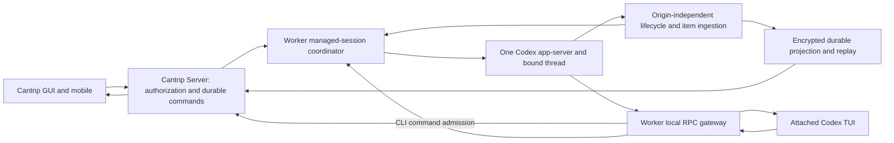

# Codex CLI and GUI mirroring audit

Audit date: September 7, 2026, America/Chicago (September 8 UTC).
Source baseline: `970860ea6b197efaaa491c18fa60b1fa84a743e7`.
Bundled upstream: Codex `0.153.4`, tag `rust-v0.153.4`, commit
`3d2ee51ca2d5db578f328aa75e20aa22c0197c9a`, plus Cantrip's reviewed patches.

## Decision and scope

Cantrip can support an already-running CLI when a new agent chat is created,
with both CLI and GUI controlling and displaying the same conversation. The
existing remote TUI connection is the right foundation. The prerequisite is to
make session configuration, turn ownership, commands and history independent of
which interface initiated the work. Moving the terminal launch earlier, or
adding more transcript polling, does not accomplish that.

**Recommended design:** one worker-owned managed session and native Codex thread;
the TUI and GUI are presentation/control clients of that session. Both use one
authorized command path and one origin-independent event projection. Prepare
the session and attach its CLI at chat creation, without submitting a prompt
or forcing the user out of the GUI. Do not attach a second execution engine or
use terminal text as the conversation database.

The original audit was documentation only (PR #1849). Implementation progress
below records subsequent passes; the source findings and baseline validation
sections remain historical evidence, not claims about the final implementation.
Each implementation pass uses its own PR/worktree and squash automerge.

### Implementation progress

**Pass 1 (#1850) — metadata and existing-thread preparation:** goal reads now use native
`thread/goal/get` directly, including unloaded threads. Existing-thread goal
mutations and plan observation preserve native configuration; a cold preserving
load sends only `threadId`. Plan observation no longer writes its display
fallback into native settings. Missing applied plan information remains a
fallback, not a confirmed native settings snapshot.

Existing-thread preparation is serialized through native resume and MCP catalog
readiness. Identical concurrent configurations reuse the result, while explicit
empty MCP configuration remains an actual configuration operation. An attempted
unsubscribe invalidates cached attachment/configuration/readiness; failed resume
surfaces the actual error without silently creating a replacement conversation.
Runtime teardown invalidates pending preparation, and retired socket/process
callbacks cannot clear replacement runtime state. Managed MCP catalog requests
now attempt the native operation without a capability-inventory prerequisite.

Validation: 114 tests passed across eight focused worker files, including 14
preparation regressions and one actual bundled Codex `0.153.4` protocol test;
worker typecheck and diff/format checks passed. The native test uses an isolated
home, a real stdio MCP fixture and a rejecting local provider, with zero model
requests, turns or tool calls. It proves named-thread minimal resume preserves
settings/MCP and metadata reads preserve plan mode; unloaded durable goal reads
do not start the thread or MCP. The two stale disabled-CUA instruction fixtures
identified during the audit now assert the existing disabled notice explicitly.

**Pass 2 — live empty-thread attachment:**
Pass 1 exposed native resume rejecting newly started unnamed, empty threads
because their history was not yet materialized. Reviewed patch `0010` now
persists the existing durable live recorder and pending creation metadata before
by-ID attachment. It covers concurrent joins and retries after a metadata write
fails with the recorder already visible. Resume-derived metadata remains
deferred until a new append; opening another view does not flush those facts.

The patch handles the typed missing-thread error and the pinned local store's
exact missing-rollout error without inventing a prompt, name or replacement
thread. Ephemeral, archived and unrelated storage/invalid-request failures retain
their error paths. Live paginated metadata writes now require SQLite success,
so a failed insertion is reported and its pending update remains retryable.
Legacy optional metadata-indexing behavior is preserved.

Validation of the updated native test build: all 49 resume tests and all 240
thread-store tests pass using the upstream `ci-test` profile with
`RUST_MIN_STACK=33554432`. The seven independent worker/native protocol tests
also pass against that build. They cover concurrent remote clients for legacy
and paginated history, unchanged thread/session identity and settings, MCP
inventory, settings notifications, reconnect, invalid paths, ephemeral threads,
real storage obstruction/repair and an SQLite-trigger metadata failure followed
by same-session recovery. These fixtures submit no model turn or computer input.
The final packaged release built successfully and passed the same seven protocol
tests. Worker typecheck, format/diff checks and pristine-upstream/patch
verification passed. This verifies native empty-thread attachment, not the full
CLI/GUI integration acceptance matrix below.

**Pass 3 — shared preparation and attachment:**

The worker serializes preparation by authenticated server/owner/worker/chat
identity and recovers the native thread through a private association journal.
It records the actual thread before later configuration, MCP readiness or plan
application can fail. A retry finishes incomplete preparation; subsequent view
attachment preserves root settings. Placement, workspace, provider/account and
route participate in recovery identity. The queue ends before model execution.
The journal supplements canonical server routing and stores neither credentials
nor prompts; command admission and history recovery remain separate work.

Console creation, direct attachment, relay attachment and WorkerLink grants use
one complete server configuration builder, including custom child models and
idle CUA eligibility. Canonical thread binding must succeed before a new console
can launch. Project agent chats use the shared coordinator for GUI preparation
and console attachment. Standalone Chat remains outside console eligibility.
MCP resolution runs after coordinator identity recovery: an omitted list on an
existing preserving attachment remains omitted, while explicit `[]` replaces it
and an unbound or incomplete session receives managed configuration.
Current server routes always supply the complete managed map for cold recovery.
A compatibility caller that cold-resumes with MCP omitted gets native minimal
resume semantics: it cannot recover a transient managed overlay and may start
inherited account MCP. That is not evidence of managed-profile preservation;
durable configuration-revision recovery remains part of the outstanding goal.

Idle MCP sessions expose initialization/catalog operations without granting a
synthetic execution lane. Protected operations require actual active authority.
Replacement and deactivation apply to the exact lane. Each replacement binding
has its own opaque connection file and generation; an old broker cannot overwrite
or remove a successor's file. Only the same live binding reuses a connection.
CLI-originated turn registration is not implemented by this idle-session change.

Reviewed native patches implement three related contracts:

- `0011`: the exact bound remote TUI uses `PreserveExistingThread` and skips the
  startup model-migration prompt. Managed launch omits model/security/cwd overrides
  while retaining local provider bootstrap and the PTY workspace. Ordinary CLI
  launches keep their normal prompt and configuration behavior.
- `0012`: strict thread-scoped managed configuration replaces MCP, developer
  instructions and child defaults while preserving current root settings. New
  starts and cold resumes apply the replacement before MCP initialization;
  shared live engines use `thread/managedConfig/update`. The owned in-memory
  overlay survives ordinary configuration rebuilds and rebases concurrent reloads.
  Validation precedes publication. The response acknowledges configuration, not
  successful MCP initialization; the worker observes the actual catalog.
- `0013`: new empty roots persist a complete owned settings snapshot before
  attachment. Cold recovery restores exactly owned root settings, including
  collaboration mode and canonical permission-profile material, under current
  constraints. Explicit overrides remain authoritative; child/fork/wrong-owner
  settings do not leak into the root. Managed MCP credentials are not persisted
  in native rollout settings and are supplied freshly during preparation.

Actual `thread/closed` and `notLoaded` events invalidate pending preparation and
cached configuration/readiness. Ordinary idle events do not. Late configuration
or plan replies cannot acknowledge a closed thread or replacement runtime.
Only the worker's own unsubscribe/resume replacement can adopt a new preparation
version; an unrelated close during cold resume rejects the stale response.
Full native incarnation/command correlation remains a later pass.

Plan Mode reads now return a live cached mode or an explicitly observational
fallback without starting or loading a native thread. The prior cold read would
initialize inherited account MCP without obtaining a settings notification.
An isolated actual-native regression proves Plan GET leaves `thread/loaded/list`
empty, MCP logs unchanged and provider requests at zero. This is not a complete
native settings read API; desired/effective settings parity remains outstanding.

The patch verifier now actually applies the ordered series to a disposable copy
of manifest-verified source. It no longer checks dependent patches independently
against untouched upstream. Two real-entrypoint regressions prove dependent
patches apply, a broken later patch fails by name, and source/index stay unchanged.
All 6,499 imported files and the 12-patch series verify successfully.

History reads now follow the exact runtime bound during managed preparation,
including its child profile, without selecting a currently executable child
route. The binding includes authenticated server/owner/worker/chat identity,
thread, workspace and root route/account. A live observation uses the existing
transport directly; actual read errors propagate. Without a live binding,
current authorized root bootstrap performs `thread/read` without loading the
native thread or MCP. This retains existing history-baseline semantics; durable
all-turn replay is not implemented by the observation registry.

Cold recovery preserves the selected service tier independently from feature
and model eligibility for an actual request. Patch `0013` captures the merged
caller/snapshot selection before filtering and restores it only to the exact
owned root; request filtering remains unchanged. Strict configuration validation
accepts native custom effort strings and rejects invalid empty/nonstring values.

Validation:

- The standard `pnpm codex:build` completed and the final packaged runtime passed
  all 13 tests across observation, empty-thread attachment, actual remote TUI and
  production worker/coordinator fixtures. These exercise live/reopened/cold views,
  exact session identity, complete root settings, managed catalog/credential
  replacement, sibling isolation, invalid requests and actual storage failure
  followed by same-session recovery.
- The final native app-server resume suite passes all 64 tests. The selected-tier
  ownership test and eight persisted-settings unit tests pass, including actual
  cold recovery with feature filtering disabled. The full thread-store suite
  passed 240 tests before the final tier-only change.
- Worker preparation, coordinator, observation, MCP, terminal, runtime and CUA
  lifetime/child-ownership selections pass 144 tests across 11 files.
- Focused server selections pass 18 tests; two additional regressions exercise
  actual requested and notification-driven reconciliation after real child-route
  selection fails. Two real HTTP/database console cases also pass, covering
  encrypted canonical binding, reuse and persistence failure/retry.
- Managed protocol tests pass four tests; ordered patch-verifier regressions
  pass two. Worker/server typechecks and diff/TypeScript formatting checks pass.
  A read-only Rust formatting check identifies only the existing `TurnPause`
  import ordering introduced by patch `0004`.

Native fixtures use isolated homes and local rejecting providers and synthetic
MCP services, with external plugin marketplace downloads disabled in those test
homes. First start and cold recovery record zero excluded inherited MCP
initializations and zero model requests. The production-worker fixture records
initial native writable-project trust during new-thread creation, then verifies
that view attachment, chat settings changes and cold recovery do not make further
account configuration writes. This does not establish command/default-write
mediation, which remains a later milestone. No desktop input is performed.

**Pass 4 (#1853) — shared native command admission:**

The isolated implementation adds durable admission, dispatch, settlement and
pending-reply records. Worker-protected request/result content is bound to its
chat and operation; keyed digests avoid exposing guessable prompt hashes.
Admission checks canonical placement, thread, route/account and activation.
Dispatch rechecks the exact operation and runtime generation. An uncertain
transport result does not authorize another native dispatch.

A loopback gateway mediates terminal mutations before forwarding them. GUI
controls join the same adapter and pending-interaction resolver. GUI Stop uses
the admitted native session instead of selecting another executable model route.
Preparing a rollback can bind an accepted parent operation without dispatching
its future turn or granting computer-use authority. Excluded Task and standalone
paths retain their existing execution behavior.

Reviewed native work covers managed terminal reply acknowledgment and preventing
implicit account-default writes when changing managed chat settings. A separate
native gate requests fresh admission before each queued or goal-driven turn,
including cold-resume queue wakeups. Its proposed native turn ID is retained
through actual execution. Stop invalidates pending tickets outside the native
per-thread request queue; a new explicit queue/goal start can rearm the runner.
Normal child execution remains under the admitted root's authority.

The final standard packaged build includes reviewed patches `0014` and `0015`;
all 6,499 imported files and the ordered 14-patch series verify. The production
worker gateway, runtime and adapter now pass terminal and queue fixtures against
that binary and real Fastify/PGlite authority. They cover three actual turns,
GUI Stop, fresh activation generations and final canonical idle state. Native
queue/goal tests separately establish admission before model input, rejection of
stale tickets and cold queue gating. These results do not establish the entire
remote-TUI, history and settings acceptance matrix.

Real database integration exposed two receipt defects: native acknowledgment
and terminal evidence needed separate immutable protected records, and a scoped
queue command's nested turn result must not be reconciled as if that command
owned the execution. Both are corrected. GUI cleanup now retains its logical
reservation until the server acknowledges committed completion; Stop and replies
remain independent of this wait. An actual native GUI-parent/queued-successor
fixture proves physical completion alone does not release the successor, and
that the successor starts after canonical completion acknowledgment.

GUI goal/compact/rollback commands carry full managed configuration. Goal creation
uses one durable operation and the native goal runner without a duplicate
synthetic initial turn. Pending-start Stop and delayed queue/goal commands are
fenced by durable cancellation state. Fresh GUI retry admission now preserves
one reserved logical lane while replacing attempt and authority generations;
protected continuation transport and Stop/admission-race tests pass. Initial
preparation runs inside the same cancelable retry boundary, with exact logical
root cancellation retained even before preparation registers. A stopped older
preparation cannot register a turn over a newer request.

The actual packaged runtime passes five real-server/database cases: terminal,
queue, GUI-to-queue handoff, GUI capacity retry and GUI compaction replacement.
The capacity case reproduces native
`active` → `systemError` → `serverOverloaded` → failed completion, waits the
real retry delay, then obtains a fresh admission and completes successfully.
`systemError` revokes CUA without prematurely discarding the admitted turn;
actual closure/not-loaded events still tear it down. The compaction case uses an
actual provider error, prepares the replacement under the shared coordinator,
binds it through canonical continuation admission, and completes a fresh turn.
Its queued successor remains gated until logical completion is acknowledged.
It explicitly attaches a new view; automatic retargeting of an already-open TUI
and transfer of existing queue/history are not established by this test.

That replacement test exposed a reload that discarded the native gate when
ordinary turn inputs omitted managed MCP configuration. The worker now retains
acknowledged managed overlays separately from readiness caches, including the
current runner generation. Omitted inputs inherit the owned overlay; explicit
empty MCP and null child defaults remain removals. Managed configuration changes
use the live update path without self-unsubscribing the sole observer. Catalog
failure does not erase acknowledged ownership; actual closure or transport
replacement does. A successful gate rebind updates the retained generation.

Worker/adapter/coordinator/preparation selections pass 115 tests; root
continuation, cancellation, transport, encryption
and runner selections pass 28. Server admission/approval selections pass 48.
App, worker and server typechecks pass. Ordered upstream verification passes.

A broader worker selection before the final overlay change passed 134 tests
and repeated the same three known
`goal-streaming.test.ts` failures verified on the unchanged pass baseline: two
legacy goal/identity timeouts and the missing first-checkpoint assertion. These
are recorded failures, not successful goal-streaming validation. The final
focused selection above covers the overlay changes; both legacy owned-close
cases also pass a fresh targeted rerun. The packaged five-case native fixture
passes in 29.96 seconds with local synthetic provider responses and real native
protocol/database operations, without mocked admission or execution success.

**Pass 5 — one managed queue:**

Post-merge source inspection confirms three independent queue paths: GUI rows
in `queued_prompts`, Codex's durable `thread/queue/*` API, and the interactive
TUI's local `VecDeque`. The TUI drains its local queue into direct turn submits
and ignores `ThreadQueueChanged`; forwarding GUI calls to the native durable
API alone would not produce a shared queue. Native durable queue items contain
only ID, input and client message ID. They do not represent frozen items,
per-item mode/model/effort/custom-child/worktree selection, and enqueue assigns
a fresh ID without deduplicating the client message ID.

The selected owner for managed sessions is therefore **Cantrip's canonical
queue**, retaining those existing product semantics. The worker gateway
serves native-shaped queue reads and mutations from protected canonical data;
managed queue mutations do not also enter Codex's independent scheduler. The
reviewed managed-TUI patch replaces local queue draining with this shared
queue and consumes its revisioned notifications. Ordinary unmanaged CLI behavior
and excluded standalone/Task behavior remain separate.

Implementation requires durable item revisions and dispatch claims tied to the
logical native operation, atomic queue mutation/command settlement, and stable
identities for retry and consumption. An uncertain dispatch retains its claim
for reconciliation rather than replaying the input. Worker-side protection must
preserve the complete native input vector alongside GUI display data. Existing
native queue entries need a fenced, idempotent import before acknowledged
removal; missing entries alone do not prove nonexecution.

This pass also needs recovery for a lost logical-completion acknowledgment.
Physical cleanup is insufficient to release a successor, but a committed exact
logical completion must remain observable and retryable after a notification
failure. Recovery must not depend on another user message or resubmit the turn.
Implementation now includes the canonical revision/claim protocol, gateway
virtualization, protected queue projection, GUI revision-aware edits, and a
durable exact-root logical-completion outbox. Native command receipts distinguish
an actual model turn from acknowledgment of a shell/settings/goal command. The
worker normalizes encrypted GUI edits before admission, so editing a slash
command cannot retain the previous command's execution classification.

The worker seals the complete native input vector under an owner/server/chat/item
encryption domain. Local image/audio bytes are captured before queue acceptance
and projected through the existing attachment store with encrypted metadata for
GUI display. Attachment mappings preserve surviving media IDs across native edits,
remove media deleted in the GUI, and avoid appending the same attachment twice.
Changed bytes cannot overwrite an accepted attachment merely by reusing a command
ID. Failed upload attempts can be abandoned without deleting the completed file
or requiring a worker restart. Remote URLs retain native fetch semantics; these
are not automatically downloaded by queue projection.

GUI edits, removal and reordering now recover a lost response through a read-only
operation-receipt lookup. The original accepted item remains available after
consumption or later edits, so recovery does not reconstruct or resend the
mutation. Missing, mismatched or unavailable receipts leave the action
unconfirmed. The client pins its authentication lifetime before preparing an
edit and rejects a replacement login even for the same account.

Legacy queue transfer preserves uncertain and conflicting records separately
from executable items. The GUI decrypts and displays their saved prompt and
attachment names in a read-only transfer list; a missing native row alone does
not authorize execution. Changes in transfer status advance the canonical queue
revision so connected views can refresh without another input.

The GUI also projects actual start claims for each item revision. Preparing,
starting, unconfirmed and rejected attempts no longer all look like ordinary
waiting prompts. Unresolved claims disable row mutations; rejected attempts
offer an explicit retry. A stale claim cannot label or disable a newer edit.
An explicit queued retry receives a new native root identity through its new
claim, while repeated delivery of the same claim remains idempotent.

Recovered GUI outcomes now carry the original root operation and generation
from the worker command. Server recovery validates that root against its
canonical client message, worker, lane and current lineage before finishing the
logical input and creating its completion outbox entry. Native turn identifiers,
when supplied, are checked too. This closes the surviving-worker/server-reconnect
path; the existing worker transport buffer is memory-only, so this is not proof
of complete worker-restart outcome recovery.

Focused validation currently passes 22 worker input/encryption/attachment tests
and 15 app encryption/API/rendering tests, including observed-revision preservation,
lost-response recovery, authentication replacement, and separate projection of
all three pending transfer states and revision-scoped start controls. App
typecheck passes. The worker transport suite passes 23 tests, including actual
WebSocket reconnect with exact logical roots on successful and failed managed
outcomes, and unchanged legacy outcomes.
The independent completion delivery helper passes seven tests for lost
acknowledgments, restart, persistence failure, shutdown and retry without a UI
reconnect. Worker and real-database integration tests cover goal handoff and
queue transfer; actual native acceptance results are recorded separately below.

The final standard packaged build with reviewed patch `0016` succeeds. Its
actual remote PTY fixture passes canonical idle-Tab addition, stable item IDs,
reorder, edit, deletion with a deliberately dropped committed acknowledgment,
automatic native reconnect, and exact original mutation-envelope recovery. It
records zero model requests and no local queue execution. Initial fixture
failures identified the missing managed idle-Tab path, then two test-input
issues: bracketed paste must be distinct from Enter, and reconnect editing must
wait for the actual TUI reconnect notification.

The actual goal RPC fixture exposed managed cold resume retaining its serialized
thread request handler while waiting for autonomous admission, blocking a
subsequent goal read. Managed cold resume and active goal creation now schedule
their continuation outside that request slot. Native regression coverage proves
first and cold goal reads remain responsive during admission, with durable goal
epochs, Stop and clear, and zero provider requests in those gate-only cases.

All four canonical execution cases pass against the final packaged runtime:
GUI queue input, native queue input, queued goal followed by its successor, and
clearing a goal before its first admission. They use the production queue
dispatcher, GUI HTTP route/native gateway, real Fastify/PGlite admission and actual
native model requests. Plain-input cases obtain the actual start acknowledgment
before model completion and recover original add/start receipts after consumption
without replay. Goal handoff correlates the first turn's exact epoch and keeps
the successor queued until its release. Clear-before-start admits zero goal model
requests, leaves no goal or scheduled wake, and permits exactly one successor.

These fixtures found a reply decoder expecting an RPC envelope where the GUI
adapter stores a direct `TurnStartResponse`; it now accepts both actual producer
shapes while retaining turn/claim correlation. A cleanup timeout was reproduced
when the test immediately raced runtime shutdown's SIGINT with SIGTERM. The
fixture now waits for actual exit before escalation and fails if forced killing
is required. All four final cases terminate successfully; the initial timeout
is not counted as a pass.

The final native source passes all 16 queue RPC tests, 119 terminal queue
compatibility tests, six focused terminal tests, all 64 resume tests, and 190
state tests. The ordered series verifies all 6,499 imported files and 15 patches.
The standard release build completed in 14 minutes 58 seconds, the final remote
PTY case passed, and the four canonical execution cases passed in 21.87 seconds.
These queue tests do not establish the entire integration acceptance matrix.

Local validation also covers 52 real database/recovery cases and 215 focused
worker cases before final acceptance extensions. Server typecheck and repository
decomposition checks pass after extracting the new queue settlement and outbox
helpers without changing their transactions. Completion-delivery wiring remains
under the application bootstrap budget, with all seven focused delivery tests
passing. The large-file check passes. The application decomposition check still
reports `chat-turn-runtime.ts` (baseline 2,248 lines; current 2,260) and unchanged
`task-routes.ts` (2,149), both above its 1,999-line budget. These are recorded
failures; this pass does not claim the full repository check is green.

An independent review reproduced an accepted split-text `/plan` command failing
at dispatch. Classification and execution now share text-prefix handling across
native vector boundaries, preserving intervening rich inputs and later byte
spans. All 25 codec/command tests and worker typecheck pass after this fix.

Committed terminal and goal-control receipts now schedule successor dispatch
without awaiting it. Real authenticated HTTP tests hold that dispatcher open
and still receive the receipt, then verify a detached dispatch rejection is
observed. The durable dispatcher remains the recovery path after a lost wakeup.
Read-only receipt recovery also permits a current authorized view to reconcile
the original operation after its queued model route/account changes. Mutation
admission remains fenced; thread/placement changes still require the separate
continuation and presentation-retargeting work below.

**Still outstanding:** completion of authorized command admission, origin-independent
lifecycle/CUA authority, durable all-turn projection/replay,
complete settings parity, eager GUI-first session startup and the full acceptance
matrix. Native-thread replacement also needs complete presentation retargeting
and queue/history continuity; canonical GUI retry handoff alone does not prove
that an already-open TUI follows the replacement. The
original GUI-first launch trigger remains until its prerequisites are
implemented. No user app/worker restart, personal desktop interaction or CI job
has been used.

### What “perfect mirror” must mean

It means equivalent conversation and control state, not pixel-identical terminal
and web layouts. Both surfaces must show the same accepted user input, assistant
content, supported tool/agent activity, attachments, settings, pending questions,
queue, usage/timing and authoritative turn outcome. Switching surfaces must not
start, stop, duplicate, forget or reconfigure work.

| Requirement                                              | Current state                                                   | Needed result                                                                                           |
| -------------------------------------------------------- | --------------------------------------------------------------- | ------------------------------------------------------------------------------------------------------- |
| Add an agent tab and immediately boot the CLI            | New chat creation does not launch a console                     | Prepare one bound native thread and one reusable PTY without inference; keep GUI view available/default |
| Correct MCP before first input                           | GUI turn setup is richer than console/ensure setup              | All entry points materialize the same complete, revisioned session configuration                        |
| GUI `/model` behaves like its composer selector          | Explicitly excluded from GUI slash commands                     | Same picker, validation and settings command; native `/model` reconciles back to the same chat          |
| CLI work appears live in GUI                             | External turns mostly use snapshot reconciliation               | All native turns enter the same live projector and durable history                                      |
| GUI work appears in CLI                                  | Same remote thread is already supported                         | Side-effect-free attach/resume, consistent settings and pending interactions                            |
| Stop and follow-ups work from either surface             | Control lookup assumes GUI-owned execution                      | Resolve the actual current native turn; acknowledge each command and input                              |
| History survives reconnect/restart/failure               | Memory baselines and best-effort revisions can lose repair work | Durable acknowledgment, replay and stable native item identity                                          |
| Computer use works after preboot and either input origin | Authority depends on GUI `runTurn` tracking                     | Idle session eligibility separated from exact, revocable native-turn authority                          |

The target applies to managed **agent** chats. The separate standalone Chat
product currently excludes external-console synchronization and has a narrower
tool profile. Do not silently broaden it while enabling agent tabs: define the
experience/context eligibility explicitly and test every eligible placement,
including project/worktree and any supported agent scratch context.

## Evidence and confidence

Findings below are based on current source, relevant revert diffs, upstream
protocol/TUI code, and the focused tests recorded later. Sources are linked by
path with baseline line anchors; symbol names identify the code if lines move.
“Proposed” means work that does not exist yet. A source-supported payload or
missing branch is not presented as proof of every historical screenshot's
runtime cause.

Official documentation describes thread start/resume, lifecycle notifications,
and a read operation that does not subscribe to events. It also identifies the
WebSocket transport as experimental. The version-pinned local implementation is
the authority for Cantrip's integration details. See the
[official app-server documentation](https://learn.chatgpt.com/docs/app-server)
and [CLI command documentation](https://learn.chatgpt.com/docs/developer-commands?surface=cli).
Do not assume that the current public docs exactly match the bundled snapshot.

### Current source map

| Source                                                                                                                                    | Responsibility/evidence                                                                           |
| ----------------------------------------------------------------------------------------------------------------------------------------- | ------------------------------------------------------------------------------------------------- |
| [surface-creation-operations.ts](../cantrip_app/src/components/app/surface-creation-operations.ts#L63), `useProjectChatCreationOperation` | Creates chat and optional initial draft; no eager CLI initialization                              |
| [terminal-context.ts](../cantrip_server/src/app/routes/terminal-context.ts#L48), `installChatLinkedConsoleRoute`                          | Resolves context, ensures thread if needed, persists association, creates/reuses linked terminal  |
| [worker index.ts](../cantrip_worker/src/index.ts#L1436), `agentMcpServers`                                                                | Complete managed MCP composition when attachment/capability material is supplied                  |
| [worker index.ts](../cantrip_worker/src/index.ts#L4552), terminal attach; [thread ensure](../cantrip_worker/src/index.ts#L5619)           | Thin MCP preparation, shared remote endpoint; no-thread launch can omit external-sync preparation |
| [worker index.ts](../cantrip_worker/src/index.ts#L4999), GUI execution; [CUA registration](../cantrip_worker/src/index.ts#L5313)          | Rich chat/lane attachment and actual-turn authority setup                                         |
| [terminal-manager.ts](../cantrip_worker/src/terminal-manager.ts#L175), `codexLaunch`                                                      | `--remote`, optional `resume`, model/effort and hardcoded permission arguments                    |
| [app-server.ts](../cantrip_worker/src/codex/app-server.ts#L5954), `loadThread`                                                            | Configuration fingerprint, start/resume, instructions and managed MCP readiness                   |
| [app-server.ts](../cantrip_worker/src/codex/app-server.ts#L5089), `syncThread` / `prepareExternalSync`                                    | In-memory baseline and filtered history import                                                    |
| [app-server.ts](../cantrip_worker/src/codex/app-server.ts#L6904), `notificationTarget`                                                    | GUI execution lookup used by live event handlers                                                  |
| [app-server.ts](../cantrip_worker/src/codex/app-server.ts#L5518), `interruptChat` / `steerThread`                                         | Controls depend on tracked GUI active turns                                                       |
| [thread-change-reconciliation.ts](../cantrip_server/src/chats/thread-change-reconciliation.ts#L99)                                        | Failed reconcile still consumes a revision                                                        |
| [chat-thread-sync-runtime.ts](../cantrip_server/src/app/runtime/chat-thread-sync-runtime.ts#L55)                                          | History import, status reconciliation and queued-turn release                                     |
| [thread-sync.ts](../cantrip_server/src/chats/thread-sync.ts#L14)                                                                          | Existing `codex-sync:<turn>:<item>` stable message identity                                       |
| [agent-turn-projection.ts](../cantrip_app/src/components/chat/agent-turn-projection.ts#L137)                                              | Rich GUI history/worked-for projection                                                            |
| [chat-resource-refresh.ts](../cantrip_app/src/lib/chat-resource-refresh.ts#L41)                                                           | Live-connected UI disables fallback polling                                                       |
| [slash-commands.ts](../cantrip_app/src/components/chat/slash-commands.ts#L12)                                                             | GUI excludes `/model`, `/permissions`, `/theme`                                                   |
| [use-chat-transcript-controller.ts](../cantrip_app/src/components/chat/use-chat-transcript-controller.ts#L1256)                           | Composer configuration mutations and query invalidation                                           |
| [task-routes.ts](../cantrip_server/src/app/runtime/task-routes.ts#L1853)                                                                  | Durable model configuration update; rejects active runtime edits                                  |
| [execution-lifetime.ts](../cantrip_worker/src/codex/execution-lifetime.ts#L3)                                                             | Exact native turn start/end/replacement and cancellation semantics                                |
| [CUA coordinator](../cantrip_worker/src/computer-use/agent.ts#L160) and [broker](../cantrip_worker/src/mcp/broker.ts#L422)                | Authenticated binding and active native-turn checks                                               |

## What already works and should be retained

### One native runtime is already possible

`CodexAppServer.start` launches `app-server --listen ws://127.0.0.1:0`
([source](../cantrip_worker/src/codex/app-server.ts#L7098)). The linked TUI uses
that live endpoint and `resume <threadId>`. Bundled upstream accepts `--remote`
([CLI options](../cantrip_codex/upstream/codex-rs/cli/src/main.rs#L969)). Its
loaded-thread resume path joins the existing live conversation and registers
the additional connection, rather than reconstructing another execution
([thread_lifecycle.rs](../cantrip_codex/upstream/codex-rs/app-server/src/request_processors/thread_lifecycle.rs#L679)).

This is different from starting independent app-server processes that happen to
read the same rollout file. The latter cannot be the live-mirror design.
Cantrip Server and the browser should continue using the worker boundary;
neither should connect directly to Codex's local endpoint.

### Useful existing building blocks

- Model/provider routing, account-specific `CODEX_HOME`, worker-owned credentials,
  managed server-name precedence, and thread start/resume are already implemented.
- Native turn/item notifications and Cantrip rich normalization already provide
  most of the ingredients for live text, tools, reasoning summaries, usage,
  file changes and turn summaries. Reuse these rather than scraping ANSI output.
- Server canonical messages have stable sync keys. GUI worked-for/history
  projection already consumes structured messages and activities.
- Root/child native turn lifetime tracking correctly distinguishes idle session
  existence from permission to perform CUA during a real turn.
- Long CUA timelines, explicit cancellation, background input and API 19 are
  independent of this audit. Keep untimed managed CUA and human-input coexistence.
- The TUI already has settings update and history hydration protocols. This
  reduces the need for a fork, but does not eliminate integration work.

## Concrete gaps and their consequences

### 1. Early preparation does not reproduce the working MCP configuration

The normal GUI turn passes chat/lane/placement attachment and an enabled flag
derived from computer-use authority to `agentMcpServers`; it registers the actual
authority separately in `onThreadLoaded`. The console ensure and resume paths call it
without the attachment, with computer use defaulting false. General managed
Cantrip and CUA injection require that attachment. Simply calling the console
path during tab creation therefore does not prepare the same tools as the
working GUI turn.

`mergeManagedMcpServers` filters reserved user definitions and lets authoritative
managed definitions win ([managed.ts](../cantrip_worker/src/mcp/managed.ts#L64)).
`codexMcpConfigOverride` emits enabled definitions, required managed servers and
CUA's `js`/`js_reset` with `tool_timeout_sec: 0`
([app-server.ts](../cantrip_worker/src/codex/app-server.ts#L2326)). Preserve both.

`ensureManagedMcpReady` reads actual paginated native tool status, but it also
has a capability-inventory prerequisite and a ten-second readiness window
([source](../cantrip_worker/src/codex/app-server.ts#L5865)). Tool visibility is not
proof that CUA can resolve the current turn. A capability flag is not proof a
real operation would fail. Do not add new inferred preflight gates. Report real
initialization/list/call results and their phases; required MCP startup errors
should remain explicit instead of silently continuing without required tools.

### 2. Metadata reads can become configuration writes

`getPlanMode` and goal paths can call `loadThread` without MCP configuration.
`loadThread` still builds a new fingerprint/configuration and may
unsubscribe/resume the loaded thread. Omitted server input defaults to `[]` in
`cantripChatThreadParams`, producing **“Computer use is not enabled.”**
([instructions](../cantrip_worker/src/codex/app-server.ts#L1910)).

The outgoing replacement instructions are demonstrable. Whether every native
MCP entry is removed depends on upstream merge behavior and needs a pinned
runtime test; this audit does not assert that outcome from the payload alone.
Concurrent metadata, console and turn preparation also need per-session
serialization to avoid conflicting resumes.

Separate **observe**, **ensure loaded with existing configuration**, and
**apply an explicit complete configuration revision**. Omission must mean
unchanged where intended; an explicit authoritative empty list must still mean
disable/remove. A fingerprint is useful for avoiding redundant writes, not as
an independent source of truth that blocks actual operations.

### 3. Attaching a terminal is not guaranteed to preserve settings

Current launch supplies model/effort plus `-a never -s workspace-write`, even
when resuming. Upstream detects session flags as
`OverrideFromCurrentConfig`
([config_persistence.rs](../cantrip_codex/upstream/codex-rs/tui/src/app/config_persistence.rs#L29)).
Ordinary resume can forward model, approval, sandbox and other overrides.
`PreserveExistingThread` already exists and can send only the thread ID
([app_server_session.rs](../cantrip_codex/upstream/codex-rs/tui/src/app_server_session.rs#L1918)).

Some overrides are ignored on a running-thread rejoin
([thread_processor.rs](../cantrip_codex/upstream/codex-rs/app-server/src/request_processors/thread_processor.rs#L94));
this does not prove idle/cold attach is side-effect-free. Establish an explicit
managed attachment contract, test both branches, and remove implicit permission
or model overrides from view attachment. If a narrow reviewed TUI patch is
needed to select preserve-existing semantics, keep it out of pristine upstream.

The no-thread launch path also skips `prepareExternalSync`. Eager startup must
bind the native thread to the Cantrip chat before launching its TUI, rather
than letting an unbound empty TUI invent the session.

### 4. Live tracking and controls assume the GUI started the turn

`notificationTarget` needs `#rootExecutionsByThread`. External CLI lifecycle
events can trigger reconciliation, but assistant/reasoning/command/file deltas
often return early without a GUI execution target. This explains why sharing
the app-server endpoint alone does not give a live mirror.

`interruptChat` and `steerThread` search `#activeTurns`; an externally running
turn may therefore receive no native interrupt or be reported absent. Server
Stop also gates on stored running/waiting state
([chat-execution-control.ts](../cantrip_server/src/app/routes/chat-execution-control.ts#L119)).
A stale projection must not prevent attempting control of a known actual native
turn. Conversely, a late Stop must not cancel the next turn that replaced it.

Follow-up submission uses projected status to decide queue versus new turn
([chat-turn-submission.ts](../cantrip_server/src/app/routes/chat-turn-submission.ts#L118)).
Missing external completion can strand input, while stale idle state can race
an already-running CLI turn. A displayed user bubble is not a native acceptance
acknowledgment.

### 5. Current history sync is a best-effort import, not a durable mirror

`syncThread` selects no turns without its in-memory baseline, excludes baseline
turns, and drops an entire turn containing a `cantrip:` user client ID. It adds
terminal turns to that baseline before server persistence acknowledges them.
Restart clears the baseline; preparing again can baseline history that was
never saved. A mixed GUI/CLI turn can be excluded wholesale.

The server reconciler catches an error and still advances `processedRevision`.
A failed final reconciliation followed by no further activity can leave the UI
stale. A healthy live connection disables polling, so polling is not a complete
repair mechanism either. Status derived from the filtered imported batch is
also not necessarily the current native thread status.

Use stable native identities and durable acknowledged replay instead of
origin-based exclusion. Never acknowledge ingestion before the encrypted
canonical transaction commits. Failed reconciliation must remain dirty and
retryable. A failed observation does not establish completion or cancellation.

### 6. Model configuration has two competing paths

GUI `/model` is explicitly absent. The composer persists Cantrip model IDs,
reasoning and optional subagent selections. Its server route currently rejects
active-runtime edits and does not itself apply native thread settings.

Native `/model` changes TUI context, sends `thread/settings/update`, and also
persists model/effort defaults through config writes
([slash dispatch](../cantrip_codex/upstream/codex-rs/tui/src/chatwidget/slash_dispatch.rs#L296),
[thread settings](../cantrip_codex/upstream/codex-rs/tui/src/app/thread_settings.rs#L21),
[persistence](../cantrip_codex/upstream/codex-rs/tui/src/app/event_dispatch.rs#L2161)).
These are different scopes: effective thread settings, desired chat settings,
and account/user defaults must not be conflated.

The full native `thread/settings/updated` includes model/provider, effort, tier,
permissions and more
([protocol](../cantrip_codex/upstream/codex-rs/app-server-protocol/src/protocol/v2/thread.rs#L289)).
Cantrip's type and handler keep only collaboration mode
([type](../cantrip_worker/src/codex/app-server.ts#L1605),
[handler](../cantrip_worker/src/codex/app-server.ts#L7628)). Consequently CLI model
changes do not update the GUI chat configuration here, and later Cantrip turn
setup can apply its older selection again.

### 7. CUA registration is tied to GUI-owned execution

GUI `onThreadLoaded` registers authority; `resolveComputerUseExecution` requires
a tracked root execution and matching actual root/child turn
([source](../cantrip_worker/src/codex/app-server.ts#L6168)). External
`turn/started` does not create that root. Booting a process, loading a thread,
or seeing a tool in inventory cannot substitute for that ownership.

Retain the correct guarantees in `CodexExecutionLifetime`: no idle grant,
replacement aborts the old turn, terminal-before-start ordering is remembered,
and a stopped turn cannot be resurrected by a late event. The new session
coordinator must enroll CLI-originated actual turns through the same semantics.
Never hold a synthetic “boot turn” open to make MCP work.

### 8. Fidelity includes attachments and unsupported items

Normalization already handles many rich items, but unknown native items become
warnings and live output can be coalesced/bounded. Attachment preservation needs
the external attachment mapping that ordinary `syncThread` does not supply.
Define a supported item inventory and preserve unknown-item identity/type with
an honest placeholder instead of silently deleting history. Restore resolvable
attachments through worker-owned authorized storage. Unavailable source data
must be labeled unavailable, not reconstructed by guesswork.

### 9. Native approvals and Cantrip interactions can have competing responders

The worker's `handleServerRequest` fails closed with “No active Cantrip
interaction channel” when a recognized native request has no GUI-owned callback
([app-server.ts](../cantrip_worker/src/codex/app-server.ts#L8994)). The native
TUI can answer approval/question/MCP elicitation requests directly through its
app-server request handle
([app_server_requests.rs](../cantrip_codex/upstream/codex-rs/tui/src/app/app_server_requests.rs#L207),
[thread_routing.rs](../cantrip_codex/upstream/codex-rs/tui/src/app/thread_routing.rs#L898)).
This is a separate product interaction path, not an unauthenticated Internet
bypass; Codex still has its own permission mechanisms.

Native outgoing requests can target multiple connections, with the first answer
consuming the callback
([outgoing_message.rs](../cantrip_codex/upstream/codex-rs/app-server/src/outgoing_message.rs#L383)).
If both worker and TUI receive the request, worker rejection can race the TUI
reply. This conditional mechanism is established by source; no live race was
reproduced in this audit.

Cantrip's existing GUI reply API validates owner/request, resolution state and
worker/lane identity, then sends a protected worker command
([agent-interactions.ts](../cantrip_server/src/app/routes/agent-interactions.ts#L97)).
The mirror must preserve those checks and designate one native resolver. Both
views show the same request; repeated identical answers can acknowledge the
existing result, while conflicting later answers must not execute twice.

## Proposed architecture

The gateway and unified coordinator are **proposed**, not existing components.
Reuse the existing remote transport. The gateway is where managed TUI mutations
can be correlated/authorized and translated into the same command semantics as
GUI operations; passive event observation alone cannot enforce those semantics
after a direct CLI mutation has already occurred. Read/history/event traffic
can remain native-shaped. Keep the endpoint worker-local, bound to the exact
managed session and authenticated client identity; browser/mobile traffic stays
on the existing server/worker boundary.

CLI mutations, including approval replies and configuration/default writes,
must receive the same server owner/lane/policy validation and durable command
acceptance as GUI mutations **before** native side effects. Use a scoped
managed-session capability; loopback binding alone is not authentication. The
coordinator forwards accepted native operations, not an alternate bypass that
reconciles permissions after execution. If admission is unavailable, show a
pending/unavailable command instead of quietly submitting it through another path.

### Session and execution ownership

Persist a managed session descriptor containing owner/server/chat, worker,
provider/account/route, execution lane and placement, native thread identity,
runtime incarnation, desired configuration revision, last applied revision,
and projection recovery state. Keep credentials worker-side. One runtime may
host multiple sessions; do not accidentally create an app-server per UI pane.

Maintain distinct states:

| State domain              | Examples                                                       | Must not imply                            |
| ------------------------- | -------------------------------------------------------------- | ----------------------------------------- |
| Session preparation       | preparing, ready, failed, disconnected                         | A model turn is running                   |
| Native execution          | idle, active exact turn, waiting, completed/failed/interrupted | UI transport is healthy                   |
| Configuration             | desired, pending, applied/effective, rejected                  | A queued request was applied              |
| Presentation              | GUI attached, TUI attached, hidden, disconnected               | Closing a view cancels work               |
| CUA eligibility/authority | enabled for session; granted for exact active turn             | Idle preboot or history can perform input |

Serialize creation/configuration/commands per session. Concurrent tab creation,
first send and CLI attachment should join the same in-flight preparation rather
than create competing threads. Persist the native identity before allowing the
managed TUI to create input. A restart increments runtime incarnation so old
notifications and replies cannot mutate the replacement session.

Serialize admission and state transitions, not the whole duration of model work
or CUA playback. Stop, steering and interaction replies must remain dispatchable
while a long-running operation is awaiting completion.

### Startup sequence

1. Persist the chat and its placement/configuration; schedule idempotent session
   preparation immediately on creation for eligible agent chats.
2. Resolve the actual runtime route/account and worker workspace. Construct a
   complete managed MCP/instructions/security snapshot using the same builder
   for preboot, first GUI send, console open and reattachment.
3. Start or reuse the worker app-server, initialize the real protocol, start or
   load the bound thread and subscribe its coordinator to lifecycle events.
   Attempt actual operations and expose their errors; do not infer failure from
   missing cached flags or unrelated registry contents.
4. Observe actual MCP startup/tool inventory for that configuration revision.
   Display initializing/failed/ready accurately, and keep required-tool errors
   actionable. Discovery must not invoke CUA capture/input or fabricate a turn.
5. Attach one reusable CLI PTY to the already-bound thread using preserve-existing
   settings. It may run while its view is hidden. GUI remains the initial view;
   any later preferred-view setting is separate from whether the session boots.
6. A first message arriving during preparation waits on that same operation,
   then receives an explicit native acceptance or visible failure. Never send a
   synthetic warm-up message, silently drop the real prompt, or create a second
   thread as a fallback.

Closing a view detaches it. Chat archive/delete/explicit termination can close
the managed session according to product policy. Define idle eviction separately:
eviction must preserve binding/history and transparently reattach on use, not
delete a conversation or masquerade as a stopped turn.

### Commands, queues and approvals

Use commands with stable operation IDs, session/runtime incarnation and an
expected turn or configuration revision where relevant. Both origins need
accepted/rejected/pending/applied outcomes. Do not derive command success from
rendered text. Never automatically replay an uncertain model submission or
side-effecting tool action.

- Route submit, steer, interrupt, pause/resume, queue edits and settings through
  the same coordinator. Use the actual native turn ID for Stop/steer; stale
  displayed idle must not block a valid native attempt.
- Choose a single queue owner. Prefer a typed native queue behind the coordinator
  if the pinned contract supports the required behavior; otherwise retain one
  durable Cantrip queue. Never maintain two independently executable queues.
- Persist pending approvals/questions by native request identity. Exactly one
  accepted reply resolves it for both surfaces. A second/late answer is a visible
  conflict, not an instruction to retry another tool action.
- CLI-originated work needs normal server execution-lane attribution and
  authorization. Observing a native event does not grant permission to bypass
  Cantrip policy or publish arbitrary content.
- Register actual-turn CUA ownership before accepting its tool request, using
  authoritative native start and command correlation, not a wall-clock guess.
  Account for start events arriving before request acknowledgment. Stop/revoke
  invalidates the exact lifetime; a later authorized turn gets a fresh grant.

### History, status and replay

Use stable native `(threadId, turnId, itemId)` plus item revision for durable
deduplication. Runtime incarnation scopes transient event sequencing, leases and
stale-event rejection; it must not enter the durable item key, or restart replay
would duplicate history. GUI user-message operation IDs
map to native client IDs rather than excluding their whole turn from repair.
Native notifications need not supply a durable global sequence: the worker can
journal a monotonic ingestion sequence and record recovery checkpoints.

Apply live deltas and complete-item/history snapshots to the same projector.
Maintain a high-water boundary while reading a snapshot, buffer concurrent
events, then apply newer events without regressing completed items. Status comes
from authoritative thread/current-turn lifecycle, not “some old imported turn
failed.” Terminal outcomes settle worked-for/tool rows exactly once.

Only advance durable replay acknowledgment after canonical encrypted messages
and state commit. Retry dirty reconciliation with bounded backoff after actual
failures even if the UI connection is healthy. Reconnect performs snapshot plus
replay, not a fresh baseline that discards unseen history. Preserve current
server encryption/ownership boundaries; do not introduce plaintext transcript
logs or duplicate unprotected stores for debugging.

Current external reconciliation receives normalized plaintext at the server,
then `upsertLiveChatMessage` calls worker `chat.message.protect`, stores the
encrypted result and publishes encrypted summaries
([live-mutation-runtime.ts](../cantrip_server/src/app/runtime/live-mutation-runtime.ts#L242)).
It is therefore not currently a wholly worker-local plaintext path. For the new
projector, normalize and protect CLI-originated content on the worker before
publishing durable opaque messages; keep routing/lifecycle metadata available
for server ownership and reconciliation. This is a proposed boundary improvement,
not a claim that the existing path already behaves that way.

A disconnected worker may be unobservable while the native process is still
running. Show that uncertainty and inspect the actual live handle/turn when
connection returns. An observation timeout is not proof of termination and
must not start replacement work by itself.

## Configuration and `/model` parity contract

Maintain **desired Cantrip chat configuration** separately from the **native
effective snapshot**. All mutations carry a revision/origin/operation ID.
`thread/settings/update` acknowledges submission with `{}`; authoritative
`thread/settings/updated` follows native `ThreadSettingsApplied`
([native handler](../cantrip_codex/upstream/codex-rs/app-server/src/bespoke_event_handling.rs#L1305)).
Do not display “applied” just because the request was queued.

Picker inventory also needs parity. The managed model catalog currently starts
from the selected root model plus optional custom subagent model
([model-catalog.ts](../cantrip_worker/src/codex/model-catalog.ts#L167)). Define one
eligible catalog for the active provider/account and expose it to both GUI and
native `model/list`; merely synchronizing the selected value does not make the
other choices available in the TUI. Keep cross-provider choices as explicit
Cantrip route migrations rather than pretending native model strings encode them.

| Setting                         | Required mapping and behavior                                                                                                                                                                                                                                          |
| ------------------------------- | ---------------------------------------------------------------------------------------------------------------------------------------------------------------------------------------------------------------------------------------------------------------------- |
| Root model                      | Map Cantrip model ID to native model plus provider/account/route. Reverse mapping must be unambiguous; duplicate slugs cannot select an arbitrary account.                                                                                                             |
| Reasoning effort                | Use the selected model's supported values; preserve explicit/default semantics. Do not carry an invalid previous-model effort silently.                                                                                                                                |
| Service tier                    | Add an explicit durable/product policy if supported. Native update distinguishes omitted (preserve), null (clear), and value (set). It is absent from current Cantrip model configuration.                                                                             |
| Permissions                     | Translate authoritative permission profile to native settings. A CLI change must receive the same policy validation; hardcoded terminal launch flags cannot become an escape hatch. Unrepresentable native settings need an explicit custom-state policy or rejection. |
| Plan/collaboration mode         | Retain existing projection but reconcile it in the same complete settings snapshot.                                                                                                                                                                                    |
| Subagent settings               | Cantrip root/custom-child configuration has no one-to-one `/model` equivalent. Preserve explicit custom child settings; root changes affect inherited settings only under the documented inheritance rule.                                                             |
| Provider/account change         | Native thread settings update has no provider-switch field. Treat cross-route selection as a controlled idle migration with documented thread continuity, or visibly reject unsupported migration. Do not claim a model-string update changed account/runtime.         |
| Account/user defaults           | Native `/model` also writes config defaults. Keep this scope separate from chat selection; recommended managed mode changes the chat only, with an explicit action for account defaults. Mediate native config writes rather than silently changing other chats.       |
| MCP/instructions/CUA enablement | Full authoritative revision; metadata reads preserve it. Explicit disable removes tools/eligibility and revokes active CUA as required.                                                                                                                                |

Implement GUI `/model` by opening the same picker/controller as the composer.
If arguments are supported, resolve them through the same catalog and error
handling. Never send `/model` as a model prompt or simulate typing it into the
terminal. Apply the same approach to `/permissions`; visual `/theme` need not
mutate agent configuration.

For native `/model`, mediate its typed settings request, apply authorized chat
selection, consume the full native settings notification, and update durable
Cantrip state and both views. Do not echo an observed applied notification back
as another settings mutation. Serial revision ordering prevents a delayed GUI
write from undoing a newer CLI selection.

Recommended active-turn policy: show a pending selection for the next turn,
matching the native thread-settings contract, without rewriting attribution of
the running turn. Route/account migrations wait until idle. If this requires
changing the GUI's current `409 chat-runtime-active` behavior, do so explicitly
and test both origins; do not leave asymmetric rules.

The bundled TUI can downgrade unsupported settings updates to local best effort
([app_server_session.rs](../cantrip_codex/upstream/codex-rs/tui/src/app_server_session.rs#L1140)).
That downgrade is not a successful mirror. Surface unsupported/error state and
retain the last confirmed effective configuration. Windows sandbox handling
has a specific upstream limitation in this update path
([thread_settings.rs](../cantrip_codex/upstream/codex-rs/tui/src/app/thread_settings.rs#L144));
do not promise parity there until an actual supported path is implemented.

## Implementation cycles and rollout

Each row is an independently reviewable PR/worktree/automerge cycle. Preserve
working computer use and current GUI-first startup until the last enablement
step. Do not reapply all reverted commits as one patch.

| Cycle                                        | Concrete deliverable                                                                                                                         | Required proof before the dependent cycle                                                                                                |
| -------------------------------------------- | -------------------------------------------------------------------------------------------------------------------------------------------- | ---------------------------------------------------------------------------------------------------------------------------------------- |
| 1. Managed session preparation               | One bound session descriptor, shared full MCP/context builder, serialized ensure/config, side-effect-free metadata reads and terminal attach | Racing prepare/send/attach produces one thread; reads and attach preserve MCP/instructions/model/security; explicit removals apply       |
| 2. Origin-independent lifecycle and commands | Shared native execution tracking, CLI command mediation, Stop/steer/queue/interaction ownership, actual-turn CUA registration                | CLI-first and GUI-first turns get the same attribution/authority; Stop and later fresh turns work in both directions                     |
| 3. Durable mirror and recovery               | All-turn live projection, item deduplication, acknowledged replay, dirty retry, attachments and terminal summaries                           | Drop events, fail persistence, restart worker and reconnect: both views converge without duplicate input/history or false completion     |
| 4. Settings and slash parity                 | Complete native settings schema, desired/effective revisions, `/model` and `/permissions` UI commands, native TUI settings/default mediation | CLI choice survives next GUI turn; GUI choice is shown in TUI; concurrency/active-turn/default-scope cases are deterministic             |
| 5. Eager idle startup                        | Chat creation prepares session and PTY without inference; hidden TUI, GUI-first view, explicit boot/error state and reusable attachment      | Empty tab starts exactly one CLI; immediate first send shares preparation; zero synthetic turns; failed startup is visible and retryable |
| 6. Fidelity and rollout acceptance           | Full matrix below on the pinned runtime; platform limitations resolved or clearly recorded; enable intended default                          | User can start, switch, interrupt, configure and continue from either surface with complete matching history/status                      |

Suggested code boundaries: worker session coordinator and command adapter;
complete settings translator; lifecycle/event projector; server durable command
and ingestion records; app shared configuration controller and surface attachment
state. Keep provider routing, credentials, filesystem/PTYS and Codex processes
worker-owned; durable user-visible configuration/routing remains server-owned.

Schema changes will likely require migrations for session/config revisions,
ingestion acknowledgment/dirty state, operation status and possibly service tier.
Backfill existing chats without erasing history: bind existing thread IDs, dedupe
by native item identity, and reconcile before advancing the new cursor. Version
worker/server protocol changes together. On rollback, stop scheduling eager
boots and return to the existing launch trigger without deleting transcripts or
allowing an old worker to execute commands it cannot interpret.

### What the reverted experiments teach

| Experiment                                         | Current ancestry        | Lesson                                                                              |
| -------------------------------------------------- | ----------------------- | ----------------------------------------------------------------------------------- |
| #1835 (`271daeaa2`) eager CLI/new-tab preference   | Reverted by `ea9ff4c97` | Combined startup, view preference and model behavior; separate those concerns       |
| #1841 (`a8eb77b26`) linked CLI placement           | Reverted by `f1adb8cf3` | Rendering a terminal in a pane does not establish lifecycle parity                  |
| #1844 (`f4ad4fb99`) console CUA/external execution | Reverted by `1c3947a75` | Tools and exact-turn ownership need one shared design, not a second partial tracker |
| #1845 (`c05dac31f`) metadata/config preservation   | Reverted by `2a8c4f9d6` | Omitted-vs-explicit config and concurrent loads still need a deliberate fix         |

The relevant code is absent today. These commits are evidence and possible test
ideas, not a declaration that their approaches were complete or safe to restore.

## Acceptance and diagnostic plan

Use local mocked/fake protocol tests first, then the **actual pinned remote TUI
and app-server** against a deterministic fake provider/MCP server. The harness
must exercise real subscriptions, resume semantics, settings notifications and
client requests; PTY argument snapshots or mocked “success” alone are inadequate.
Do not run new CI jobs for this work unless the user changes that preference.

Record correlation-only diagnostics: session/chat/thread/turn/item and operation
IDs, runtime incarnation, config revision, source interface, request acceptance,
projection commit/replay acknowledgment and phase timings. Exclude tokens,
credentials, raw screen data and message contents from ordinary logs. Distinguish
prepare, MCP startup, TUI attach, model latency and projection latency.

| Test                                                       | Observable pass condition                                                                                                     |
| ---------------------------------------------------------- | ----------------------------------------------------------------------------------------------------------------------------- |
| Empty tab preboot                                          | Exactly one native thread and CLI PTY; no model turn/token use; GUI stays usable                                              |
| Creation/first-send/attach race                            | Same session and thread, one accepted input, complete config                                                                  |
| MCP enabled/disabled/config edit                           | Actual initialize/catalog and a harmless authorized tool call match the session revision; disabled state stays disabled       |
| Metadata/goal/plan reads                                   | No configuration/instructions replacement or tool loss                                                                        |
| Attach idle and active with conflicting CLI defaults       | Model/effort/tier/permissions/MCP remain unchanged merely by attaching                                                        |
| CLI-first and GUI-first work                               | Both views receive user input, live text/tool state, final answer and matching turn outcome                                   |
| Shared-turn GUI input plus CLI steering                    | Both inputs and all items retained exactly once; no whole-turn origin exclusion                                               |
| Stop each direction                                        | Exact active turn interrupted, held CUA released; stale Stop cannot kill next turn                                            |
| Follow-up during work and immediately after completion     | Native acceptance/queue receipt visible; one execution; no disappearing or stranded message                                   |
| Approval/question reply in either surface                  | Same pending request; one accepted answer resolves both; late answer rejected visibly                                         |
| `/model`, composer and native TUI selection                | Same effective result; choice survives next turn and reconnect; invalid choice retains previous effective state               |
| Model-picker inventory                                     | Actual native `model/list` and GUI options cover the same eligible provider/account choices with deterministic route mapping  |
| Concurrent settings and active-turn edit                   | Revision ordering, pending next-turn state and no echo loop; running turn attribution unchanged                               |
| Defaults, routes and subagent settings                     | Account defaults only change explicitly; duplicate native names never select arbitrary route; custom child settings preserved |
| Service-tier clear/omit and permissions                    | Correct tri-state behavior and equivalent authorization; unsupported platform update reported honestly                        |
| Missed completion with healthy UI connection               | Dirty reconciliation retries and settles final history/status without requiring another user message                          |
| Persistence failure after native read                      | Retry imports the same terminal turn; acknowledgment only follows commit                                                      |
| Worker/runtime/UI reconnect and restart                    | Native live state and durable history reconcile; no false cancellation or duplicate turn, no old authority resurrection       |
| Concurrent history snapshot/live events                    | Final/newer items cannot regress; stable ordering and deduplication                                                           |
| Images, tools, reasoning summaries, child agents, warnings | Supported item inventory retained; unresolved content explicitly labeled, never silently dropped                              |
| Multi-chat/multi-window/mobile                             | No cross-chat input/authority/config leakage; view attach/resize/switch does not start duplicate work                         |
| Startup/MCP/provider/auth failure                          | Correct failing phase and actual error; no phantom “working” or required worker restart for routine errors                    |
| CUA duet and long timeline                                 | Human input does not interrupt; explicit Stop does; CLI and GUI-originated authorized turns both work                         |

User implementation test after the automated matrix: create a new empty agent
chat, confirm the already-booted CLI, return to GUI, then initiate a short harmless
task in each direction while switching views. Change the model from both
surfaces, test Stop/follow-up, and perform the unfocused piano click experiment
from each origin. Compare exact thread/turn IDs and full activity history. This
manual test was **not** performed during the audit.

## Validation actually performed for this report

All checks ran against the unchanged audited source in the documentation
worktree. No model inference, live computer input, app launch or CI job ran.

| Check                                                                                                                                                                                       | Result              | What it proves / does not prove                                               |
| ------------------------------------------------------------------------------------------------------------------------------------------------------------------------------------------- | ------------------- | ----------------------------------------------------------------------------- |
| Worker: `test/app-server.test.ts`, `src/codex/runtime.test.ts`, `test/external-chat-history.test.ts`, `test/mcp-managed.test.ts`, `test/mcp-profile.test.ts`, `test/cua-mcp-config.test.ts` | 97 passed, 2 failed | Current helpers/fixtures; not real bidirectional CLI execution                |
| Server: `test/chat-runtime-selection-api.test.ts`, `test/chat-thread-change-reconciliation.test.ts`, `test/chat-turn-outcome-recovery.test.ts`                                              | 10 passed           | Current selection/coalescing/recovery helpers; does not prove lossless mirror |
| App: `src/lib/chat-transcript-sync.test.ts`, `src/components/chat/command-palette.test.ts`                                                                                                  | 4 passed            | Current external-sync eligibility and palette behavior                        |

The two existing worker failures are exact developer-instruction equality
assertions at `app-server.test.ts:1305` and `:1321`. Actual current instructions
include the existing `Computer use is not enabled.` prefix, while the fixtures
expect only the older IDE/standalone instructions. No implementation was edited
to conceal or fix them in this documentation cycle.

Additional inspected coverage includes terminal launch/canonical state, rich
turn normalization, external coalescing, console-first/reuse server fixtures,
GUI turn projection and exact CUA execution lifetime. Those are valuable unit
tests, but none alone establishes real CLI-originated live projection, settings
parity, durable persistence acknowledgment or cross-view Stop. Green helper tests
must not be used to declare the future implementation complete.

## Completion boundary

This audit is complete when the evidence, current limitations, target design,
settings/authority semantics, implementation cycles and acceptance matrix are
reviewed and this report is merged. The product implementation is a separate
follow-on effort. It is complete only when the full mirror behavior above is
demonstrated on the pinned runtime, including both input origins and failure
recovery—not merely when a CLI window appears early.
