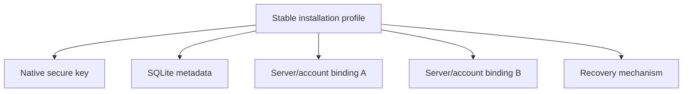

# Durable encryption storage progress

This ledger tracks the migration from origin-scoped browser key custody to one
durable installation profile with platform-appropriate key storage. A row is
complete only after its pull request has merged and the recorded validation has
passed.

## Compatibility contracts

- One installation profile owns a stable key alias. A server or account
  identity selects a binding; it does not select the underlying private key.
- Native catalogs contain identifiers, public metadata, bindings, and migration
  records. They never contain an unprotected private key.
- Server data remains authoritative for projects, conversations, settings, and
  routing. The installation catalog is not a second synchronized application
  database.
- Browser IndexedDB remains origin-scoped and therefore requires a tested
  recovery path. Native runtimes must not use it as their primary key store.
- Existing keys remain available until a replacement key has successfully
  unwrapped and rewrapped the Account Master Key and verified decryption.
- Missing local state never authorizes blank profile initialization or a
  destructive reset.

## Cycle ledger

### Cycle 1 — installation catalog contract and characterization

- Branch: `codex/encryption-storage-cycle1-contracts`
- Pull request: [#1534](https://github.com/ArcaneArts/Cantrip/pull/1534)
- Merge: auto-merge requested; pending required repository checks
- Behavior implemented:
  - Defined the versioned installation, native-key metadata, account-binding,
    and migration records.
  - Defined transactional catalog interfaces suitable for SQLite providers.
  - Added the in-memory test provider with serialized transactions and rollback
    on interruption.
  - Defined a stable key alias derived only from the installation UUID.
  - Preserved existing runtime behavior while documenting the legacy
    `[version, serverId, ownerId]` IndexedDB characterization.
- Validation:
  - `pnpm --filter @cantrip/app exec vitest run src/lib/installation-catalog.test.ts src/lib/client-encryption.test.ts src/lib/account-encryption.test.ts` — 18 tests passed.
  - `pnpm --filter @cantrip/app typecheck` — passed.
  - `git diff --check` — passed.
- Supported platforms: shared contract and test provider only; no runtime
  provider has changed yet.
- Migration status: contract defined; legacy migration not connected.
- Remaining work: Cycles 2–12 below.
- Known risks or blockers: native provider choice and mobile bridge permissions
  require platform-specific implementation and validation.
- Manual verification: none for this behavior-neutral cycle.

## Remaining cycles

1. Introduce platform-neutral runtime selection and one startup state machine.
2. Implement the Tauri SQLite catalog and secure-key provider.
3. Migrate Tauri legacy IndexedDB keys transactionally and connect account
   recovery.
4. Stabilize named development profiles and add non-secret diagnostics.
5. Implement Capacitor SQLite and iOS/Android secure-key providers.
6. Connect Capacitor migration and recovery.
7. Harden browser persistence, replacement-device recovery, and recovery UI.
8. Implement anonymous recovery export/import.
9. Add update/install compatibility harnesses and release gates.
10. Retire obsolete defaults while retaining required legacy readers.
11. Complete the cross-platform audit, full validation, and documentation.

The numbering above describes work remaining after Cycle 1. Later entries in
this ledger retain their original cycle numbers from the goal prompt.
