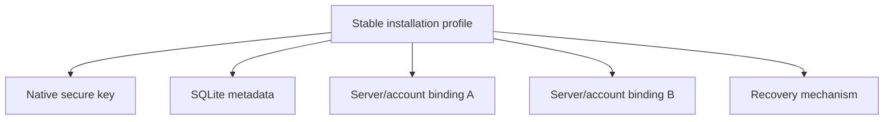

# Durable encryption storage progress

This ledger tracks the migration from origin-scoped browser key custody to one
durable installation profile with platform-appropriate key storage. A row is
complete only after its pull request has merged and the recorded validation has
passed.

## Compatibility contracts

- One installation profile owns a stable key alias. A server or account
  identity selects a binding; it does not select the underlying private key.
- Native catalogs contain identifiers, public metadata, bindings, and migration
  records. They never contain an unprotected private key.
- Server data remains authoritative for projects, conversations, settings, and
  routing. The installation catalog is not a second synchronized application
  database.
- Browser IndexedDB remains origin-scoped and therefore requires a tested
  recovery path. Native runtimes must not use it as their primary key store.
- Existing keys remain available until a replacement key has successfully
  unwrapped and rewrapped the Account Master Key and verified decryption.
- Missing local state never authorizes blank profile initialization or a
  destructive reset.

## Cycle ledger

### Cycle 1 — installation catalog contract and characterization

- Branch: `codex/encryption-storage-cycle1-contracts`
- Pull request: [#1534](https://github.com/ArcaneArts/Cantrip/pull/1534)
- Merge: squash-merged as `e14aad942e6124c17d864af4f11e9a238ee00a01`
- Behavior implemented:
  - Defined the versioned installation, native-key metadata, account-binding,
    and migration records.
  - Defined transactional catalog interfaces suitable for SQLite providers.
  - Added the in-memory test provider with serialized transactions and rollback
    on interruption.
  - Defined a stable key alias derived only from the installation UUID.
  - Preserved existing runtime behavior while documenting the legacy
    `[version, serverId, ownerId]` IndexedDB characterization.
- Validation:
  - `pnpm --filter @cantrip/app exec vitest run src/lib/installation-catalog.test.ts src/lib/client-encryption.test.ts src/lib/account-encryption.test.ts` — 18 tests passed.
  - `pnpm --filter @cantrip/app typecheck` — passed.
  - `git diff --check` — passed.
- Supported platforms: shared contract and test provider only; no runtime
  provider has changed yet.
- Migration status: contract defined; legacy migration not connected.
- Remaining work: Cycles 2–12 below.
- Known risks or blockers: native provider choice and mobile bridge permissions
  require platform-specific implementation and validation.
- Manual verification: none for this behavior-neutral cycle.

### Cycle 2 — runtime, provider, and startup contracts

- Branch: `codex/encryption-storage-cycle2-startup`
- Pull request: pending
- Merge: pending
- Behavior implemented:
  - Added the single runtime classifier for browser, Tauri, Capacitor iOS,
    Capacitor Android, and unsupported native environments.
  - Defined the device-key provider operation boundary. Providers own the
    private-key unwrap operation and return only the Account Master Key needed
    by the in-memory encryption service.
  - Added an idempotent, concurrency-safe in-memory custody backend for shared
    provider contract tests, including concurrent provider instances.
  - Added the pure startup transition owner covering authoritative profile
    discovery, native-key lookup, binding lookup, legacy migration, account
    recovery, anonymous recovery, and precise terminal states.
  - Ensured key custody is located independently of account/server bindings and
    that either missing state reaches legacy discovery before recovery; no
    transition implicitly creates a replacement key.
  - Bound successful unlock, migration, initialization, and recovery events to
    the active installation ID, key alias, principal, grant revision, and
    Account Master Key revision before protected application state can mount.
  - Ensured stale asynchronous results from an earlier account/server
    generation cannot advance the active startup state.
- Validation:
  - `pnpm --filter @cantrip/app exec vitest run src/lib/runtime-platform.test.ts src/lib/client-device-key-provider.test.ts src/lib/client-encryption-startup.test.ts src/lib/installation-catalog.test.ts src/lib/client-encryption.test.ts src/lib/account-encryption.test.ts` — 41 tests passed.
  - `pnpm --filter @cantrip/app typecheck` — passed.
  - `pnpm --filter @cantrip/app build` — passed.
  - `git diff --check` — passed.
  - `pnpm check` — reached `check:app-decomposition` and stopped on the
    pre-existing line-budget failures in `chat-turn-runtime.ts` and
    `task-routes.ts`; the same command fails identically on clean `main`, and
    neither file is changed by this cycle.
- Supported platforms: shared contracts and deterministic tests for browser,
  Tauri, Capacitor iOS, and Capacitor Android classification. Runtime provider
  selection remains unchanged until native providers exist.
- Migration status: startup transition path defined; no legacy record is
  modified.
- Remaining work: Cycles 3–12 below.
- Known risks or blockers: native secure-store implementations must preserve
  the shared P-256 HPKE wrapper format and need OS-specific integration tests.
- Manual verification: none for this behavior-neutral cycle.

## Remaining cycles

3. Implement the Tauri SQLite catalog and secure-key provider.
4. Migrate Tauri legacy IndexedDB keys transactionally and connect account
   recovery.
5. Stabilize named development profiles and add non-secret diagnostics.
6. Implement Capacitor SQLite and iOS/Android secure-key providers.
7. Connect Capacitor migration and recovery.
8. Harden browser persistence, replacement-device recovery, and recovery UI.
9. Implement anonymous recovery export/import.
10. Add update/install compatibility harnesses and release gates.
11. Retire obsolete defaults while retaining required legacy readers.
12. Complete the cross-platform audit, full validation, and documentation.
