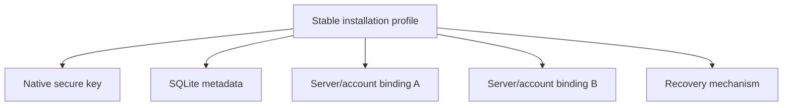

# Durable encryption storage progress

This ledger tracks the migration from origin-scoped browser key custody to one
durable installation profile with platform-appropriate key storage. A row is
complete only after its pull request has merged and the recorded validation has
passed.

## Compatibility contracts

- One installation profile owns a stable key alias. A server or account
  identity selects a binding; it does not select the underlying private key.
- Native catalogs contain identifiers, public metadata, bindings, and migration
  records. They never contain an unprotected private key.
- Server data remains authoritative for projects, conversations, settings, and
  routing. The installation catalog is not a second synchronized application
  database.
- Browser IndexedDB remains origin-scoped and therefore requires a tested
  recovery path. Native runtimes must not use it as their primary key store.
- Existing keys remain available until a replacement key has successfully
  unwrapped and rewrapped the Account Master Key and verified decryption.
- Missing local state never authorizes blank profile initialization or a
  destructive reset.

## Completion status

Status: **complete**. Cycles 1–15 are merged. Missing-state discovery is
read-only until an authoritative initialization or recovery event, current
Rust, Swift, and Android readers consume frozen version-one native state in
release-blocking gates, and the normal warm path is bounded to three
non-mutating authoritative reads. The final release-readiness audit found no
unresolved required implementation or automated verification work.

| Required capability                                           | Completed implementation                                                                                                                               |
| ------------------------------------------------------------- | ------------------------------------------------------------------------------------------------------------------------------------------------------ |
| One stable installation with multiple account/server bindings | One immutable installation record owns one installation-derived key alias; account bindings are separate catalog rows.                                 |
| Tauri native custody                                          | SQLite public metadata plus macOS Keychain, Windows Credential Manager, or Linux Secret Service custody; legacy IndexedDB is migration-only.           |
| Capacitor native custody                                      | SQLite public metadata plus iOS Keychain or Android Keystore-backed custody.                                                                           |
| Browser custody and recovery                                  | Versioned IndexedDB/WebCrypto installation storage, persistence requests, password recovery, and anonymous recovery import.                            |
| Existing installation migration                               | Retained legacy IndexedDB keys unwrap and rewrap the existing Account Master Key through an idempotent, verified migration checkpoint.                 |
| Missing-key recovery                                          | Password or anonymous recovery authorizes explicit key replacement without changing the native installation ID or initializing a blank server profile. |
| Anonymous recovery                                            | Versioned recovery export, acknowledgement, later export, strict import, and unrecoverable-state messaging.                                            |
| Stable development identity                                   | Named profiles persist outside worktrees and build output; inspection and deliberate clean-profile tooling expose no secrets.                          |
| Update safety                                                 | Immutable contract gate plus frozen v1 catalog/custody/HPKE fixtures consumed by current Rust, Swift, and Android readers in native release lanes.     |
| No silent replacement                                         | Cycle 13 merged: lookup misses, invalid credentials, and migration outages leave installation and key storage untouched.                               |

### Final acceptance evidence

| Goal criterion                                   | Evidence                                                                                                                                                |
| ------------------------------------------------ | ------------------------------------------------------------------------------------------------------------------------------------------------------- |
| Tauri does not use IndexedDB as primary custody  | Runtime selection uses the native SQLite/keyring bridge; IndexedDB remains only behind the explicit legacy reader.                                      |
| Capacitor uses native metadata and custody       | iOS uses SQLite plus Keychain; Android uses SQLite plus an Android-Keystore-wrapped private-key record.                                                 |
| Browser recovery survives local storage loss     | IndexedDB persistence outcomes, password reprovisioning, anonymous import, and no-blank-profile behavior are covered by browser and account tests.      |
| One installation supports multiple bindings      | Catalog, native provider, and account coordinator tests map multiple server/account bindings to one immutable installation-derived key alias.           |
| Legacy migration is transactional and resumable  | Tests cover success, interrupted grants, server outages, corrupt records, idempotent resume, verification checkpoints, and retained legacy principals.  |
| Missing account custody is recoverable           | Password recovery rewraps the existing Account Master Key and registers a replacement principal without initializing a new server profile.              |
| Anonymous recovery is explicit                   | Versioned export, acknowledgement, later export, strict import, wrong-server rejection, and unrecoverable messaging are implemented and tested.         |
| Development identity is stable                   | Named profile tests cover rebuilds, replaced worktrees, concurrent winners, legacy adoption, inspection, and deliberate clean-profile creation.         |
| Update contracts block incompatible releases     | The immutable manifest and release tests reject unapproved identifier, origin, path, schema, provider, alias, server-identity, or encryption revisions. |
| Existing native data opens under current readers | Frozen v1 catalog, custody, binding, migration, and HPKE marker fixtures open under current Rust, Swift, and Android storage implementations.           |
| Startup cannot silently replace state            | State-machine and account tests prove missing, corrupt, invalid-credential, and outage paths do not create a catalog, key, grant, or blank profile.     |
| Existing product flows still build and pass      | The full app suite covers authentication, editor, terminal, tunnels, networking, and encrypted domain surfaces; typecheck and production build pass.    |

## Cycle ledger

### Cycle 1 — installation catalog contract and characterization

- Branch: `codex/encryption-storage-cycle1-contracts`
- Pull request: [#1534](https://github.com/ArcaneArts/Cantrip/pull/1534)
- Merge: squash-merged as `e14aad942e6124c17d864af4f11e9a238ee00a01`
- Behavior implemented:
  - Defined the versioned installation, native-key metadata, account-binding,
    and migration records.
  - Defined transactional catalog interfaces suitable for SQLite providers.
  - Added the in-memory test provider with serialized transactions and rollback
    on interruption.
  - Defined a stable key alias derived only from the installation UUID.
  - Preserved existing runtime behavior while documenting the legacy
    `[version, serverId, ownerId]` IndexedDB characterization.
- Validation:
  - `pnpm --filter @cantrip/app exec vitest run src/lib/installation-catalog.test.ts src/lib/client-encryption.test.ts src/lib/account-encryption.test.ts` — 18 tests passed.
  - `pnpm --filter @cantrip/app typecheck` — passed.
  - `git diff --check` — passed.
- Supported platforms: shared contract and test provider only; no runtime
  provider has changed yet.
- Migration status: contract defined; legacy migration not connected.
- Remaining work: Cycles 2–12 below.
- Known risks or blockers: native provider choice and mobile bridge permissions
  require platform-specific implementation and validation.
- Manual verification: none for this behavior-neutral cycle.

### Cycle 2 — runtime, provider, and startup contracts

- Branch: `codex/encryption-storage-cycle2-startup`
- Pull request: [#1536](https://github.com/ArcaneArts/Cantrip/pull/1536)
- Merge: squash-merged as `f199b925a366cf9ecbca26de99f3e13f611b9965`
- Behavior implemented:
  - Added the single runtime classifier for browser, Tauri, Capacitor iOS,
    Capacitor Android, and unsupported native environments.
  - Defined the device-key provider operation boundary. Providers own the
    private-key unwrap operation and return only the Account Master Key needed
    by the in-memory encryption service.
  - Added an idempotent, concurrency-safe in-memory custody backend for shared
    provider contract tests, including concurrent provider instances.
  - Added the pure startup transition owner covering authoritative profile
    discovery, native-key lookup, binding lookup, legacy migration, account
    recovery, anonymous recovery, and precise terminal states.
  - Ensured key custody is located independently of account/server bindings and
    that either missing state reaches legacy discovery before recovery; no
    transition implicitly creates a replacement key.
  - Bound successful unlock, migration, initialization, and recovery events to
    the active installation ID, key alias, principal, grant revision, and
    Account Master Key revision before protected application state can mount.
  - Ensured stale asynchronous results from an earlier account/server
    generation cannot advance the active startup state.
- Validation:
  - `pnpm --filter @cantrip/app exec vitest run src/lib/runtime-platform.test.ts src/lib/client-device-key-provider.test.ts src/lib/client-encryption-startup.test.ts src/lib/installation-catalog.test.ts src/lib/client-encryption.test.ts src/lib/account-encryption.test.ts` — 41 tests passed.
  - `pnpm --filter @cantrip/app typecheck` — passed.
  - `pnpm --filter @cantrip/app build` — passed.
  - `git diff --check` — passed.
  - `pnpm check` — reached `check:app-decomposition` and stopped on the
    pre-existing line-budget failures in `chat-turn-runtime.ts` and
    `task-routes.ts`; the same command fails identically on clean `main`, and
    neither file is changed by this cycle.
- Supported platforms: shared contracts and deterministic tests for browser,
  Tauri, Capacitor iOS, and Capacitor Android classification. Runtime provider
  selection remains unchanged until native providers exist.
- Migration status: startup transition path defined; no legacy record is
  modified.
- Remaining work: Cycles 3–12 below.
- Known risks or blockers: native secure-store implementations must preserve
  the shared P-256 HPKE wrapper format and need OS-specific integration tests.
- Manual verification: none for this behavior-neutral cycle.

### Cycle 3 — Tauri native installation catalog and key custody

- Branch: `codex/encryption-storage-cycle3-tauri-native`
- Pull request: [#1541](https://github.com/ArcaneArts/Cantrip/pull/1541)
- Merge: squash-merged as `f3e105c1be752b80fb8765043ff8e1ed90b23366`
- Behavior implemented:
  - Added a versioned SQLite installation catalog beneath Tauri's current
    bundle-scoped local application-data root at
    `installation/v1/catalog.sqlite3`. Cycle 5 must make the development bundle
    and profile selection stable across worktrees before this is activated.
  - Added installation, public device-key metadata, account binding, migration,
    and compare-and-swap catalog revision tables. The catalog schema has no
    private-key field. Unknown newer schemas, damaged version-one schemas,
    missing catalog metadata, nonempty version-zero databases, and invalid
    logical rows are rejected without recreating, adopting, or repairing them.
    Transactions validate cross-row invariants before commit, and the catalog
    rejects unexpected views, triggers, schema lookalikes, and invalid P-256
    public points.
  - Added OS-backed P-256 private-key custody through macOS Keychain, Windows
    Credential Manager, and Linux Secret Service. Linux fails closed when a
    compatible Secret Service is unavailable; there is no plaintext fallback.
  - Fixed the stable keyring service to
    `art.cantrip.installation.hpke.v1` and the installation-derived alias to
    `cantrip.installation.<installation-uuid>.hpke.v1`. Neither contains a server,
    owner, origin, hostname, MAC address, build path, or worktree.
  - Kept HPKE private-key use inside the Rust provider. The renderer receives
    public metadata and, after authenticated unwrap, only the 32-byte Account
    Master Key required by the existing in-memory encryption service. A static
    envelope produced by the TypeScript `@hpke/core` path is decrypted by the
    Rust provider in the native test suite.
  - Runs SQLite, secure-store, and HPKE operations on Tauri blocking workers,
    returns typed failures, zeroizes temporary private-key and Account Master
    Key buffers, and never replaces a missing or malformed secure-store entry.
    Key creation is serialized across processes by the catalog transaction and
    fails closed when catalog metadata proves that a native key was lost.
  - Added a TypeScript catalog/provider bridge without activating it in normal
    startup. Runtime selection remains on the legacy provider until Cycle 4 can
    migrate an accessible nonextractable IndexedDB key transactionally.
- Validation:
  - `cargo test installation_storage` — 20 native tests passed.
  - `cargo check` — passed on macOS arm64.
  - `cargo test` — 139 tests passed; the two existing native loopback/relay
    integration tests timed out in their HTTP response fixture. The same
    tunnel tests failed before the audit corrections and do not exercise this
    cycle's installation storage module.
  - `pnpm --filter @cantrip/app exec vitest run src/lib/tauri-installation-storage.test.ts src/lib/installation-catalog.test.ts src/lib/client-device-key-provider.test.ts` — 19 tests passed.
  - `pnpm --filter @cantrip/app typecheck` — passed.
  - `pnpm --filter @cantrip/app build` — passed.
- Supported platforms:
  - macOS: native catalog compiled and native tests passed; Keychain selection
    compiled. A signed-app Keychain smoke test remains manual.
  - Windows: Windows Credential Manager provider is selected by target; native
    cross-target compilation and runtime verification remain pending.
  - Linux: Secret Service provider is selected by target with no insecure
    fallback; native cross-target compilation and runtime verification remain
    pending.
  - Browser and Capacitor behavior is unchanged by this cycle.
- Migration status: storage destination and rewrap primitive implemented;
  legacy discovery, verification, and runtime cutover remain Cycle 4 work.
- Remaining work: Cycles 4–12 below.
- Known risks or blockers: platform credential APIs require runtime smoke tests
  on signed macOS/Windows packages and a Linux desktop session. No external
  blocker prevents the next cycle.
- Manual verification: create/inspect/unwrap through a packaged Tauri build on
  each desktop OS before claiming OS-store integration verified.

### Cycle 4 — transactional Tauri migration and account recovery

- Branch: `codex/encryption-storage-cycle4-tauri-migration`
- Pull request: [#1545](https://github.com/ArcaneArts/Cantrip/pull/1545)
- Merge: squash-merged as `c089532c1c7960eec7f806cba721dd31920dff55`
- Behavior implemented:
  - Selected the native Tauri catalog and OS key provider during normal Tauri
    startup while leaving browser and Capacitor runtime selection unchanged.
  - Connected the explicit startup transition owner to installation, server
    profile, native key, binding, legacy discovery, migration, account
    recovery, and precise anonymous recovery states.
  - Added a stable UUIDv5 binding principal derived from installation, server,
    and owner identity. The underlying installation key remains independent of
    every server and account binding.
  - Added client-service operations that wrap the already-unlocked Account
    Master Key for an explicit native principal/public key and unwrap through a
    platform key provider. Migration requires the native result to match the
    legacy-unlocked key and decrypt a marker sealed by the legacy-derived key
    before changing the active client snapshot.
  - Implemented an idempotent legacy IndexedDB migration journal. The native
    principal and grant are reconciled across interrupted requests; the
    account binding and verified migration checkpoint commit together only
    after local native unwrap verification.
  - Retained the legacy IndexedDB record, principal, and grant. Migration never
    calls a revocation or delete endpoint and never replaces a corrupt legacy
    record.
  - Connected password-based recovery for initialized account profiles with a
    missing local legacy registration. The path reauthenticates, unwraps the
    existing password wrapper, provisions and verifies the native binding, and
    never calls server profile initialization.
  - Added a specific anonymous recovery-required application state. Missing or
    corrupt anonymous custody preserves the existing server profile and cannot
    mount an empty application as a fallback.
  - Confirmed from repository history that `art.cantrip`, the production
    WebView origin, and the local application-data root have not changed since
    IndexedDB client custody shipped. The desktop development port changed to
    1420 before that feature, so the retained current-origin reader covers all
    released Tauri legacy records currently known to the repository.
- Validation:
  - `pnpm --filter @cantrip/app exec vitest run src/lib/account-encryption.test.ts src/lib/client-encryption-startup.test.ts src/lib/client-encryption.test.ts src/lib/installation-storage.test.ts src/lib/browser-installation-storage.test.ts src/lib/tauri-installation-storage.test.ts` — 47 focused tests passed (four matching test files).
  - `pnpm --filter @cantrip/app test` — 1,842 tests passed and 3 skipped across
    350 test files after building the workspace-local `@cantrip/glitch` package.
  - `pnpm --filter @cantrip/app typecheck` — passed.
  - `pnpm --filter @cantrip/app build` — passed.
  - `cargo fmt --manifest-path cantrip_app/src-tauri/Cargo.toml -- --check` —
    passed.
  - `cargo check --manifest-path cantrip_app/src-tauri/Cargo.toml` — passed.
  - `cargo test --manifest-path cantrip_app/src-tauri/Cargo.toml installation_storage`
    — 20 tests passed.
  - `pnpm check:app-decomposition` — failed only on the unchanged baseline
    `chat-turn-runtime.ts` (2,103/1,999 lines) and `task-routes.ts`
    (2,147/1,999 lines); this cycle did not modify either file and introduced
    no newly reported decomposition overage.
- Supported platforms:
  - Tauri: native runtime selection, legacy migration, native restart unlock,
    password reprovisioning, and anonymous recovery state are connected and
    covered by deterministic shared/provider tests.
  - Browser: existing IndexedDB runtime remains active and behavior is
    unchanged in this cycle.
  - Capacitor: runtime behavior remains unchanged pending Cycles 6–7.
- Migration status: merged for accessible legacy records in the current Tauri
  WebView origin. Legacy custody is deliberately retained after verification.
- Remaining work: Cycles 5–12 below, including native-key-loss rotation,
  anonymous recovery artifacts, browser recovery, mobile providers, and
  platform update harnesses.
- Known risks or blockers: signed macOS/Windows/Linux secure-store smoke tests
  remain manual. A cataloged native key missing from the OS store still fails
  closed instead of rotating; password-authorized native key rotation remains
  required before final completion.
- Manual verification: migrate a real pre-cycle Tauri profile on macOS and
  confirm the second launch unlocks from Keychain without reading IndexedDB.

### Cycle 5 — stable named development profiles and diagnostics

- Branch: `codex/encryption-storage-cycle5-dev-profile`
- Pull request: [#1546](https://github.com/ArcaneArts/Cantrip/pull/1546)
- Commit: `3f93fb040718fbea34613e7e195ee22f16aace0d`
- Merge: squash-merged as `35defd3c396bb581bc5be88cd0309a25b8783b54`
- Behavior implemented:
  - Moved the canonical development profile identity out of worktree-local
    `.cantrip` and build output into versioned shared Git metadata. The
    `default` profile is now reused by every branch and worktree.
  - Added compatibility adoption of the primary checkout's existing
    `tauri-dev.conf.json` identifier. The migration projects that exact identity
    into the current worktree instead of silently choosing a new WebView/native
    application-data namespace.
  - Kept `.cantrip/dev` as the default server/worker state contract and made
    named clean lanes explicit under `.cantrip/dev-profiles/<name>`. Their
    server, worker, logs, Tauri config projection, and Cargo target paths are
    isolated while their canonical identity remains outside the worktree.
  - Added `pnpm dev:profile inspect [name]` to report non-secret profile,
    installation, provider, catalog, binding count, migration state, origin,
    and data/build paths. The diagnostic reads no secure-store secret or raw
    private key.
  - Added `pnpm dev:profile create <name>` and
    `pnpm devtop -- --profile <name>` for deliberate clean test installations.
    Existing profile names are never overwritten or reset implicitly.
- Validation:
  - `node --test scripts/devtop-tauri-config.test.mjs scripts/development-profile.test.mjs scripts/devtop.test.mjs scripts/dev-browser.test.mjs` — 21 tests passed.
  - `pnpm typecheck` — passed across all workspace packages.
  - `pnpm --filter @cantrip/app... build` — passed.
  - `pnpm --filter @cantrip/app test` — 1,842 tests passed and 3 skipped
    across 350 test files after building workspace package entrypoints.
  - `node --test scripts/*.test.mjs` — 115 tests passed and two unrelated
    baseline tests failed: the application-platform deployment assertion and
    tranche-two sidebar acceptance assertion. The same two failures reproduce
    on clean `main`, and neither fixture is changed by this cycle.
  - `pnpm check:large-files` and `git diff --check` — passed.
  - `pnpm check:app-decomposition` — failed only on the unchanged baseline
    `chat-turn-runtime.ts` (2,103/1,999 lines) and `task-routes.ts`
    (2,147/1,999 lines); this cycle introduced no decomposition overage.
- Supported platforms: deterministic app-local data/provider diagnostics cover
  macOS, Windows, and Linux; `devtop` remains the Tauri desktop development
  lane. Browser and Capacitor runtime behavior is unchanged.
- Migration status: legacy worktree identity adoption is merged and preserves
  the primary development namespace.
- Remaining work: Cycles 6–12 below.
- Known risks or blockers: a first post-migration launch should be smoke-tested
  on macOS to confirm Tauri resolves the reported application-local data path
  exactly as the diagnostic predicts. Profile destruction is intentionally not
  automated because native secure-store deletion requires platform-specific,
  explicitly destructive handling.
- Manual verification: run `pnpm dev:profile inspect`, start `pnpm devtop`,
  verify the previous encrypted workspace opens, then inspect again and confirm
  the installation ID remains unchanged after deleting only Cargo target output.

### Cycle 6 — Capacitor native catalogs and key custody

- Branch: `codex/encryption-storage-cycle6-capacitor-native`
- Pull request: [#1547](https://github.com/ArcaneArts/Cantrip/pull/1547)
- Commit: `f62c37897a4c60b4752a4063560124953bdf1bea`
- Merge: squash-merged as `e41ae3cc276cc697ec7718e120840ad7371d7365`
- Behavior implemented:
  - Generalized the already-tested native catalog and device-key TypeScript
    bridge so Tauri and Capacitor share one validation, transaction, and
    Account Master Key byte-boundary implementation without changing Tauri's
    command names or active startup behavior.
  - Added app-private SQLite installation catalogs at
    `installation/v1/catalog.sqlite3` for Capacitor iOS and Android. Both use
    schema version one, foreign keys, integrity checks, compare-and-swap
    revisions, and the same installation, public-key, binding, and migration
    responsibilities as the desktop catalog. Neither schema contains private
    key material.
  - Added an iOS Capacitor plugin whose P-256 private key is held in Keychain
    under service `art.cantrip.installation.hpke.v1` with
    `AfterFirstUnlockThisDeviceOnly` accessibility. The stable account alias is
    derived only from the installation UUID.
  - Added an Android Capacitor plugin whose P-256 private-key encoding is
    encrypted with an installation-specific, nonexportable AES-GCM key in
    Android Keystore. Only the authenticated encrypted record is held in the
    app-private preferences file; plaintext private material is never written
    to SQLite or preferences.
  - Implemented RFC 9180 P-256/HKDF-SHA256/AES-256-GCM unwrap natively on both
    mobile platforms. Temporary private-key and unwrapped-master-key byte
    buffers are cleared on best effort, and a missing or malformed secure-store
    record fails closed instead of generating a replacement.
  - Registered the custom plugin in both native shells and added the
    `apple-keychain` and `android-keystore` Capacitor provider adapter. Normal
    startup selection is connected in Cycle 7 below.
- Validation:
  - `pnpm --filter @cantrip/app exec vitest run src/lib/capacitor-installation-storage.test.ts src/lib/tauri-installation-storage.test.ts src/lib/installation-catalog.test.ts src/lib/client-device-key-provider.test.ts` — 23 tests passed.
  - `ANDROID_HOME=... JAVA_HOME=... ./gradlew :app:compileDebugJavaWithJavac :app:testDebugUnitTest` — passed; two Android HPKE compatibility tests opened the TypeScript fixture and verified canonical associated data.
  - `node --test scripts/ios-native-storage.test.mjs` — passed; the Swift
    CryptoKit provider opened the same TypeScript fixture and matched canonical
    associated data.
  - `xcodebuild -project cantrip_app/ios/App/App.xcodeproj -scheme App -sdk iphonesimulator -configuration Debug CODE_SIGNING_ALLOWED=NO build` — passed for arm64 and x86_64 simulators.
  - `pnpm --filter @cantrip/app typecheck` and
    `pnpm --filter @cantrip/app build` — passed.
  - `pnpm --filter @cantrip/app test` — 1,846 tests passed and 3 skipped across
    351 test files.
  - `node --test scripts/*.test.mjs` — 116 tests passed, including the new
    Swift fixture; two unrelated baseline assertions failed for the App
    Platform build-command fixture and tranche-two sidebar acceptance fixture.
    Both failures were already reproduced on clean `main` in Cycle 5, and this
    cycle changes neither surface.
  - `pnpm check:large-files` and `git diff --check` — passed.
  - `pnpm check:app-decomposition` — failed only on the unchanged baseline
    `chat-turn-runtime.ts` (2,103/1,999 lines) and `task-routes.ts`
    (2,147/1,999 lines); this cycle introduced no newly reported overage.
- Supported platforms:
  - Capacitor iOS: native plugin and Keychain provider compile for the iOS
    simulator; deterministic CryptoKit wire compatibility passed on macOS. A
    signed physical-device Keychain smoke test remains manual.
  - Capacitor Android: native plugin compiles against the checked-in mobile
    project; JVM wire compatibility tests passed. A physical-device Android
    Keystore smoke test remains manual.
  - Tauri and browser runtime selection remained unchanged in this cycle.
- Migration status: the mobile storage destinations and native unwrap
  primitives merged; normal Capacitor startup selection and migration are
  recorded in Cycle 7 below.
- Remaining work: Cycles 7–12 below.
- Known risks or blockers: Android backup may restore encrypted catalog or
  preference data to a fresh install without its nonexportable Keystore key;
  that condition fails closed and must enter Cycle 7 account/anonymous recovery
  rather than regenerate. No external blocker prevents Cycle 7.
- Manual verification: on signed iOS and Android development builds, create a
  native key, restart the app, inspect the same alias, unwrap a registered
  Account Master Key, and confirm no private material appears in the SQLite
  catalog or diagnostic output.

### Cycle 7 — Capacitor migration and account recovery

- Branch: `codex/encryption-storage-cycle7-capacitor-migration`
- Pull request: [#1548](https://github.com/ArcaneArts/Cantrip/pull/1548)
- Commit: `8babae555ea630b03cff6354962fa46c0b97891d`
- Merge: squash-merged as `68e54d86302502eed80de0dc34748f59bb607323`
- Behavior implemented:
  - Added one native-storage selector for Tauri, Capacitor iOS, and Capacitor
    Android. Native runtimes fail closed when their provider is unavailable;
    browser startup cannot accidentally select a native provider.
  - Connected normal Capacitor startup to the durable installation catalog and
    platform secure-key provider from Cycle 6. The existing Tauri path now uses
    the same selector without changing its catalog, command names, or provider.
  - Reused the single durable startup coordinator for all native runtimes.
    Capacitor therefore reads the authoritative server profile before allowing
    initialization, prefers a verified native binding, and otherwise attempts
    the retained legacy IndexedDB registration.
  - An accessible legacy key unwraps the existing Account Master Key, creates
    or reconciles the stable native principal and grant, verifies native unwrap
    plus a known encrypted marker, then commits the binding and verified
    migration checkpoint together. The legacy record, principal, and grant are
    retained.
  - An initialized account with no usable legacy registration requests password
    reauthentication and reprovisions the existing Account Master Key to the
    native installation key. It does not initialize a replacement encryption
    profile. Anonymous installations continue to enter the precise
    recovery-required state until Cycle 9 adds recovery artifacts.
- Validation:
  - `pnpm --filter @cantrip/app exec vitest run src/lib/native-installation-storage.test.ts src/lib/account-encryption.test.ts src/lib/capacitor-installation-storage.test.ts` — 27 focused tests passed, including migration and password recovery on all three native runtime classifications.
  - `pnpm --filter @cantrip/app test` — 1,855 tests passed and 3 skipped
    across 352 test files.
  - `pnpm --filter @cantrip/app typecheck` and
    `pnpm --filter @cantrip/app build` — passed.
  - `node --test scripts/*.test.mjs` — 116 tests passed and the two known
    clean-`main` baseline assertions failed for the App Platform build-command
    fixture and tranche-two sidebar lifecycle fixture. This cycle changes
    neither surface.
  - `pnpm check:large-files` and `git diff --check` — passed.
  - `pnpm check:app-decomposition` — failed only on the unchanged baseline
    `chat-turn-runtime.ts` (2,103/1,999 lines) and `task-routes.ts`
    (2,147/1,999 lines); this cycle introduced no newly reported overage.
- Supported platforms:
  - Capacitor iOS and Android: normal TypeScript startup selection, legacy
    migration, native restart unlock, and password reprovisioning are covered
    by deterministic coordinator/provider tests. Physical-device secure-store
    verification remains manual.
  - Tauri: routed through the generalized selector with the existing durable
    provider and migration behavior retained.
  - Browser: remains on IndexedDB and is not routed through native storage.
- Migration status: implemented and under final validation for accessible
  Capacitor legacy records. The operation is idempotent and resumable through
  the same verified journal used by Tauri.
- Remaining work: Cycles 8–12 below.
- Known risks or blockers: a cataloged native key missing from Keychain or
  Android Keystore still fails closed. Account-authorized native key rotation,
  anonymous recovery artifacts, and browser recovery remain required before
  goal completion.
- Manual verification: migrate one signed iOS build and one signed Android
  build containing a real pre-cycle IndexedDB registration, then restart and
  verify that the same installation, alias, principal, and encrypted account
  data remain usable.

### Cycle 8 — Browser persistence and replacement-device recovery

- Branch: `codex/encryption-storage-cycle8-browser-recovery`
- Pull request: [#1549](https://github.com/ArcaneArts/Cantrip/pull/1549)
- Commit: `5c6f19916dbd9a451767c4cedeaffc8be96feb1f`
- Merge: squash-merged as `88786ef14a22563eb31127188e4f681c43f9de7e`
- Behavior implemented:
  - Added the versioned `cantrip-browser-installation` IndexedDB catalog and
    WebCrypto key provider. One immutable browser installation UUID owns one
    nonextractable P-256 key and independent bindings for multiple servers and
    owners; the key is no longer selected by `[serverId, ownerId]`.
  - Applied full catalog validation and compare-and-swap transactions to
    browser storage. Concurrent tabs retry against the winning catalog and are
    prohibited from replacing its installation identity.
  - Requested persistent browser storage where supported and distinguished
    `persistent`, `best-effort`, and `unsupported` outcomes without treating a
    persistence denial as success.
  - Routed normal browser startup through the same durable coordinator as
    native clients. The released per-account IndexedDB record remains a legacy
    reader and is migrated transactionally: unwrap the existing Account Master
    Key, provision the stable browser key/principal/grant, verify the new unwrap
    and encrypted marker, then commit the binding and migration checkpoint.
    The legacy record, principal, and grant remain intact.
  - Replaced the generic missing-key path for initialized accounts with an
    in-session `recover-device` state and recovery screen. Password
    reauthentication reprovisions the existing server profile to a new browser
    installation and never creates a blank profile or empty workspace.
  - Kept anonymous browser storage loss in the precise recovery-required state
    pending the Cycle 9 recovery artifact.
- Validation:
  - Focused browser storage, account migration/recovery, startup-state, and
    recovery-screen tests — 40 tests passed.
  - `pnpm --filter @cantrip/app test` — 1,862 tests passed and 3 skipped
    across 354 test files.
  - `pnpm --filter @cantrip/app typecheck` and
    `pnpm --filter @cantrip/app build` — passed.
  - `node --test scripts/*.test.mjs` — 116 tests passed and the two known
    clean-`main` baseline assertions failed for the App Platform build-command
    fixture and tranche-two sidebar lifecycle fixture. This cycle changes
    neither surface.
  - `pnpm check:large-files` and `git diff --check` — passed.
  - `pnpm check:app-decomposition` — failed only on the unchanged baseline
    `chat-turn-runtime.ts` (2,103/1,999 lines) and `task-routes.ts`
    (2,147/1,999 lines); this cycle introduced no newly reported overage.
- Supported platforms:
  - Browser: stable installation catalog, nonextractable WebCrypto custody,
    legacy migration, persistence request, and account replacement-device
    recovery are implemented and covered by deterministic IndexedDB tests.
  - Tauri and Capacitor: continue using their native SQLite and secure-key
    providers through the same coordinator; existing runtime-selection tests
    guard this boundary.
- Migration status: implemented and verified deterministically for an actual
  released-format IndexedDB record, including stable restart unlock and legacy
  record retention.
- Remaining work: Cycles 9–12 below at the time of merge.
- Known risks or blockers: browser persistence remains browser-controlled.
  Account mode is recoverable after eviction; anonymous mode still requires the
  Cycle 9 artifact. No external blocker prevents the next cycle.
- Manual verification: in a supported browser, approve persistent storage,
  migrate an existing account, clear site data, sign back in, and confirm the
  recovery screen restores the original encrypted account without profile
  initialization. Verify the denial path in a private/incognito context.

### Cycle 9 — anonymous recovery and verified key replacement

- Branch: `codex/encryption-storage-cycle9-anonymous-recovery`
- Pull request: [#1550](https://github.com/ArcaneArts/Cantrip/pull/1550)
- Commit: `7acc5b84186b832e5fc6b2693fc4861613762ba8`
- Merge: squash-merged as `7d7f4abbf0247e9ebf7a8f85302ccda41b7be13f`
- Behavior implemented:
  - Added a strict, versioned anonymous recovery artifact containing a fresh
    256-bit recovery secret and an AES-256-GCM Account Master Key envelope
    bound to the server, owner, profile revision, and recovery purpose. The
    artifact contains neither a plaintext Account Master Key nor a device
    private key.
  - Required first-time anonymous users to save and acknowledge the recovery
    artifact before protected application state mounts. Added later export in
    General settings and browser/Tauri download plus Capacitor native sharing
    with temporary-file cleanup.
  - Added a precise anonymous recovery screen and strict import validation.
    Matching artifacts restore the existing encryption profile; missing or
    incorrect artifacts never initialize, replace, or reset server data.
  - Added an explicit key-provider replacement operation that ordinary startup
    cannot call. Password recovery or a valid anonymous artifact must first
    unlock the existing Account Master Key before a missing cataloged native or
    browser key can be replaced under the same installation ID and stable
    alias.
  - Added a deterministic recovery principal and verified grant cutover. The
    old principal and legacy key remain intact; no recovery path revokes them.
  - Added an idempotent replacement migration checkpoint before secure-store
    mutation. A launch interrupted after the new secure key is written but
    before catalog/binding commit resumes the same installation and verifies
    the new grant instead of creating a competing profile.
- Validation:
  - `pnpm --filter @cantrip/protocol test` — 385 tests passed across 50 files.
  - `pnpm --filter @cantrip/crypto test` — 37 tests passed across 15 files.
  - `pnpm --filter @cantrip/app test` — 1,872 tests passed and 3 skipped across
    356 files.
  - `pnpm --filter @cantrip/app typecheck` and
    `pnpm --filter @cantrip/app build` — passed.
  - `ANDROID_HOME=... JAVA_HOME=... ./gradlew :app:compileDebugJavaWithJavac :app:testDebugUnitTest`
    — passed.
  - `xcodebuild -project cantrip_app/ios/App/App.xcodeproj -scheme App -sdk iphonesimulator -configuration Debug CODE_SIGNING_ALLOWED=NO build`
    — passed for arm64 and x86_64 simulators.
  - `cargo fmt --manifest-path cantrip_app/src-tauri/Cargo.toml -- --check` —
    passed.
  - `cargo test --manifest-path cantrip_app/src-tauri/Cargo.toml installation_storage --lib`
    — 21 tests passed.
  - `node --test scripts/ios-native-storage.test.mjs` — passed.
  - `node --test scripts/*.test.mjs` — 116 tests passed and the two known
    clean-`main` baseline assertions failed for the App Platform build-command
    fixture and tranche-two sidebar lifecycle fixture. This cycle changes
    neither surface.
  - `pnpm check:large-files`, changed-file Prettier validation, and
    `git diff --check` — passed.
  - `pnpm check:app-decomposition` — failed only on the unchanged baseline
    `chat-turn-runtime.ts` (2,103/1,999 lines) and `task-routes.ts`
    (2,147/1,999 lines); this cycle introduced no newly reported overage.
- Supported platforms:
  - Tauri macOS/Windows/Linux: explicit native-key replacement is implemented
    behind verified password or anonymous recovery. Rust catalog/provider tests
    cover the storage contract; signed secure-store smoke tests remain manual.
  - Capacitor iOS and Android: the native bridges implement the same explicit
    replacement boundary and compile in their checked-in applications.
  - Browser: WebCrypto custody supports the same verified recovery operation;
    the recovery file remains necessary after anonymous origin storage loss.
- Migration status: anonymous recovery, missing-key replacement, and
  interruption resumption are implemented. Existing principals and legacy
  records remain retained until verified cutover.
- Remaining work: Cycles 10–12 below at the time of merge.
- Known risks or blockers: the recovery file is deliberately a bearer secret;
  losing it together with all usable anonymous device keys is unrecoverable.
  OS secure-store behavior still needs signed physical-device/package smoke
  tests before claiming runtime verification on every platform.
- Manual verification: complete first-run export and recovery after deleting
  only the installation key on packaged macOS, Windows, Linux, iOS, and Android
  builds; confirm the original encrypted data opens and the installation ID
  does not change. Separately clear browser storage and import the artifact;
  the replacement browser installation ID should differ while server data
  remains unchanged.

### Cycle 10 — update compatibility harnesses and release gates

- Branch: `codex/encryption-storage-cycle10-update-safety`
- Pull request: [#1551](https://github.com/ArcaneArts/Cantrip/pull/1551)
- Commit: `bbc6401e6a51fce85046ee8e546e9a3ee53c0edd`
- Merge: squash-merged as `2c8161562ede8ca3bc2b672620f35744e25fbac9`
- Behavior implemented:
  - Added an immutable version-one compatibility manifest for bundle IDs,
    WebView origins, native data ownership, catalog schemas and paths, secure
    providers and aliases, browser database names, server data/identity
    persistence, and encryption format revisions.
  - Added a gate that compares each Tauri, Capacitor, browser, server, and
    protocol implementation with that manifest. A current contract may differ
    from the immutable baseline only when an explicit migration names its old
    value, new value, and existing deterministic fixture.
  - Added version N to N+1 harnesses for macOS Tauri, Windows Tauri, development
    rebuilds, ordinary browser upgrades, Capacitor iOS, and Capacitor Android.
    They reopen the existing installation ID, key alias, binding, server
    identity, project, settings, conversation, and encrypted marker in place.
  - Added a separate browser-storage-loss harness and an actual IndexedDB
    coordinator regression. Storage loss creates a replacement browser
    installation only after password recovery while preserving the existing
    server profile and encrypted data.
  - Added a native Rust update test that closes and reopens a populated catalog
    against the same secure-key provider. The native workflow runs it on both
    macOS and Windows.
  - Made the compatibility gate release-blocking before `pnpm release` advances
    the release branch and in the desktop, Android, and iOS artifact lanes.
- Validation:
  - Focused compatibility, release, and workflow scripts — 19 tests passed.
  - Compatibility contract/harness suite — 5 tests passed, including all six
    update targets and browser storage loss.
  - Focused account/browser storage tests — 28 tests passed.
  - `cargo test --manifest-path cantrip_app/src-tauri/Cargo.toml installation_storage --lib`
    — 22 tests passed, including the native update reopen test.
  - `cargo fmt --manifest-path cantrip_app/src-tauri/Cargo.toml -- --check` —
    passed.
  - `pnpm --filter @cantrip/app test` — 1,873 tests passed and 3 skipped across
    356 files.
  - `pnpm --filter @cantrip/app typecheck` and
    `pnpm --filter @cantrip/app build` — passed.
  - `node --test scripts/*.test.mjs` — 122 tests passed and the two known
    clean-`main` baseline assertions failed for the App Platform build-command
    fixture and tranche-two sidebar lifecycle fixture. This cycle changes
    neither surface.
  - `pnpm verify:installation-compatibility`, `pnpm check:large-files`,
    changed-file Prettier validation, and `git diff --check` — passed.
  - `pnpm check:app-decomposition` — failed only on the unchanged baseline
    `chat-turn-runtime.ts` (2,103/1,999 lines) and `task-routes.ts`
    (2,147/1,999 lines); this cycle introduced no newly reported overage.
- Supported platforms:
  - macOS and Windows Tauri: deterministic state harness plus a native Rust
    catalog/key-provider reopen test run in both release lanes.
  - Capacitor iOS and Android: deterministic update harnesses run in their
    release lanes; signed physical-device update verification remains manual.
  - Browser: ordinary upgrade and storage-loss recovery are covered by the
    deterministic gate plus actual IndexedDB coordinator tests.
  - Development: stable named-profile rebuild uses the same path and state
    assertions.
- Migration status: no compatibility contract has changed, so the migration
  registry is empty. Future changes fail the gate until an explicit migration
  and fixture are added.
- Remaining work: Cycles 11–12 below.
- Known risks or blockers: deterministic CI cannot prove OS credential-store
  entitlements or store-distributed installer behavior. Those claims remain
  manual and are not presented as verified by shared JavaScript tests.
- Manual verification: install a signed version N on macOS, Windows, iOS, and
  Android, create representative encrypted data, update in place to N+1, and
  confirm the installation ID, alias, server identity, and data survive. Repeat
  ordinary upgrade and storage-clearing recovery in a production browser.

Post-merge correction: the six platform-labelled update harnesses added in this
cycle were JavaScript contract/path simulations backed by a `Map`, not native
version-N producers or native current-runtime readers. They remain useful for
immutable path and server-data contracts, but did not by themselves satisfy the
native update-evidence requirement. Cycle 14 adds independent frozen native
fixtures and wires each platform reader into its release lane.

### Cycle 11 — retire obsolete device-key defaults

- Branch: `codex/encryption-storage-cycle11-retire-defaults`
- Pull request: [#1552](https://github.com/ArcaneArts/Cantrip/pull/1552)
- Commit: `6d6141a824c5b63d8849e6bab011021e2634094b`
- Merge: squash-merged as `8b0cd99993e5f47a4d09e81226da412b973df0c5`
- Behavior implemented:
  - Removed the origin-scoped legacy IndexedDB store from
    `ClientEncryptionService`'s constructor default. Ordinary service instances
    now have no device store and cannot accidentally treat `[serverId, ownerId]`
    as installation identity.
  - Renamed all compatibility operations and types around legacy device
    records. Durable startup explicitly injects the retained legacy reader and
    uses it only after a current catalog binding cannot unlock the established
    server profile.
  - Removed the unused destructive legacy-device replacement operation and the
    legacy store's delete contract. Verified migration and recovery continue to
    retain the old key, principal, and grant.
  - Prevented a read-only legacy probe from creating
    `cantrip-client-encryption` on a fresh origin. The compatibility writer is
    retained only so deterministic tests can construct released-version
    migration fixtures.
- Validation:
  - Focused legacy migration, account recovery, and private-label lifecycle
    suite — 34 tests passed.
  - `pnpm --filter @cantrip/app test` — 1,875 tests passed and 3 skipped across
    356 files.
  - `pnpm --filter @cantrip/app typecheck` and
    `pnpm --filter @cantrip/app build` — passed.
  - `pnpm verify:installation-compatibility` and the focused compatibility
    suite — passed; all seven update/recovery harnesses and 5 contract tests
    remain green after the legacy API retirement.
  - `node --test scripts/*.test.mjs` — 122 tests passed and the two known
    clean-`main` baseline assertions failed for the App Platform build-command
    fixture and tranche-two sidebar lifecycle fixture. This cycle changes
    neither surface.
  - `pnpm check:large-files`, changed-file Prettier validation, and
    `git diff --check` — passed.
  - `pnpm check:app-decomposition` — failed only on the unchanged baseline
    `chat-turn-runtime.ts` (2,103/1,999 lines) and `task-routes.ts`
    (2,147/1,999 lines); this cycle introduced no newly reported overage.
- Supported platforms: the explicit compatibility reader is shared by Tauri,
  Capacitor iOS/Android, and browser migration. Current native and browser key
  custody remains unchanged.
- Migration status: the legacy IndexedDB address and reader remain available;
  no legacy record is deleted. New installations no longer create the legacy
  database as a side effect of probing.
- Remaining work: Cycle 12 cross-platform audit, final regression suite, and
  documentation closure.
- Known risks or blockers: removing the legacy reader itself would strand
  released nonextractable WebCrypto keys, so it deliberately remains. No
  external blocker prevents Cycle 12.
- Manual verification: open a previously released installation with a legacy
  record and confirm migration still succeeds; on a fresh browser profile,
  complete password recovery and confirm only the current browser installation
  database is created.

### Cycle 12 — final cross-platform audit and closure

- Branch: `codex/encryption-storage-cycle12-final-audit`
- Pull request: [#1553](https://github.com/ArcaneArts/Cantrip/pull/1553)
- Commit: `3a6dfaa3c06064ba3376027e139e4c3d2d2e7078`
- Merge: squash-merged as `72507125b3c5c3a5ad5dd2632a623b318dcc8d6a`
- Behavior implemented:
  - Audited the final implementation against every goal completion criterion
    and reconciled the architecture, platform, migration, recovery,
    development, update, and release documentation with the shipped behavior.
  - Confirmed that normal Tauri startup has no origin-scoped IndexedDB device
    store default, Capacitor selects native catalog and custody providers, and
    browser startup retains its explicit recoverable IndexedDB provider.
  - Confirmed that server and owner identifiers select authorization bindings
    rather than installation keys, and that no ordinary startup path can
    replace custody, initialize an existing server profile, or mount blank
    protected state after a storage failure.
  - Closed this ledger with a single completion matrix while preserving each
    earlier cycle's at-the-time limitations and validation history.
- Validation:
  - `pnpm --filter @cantrip/protocol test` — passed.
  - `pnpm --filter @cantrip/crypto test` — passed.
  - `pnpm --filter @cantrip/app test` — 1,875 tests passed and 3 skipped across
    356 files.
  - `pnpm typecheck` and `pnpm --filter @cantrip/app build` — passed.
  - `pnpm verify:installation-compatibility` and the focused compatibility,
    native-release, and release suites — all seven update/recovery harnesses
    and 20 script tests passed.
  - `cargo fmt --manifest-path cantrip_app/src-tauri/Cargo.toml -- --check` and
    `cargo check --manifest-path cantrip_app/src-tauri/Cargo.toml` — passed.
  - `cargo test --manifest-path cantrip_app/src-tauri/Cargo.toml installation_storage --lib`
    — 22 tests passed.
  - `ANDROID_HOME=... JAVA_HOME=... ./gradlew :app:compileDebugJavaWithJavac :app:testDebugUnitTest`
    — passed after the normal Capacitor sync generated its ignored plugin
    inputs.
  - `xcodebuild -project cantrip_app/ios/App/App.xcodeproj -scheme App -sdk iphonesimulator -configuration Debug CODE_SIGNING_ALLOWED=NO build`
    — passed for arm64 and x86_64 simulators after the normal Capacitor sync.
  - `node --test scripts/ios-native-storage.test.mjs` — passed.
  - Focused server encryption-registry API suite — 3 tests passed.
  - `pnpm --filter @cantrip/worker test` — 969 tests passed and 2 skipped
    across 151 files.
  - `node --test scripts/*.test.mjs` — 122 tests passed and the two known
    clean-`main` baseline assertions failed for the App Platform build-command
    fixture and tranche-two sidebar lifecycle fixture. This cycle changes
    neither surface.
  - The broad server suite was also sampled from unchanged source: 762 tests
    passed, 103 skipped, and 48 failed across 33 files because current database
    fixtures conflict with schema constraints or time out. The focused
    encryption-registry suite passes, and this documentation-only cycle changes
    no server source or test fixture.
  - `pnpm check:large-files`, changed-file Prettier validation, and
    `git diff --check` — passed.
  - `pnpm check:app-decomposition` — failed only on the unchanged baseline
    `chat-turn-runtime.ts` (2,103/1,999 lines) and `task-routes.ts`
    (2,147/1,999 lines); this cycle introduced no newly reported overage.
- Supported platforms:
  - Tauri macOS, Windows, and Linux have explicit native providers and shared
    contract/update coverage. macOS compiled locally; Windows and macOS native
    release lanes run the storage reopen test. Signed credential-store smoke
    tests remain manual on each desktop OS.
  - Capacitor iOS and Android have native catalog, custody, migration,
    recovery, and deterministic update coverage. Simulator/emulator builds are
    automated; signed physical-device secure-store checks remain manual.
  - Browser has IndexedDB/WebCrypto persistence, upgrade, storage-loss,
    password, and anonymous recovery coverage. Browser persistence remains an
    engine-controlled best effort.
- Migration status: complete. Accessible released-format legacy records remain
  readable and retained after verified migration; no normal path creates,
  deletes, or replaces a legacy record.
- Remaining work: none for this goal.
- Known risks or blockers: no implementation blocker. Losing every usable
  anonymous device key and its recovery artifact is intentionally
  cryptographically unrecoverable. Deterministic tests cannot prove signed
  package entitlements or physical credential-store behavior.
- Manual verification: perform signed version N to N+1 update smokes on macOS,
  Windows, iOS, and Android; exercise Linux Secret Service in a packaged desktop
  session; and exercise browser persistence denial plus account and anonymous
  storage-loss recovery in production browser engines.

Post-merge correction: the Cycle 12 statement that no ordinary startup path
could provision replacement custody was too strong. The durable startup path
created an installation record and key before loading the server profile, so a
storage-loss recovery prompt had already mutated local identity state. Cycle 13
corrects that ordering and adds mutation-negative regression coverage.

### Cycle 13 — authorization-before-provisioning audit correction

- Branch: `codex/encryption-storage-completion-audit`
- Pull request: [#1555](https://github.com/ArcaneArts/Cantrip/pull/1555)
- Commit: `74c24a9345568b94da0d937dc51a9911043e5abe`
- Merge: squash-merged as `6975ef4e399720538f5aead34712d0cd89d12825`
- Behavior implemented:
  - Made installation discovery read-only. A missing catalog now advances the
    explicit startup state machine to authoritative server-profile discovery
    without generating an installation UUID or key.
  - Moved installation and key provisioning behind one of four authorizing
    events: verified first-time account initialization, successful legacy key
    unwrap, successful password recovery, or successful anonymous recovery
    import. Anonymous first-time initialization remains an explicit authorized
    creation path.
  - Split account recovery authorization from device provisioning so an
    incorrect password cannot create local identity state. Existing native
    installation keys are inspected without replacement; missing custody is
    replaced only after recovery has unlocked the existing Account Master Key.
  - Preserved interrupted replacement checkpoints and verified binding
    migration when a legacy key authorizes replacement of an existing native
    installation key.
  - Added startup-state coverage for an absent installation and regression
    assertions that browser storage loss, Tauri/Capacitor recovery prompts,
    incorrect passwords, invalid anonymous recovery material, and a server
    outage during legacy migration leave the catalog and key provider
    untouched.
- Validation:
  - `pnpm --filter @cantrip/app typecheck` — passed.
  - `pnpm --dir cantrip_app exec vitest run src/lib/client-encryption-startup.test.ts src/lib/account-encryption.test.ts`
    — 42 tests passed.
  - `pnpm --filter @cantrip/app test` — 1,878 tests passed and 3 skipped
    across 356 files.
  - `pnpm --filter @cantrip/app build` — passed.
  - `pnpm verify:installation-compatibility` — all seven update/recovery
    harnesses passed with no active contract migration.
  - Focused installation-compatibility, native-release, and release tests —
    20 tests passed.
  - `git diff --check` and changed-file Prettier validation — passed.
- Supported platforms: the corrected orchestration is shared by browser,
  Tauri, Capacitor iOS, and Capacitor Android. Platform-specific custody
  providers are unchanged.
- Migration status: accessible legacy custody is now unwrapped before the new
  installation catalog/key is created. Failed discovery or migration leaves no
  new installation/key behind; verified migration retains legacy custody.
- Remaining work: complete the reopened update-safety evidence audit in Cycle 14.
- Known risks or blockers: no external blocker. Signed package and physical
  secure-store verification remains manual as recorded above.
- Manual verification: after merge, clear browser installation storage and
  confirm the recovery prompt does not create an installation until a valid
  password or recovery file is submitted. Repeat with a packaged native build
  after removing only the cataloged secure key.

### Cycle 14 — frozen native update fixtures and Android catalog correction

- Branch: `codex/encryption-storage-update-evidence`
- Pull request: [#1556](https://github.com/ArcaneArts/Cantrip/pull/1556)
- Implementation commit: `1bfa801a65f568accc5d7eb2950b1dab265617ee`
- Merge: squash-merged as `170aaca2c4b2ea5da7fad71811d4177ce3a82863`
- Behavior implemented:
  - Added one immutable version-one SQLite catalog and custody fixture whose
    key opens a fixed HPKE-wrapped Account Master Key marker. Current readers
    consume this state; current catalog/key writers do not produce it.
  - Replaced the Tauri same-runtime write/reopen test with a frozen-fixture
    reader. The current Rust implementation verifies the installation, native
    provider, key alias, account binding, migration checkpoint, public key, and
    decrypted marker. The macOS and Windows release lanes run it.
  - Added a Swift fixture that uses an isolated application-support root and
    Keychain service, then makes the current iOS storage implementation read
    the frozen catalog/custody record and decrypt the marker. The iOS release
    lane runs it.
  - Added an Android/Robolectric native Java fixture using the same frozen
    catalog and encrypted key record. A test-only wrapping-key seam supplies
    the fixed AES key while production continues to use Android Keystore. The
    current Android reader validates metadata, opens the PKCS#8 custody record,
    and decrypts the HPKE marker; the Android release lane runs it.
  - Fixed two Android catalog defects exposed by the native fixture: ignore the
    OS-managed `android_metadata` table during logical schema verification, and
    retain the catalog revision before advancing the single-row cursor.
  - Renamed the shared JavaScript checks as contract simulations and corrected
    documentation that previously presented them as native update readers.
- Validation:
  - Tauri installation-storage suite — 22 tests passed locally on macOS,
    including the frozen fixture; `cargo check` and `cargo fmt --check` passed.
  - `node --test scripts/ios-native-storage.test.mjs` — 2 tests passed,
    including isolated Keychain custody and marker decryption.
  - Android `CantripInstallationStorageUpdateTest` — passed under Robolectric
    after a normal Capacitor sync.
  - `pnpm verify:installation-compatibility` — seven contract/recovery
    simulations passed with no active compatibility migration.
  - Focused installation-compatibility, iOS-native, release-workflow, and
    release suites — 22 tests passed.
  - App typecheck, production build, and full Vitest suite — 356 files passed;
    1,878 tests passed and 3 skipped.
  - All script tests — 123 passed and 2 unrelated pre-existing acceptance
    failures remained: the App Platform build-command fixture and Tranche Two
    sidebar Explorer lifecycle matrix.
  - Formatting, diff whitespace, and large-file checks passed. The unchanged
    decomposition check still reports only `chat-turn-runtime.ts` (2,103/1,999)
    and `task-routes.ts` (2,147/1,999).
- Supported platforms: current Tauri Rust storage is covered in macOS/Windows
  release lanes; current Capacitor Swift and Android Java storage are covered
  in their respective release lanes. Linux uses the same Rust reader but still
  requires a packaged Secret Service smoke. Browser update and storage loss use
  their actual IndexedDB tests plus the contract/recovery simulations.
- Migration status: no compatibility contract changed. The frozen fixture is
  read-only historical input and does not alter user state or revoke legacy
  custody.
- Remaining work: the final full regression and release-readiness audit in
  Cycle 15.
- Known risks or blockers: deterministic native tests cannot prove store
  installer behavior, mobile entitlements, Android hardware-backed Keystore,
  or a desktop user's unlocked credential-store session. Those remain explicit
  signed-package/manual release checks.
- Manual verification: perform signed in-place N to N+1 updates on macOS,
  Windows, iOS, and Android; verify installation ID and encrypted data; run one
  packaged Linux session with Secret Service; and repeat browser ordinary
  upgrade plus storage-loss recovery in production engines.

### Cycle 15 — final release-readiness audit and warm-path bound

- Branch: `codex/encryption-storage-final-readiness`
- Pull request: [#1557](https://github.com/ArcaneArts/Cantrip/pull/1557)
- Implementation commit: `4cca1260629cee51d89c4e215ada63cef8b24ad9`
- Merge: squash-merged as `2212f5579ab2254e26cd5f1bf65fff8d4f1c34bf`
- Behavior implemented:
  - Audited every completion criterion against merged runtime code, native
    readers, recovery and migration tests, development tooling, compatibility
    contracts, release gates, and documentation.
  - Added a regression assertion for the normal unlocked startup path. It
    performs exactly the authoritative profile, principal, and grant reads and
    performs no reauthentication, initialization, key registration, grant
    creation, or other mutating server request.
  - Ran the repository release-readiness gate. Required checks passed; the gate
    reports `GO-WARN` only because signed installers, physical mobile devices,
    Linux Secret Service sessions, and production browser eviction behavior
    remain operational manual smokes rather than deterministic local evidence.
- Validation:
  - App typecheck and production build passed; the full Vitest suite passed 356
    files with 1,878 tests passed and 3 skipped.
  - Focused account-encryption warm-path suite — 26 tests passed.
  - Server encryption registry and worker refresh — 5 tests passed.
  - Tauri installation storage — 22 tests passed; `cargo fmt --check` and
    `cargo check` passed.
  - iOS native storage — 2 tests passed, including isolated Keychain custody
    and frozen-marker decryption.
  - Android native frozen-update fixture — passed after a normal Capacitor
    sync; the debug unit-test task built successfully.
  - Compatibility, stable development profile, native release workflow, and
    release refusal/promote suites — 31 tests passed; seven contract/recovery
    simulations passed with no active compatibility migration.
  - Cycle 14's repository-wide script run remains 123 passed with the same two
    unrelated baseline acceptance failures documented there. The unchanged
    decomposition baseline remains the same two over-budget server files.
- Supported platforms: browser, Tauri macOS/Windows/Linux contracts, Capacitor
  iOS, and Capacitor Android are covered by the merged implementation and their
  appropriate deterministic gates. Native release lanes run the frozen reader
  for macOS, Windows, iOS, and Android before publishing.
- Migration status: complete for accessible legacy custody. Compatibility
  readers and old principals remain retained; there is no destructive cleanup
  or automatic replacement path.
- Remaining work: none. Operational signed-package and physical-device smokes
  remain release procedure, not unfinished implementation.
- Known risks or blockers: no implementation blocker. OS/store behavior that
  cannot be proven deterministically remains disclosed as manual release
  verification and does not weaken or bypass the release-blocking contracts.
- Manual verification: perform signed in-place update smokes on macOS and
  Windows, store/TestFlight update smokes on Android and iOS, one packaged
  Linux Secret Service session, and ordinary-upgrade plus storage-loss recovery
  in production browser engines.

## Goal completion

Complete. Tauri and Capacitor use native metadata and secure custody; browsers
retain recoverable IndexedDB/WebCrypto custody; stable installations support
multiple bindings; migration and both recovery modes are tested; development
identity survives rebuilds and worktrees; update contracts and frozen native
readers block incompatible releases; missing state cannot silently create a
replacement profile; and the relevant tests, typechecks, native builds, and
release checks pass. The manual smokes above remain normal release procedure
for OS behavior that deterministic runners cannot prove and are not unresolved
goal work.

### Post-completion correction — Windows native fixture test manifest

- Branch: `codex/fix-windows-installation-fixture-loader`
- Pull request: [#1560](https://github.com/ArcaneArts/Cantrip/pull/1560)
- Implementation commit: `79fbdca9acd94e47f6d537da3eae8e933627ebbe`
- Merge: squash-merged as `e0e78e109a99a743fe4e6227ac8b5073a14d45a4`
- Behavior implemented:
  - Embedded the Common Controls v6 application manifest into every Windows
    MSVC artifact, including Cargo's native unit-test executable. The Tauri
    application binary continues to receive the same manifest without a
    duplicate resource.
  - Preserved Tauri's default resource behavior for non-MSVC targets.
  - Kept the frozen version-one storage fixture and release-blocking Windows
    test intact; the correction only makes the test process loadable on
    Windows before the Rust harness starts.
  - Added a path-scoped Windows pull-request gate for the frozen native
    installation fixture so Windows loader regressions are caught before the
    release branch.
- Validation:
  - Local frozen Tauri fixture — 1 passed.
  - Local `cargo check` and `cargo fmt --check` — passed.
  - Native release workflow and app bundle configuration suites — 16 tests
    passed.
  - Windows Server 2025 native pull-request fixture — passed in 2m01s on the
    original release-blocking Cargo command.
- Supported platforms: Windows MSVC behavior is corrected. macOS, Linux, iOS,
  Android, and browser behavior is unchanged.
- Migration status: unchanged; this correction performs no storage migration
  and mutates no installation state.
- Remaining work: none for this correction.
- Known risks or blockers: no product-data risk. The Windows linker behavior
  is now verified on the same runner family used by native releases.
- Manual verification: none beyond the existing signed Windows update smoke;
  the frozen native reader remains release-blocking.

### Post-completion correction — macOS development custody and legacy migration reuse

- Branch: `codex/fix-dev-key-custody`
- Pull request: pending
- Implementation commit: pending
- Merge: pending
- Behavior implemented:
  - `pnpm devtop` on macOS selects a stable profile-local development vault
    instead of repeatedly prompting for Apple Keychain access from rebuilt,
    ad-hoc-signed debug binaries. Packaged builds still use Keychain.
  - A cataloged native development key can migrate once from Keychain; a
    profile without native-key metadata does not probe Keychain.
  - Legacy IndexedDB migration reuses the record already loaded and validated
    during discovery instead of performing a second origin-store read before
    unwrapping the Account Master Key.
- Validation:
  - Full app Vitest suite — 356 files passed; 1,878 tests passed and 3
    skipped. Focused encryption/catalog coverage — 46 tests passed.
  - Tauri installation-storage suite — 23 tests passed, including the new
    one-time development-vault migration and reopen check. `cargo check` and
    `cargo fmt --check` passed.
  - App typecheck and production build passed. Development profile/lifecycle
    and update-compatibility suites — 17 tests passed.
  - The release compatibility gate passed seven contract/recovery simulations
    with zero active contract migrations. Large-file and diff whitespace checks
    passed.
  - The complete native library run passed 142 tests and exposed two unrelated
    tunnel-harness timeouts. The same failing tunnel test was reproduced on the
    untouched default branch, while all 23 installation-storage tests pass.
- Supported platforms: behavior change is scoped to macOS Tauri development.
  Packaged Tauri, Windows, Linux, Capacitor, and browser custody are unchanged.
- Migration status: compatible and non-destructive. Existing cataloged macOS
  development Keychain records are retained after their first successful copy.
- Remaining work: PR review gates and merge observation.
- Known risks or blockers: owner-only application-local development custody is
  intentionally weaker than Keychain and is restricted to explicit debug
  launches. A profile with an already-cataloged Keychain key may receive one
  final OS prompt while copying it.
- Manual verification: launch the stable default profile twice on macOS;
  confirm the first launch migrates legacy custody and the second neither shows
  the lock screen nor prompts for a system password.
