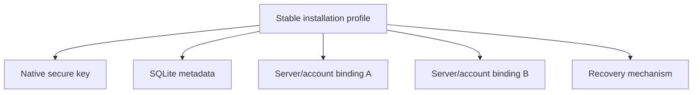

# Durable encryption storage progress

This ledger tracks the migration from origin-scoped browser key custody to one
durable installation profile with platform-appropriate key storage. A row is
complete only after its pull request has merged and the recorded validation has
passed.

## Compatibility contracts

- One installation profile owns a stable key alias. A server or account
  identity selects a binding; it does not select the underlying private key.
- Native catalogs contain identifiers, public metadata, bindings, and migration
  records. They never contain an unprotected private key.
- Server data remains authoritative for projects, conversations, settings, and
  routing. The installation catalog is not a second synchronized application
  database.
- Browser IndexedDB remains origin-scoped and therefore requires a tested
  recovery path. Native runtimes must not use it as their primary key store.
- Existing keys remain available until a replacement key has successfully
  unwrapped and rewrapped the Account Master Key and verified decryption.
- Missing local state never authorizes blank profile initialization or a
  destructive reset.

## Cycle ledger

### Cycle 1 — installation catalog contract and characterization

- Branch: `codex/encryption-storage-cycle1-contracts`
- Pull request: [#1534](https://github.com/ArcaneArts/Cantrip/pull/1534)
- Merge: squash-merged as `e14aad942e6124c17d864af4f11e9a238ee00a01`
- Behavior implemented:
  - Defined the versioned installation, native-key metadata, account-binding,
    and migration records.
  - Defined transactional catalog interfaces suitable for SQLite providers.
  - Added the in-memory test provider with serialized transactions and rollback
    on interruption.
  - Defined a stable key alias derived only from the installation UUID.
  - Preserved existing runtime behavior while documenting the legacy
    `[version, serverId, ownerId]` IndexedDB characterization.
- Validation:
  - `pnpm --filter @cantrip/app exec vitest run src/lib/installation-catalog.test.ts src/lib/client-encryption.test.ts src/lib/account-encryption.test.ts` — 18 tests passed.
  - `pnpm --filter @cantrip/app typecheck` — passed.
  - `git diff --check` — passed.
- Supported platforms: shared contract and test provider only; no runtime
  provider has changed yet.
- Migration status: contract defined; legacy migration not connected.
- Remaining work: Cycles 2–12 below.
- Known risks or blockers: native provider choice and mobile bridge permissions
  require platform-specific implementation and validation.
- Manual verification: none for this behavior-neutral cycle.

### Cycle 2 — runtime, provider, and startup contracts

- Branch: `codex/encryption-storage-cycle2-startup`
- Pull request: [#1536](https://github.com/ArcaneArts/Cantrip/pull/1536)
- Merge: squash-merged as `f199b925a366cf9ecbca26de99f3e13f611b9965`
- Behavior implemented:
  - Added the single runtime classifier for browser, Tauri, Capacitor iOS,
    Capacitor Android, and unsupported native environments.
  - Defined the device-key provider operation boundary. Providers own the
    private-key unwrap operation and return only the Account Master Key needed
    by the in-memory encryption service.
  - Added an idempotent, concurrency-safe in-memory custody backend for shared
    provider contract tests, including concurrent provider instances.
  - Added the pure startup transition owner covering authoritative profile
    discovery, native-key lookup, binding lookup, legacy migration, account
    recovery, anonymous recovery, and precise terminal states.
  - Ensured key custody is located independently of account/server bindings and
    that either missing state reaches legacy discovery before recovery; no
    transition implicitly creates a replacement key.
  - Bound successful unlock, migration, initialization, and recovery events to
    the active installation ID, key alias, principal, grant revision, and
    Account Master Key revision before protected application state can mount.
  - Ensured stale asynchronous results from an earlier account/server
    generation cannot advance the active startup state.
- Validation:
  - `pnpm --filter @cantrip/app exec vitest run src/lib/runtime-platform.test.ts src/lib/client-device-key-provider.test.ts src/lib/client-encryption-startup.test.ts src/lib/installation-catalog.test.ts src/lib/client-encryption.test.ts src/lib/account-encryption.test.ts` — 41 tests passed.
  - `pnpm --filter @cantrip/app typecheck` — passed.
  - `pnpm --filter @cantrip/app build` — passed.
  - `git diff --check` — passed.
  - `pnpm check` — reached `check:app-decomposition` and stopped on the
    pre-existing line-budget failures in `chat-turn-runtime.ts` and
    `task-routes.ts`; the same command fails identically on clean `main`, and
    neither file is changed by this cycle.
- Supported platforms: shared contracts and deterministic tests for browser,
  Tauri, Capacitor iOS, and Capacitor Android classification. Runtime provider
  selection remains unchanged until native providers exist.
- Migration status: startup transition path defined; no legacy record is
  modified.
- Remaining work: Cycles 3–12 below.
- Known risks or blockers: native secure-store implementations must preserve
  the shared P-256 HPKE wrapper format and need OS-specific integration tests.
- Manual verification: none for this behavior-neutral cycle.

### Cycle 3 — Tauri native installation catalog and key custody

- Branch: `codex/encryption-storage-cycle3-tauri-native`
- Pull request: [#1541](https://github.com/ArcaneArts/Cantrip/pull/1541)
- Merge: squash-merged as `f3e105c1be752b80fb8765043ff8e1ed90b23366`
- Behavior implemented:
  - Added a versioned SQLite installation catalog beneath Tauri's current
    bundle-scoped local application-data root at
    `installation/v1/catalog.sqlite3`. Cycle 5 must make the development bundle
    and profile selection stable across worktrees before this is activated.
  - Added installation, public device-key metadata, account binding, migration,
    and compare-and-swap catalog revision tables. The catalog schema has no
    private-key field. Unknown newer schemas, damaged version-one schemas,
    missing catalog metadata, nonempty version-zero databases, and invalid
    logical rows are rejected without recreating, adopting, or repairing them.
    Transactions validate cross-row invariants before commit, and the catalog
    rejects unexpected views, triggers, schema lookalikes, and invalid P-256
    public points.
  - Added OS-backed P-256 private-key custody through macOS Keychain, Windows
    Credential Manager, and Linux Secret Service. Linux fails closed when a
    compatible Secret Service is unavailable; there is no plaintext fallback.
  - Fixed the stable keyring service to
    `art.cantrip.installation.hpke.v1` and the installation-derived alias to
    `cantrip.installation.<installation-uuid>.hpke.v1`. Neither contains a server,
    owner, origin, hostname, MAC address, build path, or worktree.
  - Kept HPKE private-key use inside the Rust provider. The renderer receives
    public metadata and, after authenticated unwrap, only the 32-byte Account
    Master Key required by the existing in-memory encryption service. A static
    envelope produced by the TypeScript `@hpke/core` path is decrypted by the
    Rust provider in the native test suite.
  - Runs SQLite, secure-store, and HPKE operations on Tauri blocking workers,
    returns typed failures, zeroizes temporary private-key and Account Master
    Key buffers, and never replaces a missing or malformed secure-store entry.
    Key creation is serialized across processes by the catalog transaction and
    fails closed when catalog metadata proves that a native key was lost.
  - Added a TypeScript catalog/provider bridge without activating it in normal
    startup. Runtime selection remains on the legacy provider until Cycle 4 can
    migrate an accessible nonextractable IndexedDB key transactionally.
- Validation:
  - `cargo test installation_storage` — 20 native tests passed.
  - `cargo check` — passed on macOS arm64.
  - `cargo test` — 139 tests passed; the two existing native loopback/relay
    integration tests timed out in their HTTP response fixture. The same
    tunnel tests failed before the audit corrections and do not exercise this
    cycle's installation storage module.
  - `pnpm --filter @cantrip/app exec vitest run src/lib/tauri-installation-storage.test.ts src/lib/installation-catalog.test.ts src/lib/client-device-key-provider.test.ts` — 19 tests passed.
  - `pnpm --filter @cantrip/app typecheck` — passed.
  - `pnpm --filter @cantrip/app build` — passed.
- Supported platforms:
  - macOS: native catalog compiled and native tests passed; Keychain selection
    compiled. A signed-app Keychain smoke test remains manual.
  - Windows: Windows Credential Manager provider is selected by target; native
    cross-target compilation and runtime verification remain pending.
  - Linux: Secret Service provider is selected by target with no insecure
    fallback; native cross-target compilation and runtime verification remain
    pending.
  - Browser and Capacitor behavior is unchanged by this cycle.
- Migration status: storage destination and rewrap primitive implemented;
  legacy discovery, verification, and runtime cutover remain Cycle 4 work.
- Remaining work: Cycles 4–12 below.
- Known risks or blockers: platform credential APIs require runtime smoke tests
  on signed macOS/Windows packages and a Linux desktop session. No external
  blocker prevents the next cycle.
- Manual verification: create/inspect/unwrap through a packaged Tauri build on
  each desktop OS before claiming OS-store integration verified.

### Cycle 4 — transactional Tauri migration and account recovery

- Branch: `codex/encryption-storage-cycle4-tauri-migration`
- Pull request: [#1545](https://github.com/ArcaneArts/Cantrip/pull/1545)
- Merge: squash-merged as `c089532c1c7960eec7f806cba721dd31920dff55`
- Behavior implemented:
  - Selected the native Tauri catalog and OS key provider during normal Tauri
    startup while leaving browser and Capacitor runtime selection unchanged.
  - Connected the explicit startup transition owner to installation, server
    profile, native key, binding, legacy discovery, migration, account
    recovery, and precise anonymous recovery states.
  - Added a stable UUIDv5 binding principal derived from installation, server,
    and owner identity. The underlying installation key remains independent of
    every server and account binding.
  - Added client-service operations that wrap the already-unlocked Account
    Master Key for an explicit native principal/public key and unwrap through a
    platform key provider. Migration requires the native result to match the
    legacy-unlocked key and decrypt a marker sealed by the legacy-derived key
    before changing the active client snapshot.
  - Implemented an idempotent legacy IndexedDB migration journal. The native
    principal and grant are reconciled across interrupted requests; the
    account binding and verified migration checkpoint commit together only
    after local native unwrap verification.
  - Retained the legacy IndexedDB record, principal, and grant. Migration never
    calls a revocation or delete endpoint and never replaces a corrupt legacy
    record.
  - Connected password-based recovery for initialized account profiles with a
    missing local legacy registration. The path reauthenticates, unwraps the
    existing password wrapper, provisions and verifies the native binding, and
    never calls server profile initialization.
  - Added a specific anonymous recovery-required application state. Missing or
    corrupt anonymous custody preserves the existing server profile and cannot
    mount an empty application as a fallback.
  - Confirmed from repository history that `art.cantrip`, the production
    WebView origin, and the local application-data root have not changed since
    IndexedDB client custody shipped. The desktop development port changed to
    1420 before that feature, so the retained current-origin reader covers all
    released Tauri legacy records currently known to the repository.
- Validation:
  - `pnpm --filter @cantrip/app exec vitest run src/lib/account-encryption.test.ts src/lib/client-encryption-startup.test.ts src/lib/client-encryption.test.ts src/lib/installation-storage.test.ts src/lib/browser-installation-storage.test.ts src/lib/tauri-installation-storage.test.ts` — 47 focused tests passed (four matching test files).
  - `pnpm --filter @cantrip/app test` — 1,842 tests passed and 3 skipped across
    350 test files after building the workspace-local `@cantrip/glitch` package.
  - `pnpm --filter @cantrip/app typecheck` — passed.
  - `pnpm --filter @cantrip/app build` — passed.
  - `cargo fmt --manifest-path cantrip_app/src-tauri/Cargo.toml -- --check` —
    passed.
  - `cargo check --manifest-path cantrip_app/src-tauri/Cargo.toml` — passed.
  - `cargo test --manifest-path cantrip_app/src-tauri/Cargo.toml installation_storage`
    — 20 tests passed.
  - `pnpm check:app-decomposition` — failed only on the unchanged baseline
    `chat-turn-runtime.ts` (2,103/1,999 lines) and `task-routes.ts`
    (2,147/1,999 lines); this cycle did not modify either file and introduced
    no newly reported decomposition overage.
- Supported platforms:
  - Tauri: native runtime selection, legacy migration, native restart unlock,
    password reprovisioning, and anonymous recovery state are connected and
    covered by deterministic shared/provider tests.
  - Browser: existing IndexedDB runtime remains active and behavior is
    unchanged in this cycle.
  - Capacitor: runtime behavior remains unchanged pending Cycles 6–7.
- Migration status: merged for accessible legacy records in the current Tauri
  WebView origin. Legacy custody is deliberately retained after verification.
- Remaining work: Cycles 5–12 below, including native-key-loss rotation,
  anonymous recovery artifacts, browser recovery, mobile providers, and
  platform update harnesses.
- Known risks or blockers: signed macOS/Windows/Linux secure-store smoke tests
  remain manual. A cataloged native key missing from the OS store still fails
  closed instead of rotating; password-authorized native key rotation remains
  required before final completion.
- Manual verification: migrate a real pre-cycle Tauri profile on macOS and
  confirm the second launch unlocks from Keychain without reading IndexedDB.

### Cycle 5 — stable named development profiles and diagnostics

- Branch: `codex/encryption-storage-cycle5-dev-profile`
- Pull request: [#1546](https://github.com/ArcaneArts/Cantrip/pull/1546)
- Commit: `3f93fb040718fbea34613e7e195ee22f16aace0d`
- Merge: squash-merged as `35defd3c396bb581bc5be88cd0309a25b8783b54`
- Behavior implemented:
  - Moved the canonical development profile identity out of worktree-local
    `.cantrip` and build output into versioned shared Git metadata. The
    `default` profile is now reused by every branch and worktree.
  - Added compatibility adoption of the primary checkout's existing
    `tauri-dev.conf.json` identifier. The migration projects that exact identity
    into the current worktree instead of silently choosing a new WebView/native
    application-data namespace.
  - Kept `.cantrip/dev` as the default server/worker state contract and made
    named clean lanes explicit under `.cantrip/dev-profiles/<name>`. Their
    server, worker, logs, Tauri config projection, and Cargo target paths are
    isolated while their canonical identity remains outside the worktree.
  - Added `pnpm dev:profile inspect [name]` to report non-secret profile,
    installation, provider, catalog, binding count, migration state, origin,
    and data/build paths. The diagnostic reads no secure-store secret or raw
    private key.
  - Added `pnpm dev:profile create <name>` and
    `pnpm devtop -- --profile <name>` for deliberate clean test installations.
    Existing profile names are never overwritten or reset implicitly.
- Validation:
  - `node --test scripts/devtop-tauri-config.test.mjs scripts/development-profile.test.mjs scripts/devtop.test.mjs scripts/dev-browser.test.mjs` — 21 tests passed.
  - `pnpm typecheck` — passed across all workspace packages.
  - `pnpm --filter @cantrip/app... build` — passed.
  - `pnpm --filter @cantrip/app test` — 1,842 tests passed and 3 skipped
    across 350 test files after building workspace package entrypoints.
  - `node --test scripts/*.test.mjs` — 115 tests passed and two unrelated
    baseline tests failed: the application-platform deployment assertion and
    tranche-two sidebar acceptance assertion. The same two failures reproduce
    on clean `main`, and neither fixture is changed by this cycle.
  - `pnpm check:large-files` and `git diff --check` — passed.
  - `pnpm check:app-decomposition` — failed only on the unchanged baseline
    `chat-turn-runtime.ts` (2,103/1,999 lines) and `task-routes.ts`
    (2,147/1,999 lines); this cycle introduced no decomposition overage.
- Supported platforms: deterministic app-local data/provider diagnostics cover
  macOS, Windows, and Linux; `devtop` remains the Tauri desktop development
  lane. Browser and Capacitor runtime behavior is unchanged.
- Migration status: legacy worktree identity adoption is merged and preserves
  the primary development namespace.
- Remaining work: Cycles 6–12 below.
- Known risks or blockers: a first post-migration launch should be smoke-tested
  on macOS to confirm Tauri resolves the reported application-local data path
  exactly as the diagnostic predicts. Profile destruction is intentionally not
  automated because native secure-store deletion requires platform-specific,
  explicitly destructive handling.
- Manual verification: run `pnpm dev:profile inspect`, start `pnpm devtop`,
  verify the previous encrypted workspace opens, then inspect again and confirm
  the installation ID remains unchanged after deleting only Cargo target output.

### Cycle 6 — Capacitor native catalogs and key custody

- Branch: `codex/encryption-storage-cycle6-capacitor-native`
- Pull request: [#1547](https://github.com/ArcaneArts/Cantrip/pull/1547)
- Commit: `f62c37897a4c60b4752a4063560124953bdf1bea`
- Merge: pending auto-merge
- Behavior implemented:
  - Generalized the already-tested native catalog and device-key TypeScript
    bridge so Tauri and Capacitor share one validation, transaction, and
    Account Master Key byte-boundary implementation without changing Tauri's
    command names or active startup behavior.
  - Added app-private SQLite installation catalogs at
    `installation/v1/catalog.sqlite3` for Capacitor iOS and Android. Both use
    schema version one, foreign keys, integrity checks, compare-and-swap
    revisions, and the same installation, public-key, binding, and migration
    responsibilities as the desktop catalog. Neither schema contains private
    key material.
  - Added an iOS Capacitor plugin whose P-256 private key is held in Keychain
    under service `art.cantrip.installation.hpke.v1` with
    `AfterFirstUnlockThisDeviceOnly` accessibility. The stable account alias is
    derived only from the installation UUID.
  - Added an Android Capacitor plugin whose P-256 private-key encoding is
    encrypted with an installation-specific, nonexportable AES-GCM key in
    Android Keystore. Only the authenticated encrypted record is held in the
    app-private preferences file; plaintext private material is never written
    to SQLite or preferences.
  - Implemented RFC 9180 P-256/HKDF-SHA256/AES-256-GCM unwrap natively on both
    mobile platforms. Temporary private-key and unwrapped-master-key byte
    buffers are cleared on best effort, and a missing or malformed secure-store
    record fails closed instead of generating a replacement.
  - Registered the custom plugin in both native shells and added the
    `apple-keychain` and `android-keystore` Capacitor provider adapter. Normal
    Capacitor encryption startup remains on its prior path until Cycle 7 adds
    transactional migration and recovery.
- Validation:
  - `pnpm --filter @cantrip/app exec vitest run src/lib/capacitor-installation-storage.test.ts src/lib/tauri-installation-storage.test.ts src/lib/installation-catalog.test.ts src/lib/client-device-key-provider.test.ts` — 23 tests passed.
  - `ANDROID_HOME=... JAVA_HOME=... ./gradlew :app:compileDebugJavaWithJavac :app:testDebugUnitTest` — passed; two Android HPKE compatibility tests opened the TypeScript fixture and verified canonical associated data.
  - `node --test scripts/ios-native-storage.test.mjs` — passed; the Swift
    CryptoKit provider opened the same TypeScript fixture and matched canonical
    associated data.
  - `xcodebuild -project cantrip_app/ios/App/App.xcodeproj -scheme App -sdk iphonesimulator -configuration Debug CODE_SIGNING_ALLOWED=NO build` — passed for arm64 and x86_64 simulators.
  - `pnpm --filter @cantrip/app typecheck` and
    `pnpm --filter @cantrip/app build` — passed.
  - `pnpm --filter @cantrip/app test` — 1,846 tests passed and 3 skipped across
    351 test files.
  - `node --test scripts/*.test.mjs` — 116 tests passed, including the new
    Swift fixture; two unrelated baseline assertions failed for the App
    Platform build-command fixture and tranche-two sidebar acceptance fixture.
    Both failures were already reproduced on clean `main` in Cycle 5, and this
    cycle changes neither surface.
  - `pnpm check:large-files` and `git diff --check` — passed.
  - `pnpm check:app-decomposition` — failed only on the unchanged baseline
    `chat-turn-runtime.ts` (2,103/1,999 lines) and `task-routes.ts`
    (2,147/1,999 lines); this cycle introduced no newly reported overage.
- Supported platforms:
  - Capacitor iOS: native plugin and Keychain provider compile for the iOS
    simulator; deterministic CryptoKit wire compatibility passed on macOS. A
    signed physical-device Keychain smoke test remains manual.
  - Capacitor Android: native plugin compiles against the checked-in mobile
    project; JVM wire compatibility tests passed. A physical-device Android
    Keystore smoke test remains manual.
  - Tauri and browser runtime selection remain unchanged by this cycle.
- Migration status: the mobile storage destinations and native unwrap
  primitives exist, but no legacy Capacitor record is migrated or selected by
  normal startup until Cycle 7.
- Remaining work: Cycles 7–12 below.
- Known risks or blockers: Android backup may restore encrypted catalog or
  preference data to a fresh install without its nonexportable Keystore key;
  that condition fails closed and must enter Cycle 7 account/anonymous recovery
  rather than regenerate. No external blocker prevents Cycle 7.
- Manual verification: on signed iOS and Android development builds, create a
  native key, restart the app, inspect the same alias, unwrap a registered
  Account Master Key, and confirm no private material appears in the SQLite
  catalog or diagnostic output.

## Remaining cycles

4. Manually smoke-test the merged transactional Tauri migration above.
5. Merge and manually smoke-test the stable development profile above.
6. Connect Capacitor migration and recovery.
7. Harden browser persistence, replacement-device recovery, and recovery UI.
8. Implement anonymous recovery export/import.
9. Add update/install compatibility harnesses and release gates.
10. Retire obsolete defaults while retaining required legacy readers.
11. Complete the cross-platform audit, full validation, and documentation.
