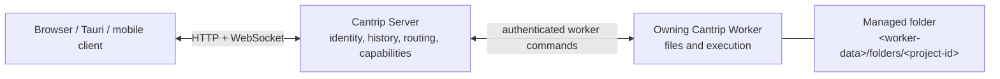

# Worker-managed folder projects

Status: implemented. This document is the product contract, architecture
record, and acceptance matrix for the shipped behavior.

The implementation was delivered through seven sequential Manual Change
Protocol cycles: domain and migration, worker materialization, routing and
agent execution, Tasks and workflows, application UX, explicit GitHub
conversion, and final acceptance/documentation. Each cycle used its own
worktree and ready pull request; no omnibus branch was used.

## Objective

Provide a first-class Cantrip project type backed by a new empty directory on one
worker rather than by a Git or GitHub repository. A folder project supports the
normal Cantrip workspace experience without creating a `.git` directory,
requiring GitHub authentication, or pretending that Git-backed recovery and
replication exist.

The directory remains owned by exactly one worker. Any authenticated Cantrip
client may view and control the project through the server from a browser,
Tauri desktop app, or mobile device. If the owning worker is offline, durable
server-owned metadata and conversation history remain readable, but every
operation that needs the directory or that worker is unavailable until it
reconnects.

## Product decisions

- V1 creates only new, empty, Cantrip-managed directories. It does not attach
  arbitrary existing worker paths.
- A folder project is permanently bound to its creation worker until it is
  explicitly converted into a GitHub-backed project. V1 does not replicate its
  files or relocate its execution to another worker.
- Project display names may repeat. Physical directory identity uses the
  project UUID and never depends on the display name.
- Agents and write-capable workflows may write directly into the folder. The
  workflow graph, configured concurrency, permissions, and approval profile
  remain authoritative; Cantrip does not add serialization merely to imitate
  Git protection.
- Folder projects have no Git History, changes, branches, worktrees, Issues,
  pull requests, releases, GitHub issue conditions, Git replicas, or
  Git-backed chat relocation.
- Running `git init` inside a folder does not silently change its project type.
  Conversion is explicit and is valid only when the folder is linked to a
  GitHub repository.
- Removing a folder project defaults to unlinking it from Cantrip while leaving
  its files on the worker. Selecting local-file deletion requires the existing
  checkbox plus a second destructive confirmation dialog.
- An unlinked folder left on disk cannot be attached as a new folder project in
  V1. The removal dialog must say this directly before unlinking.

## Terminology

- **Folder project** — the server-owned project whose origin kind is a managed
  directory rather than GitHub.
- **Folder source** — the one worker-owned physical installation of that
  project.
- **Execution root** — the canonical directory used as `cwd` and workspace
  root by Agents, Tasks, Terminals, Explorers, Code, workflows, and related
  worker operations.
- **Owning worker** — the only worker allowed to dereference or execute in the
  folder source.
- **Remote client** — any browser, desktop, or mobile client connected to the
  server. Client location does not change worker ownership.

The existing `project_sources`, `project_worktrees`, `projectSourceId`, and
`worktreeId` names may remain internal compatibility details during V1. User
interfaces and agent context must call the non-Git root a folder or execution
root, never a worktree.

## Scope

### Supported

- Agents in Default, Plan, and Goal modes;
- Tasks, including planning, review, finalization, Goal execution, and usage
  controls;
- prompt queues, steering, pause, resume, stop, compaction, forks, and
  attachments;
- Terminal tabs and supervised terminal services;
- Explorer browsing, preview, structured views, Monaco editing, and
  conflict-safe saves;
- Cantrip Code tabs;
- Browser and Remote Desktop tabs on the owning worker;
- project tunnels and desktop project shares;
- Agent Policies, skills, MCP configuration, provider routing, and permission
  profiles;
- scheduled prompts and worker-side script conditions;
- project and workflow repository files stored in the folder;
- read-only and write-capable workflows; and
- bounded folder statistics for the project overview.

### Not supported

- importing or attaching an existing arbitrary directory;
- Git History or working-change views;
- Git branches, tags, stashes, submodules, LFS, commits, remotes, or recovery;
- GitHub Issues, pull requests, reviews, releases, or issue-count automation
  conditions;
- additional worktrees or worktree policy selection;
- project replicas, cross-worker file synchronization, or chat relocation;
- automatic project-type changes after `git init`; or
- recovery, rollback, diff attribution, or checkpoint revisions supplied by
  Git.

## Baseline and delivered changes

| Concern             | Pre-feature behavior                                                                         | Delivered behavior                                                                                      |
| ------------------- | -------------------------------------------------------------------------------------------- | ------------------------------------------------------------------------------------------------------- |
| Project creation    | `POST /api/projects/from-github` creates a project and queues Git replica provisioning.      | Add a folder-specific creation contract and durable materialization path independent of GitHub.         |
| Persistent identity | GitHub identity is nullable, but source kind is implicit.                                    | Persist explicit project and source kinds; do not infer folder capability from nullable GitHub columns. |
| Execution placement | Filesystem-backed surfaces require a ready `project_worktrees` row.                          | Represent one folder execution root without exposing it as a Git worktree.                              |
| Worker storage      | Clones live under the worker-managed `repositories` root.                                    | Add a separate managed folder root keyed by project UUID.                                               |
| Agent policy        | Agent context advertises worktree acquisition and Git-oriented repository work.              | Supply folder-specific direct-write context and reject worktree commands.                               |
| Observation         | Workers periodically run Git inventory and status for every configured source/worktree pair. | Never configure Git observation for folder sources.                                                     |
| Workflows           | Write nodes allocate secondary worktrees and require a Git checkpoint.                       | Run against the folder root and complete without a Git lease or checkpoint.                             |
| Tasks               | The implementation dashboard reports worktree dirtiness and associated PRs.                  | Show folder/worker placement and omit Git- and PR-derived sections and warnings.                        |
| Overview            | Commit and code statistics come from Git tracked files.                                      | Replace Git metrics with a bounded, symlink-safe folder scan.                                           |
| Removal             | Worker deletion accepts only managed repository paths.                                       | Add a distinct managed-folder deletion command and two-step destructive UI.                             |
| Conversion          | No project-origin conversion exists.                                                         | Add a later explicit folder-to-GitHub transition; never auto-promote.                                   |

## Complexity and delivery assessment

This is a high-complexity, cross-cutting feature rather than a creation-form
change. The physical `mkdir` is small; most of the work is separating the
current execution-root contract from assumptions that every root has Git
metadata, a checkout lifecycle, and a recoverable checkpoint. The change spans
the protocol, both databases, server orchestration, the worker command loop,
workflow and Task state machines, and desktop/mobile application surfaces.

The work was delivered as seven independently mergeable changes matching the
milestones below. The first vertical slice established the migration,
worker-command, and test costs used by the later passes.

| Area                          | Complexity  | Main reason                                                                                  |
| ----------------------------- | ----------- | -------------------------------------------------------------------------------------------- |
| Kinds, capabilities, backfill | Medium      | Additive data changes, but every existing GitHub project must retain identical behavior.     |
| Durable creation and deletion | High        | Requires replay-safe server/worker coordination and strict path-containment guarantees.      |
| Runtime surface routing       | Medium-high | Many surfaces already accept a root, but shared resolvers currently expect Git worktrees.    |
| Workflows and Tasks           | High        | Mutation completion, dashboards, retries, and concurrency currently consume Git state.       |
| Desktop and mobile UI         | Medium-high | Capability filtering must cover creation, menus, settings, tabs, overview, and offline UX.   |
| GitHub conversion             | High        | This is a transactional origin transition with local and remote history safety constraints.  |
| Regression coverage           | High        | The feature must add non-Git paths without weakening existing Git and multi-worker behavior. |

The completed critical path was:

1. introduce persisted kinds and authoritative capabilities;
2. materialize one safe worker-owned folder and expose it as an execution root;
3. route the ordinary runtime surfaces without invoking Git observation;
4. remove Git checkpoint assumptions from workflows and Tasks;
5. expose the capability-driven creation and management UI; and
6. add GitHub conversion after folder mode itself is stable.

The most likely implementation touchpoints are
`packages/protocol/src/index.ts`, `packages/protocol/src/live.ts`,
`cantrip_server/src/db/schema.ts`, the project routes in
`cantrip_server/src/app.ts`, `cantrip_server/src/project-replicas`,
`cantrip_server/src/worktrees`, `cantrip_server/src/workflows`,
`cantrip_server/src/tasks`, `cantrip_worker/src/runtime-loop.ts`,
`cantrip_worker/src/worktrees.ts`, `cantrip_worker/src/git.ts`, and the project,
Task, workflow, tab, and mobile components under `cantrip_app/src`. The exact
files can be narrowed per milestone, but the protocol and central server
capability guard must land before independent surface work can safely proceed.

## Architecture



The app continues to talk only to the server. The server owns the logical
project, setup job, workspace membership, conversations, tabs, policies,
workflows, and routing metadata. The worker alone chooses, creates,
canonicalizes, reads, executes in, shares, and deletes the physical folder.

No API accepts a client-provided absolute path. The worker command receives the
project UUID and display name, while the worker derives the target from its own
configured data directory.

## Domain and protocol model

### Persisted kinds

Add explicit discriminators rather than overloading nullable GitHub metadata:

- `projects.origin_kind`: `github` or `managed-folder`;
- `project_sources.source_kind`: `git` or `folder`; and
- `project_worktrees.root_kind`: `git-worktree` or `folder-root`.

Backfill every existing project as `github`, every existing source as `git`,
and every existing root as `git-worktree`. The migration must preserve all
existing IDs, foreign keys, positions, tab memberships, worktree leases, and
execution attribution.

The folder project stores:

- `githubRepositoryId = null`;
- `githubRepositoryFullName = null`;
- `githubRepositoryUrl = null`;
- `worktreePolicy = direct` as a compatibility value;
- one active folder source; and
- one Primary/default folder-root row whose absolute path matches the source.

Branch, HEAD, detached revision, repository fingerprint, and Git status remain
null or empty for a folder root. Database and protocol validation must enforce
the valid combinations for each kind.

### Project capabilities

Expose a parsed capability object on `ProjectSummary` so clients do not scatter
origin-kind heuristics:

```ts
{
  git: boolean;
  github: boolean;
  worktrees: boolean;
  replicas: boolean;
  relocation: boolean;
}
```

For V1 folder projects all five values are false. Filesystem and runtime
capabilities continue to come from the owning worker.

### Worker capability

Add an additive heartbeat capability for managed-folder creation and deletion.
The server must refuse folder creation on an older worker that does not
advertise it. This preserves rolling-deployment behavior instead of sending an
unknown command and leaving setup ambiguous.

### Creation contract

Add a folder-specific request such as:

```http
POST /api/projects/from-folder
Content-Type: application/json

{
  "name": "Scratch prototype",
  "workerId": "worker-id",
  "workspaceIds": ["workspace-id"]
}
```

`name` is trimmed, bounded, and used only for display. Duplicate names are
valid. Workspace ownership and worker ownership are validated before a project
or setup job is created.

The response is `202 Accepted` with a project whose setup status is
`preparing`. Existing `cloning`, `ready`, and `failed` states remain valid for
GitHub projects and rolling clients.

## Durable folder materialization

Folder creation must be replay-safe across worker disconnects and server
restarts. Do not perform an untracked `mkdir` directly inside the HTTP request.

The setup sequence is:

1. In one database transaction, create the `managed-folder` project, assign its
   workspaces, bind its preferred worker, and enqueue an idempotent setup job.
2. Publish the project and setup-job invalidations so every client sees
   `preparing` immediately.
3. When the worker is available and advertises the capability, send a bounded
   command containing the project UUID.
4. The worker derives `<worker-data>/folders/<project-id>`, creates it with
   owner-only permissions where supported, rejects symlinks and non-directory
   collisions, canonicalizes it, and returns its canonical and display paths.
5. Repeating the same command for the same project returns the same empty or
   previously materialized managed directory. It never chooses a new path.
6. In one completion transaction, insert the folder source and folder-root
   rows and mark the project `ready`.
7. Publish project, source, execution-target, and folder-setup invalidations.
8. Retry retryable worker/offline failures through the durable job. Persist a
   bounded error and mark setup `failed` only for terminal failures, with an
   explicit retry action.

The existing Git replica job may be generalized only if its payload and state
machine become a clean discriminated union. A separate folder-materialization
job is preferable to making Git repository, revision, fingerprint, and
synchronization fields conditionally meaningless throughout the current
replica executor.

## Execution placement and offline behavior

All folder-backed operations resolve to the owning worker and folder-root row.
An explicit target naming another worker is rejected with a capability-specific
conflict. Browser and Remote Desktop surfaces also remain on the owning worker
for a folder project, even though those surface types can use arbitrary workers
for GitHub projects today.

Remote clients are not restricted. They continue to read server-owned state
and route actions through the server from any supported client. Worker
placement and client location are independent concepts.

When the owning worker is offline:

- project identity, settings, tabs, conversation history, plans, workflow
  history, and usage remain readable;
- new or resumed folder-backed execution reports the worker as offline;
- Terminal, Explorer, Code, Browser, Remote Desktop, tunnels, shares, folder
  statistics, and script discovery do not silently move elsewhere; and
- reconnecting the same worker restores availability without changing paths or
  durable IDs.

## Agent and Task behavior

The folder root is a normal Codex `cwd` and runtime workspace root. Default
permission profiles and approval behavior remain unchanged. Folder projects
use direct workspace-write semantics because no secondary worktree exists.

Every turn receives concise application context stating that:

- the project is a worker-managed folder without Git protection;
- writes occur directly in that folder;
- Cantrip worktree commands are unavailable; and
- `git init` does not convert the project automatically.

Do not inject instructions that tell the agent to create, acquire, switch,
release, commit, or inspect worktrees. The Cantrip CLI must reject folder-scoped
`worktree` commands with a stable unsupported-capability response while its
Explorer, Terminal, Browser, target, and policy commands continue to work.

Tasks preserve their complete planning and Goal lifecycle. Their implementation
dashboard replaces worktree/branch placement with the owning worker and folder
display path. It omits PR association and Git-derived dirty/merge warnings
rather than presenting them as failed lookups.

## Workflow behavior

Folder projects allow both read-only and write-capable workflow nodes.

- Every node executes on the owning worker in the same folder root.
- Read-only nodes keep the existing read-only sandbox behavior.
- Write nodes receive the configured mutation permission and write directly to
  the folder.
- The workflow graph, map/repeat behavior, dependency ordering, configured
  bounded concurrency, permission manifest, approval mode, and operator
  controls remain authoritative.
- Cantrip does not allocate a worktree lease, force serialization, or reject
  parallel writes merely because the project lacks Git.
- Completion does not request `worktree.status` and does not require a commit,
  branch, HEAD, Git checkpoint, or clean tree.
- Produced-change metadata must represent the absence of a Git checkpoint
  explicitly rather than fabricating a revision.
- Retry and repeat nodes may observe or modify files left by earlier attempts,
  exactly as direct execution implies.

The workflow UI should identify the execution mode as `Direct folder` so the
operator can distinguish it from an isolated Git worktree without adding a
warning gate that blocks their requested execution.

## Surface and feature behavior

| Feature                           | Folder-project behavior                                                            |
| --------------------------------- | ---------------------------------------------------------------------------------- |
| Agent / Task                      | Runs in the folder root with direct writes.                                        |
| Terminal                          | Starts in the folder or requested safe subdirectory.                               |
| Explorer                          | Full read/write support; commit metadata reports unavailable.                      |
| Code                              | Opens the folder root in the existing isolated Cantrip Code session.               |
| Browser                           | Runs on the owning worker.                                                         |
| Remote Desktop                    | Shows and controls the owning worker.                                              |
| Tunnels                           | Existing project-associated tunnel routing remains available on the owning worker. |
| Project Share                     | Shares the folder root through the existing authorized WebDAV path.                |
| Policies / skills / MCP           | Resolve and apply normally. Repository-local files are read from the folder.       |
| Scheduled prompts                 | Run normally against the selected Agent.                                           |
| Script condition                  | Runs in the folder root.                                                           |
| Open-issues condition             | Hidden and rejected because there is no GitHub repository.                         |
| Workflow repository               | Scans and writes normal workflow files in the folder.                              |
| External chat import              | Path-based matching may apply; Git-origin matching does not.                       |
| Git / Issues / PRs / Releases     | Hidden in UI and rejected by the server.                                           |
| Worktrees / replicas / relocation | Hidden and rejected for folder projects.                                           |

## Folder statistics

The project overview must not call `git ls-files` or `git rev-list` for a
folder source. Add a bounded worker-side folder scan that:

- canonicalizes the root and never follows directory symlinks;
- excludes worker-private state and `.git` if a user created it manually;
- caps directory entries, file count, total bytes read, individual text-file
  size, concurrency, and duration;
- reports file count, byte count, text-file count, line count, excluded file
  count, and whether the result was truncated; and
- never treats scan failure as project unavailability.

Folder overview cards omit commit count and Git status. Labels say `Files`,
`Folder size`, and `Lines of text` rather than tracked files or repository
size.

## User interface

### Creation

The New Project flow exposes two clear paths:

1. **New folder** — requires a name, owning worker, and workspace membership;
2. **GitHub repository** — retains the existing import/create experience.

New folder remains available when the worker has no GitHub authentication.
Browser, Tauri, and mobile clients use the same server request; no native
filesystem picker is involved.

After submission, the project appears immediately with `Preparing folder`,
then transitions live to ready or failed. A successful mobile creation enters
the project overview, consistent with existing mobile navigation.

### Project identity and settings

Use a normal folder icon and source display path. Add a compact `Folder`
identity label where GitHub projects show repository identity.

For folder projects:

- remove Git from every surface-creation menu;
- remove Worktrees and Replicas settings;
- hide worktree policy, branch, HEAD, dirty state, Issues, PRs, and releases;
- hide chat worktree-mode controls and relocation actions;
- keep Automations, Workflows, Tunnels, Policies, Skills, MCP, archive, and
  general settings; and
- filter the open-issues condition from automation forms.

Capability filtering must be shared across desktop and compact/mobile menus.
The server remains the enforcement boundary for stale clients.

## Unlink and destructive deletion

The first removal dialog defaults to **Unlink project** and leaves the folder
unchanged. It must explain that V1 cannot reattach the preserved folder through
the New Folder flow. The user retains full access to the path on the worker.

The first dialog also offers **Also delete local files**. When checked, its
primary action becomes **Continue to delete** and opens a second dialog. The
second dialog:

- identifies the project and exact display path;
- states that the folder has no Cantrip- or Git-backed recovery;
- requires a separate destructive button press; and
- permits returning to the first dialog without losing context.

The server closes or revokes project-owned terminals, remote surfaces, shares,
and tunnels before deletion. The worker deletion command accepts only the
canonical `<worker-data>/folders/<project-id>` target recorded for that
project, rejects the folders root itself, rejects symlinks and kind mismatches,
and deletes no path supplied directly by a client.

If the worker is offline, unlink without file deletion remains possible after
server-owned cleanup. Local-file deletion waits for the owning worker and never
silently degrades into unlinking.

## Explicit conversion to GitHub

Manual `git init`, adding a remote, or creating commits does not change the
project's persisted kind or capabilities. A folder stays in folder mode until
the user chooses **Convert to GitHub project** in Project Settings.

The conversion must:

1. require the owning worker online and the project free of an active folder
   setup, deletion, conversion, or mutating workflow transition;
2. require the user to select or create a GitHub repository accessible through
   that worker;
3. reject a GitHub repository already bound to another Cantrip project;
4. preflight the local `.git` state and selected GitHub identity on the worker;
5. refuse ambiguous remote/history combinations rather than merging or
   overwriting automatically;
6. initialize Git when needed and bind `origin` only after the user confirms
   the exact GitHub repository;
7. avoid creating a commit, force-pushing, or overwriting remote history as an
   implicit side effect;
8. compute the repository fingerprint, reconcile the Primary checkout, and
   atomically update project/source/root kinds plus GitHub metadata;
9. preserve the project ID, tabs, chats, Tasks, settings, paths, and execution
   attribution; and
10. publish project, worktree, Git, execution-target, and settings
    invalidations before enabling Git UI.

V1 conversion should accept a new or empty GitHub repository. Converting into
an existing repository with unrelated history is a separate import/merge
workflow and must not be guessed automatically.

Conversion is one-way in V1. Removing `.git` from a converted project produces
the existing missing/broken Git state; it does not silently revert to folder
mode.

## API enforcement and cache invalidation

Introduce one server-side capability guard used by all Git-, GitHub-,
worktree-, replica-, and relocation-specific routes. This avoids relying on
dozens of client checks and gives old clients one stable error shape.

Folder creation, setup completion/failure/retry, unlink, deletion, and
conversion publish the same application-live resource invalidations used by
the corresponding project operations. At minimum update or invalidate:

- project lists and the affected project summary;
- project workspaces;
- project setup/materialization jobs;
- project sources, execution targets, and placement;
- project tab layout when setup creates an initial surface;
- project statistics;
- workers when capability changes matter; and
- worktrees, Git history/status, settings, and GitHub repository caches after
  conversion.

Optimistic project insertion must be reconciled by the authoritative project
summary so origin kind and capabilities cannot remain stale after setup.

## Security invariants

- Apps never supply or dereference worker filesystem paths.
- The server authorizes project, workspace, worker, and source ownership before
  dispatching a command.
- The worker derives folder paths from its private data root and project UUID.
- Folder creation and deletion never follow symlinks.
- No command can create or delete the managed folders root itself.
- A folder source is bound to exactly one project and one worker.
- A stale client cannot invoke Git or cross-worker operations merely because
  the UI once exposed them.
- Workspace-write sandbox roots contain only the canonical folder root unless
  an explicitly selected permission profile grants more access.
- Project names are display data and never participate in path construction.
- Logs may include project, worker, request, workflow, and surface IDs but must
  follow existing path-redaction policy for physical worker paths.

## Implementation milestones (complete)

Each milestone is independently reviewable and follows the Manual Change
Protocol with its own worktree, branch, ready pull request, squash auto-merge,
merge observation, and cleanup.

### Milestone 1: domain foundation

- Add project, source, and root kinds plus project capabilities.
- Add and verify the database migration and backfill.
- Extend project summaries, execution contexts, and test fixtures.
- Add central server capability guards without changing existing GitHub
  behavior.

### Milestone 2: durable worker materialization

- Advertise the managed-folder worker capability.
- Add safe, idempotent create and delete commands.
- Add the durable folder setup job, retry/recovery behavior, and live events.
- Create the folder source/root records and offline setup states.

### Milestone 3: runtime surfaces

- Route Agent, Task, Terminal, Explorer, Code, Browser, Remote Desktop,
  tunnels, shares, scripts, policies, skills, MCP, and attachments to the
  owning worker.
- Add folder-specific agent context and CLI worktree rejection.
- Exclude folder roots from Git observation and worktree coordination.
- Add folder statistics.

### Milestone 4: workflows, Tasks, and automations

- Execute read and write workflow nodes directly in the folder root without
  Git leases or checkpoints.
- Adapt workflow result and dashboard representations.
- Remove Git/PR assumptions from Task dashboards.
- Preserve scheduled prompts and script conditions while rejecting
  open-issues conditions.

### Milestone 5: application experience

- Add New Folder creation across desktop and compact/mobile layouts.
- Render preparing, ready, failed, offline, and retry states.
- Apply capability-based menus, settings, overview, placement, and action
  filtering.
- Add unlink wording and the second destructive-delete confirmation.

### Milestone 6: explicit GitHub conversion

- Add conversion preflight, durable transition, worker Git/GitHub binding, and
  rollback-safe database commit.
- Enable Git capabilities only after complete reconciliation.
- Cover empty remote, manually initialized local Git, collision, offline, and
  interrupted conversion cases.

### Milestone 7: documentation and cross-platform acceptance

- Update README, full description, deployment backup guidance, workflows,
  Tasks, worktrees, and hosted acceptance documentation.
- Exercise browser, Tauri, iOS/Android layouts, PGlite, PostgreSQL, local mode,
  and a remote hosted worker.

## Validation plan

### Protocol and migration

- Existing projects backfill to GitHub/Git kinds without changing serialized
  behavior.
- Folder kind combinations and capabilities parse; invalid mixed Git/folder
  states fail.
- The complete migration chain succeeds on PGlite and disposable PostgreSQL.

### Server

- Creation accepts duplicate names but rejects unknown workers/workspaces and
  incapable workers.
- Offline setup remains queued and resumes after reconnect.
- Replayed setup completion does not duplicate a source or root.
- Every filesystem-backed surface resolves only to the owning worker.
- Explicit other-worker targets and every Git-only route fail for folder
  projects.
- Remote clients retain readable durable state while the worker is offline.
- Unlink succeeds independently of worker availability; deletion requires the
  owning worker.

### Worker

- Creation stays beneath the managed folders root on macOS, Windows, and Linux.
- Project names, traversal strings, symlinks, collisions, and root deletion
  cannot influence the target.
- Repeated creation is idempotent.
- Explorer, Code, Terminal, script discovery, folder statistics, and project
  sharing work without `.git`.
- Git observation never receives a folder target.
- Deletion removes only the exact managed folder.

### Agent, Task, and workflow

- Codex starts and resumes in a non-Git directory in Default, Plan, and Goal
  modes.
- Direct writes work under the expected permission profiles.
- Agent context contains no worktree acquisition instruction.
- Tasks plan, finalize, implement, pause, resume, and complete without Git
  dashboard failures.
- Write workflows complete without leases or Git checkpoints, including
  configured parallel write nodes.
- Workflow retry and repeat behavior uses the existing folder contents.

### Application

- New Folder is available without GitHub authentication.
- Duplicate names render and select independently.
- Git, Issues, PRs, releases, Worktrees, Replicas, relocation, and open-issue
  conditions do not appear.
- Agent, Task, Terminal, Explorer, Code, Browser, Remote Desktop, tunnel,
  policy, skill, MCP, workflow, and automation actions remain available.
- Offline state is explicit and recovers live.
- Unlink uses one confirmation; local deletion requires two separate
  confirmations.
- Folder overview metrics use filesystem terminology and bounded results.

### Regression and repository checks

Run focused protocol, migration, server, worker, workflow, Task, and app tests
for each milestone, followed by:

```shell
pnpm check
pnpm --filter @cantrip/app build
```

Changes that touch the compatibility execution-root row or Git route guards
also run the focused matrix in
[the worktree guide](WORKTREES.md#development-validation).

## Definition of done

A user can create two identically named empty folder projects on one or more
workers, distinguish them by worker/path context, and use every supported
non-Git Cantrip surface from local or remote clients. The folder contains no
`.git` directory unless the user creates one. Direct Agent and workflow writes
are permitted according to the selected permissions and workflow definition.

The project stays bound to its owning worker, becomes unavailable for execution
when that worker is offline, and resumes on reconnect. Git- and
replication-dependent actions are absent and fail closed through the server if
invoked by a stale client. Unlink preserves the folder with an explicit V1
reattachment limitation; permanent deletion requires a second warning and can
remove only the exact worker-managed folder.

The project can gain Git features only through the explicit GitHub conversion
flow, which preserves its Cantrip identity and never guesses how to merge or
overwrite repository history.
