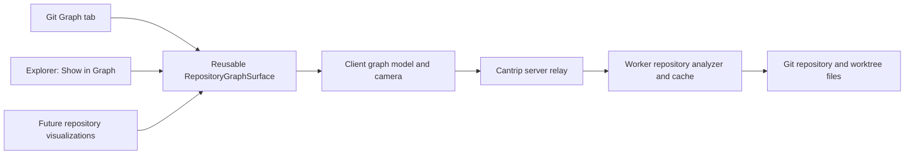

# Repository Graph Visualization Plan

## Status

This document describes the planned Cantrip repository graph feature. The
working name in the product is **Graph**. The filename preserves the original
Gource-inspired discussion, but the feature is not intended to embed, fork, or
reproduce Gource.

The following decisions are settled:

- do not use CDP, a remote browser, or a Gource WebAssembly application;
- render the graph directly in the Cantrip client using Cantrip's theme;
- keep repository and Git analysis on the worker;
- route graph data through the server like other worker-owned project data;
- make the renderer reusable outside the Git surface;
- add **Graph** after History, Issues, and Pull Requests in the Git surface;
- let Explorer open a graph scoped to a selected directory;
- open files through the existing Explorer file-viewer behavior;
- support map-style touch gestures, including unrestricted rotation; and
- provide a compass control that resets the camera to its original rotation.

## Product goal

Graph provides an interactive, current-state view of a repository's directory
and file hierarchy. Its purpose is to make repository structure, file weight,
historical activity, ownership, and individual commit impact understandable at
a glance.

The first version is not a repository-history replay. It shows the current
tree, updates when commits arrive, and can overlay a selected commit. It does
not need Gource-style people, avatars, lasers, or decorative activity effects.

Users should be able to answer questions such as:

- Which parts of this repository contain the most code?
- Which files change most frequently?
- Where is most historical churn concentrated?
- Which areas have not changed recently?
- How old are the surviving files or lines in this directory?
- Who primarily owns the current lines in each part of the tree?
- Which paths did this commit affect, and by how much?

## Architecture

The existing Cantrip ownership boundary remains intact:

- the client owns presentation, camera state, selection, and interaction;
- the server owns authentication, authorization, routing, and live delivery;
- the worker owns repository files, Git processes, analysis, and expensive
  caches; and
- the app never connects directly to the worker.

Graph data must use shared, versioned protocol contracts. The renderer must not
parse raw Git command output or infer server/worker state from UI-specific
responses.

## Reusable graph surface

The core UI should be a reusable `RepositoryGraphSurface`, not a component
defined inside the Git History implementation. Its inputs should describe the
requested graph rather than the screen that opened it:

- project, worker, replica, and worktree identity;
- root path, where the repository root is the default;
- revision, where the selected worktree's `HEAD` is the default;
- size and color dimensions;
- optional selected-commit overlay;
- filters and visibility settings; and
- callbacks for opening files and navigating to related surfaces.

The renderer should consume a layout-independent hierarchy. Git, Explorer, and
future callers can therefore share rendering, gestures, hit testing, legends,
tooltips, selection, and performance behavior.

The underlying rendering library must sit behind a small adapter. Protocol and
feature code should not depend on library-specific node or camera types. This
allows the implementation to begin with a suitable Canvas/WebGL renderer and
replace it later without changing the worker protocol.

## Graph layout

The initial presentation is a zoomable, deterministic radial hierarchy. It
borrows Gource's space-filling tree idea without running a continuous physics
simulation: the repository root is centered, child subtrees receive angular
sectors, and deeper levels occupy collision-aware rings.

Layout behavior includes:

- directories are structural hubs;
- files are leaf nodes;
- links represent containment, not imports or runtime dependencies;
- node radius represents the selected size dimension;
- each node's radius contributes to its subtree footprint, so larger nodes
  push neighbouring nodes and rings outward instead of overlapping them;
- directory branches use stable curved radial links and do not drift between
  refreshes;
- node color represents the selected color dimension;
- collapsed directories aggregate their descendants;
- expanding or focusing a directory reveals progressively more detail; and
- labels are culled or summarized as the camera zooms out.

The graph should not create one DOM or SVG element per repository entry. A
Canvas/WebGL scene is preferable so large repositories, animated transitions,
and continuous mobile gestures remain responsive. React should own controls and
application state, while the renderer owns the high-frequency scene and camera
updates.

The graph model should leave room for additional layouts, such as a treemap,
without making an additional layout a first-release requirement.

## Navigation and interaction

### Common behavior

- Hovering or long-pressing a node shows its available metrics.
- Clicking or tapping a file opens it through the existing Explorer file
  viewer callback.
- Clicking or tapping a directory selects or focuses it.
- Double-clicking or double-tapping a directory zooms into its subtree.
- Breadcrumbs move back through a scoped directory's ancestors.
- A fit-view control frames all currently visible nodes.
- A legend explains the active size and color scales.
- Selected and hovered nodes remain legible in every Cantrip theme.

Opening a file must reuse the current Explorer behavior, including the desktop
transient/ghost editor behavior where applicable. Graph must not introduce a
second file editor or an incompatible preview path.

### Mobile and pointer camera

The graph uses a two-dimensional map-style camera. Camera transforms are
independent of graph layout so moving the camera never recalculates node
positions.

Required touch behavior:

- one finger pans;
- two fingers pan, pinch to zoom, and twist to rotate simultaneously;
- rotation is unrestricted and remains where the user leaves it;
- double-tapping zooms into the selected node or subtree;
- inertial panning is allowed within sensible bounds; and
- a compass control resets rotation to the layout's original orientation.

The graph should also provide minimum and maximum zoom levels, fit-to-content,
and a visible reset option. Mobile node hit targets may be larger than their
rendered shapes so small files remain selectable.

On Capacitor, the graph surface must claim its own pointer gestures and prevent
the WebView from converting them into page scrolling or page zoom. Hit testing
must apply the inverse camera transform so selection remains accurate at every
translation, scale, and rotation.

Desktop equivalents should include drag-to-pan, wheel or trackpad zoom, and an
intentional rotation gesture or modifier. Trackpad pinch and rotation should
use the same camera model where the host browser exposes them.

Metric controls and node details should use collapsible sheets on narrow
screens instead of permanently reducing graph space.

## Entry points

### Git Graph tab

Add **Graph** after History, Issues, and Pull Requests in the Git surface. It
shows the selected worktree's repository graph at the current `HEAD` by
default.

The Git surface should preserve graph selections and controls while moving
between its sections. A selected commit can be carried from History into Graph
without recomputing unrelated repository state.

### Explorer subgraphs

Add **Show in Graph** to directory context menus in Explorer. The action opens
the reusable graph surface with the directory path as its root. Only that
directory and its descendants are rendered, while metrics remain consistent
with the full repository analysis.

Useful complementary actions are:

- **Show containing folder in Graph** for files;
- **Show repository in Graph** for the Explorer root; and
- **Reveal in Explorer** from a graph node.

A scoped graph is a view of the same repository snapshot, not an independently
analyzed pseudo-repository. Cached full-tree data should be filtered when
possible instead of running the complete history analysis again.

## Repository data model

The worker should produce stable node identifiers and a hierarchy containing at
least:

- normalized repository-relative path;
- entry kind: directory, file, submodule, or other supported special entry;
- parent node identifier;
- filename, extension, and detected language or file category;
- byte size;
- line count for supported text files;
- current Git status when a working-tree overlay is requested;
- whether the file is binary; and
- the revision and analysis version that produced the node.

Directories aggregate descendant values. Unknown or inapplicable metrics must
remain `null`, not silently become zero. Binary files, deleted paths, empty
repositories, unborn branches, submodules, and unreadable files need explicit
representations or exclusions.

The initial protocol should separate the structural snapshot from historical
analytics and selected-commit overlays. That keeps the first render fast and
prevents a commit selection from retransmitting the entire tree.

Conceptually, the protocol requires these resources:

- a repository graph snapshot;
- historical metrics keyed by stable path/node identity;
- analysis status and progress;
- a selected-commit overlay; and
- invalidation events for worktree or revision changes.

Exact schema names should follow the existing Git protocol conventions during
implementation.

## Metrics

### Size dimensions

The initial size choices should include:

- equal size;
- lines of code;
- file bytes;
- number of commits touching the path; and
- cumulative churn.

### Color dimensions

The initial color choices should include:

- language or file type;
- number of commits touching the path;
- cumulative churn;
- time since last change;
- age since first creation;
- current blame owner;
- age of the currently surviving blamed lines; and
- selected-commit impact.

Definitions must remain explicit:

- **commit touches** is the number of distinct commits containing a change for
  the path;
- **cumulative churn** is the sum of historical additions and deletions;
- **last change** is the newest reachable commit affecting the path;
- **creation age** is based on the earliest reachable creation of the path,
  subject to the chosen rename policy;
- **blame owner** is a categorical value such as the author owning the largest
  share of current lines; and
- **blame age** is a numeric distribution derived from the dates of surviving
  blamed lines.

Tooltips should show raw values and calculation scope. Visual scales should use
clamping or percentiles so one outlier does not make the rest of the repository
indistinguishable.

Rename-aware history is desirable but can materially increase analysis cost.
The first implementation should record its rename behavior in the response and
avoid presenting path-only statistics as perfectly rename-aware.

## Progressive analysis and caching

The graph must not wait for a complete repository-history scan before showing
anything.

The worker should analyze in stages:

1. Return the current hierarchy, basic file metadata, and `HEAD` identity.
2. Calculate line counts and other current-file metrics.
3. Stream or publish readiness for historical touch, churn, and age metrics.
4. Calculate expensive blame-derived metrics lazily or in bounded background
   work.

The UI can display the tree immediately and mark unavailable metric choices as
calculating. A ready metric may update the existing graph without replacing its
camera or selection state.

Expensive results belong in a worker-local cache outside the repository. A
cache key should include:

- canonical repository/Git-common-directory identity;
- worktree and revision identity;
- root or analysis scope where relevant;
- analysis options; and
- analyzer/schema version.

Fast-forward commits should update cached metrics incrementally where safe.
Checkout, reset, rebase, force-push, analyzer version changes, or incompatible
options should invalidate and rebuild the affected cache. The server may retain
bounded transport state, and the client may use its normal query cache, but
neither should duplicate the worker's expensive Git analysis.

## Commit overlays

Cantrip's existing commit detail already exposes affected paths, statuses,
additions, deletions, and rename information. Graph should reuse that source
instead of creating a second commit parser.

History should offer **View in Graph** for a commit. Graph should also retain a
commit selected in the Git surface when moving between History and Graph.

When a commit overlay is active:

- untouched nodes are subdued;
- added, modified, renamed, and deleted paths have distinct themed states;
- intensity represents additions plus deletions or another explicitly selected
  change-weight function;
- directory nodes aggregate affected descendants;
- the user's normal size dimension remains active unless explicitly changed;
- renamed paths can identify their previous path; and
- deleted paths appear as temporary ghost nodes because they are absent from
  the current `HEAD` hierarchy.

Clicking a surviving file opens its current Explorer view. A deleted ghost node
should offer commit details or a revision-aware diff instead of attempting to
open a nonexistent working-tree file.

## Live commit updates

The first release should treat committed `HEAD` movement as the live event.
This keeps the behavior deterministic and aligned with the requested use case.

When the selected worktree advances through a normal commit:

1. the worker observes the revision change through the existing worktree/live
   infrastructure;
2. the server publishes an invalidation to authorized clients;
3. the client requests the new commit overlay and any structural delta;
4. affected nodes transition or pulse briefly; and
5. the worker updates compatible cached metrics incrementally.

A checkout, non-fast-forward update, reset, or history rewrite triggers a full
snapshot reconciliation. A commit that does not touch the currently scoped
subgraph should not force an unnecessary visual animation.

This live behavior is not a replay clock. Opening the graph shows the current
state immediately. New commits are visualized only as they arrive while the
view is active or as a selected commit overlay.

## Large repositories

The feature should establish explicit performance budgets before selecting the
final rendering adapter. The QA fixture set should include deep hierarchies,
wide generated trees, large monorepos, binary-heavy repositories, and histories
with many renames.

Required scaling behavior includes:

- aggregate or collapse directories when zoomed out;
- avoid rendering labels that cannot be read;
- request or materialize detailed children as the user focuses a subtree;
- keep graph layout work away from React's render loop;
- move expensive layout or metric calculation off the client UI thread when
  profiling shows it is necessary;
- cap or paginate unbounded protocol collections; and
- preserve camera and selection state as progressive data arrives.

Tracked files should not be silently hidden merely because they look generated
or vendored. If exclusions become necessary, expose explicit project/user
filters and report the number of omitted nodes.

## Accessibility and fallback behavior

Canvas/WebGL rendering still needs an accessible companion model. Controls,
selected-node details, legends, breadcrumbs, and metric values must be regular
semantic UI. Keyboard users should be able to move through the visible
hierarchy and open the selected file without relying on pointer hit testing.

If WebGL is unavailable, the feature should either use a bounded Canvas 2D
fallback or present a clear unsupported-renderer state without affecting the
rest of the Git and Explorer surfaces.

Reduced-motion preferences should disable inertial or decorative transitions
while preserving navigation and metric changes.

## Proposed delivery milestones

Each milestone should be an independently mergeable worktree and pull request.

### Milestone 1: protocol and worker analysis

- Define the graph snapshot, metrics, progress, and overlay contracts.
- Implement current-tree analysis and worker-local cache foundations.
- Add focused tests for empty, binary, renamed, and large fixture repositories.

### Milestone 2: reusable renderer

- Build the layout-independent graph model and rendering adapter.
- Implement pan, zoom, free rotation, hit testing, compass reset, fit view, and
  responsive controls.
- Validate desktop pointer, trackpad, mobile multitouch, high contrast, and
  reduced motion.

### Milestone 3: Git Graph surface

- Add the Graph section after Pull Requests.
- Connect progressive metrics, legends, filters, tooltips, and selection.
- Preserve state while switching among Git sections.

### Milestone 4: Explorer integration

- Add **Show in Graph** to directory context menus.
- Open a scoped reusable graph surface.
- Reuse Explorer file opening and provide reveal/back-navigation actions.

### Milestone 5: commit overlays

- Add **View in Graph** to commit actions.
- Visualize additions, modifications, renames, deletions, and weighted impact.
- Add deleted-file ghost nodes and revision-aware detail navigation.

### Milestone 6: live updates and hardening

- Connect worktree revision invalidations and fast-forward updates.
- Add incremental historical analytics where safe.
- Finish blame dimensions, large-repository profiling, graceful degradation,
  and end-to-end QA.

## Acceptance criteria

- The feature runs without CDP, a remote browser, or embedded Gource code.
- The worker owns repository analysis and sends validated data through the
  server to the client.
- Git exposes a theme-native Graph tab showing the current repository tree.
- Explorer can open the same graph scoped to a directory.
- Clicking a file node opens the existing Explorer file viewer.
- Size and color dimensions can be selected independently.
- A commit can be visualized by path and change weight.
- New commits update an active graph without replaying repository history.
- One-finger pan and simultaneous two-finger pan, zoom, and free rotation work
  on mobile.
- Rotation remains where the user leaves it, and the compass restores the
  original orientation.
- Large graphs degrade by aggregation and detail reduction rather than freezing
  the app.
- Progressive metrics do not reset the user's camera, scoped path, or selected
  node.

## Open implementation decisions

The following choices can be finalized during the corresponding milestone
without changing the architecture:

- the concrete Canvas/WebGL rendering library;
- whether an Explorer-scoped graph opens as a transient project tab or another
  existing reusable surface type;
- whether the default tree includes untracked working-tree files or begins
  strictly from committed `HEAD`;
- whether historical metrics use current-branch ancestry or all refs by
  default;
- the first-release level of rename-aware metric aggregation; and
- whether exact blame metrics are eager, lazy per subtree, or lazy per file.
