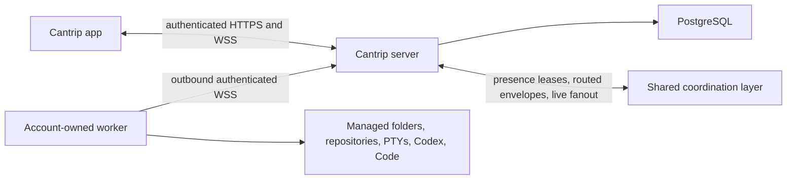

# Hosted relay security architecture

- Status: protected authentication, owner enforcement, worker enrollment,
  secret encryption, account/worker quotas, HTTP/proxy hardening, operational
  probes/metrics, owner-scoped security audit visibility, Redis-backed
  multi-instance relay routing, and database-fenced scheduler claims implemented
- Route inventory: [`security/server-route-inventory.json`](security/server-route-inventory.json)
- Regenerate: `pnpm audit:server-boundaries:write`
- Verify: `pnpm audit:server-boundaries`

## 1. Security objective

A hosted Cantrip server is a remote-code-execution control plane. An
application principal can route prompts, shell input, project-file and Git
operations, editor traffic, browser input, and desktop input to an enrolled
worker. Authentication and ownership are therefore execution boundaries, not
presentation concerns.

The server is the only rendezvous point:

The app never receives a worker origin. The server never dereferences a worker
filesystem path. A worker never treats a model-provider credential as a Cantrip
enrollment credential.

### 1.1 Worker-owned managed MCP

The managed `cantrip` MCP process runs beside Codex on the account-owned worker,
not on Cantrip Server or in the app. Codex communicates with it only over
process-local STDIO. The MCP host reads an expiring connection document from a
worker-private directory and authenticates to a random loopback-only broker.
On POSIX hosts the directory is mode `0700` and the regular, non-symlink
document is mode `0600`; the host rejects unsafe permissions, ownership,
symlinks, non-loopback endpoints, malformed data, and expired bindings.

The binding fixes owner, project, chat, execution lane, worker, worktree,
permission profile, and allowed operations. The broker rechecks its random
credential, expiry, allowlist, payload limits, and concurrency limits. When an
operation reaches `/api/internal/agent-operations`, the server derives owner and
worker from the enrolled worker credential, loads the current chat lane, and
independently rejects mismatched, stale, expired, or unauthorized bindings.
Cross-worker surface operations use the existing server relay; workers never
exchange addresses or credentials directly.

The four optional client controls travel from the authorized operation through
the server's authenticated application live WebSocket. The server selects only
same-owner, project-active clients that declared the exact capability. Requests
expire within ten seconds, are acknowledged, and are neither persisted nor
placed in the replay ring. They cannot create durable surfaces or answer an
interaction. See [`MCP.md`](MCP.md) for the full catalog and lifecycle.

## 2. Authentication modes

`CANTRIP_AUTH_MODE` has three deliberately separate meanings:

| Mode       | Principal                     | Intended deployment                       | Behavior                                                                |
| ---------- | ----------------------------- | ----------------------------------------- | ----------------------------------------------------------------------- |
| `none`     | Stable anonymous owner        | Loopback development and embedded desktop | Every request receives the anonymous local principal.                   |
| `password` | Authenticated owner session   | Protected personal server                 | Argon2id credential creates a revocable server-side owner session.      |
| `accounts` | Authenticated account session | Public multi-user service                 | Email/password credentials create isolated, revocable account sessions. |

Account registration is license-gated by default. `CANTRIP_ADMIN_EMAIL`
identifies the bootstrap administrator, and the server-owned whitelist records
which additional normalized email addresses may register. Whitelist management
requires an authenticated owner or administrator and all mutations retain the
normal CSRF, origin, rate-limit, and audit protections. Operators may explicitly
set `CANTRIP_LICENSE_WHITELIST_ENABLED=false` to allow open registration.

`CANTRIP_ALLOW_INSECURE_REMOTE` applies only to a non-hosted anonymous server
and remains an acknowledgement for a separately protected trusted network. It
is not authentication and can never enable anonymous hosted mode.

Hosted configuration requires password or account authentication, PostgreSQL,
explicit approved application origins, distinct HTTPS public API and Code
surface origins, a provider-secret encryption keyring, and a bounded trusted
proxy list containing only IP addresses, CIDRs, or named private ranges. The
server passes that list to Fastify rather than trusting all proxies. Requests
reject unconfigured, malformed, oversized, or ambiguous forwarding headers,
require the configured HTTPS scheme and public host, and reject unapproved
browser origins before application handlers run.

Every API response carries a server-generated request ID, no-store policy,
strict content/type/frame/referrer/permissions headers, and HSTS in hosted mode.
JSON, binary upload, and WebSocket payload ceilings are independently bounded
and configurable. The global request timeout remains disabled so legitimate
agent and worker operations are not terminated by an arbitrary short deadline;
individual bounded control operations retain their own explicit timeouts.

The bootstrap contract now distinguishes `authenticated` from
`authentication-required`, permits no current user before sign-in, and reports
registration separately. Capability flags remain false until their full
behavior is implemented. Clients must not infer authentication from deployment
mode, hostname, or whether a server happens to return account-shaped data.

## 3. Request principal

`cantrip_server/src/auth/principal.ts` owns the request-scoped identity:

- `anonymous`: the loopback local owner, with no session credential;
- `account`: a password or account session resolved from a hashed server-side
  session token; or
- `unauthenticated`: no authorized owner and therefore no access to protected
  resources.

An authenticated principal carries the user summary, role, authentication
method, and optional session ID. Repository owner IDs must originate from this
principal. URL parameters, request bodies, project metadata, worker messages,
and live-event scopes must never select an owner.

The local server installs its anonymous principal through the same Fastify
request hook used by protected modes. Bootstrap, worker listing, health worker
counts, and the application live WebSocket consume the request principal. The
generated audit records direct `LOCAL_USER_ID` application routes as migration
debt and currently reports zero. Remaining uses of the local owner are limited
to anonymous bootstrap/default-state lifecycle paths and explicit local
fallbacks outside request-owned account operations.

## 3.1 Credential and session controls

- Passwords are encoded with Argon2id (64 MiB, three passes, one lane). The
  server never accepts a plaintext password through configuration.
- Browser sessions use 256-bit random opaque cookies. Only SHA-256 token hashes
  are stored in PostgreSQL/PGlite.
- Each session has an independent CSRF secret, expiry, last-seen metadata, and
  explicit revocation state. Sign-out can revoke one or all user sessions.
- Hosted cookies use the `__Host-` prefix, `HttpOnly`, `Secure`, `Path=/`, and a
  configurable SameSite policy. `SameSite=None` is rejected unless Secure is
  enabled.
- Cookie-authenticated mutations require the matching CSRF header. Login and
  registration additionally reject unapproved browser origins.
- Authentication attempts are rate limited by operation, client address, and
  normalized identity. Missing and incorrect accounts return the same error.
- Request logging redacts cookies, authorization, CSRF/bootstrap tokens,
  passwords, and response cookies.
- Public registration is independently configurable. With it disabled, the
  first owner requires a 32+ character bootstrap token; later registration is
  denied.

## 4. Complete boundary inventory

`scripts/audit-server-boundaries.mjs` parses the authoritative server and
protocol sources. The checked-in JSON records every Fastify route, including
the finite dynamically registered surface actions, every worker command type,
every application live resource, and every public asynchronous repository
entry point. CI-visible verification fails when a route is added or moved
without refreshing the inventory.

At this revision the inventory contains:

- 406 HTTP and 5 WebSocket routes;
- 207 worker command variants;
- 35 application live resource variants;
- 354 database repository entry points; and
- the five non-route data planes listed below.

The same audit enforces the Task E2EE trust boundary. Production server source
cannot import `@cantrip/crypto`, Task decryption helpers, or trusted client and
worker Task adapters; Task routes must expose an audited opaque or
plaintext-rejection contract; and repositories must keep plaintext ordinary
messages, queued prompts, and project automations out of Task-experience
chats. The generated `taskE2eeBoundary` record makes these checks reviewable.

The inventory's `ownerEvidence` field is not an authorization guarantee. It is
a review ledger:

- `request-principal` means the route directly consumes its request identity;
- `explicit-owner` means a repository method requires an owner argument;
- `worker-scoped` means the caller must first bind the worker credential to its
  owner;
- `legacy-local-owner` is a blocker for hosted application routes;
- `worker-credential` identifies the independently authenticated machine
  boundary used by internal worker routes; and
- `delegated-or-missing-review` must be proven through its caller or changed to
  take an explicit owner.

The checked-in inventory drives legacy application routes to zero. Delegated
repository methods remain an explicit review ledger and are covered through
their authenticated caller or lifecycle-only contract.

## 5. HTTP and WebSocket boundaries

### Public bootstrap

Only service identification, authentication bootstrap, and the bounded
registration/login/session endpoints are public. Bootstrap
may disclose protocol/deployment/authentication capabilities, but no projects,
workers, provider configuration, account profile, or connection counts before
authentication. Health/readiness data must remain operational and aggregate;
it must not become an account-data side channel.

### Application API and live stream

All other application routes require an authenticated request principal. The
same principal is captured when `/api/live` upgrades and remains fixed for that
socket. Every requested live scope is authorized against the captured owner.
Session revocation must close its live sockets rather than allowing a stale
connection to retain access.

CORS and WebSocket Origin validation are browser defenses. Neither replaces a
principal. Native clients and raw HTTP clients are not constrained by CORS.

### Worker control

The seven `/api/internal/*` routes are a distinct machine-credential boundary:

- worker heartbeat;
- worker command WebSocket attachment;
- one-time worker enrollment;
- automation schedule synchronization;
- automation dispatch reporting; and
- agent worktree tool results; and
- short-lived provider-account access-token leases.

Hosted and standalone workers authenticate with a unique credential bound to
one owner and immutable worker ID. The server stores only its SHA-256 hash,
checks a route-specific scope, updates last-use time, and rejects a credential
presented for any other worker ID. Rotation or revocation closes the active
worker socket immediately. The shared worker token remains accepted only for
anonymous loopback `pnpm-dev` and embedded Tauri bootstraps. An authenticated
worker event may mutate only resources already leased or assigned to that same
owner and worker.

## 6. Non-route data planes

| Plane                 | Current binding                                                              | Required revocation boundary                       |
| --------------------- | ---------------------------------------------------------------------------- | -------------------------------------------------- |
| Application live hub  | Request owner plus authorized project/chat/run scope                         | Account session                                    |
| Worker bridge         | Owner, worker ID, scope, and individual credential                           | Individual worker credential                       |
| Cantrip Code tunnel   | Random capability token bound to owner, worker, Code tab, and editor session | Attachment, app session, worker, or editor session |
| Project share tunnel  | Random capability token bound to owner, project, worker, and root            | Attachment, app session, worker, or project        |
| Browser/desktop relay | Surface execution context, attachment, and worker                            | Attachment, app session, surface, or worker        |

Code and project-share capabilities live on the isolated surface origin. The
surface origin receives neither application cookies nor arbitrary proxy
destinations. Tokens are short-lived bearer capabilities and must never be
logged, persisted in browser storage, or accepted for a different binding.

### Managed-folder authority

Managed-folder creation, setup retry, removal, and GitHub conversion are normal
application-principal routes in the generated inventory. The server derives the
owner from the authenticated request, verifies workspace membership and the
selected worker's owner/capability, and sends only the project UUID and bounded
intent through the authenticated worker channel. Clients never provide a
physical path.

The worker derives `<worker-data>/folders/<project-UUID>`, rejects malformed
identifiers, symlinks, and paths outside the canonical root, and deletes only
that exact UUID directory. The source remains pinned to that worker for all
filesystem-backed surfaces; stale or malicious cross-worker targets fail before
dispatch. Git, GitHub, worktree, replica, relocation, and Git-event routes also
enforce the persisted project capability, so a local `git init` cannot expand
authority. Conversion enables those capabilities only after the worker binds
and pushes the selected new/empty GitHub repository and the server atomically
commits the reconciled source identity.

## 7. Database ownership

Account-owned tables use an `owner_id` foreign key. Child resources must be
loaded through a query that joins or filters their owner instead of loading by
globally supplied ID and checking later. System state and lifecycle recovery
are the only intentionally global query families.

Migrations `0047_next_madripoor`, `0049_flippant_meggan`, and
`0051_sharp_newton_destine` establish the
protected-mode foundation:

- user role, status, normalized email, and password-change metadata;
- hashed, expiring, revocable user sessions;
- hashed, expiring, single-use worker enrollment codes; and
- independently hashed, scoped, rotatable, revocable worker credentials.

The worker-management migration also separates the runtime-reported machine
name from the owner's durable display alias and records non-destructive unlink
state. Unlinking revokes credentials and disconnects the socket but does not
cascade-delete project sources, worktrees, chats, or other server history.

The CSRF upgrade revokes any session created by an older server revision rather
than manufacturing a usable CSRF credential for it.

The migration stores no raw session token, enrollment code, or worker secret.
The enrollment service consumes link codes transactionally and returns a raw
credential exactly once; list APIs expose metadata but never hashes or raw
secrets.

Provider API keys and MCP static-header/environment values use versioned
AES-256-GCM envelopes authenticated to their owner, record, and field IDs.
`CANTRIP_SECRET_ENCRYPTION_KEYS` supplies a bounded JSON
keyring of key IDs to canonical base64 32-byte keys, and
`CANTRIP_ACTIVE_SECRET_ENCRYPTION_KEY_ID` selects the writer. Hosted startup
fails without the keyring. Startup decrypts every existing envelope to detect a
missing or incorrect key before accepting traffic, migrates legacy plaintext
rows, clears their plaintext column, and rewraps envelopes written by older
keys. Anonymous local deployments instead persist an ignored mode-0600 key in
their server data directory.

Provider list and mutation responses expose only `hasApiKey`. MCP list and
mutation responses expose secret key names with a fixed mask, and sending that
mask back preserves the stored value. The server decrypts MCP values only for
the effective runtime configuration routed to an authorized worker. Plaintext
exists briefly in server memory when an authorized provider or MCP runtime is
dispatched to its assigned worker. Operators must back up the keyring separately from PostgreSQL,
retain old keys until startup has completed a rotation, and never place the
keyring in source control, logs, or support bundles.

### 7.1 Portable provider OAuth accounts

ChatGPT and Grok/SuperGrok credentials use the same vault but a distinct
authenticated context:

`cantrip:model-provider-account:<kind>:<ownerId>:<providerId>:<accountId>`

That context prevents an envelope copied between owners, providers, accounts,
or provider kinds from decrypting. Migrations `0080_flimsy_captain_flint` and
`0081_bizarre_skaar` add the encrypted envelope, monotonic credential revision,
identity subject, lifecycle state, expiry, and cross-process refresh lease.
Migration `0086_slow_jack_murdock` moves quota and catalog availability to a
stable provider-account scope.

The provider access route authenticates the worker's individual credential and
derives its immutable owner and worker ID from that credential. The repository
loads the provider and account through the derived owner; request path IDs can
never select another owner's credential. A valid response contains only the
current access token, its revision and expiry, and the minimum provider identity
metadata required by the runtime. It never contains a refresh token, ID token,
or credential envelope. The worker caches the lease in memory for at most five
minutes and never beyond the upstream token expiry.

Refreshes are single-flight inside one server process and fenced across server
replicas by the database refresh lease and expected credential revision. The
complete replacement credential, including a rotated refresh token, is
encrypted before the revision advances. A stale caller observes the newer
revision instead of refreshing again. Permanent invalid-grant failures become
`reauth-required`; an upstream identity change becomes `conflict`. Global
sign-out first denies leases and aborts in-flight refreshes, atomically removes
the durable credential, attempts bounded upstream revocation, invalidates the
catalog, and tells every connected worker to close the affected runtime and
discard any legacy file.

The server is therefore a trusted credential broker. A database dump without
the operator keyring does not reveal these credentials. The worker revalidates
and discards its cached lease after at most five minutes, but an exfiltrated
OAuth bearer token remains usable until its upstream expiry or revocation. A
compromised live server process or active keyring can use every provider account
it owns. Operators must protect the server and keyring accordingly, revoke
provider accounts after a control-plane compromise, and never copy lease
responses, OAuth capture payloads, or envelopes into logs, events, diagnostics,
support bundles, or browser state. The full data flow, migration rules, test
evidence, and manual verification procedure live in
[`PROVIDER_AUTHENTICATION.md`](PROVIDER_AUTHENTICATION.md).

The append-only `audit_events` ledger records authentication decisions, session
revocation, worker enrollment outcomes, project access, Git requests, and
provider/MCP/worker/project configuration mutations. Events carry the actor and
owner IDs, resource identity, result, request correlation ID, and hashes of the
client address and user agent. Metadata is deliberately bounded and allowlisted
by call sites; request bodies, credentials, email addresses, prompts, terminal
content, and source content are never copied into the ledger. Accounts can list
only their own events through `/api/account/audit-events`; owner/admin roles can
inspect the global stream through `/api/admin/audit-events`. Both APIs use
descending cursor pagination. `/api/account/sessions` similarly exposes active
session metadata without any stored token, CSRF, address, or user-agent hash.

Public API, worker-pairing, attachment-upload, and WebSocket-handshake traffic
use independent bounded sliding windows. Active uploads and application/tunnel
WebSockets are capped per account. Attachment bytes, Remote Surface sessions,
and relayed Code, browser, desktop, terminal, project-share, and generic tunnel
bytes are charged against both the account and worker. Every command routed to
a worker is bounded by per-worker and per-account byte, rate, and concurrency
ceilings; reaching a ceiling fails visibly instead of accumulating an unbounded
queue. These guards do not impose a short execution timeout, so an admitted
Codex turn or attached terminal may remain active for its normal lifetime.
Those two event streams are the only application routes that intentionally use
the streaming worker-command policy. Finite Git and GitHub control operations
have an explicit 30-minute deadline; all other finite worker requests retain a
bounded command deadline as well. Binary transports retain their schema payload
ceilings and buffered-byte backpressure rules. Each process enforces a
conservative partition of the configured global limits.
`CANTRIP_COORDINATION_MAX_INSTANCES` is the hard deployment ceiling and Redis
readiness fails when more live server leases exist. This preserves the global
bound without putting synchronous media frames behind a Redis round trip. It
can under-use capacity when fewer replicas are running, which is an intentional
availability-versus-abuse-resistance tradeoff.

`/healthz` proves only that the server process can answer HTTP. `/readyz` probes
the authoritative database and returns 503 while it is unavailable. `/metrics`
exposes aggregate Prometheus text to an owner/admin session or a dedicated
operator bearer token. Metrics include request counts and latency, database
probe health, worker and command activity, live connections, tunnel and relay
traffic, quota rejections, and scheduler throughput/lag. They deliberately omit
owner IDs, resource IDs, URLs, prompts, terminal output, filenames, and secrets.

## 8. Application connection audit

All renderer connections derive from the selected server profile:

- `cantrip_app/src/lib/server-connections.ts` tests bootstrap and switches the
  active server origin;
- `cantrip_app/src/lib/api-client.ts` performs credentialed application HTTP;
- `cantrip_app/src/lib/app-live-client.ts` owns the resumable application WSS;
- `cantrip_app/src/components/terminal/terminal-view.tsx` attaches terminal
  WebSockets through the server;
- `cantrip_app/src/lib/use-remote-surface-transport.ts` carries browser and
  desktop streams through the server; and
- Code and project-share attachment URLs are server-minted isolated-origin
  capabilities.

Switching server profiles must discard server/account-scoped caches and live
connections. Passwords and raw session credentials must never be placed in a
server profile or `localStorage`.

## 9. Invariants for subsequent milestones

1. Local `none` mode stays zero-auth and loopback-only by default.
2. Protected modes do not start until their route and transport boundaries are
   enforced.
3. Every application-owned database operation derives `ownerId` from the
   request principal or a durable server-owned lease created by that principal.
4. Every worker operation derives owner and worker identity from its individual
   credential, not its payload.
5. Cross-worker handoff requires an explicit compatible project source; equal
   project IDs never imply equal files.
6. Revoking an app session, worker credential, or capability terminates its
   active sockets and attachments.
7. Logs and metrics contain correlation IDs, never credentials, prompts,
   terminal contents, or source contents by default.
8. Multi-instance routing moves only bounded, expiring envelopes carrying
   correlation IDs. The receiving instance revalidates worker ownership and
   protocol payloads before reaching a local worker socket.

## 10. Shared relay coordination

`REDIS_URL` enables the production coordination path. Every process receives a
unique instance ID (or an operator-provided stable ID), writes a TTL-backed
instance lease, and claims each locally connected worker with a connection-ID
fenced presence lease. The newest Redis claim wins. An older connection closes
when it receives the replacement notice or when its compare-and-refresh fails;
stale owners disappear automatically after the configured presence TTL.

Commands sent to a worker owned by another process use an instance-targeted,
expiring envelope. Request, event, response, notification, disconnect, and
binary frame messages are schema-checked or protocol-checked at receipt.
Pending and incoming command counts plus asynchronous publication counts are
bounded. Worker/account identity is derived from PostgreSQL and the presence
lease rather than trusted from a client payload. Code, Remote Surface, project
share, and generic tunnel frames use the same bridge, so sticky routing improves
bandwidth locality but is not required for correctness.

Application live invalidations are broadcast to every server and filtered by
the destination hub's authenticated owner and authorized subscriptions.
Per-instance epochs and authoritative HTTP snapshots remain the reconnect
contract; Redis pub/sub is an invalidation transport, not durable history.
PostgreSQL remains authoritative for conversations and configuration.

## 11. Scheduler fencing

Scheduled workflow triggers and chat-targeted project automations claim each
calendar occurrence in PostgreSQL before dispatch. Claims persist the scheduled
time, target ownership, serving instance, opaque lease token, expiration, and a
monotonically increasing fencing token. An unexpired claim makes other replicas
stand down. After `CANTRIP_SCHEDULER_LEASE_TTL_MS`, another replica may recover
the same durable occurrence with a higher fence; the former holder can no longer
accept, fail, or otherwise finalize it.

Workflow deliveries and workflow runs retain stable idempotency keys across
recovery. Project automation recovery checks both queued prompts and persisted
chat messages before dispatch, so a crash after durable acceptance does not add
the prompt twice. A moved chat/source fails closed because the claim records and
revalidates the worker selected from the chat's active worktree. Offline or
paused targets remain visible as failed/paused schedule decisions and are never
silently sent to another worker.
