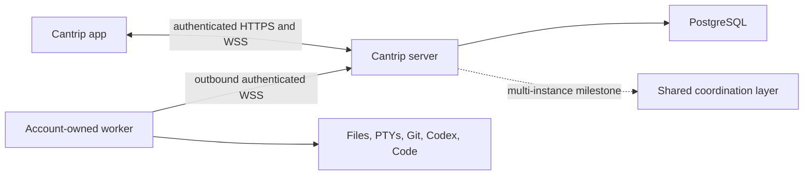

# Hosted relay security architecture

- Status: protected authentication, owner enforcement, worker enrollment,
  provider-secret encryption, and initial HTTP/proxy hardening implemented;
  comprehensive quotas, audit visibility, and multi-instance control remain
- Route inventory: [`security/server-route-inventory.json`](security/server-route-inventory.json)
- Regenerate: `pnpm audit:server-boundaries:write`
- Verify: `pnpm audit:server-boundaries`

## 1. Security objective

A hosted Cantrip server is a remote-code-execution control plane. An
application principal can route prompts, shell input, Git operations, editor
traffic, browser input, and desktop input to an enrolled worker. Authentication
and ownership are therefore execution boundaries, not presentation concerns.

The server is the only rendezvous point:

The app never receives a worker origin. The server never dereferences a worker
filesystem path. A worker never treats a model-provider credential as a Cantrip
enrollment credential.

## 2. Authentication modes

`CANTRIP_AUTH_MODE` has three deliberately separate meanings:

| Mode       | Principal                     | Intended deployment                       | Behavior                                                                |
| ---------- | ----------------------------- | ----------------------------------------- | ----------------------------------------------------------------------- |
| `none`     | Stable anonymous owner        | Loopback development and embedded desktop | Every request receives the anonymous local principal.                   |
| `password` | Authenticated owner session   | Protected personal server                 | Argon2id credential creates a revocable server-side owner session.      |
| `accounts` | Authenticated account session | Public multi-user service                 | Email/password credentials create isolated, revocable account sessions. |

`CANTRIP_ALLOW_INSECURE_REMOTE` applies only to a non-hosted anonymous server
and remains an acknowledgement for a separately protected trusted network. It
is not authentication and can never enable anonymous hosted mode.

Hosted configuration requires password or account authentication, PostgreSQL,
explicit approved application origins, distinct HTTPS public API and Code
surface origins, a provider-secret encryption keyring, and a bounded trusted
proxy list containing only IP addresses, CIDRs, or named private ranges. The
server passes that list to Fastify rather than trusting all proxies. Requests
reject unconfigured, malformed, oversized, or ambiguous forwarding headers,
require the configured HTTPS scheme and public host, and reject unapproved
browser origins before application handlers run.

Every API response carries a server-generated request ID, no-store policy,
strict content/type/frame/referrer/permissions headers, and HSTS in hosted mode.
JSON, binary upload, and WebSocket payload ceilings are independently bounded
and configurable. The global request timeout remains disabled so legitimate
agent and worker operations are not terminated by an arbitrary short deadline;
individual bounded control operations retain their own explicit timeouts.

The bootstrap contract now distinguishes `authenticated` from
`authentication-required`, permits no current user before sign-in, and reports
registration separately. Capability flags remain false until their full
behavior is implemented. Clients must not infer authentication from deployment
mode, hostname, or whether a server happens to return account-shaped data.

## 3. Request principal

`cantrip_server/src/auth/principal.ts` owns the request-scoped identity:

- `anonymous`: the loopback local owner, with no session credential;
- `account`: a password or account session resolved from a hashed server-side
  session token; or
- `unauthenticated`: no authorized owner and therefore no access to protected
  resources.

An authenticated principal carries the user summary, role, authentication
method, and optional session ID. Repository owner IDs must originate from this
principal. URL parameters, request bodies, project metadata, worker messages,
and live-event scopes must never select an owner.

The local server installs its anonymous principal through the same Fastify
request hook used by protected modes. Bootstrap, worker listing, health worker
counts, and the application live WebSocket consume the request principal. The
generated audit intentionally records remaining direct
`LOCAL_USER_ID` routes as migration debt for the ownership-enforcement
milestone; account mode must not be treated as production-ready while that debt
exists.

## 3.1 Credential and session controls

- Passwords are encoded with Argon2id (64 MiB, three passes, one lane). The
  server never accepts a plaintext password through configuration.
- Browser sessions use 256-bit random opaque cookies. Only SHA-256 token hashes
  are stored in PostgreSQL/PGlite.
- Each session has an independent CSRF secret, expiry, last-seen metadata, and
  explicit revocation state. Sign-out can revoke one or all user sessions.
- Hosted cookies use the `__Host-` prefix, `HttpOnly`, `Secure`, `Path=/`, and a
  configurable SameSite policy. `SameSite=None` is rejected unless Secure is
  enabled.
- Cookie-authenticated mutations require the matching CSRF header. Login and
  registration additionally reject unapproved browser origins.
- Authentication attempts are rate limited by operation, client address, and
  normalized identity. Missing and incorrect accounts return the same error.
- Request logging redacts cookies, authorization, CSRF/bootstrap tokens,
  passwords, and response cookies.
- Public registration is independently configurable. With it disabled, the
  first owner requires a 32+ character bootstrap token; later registration is
  denied.

## 4. Complete boundary inventory

`scripts/audit-server-boundaries.mjs` parses the authoritative server and
protocol sources. The checked-in JSON records every Fastify route, including
the finite dynamically registered surface actions, every worker command type,
every application live resource, and every public asynchronous repository
entry point. CI-visible verification fails when a route is added or moved
without refreshing the inventory.

At this foundation revision the inventory contains:

- 266 HTTP/WebSocket routes: 2 public bootstrap routes, 3 public authentication
  routes, 255 application-principal routes, 1 external webhook route, and 5
  worker-control routes;
- 162 worker command variants;
- 27 application live resource variants;
- 227 database repository entry points; and
- the five non-route data planes listed below.

The inventory's `ownerEvidence` field is not an authorization guarantee. It is
a review ledger:

- `request-principal` means the route directly consumes its request identity;
- `explicit-owner` means a repository method requires an owner argument;
- `worker-scoped` means the caller must first bind the worker credential to its
  owner;
- `legacy-local-owner` and `legacy-worker-token` are known blockers for hosted
  modes; and
- `delegated-or-missing-review` must be proven through its caller or changed to
  take an explicit owner.

The ownership milestone must drive legacy application routes to zero and
review every delegated repository method before protected modes are enabled.

## 5. HTTP and WebSocket boundaries

### Public bootstrap

Only service identification, authentication bootstrap, and the bounded
registration/login/session endpoints are public. Bootstrap
may disclose protocol/deployment/authentication capabilities, but no projects,
workers, provider configuration, account profile, or connection counts before
authentication. Health/readiness data must remain operational and aggregate;
it must not become an account-data side channel.

### Application API and live stream

All other application routes require an authenticated request principal. The
same principal is captured when `/api/live` upgrades and remains fixed for that
socket. Every requested live scope is authorized against the captured owner.
Session revocation must close its live sockets rather than allowing a stale
connection to retain access.

CORS and WebSocket Origin validation are browser defenses. Neither replaces a
principal. Native clients and raw HTTP clients are not constrained by CORS.

### Worker control

The five `/api/internal/*` routes are a distinct machine-credential boundary:

- worker heartbeat;
- worker command WebSocket attachment;
- automation schedule synchronization;
- automation dispatch reporting; and
- agent worktree tool results.

Hosted and standalone workers authenticate with a unique credential bound to
one owner and immutable worker ID. The server stores only its SHA-256 hash,
checks a route-specific scope, updates last-use time, and rejects a credential
presented for any other worker ID. Rotation or revocation closes the active
worker socket immediately. The shared worker token remains accepted only for
anonymous loopback `pnpm-dev` and embedded Tauri bootstraps. An authenticated
worker event may mutate only resources already leased or assigned to that same
owner and worker.

## 6. Non-route data planes

| Plane                 | Current binding                                                              | Required revocation boundary                       |
| --------------------- | ---------------------------------------------------------------------------- | -------------------------------------------------- |
| Application live hub  | Request owner plus authorized project/chat/run scope                         | Account session                                    |
| Worker bridge         | Owner, worker ID, scope, and individual credential                           | Individual worker credential                       |
| Cantrip Code tunnel   | Random capability token bound to owner, worker, Code tab, and editor session | Attachment, app session, worker, or editor session |
| Project share tunnel  | Random capability token bound to owner, project, worker, and root            | Attachment, app session, worker, or project        |
| Browser/desktop relay | Surface execution context, attachment, and worker                            | Attachment, app session, surface, or worker        |

Code and project-share capabilities live on the isolated surface origin. The
surface origin receives neither application cookies nor arbitrary proxy
destinations. Tokens are short-lived bearer capabilities and must never be
logged, persisted in browser storage, or accepted for a different binding.

## 7. Database ownership

Account-owned tables use an `owner_id` foreign key. Child resources must be
loaded through a query that joins or filters their owner instead of loading by
globally supplied ID and checking later. System state and lifecycle recovery
are the only intentionally global query families.

Migrations `0047_next_madripoor`, `0049_flippant_meggan`, and
`0051_sharp_newton_destine` establish the
protected-mode foundation:

- user role, status, normalized email, and password-change metadata;
- hashed, expiring, revocable user sessions;
- hashed, expiring, single-use worker enrollment codes; and
- independently hashed, scoped, rotatable, revocable worker credentials.

The worker-management migration also separates the runtime-reported machine
name from the owner's durable display alias and records non-destructive unlink
state. Unlinking revokes credentials and disconnects the socket but does not
cascade-delete project sources, worktrees, chats, or other server history.

The CSRF upgrade revokes any session created by an older server revision rather
than manufacturing a usable CSRF credential for it.

The migration stores no raw session token, enrollment code, or worker secret.
The enrollment service consumes link codes transactionally and returns a raw
credential exactly once; list APIs expose metadata but never hashes or raw
secrets.

Provider API keys use versioned AES-256-GCM envelopes authenticated to their
owner and provider IDs. `CANTRIP_SECRET_ENCRYPTION_KEYS` supplies a bounded JSON
keyring of key IDs to canonical base64 32-byte keys, and
`CANTRIP_ACTIVE_SECRET_ENCRYPTION_KEY_ID` selects the writer. Hosted startup
fails without the keyring. Startup decrypts every existing envelope to detect a
missing or incorrect key before accepting traffic, migrates legacy plaintext
rows, clears their plaintext column, and rewraps envelopes written by older
keys. Anonymous local deployments instead persist an ignored mode-0600 key in
their server data directory.

Provider list and mutation responses expose only `hasApiKey`; plaintext exists
briefly in server memory when an authorized model route is dispatched to its
assigned worker. Operators must back up the keyring separately from PostgreSQL,
retain old keys until startup has completed a rotation, and never place the
keyring in source control, logs, or support bundles. Audit events remain a later
hardening milestone.

## 8. Application connection audit

All renderer connections derive from the selected server profile:

- `cantrip_app/src/lib/server-connections.ts` tests bootstrap and switches the
  active server origin;
- `cantrip_app/src/lib/api-client.ts` performs credentialed application HTTP;
- `cantrip_app/src/lib/app-live-client.ts` owns the resumable application WSS;
- `cantrip_app/src/components/terminal/terminal-view.tsx` attaches terminal
  WebSockets through the server;
- `cantrip_app/src/lib/use-remote-surface-transport.ts` carries browser and
  desktop streams through the server; and
- Code and project-share attachment URLs are server-minted isolated-origin
  capabilities.

Switching server profiles must discard server/account-scoped caches and live
connections. Passwords and raw session credentials must never be placed in a
server profile or `localStorage`.

## 9. Invariants for subsequent milestones

1. Local `none` mode stays zero-auth and loopback-only by default.
2. Protected modes do not start until their route and transport boundaries are
   enforced.
3. Every application-owned database operation derives `ownerId` from the
   request principal or a durable server-owned lease created by that principal.
4. Every worker operation derives owner and worker identity from its individual
   credential, not its payload.
5. Cross-worker handoff requires an explicit compatible project source; equal
   project IDs never imply equal files.
6. Revoking an app session, worker credential, or capability terminates its
   active sockets and attachments.
7. Logs and metrics contain correlation IDs, never credentials, prompts,
   terminal contents, or source contents by default.
8. Multi-instance routing may move envelopes between servers, but may not
   weaken the same principal, owner, worker, and capability checks.
