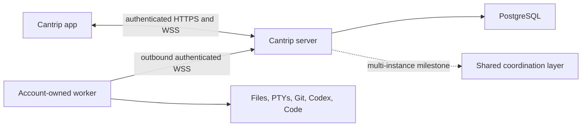

# Hosted relay security architecture

- Status: tenancy foundation implemented; protected authentication and complete
  owner enforcement are subsequent hosted-relay milestones
- Route inventory: [`security/server-route-inventory.json`](security/server-route-inventory.json)
- Regenerate: `pnpm audit:server-boundaries:write`
- Verify: `pnpm audit:server-boundaries`

## 1. Security objective

A hosted Cantrip server is a remote-code-execution control plane. An
application principal can route prompts, shell input, Git operations, editor
traffic, browser input, and desktop input to an enrolled worker. Authentication
and ownership are therefore execution boundaries, not presentation concerns.

The server is the only rendezvous point:

The app never receives a worker origin. The server never dereferences a worker
filesystem path. A worker never treats a model-provider credential as a Cantrip
enrollment credential.

## 2. Authentication modes

`CANTRIP_AUTH_MODE` has three deliberately separate meanings:

| Mode       | Principal                     | Intended deployment                       | Foundation behavior                                                       |
| ---------- | ----------------------------- | ----------------------------------------- | ------------------------------------------------------------------------- |
| `none`     | Stable anonymous owner        | Loopback development and embedded desktop | Implemented. Every request receives the anonymous local principal.        |
| `password` | Authenticated owner session   | Protected personal server                 | Defined but startup fails closed until password sessions are implemented. |
| `accounts` | Authenticated account session | Public multi-user service                 | Defined but startup fails closed until account sessions are implemented.  |

Recognizing an enum value is not evidence that its security boundary exists.
Until the corresponding milestone is merged, `readServerConfig` rejects
`password` and `accounts`. `CANTRIP_ALLOW_INSECURE_REMOTE` is an acknowledgement
for a trusted network or authenticating proxy; it is not authentication.

The bootstrap contract now distinguishes `authenticated` from
`authentication-required`, permits no current user before sign-in, and reports
registration separately. Capability flags remain false until their full
behavior is implemented. Clients must not infer authentication from deployment
mode, hostname, or whether a server happens to return account-shaped data.

## 3. Request principal

`cantrip_server/src/auth/principal.ts` owns the request-scoped identity:

- `anonymous`: the loopback local owner, with no session credential;
- `account`: a password or account session, added by the authentication
  milestone; or
- `unauthenticated`: no authorized owner and therefore no access to protected
  resources.

An authenticated principal carries the user summary, role, authentication
method, and optional session ID. Repository owner IDs must originate from this
principal. URL parameters, request bodies, project metadata, worker messages,
and live-event scopes must never select an owner.

The local server installs its anonymous principal through the same Fastify
request hook that protected modes will use. Bootstrap, worker listing, health
worker counts, and the application live WebSocket already consume the request
principal. The generated audit intentionally records remaining direct
`LOCAL_USER_ID` routes as migration debt for the ownership-enforcement
milestone; protected modes remain disabled while that debt exists.

## 4. Complete boundary inventory

`scripts/audit-server-boundaries.mjs` parses the authoritative server and
protocol sources. The checked-in JSON records every Fastify route, including
the finite dynamically registered surface actions, every worker command type,
every application live resource, and every public asynchronous repository
entry point. CI-visible verification fails when a route is added or moved
without refreshing the inventory.

At this foundation revision the inventory contains:

- 259 HTTP/WebSocket routes: 2 public bootstrap routes, 252 application
  principal routes, and 5 worker-control routes;
- 160 worker command variants;
- 27 application live resource variants;
- 216 database repository entry points; and
- the five non-route data planes listed below.

The inventory's `ownerEvidence` field is not an authorization guarantee. It is
a review ledger:

- `request-principal` means the route directly consumes its request identity;
- `explicit-owner` means a repository method requires an owner argument;
- `worker-scoped` means the caller must first bind the worker credential to its
  owner;
- `legacy-local-owner` and `legacy-worker-token` are known blockers for hosted
  modes; and
- `delegated-or-missing-review` must be proven through its caller or changed to
  take an explicit owner.

The ownership milestone must drive legacy application routes to zero and
review every delegated repository method before protected modes are enabled.

## 5. HTTP and WebSocket boundaries

### Public bootstrap

Only service identification and authentication bootstrap are public. Bootstrap
may disclose protocol/deployment/authentication capabilities, but no projects,
workers, provider configuration, account profile, or connection counts before
authentication. Health/readiness data must remain operational and aggregate;
it must not become an account-data side channel.

### Application API and live stream

All other application routes require an authenticated request principal. The
same principal is captured when `/api/live` upgrades and remains fixed for that
socket. Every requested live scope is authorized against the captured owner.
Session revocation must close its live sockets rather than allowing a stale
connection to retain access.

CORS and WebSocket Origin validation are browser defenses. Neither replaces a
principal. Native clients and raw HTTP clients are not constrained by CORS.

### Worker control

The five `/api/internal/*` routes are a distinct machine-credential boundary:

- worker heartbeat;
- worker command WebSocket attachment;
- automation schedule synchronization;
- automation dispatch reporting; and
- agent worktree tool results.

They currently use the development/shared worker token. Hosted mode must replace
that token with a unique hashed credential bound to one owner and immutable
worker ID. An authenticated worker event may mutate only resources already
leased or assigned to that same owner and worker.

## 6. Non-route data planes

| Plane                 | Current binding                                                              | Required revocation boundary                       |
| --------------------- | ---------------------------------------------------------------------------- | -------------------------------------------------- |
| Application live hub  | Request owner plus authorized project/chat/run scope                         | Account session                                    |
| Worker bridge         | Connected worker ID and legacy token                                         | Individual worker credential                       |
| Cantrip Code tunnel   | Random capability token bound to owner, worker, Code tab, and editor session | Attachment, app session, worker, or editor session |
| Project share tunnel  | Random capability token bound to owner, project, worker, and root            | Attachment, app session, worker, or project        |
| Browser/desktop relay | Surface execution context, attachment, and worker                            | Attachment, app session, surface, or worker        |

Code and project-share capabilities live on the isolated surface origin. The
surface origin receives neither application cookies nor arbitrary proxy
destinations. Tokens are short-lived bearer capabilities and must never be
logged, persisted in browser storage, or accepted for a different binding.

## 7. Database ownership

Account-owned tables use an `owner_id` foreign key. Child resources must be
loaded through a query that joins or filters their owner instead of loading by
globally supplied ID and checking later. System state and lifecycle recovery
are the only intentionally global query families.

Migration `0047_next_madripoor` establishes the protected-mode foundation:

- user role, status, normalized email, and password-change metadata;
- hashed, expiring, revocable user sessions;
- hashed, expiring, single-use worker enrollment codes; and
- independently hashed, scoped, rotatable, revocable worker credentials.

The migration stores no raw session token, enrollment code, or worker secret.
The tables are intentionally dormant until their authentication/enrollment
services are implemented. Provider-secret encryption and audit events have
their own later hardening milestones.

## 8. Application connection audit

All renderer connections derive from the selected server profile:

- `cantrip_app/src/lib/server-connections.ts` tests bootstrap and switches the
  active server origin;
- `cantrip_app/src/lib/api-client.ts` performs credentialed application HTTP;
- `cantrip_app/src/lib/app-live-client.ts` owns the resumable application WSS;
- `cantrip_app/src/components/terminal/terminal-view.tsx` attaches terminal
  WebSockets through the server;
- `cantrip_app/src/lib/use-remote-surface-transport.ts` carries browser and
  desktop streams through the server; and
- Code and project-share attachment URLs are server-minted isolated-origin
  capabilities.

Switching server profiles must discard server/account-scoped caches and live
connections. Passwords and raw session credentials must never be placed in a
server profile or `localStorage`.

## 9. Invariants for subsequent milestones

1. Local `none` mode stays zero-auth and loopback-only by default.
2. Protected modes do not start until their route and transport boundaries are
   enforced.
3. Every application-owned database operation derives `ownerId` from the
   request principal or a durable server-owned lease created by that principal.
4. Every worker operation derives owner and worker identity from its individual
   credential, not its payload.
5. Cross-worker handoff requires an explicit compatible project source; equal
   project IDs never imply equal files.
6. Revoking an app session, worker credential, or capability terminates its
   active sockets and attachments.
7. Logs and metrics contain correlation IDs, never credentials, prompts,
   terminal contents, or source contents by default.
8. Multi-instance routing may move envelopes between servers, but may not
   weaken the same principal, owner, worker, and capability checks.
