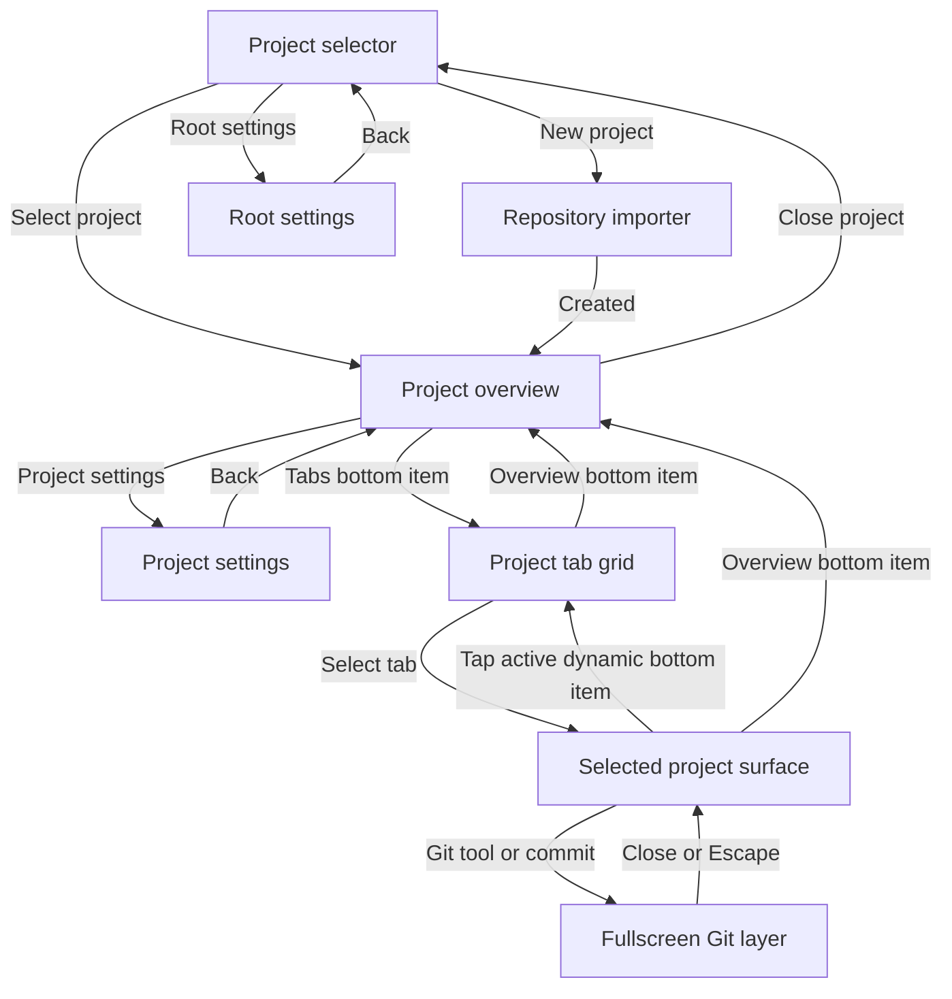

# Mobile project navigation and Git overlay plan

Status: proposed implementation plan. This document does not change runtime
behavior.

## Objective

Replace Cantrip's narrow-screen desktop layout with a mobile-first navigation
model:

- launch into a searchable project selector instead of auto-opening the first
  project;
- enter every selected project on its overview;
- navigate inside a project with exactly two bottom destinations: Overview and
  one dynamic Tabs/surface slot;
- remove project and tab sidebars from the mobile shell; and
- present Git tools and commit details as animated, full-viewport layers.

The implementation remains in `cantrip_app`. Existing server-owned project,
workspace, tab-group, and worktree state stays authoritative.

## Scope decisions

- The mobile shell applies below the existing `md` breakpoint (less than 768
  CSS pixels) when the window is not a desktop pop-out.
- A narrow browser or main Tauri window receives the same responsive behavior
  as Capacitor. Project-group pop-outs remain surface-only windows and do not
  gain the project selector or bottom app bar.
- At `md` and above, the current sidebar, top tab bar, drag-and-drop behavior,
  resizable Git drawer, and automatic first-project selection remain unchanged.
- Closing a project is navigation only. It does not stop runtimes, close tabs,
  delete the project, or change server state.
- Mobile selection stays local to the current app window. No new persistence,
  API, protocol, database, or worker behavior is needed.
- The existing tab-group layout remains authoritative. The mobile tab grid is
  a new presentation of those groups and members, not a second tab model.

## Current state and gaps

| Concern             | Current implementation                                                                              | Gap                                                                                                    |
| ------------------- | --------------------------------------------------------------------------------------------------- | ------------------------------------------------------------------------------------------------------ |
| Project entry       | `App.tsx` selects the first project visible in the active workspace.                                | Mobile cannot remain at a root project selector.                                                       |
| Mobile navigation   | A header button opens a `Projects and chats` dialog containing `ProjectChatList`.                   | This is a desktop sidebar inside a modal rather than mobile information architecture.                  |
| Workspace filtering | `WorkspaceSwitcher` and `projectsInWorkspace` filter the sidebar.                                   | Search cannot currently discover a project outside the active workspace.                               |
| Project overview    | `ProjectOverview` already provides repository status, metrics, surfaces, and create actions.        | It is not the stable mobile home destination and has no project-close/settings header contract.        |
| Project tabs        | `ProjectTabBar` and sidebar groups expose project surfaces.                                         | Both consume narrow horizontal space and duplicate navigation on mobile.                               |
| Git tools           | `GitWorkbenchToolbar` renders every tool as a chip.                                                 | The row overflows on a narrow viewport.                                                                |
| Git details         | `GitHistoryView` owns an inline/absolute drawer with a persisted, resizable width.                  | It does not cover the app titlebar and future bottom app bar, and resizing is inappropriate on mobile. |
| Safe areas          | The app uses `h-svh` but does not opt into `viewport-fit=cover` or define mobile safe-area padding. | Bottom navigation and fullscreen layers can collide with device insets.                                |

## Target navigation flow



## Screen contracts

### 1. Project selector

The selector is the mobile root screen whenever no project is selected. It is
not a dialog and it has no bottom app bar.

Layout, from top to bottom:

1. Cantrip title and worker connectivity status.
2. The existing `WorkspaceSwitcher`, including workspace creation and
   management.
3. An autofocus project search field.
4. A scrollable project list with setup state, repository/source identity, and
   workspace membership.
5. A clear New Project action.
6. A pinned footer containing the existing `ServerSwitcher` and the root
   Settings button. `ServerSwitcher` keeps `side="top"`, so its dropdown opens
   above the footer trigger.

Project filtering has two intentional modes:

- With an empty query, show projects in the active workspace in their existing
  project order.
- With a non-empty query, search every loaded project across every workspace.
  Match project name, GitHub `nameWithOwner`, source display path, and workspace
  name. Show workspace labels on cross-workspace results so the broader scope is
  visible.

Selecting any result sets the active project and enters Overview. It does not
switch the user's active workspace merely because the result came from another
workspace. The selected project can belong to more than one workspace.

Empty, loading, cloning, setup-failed, offline-worker, and no-search-result
states must remain actionable. An empty project collection stays on the
selector with a New Project call to action instead of opening the importer
automatically.

Changing workspaces on this screen changes the empty-query filter but keeps
`selectedProjectId` null. Compact selection validity is checked against the
complete project collection, not `visibleProjects`, so opening a
cross-workspace search result does not get undone by the desktop sidebar
filtering effect.

### 2. Project overview and contextual header

Selecting or creating a project always enters its existing `ProjectOverview`.
Creation may still create the normal initial tab after clone, but it must not
navigate away from Overview on mobile.

The mobile project header contains:

- the project name and concise repository/source context;
- a Project Settings button; and
- a close button that returns to the project selector.

The close action clears window-local project/surface selection and any mobile
tab-grid state. It does not mutate the project or its surfaces. Root Settings,
New Project, and Project Settings are full-content subflows with a mobile back
action to their owning selector or overview. The project bottom bar is hidden
while one of those subflows is active.

On compact layouts, the full surface inventory lives in the dedicated tab
grid. Overview keeps project identity, repository/worktree health, metrics, and
aggregate running/open counts, but it does not render a second complete list of
all surfaces. A compact `Open tabs` action may enter the grid. The existing
desktop overview inventory remains unchanged.

### 3. Two-item bottom app bar

The bottom app bar exists only while a project is open and no fullscreen
subflow or Git layer is covering it. It contains exactly two equal destinations:

1. **Overview**, with the project/overview icon and label.
2. **Tabs/dynamic surface**, whose visual state changes with the second
   destination.

The second destination behaves as follows:

- Before a surface has been selected, it uses a grid icon and the label
  `Tabs`.
- Tapping it opens the project tab grid.
- Selecting a grid item opens that surface and changes the second item to the
  surface's existing `ProjectSurfaceIcon` and title.
- Tapping Overview preserves the last valid surface identity so the dynamic
  item can return directly to it.
- Tapping the already-active dynamic surface item opens the grid again. While
  the grid is visible, the item returns to the grid icon and `Tabs` label.
- If the remembered surface is deleted or no longer appears in the
  authoritative layout, clear it and fall back to the grid.

This interaction keeps the bar at two items while preserving a discoverable
route back to the complete tab list.

The app bar is part of the shell's flex layout rather than an overlay on
content. Terminal fitting, editors, chat composers, browsers, Code, and remote
surfaces therefore receive the remaining viewport height and are not obscured.

### 4. Project tab grid

The grid replaces both `ProjectChatList` and `ProjectTabBar` on mobile. It uses
`ProjectTabLayoutSummary` plus `buildProjectSurfaceIndex` and displays all
resolved project surfaces in server-owned group/member order.

Each touch-sized card contains:

- the shared surface icon and title;
- surface kind;
- relevant runtime/attention state where already available; and
- an overflow action for existing rename, duplicate, and delete operations.

Groups can be visually separated, but selecting a card must call the existing
`selectWorkspaceTab` path so group-local active-member memory remains correct.
The grid exposes the existing create-surface menu. Drag-and-drop reorganization
is not part of the first mobile milestone; mobile respects layout changes made
on desktop and keeps action menus usable with touch.

The desktop top tab bar is not mounted in the compact project shell. This
prevents duplicate navigation and avoids attaching drag sensors to hidden
mobile elements.

### 5. Mobile Git tools and details

The History/Issues/PRs selector and essential sync/refresh actions stay in the
Git header. Below `md`, `GitWorkbenchToolbar` collapses its tool chips into one
ellipsis button backed by the same ordered `gitWorkbenchTools` definitions.
The menu preserves active, attention, and disabled states.

Menu behavior remains consistent with each tool's current destination:

- Operations, Repository, Branches, Stashes, and Compare open the Git detail
  layer.
- File History, Search, and Recovery keep their existing focused flows; their
  dialog presentation must also fit the mobile viewport.
- Working Changes continues to open from WIP rows and operation actions even
  though it is not a toolbar chip.

On mobile, every Git detail drawer—including a clicked commit inspector—is
rendered through a portal as a fixed full-viewport layer:

- `position: fixed`, `inset: 0`, full dynamic viewport width and height;
- above the Cantrip titlebar and bottom app bar;
- no width persistence, resize handle, or keyboard resizing;
- a visible close button using the panel's existing `onClose` contract;
- the current right-to-left open/close animation, with reduced-motion support;
- focus containment, Escape-to-close, and focus restoration to the triggering
  control; and
- safe-area padding without adding nested scrolling around panels that already
  own their scroll region.

At `md` and above, `GitHistoryView` retains its current inline resizable drawer
and `cantrip:git-history-drawer-width` preference unchanged.

## State model

Do not introduce a second durable navigation model. Derive the mobile screen
from existing app state plus two compact-only values:

- `mobileTabGridOpen: boolean`; and
- `mobileLastSurfaceTabKey: string | null` (window-local and validated against
  the current `ProjectSurfaceIndex`).

The render priority is:

1. repository importer;
2. root settings;
3. project settings;
4. project selector when `selectedProjectId` is `null`;
5. project tab grid when `mobileTabGridOpen`;
6. overview when `workspaceSelection.destination === "overview"`;
7. selected surface; and
8. the existing empty-tab fallback.

Git's active drawer remains owned by `GitHistoryView`; only its presentation
changes between compact fullscreen and desktop inline modes.

Add a synchronously initialized `matchMedia("(max-width: 767px)")` hook so the
first selection effect knows whether it is in the compact shell. The effect
must:

- preserve `selectedProjectId === null` on compact startup;
- clear an invalid/deleted compact selection instead of choosing another
  project;
- continue choosing the first visible project on desktop; and
- auto-select normally if a compact window expands to desktop width.

The compact shell is disabled for desktop pop-outs regardless of width.

## Proposed source organization

Keep `App.tsx` as the query/mutation owner but move mobile presentation and pure
transition logic out of the monolith.

New modules:

- `cantrip_app/src/lib/use-compact-layout.ts`
  - responsive media-query subscription with synchronous initialization.
- `cantrip_app/src/lib/mobile-navigation.ts`
  - pure selector/search helpers, remembered-surface validation, and bottom
    destination transitions.
- `cantrip_app/src/components/mobile/mobile-project-selector.tsx`
  - workspace switcher, global project search/list, new-project action, server
    switcher, and root settings footer.
- `cantrip_app/src/components/mobile/mobile-project-header.tsx`
  - overview/settings/surface contextual title and close/back actions.
- `cantrip_app/src/components/mobile/mobile-project-tab-grid.tsx`
  - touch grid built from the authoritative project surface index.
- `cantrip_app/src/components/mobile/mobile-bottom-navigation.tsx`
  - exactly two bottom destinations and dynamic surface identity.

Existing touchpoints:

- `cantrip_app/src/App.tsx`
  - gate automatic project selection, remove the mobile sidebar dialog, derive
    compact destinations, coordinate root/project subflows, hide `ProjectTabBar`
    on compact layouts, and mount the mobile shell components.
- `cantrip_app/src/lib/project-workspaces.ts`
  - add a tested all-workspace search/membership helper without changing the
    existing desktop filter.
- `cantrip_app/src/lib/workspace-selection.ts`
  - add an explicit overview transition that preserves group-local active
    members where appropriate.
- `cantrip_app/src/components/projects/project-overview.tsx`
  - preserve the desktop overview while allowing compact mode to replace the
    full surface inventory with aggregate status and an `Open tabs` action.
- `cantrip_app/src/components/git/git-workbench-toolbar.tsx`
  - share one tool definition/state model between desktop chips and the mobile
    ellipsis menu.
- `cantrip_app/src/components/git/git-history.tsx`
  - choose inline desktop versus portal fullscreen drawer presentation and
    close mobile layers correctly when the owning surface unmounts.
- `cantrip_app/src/components/git/git-history-drawer.ts`
  - keep desktop width helpers and add pure presentation decisions where useful
    for regression tests.
- `cantrip_app/index.html` and `cantrip_app/src/index.css`
  - opt into `viewport-fit=cover` and define reusable top/bottom safe-area
    padding for the compact shell and fullscreen layers.

## Implementation sequence

This is large enough to deliver as three sequential, independently reviewed
manual-change PRs. Each PR gets its own worktree, ready PR, observed squash
merge, and cleanup before the next begins.

### Milestone 1: compact selector and root navigation

1. Add the responsive hook and pure mobile-navigation selectors.
2. Gate automatic compact project selection and zero-project importer behavior.
3. Build the selector with active-workspace browsing, all-workspace search,
   New Project, `ServerSwitcher`, and root Settings.
4. Add the compact Overview header with Project Settings and close-project
   actions.
5. Add compact back behavior for importer/settings and land newly created
   projects on Overview.
6. Remove the `Projects and chats` mobile dialog while leaving the desktop
   sidebar untouched.

Exit: a narrow fresh launch stays on the selector, every project is searchable,
and selecting/creating a project enters Overview.

### Milestone 2: two-destination project shell

1. Add the compact project header, tab grid, and bottom app bar.
2. Implement and test Overview, Tabs, surface, remembered-surface, close, and
   invalid-surface transitions.
3. Hide the desktop `ProjectTabBar` and all sidebar navigation below `md`.
4. Add safe-area handling and verify every surface resizes above the app bar.
5. Preserve desktop group navigation, drag/drop, and pop-out behavior.

Exit: a project can be fully navigated on mobile with exactly two bottom items
and no sidebar or top tab strip.

### Milestone 3: compact Git tool and fullscreen detail presentation

1. Add the ellipsis tool menu using the shared Git tool definitions.
2. Split drawer content from drawer presentation so desktop remains resizable
   and compact mode uses a portal fullscreen layer.
3. Route commits, Working Changes, and all drawer tools into the same mobile
   layer with consistent close behavior.
4. Make File History, Search, Recovery, and nested confirmations fit the mobile
   viewport.
5. Verify animation, focus management, Escape, reduced motion, orientation
   changes, and safe areas.

Exit: Git has no overflowing chip toolbar on mobile, and every panel/commit
inspector covers the complete app until explicitly closed.

## Automated validation

Add focused tests alongside each milestone:

- `project-workspaces.test.ts`
  - empty search respects the active workspace;
  - a query searches all workspaces and returns membership metadata;
  - name, repository, source path, and workspace-name matches are covered.
- `mobile-navigation.test.ts`
  - startup selector, project-to-overview, grid/surface cycling, overview return,
    close-project, deleted-surface fallback, and viewport transition rules.
- component rendering tests
  - selector actions and accessible labels;
  - exactly two bottom items;
  - dynamic icon/title and selected state;
  - grouped tab-grid order and touch action menus.
- `workspace-selection.test.ts`
  - entering Overview without losing valid group-local active members.
- `git-workbench-toolbar.test.tsx`
  - desktop chip order and mobile menu order share the same definitions;
  - active, attention, and disabled states are retained.
- `git-history-drawer.test.ts`
  - compact presentation is fullscreen/non-resizable while desktop width and
    keyboard helpers remain unchanged;
  - drawer replacement/toggle behavior still works for commits and tools.

Required validation for every implementation PR:

```text
pnpm --filter @cantrip/app test
pnpm --filter @cantrip/app typecheck
pnpm --filter @cantrip/app build
git diff --check
```

Run `pnpm check` before merging each milestone. Any change that reaches native
Tauri/Capacitor configuration also runs the appropriate native sync/build
check.

## Manual responsive QA matrix

Exercise at 390x844, 430x932, 767px wide, 768px wide, and landscape:

1. Launch with multiple workspaces and verify no compact project is selected.
2. Switch workspaces and confirm the empty-query list changes without opening a
   project.
3. Search for a project that exists only outside the active workspace, select
   it, and confirm Overview opens.
4. Open New Project and root Settings, then use the mobile back action to return
   to the selector. Confirm the server dropdown opens upward.
5. Enter a project, open Tabs, choose every surface kind, and verify the dynamic
   bottom item uses the correct icon/title.
6. Tap Overview, return to the remembered surface, tap the active dynamic item,
   and confirm the grid reopens.
7. Delete the remembered surface elsewhere and confirm mobile falls back to the
   grid without a blank screen.
8. Open Project Settings from Overview, return, then close the project and
   confirm its runtimes and tabs remain present when reopened.
9. In History, open the ellipsis menu and every tool. Click normal, root, and
   merge commits. Confirm each detail layer covers both app bars, has no resize
   affordance, animates, and closes with X/Escape.
10. Open nested Git confirmations, diffs, and conflict/file views to verify
    their scrolling and focus stay inside the viewport.
11. Focus chat and terminal inputs with the software keyboard visible and
    confirm the bottom bar does not cover the active input.
12. Resize across 767/768px and confirm desktop navigation returns without
    losing the selected project/surface. Repeat in a desktop pop-out and confirm
    it never becomes a project selector.

## Acceptance criteria

- A compact launch with existing projects shows the selector, not an arbitrary
  project.
- The selector includes workspace switching/creation, cross-workspace project
  search, New Project, the upward-opening server dropdown, and root Settings.
- Project selection and mobile project creation land on Overview.
- Overview has Project Settings and close-project header actions.
- An open project has exactly two bottom app-bar items and no project/sidebar or
  top-tab navigation.
- The second bottom item reliably alternates between Tabs and the selected
  surface identity without losing authoritative group selection.
- All mobile surface content fits above the app bar and respects safe areas.
- Git tools use one ellipsis menu on mobile.
- Git tool panels, Working Changes, and commit inspectors are animated,
  full-viewport, closable, and non-resizable on mobile.
- Desktop and pop-out navigation, tab grouping/dragging, and resizable Git
  drawer behavior remain unchanged.
- No server, protocol, persistence, or worker changes are introduced unless a
  later implementation discovers and documents a concrete blocker.

## Non-goals for the first implementation

- Redesigning desktop navigation or Git controls.
- Changing server-owned tab groups, project/workspace membership, or runtime
  attachment rules.
- Adding mobile drag-and-drop tab organization.
- Persisting the last mobile destination across devices or app windows.
- Deleting/stopping a project when its mobile shell is closed.
- Introducing URL routes or deep-link semantics beyond the existing desktop
  pop-out parameters.
