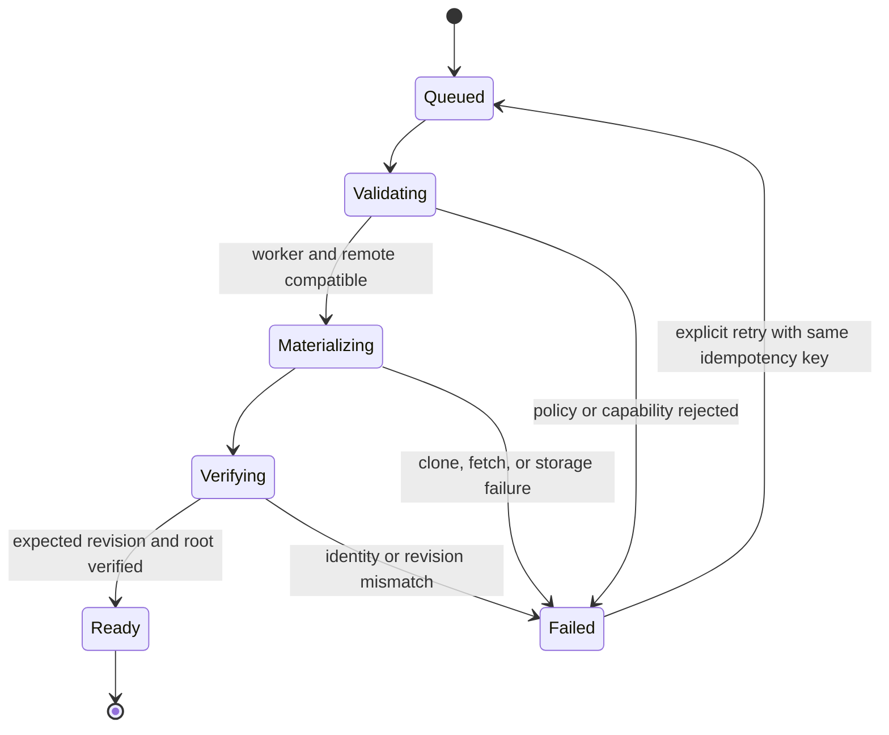
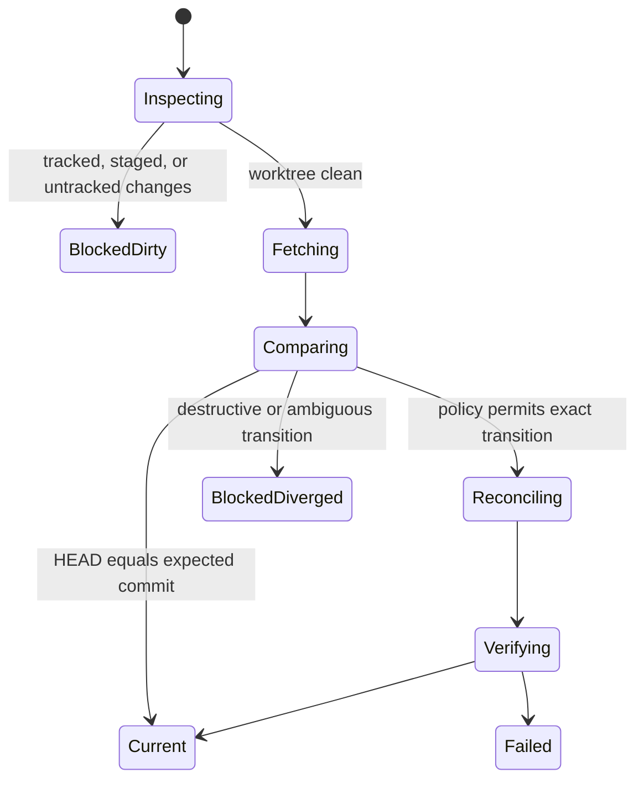
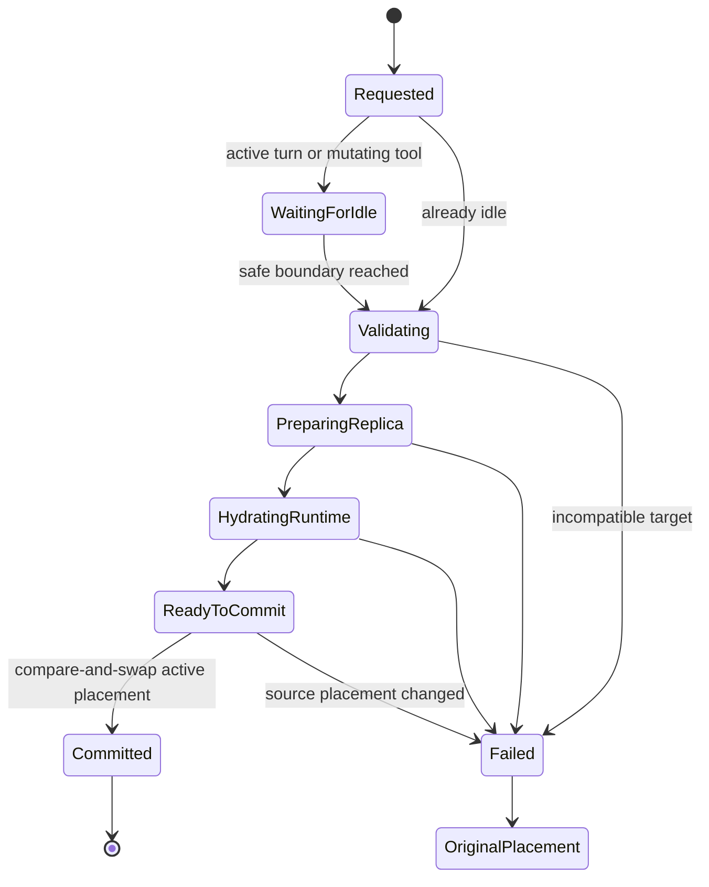
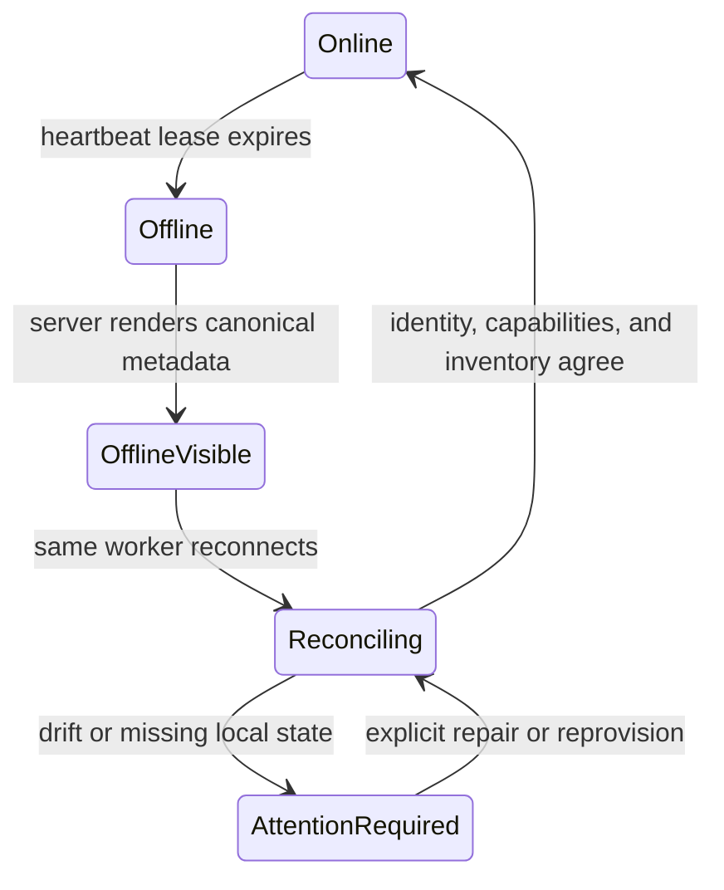
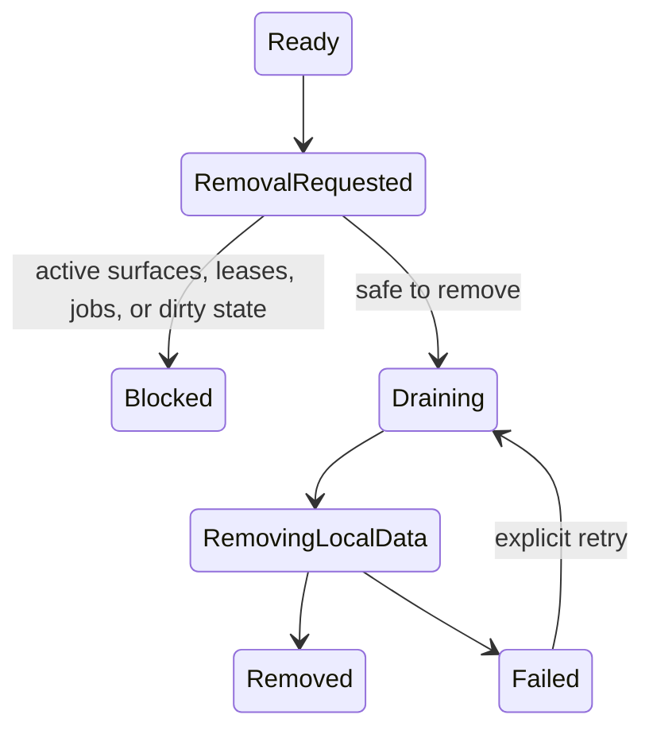

# Multi-worker architecture and placement contracts

- Status: Accepted foundation contract
- Last updated: 2026-08-11
- Related decisions: [ADR 0001](adr/0001-agent-managed-worktree-execution.md), [ADR 0002](adr/0002-worker-owned-remote-surfaces.md), [ADR 0003](adr/0003-worker-owned-chat-attachments.md), and [ADR 0006](adr/0006-multi-worker-project-replicas.md)

## Purpose

Cantrip supports one logical project on multiple worker machines. The governing
model is:

> One project, many worker-local replicas, with every surface having explicit
> execution placement and the Cantrip Server acting as the canonical router.

The server owns canonical product state, routing, authorization, durable jobs,
leases, and conversation history. A worker owns its filesystem, Git processes,
PTYs, Codex runtimes, editor processes, browsers, and desktop capture. Workers
are replaceable execution endpoints and never communicate directly with one
another.

This document defines the contracts later multi-worker changes must preserve.
The persistence and read contracts for project replicas are implemented;
provisioning, Git synchronization, placement switching, and chat relocation
remain disabled until their complete lifecycles are implemented.

## Current replica read contract

`project_sources` is the persisted replica table and enforces one row per
`(projectId, workerId)`. Existing rows and their IDs are preserved. Project
summaries expose a bounded `replicas` list containing worker identity and
online state, the worker-local path, repository fingerprint, Primary worktree,
branch and revision observations, dirty/readiness state, worktree count, and
timestamps.

During rolling compatibility, the existing singular `source` field remains a
deterministic projection of the first ready replica. A client built against
the replica contract defaults a missing `replicas` field to an empty list when
connected to an older server. The bootstrap capability
`capabilities.projectReplicas` tells clients whether the replica read APIs are
available:

- `GET /api/projects/:projectId/replicas`
- `GET /api/projects/:projectId/replicas/:replicaId`

These routes are owner-scoped and read-only. Replica materialization and
removal are introduced through durable jobs in the next rollout stage rather
than request-scoped mutation routes.

## Terms

| Term                 | Contract                                                                                                                                                                                                              |
| -------------------- | --------------------------------------------------------------------------------------------------------------------------------------------------------------------------------------------------------------------- |
| **Worker**           | One enrolled machine that connects outbound to the server and performs worker-owned operations.                                                                                                                       |
| **Project**          | The server-owned logical repository, independent of any checkout or machine.                                                                                                                                          |
| **Project replica**  | One worker-local installation of a project repository. Existing `project_sources` rows become replicas without changing their identity. `Project source` remains an internal and compatibility name during migration. |
| **Worktree**         | One Git worktree inside exactly one replica. Every replica has its own non-removable Primary worktree.                                                                                                                |
| **Placement**        | The server-resolved project, worker, replica, worktree, and optional surface at which an operation executes. Replica and worktree may be absent for machine-level surfaces.                                           |
| **Execution target** | An untrusted request selector naming a project, worker, replica, worktree, or surface. The server resolves it to a placement; a target is never authorization by itself.                                              |
| **Surface**          | A durable chat, terminal, Explorer, Code tab, Browser, Remote Desktop, or underlying Remote Surface. A terminal service inherits its terminal placement.                                                              |
| **Provisioning**     | Creating a replica on a worker at a requested, immutable Git revision.                                                                                                                                                |
| **Synchronization**  | Fetching references and reconciling a clean replica or worktree to an expected revision under an explicit policy. It does not mean unconditional pull.                                                                |
| **Relocation**       | Moving future chat execution to a prepared placement at a safe idle boundary. It does not move a live process.                                                                                                        |

Use **Default worker** in user-facing text. Do not use “Primary worker”; Primary
already names the distinguished Git worktree within each replica.

## Identity and containment

```text
Account
  ├── Worker A
  │     └── Project replica A
  │           ├── Primary worktree
  │           └── Managed worktree A1
  ├── Worker B
  │     └── Project replica B
  │           ├── Primary worktree
  │           └── Managed worktree B1
  └── Logical project
        ├── canonical chats and tabs
        ├── replica A
        └── replica B
```

The database must enforce at most one replica for a `(projectId, workerId)`
pair. Replica paths are meaningful only on their owning worker. Equal project,
branch, or revision identifiers do not imply equal uncommitted files.

Every worktree belongs to one replica and its worker must equal the replica's
worker. A worktree placement without a replica is invalid. Machine-level
surfaces may have a worker but no replica or worktree.

## Authority boundaries

| Concern                                      | App                            | Server                         | Worker                        |
| -------------------------------------------- | ------------------------------ | ------------------------------ | ----------------------------- |
| Project, replica, placement, and job records | Render and request             | Authoritative                  | Reports observations          |
| Ownership and authorization                  | Supplies authenticated session | Authoritative                  | Enforces command binding      |
| Target resolution and routing                | Supplies an untrusted selector | Authoritative                  | Accepts only routed commands  |
| Paths, symlinks, files, Git, and dirty state | Never dereferences             | Stores bounded observations    | Authoritative                 |
| Conversation transcript and relocation state | Render and request             | Authoritative                  | Hosts worker-specific runtime |
| Codex rollout files and processes            | Never accesses directly        | Stores runtime association     | Authoritative                 |
| PTYs, Code, browser, and desktop processes   | Attaches through server        | Owns durable surface lifecycle | Authoritative                 |
| Credentials and machine capabilities         | Displays redacted state        | Owns enrollment and policy     | Owns runtime/provider secrets |

The app connects only to the server. Worker commands use the authenticated,
versioned server-to-worker protocol. A server may fan an operation out to many
workers, but workers do not receive addresses or credentials for one another.

## Protocol contracts

`@cantrip/protocol` exports `executionTargetSchema` for request selectors and
`executionPlacementSchema` for server-resolved placements.

### Execution targets are selectors

Targets are strict discriminated unions:

```ts
type ExecutionTarget =
  | { kind: "project"; projectId: string }
  | { kind: "worker"; projectId: string; workerId: string }
  | { kind: "replica"; projectId: string; projectReplicaId: string }
  | { kind: "worktree"; projectId: string; worktreeId: string }
  | {
      kind: "surface";
      projectId: string;
      surfaceKind:
        | "chat"
        | "terminal"
        | "explorer"
        | "code"
        | "browser"
        | "remote-desktop"
        | "remote-surface";
      surfaceId: string;
    };
```

Selectors intentionally avoid accepting claimed parent IDs that the server can
derive. For example, a surface selector does not accept a client-provided
worker ID. This prevents ambiguous or contradictory placements. `projectId`
is present on every selector as an authorization and confused-deputy guard;
resolution rejects a resource that belongs to a different project.

### Placements are resolved facts

```ts
type ExecutionPlacement = {
  projectId: string;
  workerId: string;
  projectReplicaId: string | null;
  worktreeId: string | null;
  surface: {
    kind: ExecutionSurfaceKind;
    id: string;
  } | null;
};
```

A placement is returned or persisted only after the server proves every
relationship. A non-null `worktreeId` requires a non-null `projectReplicaId`.
The worker validates that the resolved worktree and canonical path still agree
with its local inventory before performing filesystem work.

### Resolution algorithm

For every target, the server must:

1. Authenticate the requesting principal.
2. Load the target resource under the supplied project and account ownership.
3. Resolve its worker, replica, worktree, and surface relationships from
   server-owned records; never trust redundant client relationships.
4. Verify relational consistency, lifecycle readiness, capability requirements,
   online state, and any active lease.
5. Authorize the requested operation, not merely read access to the target.
6. Record an audit event for security-sensitive or mutating operations.
7. Dispatch a bounded, idempotent command to the resolved worker.
8. Reject stale acknowledgements whose command, worker, or placement binding
   no longer matches.

A surface ID remains the durable routing key. Moving a chat changes its active
placement; it does not mutate the placement of an unrelated terminal. A chat
can address that terminal by ID through server routing without relocating.
Discovered browser services are bounded worker observations carrying resolved
worker placement; they become durable surface targets only after Cantrip
creates a Browser or Remote Surface record.

## Default placement selection

Creation uses this deterministic order:

1. An explicit compatible target chosen by the user.
2. The project's preferred worker, if online and replica-ready.
3. The account's Default worker, if online and replica-ready.
4. A deterministic compatible online replica ordered by stable worker ID.
5. An actionable “no compatible placement” result.

Cantrip never silently relocates an existing surface when a worker goes
offline. Single-worker users continue to receive the only compatible placement
without being shown unnecessary fleet controls.

## Lifecycle contracts

### Replica provisioning

Provisioning is a durable server job. A worker creates temporary state and
publishes bounded progress; the server exposes the canonical job state.



Partial directories remain worker-owned staging data and must not appear as a
ready replica. Retrying a completed idempotency key returns the completed job.

### Synchronization

Synchronization fetches remote references first, computes an expected commit,
and materializes that exact commit. It never begins with an unconditional
`git pull`.



Only an explicit policy may fast-forward a clean designated Primary branch.
Dirty or diverged worktrees remain untouched and visible to the user.

### Chat relocation

Relocation prepares a target runtime and commits one atomic placement change.



The context handoff is a durable server artifact with a transcript cursor,
summary/version, attachment availability, model route, permission profile, and
source placement. A fixed last-message window is not a relocation contract.
The original placement remains active until the compare-and-swap succeeds.

### Offline recovery



Offline state never triggers implicit placement changes. Independent workers
and fleet queries continue with partial results and per-worker deadlines.

### Replica removal



The server does not delete the durable replica record before the worker
confirms safe local cleanup. Revoking or removing a worker never deletes the
logical project or server-owned conversations.

## Git and file-transfer rules

- Fetching remote references is observation; changing a checkout is a separate
  authorized operation.
- Synchronization selects an immutable expected commit and verifies it after
  materialization.
- A clean, designated Primary branch may fast-forward only when policy allows.
- Unpushed commits require an explicit Git bundle or equivalent verified
  transfer.
- Uncommitted tracked changes require an explicit patch transfer. Untracked
  files require a bounded manifest and content transfer.
- Conflicts, ignored files needed by a runtime, submodules, LFS objects, and
  unavailable remotes are first-class blocking results.
- No operation silently resets, cleans, force-checkouts, rebases, or overwrites
  a dirty worktree.
- Leases must eventually coordinate the logical branch across replicas, not
  only a worker-local worktree ID.

## Compatibility and migration invariants

The singular-source migration must be additive and lossless:

1. Preserve every existing `project_sources` row and ID as the first project
   replica on its current worker.
2. Preserve all worktree foreign keys, paths, status observations, chat
   placements, runtime associations, and surface worker assignments.
3. Replace project-only uniqueness with `(projectId, workerId)` uniqueness.
4. Keep `project_sources` as the database table and `projectSourceId` as an
   internal compatibility field until all persisted and transported callers
   have migrated. New public contracts use `projectReplicaId`.
5. Add a replica list to project responses while retaining the singular
   `source` projection for rolling clients. The compatibility projection is the
   selected/default replica, falling back deterministically for migrated data.
6. Older workers continue serving already-routed commands. They are not sent
   replica or relocation commands they did not advertise.
7. `multipleWorkers` may remain true for enrollment and management, while
   `workerSwitching` and `gitSync` remain false until their complete operations
   and recovery paths ship.
8. A rollback must not require deleting a replica or worktree. If a new server
   observes more than one replica, an older singular-source server must refuse
   ambiguous mutation rather than select one silently.

Protocol additions are additive within protocol version 1. A future breaking
wire change requires an explicit protocol version and negotiated compatibility.

## Durability, concurrency, and errors

Provision, synchronize, relocate, transfer, and remove are durable jobs with:

- a server-generated job ID and caller idempotency key;
- requested and resolved placements;
- monotonic state revisions;
- bounded progress and redacted structured errors;
- cancellation state and an explicit point after which cancellation is unsafe;
- worker command IDs and attempt numbers;
- timestamps, actor identity, and audit metadata; and
- recovery rules for server restart, worker reconnect, duplicate delivery, and
  stale completion.

Mutations use compare-and-swap state revisions. A worker acknowledgement cannot
commit a job after its attempt was superseded. Project-wide logical-branch
leases prevent separate replicas from granting concurrent write ownership to
the same branch.

Recommended stable error families are `target-not-found`, `target-mismatch`,
`worker-offline`, `capability-missing`, `replica-not-ready`, `worktree-dirty`,
`revision-diverged`, `lease-conflict`, `attachment-unavailable`,
`runtime-incompatible`, `stale-attempt`, and `policy-denied`. User-facing text
may evolve, but API consumers should branch on structured codes.

## Implementation sequence

The contracts are delivered incrementally so `main` remains usable:

1. Architecture and placement contracts.
2. Per-worker project replicas and the compatibility projection.
3. Durable replica provisioning and synchronization jobs.
4. Global worker policy and per-project replica settings.
5. Explicit placement for new surfaces.
6. Fleet-wide browser service discovery with partial results.
7. Safe chat relocation and durable context handoff.
8. Shared cross-worker execution-target resolution for agent tools.
9. Worker-specific Remote Desktop fleet views.
10. Logical-branch leases, recovery, rolling compatibility, and security
    hardening.

Each step must keep single-worker behavior working, ship independently, and
leave capability flags disabled until its end-to-end behavior is safe.
