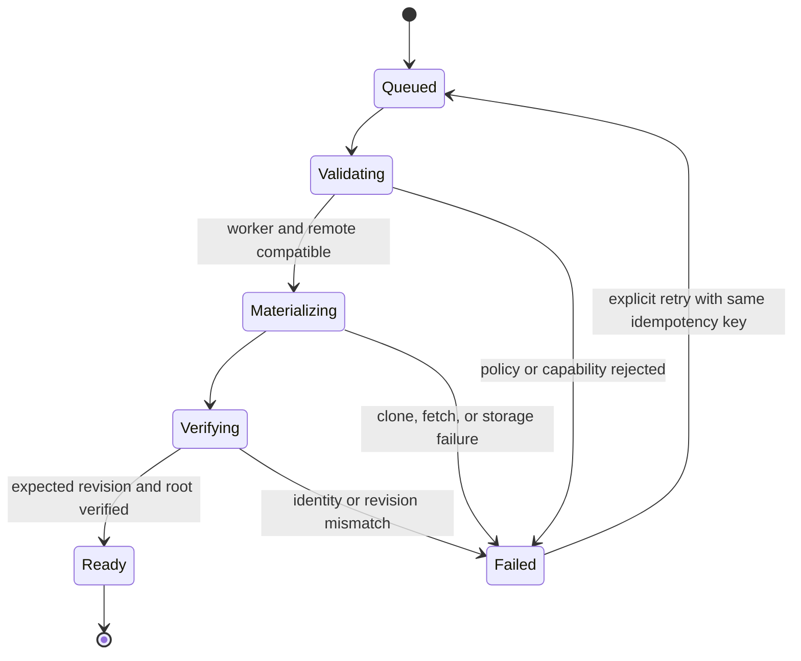
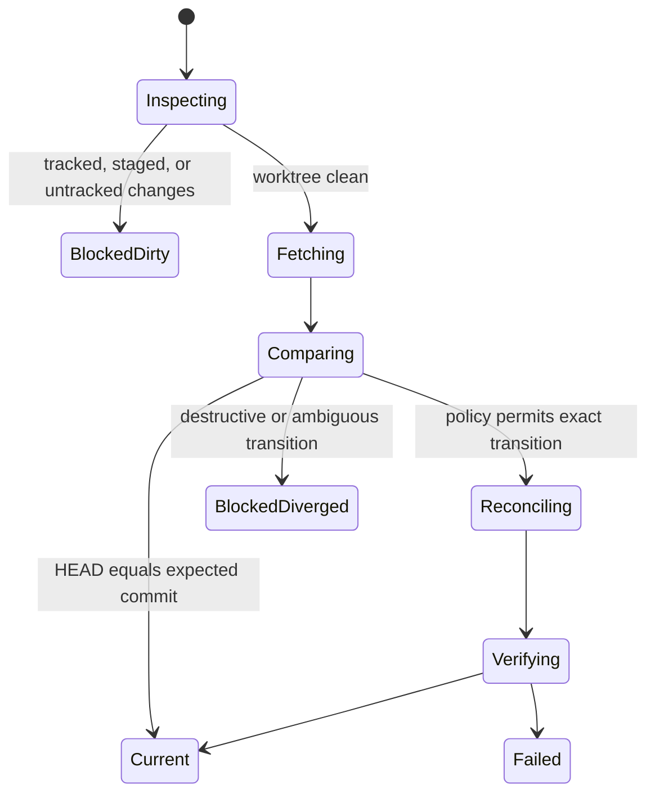
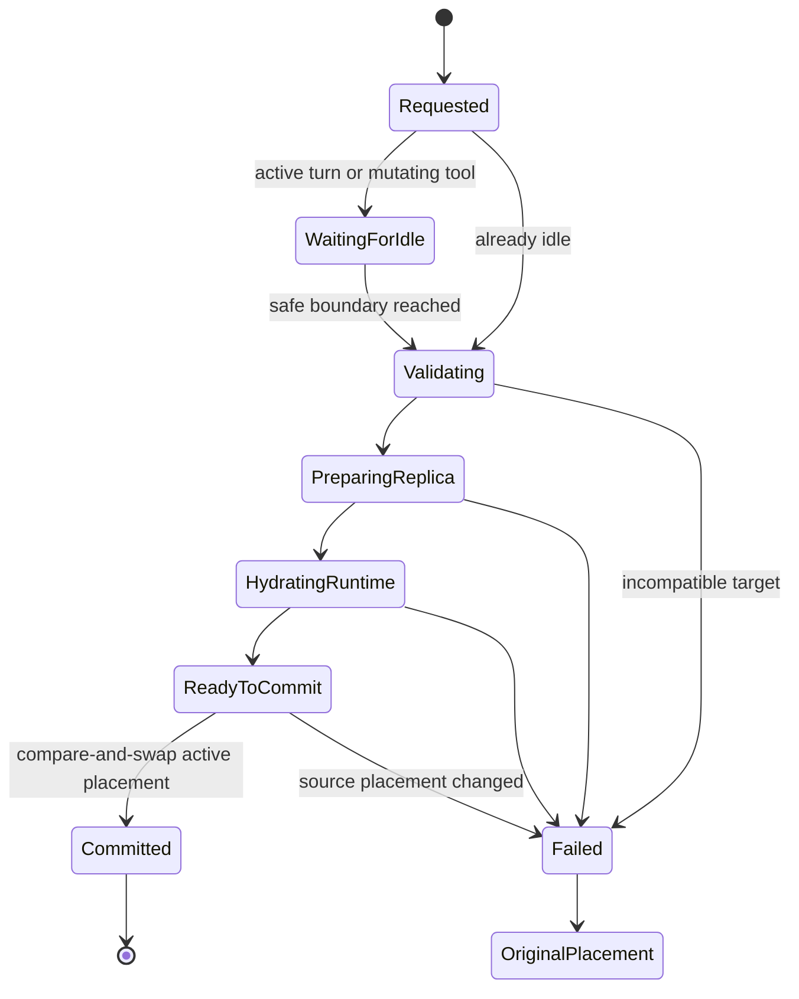
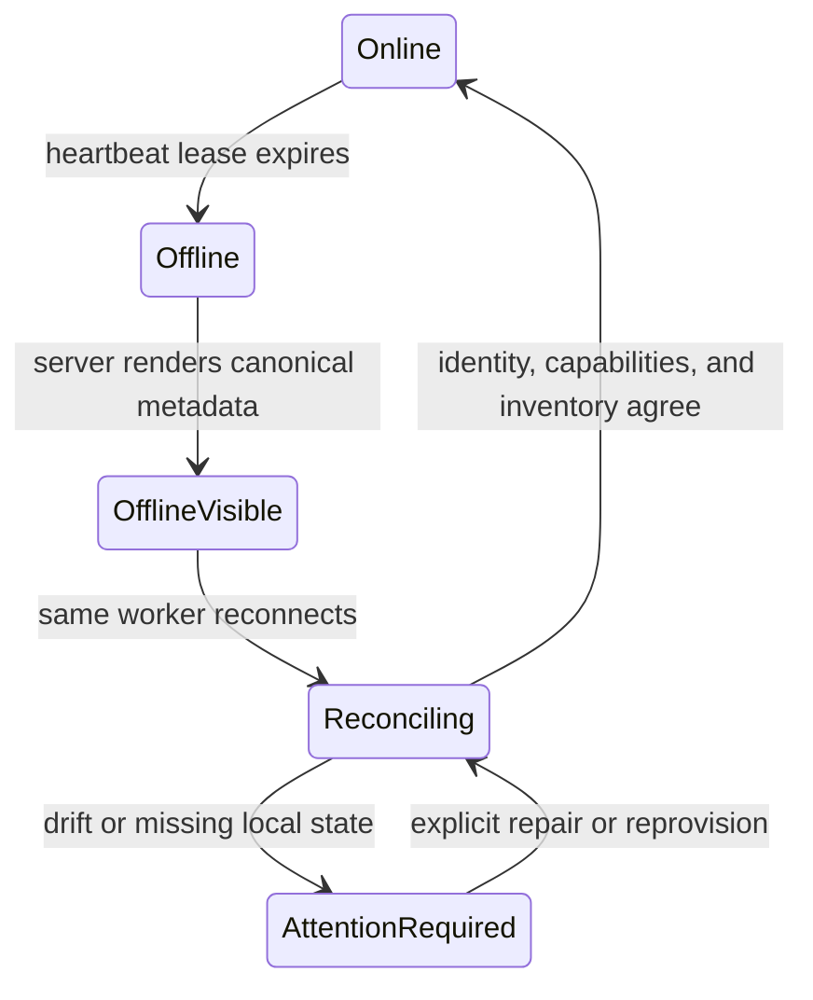
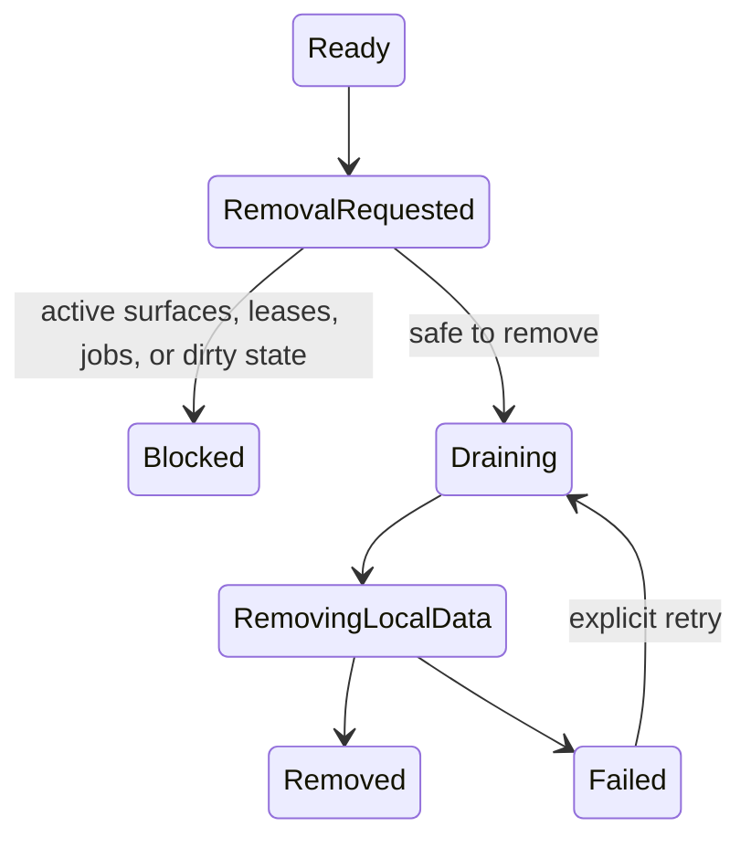

# Multi-worker architecture and placement contracts

- Status: Accepted foundation contract
- Last updated: 2026-08-12
- Related decisions: [ADR 0001](adr/0001-agent-managed-worktree-execution.md), [ADR 0002](adr/0002-worker-owned-remote-surfaces.md), [ADR 0003](adr/0003-worker-owned-chat-attachments.md), and [ADR 0006](adr/0006-multi-worker-project-replicas.md)

## Purpose

Cantrip supports one logical project on multiple worker machines. The governing
model is:

> One project, many worker-local replicas, with every surface having explicit
> execution placement and the Cantrip Server acting as the canonical router.

The server owns canonical product state, routing, authorization, durable jobs,
leases, and conversation history. A worker owns its filesystem, Git processes,
PTYs, Codex runtimes, editor processes, browsers, and desktop capture. Workers
are replaceable execution endpoints and never communicate directly with one
another.

The server remains the canonical control plane even when a desktop app and a
worker share one machine. An authenticated worker may advertise a loopback-only
direct broker, but the endpoint is usable only through a short-lived,
resource-bound capability minted by the server and installed over the worker's
outbound control connection. A native locality challenge proves the advertised
worker is actually reachable on this host; network names and addresses alone
never select the direct route. Direct failure preserves the existing
server-relayed data plane.

Current data-plane support is intentionally client-specific. Tauri can create a
verified same-machine forward for generic tunnels, PTYs, project shares, and
Cantrip Code. Web and Capacitor clients use the server relay for those resources.
Browser and Remote Desktop instead use server-signaled WebRTC, which can select
a direct ICE path on any supported client and falls back to the Remote Surface
WebSocket relay. In every case, resource creation, placement, capabilities,
revocation, and recovery remain server-owned.

This document defines the contracts later multi-worker changes must preserve.
Replica persistence, reads, exact-revision provisioning, guarded
synchronization, safe removal, placement-policy settings, and canonical
placement resolution and selection for new surfaces, and fleet-wide Browser
service discovery are implemented. Durable chat relocation jobs and canonical
context snapshots now drive server-routed runtime preparation, verified
attachment transfer, target hydration, and atomic placement commit. The server
advertises worker switching when these runtime contracts are available; the
app exposes that lifecycle as an explicit, progress-aware chat move workflow.
Canonical existing-target resolution and a bounded project target catalog now
cover worker, replica, worktree, chat, terminal, Explorer, Code, Browser, and
Remote Surface identities. Cross-worker agent reads and bounded mutations now
consume this shared resolver. Servers advertise this end-to-end contract with
`capabilities.crossWorkerExecutionTargets`.

## Current replica read contract

`project_sources` is the persisted replica table and enforces one row per
`(projectId, workerId)`. Existing rows and their IDs are preserved. Project
summaries expose a bounded `replicas` list containing worker identity and
online state, the worker-local path, repository fingerprint, Primary worktree,
branch and revision observations, dirty/readiness state, worktree count, and
timestamps.

During rolling compatibility, the existing singular `source` field remains a
deterministic projection of the first ready replica. A client built against
the replica contract defaults a missing `replicas` field to an empty list when
connected to an older server. The bootstrap capability
`capabilities.projectReplicas` tells clients whether the replica read APIs are
available:

- `GET /api/projects/:projectId/replicas`
- `GET /api/projects/:projectId/replicas/:replicaId`

These routes are owner-scoped. Exact-revision provisioning is exposed through
durable server jobs when `capabilities.replicaProvisioning` is true:

- `POST /api/projects/:projectId/replicas`
- `POST /api/projects/:projectId/replicas/:replicaId/synchronize`
- `POST /api/projects/:projectId/replicas/:replicaId/remove`
- `GET /api/projects/:projectId/replica-jobs`
- `GET /api/project-replica-jobs/:jobId`
- `POST /api/project-replica-jobs/:jobId/retry`
- `POST /api/project-replica-jobs/:jobId/cancel`

Workers advertise replica operations independently. Older workers default all
replica-operation capabilities to unavailable, so a rolling server never sends
them an unsupported command. Provisioning and synchronization require
`exactRevision` plus their operation-specific capability; removal requires its
own capability. `capabilities.gitSync` is true only when the server exposes the
complete guarded synchronization lifecycle.

## Current placement-policy controls

The account-scoped Workers settings page persists a nullable Default worker,
an automatic missing-replica provisioning toggle, and an automatic
synchronization policy (`off`, `verify-only`, or `fast-forward-primary`). The
project-scoped Replicas page persists an optional preferred worker and shows
every linked worker alongside its replica observation, capabilities, and most
recent durable job. It also exposes explicit provision, synchronize,
retry/cancel, and safe-remove actions.

Changing a preference does not move an existing surface or start an implicit
replica job. New chats, terminals, Explorers, Code tabs, Browsers, and Remote
Desktops resolve placement through one server-owned resolver. It consumes the
project preference first, then the account default, then a stable compatible
fallback. Existing single-worker installations are backfilled to their
earliest active worker as the Default, while a cleared preference uses the
same deterministic fallback.

The creation contracts accept an optional `ExecutionTarget`. Legacy
`worktreeId` callers remain supported for replica-local surfaces, but a request
cannot send both selectors. `POST /api/projects/:projectId/placement/resolve`
lets a client preview the canonical placement and reports whether it came from
an explicit target, project preference, Default worker, or fallback. Browser
summaries now include their owning worker during rolling compatibility.

When more than one worker is linked, each placeable entry in the New surface
menu expands to offer Automatic policy selection or an explicit worker. A
replica-local surface can further choose the worker default, replica default,
or an exact ready worktree. Machine-level Browser and Remote Desktop surfaces
choose a worker directly. Offline, replica-missing, and capability-incompatible
workers remain visible with their reason but cannot be selected. With one
worker, the menu stays one-click and contains no fleet controls.

The selected surface's worker remains visible in the content header. In a
multi-worker account, compact placement indicators also distinguish Primary
worktrees and machine-level Browser tabs in the project sidebar; non-Primary
worktrees retain their existing detailed worktree indicator. A terminal
service inherits the owning terminal's placement and does not select a second
worker.

## Current fleet Browser discovery

`GET /api/projects/:projectId/browser-services` fans one bounded discovery
request out concurrently to every linked worker that advertises Browser
support. Each worker result carries its canonical worker ID and display name,
status, structured error when present, and discovered services. Every service
also carries a server-resolved machine placement; worker-provided placement
claims are overwritten.

The response remains useful when only part of the fleet is healthy: successful
services stay available while offline, timed-out, and failed worker scans are
reported alongside them. A fleet scan is capped at 64 eligible workers and
1,024 services, runs each worker request with a 20-second timeout, and reports
whether either workers or services were truncated. Workers without Browser
capability are not queried. The earlier Browser-owned discovery endpoint
remains available for rolling clients.

The Browser Services menu uses the fleet endpoint only when the server
advertises `browserFleetDiscovery`; otherwise it retains the prior
owning-worker query. Selecting a service on the current Browser's worker
navigates the existing Browser, preserving local single-worker behavior.
Selecting a service on another worker creates a new Browser in the current tab
group with the service URL and an explicit worker placement, so worker-local
loopback never gets sent to the wrong Browser runtime.

## Current Remote Desktop fleet view

Each Remote Desktop remains one durable, worker-specific Remote Surface. The
fleet panel does not combine displays or relay frames between workers. Instead,
`GET /api/projects/:projectId/remote-desktop-fleet` asks up to 64 eligible
desktop-capable workers for their bounded monitor/window inventory in parallel
with independent 20-second command timeouts. The response includes canonical
worker identity, platform, architecture, existing Remote Desktop connection
states, and a structured `ok`, `offline`, `timed-out`, or `error` result for
each worker. A global limit of 4,096 targets and 64 surfaces per worker prevents
a large fleet or window inventory from producing an unbounded response.

The app exposes that inventory from a Remote Desktop's Fleet panel. Selecting
a target on the current worker reconfigures the current stream; selecting a
monitor or window on another worker creates a normal Remote Desktop in the
current tab group with explicit worker placement and the selected capture
target. Every resulting tab attaches and reconnects independently through the
existing Remote Surface transport, so a slow or disconnected worker cannot
stall a healthy worker's stream. Servers advertise the feature through
`capabilities.remoteDesktopFleet`; rolling clients treat a missing flag as
false and retain the single-worker target menu.

## Terms

| Term                     | Contract                                                                                                                                                                                                              |
| ------------------------ | --------------------------------------------------------------------------------------------------------------------------------------------------------------------------------------------------------------------- |
| **Worker**               | One enrolled machine that connects outbound to the server and performs worker-owned operations.                                                                                                                       |
| **Project**              | The server-owned logical repository, independent of any checkout or machine.                                                                                                                                          |
| **Project replica**      | One worker-local installation of a project repository. Existing `project_sources` rows become replicas without changing their identity. `Project source` remains an internal and compatibility name during migration. |
| **Worktree**             | One Git worktree inside exactly one replica. Every replica has its own non-removable Primary worktree.                                                                                                                |
| **Placement**            | The server-resolved project, worker, replica, worktree, and optional surface at which an operation executes. Replica and worktree may be absent for machine-level surfaces.                                           |
| **Execution target**     | An untrusted request selector naming a project, worker, replica, worktree, or surface. The server resolves it to a placement; a target is never authorization by itself.                                              |
| **Surface**              | A durable chat, terminal, Explorer, Code tab, Browser, Remote Desktop, or underlying Remote Surface. A terminal service inherits its terminal placement.                                                              |
| **Provisioning**         | Creating a replica on a worker at a requested, immutable Git revision.                                                                                                                                                |
| **Synchronization**      | Fetching references and reconciling a clean replica or worktree to an expected revision under an explicit policy. It does not mean unconditional pull.                                                                |
| **Relocation**           | Moving future chat execution to a prepared placement at a safe idle boundary. It does not move a live process.                                                                                                        |
| **Logical branch lease** | A server-owned mutation fence for one `(project, branch)` across every worker-local replica and physical worktree. It complements, rather than replaces, a worktree-local execution lane.                             |

Use **Default worker** in user-facing text. Do not use “Primary worker”; Primary
already names the distinguished Git worktree within each replica.

## Identity and containment

```text
Account
  ├── Worker A
  │     └── Project replica A
  │           ├── Primary worktree
  │           └── Managed worktree A1
  ├── Worker B
  │     └── Project replica B
  │           ├── Primary worktree
  │           └── Managed worktree B1
  └── Logical project
        ├── canonical chats and tabs
        ├── replica A
        └── replica B
```

The database must enforce at most one replica for a `(projectId, workerId)`
pair. Replica paths are meaningful only on their owning worker. Equal project,
branch, or revision identifiers do not imply equal uncommitted files.

Every worktree belongs to one replica and its worker must equal the replica's
worker. A worktree placement without a replica is invalid. Machine-level
surfaces may have a worker but no replica or worktree.

## Project-wide branch coordination

Physical worktree IDs are worker-local. Two replicas can therefore expose
different worktree IDs for the same Git branch, so a worktree-only lease cannot
prevent two agents from mutating that logical branch concurrently.

The server also persists `project_branch_leases`. A partial unique index permits
only one active holder for each `(project_id, branch_name)`, regardless of
worker, replica, or physical worktree. Chat execution acquires this fence in the
same transaction that activates its execution lane. Workflow execution acquires
it while reserving the worktree, before provisioning or dispatch. A conflicting
chat or workflow receives an explicit conflict and no worker command is sent.

Primary chat turns release their logical fence when the turn finishes. A
secondary chat lane retains it while suspended because that worktree may contain
uncommitted state and can be resumed; explicit lane release relinquishes it.
Workflow leases retain the fence through active, checkpointed, and recoverable
states, then release it with a terminal outcome or non-recoverable allocation
failure. Durable relocation and same-chat, same-branch handoff transfer the
fence transactionally, so there is no unowned interval during placement commit.

Detached worktrees have no branch identity and remain isolated by their physical
lane. For a named but not-yet-observed Primary checkout, a single-replica project
may continue under its physical lease. A multi-replica project fails closed
until the worker reports the branch, because the server cannot safely prove
cross-worker branch identity otherwise.

Migration backfill ranks already-active mutation holders first, retains
secondary suspended lanes and live workflow leases, ignores idle Primary lanes,
and creates at most one active owner for each existing project branch. Losing
legacy contenders must reacquire and will receive the normal branch conflict.

## Durable job ownership and failover

Project replica operations and chat relocations are PostgreSQL-backed jobs. A
server claim carries a command ID, attempt number, and two-minute lease. The
active executor renews that lease every 30 seconds, including while a worker is
cloning, synchronizing, transferring context, or hydrating Codex. Progress and
state transitions also extend the lease.

A coordinated server replica never requeues an unexpired claim during startup.
Every replica instead scans for expired claims every 30 seconds and may replay
only those jobs. Command ID and attempt checks fence progress and completion
from the former holder after recovery. Single-instance local mode retains eager
startup recovery because no peer process can still own the command.

Replica worker commands and final runtime hydration have explicit 30-minute
deadlines. A timeout becomes a visible retryable job failure; it cannot leave a
server request waiting forever. Worker-side job and snapshot idempotency plus
server-side attempt fencing make the retry safe, while relocation still refuses
dirty worktrees, revision drift, unavailable attachments, and incompatible
worker capabilities.

Workflow node attempts use a parallel heartbeat-lease contract. A live server
renews every active attempt even when the worker emits no progress, and clustered
recovery considers only heartbeats stale for two minutes. Recovery is fenced by
the exact heartbeat value it observed, retains the run's account owner for live
invalidations and redispatch, and keeps the worker request within the persisted
node timeout budget. Recoverable worktree leases are scanned across all owners
but still execute only through their explicitly assigned worker and branch
fences.

## Authority boundaries

| Concern                                      | App                            | Server                         | Worker                        |
| -------------------------------------------- | ------------------------------ | ------------------------------ | ----------------------------- |
| Project, replica, placement, and job records | Render and request             | Authoritative                  | Reports observations          |
| Ownership and authorization                  | Supplies authenticated session | Authoritative                  | Enforces command binding      |
| Target resolution and routing                | Supplies an untrusted selector | Authoritative                  | Accepts only routed commands  |
| Paths, symlinks, files, Git, and dirty state | Never dereferences             | Stores bounded observations    | Authoritative                 |
| Conversation transcript and relocation state | Render and request             | Authoritative                  | Hosts worker-specific runtime |
| Codex rollout files and processes            | Never accesses directly        | Stores runtime association     | Authoritative                 |
| PTYs, Code, browser, and desktop processes   | Attaches through server        | Owns durable surface lifecycle | Authoritative                 |
| Credentials and machine capabilities         | Displays redacted state        | Owns enrollment and policy     | Owns runtime/provider secrets |

The app connects only to the server. Worker commands use the authenticated,
versioned server-to-worker protocol. A server may fan an operation out to many
workers, but workers do not receive addresses or credentials for one another.

## Protocol contracts

`@cantrip/protocol` exports `executionTargetSchema` for request selectors,
`executionPlacementSchema` for server-resolved placements, and the bounded
placement resolution request and response schemas used by the preview route.

### Execution targets are selectors

Targets are strict discriminated unions:

```ts
type ExecutionTarget =
  | { kind: "project"; projectId: string }
  | { kind: "worker"; projectId: string; workerId: string }
  | { kind: "replica"; projectId: string; projectReplicaId: string }
  | { kind: "worktree"; projectId: string; worktreeId: string }
  | {
      kind: "surface";
      projectId: string;
      surfaceKind:
        | "chat"
        | "terminal"
        | "explorer"
        | "code"
        | "browser"
        | "remote-desktop"
        | "remote-surface";
      surfaceId: string;
    };
```

Selectors intentionally avoid accepting claimed parent IDs that the server can
derive. For example, a surface selector does not accept a client-provided
worker ID. This prevents ambiguous or contradictory placements. `projectId`
is present on every selector as an authorization and confused-deputy guard;
resolution rejects a resource that belongs to a different project.

### Placements are resolved facts

```ts
type ExecutionPlacement = {
  projectId: string;
  workerId: string;
  projectReplicaId: string | null;
  worktreeId: string | null;
  surface: {
    kind: ExecutionSurfaceKind;
    id: string;
  } | null;
};
```

A placement is returned or persisted only after the server proves every
relationship. A non-null `worktreeId` requires a non-null `projectReplicaId`.
The worker validates that the resolved worktree and canonical path still agree
with its local inventory before performing filesystem work.

### Resolution algorithm

For every target, the server must:

1. Authenticate the requesting principal.
2. Load the target resource under the supplied project and account ownership.
3. Resolve its worker, replica, worktree, and surface relationships from
   server-owned records; never trust redundant client relationships.
4. Verify relational consistency, lifecycle readiness, capability requirements,
   online state, the physical execution lane, and any project-wide logical
   branch lease.
5. Authorize the requested operation, not merely read access to the target.
6. Record an audit event for security-sensitive or mutating operations.
7. Dispatch a bounded, idempotent command to the resolved worker.
8. Reject stale acknowledgements whose command, worker, or placement binding
   no longer matches.

A surface ID remains the durable routing key. Moving a chat changes its active
placement; it does not mutate the placement of an unrelated terminal. A chat
can address that terminal by ID through server routing without relocating.
Discovered browser services are bounded worker observations carrying resolved
worker placement; they become durable surface targets only after Cantrip
creates a Browser or Remote Surface record.

### Current existing-target resolution

Creation placement and existing-resource addressing remain separate calls:

- `POST /api/projects/:projectId/placement/resolve` selects placement for a new
  surface and therefore rejects an existing surface selector.
- `POST /api/projects/:projectId/execution-targets/resolve` resolves an
  existing `ExecutionTarget` without substituting another worker.
- `GET /api/projects/:projectId/execution-targets` returns a bounded catalog of
  canonical workers, replicas, worktrees, and surfaces for application and
  agent consumers.

The existing-target resolver derives all parent relationships from owned
server records. It rejects project mismatches, missing resources, and
worker/worktree inconsistencies, then checks the resolved worker connection and
Code, Browser, or Desktop capability as appropriate. Callers rendering fleet
state may explicitly retain unavailable targets; their result carries a stable
`worker-offline` or `capability-unavailable` availability state and reason.
Operational callers fail closed by default. The catalog never accepts a
client-supplied worker claim for a surface and does not expose worker-local
paths.

### Agent operations use the same targets

Interactive Codex turns use the worker-bundled `cantrip` CLI instead of
client-hosted dynamic tools. Its layered command tree exposes worktree
lifecycle, canonical target discovery, bounded Explorer reads/writes, Terminal
scrollback/input/service restart, and Browser discovery/navigation. Target
lists are cursor-paginated, file and terminal output are bounded, Explorer
writes require the current SHA-256 version, and Browser URLs must use HTTP(S).

The CLI talks only to an authenticated loopback broker. For commands launched
inside Codex, that broker attaches the server-issued chat and execution-lane
identity associated with `CODEX_THREAD_ID`; terminal and shell use terminal ID
or the most-specific registered working directory. The worker then calls
`POST /api/internal/cli` with its worker credential. The server revalidates the
active lane, account ownership, project, worktree, target kind, capabilities,
and availability before using the existing server-to-target-worker bridge.
The source and target workers never exchange addresses or credentials.

Every attempted mutation records a `cli.command.mutated` audit event. Project
mismatches, stale or spoofed lanes, pinned-chat transitions, incorrect surface
kinds, missing capabilities, and offline targets fail closed without fallback
placement. New and resumed chat threads explicitly expose no Cantrip dynamic
tools; the pinned runtime clears declarations persisted by older chats during
resume. Rolling clients must still treat a missing
`crossWorkerExecutionTargets` capability as false.

## Default placement selection

Creation uses this deterministic order:

1. An explicit compatible target chosen by the user.
2. The project's preferred worker, if online and replica-ready.
3. The account's Default worker, if online and replica-ready.
4. A deterministic compatible online replica ordered by stable worker ID.
5. An actionable “no compatible placement” result.

The resolver requires a live worker connection as well as a recent heartbeat.
Code, Browser, and Remote Desktop placements require their advertised worker
capability. Chats, terminals, Explorers, and Code tabs additionally require an
active project replica with a ready worktree; the replica's Default worktree is
chosen first, followed by Primary and stable creation order. Browser and Remote
Desktop placements may be machine-level and therefore omit replica and
worktree IDs.

An explicit unavailable target is rejected with a structured error and is
never replaced by a fallback. Automatic preferences may be skipped when they
are offline, incompatible, or lack a ready replica. The resolved worker and
worktree are persisted on the new surface before it can receive commands.

Cantrip never silently relocates an existing surface when a worker goes
offline. Single-worker users continue to receive the only compatible placement
without being shown unnecessary fleet controls.

## Lifecycle contracts

### Replica provisioning

Provisioning is a durable server job. A worker creates temporary state and
publishes bounded progress; the server exposes the canonical job state.

The server persists the request before dispatch, increments an attempt for
every delivery, and accepts completion only when the command ID, attempt, and
job ID still match. Server restart requeues interrupted attempts; a worker
disconnect produces a retryable `worker-offline` block that is requeued when
that worker reconnects. A reused checkout is never pulled implicitly: dirty
state yields `worktree-dirty`, and an explicit revision mismatch yields
`revision-diverged` without changing files.



Partial directories remain worker-owned staging data and must not appear as a
ready replica. Retrying a completed idempotency key returns the completed job.

### Synchronization

Synchronization fetches remote references first, computes an expected commit,
and materializes that exact commit. It never begins with an unconditional
`git pull`.

The `verify-only` policy observes and blocks on a mismatch without changing
the checkout. The `fast-forward-primary` policy permits only an attached,
clean Primary worktree whose current revision is an ancestor of the expected,
origin-reachable commit. It never resets, rebases, or overwrites local state.



Only an explicit policy may fast-forward a clean designated Primary branch.
Dirty or diverged worktrees remain untouched and visible to the user.

### Chat relocation

Relocation prepares a target runtime and commits one atomic placement change.



The context handoff is a durable server artifact with a transcript cursor,
summary/version, attachment availability, model route, permission profile,
required Git revision, and source placement. A fixed last-message window is
not a relocation contract. The original placement and source runtime remain
active until the compare-and-swap succeeds.

The durable foundation stores the entire canonical transcript through a fixed
sequence cursor rather than reading a moving tail during execution. It records
attachment availability independently per worker, preserves the legacy
attachment owner for rolling code, and binds every job to a source placement
revision. Job creation is idempotent, only one active relocation may exist per
chat, interrupted preparation can be replayed, and cancellation is rejected
after the job reaches its unsafe commit boundary. Once a relocation request
exists, no new execution lane, queued prompt, or goal continuation may start on
the source. A job created during an active turn refreshes its immutable
snapshot at the first idle boundary so the completed turn is never omitted.

The server validates both workers' negotiated Codex methods, target permission
profile, referenced skills, model route availability, clean worktree state,
and exact Git revision before hydrating anything. A revision mismatch may
launch an idempotent replica synchronization job only for a clean Primary
worktree and only under the explicit `fast-forward-primary` policy. Other
mismatches block without changing either checkout.

Workers advertise durable chat relocation support independently. The field
defaults to unavailable when an older heartbeat omits it, and the server does
not create or dispatch a relocation unless both source and target workers
advertise support.

Canonical payloads and attachments travel through the authenticated server
relay in bounded, digest-verified chunks; workers never address one another.
The target persists upload and hydration state by snapshot ID before creating
the Codex thread. Duplicate delivery reuses a completed thread, while an
interrupted hydration discards the abandoned thread before replay. Canonical
system, user, and assistant messages are injected into the target thread in
bounded batches with plan/goal context preserved.

Placement commit is a single database transaction. It installs the prepared
target runtime, updates the chat and linked console placement, and completes
the job only when the chat is idle and its source worker, worktree, and
placement revision still match the snapshot. A failed compare-and-swap marks
the job stale without changing the original placement. The earlier worktree
selection APIs now reject cross-worker chat changes so callers cannot bypass
this lifecycle; same-worker worktree transitions continue to use their
existing lane handoff. After a successful commit, source thread unsubscribe is
best-effort cleanup; a cleanup failure cannot roll back or invalidate the new
canonical placement. An uncommitted target thread is released when preparation
loses its durable attempt.

The owner-scoped relocation API is:

- `POST /api/chats/:chatId/relocations`
- `GET /api/chats/:chatId/relocations`
- `GET /api/chat-relocations/:jobId`
- `POST /api/chat-relocations/:jobId/retry`
- `POST /api/chat-relocations/:jobId/cancel`

Targets may be selected while offline so the durable job can enter a visible,
retryable blocked state and resume on reconnect. Creating a new surface still
requires an online target.

The selected chat's content header exposes the move action when durable worker
switching is negotiated and either another linked worker or a previous move job
exists. Its flat target picker keeps unavailable placements visible with a
specific reason: missing replica, incompatible worker, dirty checkout, or Git
revision policy. Offline targets remain selectable because reconnect is a
normal durable wait state. A mismatched clean Primary target is selectable only
when the account explicitly enables `fast-forward-primary`; non-Primary
mismatches never offer an automatic checkout change.

Once requested, live job updates show the current stage and retained progress
in both the composer and dialog. The current turn and interaction requests may
reach their existing safe boundary, but new prompts, attachments, queued work,
goals, and automatic continuations stay frozen until the move terminates.
Retryable blocks and failures retain an actionable header/composer entry, while
the dialog offers retry or cancellation until the server marks cancellation
unsafe. Success changes the canonical placement; cancellation or failure leaves
the source placement intact.

### Offline recovery



Offline state never triggers implicit placement changes. Independent workers
and fleet queries continue with partial results and per-worker deadlines.

### Replica removal



The server does not delete the durable replica record before the worker
confirms safe local cleanup. Revoking or removing a worker never deletes the
logical project or server-owned conversations.

## Git and file-transfer rules

- Fetching remote references is observation; changing a checkout is a separate
  authorized operation.
- Synchronization selects an immutable expected commit and verifies it after
  materialization.
- A clean, designated Primary branch may fast-forward only when policy allows.
- Unpushed commits require an explicit Git bundle or equivalent verified
  transfer.
- Uncommitted tracked changes require an explicit patch transfer. Untracked
  files require a bounded manifest and content transfer.
- Conflicts, ignored files needed by a runtime, submodules, LFS objects, and
  unavailable remotes are first-class blocking results.
- No operation silently resets, cleans, force-checkouts, rebases, or overwrites
  a dirty worktree.
- Leases must eventually coordinate the logical branch across replicas, not
  only a worker-local worktree ID.

## Compatibility and migration invariants

The singular-source migration must be additive and lossless:

1. Preserve every existing `project_sources` row and ID as the first project
   replica on its current worker.
2. Preserve all worktree foreign keys, paths, status observations, chat
   placements, runtime associations, and surface worker assignments.
3. Replace project-only uniqueness with `(projectId, workerId)` uniqueness.
4. Keep `project_sources` as the database table and `projectSourceId` as an
   internal compatibility field until all persisted and transported callers
   have migrated. New public contracts use `projectReplicaId`.
5. Add a replica list to project responses while retaining the singular
   `source` projection for rolling clients. The compatibility projection is the
   selected/default replica, falling back deterministically for migrated data.
6. Older workers continue serving already-routed commands. They are not sent
   replica or relocation commands they did not advertise.
7. `multipleWorkers` may remain true for enrollment and management.
   `gitSync` becomes true with the durable guarded synchronization lifecycle;
   `workerSwitching` becomes true only when durable context handoff, runtime
   hydration, placement commit, and recovery paths ship together.
8. A rollback must not require deleting a replica or worktree. If a new server
   observes more than one replica, an older singular-source server must refuse
   ambiguous mutation rather than select one silently.

Protocol additions are additive within protocol version 1. A future breaking
wire change requires an explicit protocol version and negotiated compatibility.

## Durability, concurrency, and errors

Provision, synchronize, relocate, transfer, and remove are durable jobs with:

- a server-generated job ID and caller idempotency key;
- requested and resolved placements;
- monotonic state revisions;
- bounded progress and redacted structured errors;
- cancellation state and an explicit point after which cancellation is unsafe;
- worker command IDs and attempt numbers;
- timestamps, actor identity, and audit metadata; and
- recovery rules for server restart, worker reconnect, duplicate delivery, and
  stale completion.

Mutations use compare-and-swap state revisions. A worker acknowledgement cannot
commit a job after its attempt was superseded. Project-wide logical-branch
leases prevent separate replicas from granting concurrent write ownership to
the same branch.

Replica-job and relocation-history reads return the most recent 1,000 records,
then restore chronological order for existing clients. Durable records remain
in PostgreSQL; the bounded application response cannot grow with the lifetime
of a project or chat.

Worker requests distinguish finite control operations from event streams.
Replica commands, relocation hydration, and user-triggered Git or GitHub
controls have explicit deadlines; the Git and GitHub ceiling is 30 minutes.
Only an active Codex turn and an attached terminal intentionally remain open
for their stream lifetime (with a 24-hour relay ceiling when routed through a
peer server). Disconnect, stop, detach, or job cancellation closes the relevant
stream or supersedes its durable attempt.

Recommended stable error families are `target-not-found`, `target-mismatch`,
`worker-offline`, `capability-missing`, `replica-not-ready`, `worktree-dirty`,
`revision-diverged`, `unpushed-commits`, `replica-in-use`, `lease-conflict`, `attachment-unavailable`,
`runtime-incompatible`, `stale-attempt`, and `policy-denied`. User-facing text
may evolve, but API consumers should branch on structured codes.

## Implementation sequence

The contracts are delivered incrementally so `main` remains usable:

1. Architecture and placement contracts.
2. Per-worker project replicas and the compatibility projection.
3. Durable replica provisioning and synchronization jobs.
4. Global worker policy and per-project replica settings.
5. Explicit placement for new surfaces.
6. Fleet-wide browser service discovery with partial results.
7. Safe chat relocation and durable context handoff.
8. Shared cross-worker execution-target resolution for agent tools.
9. Worker-specific Remote Desktop fleet views.
10. Logical-branch leases, recovery, rolling compatibility, and security
    hardening.

Each step must keep single-worker behavior working, ship independently, and
leave capability flags disabled until its end-to-end behavior is safe.
