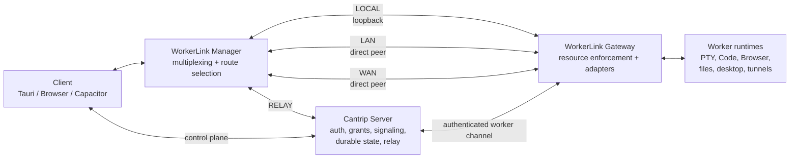
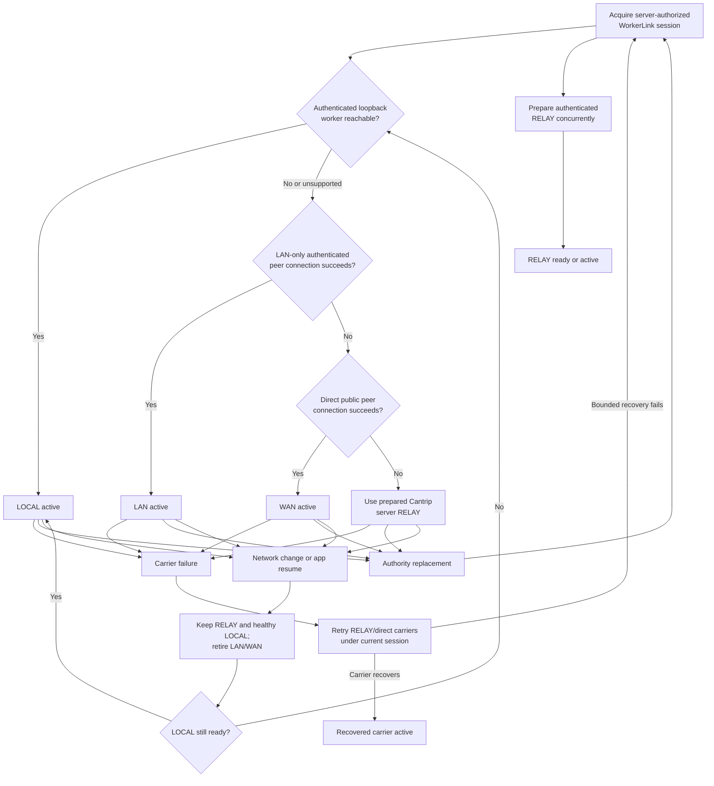
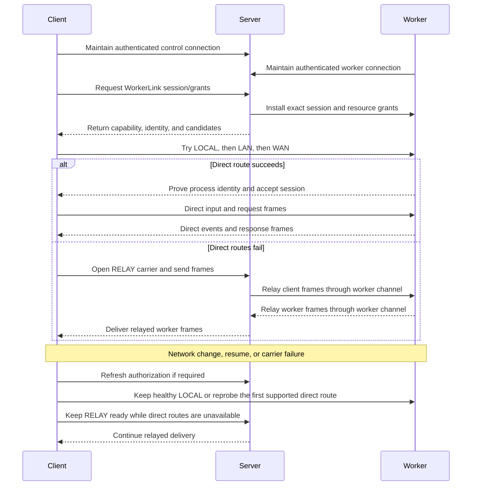
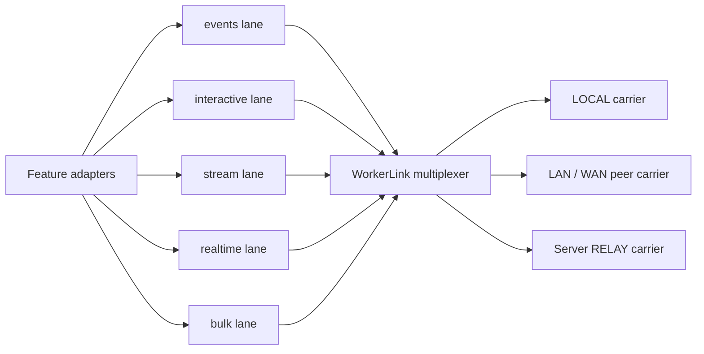
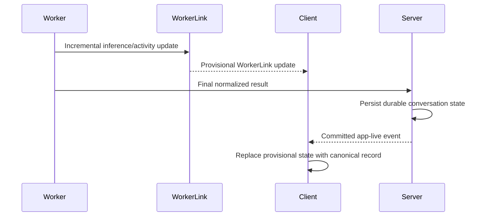
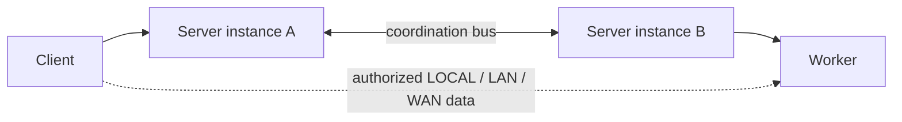

# Client-worker network fabric

- Status: Tranche One and Tranche Two stabilized
- Scope: Client-to-worker latency- and bandwidth-sensitive traffic
- Route priority: `LOCAL -> LAN -> WAN -> RELAY`
- Acceptance: [NETWORK_ACCEPTANCE.md](NETWORK_ACCEPTANCE.md)

Cantrip uses the server as its durable control plane without requiring the
server to relay every byte exchanged between a client and a worker. A client
and worker remain connected to the server for authentication, authorization,
settings, projects, conversations, statistics, signaling, and
revocation. After the server authorizes a client-worker relationship, a shared
network fabric selects the best reachable data route and carries the features
that benefit from lower latency or reduced server bandwidth.

This document defines the implemented architecture and operating boundaries for
that fabric. It extends the
[unified tunnel framework](adr/0007-unified-tunnel-framework.md), the
[server-authorized local-direct data plane](adr/0008-server-authorized-local-direct-data-plane.md),
the [application live transport](LIVE_TRANSPORT.md), and the existing Remote
Surface foundation. The execution history lives in
[NETWORK_PROGRESS.md](NETWORK_PROGRESS.md), and the repeatable final matrix is
recorded in [NETWORK_ACCEPTANCE.md](NETWORK_ACCEPTANCE.md).

## Product decisions

The initial design makes the following decisions:

- Route selection always prefers `LOCAL`, then `LAN`, then `WAN`, and finally
  the Cantrip server `RELAY`.
- Tauri, browser, and Capacitor are first-class clients. Platform boundaries may
  change how a carrier is implemented, but Browser, Code, Terminal, Remote
  Desktop, and worker observations must work inside each supported client.
- Tauri may additionally expose a real localhost port to unrelated desktop
  applications. Browser and Capacitor do not have to expose operating-system
  localhost ports, but in-app consumers must use the same direct fabric.
- VPN interfaces such as Tailscale and ZeroTier are classified as `WAN` unless
  a future explicit deployment allowlist classifies them as LAN.
- `RELAY` means the ordinary authenticated Cantrip server relay. TURN is not
  part of the first implementation.
- Cantrip ships with a default STUN service configuration for WAN discovery.
  Deployments may override or disable it.
- A valid Cantrip account session is sufficient device authorization. There is
  no additional trusted-device approval layer.
- WorkerLink incremental chat and worker observations are provisional. Final chat
  messages and durable state continue through the server.
- An interrupted TCP or WebSocket stream may reconnect after route selection
  restarts. Arbitrary byte streams are not transparently resumed.
- Different logical channels may temporarily use different effective routes.
  The client still reports one preferred route for the overall worker link.
- A worker starts its authenticated peer gateway automatically. Possession of
  an address is not authorization to use it.

## Goals

- Avoid server relay latency and bandwidth whenever the authorized client and
  worker can communicate directly.
- Give features one transport API instead of feature-specific direct probes,
  sockets, relay URLs, and fallback rules.
- Preserve server ownership of durable state, authorization, routing policy,
  and revocation.
- Preserve correctness when direct networking is unavailable.
- Support network mobility, including transitions between Wi-Fi and cellular.
- Support multiple clients per worker and multiple workers per account.
- Remain compatible with a horizontally replicated server deployment.
- Isolate interactive, realtime, event, and bulk traffic so one consumer cannot
  starve another.

## Non-goals

- Operating without the Cantrip server.
- Giving a client a reusable worker credential or unrestricted worker origin.
- Trusting a hostname, IP range, subnet match, or client claim as identity.
- Scanning a local network for workers.
- Exposing Chromium CDP to clients. CDP remains worker-internal; Browser tab
  frames, input, and typed control messages use the fabric.
- Providing transparent resumption for an arbitrary already-open TCP stream.
- Adding TURN in the first implementation.
- Replacing server-to-server coordination. The fabric is independent of the
  implementation used to coordinate replicated server instances.
- Rerouting traffic whose intentional destination is the Cantrip server.

## Target architecture

The server remains between the client and worker in the control plane. The
selected data-plane carrier may bypass it.



The core abstraction is one transient `WorkerLinkSession` for the exact tuple:

```text
serverId + serverGeneration
+ ownerId + accountSessionId
+ clientInstanceId
+ workerId + workerProcessGeneration
```

Terminal, Code, Browser, Remote Desktop, tunnels, and worker observations open
logical channels on that session. They do not select routes themselves.

## WorkerLink boundary

The application-facing API expresses resource authorization and transport
semantics rather than network topology:

```ts
interface WorkerLink {
  readonly workerId: string;
  readonly preferredRoute: "local" | "lan" | "wan" | "relay";
  readonly session: WorkerLinkSession;

  openStream(
    grant: WorkerLinkResourceGrant,
    lane: WorkerLinkQosLane,
  ): Promise<WorkerLinkStream>;
  openEventSubscription(
    grant: WorkerLinkResourceGrant,
  ): Promise<WorkerLinkStream>;
  reprobe(reason?: WorkerLinkReprobeReason): Promise<void>;

  onRouteChanged(listener: (status: RouteStatus) => void): Unsubscribe;
}
```

A `WorkerLinkManager` owns these sessions and reference-counts their consumers.
Opening Terminal, Browser, and Code against one worker must not create three
unrelated discovery and authentication systems.

Feature code supplies:

- a short-lived server-issued resource grant;
- the required quality-of-service class; and
- its reconnect or subscription behavior.

Feature code does not:

- inspect candidates or addresses;
- compare subnets;
- construct direct or relay URLs;
- perform WebRTC signaling;
- mint or validate worker capabilities; or
- contain the `LOCAL -> LAN -> WAN -> RELAY` decision tree.

## Route selection

The route manager progressively widens the allowed network scope. A failure at
one tier is an expected transition, not a feature error.



### LOCAL

Tauri first attempts the worker's server-advertised `127.0.0.1` broker. The
client consumes a one-use capability and verifies the broker's signed,
process-ephemeral identity. A successful connection to the exact authorized
worker selects `LOCAL`.

A browser renderer cannot treat arbitrary localhost access as trusted and may
not have a native loopback forwarder. If a browser on the worker machine reaches
the worker through WebRTC, reporting it as `LAN` is acceptable.

### LAN

The LAN round permits only candidates classified as local-network candidates:

- private IPv4 interfaces;
- IPv6 link-local or unique-local interfaces; and
- future explicitly allowlisted LAN interfaces.

It excludes server-reflexive, public-internet, VPN, and relay candidates. The
worker sends a bounded candidate advertisement through its authenticated server
connection. The server releases candidates only within an authorized peer
session. The client attempts those candidates; it never scans a subnet.

The connection selects `LAN` only after completing an authenticated handshake
with the exact server-advertised worker process. Address classification limits
the probe scope but does not establish identity or authorization.

### WAN

If the LAN round fails, the route manager performs a WAN-direct ICE round:

- enable the deployment's STUN configuration;
- permit server-reflexive and direct public IPv4 or IPv6 candidates;
- classify VPN candidates as WAN; and
- reject relay candidates during this round.

A successful non-relay peer connection selects `WAN`. Restrictive firewalls,
carrier-grade NAT, symmetric NAT, or blocked UDP may make WAN direct impossible;
that is an ordinary reason to use the server relay.

Cantrip ships a default STUN configuration so WAN discovery works without
requiring every deployment to discover the setting independently. A deployment
may replace the default, supply multiple STUN endpoints, or disable WAN direct.
STUN supplies address discovery only; it does not relay application bytes.

### RELAY

The final route is the authenticated Cantrip server relay. It uses the same
session, resource grants, logical channel identifiers, framing, and payload
protection as the direct carriers.

TURN is not attempted in the initial route chain. Existing TURN-related Remote
Surface configuration may remain compatible during migration, but the target
WorkerLink route named `RELAY` is the ordinary Cantrip server relay.

## Route mobility and recovery

Carrier failure reconnects through the supported priority list. The client also
starts a coalesced mobility reprobe after:

- operating-system network-change notification;
- application resume;
- an explicit authorized call to the public reprobe method.

ICE or sustained carrier failure uses the normal close-and-reconnect path.
Worker process-generation, server generation, account-session, or client
identity changes replace the session rather than acting as routine mobility.

The client coalesces bursts of browser/WebView network-interface, online,
back-forward-cache, and hidden-to-visible lifecycle notifications plus native
Capacitor network and app-state notifications before reprobing. A mobility
reprobe retains an already-ready `RELAY` carrier and a healthy `LOCAL` carrier
while it retires `LAN` and `WAN`. If LOCAL was retained, probing stops there;
otherwise it starts at the first supported direct route—LAN for browser/mobile,
or LOCAL then LAN/WAN where supported. Only streams fixed to a retired carrier
close; streams on surviving carriers continue, and the owning feature
controller reacquires a grant and opens a new stream through the current
priority chain. WorkerLink does not pretend that an arbitrary TCP or event
stream survived the route change.

A same-session renewal with a higher route generation atomically retires the
old carriers, installs the returned authority, and reconnects against that new
generation. A stale generation or changed session, worker process, server
generation, account session, or client identity fails closed and replaces the
session. Routine carrier promotion and demotion do not change the authority
generation.



The relay may be prepared in parallel so the UI does not wait for the complete
direct timeout chain. A direct route that succeeds later promotes new logical
connections away from the relay.

`routeGeneration` is the server-authorized route-policy epoch, not a mutable
label for whichever prepared carrier is currently best. Preparing, promoting,
or demoting a carrier inside one installed policy keeps the same generation so
existing channels can remain pinned to their original effective route while new
channels choose the best ready route. An explicit authority replacement, worker
process replacement, or server control-plane replacement increments the
generation and rejects every older frame.

When a carrier fails, only the streams pinned to that carrier close and
reconnect through the current priority list. When the authority generation
changes, all streams are retired. In either case:

- non-resumable streams close and reconnect;
- a Tauri localhost listener retains its local port;
- event subscriptions reopen automatically;
- Remote Surface channels start a fresh transport generation;
- provisional event state is reconciled; and
- the client requests an authoritative HTTP snapshot if continuity is unclear.

Returning from cellular to Wi-Fi causes a new LAN attempt before WAN or RELAY
when no healthy LOCAL carrier was retained.

## Carriers and platforms

The logical fabric is shared even when platform capabilities require different
carrier implementations.

| Client    | LOCAL                         | LAN/WAN                                                                                     | RELAY                   |
| --------- | ----------------------------- | ------------------------------------------------------------------------------------------- | ----------------------- |
| Tauri     | Authenticated loopback broker | Renderer-owned WebRTC; native tunnels use the bounded native/WebView bridge into WorkerLink | Server binary WebSocket |
| Browser   | Normally unavailable          | WebRTC DataChannels                                                                         | Server WebSocket        |
| Capacitor | Normally unavailable          | WebRTC DataChannels                                                                         | Server WebSocket        |

WebRTC is the common direct carrier for browser and Capacitor and also serves
renderer-owned Tauri channels. The renderer's default `WorkerLinkManager`
installs the feature-neutral `PeerCarrier`; Terminal, generic in-app tunnels,
and Cantrip Code therefore inherit LAN or WAN whenever that carrier wins without
changing their feature-facing APIs. Code retains its existing same-origin
service-worker and WebSocket-shim boundary, while the physical socket beneath
that shim is a WorkerLink stream.

Apple platforms declare a local-network usage description for the Capacitor iOS
app and the packaged macOS Tauri app. Cantrip does not browse or advertise a
Bonjour service: peer discovery and signaling remain server-authorized, so no
`NSBonjourServices` entry is declared. Browser and Capacitor expose only these
in-app surfaces; they do not expose a general operating-system localhost port.

Tauri additionally owns TCP listeners used by unrelated desktop programs.
[ADR 0010](adr/0010-tauri-native-worker-link-carrier.md) selects a bounded
localhost bridge into the WebView's existing WebRTC session. The native Rust
tunnel engine keeps its stable listener, endpoint encryption, nested tunnel
framing, half-close, and backpressure; a loopback-only, generation-fenced
WebSocket hands the physical WorkerLink stream to the renderer. Its one-use,
30-second claim is fenced by native-forward and renderer-claim generations, and
the handshake binds the exact WorkerLink session, account session, client
instance, worker process, route, grant, channel, connection, tunnel, and
attachment identities. Carrier failure rotates the claim and replaces only that
bridge stream without rebinding the public localhost port.

Native Rust WebRTC was rejected because it would duplicate the client ICE,
DTLS, signaling, candidate policy, and QoS implementation. A server-pinned raw
peer socket was rejected because it cannot inherit STUN/ICE WAN traversal
without public worker ports or a second custom hole-punching protocol. These are
implementation choices beneath `WorkerLink`, never feature-level routes.

Browser and Capacitor must actually carry in-app Terminal, Code, Browser,
Remote Desktop, and observation traffic over WebRTC when direct connectivity
succeeds. They do not need to expose an operating-system `127.0.0.1` port to an
unrelated application. In-app Code HTTP and WebSocket traffic can reuse its
service-worker and WebSocket-shim boundaries with `WorkerLink` as the backing
source.

## Multiplexing and quality of service

One logical worker link carries multiple independently bounded lanes:

| Lane          | Delivery                             | Scheduler weight | Initial consumers                                 |
| ------------- | ------------------------------------ | ---------------: | ------------------------------------------------- |
| `interactive` | Reliable, ordered, latency-sensitive |                8 | Terminal, keyboard, pointer, clipboard control    |
| `events`      | Reliable, ordered, small             |                4 | Chat progress, file changes, runtime observations |
| `realtime`    | Unordered, disposable                |                4 | Browser/Desktop frames and cursor images          |
| `stream`      | Reliable, flow-controlled bytes      |                2 | Code, WebSockets, TCP tunnels                     |
| `bulk`        | Reliable, bounded                    |                1 | Future attachments and file transfers             |



Each lane has independent queue, frame, credit, and bandwidth limits. Large
Code responses or tunnel transfers must not delay terminal input or reliable
WorkerLink event traffic. App Live control acknowledgements remain on their
separate transport. Realtime frames may be dropped when superseded; input and
reliable events may not.

The common fabric envelope includes:

- protocol version;
- WorkerLink session ID and route generation;
- the exact resource grant on channel `open`; subsequent frames are bound by
  session and channel identity;
- logical channel and connection identity;
- QoS lane;
- directional sequence;
- open, accept, reject, credit, half-close, close, and data operations; and
- payload-protection metadata.

The existing `tunnel-data-plane-v1` envelope is carried inside a reliable
WorkerLink stream. This preserves the endpoint identity, encryption, and flow
control used by Code, WebDAV, and raw TCP adapters while route selection stays
below them.

## Authorization and identity

A shared peer connection is not a general worker credential. The server issues
short-lived grants such as:

```text
terminal:<terminalId>       exact operation attachment; interactive
tunnel:<tunnelId>           exact attachment; stream (Code, share, generic TCP)
browser:<surfaceId>         exact attachment; interactive + realtime
remote-desktop:<surfaceId>  exact attachment; interactive + realtime
observations:<workerId>     exact subscription attachment and installed topics
```

The server creates a peer session only when the client account session and the
worker enrollment belong to the same account. No additional device-approval
step is required. The server installs the matching session and grants on the
worker before returning the client capability.

The client's durable installation identity is separate from both this peer
session and the server/account authorization binding. Native and browser
installations keep one installation-derived key alias while storing independent
bindings for each server and owner. Switching servers, accounts, routes, or
WebView origins must not replace that installation profile or its private key.
Browser storage is still origin-scoped, so cleared storage uses account
recovery instead of creating a blank encryption profile. Network capabilities
remain short-lived and server-authorized; possession of the local installation
key alone does not grant access to a worker or resource.

On Tauri, each server/account authorization uses a deterministic binding
principal derived from the installation ID plus the server and owner IDs. The
principal is distinct from the installation key alias and from transient
WorkerLink client/session IDs. Migration adds that native principal and grant
without revoking the legacy browser-origin principal. Route changes and relay
reconnects therefore cannot rotate installation custody or select a different
encryption profile.

Every channel-open operation includes a grant. The worker validates:

- owner and account session;
- client instance;
- exact worker and worker process generation;
- resource and attachment identity;
- permitted lanes and operations;
- grant and lease expiration;
- route and server generation; and
- revocation state.

The client does not send its account password, login cookie, or a reusable
worker enrollment secret to the worker. A LAN/WAN address alone reveals no
usable resource. Unauthenticated handshakes are bounded and rate-limited.

WebRTC supplies DTLS encryption. Any native direct socket must use an
authenticated encrypted session with a worker identity pinned through the
server advertisement. Resources that already use endpoint payload encryption
retain it across all carriers.

Ending the account session, deleting or stopping the resource, losing the
worker control channel, lease expiry, or worker/server shutdown revokes the
corresponding grants and closes their channels.

## Worker observations and durable server state

The application live WebSocket remains connected to the server and remains the
source of committed, replayable state. It is not replaced with a direct worker
socket.

WorkerLink adds an authorized `event-subscription` channel for high-frequency,
provisional information. The server issues an exact `observations` resource
grant for one worker, account session, client instance, worker process, route
generation, subscription attachment, and bounded set of topics. The installed
topic metadata is sent only to the worker; the client bearer grant cannot widen
it. The initial topic vocabulary is `chat-progress`, `filesystem`, `worktree`,
and `runtime`:

- incremental inference output;
- agent activity and tool progress;
- filesystem watcher notifications;
- worktree change hints;
- Browser and Code runtime observations; and
- other bounded ephemeral status.

Final and durable information continues through the server:

- final chat messages and conversation history;
- final turn outcomes;
- approvals and interactions;
- settings, project, and policy changes;
- durable Git and worktree summaries;
- resource lifecycle changes.



WorkerLink and canonical events share stable operation, turn, message, and sequence
identities so clients can deduplicate them. If the observation channel loses
continuity, the client drops uncertain provisional state and fetches the
authoritative server snapshot.

The supported application owns one feature-neutral observation client. It
retains one read-only subscription per worker only while visible IDE surfaces
or cached running work demand that worker's topics, with a short grace window
across project switches. Because the client runs inside the shared renderer,
browser, Capacitor, and Tauri clients inherit the same policy-filtered route
selection without feature branches. LOCAL is normally available only to Tauri;
browser and Capacitor normally begin with LAN, then WAN and RELAY. Each
subscription renews its exact grant and reopens through WorkerLink after
mobility, revocation, worker restart, or transport failure.

WorkerLink chat messages use a separate provisional query overlay. Plaintext worker
events carry the same source-event identity into their canonical encrypted
message, while already-protected messages are matched by stable message ID and
protected-content revision. A delayed canonical inference event cannot replace
a newer provisional WorkerLink sequence. The committed app-live event removes the matching
provisional revision; an authoritative final removes remaining provisional
state for that turn. WorkerLink filesystem, worktree, Git, terminal, CodeGraph, and
run-configuration notifications feed the existing query families as short,
coalesced hints rather than introducing feature-owned listeners.

The client validates the subscription attachment and every continuity sequence
before acknowledging credit. A routine `route-replaced` promotion closes the
old attempt, removes that worker's uncertain provisional messages and
inference traces, and reconciles only the query families directly observed on
that worker. A gap, malformed envelope, half-close, queue overflow,
grant-renewal failure, or other unbounded channel loss additionally invalidates
the full active authoritative query snapshot. Both paths retry through
WorkerLink's current LOCAL -> LAN -> WAN -> RELAY priority.

The worker fans eligible events to every authorized subscription while keeping
the existing server delivery unchanged. Protocol validation excludes final
messages, final turn outcomes, approvals and interactions, peer signaling,
provider authentication, and other durable or authority-bearing notifications
from the WorkerLink channel. Each subscription has its own monotonic continuity
sequence and bounded reliable queue; overflow closes that subscription so the
client must resubscribe and reconcile instead of displaying an undetectable
gap.

Filesystem events are normally WorkerLink invalidation hints. Workers may still
send compact worktree and Git summaries to the server when durable coordination
or other clients require them.

## Feature integration

### Terminal

Terminal opens an `interactive` reliable stream. The terminal component
receives a WebSocket-like connection from `WorkerLink`; it no longer selects a
direct URL or a server URL. Existing PTY ownership and server-authorized
lifecycle behavior remain unchanged.

### Browser

Chromium CDP remains private to the worker. Browser tab input, typed control,
frames, and cursor updates use the fabric:

- input and control use `interactive`;
- frames and cursor images use `realtime`; and
- Browser-owned development-service tunnels use `stream`.

Remote Surface frames are fragmented beneath the feature boundary because one
protected frame may be larger than a bounded WorkerLink data message. Reliable
chunks resume across credit returns. The realtime lane finishes its current
frame and retains only the newest successor, so it remains bounded without
permanently starving large screenshots. A ready Browser client sends its
viewport again to request current state and a fresh frame after both lanes are
installed.

The supported Browser client no longer selects Remote Surface WebRTC or a
server WebSocket. WebRTC is a shared WorkerLink carrier, while the legacy
feature-specific Remote Surface transport remains only as a compatibility
surface during the documented soak period.

### Cantrip Code

Code HTTP and WebSocket traffic uses `stream`:

- Tauri retains a stable localhost forwarding URL;
- browser and Capacitor use the Code service-worker and WebSocket shims backed
  by WorkerLink; and
- raw editor ports and credentials remain worker-private.

### Generic tunnels

The existing generic tunnel framing uses `stream`:

- Tauri may expose a real localhost TCP listener for desktop applications;
- browser and Capacitor may use tunnel-backed services within Cantrip; and
- connections intentionally targeting the Cantrip server remain ordinary
  client-server traffic.

### Remote Desktop

Remote Desktop uses:

- `interactive` for pointer, keyboard, clipboard, and lifecycle messages; and
- `realtime` for desktop and cursor frames.

The supported Remote Desktop client obtains one exact attachment grant and
opens both lanes through the same topology-free Remote Surface WorkerLink
client used by Browser. The worker registers the shared Remote Surface adapter
for `remote-desktop`, so protected frame fragmentation, bounded reliable
queues, disposable current-plus-latest realtime output, grant rotation, and
reconnect behavior are identical across both features. The first ready
viewport message republishes current desktop state and encrypted target
inventory after the lanes exist; ordinary later resizes do not repeat that
inventory resync.

The UI reports the effective route for each lane, including mixed fallback.
It no longer selects feature-specific WebRTC, TURN, or a server WebSocket.
Those legacy endpoints remain available only for compatibility during the
documented soak period.

### Worker events

The client subscribes to server-authorized observation topics on the shared
link. The worker publishes only the scopes and event families installed by the
server. Canonical app-live events continue independently.

## Effective per-channel routes

The worker link has one preferred route, but each channel reports its effective
route. This permits partial direct connectivity without forcing every feature
through the least-capable carrier.

```text
Worker: Mac Studio
Preferred route: LAN
Peer latency: 3.4 ms

Terminal             LAN
Chat progress         LAN
Cantrip Code          LAN
Remote Desktop        LAN
Generic TCP tunnel    RELAY - existing reliable stream remains pinned until reconnect
```

A channel follows the global priority list using only carriers that satisfy its
platform and QoS requirements. A new direct Remote Desktop channel may therefore
coexist with an older relayed native tunnel until that reliable tunnel
reconnects.

## Server relay and replicated servers

The server exposes `WorkerLinkRelay` behind the same carrier contract used by
LOCAL, LAN, and WAN. Supported Terminal, Code, tunnel, Browser, Remote Desktop,
and observation clients therefore reach one logical RELAY carrier instead of
choosing a feature-owned topology. Compatibility endpoints remain available to
older clients during the separately documented soak period.

The common relay preserves feature-specific operational controls without
leaking them into adapters:

- account and worker relay-byte quotas apply to payloads in both directions;
- ingress and egress usage is attributed to the bounded Terminal, Code,
  tunnel, project-share, Remote Surface, or observation usage channel;
- Browser and Remote Desktop lanes from one grant share one active Remote
  Surface quota; and
- each QoS lane has its own bounded output queue. Latency-sensitive interactive
  and realtime frames drain before events, stream, and bulk frames, while an
  overflowing lane or a client that stops draining fails closed.

Aggregate relay connection, channel, queued-byte, and per-lane queued-frame
counts are available in operations diagnostics. They contain no account,
worker, resource, candidate, or address labels.

In a replicated deployment:



The client and worker may be attached to different server instances. The
existing server coordination abstraction locates the worker and carries
signaling, grant installation, revocation, and relay frames when required.

WorkerLink depends on a `CoordinationBus` interface rather than directly on
Redis or direct server-to-server sockets. Changing the coordination backend
must not change feature or peer protocols.

Peer candidates, signaling messages, and active route ownership are transient
coordination state. Projects, conversations, grants that require auditability,
and other durable product state remain in PostgreSQL.

### Legacy feature relay compatibility

The feature-owned Terminal, tunnel, and Remote Surface transport endpoints are
deprecated as of 2026-08-27, but remain operational for already-distributed
clients. Current client source does not construct these routes. Every request to
a retained endpoint receives the RFC 9745 `Deprecation` header and a
`rel="deprecation"` link to this policy, and increments one bounded endpoint
counter. The server deliberately omits a `Sunset` header until a specific
removal release is approved.

The compatibility endpoints are not eligible for removal until all of these
conditions hold:

- the date is no earlier than 2026-11-25, providing at least a 90-day soak;
- two stable releases containing the deprecation boundary have shipped;
- every retained endpoint counter has remained at zero in the relevant
  deployment telemetry for 30 consecutive days; and
- the removal is announced as a breaking compatibility change with an operator
  rollback path.

Meeting those conditions permits a removal review; it does not remove the
endpoints automatically. Native cleanup that retires an already-running legacy
direct forward remains available for as long as such forwards can survive an
in-place client upgrade. Supported feature entry points and newly created
forwards continue to use WorkerLink exclusively.

## Observability

Expose to the client:

- preferred worker route;
- effective route per active channel;
- selected route latency;
- last transition and fallback reason;
- current worker process generation;
- reconnect activity; and
- whether direct routing is disabled by deployment policy.

The Settings projection records a bounded transition reason independently of
the fallback reason. It distinguishes initial connection, carrier readiness,
route promotion/demotion, unavailable or failed carriers, ICE failure,
network change, application resume, authorized reprobe, authority replacement,
session renewal, and terminal connection failure. It never exposes addresses,
candidates, session authority, or resource identity.

Export bounded metrics for:

- bytes and connections by `local`, `lan`, `wan`, and `relay`;
- negotiation duration and failure stage;
- route promotion and demotion;
- reconnect and resubscribe attempts;
- observation resynchronization;
- per-lane queue pressure;
- dropped realtime frames; and
- estimated relay bytes avoided.

Metrics and logs must not include account, project, resource, credential,
candidate, or IP-address values as labels. Candidate details may appear only in
an explicitly requested, redacted local diagnostic export.

## Deployment controls

Deployment configuration covers:

- enable or disable LOCAL, LAN, or WAN attempts;
- default and override STUN URLs;
- worker interface denylist or allowlist;
- VPN classification overrides;
- negotiation timeout; `upgradeProbeTimeoutMs` is currently reserved schema
  configuration with no production consumer;
- maximum peer sessions per client and worker;
- per-lane connection, queue, and bandwidth limits; and
- a server-relay-only emergency mode.

Workers expose the peer gateway automatically under the default policy. The
listener binds only the required ephemeral sockets, discloses candidates only
through the authenticated server, rate-limits invalid handshakes, and accepts no
resource operation without an installed grant.

The WorkerLink controls use a separate namespace from the compatibility Remote
Surface ICE settings. `CANTRIP_WORKER_LINK_LOCAL_ENABLED`,
`CANTRIP_WORKER_LINK_LAN_ENABLED`, and `CANTRIP_WORKER_LINK_WAN_ENABLED` control
direct route eligibility. `CANTRIP_WORKER_LINK_STUN_URLS` replaces the default
`stun:stun.cloudflare.com:3478` WAN discovery endpoint; an explicitly empty
value disables STUN discovery. Interface allowlists and denylists are mutually
exclusive, and VPN interfaces remain `WAN` unless named by the explicit VPN LAN
allowlist. Negotiation timeout, client/worker peer ceilings, and bounded
per-lane limits are deployment-controlled. The reserved upgrade-probe timeout
does not currently drive runtime behavior. The emergency
`CANTRIP_WORKER_LINK_RELAY_ONLY` switch overrides every direct-route setting.
None of these WorkerLink controls permits TURN.

## Implementation status

Both implementation tranches are complete. The protocol and client facade,
worker gateway, server session/grant coordinator, LOCAL and RELAY carriers,
renderer-owned LAN/WAN peer carrier, native/WebView tunnel bridge, feature
adapters, scoped observation subscriptions, route mobility, relay
consolidation, and compatibility isolation are implemented.

Supported Terminal, Browser, Remote Desktop, Code, tunnel, project-share, and
observation paths now use WorkerLink. The old feature-specific endpoints remain
deprecated compatibility surfaces and are not the architecture described by
this contract. The tranche-by-tranche evidence and remaining physical-device
coverage are recorded in [NETWORK_PROGRESS.md](NETWORK_PROGRESS.md) and
[NETWORK_ACCEPTANCE.md](NETWORK_ACCEPTANCE.md).

## Validation strategy

Run `pnpm network:acceptance` for the deterministic route, failure, feature,
authorization, replica, and native-bridge matrix. The executable evidence map
and the results, including unavailable physical-device checks, are documented
in [NETWORK_ACCEPTANCE.md](NETWORK_ACCEPTANCE.md).

Build a repeatable network matrix for every migrated feature:

| Scenario                                          | Expected route                                                  |
| ------------------------------------------------- | --------------------------------------------------------------- |
| Tauri and worker on the same machine              | LOCAL                                                           |
| Separate devices on the same ordinary LAN         | LAN                                                             |
| Tailscale or ZeroTier path                        | WAN                                                             |
| Direct public peer connectivity through STUN      | WAN                                                             |
| Direct UDP blocked                                | RELAY                                                           |
| Worker peer listener blocked by firewall          | RELAY                                                           |
| Cellular to Wi-Fi transition                      | Keep healthy LOCAL; otherwise reprobe from LAN                  |
| Wi-Fi to cellular transition                      | Keep healthy LOCAL; otherwise reprobe WAN/RELAY after LAN fails |
| Server replica differs from worker-owning replica | Same route semantics                                            |
| Grant expires or account session ends             | Channel revoked                                                 |

The matrix must cover:

- Terminal input, output, resize, reconnect, and process exit;
- Browser input and disposable frame behavior;
- Code HTTP streaming, WebSockets, HMR, and reconnect;
- generic TCP half-close, backpressure, and listener stability;
- Remote Desktop input and frame congestion;
- provisional chat progress followed by canonical commit;
- file event resubscription and authoritative resync;
- multiple simultaneous clients per worker;
- multiple simultaneous workers per client;
- route-generation rejection of stale frames; and
- server relay correctness with every direct route disabled.

## Acceptance criteria

- Same-machine Tauri selects `LOCAL` for eligible channels.
- Same-LAN Tauri, browser, and Capacitor clients select `LAN` when their
  platform supports the requested feature.
- Internet-reachable peers select `WAN` without using a relay candidate.
- VPN paths are reported as `WAN` by default.
- Failed direct connectivity selects the Cantrip server `RELAY` automatically.
- Network changes preserve RELAY and a healthy LOCAL carrier while retiring
  LAN/WAN. A retained LOCAL stops probing; otherwise the client probes from its
  first supported direct route.
- Browser and Capacitor carry in-app Terminal, Code, Browser, Remote Desktop,
  and worker-observation traffic through WebRTC when a direct route succeeds.
- Every route enforces identical server-issued resource grants.
- A peer listener is unusable by another account, expired session, or
  unauthorized resource.
- Final chat messages remain server-authoritative.
- Incremental chat and worker observations avoid server relay when a direct
  route exists.
- Browser and Remote Desktop frames cannot starve input or reliable events.
- Individual channels may fall back without forcing all other channels off a
  working direct route.
- Feature UI components contain no topology or carrier-selection branches.
- Reconnected streams cannot receive stale frames from a prior route
  generation.
- Multiple server replicas preserve the same authorization and route behavior.
- Server relay remains independently testable and forceable by policy.

## Deferred decisions

- TURN or another non-Cantrip relay carrier.
- Transparent resumption of arbitrary byte streams.
- Additional trusted-device approval beyond account authentication.
- Treating an allowlisted VPN interface as LAN.
- General operating-system localhost tunnel listeners for platforms that do not
  expose the required native APIs.
