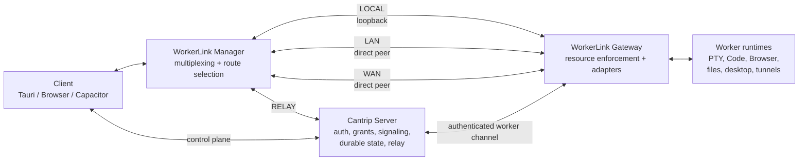
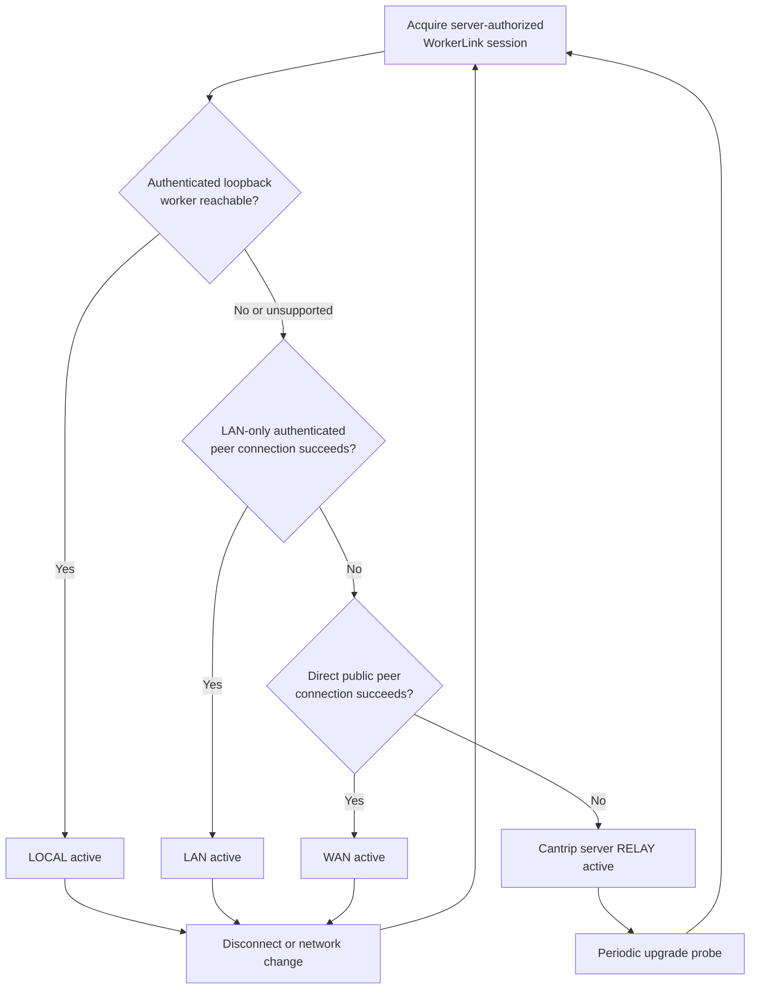
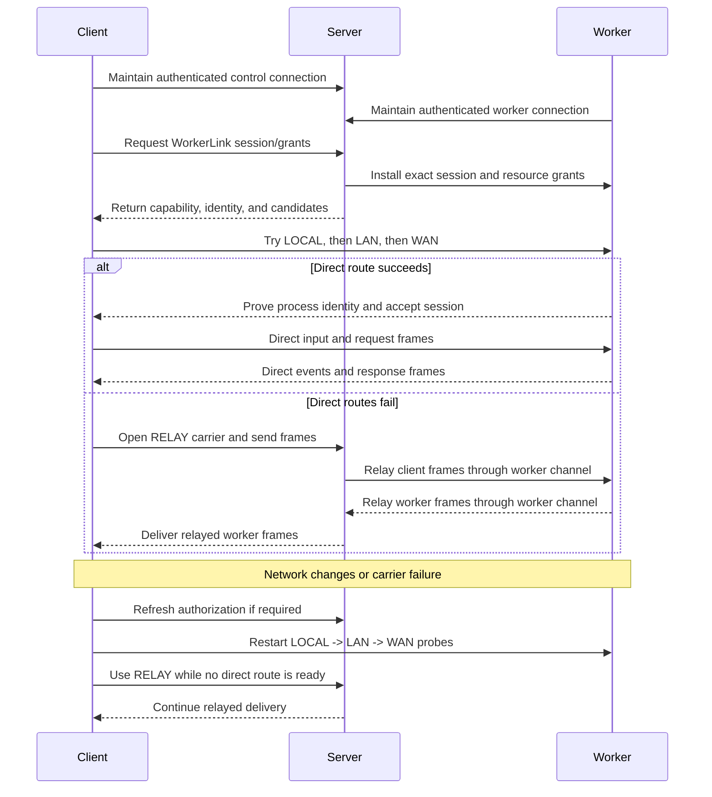
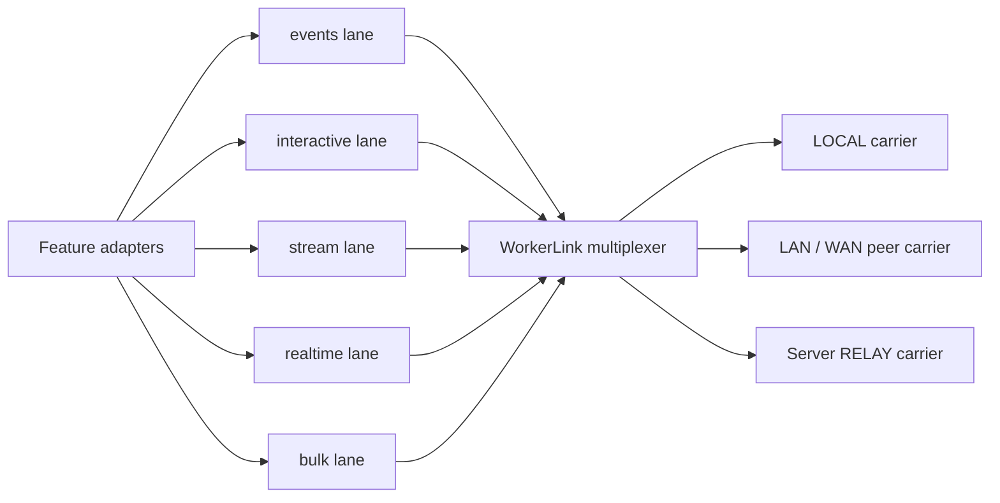
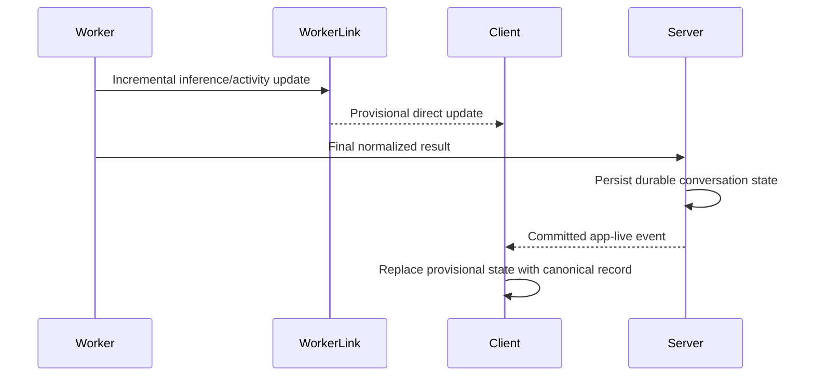
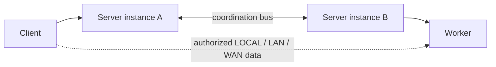

# Client-worker network fabric

- Status: Tranche One implemented; Tranche Two proposed
- Scope: Client-to-worker latency- and bandwidth-sensitive traffic
- Route priority: `LOCAL -> LAN -> WAN -> RELAY`

Cantrip should use the server as its durable control plane without requiring the
server to relay every byte exchanged between a client and a worker. A client
and worker remain connected to the server for authentication, authorization,
settings, projects, conversations, workflow state, statistics, signaling, and
revocation. After the server authorizes a client-worker relationship, a shared
network fabric selects the best reachable data route and carries the features
that benefit from lower latency or reduced server bandwidth.

This document is the implementation plan for that fabric. It extends the
[unified tunnel framework](adr/0007-unified-tunnel-framework.md), the
[server-authorized local-direct data plane](adr/0008-server-authorized-local-direct-data-plane.md),
the [application live transport](LIVE_TRANSPORT.md), and the existing Remote
Surface WebRTC path. It does not describe behavior that is already fully
implemented.

## Product decisions

The initial design makes the following decisions:

- Route selection always prefers `LOCAL`, then `LAN`, then `WAN`, and finally
  the Cantrip server `RELAY`.
- Tauri, browser, and Capacitor are first-class clients. Platform boundaries may
  change how a carrier is implemented, but Browser, Code, Terminal, Remote
  Desktop, and worker observations must work inside each supported client.
- Tauri may additionally expose a real localhost port to unrelated desktop
  applications. Browser and Capacitor do not have to expose operating-system
  localhost ports, but in-app consumers must use the same direct fabric.
- VPN interfaces such as Tailscale and ZeroTier are classified as `WAN` unless
  a future explicit deployment allowlist classifies them as LAN.
- `RELAY` means the ordinary authenticated Cantrip server relay. TURN is not
  part of the first implementation.
- Cantrip ships with a default STUN service configuration for WAN discovery.
  Deployments may override or disable it.
- A valid Cantrip account session is sufficient device authorization. There is
  no additional trusted-device approval layer.
- Direct incremental chat and worker observations are provisional. Final chat
  messages and durable state continue through the server.
- An interrupted TCP or WebSocket stream may reconnect after route selection
  restarts. Arbitrary byte streams are not transparently resumed.
- Different logical channels may temporarily use different effective routes.
  The client still reports one preferred route for the overall worker link.
- A worker starts its authenticated peer gateway automatically. Possession of
  an address is not authorization to use it.

## Goals

- Avoid server relay latency and bandwidth whenever the authorized client and
  worker can communicate directly.
- Give features one transport API instead of feature-specific direct probes,
  sockets, relay URLs, and fallback rules.
- Preserve server ownership of durable state, authorization, routing policy,
  and revocation.
- Preserve correctness when direct networking is unavailable.
- Support network mobility, including transitions between Wi-Fi and cellular.
- Support multiple clients per worker and multiple workers per account.
- Remain compatible with a horizontally replicated server deployment.
- Isolate interactive, realtime, event, and bulk traffic so one consumer cannot
  starve another.

## Non-goals

- Operating without the Cantrip server.
- Giving a client a reusable worker credential or unrestricted worker origin.
- Trusting a hostname, IP range, subnet match, or client claim as identity.
- Scanning a local network for workers.
- Exposing Chromium CDP to clients. CDP remains worker-internal; Browser tab
  frames, input, and typed control messages use the fabric.
- Providing transparent resumption for an arbitrary already-open TCP stream.
- Adding TURN in the first implementation.
- Replacing server-to-server coordination. The fabric is independent of the
  implementation used to coordinate replicated server instances.
- Rerouting traffic whose intentional destination is the Cantrip server.

## Target architecture

The server remains between the client and worker in the control plane. The
selected data-plane carrier may bypass it.



The core abstraction is one transient `WorkerLinkSession` for the exact tuple:

```text
server identity
+ account session
+ client instance
+ worker ID
+ worker process generation
```

Terminal, Code, Browser, Remote Desktop, tunnels, and worker observations open
logical channels on that session. They do not select routes themselves.

## WorkerLink boundary

The application-facing API should express resource authorization and transport
semantics rather than network topology:

```ts
interface WorkerLink {
  readonly workerId: string;
  readonly preferredRoute: "local" | "lan" | "wan" | "relay";

  openStream(grant: ResourceGrant, qos: StreamQos): DuplexStream;
  subscribe(grant: ResourceGrant, topic: string): EventSubscription;
  sendDatagram(grant: ResourceGrant, payload: Uint8Array): boolean;

  onRouteChanged(listener: (status: RouteStatus) => void): Unsubscribe;
}
```

A `WorkerLinkManager` owns these sessions and reference-counts their consumers.
Opening Terminal, Browser, and Code against one worker must not create three
unrelated discovery and authentication systems.

Feature code supplies:

- a short-lived server-issued resource grant;
- the required quality-of-service class; and
- its reconnect or subscription behavior.

Feature code does not:

- inspect candidates or addresses;
- compare subnets;
- construct direct or relay URLs;
- perform WebRTC signaling;
- mint or validate worker capabilities; or
- contain the `LOCAL -> LAN -> WAN -> RELAY` decision tree.

## Route selection

The route manager progressively widens the allowed network scope. A failure at
one tier is an expected transition, not a feature error.



### LOCAL

Tauri first attempts the worker's server-advertised `127.0.0.1` broker. The
client consumes a one-use capability and verifies the broker's signed,
process-ephemeral identity. A successful connection to the exact authorized
worker selects `LOCAL`.

A browser renderer cannot treat arbitrary localhost access as trusted and may
not have a native loopback forwarder. If a browser on the worker machine reaches
the worker through WebRTC, reporting it as `LAN` is acceptable.

### LAN

The LAN round permits only candidates classified as local-network candidates:

- private IPv4 interfaces;
- IPv6 link-local or unique-local interfaces; and
- future explicitly allowlisted LAN interfaces.

It excludes server-reflexive, public-internet, VPN, and relay candidates. The
worker sends a bounded candidate advertisement through its authenticated server
connection. The server releases candidates only within an authorized peer
session. The client attempts those candidates; it never scans a subnet.

The connection selects `LAN` only after completing an authenticated handshake
with the exact server-advertised worker process. Address classification limits
the probe scope but does not establish identity or authorization.

### WAN

If the LAN round fails, the route manager performs a WAN-direct ICE round:

- enable the deployment's STUN configuration;
- permit server-reflexive and direct public IPv4 or IPv6 candidates;
- classify VPN candidates as WAN; and
- reject relay candidates during this round.

A successful non-relay peer connection selects `WAN`. Restrictive firewalls,
carrier-grade NAT, symmetric NAT, or blocked UDP may make WAN direct impossible;
that is an ordinary reason to use the server relay.

Cantrip should ship a default STUN configuration so WAN discovery works without
requiring every deployment to discover the setting independently. A deployment
may replace the default, supply multiple STUN endpoints, or disable WAN direct.
STUN supplies address discovery only; it does not relay application bytes.

### RELAY

The final route is the authenticated Cantrip server relay. It uses the same
session, resource grants, logical channel identifiers, framing, and payload
protection as the direct carriers.

TURN is not attempted in the initial route chain. Existing TURN-related Remote
Surface configuration may remain compatible during migration, but the target
WorkerLink route named `RELAY` is the ordinary Cantrip server relay.

## Route mobility and recovery

Route selection restarts from `LOCAL` after:

- active-carrier failure;
- operating-system network-change notification;
- application resume;
- ICE failure or sustained disconnection;
- worker process-generation change;
- server control-plane generation change; or
- an explicit server-authorized reprobe.



The relay may be prepared in parallel so the UI does not wait for the complete
direct timeout chain. A direct route that succeeds later promotes new logical
connections away from the relay.

Every route change increments `routeGeneration`. Frames from an older route
generation are rejected. On a route change:

- non-resumable streams close and reconnect;
- a Tauri localhost listener should retain its local port when possible;
- event subscriptions reopen automatically;
- Remote Surface channels start a fresh transport generation;
- provisional event state is reconciled; and
- the client requests an authoritative HTTP snapshot if continuity is unclear.

Returning from cellular to Wi-Fi therefore causes a new LAN attempt before the
client settles on WAN or RELAY again.

## Carriers and platforms

The logical fabric is shared even when platform capabilities require different
carrier implementations.

| Client    | LOCAL                         | LAN/WAN                                                                                    | RELAY                   |
| --------- | ----------------------------- | ------------------------------------------------------------------------------------------ | ----------------------- |
| Tauri     | Authenticated loopback broker | WebRTC for renderer-owned channels plus a native peer carrier for operating-system tunnels | Server binary WebSocket |
| Browser   | Normally unavailable          | WebRTC DataChannels                                                                        | Server WebSocket        |
| Capacitor | Normally unavailable          | WebRTC DataChannels                                                                        | Server WebSocket        |

WebRTC is the common direct carrier for browser and Capacitor and should also
serve renderer-owned Tauri channels. The implementation should extract the
current Remote Surface WebRTC machinery into a feature-neutral peer carrier.

Tauri additionally owns TCP listeners used by unrelated desktop programs. An
early implementation spike must select the best native path among:

1. native Rust WebRTC;
2. an encrypted, identity-pinned worker peer socket; or
3. a bounded localhost bridge into the WebView's WebRTC session.

The result must implement the same carrier contract and fabric framing. This is
an implementation choice beneath `WorkerLink`, not a feature-level choice.

Browser and Capacitor must actually carry in-app Terminal, Code, Browser,
Remote Desktop, and observation traffic over WebRTC when direct connectivity
succeeds. They do not need to expose an operating-system `127.0.0.1` port to an
unrelated application. In-app Code HTTP and WebSocket traffic can reuse its
service-worker and WebSocket-shim boundaries with `WorkerLink` as the backing
source.

## Multiplexing and quality of service

One logical worker link carries multiple independently bounded lanes:

| Lane          | Delivery                             | Priority           | Initial consumers                                 |
| ------------- | ------------------------------------ | ------------------ | ------------------------------------------------- |
| `events`      | Reliable, ordered, small             | Highest            | Chat progress, file changes, runtime observations |
| `interactive` | Reliable, ordered, latency-sensitive | High               | Terminal, keyboard, pointer, clipboard control    |
| `stream`      | Reliable, flow-controlled bytes      | Normal             | Code, WebSockets, TCP tunnels                     |
| `realtime`    | Unordered, disposable                | High but droppable | Browser/Desktop frames and cursor images          |
| `bulk`        | Reliable, bounded                    | Low                | Future attachments and file transfers             |



Each lane has independent queue, frame, credit, and bandwidth limits. Large
Code responses or tunnel transfers must not delay terminal input or committed
control acknowledgements. Realtime frames may be dropped when superseded;
input and reliable events may not.

The common fabric envelope should include:

- protocol version;
- peer session and route generation;
- resource grant;
- logical channel and connection identity;
- QoS lane;
- directional sequence;
- open, accept, reject, credit, half-close, close, and data operations; and
- payload-protection metadata.

The existing tunnel data-plane envelope can initially be carried inside a
reliable fabric stream. This preserves current Code, WebDAV, Terminal, and raw
TCP endpoint adapters while route selection moves below them.

## Authorization and identity

A shared peer connection is not a general worker credential. The server issues
short-lived grants such as:

```text
terminal:<terminalId>       interactive + stream
code:<codeSessionId>        stream
browser:<surfaceId>         interactive + realtime
remote-desktop:<surfaceId>  interactive + realtime
tunnel:<attachmentId>       stream
observations:<projectId>    selected event topics
```

The server creates a peer session only when the client account session and the
worker enrollment belong to the same account. No additional device-approval
step is required. The server installs the matching session and grants on the
worker before returning the client capability.

Every channel-open operation includes a grant. The worker validates:

- owner and account session;
- client instance;
- exact worker and worker process generation;
- resource and attachment identity;
- permitted lanes and operations;
- grant and lease expiration;
- route and server generation; and
- revocation state.

The client does not send its account password, login cookie, or a reusable
worker enrollment secret to the worker. A LAN/WAN address alone reveals no
usable resource. Unauthenticated handshakes are bounded and rate-limited.

WebRTC supplies DTLS encryption. Any native direct socket must use an
authenticated encrypted session with a worker identity pinned through the
server advertisement. Resources that already use endpoint payload encryption
retain it across all carriers.

Ending the account session, deleting or stopping the resource, losing the
worker control channel, lease expiry, or worker/server shutdown revokes the
corresponding grants and closes their channels.

## Worker observations and durable server state

The application live WebSocket remains connected to the server and remains the
source of committed, replayable state. It is not replaced with a direct worker
socket.

WorkerLink adds an authorized `worker-observations` channel for high-frequency,
provisional information:

- incremental inference output;
- agent activity and tool progress;
- filesystem watcher notifications;
- worktree change hints;
- Browser and Code runtime observations; and
- other bounded ephemeral status.

Final and durable information continues through the server:

- final chat messages and conversation history;
- final turn outcomes;
- approvals and interactions;
- settings, project, and policy changes;
- durable Git and worktree summaries;
- workflow state; and
- resource lifecycle changes.



Direct and canonical events share stable operation, turn, message, and sequence
identities so clients can deduplicate them. If the observation channel loses
continuity, the client drops uncertain provisional state and fetches the
authoritative server snapshot.

Filesystem events are normally direct invalidation hints. Workers may still
send compact worktree and Git summaries to the server when durable coordination
or other clients require them.

## Feature integration

### Terminal

Terminal opens an `interactive` reliable stream. The terminal component
receives a WebSocket-like connection from `WorkerLink`; it no longer selects a
direct URL or a server URL. Existing PTY ownership and server-authorized
lifecycle behavior remain unchanged.

### Browser

Chromium CDP remains private to the worker. Browser tab input, typed control,
frames, and cursor updates use the fabric:

- input and control use `interactive`;
- frames and cursor images use `realtime`; and
- Browser-owned development-service tunnels use `stream`.

The existing Remote Surface WebRTC implementation becomes a shared carrier
rather than a Browser-specific transport decision.

### Cantrip Code

Code HTTP and WebSocket traffic uses `stream`:

- Tauri retains a stable localhost forwarding URL;
- browser and Capacitor use the Code service-worker and WebSocket shims backed
  by WorkerLink; and
- raw editor ports and credentials remain worker-private.

### Generic tunnels

The existing generic tunnel framing uses `stream`:

- Tauri may expose a real localhost TCP listener for desktop applications;
- browser and Capacitor may use tunnel-backed services within Cantrip; and
- connections intentionally targeting the Cantrip server remain ordinary
  client-server traffic.

### Remote Desktop

Remote Desktop uses:

- `interactive` for pointer, keyboard, clipboard, and lifecycle messages; and
- `realtime` for desktop and cursor frames.

Its feature-owned WebRTC-versus-WebSocket selection is removed after the shared
carrier reaches behavioral parity.

### Worker events

The client subscribes to server-authorized observation topics on the shared
link. The worker publishes only the scopes and event families installed by the
server. Canonical app-live events continue independently.

## Effective per-channel routes

The worker link has one preferred route, but each channel reports its effective
route. This permits partial direct connectivity without forcing every feature
through the least-capable carrier.

```text
Worker: Mac Studio
Preferred route: LAN
Peer latency: 3.4 ms

Terminal             LAN
Chat progress         LAN
Cantrip Code          LAN
Remote Desktop        LAN
Generic TCP tunnel    RELAY - native peer stream unavailable
```

A channel follows the global priority list using only carriers that satisfy its
platform and QoS requirements. A direct Remote Desktop channel may therefore
coexist with a relayed native tunnel until that tunnel can reconnect directly.

## Server relay and replicated servers

The server should expose a `WorkerLinkRelay` behind the same carrier contract.
It can replace separate Terminal, Code, tunnel, and Remote Surface relay paths
incrementally. The logical relay is unified, although implementations may keep
separate bounded physical queues or sockets for reliable and realtime traffic.

In a replicated deployment:



The client and worker may be attached to different server instances. The
existing server coordination abstraction locates the worker and carries
signaling, grant installation, revocation, and relay frames when required.

WorkerLink depends on a `CoordinationBus` interface rather than directly on
Redis or direct server-to-server sockets. Changing the coordination backend
must not change feature or peer protocols.

Peer candidates, signaling messages, and active route ownership are transient
coordination state. Projects, conversations, grants that require auditability,
and other durable product state remain in PostgreSQL.

## Observability

Expose to the client:

- preferred worker route;
- effective route per active channel;
- selected route latency;
- last transition and fallback reason;
- current worker process generation;
- reconnect activity; and
- whether direct routing is disabled by deployment policy.

Export bounded metrics for:

- bytes and connections by `local`, `lan`, `wan`, and `relay`;
- negotiation duration and failure stage;
- route promotion and demotion;
- reconnect and resubscribe attempts;
- observation resynchronization;
- per-lane queue pressure;
- dropped realtime frames; and
- estimated relay bytes avoided.

Metrics and logs must not include account, project, resource, credential,
candidate, or IP-address values as labels. Candidate details may appear only in
an explicitly requested, redacted local diagnostic export.

## Deployment controls

Deployment configuration should cover:

- enable or disable LOCAL, LAN, or WAN attempts;
- default and override STUN URLs;
- worker interface denylist or allowlist;
- VPN classification overrides;
- negotiation and upgrade-probe timeouts;
- maximum peer sessions per client and worker;
- per-lane connection, queue, and bandwidth limits; and
- a server-relay-only emergency mode.

Workers expose the peer gateway automatically under the default policy. The
listener binds only the required ephemeral sockets, discloses candidates only
through the authenticated server, rate-limits invalid handshakes, and accepts no
resource operation without an installed grant.

## Implementation plan

### Phase 1: Protocol and facade

- Add peer-session, route, grant, candidate, signaling, frame, and QoS schemas
  to `@cantrip/protocol`.
- Add the client `WorkerLinkManager` and feature-neutral stream/event APIs.
- Add the worker `WorkerLinkGateway` and resource adapter registry.
- Add the server peer-session and grant coordinator.
- Record a follow-up ADR that generalizes ADR 0008 beyond loopback.

### Phase 2: Preserve existing LOCAL and RELAY behavior

- Implement `LocalCarrier` around the current direct broker.
- Implement `RelayCarrier` around current server routes.
- Put Terminal and generic tunnel adapters behind WorkerLink.
- Confirm route abstraction parity before adding new reachability.

### Phase 3: Cross-platform peer carrier

- Extract Remote Surface WebRTC into a feature-neutral `PeerCarrier`.
- Implement separate LAN-only and WAN-direct candidate rounds.
- Add default STUN configuration with deployment overrides.
- Validate WebRTC DataChannels in Tauri, supported browsers, iOS Capacitor, and
  Android Capacitor.
- Add network-change, suspension, and resume recovery.

### Phase 4: Native tunnel forwarding

- Benchmark the native Rust WebRTC, pinned peer socket, and bounded WebView
  bridge alternatives.
- Implement the selected native carrier beneath the common interface.
- Route Code and generic desktop tunnels over LAN and WAN.
- Preserve Tauri localhost listener ports across carrier reconnects.

### Phase 5: Feature consolidation

- Migrate Browser input, control, and frames.
- Migrate Cantrip Code HTTP and WebSocket traffic.
- Migrate Remote Desktop.
- Remove feature-owned route-selection logic after parity testing.

### Phase 6: Worker observations

- Add scoped observation subscription grants.
- Move incremental inference and activity progress to WorkerLink.
- Move filesystem watcher hints to WorkerLink.
- Retain final server persistence and app-live reconciliation.

### Phase 7: Relay consolidation and cleanup

- Move remaining relay endpoints behind `WorkerLinkRelay`.
- Retain separate QoS queues where needed.
- Deprecate legacy feature-specific relay endpoints after compatibility soak.
- Preserve the deployment-wide relay-only switch.

## Validation strategy

Build a repeatable network matrix for every migrated feature:

| Scenario                                          | Expected route                  |
| ------------------------------------------------- | ------------------------------- |
| Tauri and worker on the same machine              | LOCAL                           |
| Separate devices on the same ordinary LAN         | LAN                             |
| Tailscale or ZeroTier path                        | WAN                             |
| Direct public peer connectivity through STUN      | WAN                             |
| Direct UDP blocked                                | RELAY                           |
| Worker peer listener blocked by firewall          | RELAY                           |
| Cellular to Wi-Fi transition                      | Reprobe, prefer LAN             |
| Wi-Fi to cellular transition                      | Reprobe, prefer WAN, then RELAY |
| Server replica differs from worker-owning replica | Same route semantics            |
| Grant expires or account session ends             | Channel revoked                 |

The matrix must cover:

- Terminal input, output, resize, reconnect, and process exit;
- Browser input and disposable frame behavior;
- Code HTTP streaming, WebSockets, HMR, and reconnect;
- generic TCP half-close, backpressure, and listener stability;
- Remote Desktop input and frame congestion;
- provisional chat progress followed by canonical commit;
- file event resubscription and authoritative resync;
- multiple simultaneous clients per worker;
- multiple simultaneous workers per client;
- route-generation rejection of stale frames; and
- server relay correctness with every direct route disabled.

## Acceptance criteria

- Same-machine Tauri selects `LOCAL` for eligible channels.
- Same-LAN Tauri, browser, and Capacitor clients select `LAN` when their
  platform supports the requested feature.
- Internet-reachable peers select `WAN` without using a relay candidate.
- VPN paths are reported as `WAN` by default.
- Failed direct connectivity selects the Cantrip server `RELAY` automatically.
- Network changes restart selection in `LOCAL -> LAN -> WAN -> RELAY` order.
- Browser and Capacitor carry in-app Terminal, Code, Browser, Remote Desktop,
  and worker-observation traffic through WebRTC when a direct route succeeds.
- Every route enforces identical server-issued resource grants.
- A peer listener is unusable by another account, expired session, or
  unauthorized resource.
- Final chat messages remain server-authoritative.
- Incremental chat and worker observations avoid server relay when a direct
  route exists.
- Browser and Remote Desktop frames cannot starve input or reliable events.
- Individual channels may fall back without forcing all other channels off a
  working direct route.
- Feature UI components contain no topology or carrier-selection branches.
- Reconnected streams cannot receive stale frames from a prior route
  generation.
- Multiple server replicas preserve the same authorization and route behavior.
- Server relay remains independently testable and forceable by policy.

## Deferred decisions

- TURN or another non-Cantrip relay carrier.
- Transparent resumption of arbitrary byte streams.
- Additional trusted-device approval beyond account authentication.
- Treating an allowlisted VPN interface as LAN.
- General operating-system localhost tunnel listeners for platforms that do not
  expose the required native APIs.
