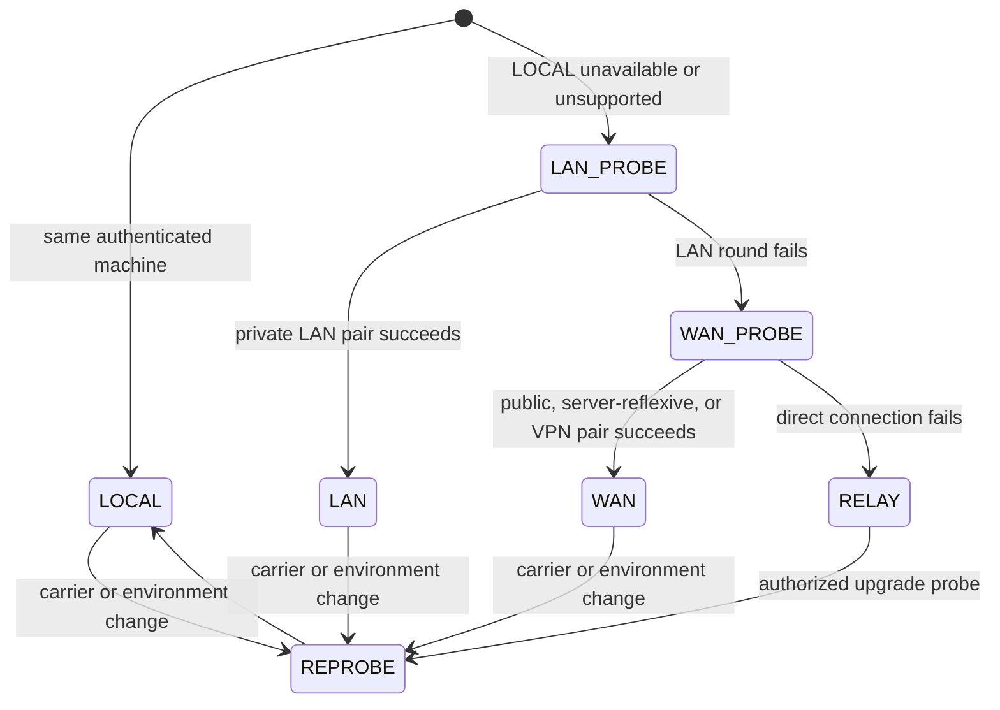

# Tranche Two network acceptance

- Gate: T2.11
- Deterministic run: 2026-08-26
- Base commit: `69f9d1312802d33aab94972062a5220decf36dba`
- Command: `pnpm network:acceptance`
- Result: Pass

This is the repeatable stabilization record for the operational Cantrip
client-worker route fabric. The executable matrix lives in
`scripts/network-tranche-two-acceptance.mjs`; its structural test prevents a
required scenario from disappearing or pointing at a test the runner does not
execute.

The harness uses deterministic carriers, ICE candidates, network changes,
server replicas, grants, worker generations, and bounded queues. It does not
pretend that a simulated topology is a physical-device run.

## Topology and failure matrix

| Scenario                                                | Expected                                                            | Automated result |
| ------------------------------------------------------- | ------------------------------------------------------------------- | ---------------- |
| Tauri and worker on the same machine                    | `LOCAL`                                                             | Pass             |
| Separate devices on an ordinary LAN                     | `LAN`                                                               | Pass             |
| Tailscale interface                                     | `WAN`                                                               | Pass             |
| ZeroTier interface                                      | `WAN`                                                               | Pass             |
| Public direct connectivity through configured STUN      | `WAN`                                                               | Pass             |
| UDP blocked                                             | `RELAY`                                                             | Pass             |
| Worker peer listener blocked                            | `RELAY`                                                             | Pass             |
| Cellular to Wi-Fi                                       | Reprobe and promote new channels to `LAN`                           | Pass             |
| Wi-Fi to cellular                                       | Reprobe to `WAN`, then `RELAY` if direct fails                      | Pass             |
| Client and worker attached to different server replicas | Identical authorization, signaling, route, and revocation semantics | Pass             |
| Grant expiry                                            | Exact channel revocation and safe reopen                            | Pass             |
| Logout                                                  | Account-session revocation on every replica                         | Pass             |
| Resource deletion                                       | Exact resource grant revocation; sibling grants survive             | Pass             |
| Worker restart                                          | Worker-process generation fence and safe reconnect                  | Pass             |
| Server-generation change                                | Stale authority rejected; affected streams reopen                   | Pass             |

`RELAY` is prepared concurrently wherever policy enables it. Successful LAN or
WAN promotion applies to new logical channels; an already-open channel keeps
its effective route until that stream reconnects. No matrix case uses TURN or
a relay ICE candidate.

## Feature matrix

| Surface                        | Acceptance evidence                                                                                                                                              | Result |
| ------------------------------ | ---------------------------------------------------------------------------------------------------------------------------------------------------------------- | ------ |
| Terminal                       | Input, output, resize, exit, replay ordering, credit, reconnect, and LAN/WAN/RELAY parity                                                                        | Pass   |
| Code                           | HTTP streaming, WebSocket ownership, HMR state, transient reconnect, browser service-worker boundary, and protected WorkerLink socket parity                     | Pass   |
| Code/Explorer lifecycle        | No speculative Explorer, stable preview/pinned ownership, exact attachment replacement, visible ready timeout, and reconnect without unrelated UI reconstruction | Pass   |
| Generic TCP                    | Open, data, nested identity, credit, half-close, backpressure, route walk, and stable native listener                                                            | Pass   |
| Browser Remote Surface         | Interactive input remains reliable while frames/cursors are bounded and disposable                                                                               | Pass   |
| Remote Desktop                 | Interactive control, realtime congestion, exact attachment authority, and truthful per-lane routes                                                               | Pass   |
| Worker observations            | Provisional chat/filesystem fan-out, ordered acknowledgement, canonical exclusion, continuity discard, and authoritative resync                                  | Pass   |
| Multiple clients per worker    | Independent sessions and grants with exact revocation isolation                                                                                                  | Pass   |
| Multiple workers per client    | Independent manager links, carriers, channels, and status projections                                                                                            | Pass   |
| Mixed routes                   | Simultaneous LAN and RELAY channels with per-channel failure containment                                                                                         | Pass   |
| Stale route generation         | Client, server relay, peer gateway, and worker reject stale frames and handshakes                                                                                | Pass   |
| Relay-only deployment          | Authority advertises only RELAY and the client never opens a direct carrier                                                                                      | Pass   |
| Browser/Capacitor peer carrier | Authenticated DTLS WebRTC envelope and lane behavior through the shared renderer implementation                                                                  | Pass   |
| Settings Network Map           | Preferred/effective routes, mixed counts, latency, transition/fallback reason, reconnect state, and privacy boundary                                             | Pass   |

## Executed groups

The T2.11 deterministic run passed:

- protocol: 18 assertions;
- browser/Tauri-renderer application: 178 assertions;
- worker gateway and adapters: 42 assertions;
- server authority, relay, and cross-replica coordination: 35 assertions; and
- native Tauri WorkerLink bridge: 5 Rust assertions.

The acceptance PR also runs the full protocol, application, and worker suites,
workspace typecheck/build, Android and iOS Capacitor sync, native formatting and
compile checks, topology/source audits, Code/Codex source verification, CLI
checks, changed-file formatting, and `git diff --check`. Final counts belong in
`NETWORK_PROGRESS.md` so this record does not have to be rewritten for unrelated
future test additions.

## Platform validation boundary

| Platform/topology                                  | Repository validation                                                                                                                   | Physical validation                                                                                          |
| -------------------------------------------------- | --------------------------------------------------------------------------------------------------------------------------------------- | ------------------------------------------------------------------------------------------------------------ |
| Browser                                            | Deterministic `RTCPeerConnection`, authenticated handshake, candidate filtering, DataChannel lanes, fallback, and feature adapters pass | Browser implementation exercised by repository tests; no second physical browser/worker device was available |
| Tauri                                              | Renderer WebRTC plus the bounded native localhost bridge and stable-listener tests pass                                                 | Same-machine native bridge covered; no separate physical LAN/WAN peer was available                          |
| iOS Capacitor                                      | Shared renderer source, native lifecycle/network hooks, build, and Capacitor sync pass                                                  | Not run: no physical iOS device attached                                                                     |
| Android Capacitor                                  | Shared renderer source, native lifecycle/network hooks, build, and Capacitor sync pass                                                  | Not run: no physical Android device attached                                                                 |
| Ordinary LAN, cellular, and restrictive public NAT | Deterministic topology and failure injection pass                                                                                       | Not run: the runner has no independent LAN peer, cellular path, or configurable NAT                          |

The unavailable physical checks are follow-up release QA, not inferred passes.
They do not hide an automated failure and do not weaken RELAY fallback. A future
physical run should append its device, OS, network, and result here without
changing the deterministic matrix.

## Stabilization verdict

The repository acceptance gate finds no remaining Tranche Two implementation
gap. `LOCAL -> LAN -> WAN -> RELAY` is operational beneath WorkerLink; supported
features do not own topology selection; direct traffic retains exact
server-issued authority; cross-replica behavior does not require sticky
sessions; and RELAY remains forceable and independently covered.

Deferred product decisions remain unchanged: TURN, transparent arbitrary TCP
resumption, extra trusted-device approval, VPN-as-LAN allowlisting, and general
operating-system localhost ports for browser or Capacitor.
