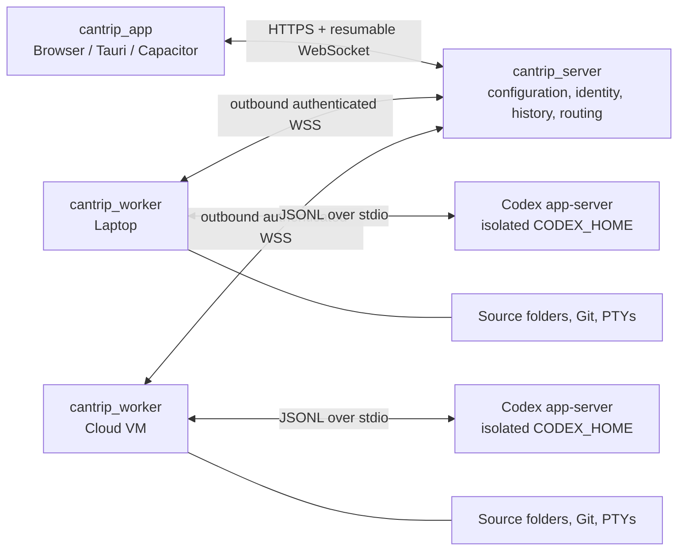

# Cantrip Project Plan

- Status: local and hosted account foundations, independently enrolled workers, portable server-owned ChatGPT/Grok OAuth accounts, multi-worker replicas, Redis relay coordination, fenced scheduling, production deployment assets, and end-to-end durable chat relocation implemented
- Canonical domain: `cantrip.art`
- Desktop/mobile application identifier: `art.cantrip`
- Package manager: pnpm workspaces
- Primary language: TypeScript

## 1. Product vision

Cantrip is a self-hostable, multi-device coding-agent client inspired by the Codex desktop experience. The immediate product is deliberately local: one `pnpm dev` command runs the browser app, server, embedded database, and one worker on the same computer. A user opens the app without signing in, chooses an accessible GitHub repository, and Cantrip clones it into one worker-owned source folder for that project. The boundaries must nevertheless support a browser, Tauri desktop app, or Capacitor mobile app connecting to a remote server and one or more workers later.

The server is the configuration and routing authority. It announces its deployment mode, authentication mode, current user, supported features, and storage/routing rules to every app. It also owns durable Cantrip product state and conversation history. The worker owns machine access: it runs the open-source Codex CLI, reads and writes source files, manages terminals, and enforces local permissions. The app is a control surface that connects only to the server and never assumes project files exist on the device rendering the UI.

Cantrip should support these deployment shapes without maintaining separate products:

1. **Local development:** app, server, worker, PGlite, and Codex all run on one machine.
2. **Personal cloud control plane:** the server runs on a public host while one or more workers connect outbound from private machines.
3. **Fully hosted:** the server and workers run in cloud infrastructure, while the app runs in a browser, Tauri, or Capacitor.
4. **Multi-worker:** a server account can own workers on a laptop, desktop, and VPS. A logical chat has an active worker runtime, but its server-held transcript remains available when that worker is offline and can later be handed to another compatible worker.

The accepted [multi-worker architecture contract](MULTI_WORKER_ARCHITECTURE.md)
defines the terminology, authority boundaries, protocol selectors, placement
resolution, lifecycle state machines, and compatibility rules for delivering
this deployment shape incrementally.

## 2. Goals

- Organize chats inside projects, where each MVP project represents one GitHub repository and one worker-owned source folder.
- Run the open-source Codex CLI through its app-server interface rather than screen-scraping its terminal UI.
- Stream agent messages, plans, reasoning summaries, commands, file changes, diffs, approvals, errors, and token usage into a responsive UI.
- Support interrupting, steering, queued follow-ups, prompt reordering, and explicit context compaction.
- Resume durable chats after app, server, worker, or Codex process restarts.
- Keep conversation history readable from the server while a worker is offline.
- Allow a project or a new chat to select from multiple connected workers.
- Support a future idle-chat handoff to another worker when that worker has a compatible source checkout; do not promise migration of opaque live Codex state.
- Support an anonymous, zero-sign-in loopback mode and a separate hosted account mode with email/password identities.
- Support portable server-owned ChatGPT and Grok/SuperGrok sign-in, account
  status, model catalogs, and quota reporting across workers.
- Support OpenAI-compatible provider profiles with a model, base URL, API key, structured-output capability, tool calling, and reasoning capability metadata.
- Support worker-local providers such as Ollama, where `localhost` refers to the worker rather than the server or UI device.
- Make the browser the fast development harness now, while keeping the frontend portable to Tauri and Capacitor.
- Default to secure local and remote behavior because a compromised control plane can otherwise become remote code execution on a worker.

## 3. Non-goals for the first release

- Reimplementing the Codex agent loop, tools, sandbox, or model context manager.
- Guaranteeing that every model exposed by every OpenAI-compatible provider behaves correctly. Compatibility must be measured per model.
- Moving an active turn or opaque Codex runtime state between workers. A future handoff occurs only at a safe idle boundary and creates or resumes a worker-specific runtime session.
- Multi-user access to one operating-system worker account. Initial workers have one owner and one trust boundary.
- Real-time collaborative editing of project files.
- Building a proprietary relay before the cloud-server and bring-your-own-tunnel paths are proven.
- Horizontally scaling every component in the MVP. Correct durable protocols come first; a single server instance is an acceptable initial deployment.

## 4. Architectural decisions

### 4.1 Codex integration

The worker will spawn `codex app-server` over stdio and act as a supervised protocol bridge. The app server is the programmatic Codex surface intended for rich clients and exposes JSON-RPC methods for authentication, threads, turns, steering, interruption, compaction, approvals, configuration, models, files, and streamed events.

Use stdio between the worker and Codex because it is local, mature, private to the worker process, and does not require exposing Codex's experimental WebSocket listener. Cantrip's own versioned worker protocol will carry commands and events over the network. Neither the browser nor the Cantrip server should talk directly to a Codex app-server socket.

The integration boundary will be a `CodexRuntime` interface. The first and primary implementation is `CodexAppServerRuntime`; a fake runtime will support deterministic tests. This boundary protects Cantrip from Codex schema churn and leaves room for future engines without diluting the initial product.

The initial adapter boundary and worker compatibility report are implemented.
The tested Codex range, live method/feature negotiation, degradation states, and
schema-update procedure are documented in
[`CODEX_RUNTIME_COMPATIBILITY.md`](CODEX_RUNTIME_COMPATIBILITY.md).

The server-owned persistence and API state machine for approvals and structured
user interaction is documented in
[`AGENT_INTERACTIONS.md`](AGENT_INTERACTIONS.md).

The constrained, non-executable workflow graph and orchestration primitive
contract is documented in
[`WORKFLOW_ORCHESTRATION.md`](WORKFLOW_ORCHESTRATION.md).

The worker will:

- detect the installed Codex binary and version;
- enforce a tested minimum/maximum compatibility range;
- generate or validate TypeScript/JSON schemas for the exact Codex version;
- initialize one app-server connection per runtime process;
- translate Cantrip commands into app-server requests;
- normalize stable events while preserving raw payloads for diagnostics;
- restart crashed runtime processes with bounded backoff;
- resume known Codex thread IDs from durable mappings; and
- expose clear incompatibility errors instead of silently dropping unknown events.

Cantrip must distinguish a logical conversation from a worker runtime session. The server's ordered conversation/event history is authoritative for rendering, queueing, audit, offline access, and future worker handoff. A worker's Codex rollout/session data remains authoritative for continuing that particular runtime session. When handing a chat to another worker, Cantrip may replay or summarize server history into a new Codex session, but it must disclose that opaque context, tool state, and uncommitted files do not migrate automatically.

### 4.2 Three product layers



The server is always the rendezvous point. There is no app-to-worker connection mode: worker listing, files, terminals, commands, Codex events, and presence all travel through the server. Workers initiate outbound connections, so a cloud-hosted server does not require an inbound port on a laptop. When a local server eventually needs to reach a phone, a documented reverse proxy, VPN, tunnel, link code, or Cantrip relay can be evaluated after loopback use is complete.

The hosted authentication and ownership trust boundaries, request-principal
contract, generated route/worker-command/repository inventory, and fail-closed
mode rollout are maintained in
[`HOSTED_SECURITY_ARCHITECTURE.md`](HOSTED_SECURITY_ARCHITECTURE.md).

### 4.3 Server authority and client bootstrap

An app starts with only a server origin. Its first request is the server bootstrap document, which includes:

- a stable server ID and protocol version;
- deployment and bootstrap modes (`local`, `hosted`, `pnpm-dev`, `tauri`, and related modes);
- the authentication mode and current Cantrip principal;
- the invariant that workers are server-routed and files are worker-owned;
- server-owned capabilities such as accounts, pairing/link codes, multiple workers, worker switching, Git sync, and worktrees; and
- API/live-transport compatibility information as those protocols mature.

Clients must use this document rather than compile-time assumptions about whether the server is embedded, on loopback, or in the cloud. Unsupported secure modes fail closed at server startup; the foundation must not advertise account or password security before it exists.

In local development, the server binds to loopback, uses one stable anonymous local user, requires no sign-in or connection screen, and is started with the worker and Vite app by `pnpm dev`. A packaged Tauri desktop app supervises deployed server and worker trees with a bundled Node runtime and a dynamic loopback port. Browser-only and Capacitor builds are clients and never bootstrap Node.js services.

Server selection is client-bootstrap state because it must exist before a server can be contacted. The main sidebar exposes a built-in Local connection and named remote server origins. Selecting a profile reloads the app against one origin so HTTP and live transports cannot diverge. Profiles contain only a display name and server origin. The application loads bootstrap and session state before mounting account queries or live subscriptions, keeps CSRF material in memory, relies on the server's HttpOnly session cookie, and scopes durable client caches and live resume cursors by server plus account. Anonymous local bootstrap still enters the workspace without showing an authentication screen.

Standalone no-auth servers fail closed when hosted mode is requested. A non-hosted anonymous server may use `CANTRIP_ALLOW_INSECURE_REMOTE=true` only as a temporary explicit acknowledgement for a separately protected trusted network; it can never enable anonymous hosted mode and is not a security feature. Hosted startup additionally requires PostgreSQL, explicit approved app origins, distinct HTTPS API and Code origins, an envelope-encryption keyring, and an explicit trusted-proxy list.

### 4.4 Technology choices

| Area | Initial choice | Rationale |
| --- | --- | --- |
| Monorepo | pnpm workspaces | Fast installs, strict dependency boundaries, simple recursive scripts. |
| Server | Node.js, TypeScript, Fastify | Mature HTTP/WebSocket lifecycle, schema support, good operational behavior. |
| Database access | Drizzle ORM plus SQL migrations | Typed queries while keeping migrations inspectable and portable. |
| Development database | PGlite on disk | Zero-service local startup with PostgreSQL semantics. |
| Production database | PostgreSQL | Concurrency, durability, backups, and future server scaling. |
| Web app | React, Vite, TypeScript | Fast browser-first harness and a portable UI core. |
| UI system | Tailwind CSS and shadcn/ui | User-requested design system with locally owned components. |
| App data | TanStack Query plus a small local UI store | Server state and transient composer/layout state stay separate. |
| Routing | TanStack Router | Typed browser routes without requiring a full-stack framework. |
| Contracts | Zod schemas in `@cantrip/protocol` | Runtime validation and shared inferred TypeScript types. |
| Live transport | Versioned WebSocket envelopes | Bidirectional commands, approvals, terminal I/O, cursors, and replay. |
| Unit/integration tests | Vitest | Shared TypeScript test tooling across all packages. |
| Browser tests | Playwright | End-to-end local harness and responsive/mobile viewport coverage. |
| Terminal UI | xterm.js in the app; worker-owned PTY | The terminal runs where the files live. |
| Desktop/mobile | Tauri, then Capacitor | Small desktop shell and reuse of the Vite app on mobile. |

Package versions should be pinned during scaffolding rather than embedded in this plan. The root `packageManager` field and lockfile will define the reproducible toolchain.

### 4.5 Worker-owned Remote Surfaces

Browser and remote-desktop tabs use the worker-owned Remote Surface
architecture recorded in
[ADR 0002](adr/0002-worker-owned-remote-surfaces.md). The server stores the
durable session and authorizes attachments, while the selected worker owns
Chromium/CDP or its managed desktop capture/input backend. Apps never receive a worker
origin or raw CDP endpoint.

Every surface has a versioned control plane and binary data plane. Authenticated
WebSocket relay is the mandatory fallback. WebRTC is preferred when negotiation
succeeds, with signaling through the server and relay-only TURN support for
deployments that prohibit direct app-to-worker traffic. Browser and desktop
content render inside the ordinary React tree so the same UI works in Vite,
Tauri, Capacitor, and popout windows without iframe rewriting or native-webview
layering.

The Browser slice is implemented with worker-side Chromium
discovery, persistent profiles, automatic crash recovery, CDP navigation and
loading state, pointer/keyboard/touch input, cursor feedback, explicit
clipboard actions, responsive viewport updates, and one canvas client shared
by Vite, Tauri, and popouts. The obsolete iframe proxy and Tauri child-webview
paths have been removed. WebRTC uses server-minted short-lived TURN REST
credentials, relay-only ICE, separate visual and reliable control data
channels, and automatic WebSocket fallback.

The managed desktop slice is implemented as the `remote-desktop` project tab
type. Creation has no client-supplied configuration: the server resolves the
project source worker, probes its native capture backend, and persists a
worker-owned desktop surface. The worker sends compressed display frames and
accepts pointer, keyboard, and explicit clipboard messages. No desktop port,
password, or worker address exists in the app contract.

Each Remote Desktop tab persists a capture target. Users can switch between
the worker's monitors and individual application windows while connected, and
the worker translates local pointer coordinates into the selected target's
global desktop origin. Application-window input first raises, unminimizes, and
focuses that exact native window; if the operating system refuses activation,
the worker blocks the input rather than clicking an unrelated foreground
window. Native monitor IDs and window IDs are only hints:
reconnect first matches them, then falls back to monitor name or application
and window title. A missing saved application is launched by the worker and
polled for a matching window; the client shows that launch state. If the
target remains unavailable, the stream safely returns to the primary or first
available monitor without discarding the saved preference, so a later refresh
or reconnect can restore it.

Desktop-capable workers are also available through a bounded fleet panel. It
shows each worker's identity, platform, monitor/window inventory, open stream
states, and independent offline/timeout errors. Choosing another worker opens
a separate worker-pinned Remote Desktop at that target; streams are never
stitched together and continue to reconnect independently.

The desktop data plane uses pipelined native capture and JPEG encoding with a
30 FPS default and a best-effort 60 FPS ceiling. Server-owned user settings
select the target frame rate and adaptive quality profile. Payload size,
transport backpressure, and client render feedback tune quality and resolution;
the app keeps only the newest undecoded frame to bound visual latency. A slower
compatibility capture backend remains available when the fast native module is
unsupported.

Operational limits currently bound a worker to four live Remote Surface
sessions and each surface to four attachments. Binary payloads are capped at 4
MiB and WebSocket queues at 8 MiB. Browser visual frames may be discarded under
pressure; reliable control congestion resets the connection instead of
silently corrupting the stream. Clients use bounded exponential reconnects.

### 4.6 Agent-managed Git worktrees

A logical project owns one worker source, and that source owns one non-removable
Primary checkout plus zero or more physical Git worktrees. The worker controls
all canonical paths and validates every checkout against Git's common
directory. The server stores observed metadata for offline rendering and owns
chat execution leases; it does not copy files or accept app-selected target
paths.

Chats default to Agent managed and may transition between worktrees only at a
turn boundary. Pinned chats remain on one selected checkout. Codex runtime
sessions are keyed by chat, worker, and worktree, while a single durable chat
transcript records the originating execution lane for every message and
activity. Terminals and Explorers bind to a worktree, linked consoles inherit
their chat's active lane, History selects a checkout for Git actions, and
Browser/Issues remain project-level. The detailed runtime decision is recorded
in [ADR 0001](adr/0001-agent-managed-worktree-execution.md).

Codex receives no Cantrip-specific dynamic tools. The worker-bundled `cantrip`
CLI provides the worktree, target, Explorer, Terminal, and Browser operations
that need server-owned context or cross-worker routing; normal repository work
continues to use standard shell and Git commands. A transition scheduled during
a turn is checkpointed and applied before the continuation turn; Cantrip never
represents an in-flight CWD mutation as successful. The flat sidebar exposes
only compact secondary-worktree state, while History renders every known HEAD
and dirty WIP lane.

## 5. Monorepo layout

The three named directories are independently runnable deployables. Shared code lives in small internal packages rather than introducing imports between deployables.

```text
Cantrip/
├── cantrip_server/
│   ├── src/
│   │   ├── api/
│   │   ├── auth/
│   │   ├── db/
│   │   ├── events/
│   │   ├── routing/
│   │   ├── workers/
│   │   └── index.ts
│   └── package.json
├── cantrip_worker/
│   ├── src/
│   │   ├── codex/
│   │   ├── files/
│   │   ├── terminal/
│   │   ├── transport/
│   │   ├── security/
│   │   └── index.ts
│   └── package.json
├── cantrip_app/
│   ├── src/
│   │   ├── components/
│   │   │   └── ui/
│   │   ├── features/
│   │   ├── routes/
│   │   ├── stores/
│   │   └── main.tsx
│   ├── src-tauri/          # added when the web vertical slice is stable
│   ├── capacitor.config.ts # added with the mobile milestone
│   └── package.json
├── packages/
│   ├── protocol/           # @cantrip/protocol
│   ├── config/             # @cantrip/config
│   └── testkit/            # @cantrip/testkit
├── docs/
│   ├── PLAN.md
│   └── adr/
├── pnpm-workspace.yaml
├── package.json
└── tsconfig.base.json
```

The npm scope is `@cantrip/*`. The domain is `cantrip.art`; the Tauri bundle identifier and Capacitor `appId` are `art.cantrip`. Suggested hosted origins are `app.cantrip.art`, `api.cantrip.art`, and, only when it exists, `relay.cantrip.art`.

## 6. Core domain model

The database is the source of truth for Cantrip entities. Exact columns can evolve through migrations, but the following boundaries should remain stable.

| Entity | Purpose and important fields |
| --- | --- |
| `users` | Cantrip identity. Local mode has one stable anonymous user; hosted mode later adds email/password accounts. Separate from ChatGPT/model-provider identity. |
| `sessions` | Browser/mobile/desktop sessions and revocation metadata. |
| `workers` | Owner, display name, status, platform, capabilities, protocol version, public key, last seen time. |
| `worker_credentials` | Hashed/encrypted enrollment material and rotation metadata; never raw provider secrets. |
| `projects` | Server-owned logical project name, owner, settings, and optional preferred worker. Physical sources are represented by per-worker replicas. |
| `project_sources` | One worker-owned installation of a logical repository: canonical path, display path, repository fingerprint, Git metadata, and allowed access policy. |
| `project_worktrees` | Durable observations for Primary, Cantrip-managed, agent, user, and external checkouts: worker/path ownership, branch/HEAD, lifecycle, lock, detached, and scan state. |
| `chats` | Server-owned logical conversation with project, title, active worker, runtime profile, status, model, and event cursor. |
| `chat_execution_lanes` | Historical and active chat/worktree leases with actor, purpose, transition state, base/starting revision, runtime association, and lifecycle timestamps. |
| `project_branch_leases` | Project-wide logical Git branch mutation fences shared by chat execution lanes and workflow worktree leases across every worker replica. |
| `chat_runtime_sessions` | Mapping from one logical chat to a worker- and worktree-specific Codex thread/session, active model route, status, and replay/handoff metadata. |
| `chat_messages` | Ordered server-held conversation history that remains readable independently of worker availability, including the concrete model route/provider audit for dispatched user turns. |
| `turns` | Cantrip projection of Codex turns, status, timestamps, usage, and error summary. |
| `chat_inputs` | Durable prompt queue with mode, ordering key, idempotency key, delivery state, and optional expected turn ID. |
| `chat_events` | Append-only normalized event log with per-chat ordering, raw payload, and deduplication key. |
| `pending_requests` | Approvals, user-input prompts, or elicitation requests awaiting a client response. |
| `model_providers` | Independent API endpoints or ChatGPT, Grok, and SuperGrok provider groups, including server-held endpoint configuration. |
| `model_provider_accounts` | Stable provider-account identity, encrypted OAuth credential envelope and revision, refresh coordination, global auth/quota state, and worker-independent catalog scope. |
| `model_profiles` | Logical user-facing models selected by chats and queued prompts, with a default reasoning effort and routing policy. |
| `model_routes` | Ordered provider bindings for a logical model: provider-specific model name, enabled state, priority, and optional reasoning override. |
| `tunnels` | Owner-scoped logical routes with explicit source and destination endpoints, optional organizational project association, management policy, desired/observed state, and aggregate traffic counters. |
| `tunnel_attachments` | Revocable consumers of a logical tunnel, including desktop loopback listeners and server relays, with hashed credentials, leases, status, and per-attachment counters. |
| `audit_events` | Security-sensitive operations such as pairing, terminal creation, approvals, policy changes, and secret updates. |

A project source path is meaningful only on its worker. Two workers may bind the same logical project to different clones and different absolute paths. The server stores only source metadata and paths needed for routing; it does not mirror the working tree or file contents. File reads, edits, Git operations, and terminals always execute on the selected worker.

The server keeps the ordered transcript and enough normalized events to render a chat while its worker is offline. The worker keeps the Codex rollout/session files required to resume model context. If those files are lost, the transcript remains viewable. A later handoff can attach the logical chat to another worker by creating a new runtime session from server history, provided that worker has a matching source binding. The UI must distinguish a seamless session resume from a history-based handoff.

Local worktree isolation is implemented within one worker source. Cross-worker Git synchronization remains a later subsystem: it may coordinate repository remotes, commits, and compatible checkouts across workers, but Cantrip must never assume that equal project IDs imply equal files. Uncommitted changes require an explicit transfer strategy and are outside the current worktree model.

### 6.1 GitHub-backed project creation

The local MVP does not expose an arbitrary filesystem picker. The app asks the server for repositories available through a selected worker; the worker uses GitHub CLI authentication or a worker-local `GH_TOKEN`, lists repositories accessible to that identity, and clones the selected repository beneath Cantrip's worker data directory. GitHub credentials never enter the app or server database.

The server records the GitHub repository ID and enforces one Cantrip project per `(user, GitHub repository)`. The repository picker marks existing projects and the database unique constraint is the final race-safe guard. The server stores the worker path as routing metadata, while all Git and file operations still execute on the worker.

## 7. Protocols and state flow

### 7.1 App-to-server API

Use ordinary versioned HTTP endpoints for snapshots and mutations, plus one authenticated WebSocket for live events. During the foundation the paths use `/api`; they will move behind a stable `/v1` compatibility boundary before remote clients ship. Initial endpoint groups should include:

- `/api/bootstrap` for server-announced deployment, identity, routing, storage, and capability configuration;
- `/v1/session/*` for Cantrip authentication;
- `/v1/workers/*` for pairing, listing, status, and capabilities;
- `/v1/projects/*` and `/v1/project-sources/*` for logical projects and worker paths;
- `/v1/chats/*` for chat creation, metadata, history, archive, and routing;
- `/v1/chats/:id/inputs` for start, steer, or queue behavior;
- `/v1/chats/:id/interrupt` and `/v1/chats/:id/compact`;
- `/v1/chats/:id/pending-requests/:requestId/respond` for approvals and questions;
- `/v1/runtime-profiles/*` for provider/auth/model configuration; and
- `/v1/tunnels/*` for owner-authorized tunnel configuration, attachments, and lifecycle actions; and
- `/v1/events` for a cursor-based WebSocket stream.

Every mutation receives an idempotency key. The server acknowledges durable acceptance, while later events describe dispatch, execution, and completion. Reconnecting clients provide their last event cursor, receive missed events, and then continue live. Initial page load uses a database snapshot followed by events after the snapshot cursor to avoid gaps.

### 7.2 Worker-to-server protocol

Workers connect outbound over authenticated WSS and send a handshake containing worker identity, worker protocol version, Codex version, OS, architecture, shell, capabilities, and runtime-profile health. Commands and events use a separate, versioned Cantrip envelope rather than leaking raw Codex JSON-RPC as the public API.

Required transport properties:

- monotonically ordered worker event sequence numbers;
- command IDs and idempotent acknowledgements;
- durable command leases so a server restart does not duplicate a turn;
- a small worker-side outbox for events produced while disconnected;
- server acknowledgements so the outbox can be pruned safely;
- heartbeat and explicit offline detection;
- bounded queues, backpressure, retry with jitter, and payload size limits; and
- protocol negotiation with a clear upgrade-required state.

The first server can be a single process. PostgreSQL-backed command leasing and connection ownership should be designed before horizontal server scaling. PGlite remains a single-process development and personal-local option.

### 7.3 Chat actor and prompt queue

There is at most one active Codex turn per chat. The server owns a small per-chat state machine and persists every transition.

```text
offline -> idle -> dispatching -> running -> idle
                   running -> waiting_for_approval -> running
                   running -> interrupted -> idle
                   running -> failed -> idle
                   idle/running -> compacting -> idle
```

Inputs have explicit behavior:

- **Start:** if the chat is idle, create the next turn immediately; otherwise reject or queue according to the request.
- **Steer:** call `turn/steer` with the active `expectedTurnId`. If the turn ended during the race, atomically queue the message only when the client sent `fallback: "queue"`; otherwise return a conflict.
- **Queue:** persist the prompt for a future turn. Pending prompts can be edited, reordered, or deleted. Once dispatch begins they become immutable.
- **Interrupt:** call `turn/interrupt`, wait for the terminal turn event, then dispatch the next queued input.
- **Compact:** call `thread/compact/start`, render the resulting compaction item, and block ordinary turn dispatch until compaction finishes.

Queued prompts live in the Cantrip database, outside Codex model context, until dispatched. This makes prompt ordering resilient to browser disconnects and server restarts.

### 7.4 Event normalization

The UI should render stable Cantrip events for:

- user and agent messages, including commentary/final phases;
- plan updates and reasoning summaries;
- command start, output deltas, completion, and exit status;
- file changes and aggregate diffs;
- approvals and structured user questions;
- token usage, context compaction, warnings, and errors;
- worker and runtime connectivity; and
- terminal sessions and file-watch invalidations.

Store the source Codex method and raw payload alongside normalized data. Unknown Codex events should be logged and retained, not treated as fatal and not exposed directly to untrusted clients.

## 8. Worker design

### 8.1 Runtime supervision

`cantrip_worker` is a long-running Node.js service suitable for direct execution, launchd/systemd, or a container. It owns:

- the authenticated connection to `cantrip_server`;
- Codex installation/version discovery;
- an isolated `CODEX_HOME` per runtime profile;
- Codex app-server process lifecycle and JSONL parsing;
- thread/runtime lookup and resumption;
- source-root registration and path enforcement;
- user terminal PTYs;
- local secret storage and provider environment variables;
- a durable event outbox; and
- resource limits and health reporting.

Runtime processes should be pooled by a security boundary such as `(owner, runtime_profile)`, not spawned once per prompt. A process may host multiple threads when they share credentials and configuration. The worker must cap concurrent turns and processes so a prompt storm cannot exhaust the machine.

### 8.2 Files and terminals

The worker is the only component allowed to dereference a source path. All file operations must resolve an absolute canonical path and verify it remains inside an approved project root after symlink resolution.

The initial file surface should include directory listing, metadata, bounded text reads, file watching, and Git status/diff. Editing remains primarily agent-driven at first. Binary previews and large-file streaming can follow.

User terminals are separate from agent command items. A worker-owned PTY provides shell I/O to xterm.js through the server. Terminal creation must specify a registered source root, use resize/backpressure controls, redact environment metadata, have idle expiration, and be disabled for remote clients unless the worker owner enables it.

### 8.3 Local worker state

Store worker state under a Cantrip-owned data directory, never inside a source repository. It contains worker identity, source registrations, runtime-profile metadata, isolated Codex homes, and the unsent event journal. Secrets use the OS credential store when possible, with a `0600` encrypted-file fallback and a visible warning when secure storage is unavailable.

Do not silently reuse or modify the user's default `~/.codex` directory. A later opt-in migration can import an existing Codex profile, but Cantrip-owned profiles should remain isolated and reversible.

## 9. Authentication and model providers

### 9.1 Separate identities

Cantrip authentication controls who may access the server and workers. Codex/ChatGPT authentication controls model access from a runtime profile. These are separate identities with separate logout, revocation, and audit behavior.

The first local-only product intentionally has no account, sign-in, connection, or pairing flow. A loopback server exposes one stable anonymous local principal and the app enters it immediately. This mode is permitted only while bound to loopback and must use strict origin checks, JSON-only mutation bodies, and browser hardening so unrelated websites cannot silently drive the API. Binding publicly or enabling a remote client must require an explicit transition to a protected mode.

Personal-server protection supports a password, while hosted mode supports email/password accounts, secure revocable sessions, CSRF protection, ownership checks, and controlled registration. These modes are server-announced and the client completes authentication before mounting account-owned resources.

Workers pair using a high-entropy, short-lived, single-use code generated for a signed-in owner. On success, the worker stores a unique rotatable credential and stable identity locally with owner-only permissions; the server stores only its hash, scopes, owner/worker binding, timestamps, and revocation state. Hosted worker routes reject the legacy shared token and verify the credential's immutable worker ID and route scope. Provider credentials never become worker enrollment credentials.

The account-scoped Workers settings page is the management boundary for this lifecycle. It reports presence, last-seen time, platform/runtime capabilities, project-source associations, and redacted credential metadata. Pairing displays the raw link code only while onboarding is active. Rename uses a durable display alias that heartbeat updates cannot overwrite. Rotation transfers the replacement credential over the already-authenticated worker channel when online and otherwise displays it once for manual secret-manager installation. Unlinking revokes credentials and hides the worker without deleting server-owned projects or conversations; re-enrolling the same immutable identity restores its associations. Embedded and `pnpm dev` workers are visibly internal and cannot be renamed or removed.

Bootstrap advertises `linkCodes` and `multipleWorkers` now that enrollment and the complete management lifecycle are available. `gitSync` is advertised only with the guarded exact-revision replica job lifecycle, and `workerSwitching` is advertised with the durable context-handoff, target-hydration, placement-commit, and recovery runtime. The Workers settings page also owns the account Default worker and automatic replica provisioning/synchronization policies, while Project Settings owns the per-project preferred worker and explicit replica controls.

For `pnpm dev` and the embedded Tauri runtime, server and worker may share a development-only token through explicit loopback bootstrap configuration. The server refuses that path in standalone, password, account, non-loopback, and hosted modes. It is bootstrap plumbing, not remote enrollment, and the app never receives it.

### 9.2 Provider-account authentication

ChatGPT and Grok/SuperGrok accounts are portable server resources. An online
worker may run the initial browser or device-code login, but the server validates
the resulting provider identity and stores the durable OAuth credential as an
account-specific AES-256-GCM envelope. Workers request short-lived access-token
leases through their own owner-bound machine credentials; refresh and rotating
refresh-token persistence are serialized by credential revision and a database
lease.

ChatGPT runtimes use Codex 0.148's experimental `chatgptAuthTokens` login mode.
The worker supplies a leased access token, account/workspace ID, and plan type to
`account/login/start`, then answers
`account/chatgptAuthTokens/refresh` by forcing a newer server lease. Grok keeps
the worker-local loopback subscription proxy and its xAI headers, path/origin
restrictions, request limit, and single 401 retry, but its token source is the
same server lease service. Normal server-managed operation writes neither
`auth.json` nor `grok-auth.json` on the worker.

Legacy worker-local credentials remain a temporary compatibility path. A
connected worker captures and validates the credential, the server durably
encrypts it, and only then does the worker purge the matching local file.
Conflicting identities fail closed. ChatGPT migration stops the affected runtime
and removes the local file without calling ordinary Codex logout, because logout
would revoke the credential just imported by the server. If the only legacy copy
is offline, the status explicitly asks for that original worker to reconnect.

The complete ownership, refresh, migration, lifecycle, and threat contract is
maintained in
[`PROVIDER_AUTHENTICATION.md`](PROVIDER_AUTHENTICATION.md).

### 9.3 Model profiles and provider routes

A provider contains an endpoint or isolated ChatGPT, Grok, or SuperGrok account and its secret reference. A logical model profile contains one or more ordered provider routes. Each route supplies the provider-specific model name, enabled state, priority, and optional reasoning override. A one-provider model is represented by one route rather than a separate model type.

The initial routing policy is deterministic priority failover. Before a turn, the server skips disabled routes, account-backed providers known to be signed out or missing the selected model, ChatGPT accounts out of weekly usage, and routes in a short failure cooldown. The selected route is fixed for the turn. Cantrip may automatically try the next route after a quota, authentication, availability, or connection failure only when the failed route produced no command or file activity. Once activity begins, retrying is an explicit user action so work cannot be executed twice. Queued prompts retain the logical model and resolve their route only when dispatched.

When routing changes to a different Codex runtime, the server starts a new underlying thread and hydrates it from server-owned conversation history. Compaction, steering, interruption, synchronization, and the linked console continue using the concrete route attached to the active runtime session.

The worker renders the selected route into its Cantrip-owned Codex configuration and injects API keys through environment variables rather than writing secrets into TOML.

Important compatibility boundary: current Codex custom model providers use the OpenAI Responses wire API. A configurable base URL does not automatically make a Chat-Completions-only endpoint compatible. OpenRouter or another proxy must expose sufficiently compatible Responses streaming, tool calling, reasoning, and structured output for the selected model. Ollama can use Codex's OSS/provider configuration and requires no key; `localhost` resolves on the worker.

Provider setup therefore includes an explicit test action and a capability result, not a blanket compatibility promise. Probe and record:

- basic streaming response;
- Codex tool-call round trip;
- parallel tool behavior where applicable;
- reasoning summaries or reasoning item support;
- JSON-schema structured output using `turn/start.outputSchema`;
- image input if selected; and
- context-window/model errors.

The UI must disable unsupported options and label unverified models. If important providers remain Chat-Completions-only, a worker-local Responses translation adapter can be evaluated later. That adapter is not part of the initial Codex integration and would require its own conformance and safety tests.

### 9.4 Secret distribution

The server stores provider API keys only as authenticated, versioned AES-256-GCM envelopes. Hosted deployments must supply an operator-owned keyring and identify its active key. Older keys remain available during rotation; startup verifies every envelope, migrates legacy plaintext rows, and rewraps older envelopes with the active key. Anonymous local development generates a private mode-0600 key in the ignored server data directory so the zero-configuration loop remains intact.

The app receives only `hasApiKey` metadata and redacted provider-account state.
A decrypted API key exists in server memory only while resolving an authorized
model route and is sent solely to the assigned authenticated worker. ChatGPT and
Grok refresh tokens remain inside the server process and encrypted database
envelopes. Workers receive bounded access-token leases and identity metadata only;
those leases are neither exposed to app APIs/live events nor written to their
provider credential directories.

No plaintext provider secret may appear in logs, database rows or JSON payloads, event streams, generated support bundles, or browser storage. Database backups must be paired with the relevant encryption keyring, and retired keys must not be removed until all envelopes have been rewrapped and a verified backup has been taken.

## 10. App experience

The first UI is a responsive browser application built with Vite, React, Tailwind, and shadcn/ui. Components remain in `cantrip_app` so they can be reused unchanged by Tauri and Capacitor.

Primary surfaces:

- a project and chat sidebar with worker status and unread/running indicators;
- project creation with a worker selector and worker-backed source-folder browser;
- a chat transcript that virtualizes long event histories;
- a composer with steer/queue behavior, attachments, queue chips, reorder, and delete;
- inline plan, reasoning-summary, command, diff, approval, and error cards;
- interrupt, compact, retry, archive, pin, and new-chat controls;
- a worker/source/model/permission header for the current chat;
- an optional file/diff inspector and terminal drawer;
- worker pairing, runtime profile, ChatGPT login, provider, and quota settings; and
- offline/reconnecting states that preserve drafts and clearly distinguish app, server, worker, and model failures.

Desktop layout can use three resizable panes. Mobile uses the transcript as the primary screen, with projects, queue, files, and terminals in full-height sheets. The app should never require the source tree to exist locally, which keeps the same component model valid on phones.

The Tauri milestone adds native notifications, secure storage for any remote Cantrip session, deep links, updater configuration, and management of the local server/worker process tree. Opening the desktop app in local mode should start or attach to the server and worker, wait for readiness, open the UI, and terminate owned child processes cleanly. Packaging may use directly supervised processes or containers after distribution constraints are measured.

The Capacitor milestone adds secure session storage, deep links, push notifications, background reconnect behavior, and mobile-safe approval/terminal UX. Capacitor and ordinary browser builds only connect to an already running server; they cannot bootstrap the Node.js server or worker. Both native shells use `art.cantrip` as the application identifier.

## 11. Security model

Remote worker control is a remote-code-execution product by design, so security requirements are part of the MVP rather than a cleanup phase.

- Bind the local server to loopback by default and require an explicit configuration to listen publicly.
- Require TLS/WSS, authenticated Cantrip sessions, strict origin validation, and short-lived pairing codes for remote use.
- Make workers outbound-only and scope each worker credential to one owner and one worker ID.
- Validate project ownership and worker/source binding on every chat command.
- Default new projects to Codex workspace-write sandboxing with approvals; make danger-full-access an explicit per-worker choice.
- Persist and surface pending approvals with thread, turn, item, actor, and expiry information.
- Deny or cancel pending privileged work if the worker loses its trusted server connection for too long.
- Canonicalize paths and test traversal, symlink escape, case sensitivity, UNC paths, and platform path differences.
- Rate-limit prompt submission, pairing, auth, terminal creation, file reads, and approval responses.
- Redact credentials and sensitive environment values from logs and support bundles.
- Add CSP, secure cookies, CSRF protections, WebSocket origin checks, and no secret-bearing browser local storage.
- Record auditable events without recording terminal keystrokes or raw secrets by default.
- Treat Codex app-server, source folders, provider profiles, and plugins as worker-local trust boundaries.
- Perform dependency/license review of the open-source Codex distribution before bundling it into Tauri or hosted worker images.

Multi-user workers and shared organization projects require OS/container isolation, role-based authorization, and a stronger tenancy review. They should not be enabled by reusing the single-user worker design.

## 12. Development workflow

The root workspace should expose a small predictable command set:

```text
pnpm install
pnpm dev             # server + worker + Vite app, all watching
pnpm dev:postgres    # same stack against disposable PostgreSQL
pnpm build
pnpm check           # typecheck + lint + formatting check
pnpm test
pnpm test:e2e
```

Suggested local defaults:

- Vite app: `http://localhost:5173`;
- server/API: `http://localhost:4310`;
- PGlite data and all generated local state: `.cantrip/dev/`, gitignored;
- server mode: local deployment, `pnpm-dev` bootstrap, no authentication, one anonymous local user;
- worker connects to the local server and retries until it is ready;
- app learns deployment and capability details from `/api/bootstrap` and contains no worker address; and
- development builds use the pinned `cantrip_codex` source snapshot, packaged Workers carry the resulting runtime bundle, and an explicit `CANTRIP_CODEX_BIN` or `PATH` lookup remains a development fallback.

Use pnpm's recursive/parallel scripts before adding a monorepo task orchestrator. Add caching/orchestration only when build timings justify the extra layer.

Configuration uses validated environment variables and config files with documented precedence. Anonymous mode remains loopback-only by default. Password and account modes use revocable sessions, while hosted startup fails closed without PostgreSQL, explicit HTTPS public and Code origins, approved application origins, a bounded trusted-proxy list, and an operator-owned envelope-encryption keyring. Multi-instance hosted deployments additionally require Redis coordination and a configured hard replica ceiling.

## 13. Testing strategy

### Unit tests

- queue ordering, edit/delete rules, and steer-to-queue races;
- chat state transitions and idempotency;
- Codex event normalization and unknown-event preservation;
- path canonicalization and source-root authorization;
- secret redaction;
- provider capability interpretation; and
- frontend transcript reducers and reconnect merging.

### Contract tests

- generate fixtures from the pinned/tested Codex app-server schema;
- validate every supported request, response, notification, and server request;
- replay recorded streams through the worker bridge;
- keep worker/server/app protocol compatibility tests independent of Codex internals; and
- fail clearly when a new Codex version removes or changes required fields.

### Integration tests

- run server migrations against both PGlite and PostgreSQL;
- use a fake Codex runtime to test deterministic prompts, deltas, approvals, failures, and compaction;
- run an opt-in real-Codex smoke suite for initialize, login status, thread start/resume, turn, steer, interrupt, compact, and approval paths;
- kill and restart each component during active and idle chats;
- inject duplicate, delayed, missing, and out-of-order worker messages; and
- verify worker offline outbox replay without duplicate transcript items.

### End-to-end tests

- zero-sign-in local bootstrap and server-announced configuration;
- create a project from a worker folder and start a chat;
- stream a command and file diff, respond to approval, and finish the turn;
- steer a running turn and reorder queued prompts;
- compact and resume after a full stack restart;
- keep history readable with a worker offline, then hand an idle logical chat to a compatible worker-specific runtime session;
- enroll a worker with empty provider credential homes, list account-backed
  ChatGPT and Grok models, complete turns through existing server accounts, and
  preserve the selected logical model through worker relocation;
- configure API-key and keyless local profiles using fake providers; and
- cover desktop and phone-sized layouts in Playwright.

## 14. Observability and operations

Cantrip now uses a shared structured operational-log contract with request,
command, worker, project, chat, turn, workflow/run, and surface correlation IDs.
Server and worker records are sanitized once before they fan out to the colored
console, bounded service buffer, and rotated JSONL sink. Deliberate client and
native Tauri lifecycle events use the same vocabulary and reach the desktop
console plus Settings → Logs. Remote worker reads remain owner-authorized and
server-routed; embedded-server logs remain local to their owning Tauri
installation. Noise controls summarize repeated failures and sample only
explicit high-volume diagnostics. Prompts, transcripts, terminal I/O,
browser/desktop contents, diffs, raw RPC, and credentials remain outside the
contract. `docs/SERVICE_LOGS.md` is the source, retention, redaction, and
operator runbook.

The server also exposes protected aggregate Prometheus metrics for HTTP/database health, connected workers, command activity, live connections, tunnel/relay traffic, quota rejection, scheduler throughput/lag, and scheduler lease contention/recovery. Extend them with active turns, queue latency, event lag, Codex process restarts, approval wait time, provider errors, and WebSocket reconnects as those runtime counters become available.

`/healthz` distinguishes process liveness from database and optional Redis coordination readiness. Redis-backed worker leases, routed commands/data planes, and live invalidation fanout support multiple relay instances, with a configured replica ceiling conservatively partitioning global quotas. Scheduled workflow and project-automation occurrences use PostgreSQL leases plus fencing tokens, allowing crash recovery without accepting a stale dispatcher's completion. Future probes should add migration status and explicit required-worker readiness. Worker health reports should distinguish server connectivity, Codex availability, provider auth, runtime crash loops, disk pressure, and source availability.

For PostgreSQL deployments, document migrations, backups, point-in-time recovery expectations, and restore tests. PGlite deployments should expose a safe export/backup command and warn that they are not multi-server databases.

## 15. Delivery phases

### Phase 0: foundation and contracts

- Scaffold the pnpm workspace and three deployables. (Implemented.)
- Add shared TypeScript, formatting, test, and build configuration. (Implemented; lint follows when source volume warrants it.)
- Make `pnpm dev` supervise PGlite, server, worker, and Vite with clean Ctrl+C teardown. (Implemented.)
- Add server-announced bootstrap configuration and the anonymous local principal. (Implemented.)
- Establish PGlite/PostgreSQL migrations for users, workers, projects, worker source bindings, logical chats, worker runtime sessions, and server-held messages. (Initial schema implemented.)
- Persist worker heartbeats and expose initial project/chat/message HTTP contracts through `@cantrip/protocol`. (Implemented.)
- Extend `@cantrip/protocol` with versioned command/event envelopes and live transport negotiation.
- Build a fake worker and fake Codex runtime before UI work depends on the real CLI.
- Record architecture decisions for protocol versioning, auth, event storage, and secret handling.

Exit: one root command starts a typed app/server/worker stack, the app renders server-announced configuration and persisted worker presence, initial server-owned history survives restart, and CI runs checks and database migrations.

### Phase 1: local vertical slice

- Supervise Codex app-server over stdio.
- Bootstrap the loopback-only server, anonymous local user, and worker without a sign-in or connection screen.
- Discover GitHub repositories through the worker, clone one into its managed data directory, create a project/chat, and create/resume a Codex thread.
- Stream agent messages, plans, commands, file changes, diffs, errors, and usage.
- Implement approvals, interruption, steering, durable queueing, and compaction.
- Persist/replay chat events and resume after process restarts.
- Build the shadcn browser UI with responsive project/chat/composer flows.

Exit: a developer can use Cantrip locally in the browser for a real repository without reaching for the Codex TUI.

### Phase 2: runtime profiles and local tools

- Add isolated Codex homes and a runtime process pool. The local vertical slice now has server-owned settings, per-message logical model selection, isolated provider runtimes, and ordered provider-route failover.
- Add server-owned portable ChatGPT and Grok/SuperGrok browser/device login,
  logout, account display, model catalog, and rate-limit UI. (Implemented.)
- Add API-key/base-URL and keyless Ollama profiles.
- Add explicit model capability tests and structured-output probes.
- Add the worker-backed file browser and Git status/diff. The initial server-routed, worker-owned PTY terminal is implemented; idle expiration, backpressure, and remote opt-in hardening remain.
- Add worker resource limits, crash recovery, and compatibility reporting.

Exit: one local worker can safely switch between verified ChatGPT, API/proxy, and local-model profiles.

### Phase 3: cloud server and multiple workers

- Add email/password accounts, protected personal-server modes, sessions, and revocation.
- Add secure worker enrollment, credential rotation, ownership, and outbound WSS.
- Route projects and chats to selected account-owned workers through the server only.
- Add idle-chat handoff using worker-specific runtime sessions and explicit history replay/summarization semantics.
- Require a compatible project source binding and surface Git/revision differences before handoff.
- Add durable worker commands, leases, outbox replay, and offline UI.
- Test PostgreSQL deployments, backups, and server restart recovery.
- Harden all authorization, path, approval, terminal, and secret boundaries.

Exit: a public Cantrip server can coordinate multiple private workers without inbound worker ports, and a phone browser can steer and approve work.

### Phase 4: packaged apps and remote-local access

- Package the Vite UI with Tauri using identifier `art.cantrip`.
- Make Tauri bootstrap and supervise the local server/worker lifecycle while retaining the same server bootstrap contract.
- Package the same UI with Capacitor and add push notifications/deep links.
- Document reverse-proxy, VPN, and tunnel setups for a local server.
- Evaluate a `relay.cantrip.art` outbound tunnel only after the threat model, cost model, and existing tunnel UX are measured.

Exit: browser, desktop, and mobile clients share the same protocol and can reconnect to long-running work.

### Phase 5: hardening and advanced workflows

- Add organization roles only with a complete tenancy model.
- Add chat fork/branch and export/import.
- Extend the implemented local worktree workflows with Git-assisted cross-worker synchronization and explicit transfer handling for uncommitted changes.
- Harden the implemented native customization and scheduled workflow controls for authenticated hosted deployment; enable plugin mutations only after the pinned Codex App Server exposes a stable contract.
- Add protocol compatibility matrices, upgrade tooling, load tests, and disaster-recovery exercises.

The implemented local workflow boundary is specified in the
[orchestration contract](WORKFLOW_ORCHESTRATION.md) and
[ADR 0004](adr/0004-codex-native-workflow-control-plane.md). Operational
recovery, trigger trust, migration, backup, and rollback guidance lives in the
[workflow operations guide](WORKFLOW_OPERATIONS.md); the final evidence and
pull-request ledger live in the
[workflow implementation audit](WORKFLOW_IMPLEMENTATION_AUDIT.md).

## 16. MVP acceptance criteria

The first meaningful release is complete when all of the following are true:

- `pnpm dev` starts app, server, worker, and PGlite locally.
- The browser app discovers local/no-auth mode from the server and opens as the anonymous local user without a connection screen.
- The app contains no direct worker origin; every worker interaction routes through the server.
- A user can choose an accessible GitHub repository, create a unique single-source project and chat, and run a real Codex turn.
- The UI accurately streams and restores messages, plans, command output, file changes, diffs, approvals, errors, and completion state.
- Steering targets the active turn; queued prompts survive restart and run in the chosen order.
- Every project source has Primary; chats can be Agent managed or Pinned; the Cantrip CLI can move managed chats through isolated worktree runtimes without changing an in-flight CWD.
- Terminal, Explorer, linked console, and History operations resolve through their explicit worktree, while the flat sidebar and History graph retain offline and historical worktree context.
- Interrupt and explicit context compaction work and leave the chat resumable.
- Restarting the browser, server, worker, or Codex runtime does not duplicate completed inputs or lose accepted queued inputs.
- Conversation history remains readable from PGlite when the worker is stopped; files remain worker-only.
- ChatGPT and Grok login may run on any online worker; the completed account,
  quota/catalog state, encrypted credential, refresh authority, and global
  lifecycle belong to the server. A newly enrolled worker can use the existing
  logical model profiles without provider sign-in or durable local credentials.
- A tested OpenAI-compatible profile and a worker-local Ollama profile can run, with unsupported capabilities visibly disabled.
- A trusted workflow can execute bounded Codex nodes, survive durable-boundary restarts, isolate mutations in leased worktrees, and be invoked through explicitly enabled schedule/API/webhook/Git/saved-command triggers without adding a second agent runtime.
- Security tests cover unauthorized chat access, forged worker events, replayed commands, path traversal, symlink escape, secret leakage, and approval spoofing.

## 17. Major risks and mitigations

| Risk | Mitigation |
| --- | --- |
| Codex app-server evolves quickly. | Pin a tested range, generate schemas from the installed CLI, isolate it behind `CodexRuntime`, preserve unknown events, and run compatibility CI. |
| Codex 0.148's `chatgptAuthTokens` methods are experimental. | Pin exactly 0.148 in packaged workers, capability-gate login, test the refresh server request, and fail with an explicit compatibility error before using a server-owned ChatGPT account. |
| Arbitrary provider/model compatibility is uneven. | Require Responses compatibility, probe capabilities per model, label unverified models, and avoid claiming universal support. |
| A server compromise can become worker RCE. | Outbound authenticated workers, strict ownership, sandbox defaults, source scoping, approval UX, secret isolation, audit logs, and focused security testing. |
| Server and Codex histories diverge. | Treat the server log as logical conversation/UI authority and each worker's Codex rollout as runtime-continuation authority; reconcile by stable IDs/cursors and label history-based handoffs. |
| Disconnects duplicate prompts or events. | Durable idempotency keys, command leases, worker sequence numbers, acknowledgements, and replay tests. |
| Chat handoff is mistaken for seamless runtime migration. | Keep worker-specific runtime-session records, permit handoff only while idle, verify source compatibility, and clearly disclose replay/summarization and non-migrated state. |
| PGlite hides production concurrency problems. | Run the integration suite against PostgreSQL from the beginning and use Postgres for public/multi-instance deployments. |
| Mobile backgrounding drops sockets. | Persist all accepted state on the server, reconnect by cursor, and use push notifications only as hints. |
| Bundling Codex creates update or licensing obligations. | Complete license/distribution review, expose the runtime version, and provide a controlled upgrade/compatibility policy before packaging. |

## 18. Decisions to make during Phase 0

These decisions should become short ADRs before implementation spreads their assumptions:

1. Exact password, link-code/device-token, recovery, and hosted authentication design beyond the fixed loopback anonymous mode.
2. Worker credential format, rotation, and public-key scheme for end-to-end provider-secret provisioning.
3. Event retention, transcript export, raw-payload retention, and privacy defaults.
4. Codex CLI upgrade policy after the initial bundled-source decision: upgrades are manual Worker releases, with compatibility validation before changing the pin.
5. Worker local journal implementation and corruption recovery behavior.
6. Whether terminal access ships in the first public release or remains an opt-in experimental capability.
7. First officially tested OpenRouter and Ollama model/provider combinations.
8. Deployment ownership of `app.cantrip.art`, `api.cantrip.art`, updates, and a possible future relay.

## 19. First implementation sequence

The first engineering pass should follow one end-to-end path rather than building all layers in isolation:

1. Complete the current foundation: local process supervision, server bootstrap, anonymous identity, database-backed workers/projects/chats/messages, and the shadcn status UI.
2. Add worker-side GitHub authentication discovery, repository listing, and managed cloning through the server. (Implemented for GitHub CLI or `GH_TOKEN`.)
3. Add the project/chat sidebar and persisted chat composer, initially polling for completed agent messages. (Implemented; healthy app state now uses the singleton resumable application-control WebSocket, with HTTP snapshots retained for recovery. See the [live transport audit](LIVE_TRANSPORT_AUDIT.md).)
4. Supervise Codex app-server over stdio and run local Ollama/Gemma turns. Persist Markdown responses, command lifecycle activity, and turn-level workspace file changes. (Initial implementation complete.)
5. Persist inputs, turns, normalized events, queue state, and cursors; complete one reconnect-safe real turn.
6. Add approvals and interrupt, then steering and the durable queue, then compaction.
7. Add runtime profiles and ChatGPT device/browser login.
8. Add custom-provider secret handling and capability probes.
9. Add file browsing/diffs and terminal sessions.
10. Run restart, duplicate-message, path-security, and PostgreSQL parity tests before beginning cloud deployment, accounts, or multi-worker routing.

## 20. Codex references used by this plan

The integration assumptions above are based on the current official Codex documentation:

- [Codex app-server](https://learn.chatgpt.com/docs/app-server) for JSON-RPC lifecycle, threads, turns, steering, compaction, approvals, schemas, events, account methods, and model capabilities.
- [Codex authentication](https://learn.chatgpt.com/docs/auth) for ChatGPT, API-key, device-code, credential storage, and custom-provider authentication behavior.
- [Codex advanced configuration](https://learn.chatgpt.com/docs/config-file/config-advanced#custom-model-providers) for custom providers, base URLs, environment-key authentication, Responses wire compatibility, and local OSS providers.
- [Codex prompting](https://learn.chatgpt.com/docs/prompting#steering-and-queuing) for user-facing steer versus queue behavior.

These are integration dependencies, not APIs Cantrip should expose directly. The worker compatibility layer remains responsible for changes in future Codex releases.
