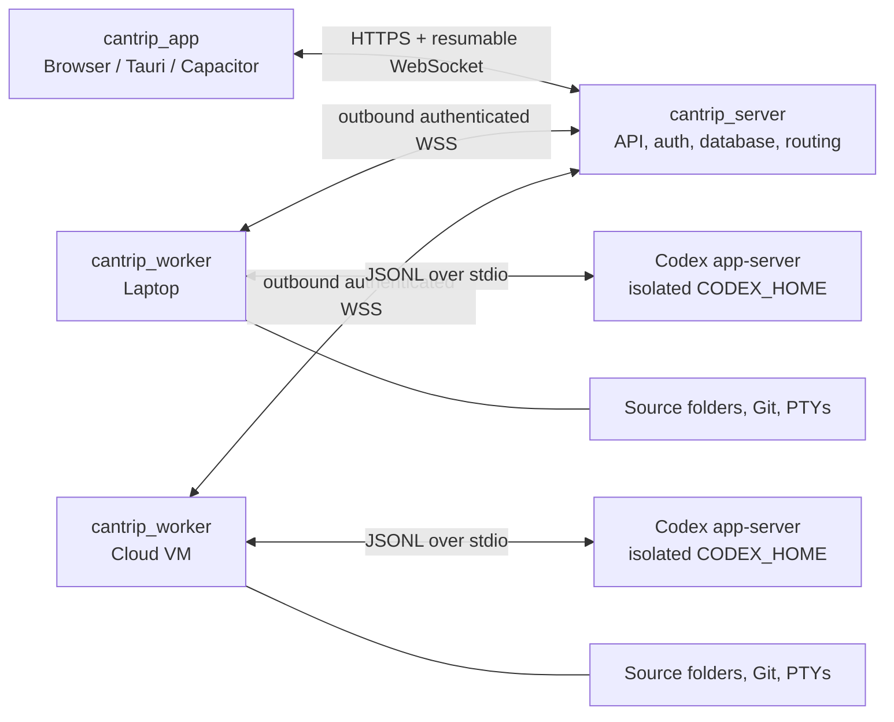

# Cantrip Project Plan

- Status: initial architecture plan
- Canonical domain: `cantrip.art`
- Desktop/mobile application identifier: `art.cantrip`
- Package manager: pnpm workspaces
- Primary language: TypeScript

## 1. Product vision

Cantrip is a self-hostable, multi-device coding-agent client inspired by the Codex desktop experience. A user should be able to run the entire system on one computer, open the browser UI, link a source folder, and use Codex against that folder. The same protocol should also support a browser, Tauri desktop app, or Capacitor mobile app connecting to a remote server and one or more workers.

The worker owns machine access. It runs the open-source Codex CLI, reads and writes source files, manages terminals, and enforces local permissions. The server owns durable product state, routing, synchronization, and remote access. The app is a control surface and never assumes that project files exist on the device rendering the UI.

Cantrip should support these deployment shapes without maintaining separate products:

1. **Local development:** app, server, worker, PGlite, and Codex all run on one machine.
2. **Personal cloud control plane:** the server runs on a public host while one or more workers connect outbound from private machines.
3. **Fully hosted:** the server and workers run in cloud infrastructure, while the app runs in a browser, Tauri, or Capacitor.
4. **Multi-worker:** a project has a default worker, and each chat is pinned to the worker and source binding on which its Codex thread runs.

## 2. Goals

- Organize chats inside projects linked to real source folders on workers.
- Run the open-source Codex CLI through its app-server interface rather than screen-scraping its terminal UI.
- Stream agent messages, plans, reasoning summaries, commands, file changes, diffs, approvals, errors, and token usage into a responsive UI.
- Support interrupting, steering, queued follow-ups, prompt reordering, and explicit context compaction.
- Resume durable chats after app, server, worker, or Codex process restarts.
- Allow a project or a new chat to select from multiple connected workers.
- Support Codex-managed ChatGPT sign-in and its Codex quota reporting.
- Support OpenAI-compatible provider profiles with a model, base URL, API key, structured-output capability, tool calling, and reasoning capability metadata.
- Support worker-local providers such as Ollama, where `localhost` refers to the worker rather than the server or UI device.
- Make the browser the fast development harness now, while keeping the frontend portable to Tauri and Capacitor.
- Default to secure local and remote behavior because a compromised control plane can otherwise become remote code execution on a worker.

## 3. Non-goals for the first release

- Reimplementing the Codex agent loop, tools, sandbox, or model context manager.
- Guaranteeing that every model exposed by every OpenAI-compatible provider behaves correctly. Compatibility must be measured per model.
- Moving a live chat between workers. A chat is pinned to its worker in the first release; changing a project's default worker affects new chats.
- Multi-user access to one operating-system worker account. Initial workers have one owner and one trust boundary.
- Real-time collaborative editing of project files.
- Building a proprietary relay before the cloud-server and bring-your-own-tunnel paths are proven.
- Horizontally scaling every component in the MVP. Correct durable protocols come first; a single server instance is an acceptable initial deployment.

## 4. Architectural decisions

### 4.1 Codex integration

The worker will spawn `codex app-server` over stdio and act as a supervised protocol bridge. The app server is the programmatic Codex surface intended for rich clients and exposes JSON-RPC methods for authentication, threads, turns, steering, interruption, compaction, approvals, configuration, models, files, and streamed events.

Use stdio between the worker and Codex because it is local, mature, private to the worker process, and does not require exposing Codex's experimental WebSocket listener. Cantrip's own versioned worker protocol will carry commands and events over the network. Neither the browser nor the Cantrip server should talk directly to a Codex app-server socket.

The integration boundary will be a `CodexRuntime` interface. The first and primary implementation is `CodexAppServerRuntime`; a fake runtime will support deterministic tests. This boundary protects Cantrip from Codex schema churn and leaves room for future engines without diluting the initial product.

The worker will:

- detect the installed Codex binary and version;
- enforce a tested minimum/maximum compatibility range;
- generate or validate TypeScript/JSON schemas for the exact Codex version;
- initialize one app-server connection per runtime process;
- translate Cantrip commands into app-server requests;
- normalize stable events while preserving raw payloads for diagnostics;
- restart crashed runtime processes with bounded backoff;
- resume known Codex thread IDs from durable mappings; and
- expose clear incompatibility errors instead of silently dropping unknown events.

Cantrip must not reconstruct Codex's model context from UI messages. Codex's rollout/session data on the worker remains authoritative for agent continuation. The Cantrip database stores a replayable UI projection, routing metadata, queue state, and audit data.

### 4.2 Three product layers



The server is always the rendezvous point from the app's perspective. Workers initiate outbound connections, so a cloud-hosted server does not require opening an inbound port on a laptop. When the server itself is local and a phone needs remote access, the first supported solution should be a documented reverse proxy, VPN, or tunnel. A Cantrip relay can be designed after this flow is working.

### 4.3 Technology choices

| Area | Initial choice | Rationale |
| --- | --- | --- |
| Monorepo | pnpm workspaces | Fast installs, strict dependency boundaries, simple recursive scripts. |
| Server | Node.js, TypeScript, Fastify | Mature HTTP/WebSocket lifecycle, schema support, good operational behavior. |
| Database access | Drizzle ORM plus SQL migrations | Typed queries while keeping migrations inspectable and portable. |
| Development database | PGlite on disk | Zero-service local startup with PostgreSQL semantics. |
| Production database | PostgreSQL | Concurrency, durability, backups, and future server scaling. |
| Web app | React, Vite, TypeScript | Fast browser-first harness and a portable UI core. |
| UI system | Tailwind CSS and shadcn/ui | User-requested design system with locally owned components. |
| App data | TanStack Query plus a small local UI store | Server state and transient composer/layout state stay separate. |
| Routing | TanStack Router | Typed browser routes without requiring a full-stack framework. |
| Contracts | Zod schemas in `@cantrip/protocol` | Runtime validation and shared inferred TypeScript types. |
| Live transport | Versioned WebSocket envelopes | Bidirectional commands, approvals, terminal I/O, cursors, and replay. |
| Unit/integration tests | Vitest | Shared TypeScript test tooling across all packages. |
| Browser tests | Playwright | End-to-end local harness and responsive/mobile viewport coverage. |
| Terminal UI | xterm.js in the app; worker-owned PTY | The terminal runs where the files live. |
| Desktop/mobile | Tauri, then Capacitor | Small desktop shell and reuse of the Vite app on mobile. |

Package versions should be pinned during scaffolding rather than embedded in this plan. The root `packageManager` field and lockfile will define the reproducible toolchain.

## 5. Monorepo layout

The three named directories are independently runnable deployables. Shared code lives in small internal packages rather than introducing imports between deployables.

```text
Cantrip/
├── cantrip_server/
│   ├── src/
│   │   ├── api/
│   │   ├── auth/
│   │   ├── db/
│   │   ├── events/
│   │   ├── routing/
│   │   ├── workers/
│   │   └── index.ts
│   └── package.json
├── cantrip_worker/
│   ├── src/
│   │   ├── codex/
│   │   ├── files/
│   │   ├── terminal/
│   │   ├── transport/
│   │   ├── security/
│   │   └── index.ts
│   └── package.json
├── cantrip_app/
│   ├── src/
│   │   ├── components/
│   │   │   └── ui/
│   │   ├── features/
│   │   ├── routes/
│   │   ├── stores/
│   │   └── main.tsx
│   ├── src-tauri/          # added when the web vertical slice is stable
│   ├── capacitor.config.ts # added with the mobile milestone
│   └── package.json
├── packages/
│   ├── protocol/           # @cantrip/protocol
│   ├── config/             # @cantrip/config
│   └── testkit/            # @cantrip/testkit
├── docs/
│   ├── PLAN.md
│   └── adr/
├── pnpm-workspace.yaml
├── package.json
└── tsconfig.base.json
```

The npm scope is `@cantrip/*`. The domain is `cantrip.art`; the Tauri bundle identifier and Capacitor `appId` are `art.cantrip`. Suggested hosted origins are `app.cantrip.art`, `api.cantrip.art`, and, only when it exists, `relay.cantrip.art`.

## 6. Core domain model

The database is the source of truth for Cantrip entities. Exact columns can evolve through migrations, but the following boundaries should remain stable.

| Entity | Purpose and important fields |
| --- | --- |
| `users` | Cantrip identity. Separate from any ChatGPT or model-provider identity. |
| `sessions` | Browser/mobile/desktop sessions and revocation metadata. |
| `workers` | Owner, display name, status, platform, capabilities, protocol version, public key, last seen time. |
| `worker_credentials` | Hashed/encrypted enrollment material and rotation metadata; never raw provider secrets. |
| `projects` | Logical project name, owner, settings, and optional default worker/source binding. |
| `project_sources` | A worker-scoped canonical path, display path, repository fingerprint, Git metadata, and allowed access policy. |
| `chats` | Project, pinned worker/source, runtime profile, Codex thread ID, status, title, model, and event cursor. |
| `turns` | Cantrip projection of Codex turns, status, timestamps, usage, and error summary. |
| `chat_inputs` | Durable prompt queue with mode, ordering key, idempotency key, delivery state, and optional expected turn ID. |
| `chat_events` | Append-only normalized event log with per-chat ordering, raw payload, and deduplication key. |
| `pending_requests` | Approvals, user-input prompts, or elicitation requests awaiting a client response. |
| `runtime_profiles` | Provider type, model defaults, worker placement, capability metadata, and secret references. |
| `audit_events` | Security-sensitive operations such as pairing, terminal creation, approvals, policy changes, and secret updates. |

A project source path is meaningful only on its worker. Two workers may bind the same logical project to different clones and different absolute paths. A chat records an immutable worker/source binding in V1 so that a later change to the project default cannot accidentally resume a Codex thread against the wrong checkout.

The server keeps enough normalized events to render a chat while its worker is offline. The worker keeps the Codex rollout/session files required to resume model context. If those worker files are lost, the transcript remains viewable but the chat becomes detached; recovery or cross-worker import is a later feature.

## 7. Protocols and state flow

### 7.1 App-to-server API

Use ordinary versioned HTTP endpoints for snapshots and mutations, plus one authenticated WebSocket for live events. Initial endpoint groups should include:

- `/v1/session/*` for Cantrip authentication;
- `/v1/workers/*` for pairing, listing, status, and capabilities;
- `/v1/projects/*` and `/v1/project-sources/*` for logical projects and worker paths;
- `/v1/chats/*` for chat creation, metadata, history, archive, and routing;
- `/v1/chats/:id/inputs` for start, steer, or queue behavior;
- `/v1/chats/:id/interrupt` and `/v1/chats/:id/compact`;
- `/v1/chats/:id/pending-requests/:requestId/respond` for approvals and questions;
- `/v1/runtime-profiles/*` for provider/auth/model configuration; and
- `/v1/events` for a cursor-based WebSocket stream.

Every mutation receives an idempotency key. The server acknowledges durable acceptance, while later events describe dispatch, execution, and completion. Reconnecting clients provide their last event cursor, receive missed events, and then continue live. Initial page load uses a database snapshot followed by events after the snapshot cursor to avoid gaps.

### 7.2 Worker-to-server protocol

Workers connect outbound over authenticated WSS and send a handshake containing worker identity, worker protocol version, Codex version, OS, architecture, shell, capabilities, and runtime-profile health. Commands and events use a separate, versioned Cantrip envelope rather than leaking raw Codex JSON-RPC as the public API.

Required transport properties:

- monotonically ordered worker event sequence numbers;
- command IDs and idempotent acknowledgements;
- durable command leases so a server restart does not duplicate a turn;
- a small worker-side outbox for events produced while disconnected;
- server acknowledgements so the outbox can be pruned safely;
- heartbeat and explicit offline detection;
- bounded queues, backpressure, retry with jitter, and payload size limits; and
- protocol negotiation with a clear upgrade-required state.

The first server can be a single process. PostgreSQL-backed command leasing and connection ownership should be designed before horizontal server scaling. PGlite remains a single-process development and personal-local option.

### 7.3 Chat actor and prompt queue

There is at most one active Codex turn per chat. The server owns a small per-chat state machine and persists every transition.

```text
offline -> idle -> dispatching -> running -> idle
                   running -> waiting_for_approval -> running
                   running -> interrupted -> idle
                   running -> failed -> idle
                   idle/running -> compacting -> idle
```

Inputs have explicit behavior:

- **Start:** if the chat is idle, create the next turn immediately; otherwise reject or queue according to the request.
- **Steer:** call `turn/steer` with the active `expectedTurnId`. If the turn ended during the race, atomically queue the message only when the client sent `fallback: "queue"`; otherwise return a conflict.
- **Queue:** persist the prompt for a future turn. Pending prompts can be edited, reordered, or deleted. Once dispatch begins they become immutable.
- **Interrupt:** call `turn/interrupt`, wait for the terminal turn event, then dispatch the next queued input.
- **Compact:** call `thread/compact/start`, render the resulting compaction item, and block ordinary turn dispatch until compaction finishes.

Queued prompts live in the Cantrip database, outside Codex model context, until dispatched. This makes prompt ordering resilient to browser disconnects and server restarts.

### 7.4 Event normalization

The UI should render stable Cantrip events for:

- user and agent messages, including commentary/final phases;
- plan updates and reasoning summaries;
- command start, output deltas, completion, and exit status;
- file changes and aggregate diffs;
- approvals and structured user questions;
- token usage, context compaction, warnings, and errors;
- worker and runtime connectivity; and
- terminal sessions and file-watch invalidations.

Store the source Codex method and raw payload alongside normalized data. Unknown Codex events should be logged and retained, not treated as fatal and not exposed directly to untrusted clients.

## 8. Worker design

### 8.1 Runtime supervision

`cantrip_worker` is a long-running Node.js service suitable for direct execution, launchd/systemd, or a container. It owns:

- the authenticated connection to `cantrip_server`;
- Codex installation/version discovery;
- an isolated `CODEX_HOME` per runtime profile;
- Codex app-server process lifecycle and JSONL parsing;
- thread/runtime lookup and resumption;
- source-root registration and path enforcement;
- user terminal PTYs;
- local secret storage and provider environment variables;
- a durable event outbox; and
- resource limits and health reporting.

Runtime processes should be pooled by a security boundary such as `(owner, runtime_profile)`, not spawned once per prompt. A process may host multiple threads when they share credentials and configuration. The worker must cap concurrent turns and processes so a prompt storm cannot exhaust the machine.

### 8.2 Files and terminals

The worker is the only component allowed to dereference a source path. All file operations must resolve an absolute canonical path and verify it remains inside an approved project root after symlink resolution.

The initial file surface should include directory listing, metadata, bounded text reads, file watching, and Git status/diff. Editing remains primarily agent-driven at first. Binary previews and large-file streaming can follow.

User terminals are separate from agent command items. A worker-owned PTY provides shell I/O to xterm.js through the server. Terminal creation must specify a registered source root, use resize/backpressure controls, redact environment metadata, have idle expiration, and be disabled for remote clients unless the worker owner enables it.

### 8.3 Local worker state

Store worker state under a Cantrip-owned data directory, never inside a source repository. It contains worker identity, source registrations, runtime-profile metadata, isolated Codex homes, and the unsent event journal. Secrets use the OS credential store when possible, with a `0600` encrypted-file fallback and a visible warning when secure storage is unavailable.

Do not silently reuse or modify the user's default `~/.codex` directory. A later opt-in migration can import an existing Codex profile, but Cantrip-owned profiles should remain isolated and reversible.

## 9. Authentication and model providers

### 9.1 Separate identities

Cantrip authentication controls who may access the server and workers. Codex/ChatGPT authentication controls model access from a runtime profile. These are separate identities with separate logout, revocation, and audit behavior.

Local development should still use a random bootstrap secret and secure session cookie instead of an unauthenticated loopback API; otherwise a malicious website can target local endpoints. Remote/cloud mode adds normal account sessions, CSRF/origin checks, revocation, and worker ownership enforcement.

Workers pair using a short-lived, single-use token generated by the server. On success, the worker stores a rotatable long-lived credential locally. Provider credentials never become worker enrollment credentials.

### 9.2 Sign in with ChatGPT

The worker proxies Codex app-server's account methods through a narrow server API:

- `account/read` for current state;
- `account/login/start` for browser or device-code login;
- `account/login/cancel` and `account/logout`;
- `account/rateLimits/read` and rate-limit update events; and
- account update/completion notifications.

For local desktop use, the browser callback flow is acceptable. For a phone controlling a private or headless worker, device-code login is the preferred path because the browser callback listener exists on the worker. The app displays the verification URL and one-time code while the worker owns token persistence and refresh.

ChatGPT tokens stay in the worker's isolated Codex credential store. The server stores only account display metadata, auth status, and quota snapshots needed for the UI. It must never store or relay raw ChatGPT access/refresh tokens.

### 9.3 API, OpenRouter, proxy, and Ollama profiles

A runtime profile contains a provider ID, display name, base URL, model ID, optional API-key secret reference, and declared/probed capabilities. The worker renders these into its Cantrip-owned Codex configuration and injects API keys through environment variables rather than writing secrets into TOML.

Important compatibility boundary: current Codex custom model providers use the OpenAI Responses wire API. A configurable base URL does not automatically make a Chat-Completions-only endpoint compatible. OpenRouter or another proxy must expose sufficiently compatible Responses streaming, tool calling, reasoning, and structured output for the selected model. Ollama can use Codex's OSS/provider configuration and requires no key; `localhost` resolves on the worker.

Provider setup therefore includes an explicit test action and a capability result, not a blanket compatibility promise. Probe and record:

- basic streaming response;
- Codex tool-call round trip;
- parallel tool behavior where applicable;
- reasoning summaries or reasoning item support;
- JSON-schema structured output using `turn/start.outputSchema`;
- image input if selected; and
- context-window/model errors.

The UI must disable unsupported options and label unverified models. If important providers remain Chat-Completions-only, a worker-local Responses translation adapter can be evaluated later. That adapter is not part of the initial Codex integration and would require its own conformance and safety tests.

### 9.4 Secret distribution

In local mode, the app sends a new provider key over the authenticated local server connection to the selected worker, and the worker returns only a secret handle and masked fingerprint. In remote mode, use worker public-key envelope encryption so the server transports ciphertext it cannot decrypt. A provider profile shared across workers requires provisioning a secret independently to each worker.

No provider secret may appear in logs, database JSON payloads, event streams, command arguments, generated support bundles, or browser storage.

## 10. App experience

The first UI is a responsive browser application built with Vite, React, Tailwind, and shadcn/ui. Components remain in `cantrip_app` so they can be reused unchanged by Tauri and Capacitor.

Primary surfaces:

- a project and chat sidebar with worker status and unread/running indicators;
- project creation with a worker selector and worker-backed source-folder browser;
- a chat transcript that virtualizes long event histories;
- a composer with steer/queue behavior, attachments, queue chips, reorder, and delete;
- inline plan, reasoning-summary, command, diff, approval, and error cards;
- interrupt, compact, retry, archive, pin, and new-chat controls;
- a worker/source/model/permission header for the current chat;
- an optional file/diff inspector and terminal drawer;
- worker pairing, runtime profile, ChatGPT login, provider, and quota settings; and
- offline/reconnecting states that preserve drafts and clearly distinguish app, server, worker, and model failures.

Desktop layout can use three resizable panes. Mobile uses the transcript as the primary screen, with projects, queue, files, and terminals in full-height sheets. The app should never require the source tree to exist locally, which keeps the same component model valid on phones.

The Tauri milestone adds native notifications, secure storage for the Cantrip session, deep links, updater configuration, and optional management of a local server/worker process. The Capacitor milestone adds secure session storage, deep links, push notifications, background reconnect behavior, and mobile-safe approval/terminal UX. Both use `art.cantrip` as the application identifier.

## 11. Security model

Remote worker control is a remote-code-execution product by design, so security requirements are part of the MVP rather than a cleanup phase.

- Bind the local server to loopback by default and require an explicit configuration to listen publicly.
- Require TLS/WSS, authenticated Cantrip sessions, strict origin validation, and short-lived pairing codes for remote use.
- Make workers outbound-only and scope each worker credential to one owner and one worker ID.
- Validate project ownership and worker/source binding on every chat command.
- Default new projects to Codex workspace-write sandboxing with approvals; make danger-full-access an explicit per-worker choice.
- Persist and surface pending approvals with thread, turn, item, actor, and expiry information.
- Deny or cancel pending privileged work if the worker loses its trusted server connection for too long.
- Canonicalize paths and test traversal, symlink escape, case sensitivity, UNC paths, and platform path differences.
- Rate-limit prompt submission, pairing, auth, terminal creation, file reads, and approval responses.
- Redact credentials and sensitive environment values from logs and support bundles.
- Add CSP, secure cookies, CSRF protections, WebSocket origin checks, and no secret-bearing browser local storage.
- Record auditable events without recording terminal keystrokes or raw secrets by default.
- Treat Codex app-server, source folders, provider profiles, and plugins as worker-local trust boundaries.
- Perform dependency/license review of the open-source Codex distribution before bundling it into Tauri or hosted worker images.

Multi-user workers and shared organization projects require OS/container isolation, role-based authorization, and a stronger tenancy review. They should not be enabled by reusing the single-user worker design.

## 12. Development workflow

The root workspace should expose a small predictable command set:

```text
pnpm install
pnpm dev             # server + worker + Vite app, all watching
pnpm dev:postgres    # same stack against disposable PostgreSQL
pnpm build
pnpm check           # typecheck + lint + formatting check
pnpm test
pnpm test:e2e
```

Suggested local defaults:

- Vite app: `http://localhost:5173`;
- server/API: `http://localhost:4310`;
- PGlite data and all generated local state: `.cantrip/dev/`, gitignored;
- worker connects to the local server and retries until it is ready;
- browser launches through a one-time local bootstrap URL; and
- the worker detects `codex` from configuration or `PATH` and prints an actionable install/version error.

Use pnpm's recursive/parallel scripts before adding a monorepo task orchestrator. Add caching/orchestration only when build timings justify the extra layer.

Configuration uses validated environment variables and config files with documented precedence. Production refuses insecure combinations such as a non-loopback listener without authentication or TLS termination awareness.

## 13. Testing strategy

### Unit tests

- queue ordering, edit/delete rules, and steer-to-queue races;
- chat state transitions and idempotency;
- Codex event normalization and unknown-event preservation;
- path canonicalization and source-root authorization;
- secret redaction;
- provider capability interpretation; and
- frontend transcript reducers and reconnect merging.

### Contract tests

- generate fixtures from the pinned/tested Codex app-server schema;
- validate every supported request, response, notification, and server request;
- replay recorded streams through the worker bridge;
- keep worker/server/app protocol compatibility tests independent of Codex internals; and
- fail clearly when a new Codex version removes or changes required fields.

### Integration tests

- run server migrations against both PGlite and PostgreSQL;
- use a fake Codex runtime to test deterministic prompts, deltas, approvals, failures, and compaction;
- run an opt-in real-Codex smoke suite for initialize, login status, thread start/resume, turn, steer, interrupt, compact, and approval paths;
- kill and restart each component during active and idle chats;
- inject duplicate, delayed, missing, and out-of-order worker messages; and
- verify worker offline outbox replay without duplicate transcript items.

### End-to-end tests

- local bootstrap and worker pairing;
- create a project from a worker folder and start a chat;
- stream a command and file diff, respond to approval, and finish the turn;
- steer a running turn and reorder queued prompts;
- compact and resume after a full stack restart;
- switch a project's default worker and confirm existing chats remain pinned;
- configure ChatGPT, API-key, and keyless local profiles using fake providers; and
- cover desktop and phone-sized layouts in Playwright.

## 14. Observability and operations

Use structured logs with request, command, worker, project, chat, turn, and item correlation IDs. Logs must be redacted at the boundary rather than relying on callers. Add metrics for connected workers, active turns, queue latency, event lag, Codex process restarts, approval wait time, provider errors, and WebSocket reconnects.

Health endpoints should distinguish process liveness, database readiness, migration status, and whether any worker is connected. Worker health reports should distinguish server connectivity, Codex availability, provider auth, runtime crash loops, disk pressure, and source availability.

For PostgreSQL deployments, document migrations, backups, point-in-time recovery expectations, and restore tests. PGlite deployments should expose a safe export/backup command and warn that they are not multi-server databases.

## 15. Delivery phases

### Phase 0: foundation and contracts

- Scaffold the pnpm workspace and three deployables.
- Add shared TypeScript, lint, formatting, test, and build configuration.
- Add `@cantrip/protocol`, configuration validation, and versioned envelopes.
- Establish PGlite/PostgreSQL migrations and repository conventions.
- Build a fake worker and fake Codex runtime before UI work depends on the real CLI.
- Record architecture decisions for protocol versioning, auth, event storage, and secret handling.

Exit: one root command starts a typed empty app/server/worker stack, and CI runs checks and database migrations.

### Phase 1: local vertical slice

- Supervise Codex app-server over stdio.
- Bootstrap a local authenticated server and worker.
- Register a source folder, create a project, create/resume a Codex thread, and run turns.
- Stream agent messages, plans, commands, file changes, diffs, errors, and usage.
- Implement approvals, interruption, steering, durable queueing, and compaction.
- Persist/replay chat events and resume after process restarts.
- Build the shadcn browser UI with responsive project/chat/composer flows.

Exit: a developer can use Cantrip locally in the browser for a real repository without reaching for the Codex TUI.

### Phase 2: runtime profiles and local tools

- Add isolated Codex homes and a runtime process pool.
- Add ChatGPT browser/device login, logout, account display, and rate-limit UI.
- Add API-key/base-URL and keyless Ollama profiles.
- Add explicit model capability tests and structured-output probes.
- Add the worker-backed file browser, Git status/diff, and PTY terminal.
- Add worker resource limits, crash recovery, and compatibility reporting.

Exit: one local worker can safely switch between verified ChatGPT, API/proxy, and local-model profiles.

### Phase 3: cloud server and multiple workers

- Add production Cantrip user authentication and session revocation.
- Add secure worker enrollment, credential rotation, ownership, and outbound WSS.
- Route projects and new chats to selected workers.
- Add durable worker commands, leases, outbox replay, and offline UI.
- Test PostgreSQL deployments, backups, and server restart recovery.
- Harden all authorization, path, approval, terminal, and secret boundaries.

Exit: a public Cantrip server can coordinate multiple private workers without inbound worker ports, and a phone browser can steer and approve work.

### Phase 4: packaged apps and remote-local access

- Package the Vite UI with Tauri using identifier `art.cantrip`.
- Add optional local server/worker lifecycle management to the desktop shell.
- Package the same UI with Capacitor and add push notifications/deep links.
- Document reverse-proxy, VPN, and tunnel setups for a local server.
- Evaluate a `relay.cantrip.art` outbound tunnel only after the threat model, cost model, and existing tunnel UX are measured.

Exit: browser, desktop, and mobile clients share the same protocol and can reconnect to long-running work.

### Phase 5: hardening and advanced workflows

- Add organization roles only with a complete tenancy model.
- Add chat fork/branch, export/import, and an explicit worker handoff design.
- Add worktree workflows, richer file previews, plugins/skills controls, and scheduled tasks as demand warrants.
- Add protocol compatibility matrices, upgrade tooling, load tests, and disaster-recovery exercises.

## 16. MVP acceptance criteria

The first meaningful release is complete when all of the following are true:

- `pnpm dev` starts app, server, worker, and PGlite locally.
- A user can choose a worker folder, create a project and chat, and run a real Codex turn.
- The UI accurately streams and restores messages, plans, command output, file changes, diffs, approvals, errors, and completion state.
- Steering targets the active turn; queued prompts survive restart and run in the chosen order.
- Interrupt and explicit context compaction work and leave the chat resumable.
- Restarting the browser, server, worker, or Codex runtime does not duplicate completed inputs or lose accepted queued inputs.
- ChatGPT login is completed on the worker, quota state is visible, and raw tokens never enter the server database.
- A tested OpenAI-compatible profile and a worker-local Ollama profile can run, with unsupported capabilities visibly disabled.
- A project can select a different default worker for new chats while existing chats remain bound to their original worker.
- Security tests cover unauthorized chat access, forged worker events, replayed commands, path traversal, symlink escape, secret leakage, and approval spoofing.

## 17. Major risks and mitigations

| Risk | Mitigation |
| --- | --- |
| Codex app-server evolves quickly. | Pin a tested range, generate schemas from the installed CLI, isolate it behind `CodexRuntime`, preserve unknown events, and run compatibility CI. |
| Arbitrary provider/model compatibility is uneven. | Require Responses compatibility, probe capabilities per model, label unverified models, and avoid claiming universal support. |
| A server compromise can become worker RCE. | Outbound authenticated workers, strict ownership, sandbox defaults, source scoping, approval UX, secret isolation, audit logs, and focused security testing. |
| Server and Codex histories diverge. | Treat Codex rollout as context authority and Cantrip's append-only event log as UI/routing authority; reconcile by stable IDs and cursors. |
| Disconnects duplicate prompts or events. | Durable idempotency keys, command leases, worker sequence numbers, acknowledgements, and replay tests. |
| Chat migration is mistaken for project routing. | Pin chats immutably in V1 and make worker handoff a separate export/import feature. |
| PGlite hides production concurrency problems. | Run the integration suite against PostgreSQL from the beginning and use Postgres for public/multi-instance deployments. |
| Mobile backgrounding drops sockets. | Persist all accepted state on the server, reconnect by cursor, and use push notifications only as hints. |
| Bundling Codex creates update or licensing obligations. | Complete license/distribution review, expose the runtime version, and provide a controlled upgrade/compatibility policy before packaging. |

## 18. Decisions to make during Phase 0

These decisions should become short ADRs before implementation spreads their assumptions:

1. Exact local and remote Cantrip authentication mechanism, including passkey/OIDC support.
2. Worker credential format, rotation, and public-key scheme for end-to-end provider-secret provisioning.
3. Event retention, transcript export, raw-payload retention, and privacy defaults.
4. Supported Codex CLI version policy and whether packaged apps download or bundle the binary.
5. Worker local journal implementation and corruption recovery behavior.
6. Whether terminal access ships in the first public release or remains an opt-in experimental capability.
7. First officially tested OpenRouter and Ollama model/provider combinations.
8. Deployment ownership of `app.cantrip.art`, `api.cantrip.art`, updates, and a possible future relay.

## 19. First implementation sequence

The first engineering pass should follow one end-to-end path rather than building all layers in isolation:

1. Scaffold workspaces, shared protocol, configuration, tests, PGlite, and one root `dev` command.
2. Implement a fake worker connection and show a streamed fake chat in the shadcn UI.
3. Replace the fake runtime inside the worker with supervised Codex app-server stdio.
4. Persist projects, worker-scoped source bindings, chats, inputs, turns, and event cursors.
5. Complete one real turn with reconnect-safe streaming.
6. Add approvals and interrupt, then steering and the durable queue, then compaction.
7. Add runtime profiles and ChatGPT device/browser login.
8. Add custom-provider secret handling and capability probes.
9. Add file browsing/diffs and terminal sessions.
10. Run restart, duplicate-message, path-security, and PostgreSQL parity tests before beginning cloud deployment.

## 20. Codex references used by this plan

The integration assumptions above are based on the current official Codex documentation:

- [Codex app-server](https://learn.chatgpt.com/docs/app-server) for JSON-RPC lifecycle, threads, turns, steering, compaction, approvals, schemas, events, account methods, and model capabilities.
- [Codex authentication](https://learn.chatgpt.com/docs/auth) for ChatGPT, API-key, device-code, credential storage, and custom-provider authentication behavior.
- [Codex advanced configuration](https://learn.chatgpt.com/docs/config-file/config-advanced#custom-model-providers) for custom providers, base URLs, environment-key authentication, Responses wire compatibility, and local OSS providers.
- [Codex prompting](https://learn.chatgpt.com/docs/prompting#steering-and-queuing) for user-facing steer versus queue behavior.

These are integration dependencies, not APIs Cantrip should expose directly. The worker compatibility layer remains responsible for changes in future Codex releases.
