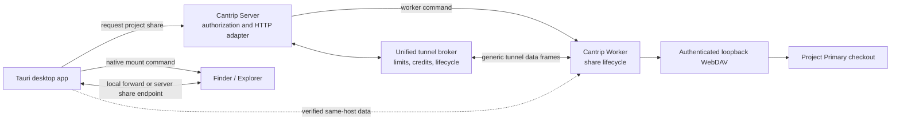

# Project Network Shares

Project network shares let a desktop Cantrip client reveal a worker-owned
project in Finder or Explorer without assuming the project exists on the client
machine. The server always authorizes the share. When Tauri and the selected
worker share a machine, WebDAV bytes use the verified local-direct broker;
otherwise they use the authenticated server relay. Neither path reveals the
worker's physical checkout directly.

## Architecture

The worker owns the checkout and the WebDAV server. The WebDAV listener binds
only to worker loopback on a random port and requires a per-session random
username and password using HTTP Digest authentication. The server never
returns that worker-loopback address as a client endpoint and never attempts an
inbound connection to the worker.

The server exposes an authorized share attachment on its isolated tunnel
surface and registers it in the unified tunnel control plane as a
project-associated, managed-ephemeral `server-relay`. It is therefore visible
in both global Tunnel settings and the project's Tunnel settings while active.
`POST /api/projects/:projectId/network-shares` resolves the owned
project's Primary checkout, asks its assigned worker to open the share, and
returns the public WebDAV URL plus its in-memory credentials. Repeated requests
for the same project reuse the live attachment. `DELETE
/api/project-shares/:attachmentId` revokes it and closes the worker listener.

The attachment URL contains a random 256-bit path token. The worker mounts the
physical project at that exact public path so HTTP Digest's signed URI and
WebDAV `Destination` headers remain unchanged through the proxy. The server
never substitutes or returns the worker's loopback address.

WebDAV uses the same versioned, bounded binary data-plane frames as every other
Cantrip tunnel on the authenticated outbound worker WebSocket. A small,
length-prefixed HTTP head precedes each request and response body inside the
generic byte stream; it is endpoint adaptation, not a second tunnel protocol.
The shared broker owns connection limits, sequence validation, credits,
bandwidth limits, idle/max-lifetime enforcement, byte counters, and disconnect
cleanup. Request bodies and file responses stream with end-to-end backpressure.
They do not travel in ordinary JSON worker command messages, and the server
never makes an inbound connection to a worker.

The share stays writable so edits made through Finder or File Explorer update
the worker-owned checkout. The worker rejects operating-system metadata
artifacts such as `.DS_Store`, AppleDouble sidecars, `Thumbs.db`, and
`desktop.ini` at the WebDAV boundary so merely browsing a project does not
dirty its checkout.

## Native client boundary

The project action is available only when the React application is running in
the desktop Tauri shell. Browser and mobile clients do not render the action.
The Tauri command receives the server endpoint and short-lived credentials,
mounts the WebDAV volume using the host operating system, and opens the mounted
project in Finder or Explorer. Credentials must be passed without placing them
in a URL, log line, or shell-expanded command string.

Windows passes credentials in memory to the WebDAV Redirector with
`WNetAddConnection2W`, maps a temporary drive, and opens it in Explorer. macOS
mounts with `mount_webdav` into a Cantrip-owned mount directory. Its credentials
travel through the inherited URLMount credential descriptor, not process
arguments, and the resulting volume opens in Finder. Native mounts are reused
for repeated reveals and released when they are replaced, when the server's
bounded maximum mount lease elapses, or when the desktop runtime shuts down.
While a direct mount is active, Tauri retains the already issued server share
endpoint and random WebDAV credential in native memory. If its local direct
forward disappears, the desktop remounts that same attachment through the
server relay and preserves the original lease rather than asking the user to
reveal the project again.

## Security and lifecycle invariants

- Share listeners bind to `127.0.0.1` on the worker, never a LAN or public
  interface.
- Each share receives random in-memory credentials; credentials are not
  persisted or logged.
- A share identity is permanently bound to one canonical project root for its
  lifetime.
- Workers bound the number of simultaneous shares and close all listeners on
  shutdown.
- A worker disconnect immediately invalidates its server attachments. The next
  request after reconnect cleans any orphaned worker listeners before opening a
  replacement attachment.
- Reusing an attachment probes the current worker descriptor; a restarted
  worker with rotated credentials receives a new attachment instead of stale
  credentials being returned to the desktop client.
- The server authorizes every project against the current owner and resolves
  the Primary checkout and its assigned worker before opening a share.
- Server attachment credentials are short-lived and map to exactly one worker
  share. The server also supplies the remaining hard mount lease, bounded to 24
  hours by the protocol, so a native mount cannot survive indefinitely. Apps
  never choose a worker host, port, or filesystem path.
- Hop-by-hop headers, cookies, proxy credentials, and worker-local absolute
  response locations are stripped before crossing trust boundaries. Digest,
  DAV, lock, range, and destination headers remain available to native clients.
- Local worker and Tauri deployments still use server authorization, but the
  mounted endpoint prefers the verified loopback broker and falls back to the
  authenticated server endpoint automatically.
- Revocation removes the generic route, its server-relay attachment, and its
  managed control-plane record before closing the worker-owned share.
- Server startup deletes stale managed-ephemeral Project Share records because
  their in-memory URL token and Digest credentials cannot survive a restart.
- Project Share has no private frame magic, transport queue, or connection
  broker. Its server HTTP and worker WebDAV adapters are edges on the unified
  tunnel data plane.

## Implementation status

Worker-owned WebDAV lifecycle, the server-authorized managed tunnel, generic
stream transport, desktop-only reveal action, native macOS/Windows mounting,
expiration, reconnect, and unmount cleanup are implemented. The remaining
release responsibility is platform QA against supported Finder and Explorer
versions.
