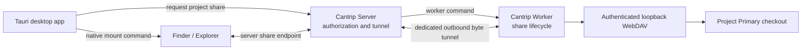

# Project Network Shares

Project network shares let a desktop Cantrip client reveal a worker-owned
project in Finder or Explorer without assuming the project exists on the client
machine. Local desktop mode follows the same server-routed path as a remote
worker; it does not reveal the worker's physical checkout directly.

## Architecture

The worker owns the checkout and the WebDAV server. The WebDAV listener binds
only to worker loopback on a random port and requires a per-session random
username and password using HTTP Digest authentication. The server never
returns that worker-loopback address as a client endpoint and never attempts an
inbound connection to the worker.

The server exposes an authorized share attachment on its isolated tunnel
surface. `POST /api/projects/:projectId/network-shares` resolves the owned
project's Primary checkout, asks its assigned worker to open the share, and
returns the public WebDAV URL plus its in-memory credentials. Repeated requests
for the same project reuse the live attachment. `DELETE
/api/project-shares/:attachmentId` revokes it and closes the worker listener.

The attachment URL contains a random 256-bit path token. The worker mounts the
physical project at that exact public path so HTTP Digest's signed URI and
WebDAV `Destination` headers remain unchanged through the proxy. The server
never substitutes or returns the worker's loopback address.

WebDAV request and response bytes use dedicated bounded binary frames on the
authenticated outbound worker WebSocket. They do not travel in ordinary JSON
worker command messages, and the server never makes an inbound connection to a
worker. Request bodies and file responses stream with explicit congestion and
client backpressure handling.

## Native client boundary

The project action is available only when the React application is running in
the desktop Tauri shell. Browser and mobile clients do not render the action.
The Tauri command receives the server endpoint and short-lived credentials,
mounts the WebDAV volume using the host operating system, and opens the mounted
project in Finder or Explorer. Credentials must be passed without placing them
in a URL, log line, or shell-expanded command string.

Windows uses the WebDAV Redirector through an argument-safe native process and
opens the resulting drive in Explorer. macOS mounts with `mount_webdav` into a
Cantrip-owned mount directory and reveals that volume in Finder. Native mounts
must be reusable for repeated reveals and explicitly released when their server
share expires or the desktop runtime shuts down.

## Security and lifecycle invariants

- Share listeners bind to `127.0.0.1` on the worker, never a LAN or public
  interface.
- Each share receives random in-memory credentials; credentials are not
  persisted or logged.
- A share identity is permanently bound to one canonical project root for its
  lifetime.
- Workers bound the number of simultaneous shares and close all listeners on
  shutdown.
- The server authorizes every project against the current owner and resolves
  the Primary checkout and its assigned worker before opening a share.
- Server attachment credentials are short-lived and map to exactly one worker
  share. Apps never choose a worker host, port, or filesystem path.
- Hop-by-hop headers, cookies, proxy credentials, and worker-local absolute
  response locations are stripped before crossing trust boundaries. Digest,
  DAV, lock, range, and destination headers remain available to native clients.
- Local worker and local Tauri deployments still use the authenticated server
  endpoint and worker tunnel.

## Delivery milestones

1. Completed: worker-owned authenticated loopback WebDAV lifecycle and shared
   protocol.
2. Completed: server-authorized project share sessions and multiplexed worker
   tunnel.
3. Desktop-only project menu action and native macOS/Windows mount commands.
4. Expiration, reconnect, unmount cleanup, and end-to-end local/remote QA.
