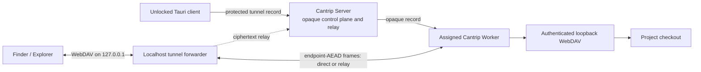

# Project Network Shares

Project network shares let a desktop Cantrip client reveal a worker-owned
project in Finder or Explorer without assuming the checkout exists on the
client machine. The server authorizes the project and routes the tunnel, but it
cannot open the project path, WebDAV credentials, or file bytes.

## Architecture

The unlocked client creates the tunnel ID, a random 256-bit capability path,
Digest username and password, realm, and data-plane key. It seals those values
together with the worker-local project root inside a revision-bound
`tunnel-content` record. The server retains only the authenticated owner,
project, assigned worker, public adapter/resource IDs, lifecycle metadata,
counters, and ciphertext.

The worker opens the record with its scoped `tunnel-content` grant, validates
the server/worker/tunnel/revision bindings, canonicalizes the protected root,
and starts an authenticated WebDAV listener on a random `127.0.0.1` port. The
listener address and credentials never return through the server. A protected
tunnel connection opens that listener locally on the worker and carries raw
WebDAV TCP bytes; the old server HTTP translation endpoint and plaintext worker
adapter no longer exist.

The desktop mounts only the local forwarder's `127.0.0.1` URL. The forwarder
uses a verified direct worker route when available and the authenticated server
relay otherwise. Both paths carry the same AES-256-GCM data frames, so fallback
does not change the mount URL, remount through a cloud endpoint, or downgrade
encryption.

## Native client boundary

The reveal action is available only in the desktop Tauri shell. The React
client passes the localhost URL and transient Digest credentials to the native
mount command without placing credentials in a URL, log line, or
shell-expanded command string.

Windows supplies credentials in memory through `WNetAddConnection2W`, creates
a temporary deviceless UNC connection, and opens it in Explorer. macOS passes
credentials to `mount_webdav` through a private inherited descriptor and mounts
into a Cantrip-owned directory before opening Finder. Native mounts are reused
while their tunnel URL is unchanged and are released when replaced, when the
bounded mount lease expires, or when the desktop runtime shuts down.

Explorer folder context menus reuse the whole-project mount and open the
selected relative directory. Holding Shift selects the verified same-host
physical directory instead; this intentionally does nothing for a remote
worker.

## Security and lifecycle invariants

- The user's login password remains the only user-managed secret. No recovery
  key or local encryption password is introduced.
- Project roots, capability paths, usernames, passwords, realms, and
  data-plane keys exist only in client/worker-opened protected content.
- Worker WebDAV and desktop mount endpoints bind to `127.0.0.1`, never a LAN or
  public interface.
- The server cannot terminate WebDAV, return a cloud share URL, or request the
  legacy unprotected project-share adapter; the protocol and worker reject that
  downgrade path.
- Every direct and relayed application-data frame is authenticated against the
  tunnel, attachment, endpoints, connection, direction, sequence, nonce,
  format, and key revision.
- Workers canonicalize the project root, bound simultaneous shares, reuse only
  identical protected configurations, and close listeners on revocation or
  shutdown.
- WebDAV remains writable, while worker-side filters reject operating-system
  metadata artifacts such as `.DS_Store`, AppleDouble sidecars, `Thumbs.db`,
  and `desktop.ini`.
- Server revocation closes generic desktop attachments, removes the managed
  tunnel record, and tells the worker to close its listener.

## Implementation status

Protected project-share configuration, worker-local WebDAV lifecycle,
encrypted direct/relay transport, desktop-only macOS/Windows mounting,
expiration, revocation, and local-folder Shift behavior are implemented. The
remaining release responsibility is platform QA against supported Finder and
Explorer versions.
