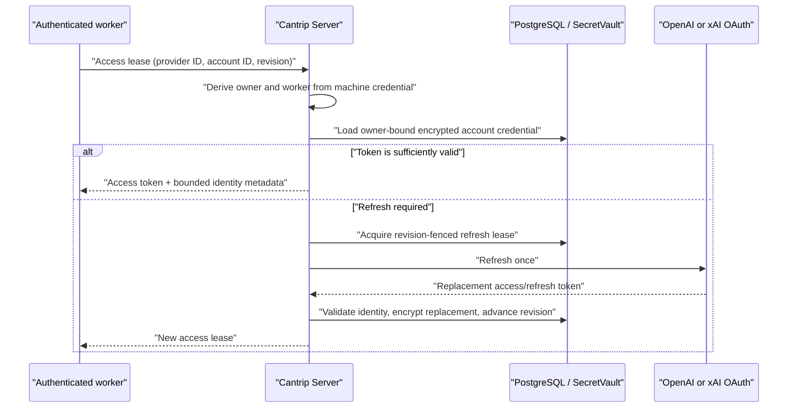

# Portable provider authentication

- Status: implemented for ChatGPT and Grok/SuperGrok
- Last updated: 2026-08-20
- Codex boundary: packaged `codex-cli 0.148.0`
- Related: [runtime compatibility](CODEX_RUNTIME_COMPATIBILITY.md),
  [hosted security](HOSTED_SECURITY_ARCHITECTURE.md), and
  [multi-worker placement](MULTI_WORKER_ARCHITECTURE.md)

## Outcome and ownership

A ChatGPT or Grok/SuperGrok sign-in belongs to the Cantrip server account, not
to the worker that happened to run OAuth. After one successful enrollment, a
new compatible worker can list the account's models and run the same logical
model profiles without signing in to either provider again.

| Data or action                        | App                            | Server                                             | Worker                                  |
| ------------------------------------- | ------------------------------ | -------------------------------------------------- | --------------------------------------- |
| Account label, status, quota, catalog | Redacted display and mutations | Authoritative                                      | Reports login observations              |
| Access token                          | Never receives                 | Decrypts and leases                                | In memory until lease cache expiry      |
| Refresh and ID tokens                 | Never receives                 | Encrypted durable credential and refresh authority | Never receives in server-managed mode   |
| Provider identity                     | Redacted display               | Validates and binds to account record              | Receives minimum runtime metadata       |
| Device/browser OAuth                  | Starts or cancels              | Coordinates and imports result                     | Any selected online worker may run it   |
| Runtime and provider proxy            | Never hosts                    | Routes and owns lifecycle                          | Hosts Codex and the Grok loopback proxy |

The server encrypts the complete credential with the existing `SecretVault` and
this authenticated context:

```text
cantrip:model-provider-account:<kind>:<ownerId>:<providerId>:<accountId>
```

Changing the owner, provider, account, or kind causes AES-256-GCM
authentication to fail. The app and normal worker events receive no credential
envelope or OAuth payload.

## Lease and refresh flow



The internal access-lease route accepts only an individually enrolled worker
credential. That credential fixes the owner and immutable worker ID; path and
body IDs cannot select another owner's account. The lease response contains an
access token, credential revision, upstream expiry, lease expiry, provider and
account IDs, email/plan display metadata, and the provider identity required by
the runtime. It never contains a refresh token, ID token, or encrypted envelope.

The worker caches a response only in memory and for at most five minutes, never
past the upstream token expiry. The OAuth bearer token itself remains valid
until its upstream expiry or revocation; the lease boundary is a Cantrip cache
and revalidation boundary, not a cryptographic shortening of that token.

Refresh coordination has two fences:

1. An in-process single-flight promise prevents duplicate work on one server.
2. A database refresh lease plus expected credential revision serializes work
   across server replicas.

Every successful refresh persists the complete replacement credential before
advancing its revision, so rotating or single-use refresh tokens are not lost.
A stale worker revision receives the already-refreshed credential instead of
refreshing again. An invalid grant becomes `reauth-required`; a changed
provider subject becomes `conflict`; transient failure leaves the previous
credential and returns a bounded error.

## ChatGPT through Codex 0.148

Server-managed ChatGPT requires Codex 0.148.x, experimental API negotiation,
and the `account/login/start` method. Before the runtime starts, the worker:

1. obtains a server lease;
2. calls `account/login/start` with `type: "chatgptAuthTokens"`, the access
   token, ChatGPT account/workspace ID, and plan type; and
3. retains only the account binding and credential revision in memory.

When Codex sends `account/chatgptAuthTokens/refresh`, the worker validates the
request, forces a lease newer than its current revision, verifies the provider
account and upstream workspace identity are unchanged, and returns the new
access token. Unsupported Codex versions or capabilities fail before the
server-managed runtime starts. Normal operation does not create `auth.json`.

This interface is experimental in Codex 0.148. Cantrip does not patch it, but a
future Codex release may change its method names, payloads, result type, or
timeout. Do not widen the pinned range until the login and refresh fixture in
the runtime compatibility procedure passes against the new source.

## Grok/SuperGrok through the local proxy

The existing xAI subscription adapter remains worker-local because Codex must
talk to a Responses-compatible endpoint on the machine running it. Its token
source is now the server lease client rather than `grok-auth.json`.

The adapter preserves the provider-specific authentication headers, forwards
only to the configured xAI subscription origin, binds its randomized endpoint
to `127.0.0.1`, rejects paths outside its private `/v1` prefix, strips incoming
credential headers, limits request bodies to 64 MiB, and performs at most one
forced-refresh retry after an upstream 401. Model discovery and turns use the
same lease path. Normal server-managed operation does not create
`grok-auth.json`.

## Legacy credential migration

Existing worker-local accounts remain usable while the migration path is
needed. On reconnect or after a device login, the server asks the selected
worker to capture one bounded regular credential file. Capture responses are
internal worker replies and must never be copied to an app response, event, or
log.

The server parses the provider credential, derives its stable subject
(`chatgpt:<workspace>` or `grok:<user>`), and stores it only if the provider
kind, owner, account, expected revision, and any existing subject match. It
then acknowledges the exact durable revision and subject. Only after that
acknowledgement may the worker re-read the file, confirm the same subject, and
delete it.

ChatGPT migration deliberately stops the affected runtime and unlinks the file
without calling ordinary Codex logout; ordinary logout would revoke the shared
credential just imported into the server. A conflict is surfaced rather than
silently choosing one identity. If the original worker is offline and no server
credential exists, the account remains `migration-needed` and asks for that
worker to reconnect. The legacy fallback remains intentional for older or
temporarily incompatible workers; removing it now would strand existing users.

## Routing, relocation, and lifecycle

ChatGPT and Grok auth, quota, catalog sync, and model availability use stable
provider-account scope. They do not require a worker binding. Ollama and other
genuinely machine-local providers remain worker-scoped.

A selected logical model preserves its profile ID, provider route, account,
reasoning configuration, ordering, and fallback policy when a chat switches or
relocates workers. The target worker recreates the runtime with its own lease;
it does not receive the source worker's credential directory or opaque live
Codex process state.

Provider sign-out is global. The server denies new leases, changes the account
generation to invalidate an in-flight refresh, atomically takes and removes the
credential, attempts bounded upstream revocation, invalidates catalog state,
and commands every connected worker to close matching runtimes and remove a
legacy file. If an older legacy-only credential exists on an offline worker,
the server refuses to imply global success and asks for that worker to reconnect.

## Threat model and operating rules

| Threat                                  | Control and remaining exposure                                                                                                                                                                                     |
| --------------------------------------- | ------------------------------------------------------------------------------------------------------------------------------------------------------------------------------------------------------------------ |
| Database backup or row copied elsewhere | AES-256-GCM envelope needs the operator keyring and exact owner/provider/account/kind context.                                                                                                                     |
| Cross-owner lease request               | Worker credential determines owner; repository query joins provider and account through that owner.                                                                                                                |
| Concurrent or stale refresh             | In-process single flight, database lease, expected revision, and identity check.                                                                                                                                   |
| Refresh-token rotation                  | Complete replacement credential is encrypted before revision commit.                                                                                                                                               |
| Lost or stolen lease response           | Worker cache is bounded to five minutes, but the bearer token remains usable until upstream expiry or revocation. Protect worker memory and transport.                                                             |
| Compromised worker                      | It can use access tokens leased to its owner's configured accounts while enrolled. Revoke the worker and globally sign out affected providers. It cannot request another owner's account or obtain refresh tokens. |
| Compromised live server or keyring      | The control plane can decrypt and use every provider account it owns. This is an accepted trusted-server boundary; isolate, monitor, back up, and rotate it accordingly.                                           |
| Diagnostics or support bundle leakage   | Token-shaped values, OAuth payloads, envelopes, and worker events are redacted or schema-stripped; never add raw request/response bodies to logging.                                                               |
| Experimental Codex API drift            | Exact packaged pin, capability gate, explicit failure, and refresh compatibility fixture.                                                                                                                          |

Back up PostgreSQL and the complete encryption keyring separately, then test
restoring them together. Retain old keys until startup has successfully
decrypted and rewrapped every envelope and a new verified backup exists. After
a suspected control-plane compromise, upstream provider revocation is required;
rotating only the envelope key does not invalidate already-issued OAuth tokens.

## Automated regression evidence

The final portability regression is
`cantrip_worker/test/provider-account-portability.test.ts`. It launches a fake
Codex App Server through a platform-neutral Node process launcher and gives it
brand-new empty credential homes. The test lists ChatGPT and Grok models,
completes both turns, forces the ChatGPT refresh server request, routes the Grok
turn through the randomized loopback proxy, and verifies that neither credential
home gained an auth file. It also verifies lease revisions, xAI identity
headers, bearer replacement, and secret-free request summaries.

Server integration tests additionally cover owner authorization, encryption
context isolation, concurrent/stale refresh requests, refresh-token rotation,
permanent failure, identity conflict, acknowledgement-before-purge, account
scope, model-route preservation, relocation, and global logout. Protocol tests
reject secret fields added to worker events.

From a source checkout, run the portable worker regression on any supported
development host:

```shell
pnpm --filter @cantrip/worker exec vitest run test/provider-account-portability.test.ts
```

## Native Windows, macOS, and Linux verification

Native packaging and upstream OAuth behavior still need release-candidate smoke
testing on each operating system. Use a non-production provider account and a
server with an already configured ChatGPT route, Grok route, and logical model
profile. Create a one-time worker link code in **Settings → Workers**.

### Windows PowerShell

In an extracted Windows Worker archive:

```powershell
$env:CANTRIP_SERVER_URL = "https://cantrip.example.test"
$env:CANTRIP_WORKER_ENROLLMENT_CODE = "ctwl_replace_with_one_time_code"
$env:CANTRIP_WORKER_DATA_DIR = Join-Path $env:TEMP "cantrip-portable-$([guid]::NewGuid())"
New-Item -ItemType Directory -Force $env:CANTRIP_WORKER_DATA_DIR | Out-Null
.\start.cmd
```

After enrollment, remove `CANTRIP_WORKER_ENROLLMENT_CODE` before restarting the
worker; its individual worker credential is already stored in the fresh data
directory.

### macOS or Linux shell

In an extracted native Worker archive:

```shell
export CANTRIP_SERVER_URL="https://cantrip.example.test"
export CANTRIP_WORKER_ENROLLMENT_CODE="ctwl_replace_with_one_time_code"
export CANTRIP_WORKER_DATA_DIR="$(mktemp -d -t cantrip-portable.XXXXXX)"
./start.sh
```

Unset `CANTRIP_WORKER_ENROLLMENT_CODE` after enrollment and retain the data
directory for the rest of the smoke test.

### Required observations on every platform

1. Confirm the new worker is online and its data directory was empty before
   startup.
2. Open model settings. Both existing provider accounts must show one global
   signed-in status and their catalogs without offering a worker-specific
   sign-in.
3. Create a chat on the new worker, select the existing ChatGPT logical model,
   and complete a turn. Repeat with the Grok logical model.
4. Relocate or switch an idle chat from another worker to the new worker. The
   selected logical model, route/account, and reasoning effort must remain
   unchanged, and the next turn must complete.
5. Recursively inspect `CANTRIP_WORKER_DATA_DIR`. No `auth.json` or
   `grok-auth.json` should exist under `codex-accounts` after server-managed
   turns. `worker-credential.json` is expected.
6. Exercise a naturally expired/401 provider token when practical. The next
   ChatGPT turn or Grok request must refresh once and continue without sign-in;
   the automated fixture supplies deterministic coverage when inducing a real
   expiry is impractical.
7. Globally sign out one test provider account. Existing matching runtimes must
   close, the catalog/status must update, and a new turn on every worker must be
   denied until one new global sign-in completes.
8. Review server and worker logs plus any diagnostic/support output. Search for
   the test access token, refresh token, OAuth payload, and credential envelope;
   none may appear.

Record the operating system, architecture, packaged Cantrip revision, packaged
Codex version, server deployment mode, provider plan, and pass/fail result. A
macOS source test is not evidence that the Windows NSIS or Linux native package
has completed this smoke test.
