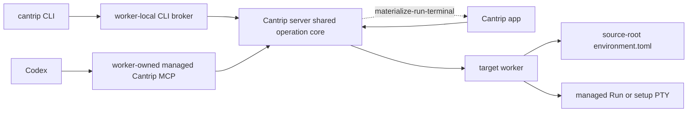

# Codex-compatible Run environments

Cantrip consumes the same project-local environment format as Codex in the
ChatGPT desktop app. The canonical file is:

```text
<project-source-root>/.codex/environments/environment.toml
```

This follows the official OpenAI
[Local environments](https://learn.chatgpt.com/docs/environments/local-environment)
model: setup prepares new worktrees, saved actions run in an integrated
terminal, platform-specific scripts can override defaults, and the generated
configuration may be committed when a team wants to share it.

Cantrip does not introduce a second configuration format. `.codex/config.toml`,
`.vscode/launch.json`, .NET launch profiles, and build-system files have their
own unrelated lifecycles.

## Version 1 contract

Cantrip's verified compatibility surface is deliberately narrow:

```toml
version = 1
name = "Spectral Lab"

[setup]
script = '''
cd "$CODEX_WORKTREE_PATH"
dotnet restore ./SpectralLab.slnx
'''

[setup.win32]
script = '''
Set-Location $env:CODEX_WORKTREE_PATH
dotnet restore .\SpectralLab.slnx
'''

[[actions]]
name = "Run Spectral Lab"
icon = "run"
command = '''
cd "$CODEX_WORKTREE_PATH"
dotnet run --project ./src/SpectralLab.App/SpectralLab.App.csproj
'''
platform = "linux"

[[actions]]
name = "Run Spectral Lab"
icon = "run"
command = '''
cd "$CODEX_WORKTREE_PATH"
dotnet run --project ./src/SpectralLab.App/SpectralLab.App.csproj
'''
platform = "darwin"

[[actions]]
name = "Run Spectral Lab"
icon = "run"
command = '''
Set-Location $env:CODEX_WORKTREE_PATH
dotnet run --project .\src\SpectralLab.App\SpectralLab.App.csproj
'''
platform = "win32"
```

Supported fields are `version`, `name`, `[setup]`, the `win32`, `darwin`, and
`linux` setup overrides, and repeated `[[actions]]` with `name`, `icon`,
`command`, and optional `platform`. Multiple actions may share a name. Cantrip
filters them on the target worker first; if more than one compatible action
still has the same name, human CLI selection is ambiguous and the full opaque
action ID is required.

Cantrip does not infer `[cleanup]` or other undocumented fields. Discovery
reports unsupported versions and malformed fields. Environment settings also
refuses to silently normalize unknown fields; replacing such a file requires
an explicit confirmation.

## Source root and sharing

Workers discover configuration from the registered project source root, not
from each secondary worktree. An ignored `environment.toml` therefore applies
to every worktree derived from that source on the same worker. Cantrip does not
copy ignored configuration to another worker.

A tracked configuration follows the repository through normal Git replication
and is independently discovered on each worker. Platform selection always uses
the worker that owns the selected checkout. The server, invoking worker, and
client platforms do not influence selection.

`cantrip run config init` and Project settings → Environment write only the
canonical file. Writes use the SHA-256 revision returned by the worker and fail
on concurrent changes. Cantrip never edits `.gitignore`, stages the file,
commits it, or pushes it. Environment settings shows `tracked`, `ignored`,
`untracked`, or `absent` so the user can make that Git decision explicitly.

## Architecture and routing



The boundaries are intentional:

- The app talks only to the server.
- The CLI and MCP use authenticated loopback brokers on their attached worker.
- The server owns durable identity, authorization, placement, idempotency,
  lifecycle metadata, auditing, and client-control routing.
- The target worker owns files, platform selection, revision revalidation,
  shells, PTYs, process groups, setup output, and setup environment deltas.
- The client encrypts terminal labels and private terminal state before it
  creates or attaches a Run terminal.

MCP is an adapter over the shared operation core; it never launches the CLI as
a subprocess. A CLI or MCP call may target a different worker through the
normal worker → server → target-worker route. Workers never connect directly
to one another.

Ordinary discovery results contain configuration identity, validation, setup
presence/platform, and action display metadata only. Raw action and setup
scripts stay worker-private during list, read, start, status, and setup flows.
The explicit Environment editor is the exception: its revision-checked
authoring route carries the document transiently so the user can edit it, but
the server does not persist or audit its scripts.

## Run lifecycle

Starting a Run is distinct from copying its command into a shell. Before every
spawn, the target worker resolves the registered source and worktree roots,
rereads the source-root configuration, recomputes its revision, reselects the
action for its own platform, verifies the opaque action ID, and confirms the
paths remain inside their registered roots.

The worker launches the action in the selected worktree with:

- CWD set to the worktree root;
- `CODEX_WORKTREE_PATH` and `CANTRIP_WORKTREE_PATH` set to that root;
- `CANTRIP_PROJECT_ROOT` set to the registered source root; and
- `CANTRIP_RUN_ID` and `CANTRIP_ACTION_ID` set to the exact durable identity.

The existing worker environment and a successful matching setup delta are
preserved. Setup cannot replace reserved Cantrip connection variables or the
Run identity variables.

| Worker platform | Invocation                                                            |
| --------------- | --------------------------------------------------------------------- |
| Windows         | `powershell.exe -NoLogo -NoProfile -NonInteractive -Command <script>` |
| macOS           | `$SHELL -lc <script>`, defaulting to `/bin/zsh`                       |
| Linux           | `$SHELL -lc <script>`, defaulting to `/bin/bash`                      |

The worker retains a managed PTY without terminal-service auto-restart. One
request identity creates at most one Run. Stop sends a graceful signal to the
complete process group and escalates when necessary; worktree or project
removal stops matching Runs first. An exited action is never restarted.

The server stores only Run ID, project/worktree/worker identity, opaque action
ID, configuration revision, bounded state, timestamps, exit code or signal,
and optional terminal association. States are `queued`, `starting`, `running`,
`exited`, `failed`, `stopping`, `stopped`, and `lost`. It stores no raw command,
environment delta, or PTY scrollback.

A Run can start headlessly. When a compatible client is connected, the server
sends the narrow `materialize-run-terminal` control for the exact Run,
project, worktree, and terminal UUID. An unavailable client does not fail the
Run. `run open` or `run_open` retries after reconnect. A generic client-created
surface is not exposed.

While a worker is offline, durable Run status remains available and volatile
logs do not. On reconnect, the server asks the worker to reconcile active Run
identities. A process absent after worker restart becomes `lost`; Cantrip does
not silently restart it.

## Setup lifecycle

Setup is separate from Run. After Cantrip creates and reconciles a secondary
worktree, it reads the source-root configuration, selects setup for the target
worker platform, and queues a durable setup job. The worktree becomes ready
only after success. A failure preserves the worktree in `setup-failed` state
for inspection and explicit retry.

Setup output is bounded and observable. A successful setup captures its
environment delta into the worker's owner-only data directory, keyed by
project, worktree, and configuration revision. The delta never appears in
server APIs. A changed configuration makes completed setup stale until retry,
and worktree removal deletes the worker-private record.

Setup runs only for new secondary-worktree preparation or explicit retry. It
never runs during discovery, validation, `run start`, or toolbar action start.

## CLI reference

The CLI is the canonical human and scripting interface. All commands support
stable `--json` output.

| Command                                                | Behavior                                                         |
| ------------------------------------------------------ | ---------------------------------------------------------------- |
| `cantrip run list`                                     | List platform-compatible action metadata and revisions.          |
| `cantrip run show <action>`                            | Read one unambiguous name or exact opaque action ID.             |
| `cantrip run validate`                                 | Report bounded schema, path, and ambiguity diagnostics.          |
| `cantrip run config path`                              | Show the canonical path and Git state.                           |
| `cantrip run config schema --json`                     | Return the exact document schema and complete examples.          |
| `cantrip run config example`                           | Print a complete canonical TOML example.                         |
| `cantrip run config init [--name <name>]`              | Create a minimal v1 canonical file only when absent.             |
| `cantrip run config init --overwrite [--name <name>]`  | Explicitly replace the current revision with a minimal v1 file.  |
| `cantrip run config action add <name> --command <cmd>` | Append a complete action with a revision-checked write.          |
| `cantrip run start <action> [--no-focus]`              | Start an exact revision-checked Run.                             |
| `cantrip run status [run-id]`                          | Refresh one Run or the latest Run in the current worktree.       |
| `cantrip run logs <run-id> [--tail <chars>]`           | Read 1–100,000 characters from volatile worker scrollback.       |
| `cantrip run stop <run-id>`                            | Stop the complete worker-owned process group.                    |
| `cantrip run open <run-id>`                            | Retry encrypted terminal materialization.                        |
| `cantrip run setup status`                             | Show durable setup state and available bounded worker output.    |
| `cantrip run setup retry`                              | Explicitly queue another setup attempt for a secondary worktree. |

Agents should prefer the action-add command for simple authoring, use the
schema/example commands before complete TOML editing, run `cantrip run
validate`, prefer managed MCP Run tools when the current binding provides
them, and use this CLI as the fallback.

## Managed MCP reference

Read-only bindings receive only read tools. Mutation tools require the current
binding, lane, project, worktree, target, worker, permission profile, and
capability checks at both broker and server boundaries.

| Tool                    | Kind                            | Behavior                                                     |
| ----------------------- | ------------------------------- | ------------------------------------------------------------ |
| `run_config_list`       | read                            | List compatible action metadata, IDs, and revisions.         |
| `run_config_read`       | read                            | Revalidate one exact ID and revision.                        |
| `run_config_schema`     | read                            | Return the exact document schema and complete examples.      |
| `run_config_action_add` | mutation                        | Append a complete revision-checked action.                   |
| `run_status`            | read                            | Refresh one Run or the latest bound-worktree Run.            |
| `run_read`              | read                            | Read a bounded volatile output tail.                         |
| `run_setup_status`      | read                            | Read durable setup state and bounded available output.       |
| `run_start`             | open-world mutation             | Start an exact ID and configuration revision.                |
| `run_stop`              | destructive/open-world mutation | Stop the complete process group.                             |
| `run_open`              | mutation                        | Retry exact Run-terminal materialization.                    |
| `run_setup_retry`       | mutation                        | Queue explicit setup retry for the bound secondary worktree. |

MCP callers never select by display name. They use the action ID and revision
returned by `run_config_list` or `run_config_read`.

## Limits and failure semantics

- At most 64 `.toml` files are inspected beneath `.codex/environments`; each
  file is at most 512 KiB.
- A configuration contains at most 200 actions. Individual scripts are at most
  100,000 characters, aggregate authoring data is at most 500,000 characters,
  and NUL characters are rejected.
- Diagnostics are capped at 200. MCP broker responses are capped at 512 KiB.
- A worker retains at most 64 Run sessions. Its volatile Run scrollback is the
  last 256 KiB of characters, and one logs response is at most 100,000
  characters.
- Setup output retains the last 100,000 characters. Environment capture is at
  most 1 MiB and yields at most 256 changed values, with a 256-character name,
  16 KiB value, and 128 KiB aggregate limit.

Malformed TOML, unsupported versions, too many actions/configurations, NULs,
oversized content, path traversal, symlinks, non-regular files, stale
revisions, unavailable workers, and ambiguous selectors fail closed. Discovery
never executes code. Revision mismatch returns a conflict and requires the
caller to list, read, or reload again.

## Threat model

Every setup and action script is arbitrary code with the permissions granted
to its worker process. Cantrip provides routing and lifecycle controls; it does
not make a trusted script out of an untrusted repository.

| Threat                                           | Control                                                                                                                                                     |
| ------------------------------------------------ | ----------------------------------------------------------------------------------------------------------------------------------------------------------- |
| Path traversal or symlink escape                 | Worker canonicalizes registered roots and rejects escaping, symlinked, or non-regular configuration paths before read/write/spawn.                          |
| List/start or edit/write race                    | SHA-256 revisions are rechecked immediately before execution or atomic rename.                                                                              |
| Wrong-platform execution                         | The target worker filters and revalidates against its own platform.                                                                                         |
| Duplicate start on retry                         | Durable request/Run identity is idempotent at server and worker layers.                                                                                     |
| Child process survives stop/removal              | The worker terminates the complete process group and escalates after a grace period.                                                                        |
| Service-style surprise restart                   | Managed Runs have no automatic restart semantics; missing processes reconcile to `lost`.                                                                    |
| Secret or command retention                      | Server persistence excludes commands, setup deltas, and scrollback; normal discovery transport excludes raw scripts; logs are redacted and bounded.         |
| Setup export overrides control-plane credentials | Reserved Cantrip/Codex variables are filtered and worker-private delta files use owner-only permissions.                                                    |
| MCP binding spoof or privilege escalation        | Worker broker and server both validate binding, lane, owner, project, worktree, worker, permission profile, allowed operation, target, and response bounds. |
| Unrestricted client surface creation             | Only an exact existing Run can request a same-UUID encrypted terminal through the authenticated live-client route.                                          |
| Implicit Git publication                         | Authoring never changes ignore rules or invokes stage, commit, or push.                                                                                     |

Mutation audit events identify the transport (`app`, `cli`, or `mcp`), outcome,
and durable Run resource. The Run record supplies project, worktree, worker,
action ID, and configuration revision without copying the raw script into the
audit log.
