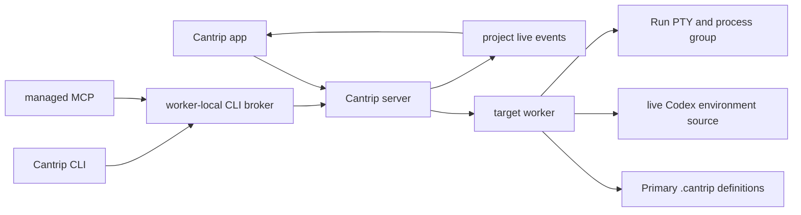

# Run Configurations Overhaul Plan

Status: planned replacement

This document defines the target architecture and delivery plan for Cantrip
Run configurations. The new system replaces the existing Codex-environment
action, setup, MCP, CLI, and managed-Run implementation. It is not an
incremental extension of that system.

The product goal is an IntelliJ-style Run experience: shared, typed
configurations; persistent project-level controls; guided target discovery;
durable process ownership; dedicated read-only Run terminals; and equivalent
app, CLI, and managed MCP operations.

## Decisions

- Run configuration definitions live in the project under
  `.cantrip/run-configurations/` and are suitable for committing to Git.
- A normal Run targets the project's Primary checkout, regardless of which
  chat, code, terminal, settings, or worktree surface is selected.
- `Run in Worktree...` is an explicit secondary action for choosing another
  worktree.
- A configuration may run once per worktree, so the same configuration can be
  active in multiple worktrees at the same time.
- Dropdown controls prefix each configuration name. A stopped configuration
  has a green Play button. A running configuration has a green Restart button
  followed by a red Stop button.
- Plain environment values may be shared in the definition. Secrets are
  represented by references whose values are encrypted and stored outside
  Git.
- The initial typed providers are Shell, Node/package, Java with Gradle or
  Maven, Dart, Flutter, and Rust/Cargo.
- New configurations include the current Codex environment by default. This
  is a live reference, not a copied environment snapshot, so a changed Codex
  environment affects the next Run.
- Existing `.codex/environments` actions are not automatically imported as
  Run configurations. Those files remain untouched and may only contribute
  environment values through the explicit environment-source adapter.

## Product contract

### Persistent header controls

When a project is selected, its Run configuration control remains in the top
right of the window on every project surface. It replaces the current
`Worker Online` label and green dot in that location.

The compact control contains:

1. the selected configuration and a searchable dropdown trigger;
2. a green Play button when its Primary instance is stopped;
3. a green Restart button when its Primary instance is running; and
4. a red Stop button while its Primary instance is running or stopping.

The configuration dropdown trigger uses ghost styling without a persistent
outline so it reads as a lightweight window-level control.

Worker health remains available in worker management, project placement, and
actionable offline error states. Removing the header label must not remove
worker diagnostics.

The selected configuration is remembered per user and project. If it is
deleted, Cantrip selects the first remaining configuration. With no
configuration, the control shows `Add Run Configuration`. With no selected
project, the control is hidden or disabled.

### Searchable configuration menu

The dropdown uses the existing shadcn Command and Popover primitives. It has a
search field and a Plus button to the right of that field.

Configurations with any `starting`, `running`, `restarting`, or `stopping`
instance sort to the top. Each group is then sorted by display name. Every
configuration row contains:

- a leading green Play button when the Primary instance is inactive;
- leading green Restart and red Stop buttons when the Primary instance is
  active;
- the provider icon, configuration name, and Primary status;
- an optional running-instance count when alternate worktrees are active; and
- an ellipsis menu with `Run in Worktree...`, `Edit`, and `Delete`.

Clicking the configuration name selects it and starts it in Primary. If its
Primary instance is already active, that click is a restart. Clicking the
leading controls also selects the configuration and performs the same action.

`Run in Worktree...` opens a searchable worktree picker. Selecting a worktree
starts or restarts the instance for that exact worktree. Active alternate
worktrees appear as compact child rows beneath the configuration, labeled
with their branch or worktree name and carrying their own green Restart and
red Stop controls. This keeps multi-worktree controls unambiguous.

Offline or unavailable targets keep the definition visible but disable
launch controls and show a concise reason. Search covers configuration name,
provider, resolved target, and worktree names for active instances.

### Create and edit experience

The Plus button and `Add Run Configuration` open a configuration editor. The
first view shows:

- detected targets, ranked by confidence;
- the six initial provider types; and
- a blank Shell configuration.

Choosing a detected target prepopulates the editor but never writes a file
until the user saves. The editor has common sections for:

- name and provider;
- target and effective command;
- start directory;
- program arguments;
- environment sources, environment files, plain variables, and secret
  references;
- before-launch steps;
- platform overrides;
- stop behavior; and
- provider-specific options.

The effective command is always visible before save. Typed providers generate
it from structured options. An explicit command override is available for
advanced use and is visibly distinguished from the provider-generated
command.

Path, target, and class/file selectors are searchable and worker-backed.
Obvious choices are preselected only when confidence is high. Ambiguous
projects present the candidates rather than guessing.

Editing uses revision checks. A file changed on disk after the editor opened
produces a conflict and offers reload or an explicit overwrite; Cantrip does
not silently discard the external edit.

## Shared definition format

Each configuration is one JSON document:

```text
<project-primary-root>/.cantrip/run-configurations/<configuration-id>.json
```

One file per configuration keeps Git diffs and merge conflicts localized.
The filename and in-document ID use the same stable UUID. Renaming a
configuration changes only its display name, not its identity or runtime
bindings.

Example:

```json
{
  "schema": "cantrip.run-configuration",
  "version": 1,
  "id": "0f82c573-704d-4a06-984e-5ce0b8d688ca",
  "name": "Run API",
  "provider": "rust",
  "workingDirectory": ".",
  "target": {
    "kind": "binary",
    "package": "cantrip_server",
    "name": "cantrip-server"
  },
  "commandOverride": null,
  "arguments": ["--listen", "127.0.0.1:4400"],
  "environment": {
    "includeCodexEnvironment": true,
    "files": [".env"],
    "variables": [
      {
        "name": "RUST_LOG",
        "value": "cantrip_server=debug",
        "enabled": true
      }
    ],
    "secrets": [
      {
        "name": "DATABASE_URL",
        "secret": "project/database-url",
        "enabled": true
      }
    ]
  },
  "beforeLaunch": [
    {
      "kind": "providerTask",
      "task": "build"
    }
  ],
  "platformOverrides": {},
  "options": {
    "toolchain": "default",
    "features": [],
    "profile": "dev"
  },
  "stop": {
    "gracePeriodMs": 3000
  }
}
```

### Common fields

| Field                  | Contract                                                                     |
| ---------------------- | ---------------------------------------------------------------------------- |
| `schema` and `version` | Required discriminator and migration version.                                |
| `id`                   | Immutable UUID shared by file, APIs, runtime bindings, and audit events.     |
| `name`                 | User-facing project-unique display name.                                     |
| `provider`             | Provider discriminator.                                                      |
| `workingDirectory`     | Repository-relative start directory, resolved inside the target checkout.    |
| `target`               | Provider-specific structured target.                                         |
| `commandOverride`      | Optional advanced replacement for the generated command.                     |
| `arguments`            | Ordered program arguments, separate from the generated executable or task.   |
| `environment`          | Live environment sources, files, plain variables, and secret references.     |
| `beforeLaunch`         | Ordered provider tasks or commands that must succeed before spawn.           |
| `platformOverrides`    | Optional Windows, macOS, or Linux overrides for portable shared definitions. |
| `options`              | Versioned provider-specific settings.                                        |
| `stop`                 | Grace period and provider-supported shutdown behavior.                       |

The exact protocol schema must use discriminated unions and reject unknown
versions. Provider-specific fields stay inside `target` and `options` so new
providers do not destabilize common runtime code.

Definitions are bounded in number and size. Reads reject NULs, path traversal,
symlinked files, non-regular files, duplicate IDs or names, and files whose ID
does not match their filename. Writes use a SHA-256 revision and atomic rename.

The worker watches the directory and publishes bounded definition-change
events. The app also refetches on reconnect and focus so watcher loss cannot
leave it permanently stale.

### Source and target roots

Definitions are always read from the registered Primary project root. A Run
in another worktree uses the same definition revision but resolves
`workingDirectory` and all repository-relative launch paths inside the chosen
target worktree.

This split gives the project one shared list while allowing the same
configuration to run against several branches. The worker verifies both roots
against registered project/worktree records immediately before every launch.

External edits in a secondary worktree do not change the canonical definition
until they reach Primary through the user's normal Git workflow.

## Provider architecture

Run configuration types are implemented behind a
`RunConfigurationProvider` contract. A provider must be able to:

- determine whether it applies to a checkout without executing project code;
- discover bounded candidate targets and confidence;
- expose structured editor fields and validation diagnostics;
- validate a saved configuration on the target worker;
- render a human-readable effective command;
- materialize an executable, arguments, environment additions, and
  before-launch tasks for the target platform; and
- describe capabilities such as device selection or toolchain selection.

Discovery is static and side-effect free by default. A future explicit
`Refresh from build tool` action may execute a trusted project tool, but it
must be permissioned and visibly separate from ordinary discovery.

### Initial providers

| Provider     | Detection and guided controls                                                                         | Typical launch                                                    |
| ------------ | ----------------------------------------------------------------------------------------------------- | ----------------------------------------------------------------- |
| Shell        | Any project; shell and script/command picker.                                                         | Target-platform login shell with the saved command.               |
| Node/package | `package.json` workspaces, package scripts, and likely entry files.                                   | Selected package manager script or Node entry file.               |
| Java         | Gradle/Maven modules, JDK choice, application tasks, and statically discovered `main` classes.        | Gradle/Maven application task or resolved Java main-class launch. |
| Dart         | `pubspec.yaml` packages and likely Dart entrypoints.                                                  | `dart run <entrypoint>` with VM and program arguments.            |
| Flutter      | Flutter packages and likely `lib/main*.dart` entrypoints; device, flavor, and mode controls.          | `flutter run` with the selected target and options.               |
| Rust         | Cargo workspaces, packages, binaries, and examples; toolchain, feature, target, and profile controls. | `cargo run` for the structured target.                            |

Provider discovery returns suggestions only. A candidate is saved as a normal
shared definition and remains editable after the source project changes.
Validation explains a missing target and offers rediscovery without silently
retargeting the configuration.

## Environment and secret model

### Codex environment injection

Every newly created configuration defaults
`environment.includeCodexEnvironment` to `true`. The editor exposes this as
`Include Codex environment` and allows it to be disabled per configuration.

When enabled, the worker resolves the canonical project-local Codex
environment from `.codex/environments/environment.toml` immediately before
launch. It applies the environment exported by that environment's setup rules
to the selected target worktree. The reference is live:

- the Codex environment revision is checked for every Run generation;
- a changed revision invalidates any worker-private materialized environment;
- the next start or restart refreshes it before spawning the Run; and
- a missing Codex environment is a visible no-op, not a launch failure.

Materialization may be cached per project, target worktree, worker platform,
and Codex environment revision. It must not use the legacy durable
`worktree_setup_jobs` lifecycle or gate worktree readiness. Any setup needed
to calculate the environment happens as a bounded, observable pre-launch
step.

Codex environment actions are never presented or executed as new Run
configurations. The compatibility layer retains only the parsing and
environment-materialization behavior needed by this source.

Environment precedence, from lowest to highest, is:

1. the worker process baseline;
2. the live Codex environment source;
3. listed environment files, in order;
4. plain variables in the Run definition;
5. encrypted secret references; and
6. reserved Cantrip runtime variables.

Reserved Cantrip control-plane, worker-authentication, and Run identity values
cannot be overridden by any source.

### Secrets

Plain, non-sensitive variables are committed with the Run definition. A
secret entry commits only a stable reference name. A generic encrypted
project-secret store extends the existing protected server/worker boundary;
the value is never written beneath `.cantrip`.

Secret values are write-only to app, CLI, and MCP callers after creation.
Definition reads return the reference and whether a usable value exists for
the selected worker, never the plaintext. Launch fails closed with a named
missing-reference diagnostic. Logs and audit records redact resolved values.

The editor supports creating or selecting a secret reference without placing
the value in the definition payload. CLI and MCP expose separate secret-value
mutation operations so agents can author a reference without gaining
read-back access.

## Runtime and terminal model

### Durable identity

A runtime is uniquely identified by:

```text
project ID + configuration ID + target worktree ID
```

There is at most one active process and one bound Run terminal for that
identity. Different worktrees may run the same configuration concurrently.

The server stores runtime metadata in a dedicated
`run_configuration_runtimes` table:

- project, configuration, target worktree, target worker, and terminal IDs;
- definition and Codex-environment revisions;
- generation number and requested operation identity;
- state, timestamps, exit code, and signal; and
- bounded failure metadata.

It does not persist resolved commands, environment values, secrets, PTY
scrollback, or materialized environment deltas.

States are `idle`, `starting`, `running`, `restarting`, `stopping`, `exited`,
`failed`, and `lost`. State changes publish through the normal project live
channel.

### Start, restart, and stop

Before every generation, the target worker:

1. rereads and revision-checks the Primary definition;
2. validates the registered target worktree and provider target;
3. refreshes all enabled environment sources;
4. resolves the start directory inside the target worktree;
5. runs ordered before-launch steps;
6. creates or reuses the bound Run terminal; and
7. spawns the process in a PTY-owned process group.

A UI Play action starts an inactive identity. A UI Play/name action against an
active Primary identity is translated to Restart. CLI and MCP keep explicit
start and restart operations so automation can state intent.

Restart immediately kills the complete active process group, waits for
confirmed termination, increments the generation, writes a visible divider
to the same terminal scrollback, and spawns again in that terminal. Exit
events from an older generation cannot change the new generation's state.

Stop sends the configured graceful signal to the complete process group and
force-kills it after the bounded grace period. Stop never enables terminal
service auto-restart. Project or worktree removal stops matching processes
before deleting their durable records.

Starting an inactive configuration reuses its existing bound terminal. A
worker reconnect reconciles reported process and generation identities.
Missing processes become `lost` and are never silently restarted.

### Dedicated Run terminal surface

Terminals gain an explicit subtype:

- interactive;
- chat console; or
- Run configuration.

A Run terminal stores the configuration and target-worktree binding in
durable terminal metadata. The Primary instance uses the configuration name
as its tab name. An alternate instance adds a concise worktree suffix to avoid
duplicate labels.

While running:

- the sidebar uses a Play icon instead of the terminal icon;
- the existing status dot is green;
- the content shows live PTY output;
- the header shows Restart and Stop; and
- keyboard, paste, mobile command-bar, and programmatic stdin are disabled.

Read-only behavior is enforced by both client and worker. The process still
receives a PTY for color and output compatibility, but no terminal-input
capability is issued for a Run terminal.

After a Run exits, fails, is stopped, or is lost, its bounded volatile output
remains visible for as long as the target worker still retains that buffer. A
compact header replaces the active controls with Start and Edit while keeping
the configuration name, target worktree, and last result visible. If the Run
has never produced output, or the temporary worker-side buffer is no longer
available, the terminal emulator is not mounted and the content instead shows
the centered launcher with the same status and actions. The tab remains bound
so the next start reuses it.

Deleting an idle tab removes only the surface binding; the configuration
remains. Closing a running Run terminal asks to Stop and Close. Deleting a
configuration from the menu requires confirmation, stops all its active
worktree instances, and removes their tabs before deleting the definition.

If an external Git or filesystem change removes a definition while it is
running, the captured generation may finish. Restart is disabled, Stop stays
available, and the runtime becomes idle after exit. Cantrip does not
unexpectedly kill project code merely because a branch operation temporarily
removed a file.

## System architecture

The existing ownership boundaries remain:



- The app talks only to the server.
- The server owns authorization, durable runtime identity, terminal binding,
  operation idempotency, routing, audit, and live state.
- The worker owns configuration files, Codex environment resolution, provider
  discovery, target validation, paths, commands, PTYs, and process groups.
- MCP and CLI are adapters over the same server operation core used by the
  app. They do not launch one another as subprocesses.
- Raw commands and environment values travel only through explicit
  revision-checked authoring or worker execution paths and are not retained by
  server runtime metadata.

### Protocol surfaces

The shared protocol needs discriminated schemas for:

- configuration summary, complete authoring document, revision, diagnostics,
  and provider capabilities;
- provider discovery candidates and editor metadata;
- create, update, delete, and external-change events;
- start, restart, stop, status, and bounded output;
- runtime generation and state;
- terminal subtype and Run binding;
- Codex-environment source status; and
- secret references and write-only value mutations.

The server repository needs migrations for durable runtime and terminal
binding state. Definition contents stay worker-owned files rather than
database rows.

## Managed MCP and CLI contract

The old action-oriented MCP tools are removed. The replacement managed MCP
surface is:

| Tool                            | Permission                      | Behavior                                                            |
| ------------------------------- | ------------------------------- | ------------------------------------------------------------------- |
| `run_configuration_list`        | read                            | List definitions, revisions, validation, and runtime summaries.     |
| `run_configuration_get`         | read                            | Read one structured definition by stable ID.                        |
| `run_configuration_detect`      | read                            | Discover provider candidates without changing files.                |
| `run_configuration_create`      | mutation                        | Create a revisioned structured definition.                          |
| `run_configuration_update`      | mutation                        | Update an exact ID and expected revision.                           |
| `run_configuration_delete`      | destructive mutation            | Stop its runtimes and delete its definition and surfaces.           |
| `run_configuration_start`       | open-world mutation             | Start an inactive configuration in Primary or an explicit worktree. |
| `run_configuration_restart`     | destructive/open-world mutation | Kill and relaunch one exact runtime identity.                       |
| `run_configuration_stop`        | destructive mutation            | Stop one exact runtime identity.                                    |
| `run_configuration_status`      | read                            | Read current runtime state and last result.                         |
| `run_configuration_read_output` | read                            | Read bounded volatile output from the target worker.                |
| `run_configuration_secret_set`  | mutation                        | Set a write-only encrypted secret reference value.                  |

Callers select configurations and worktrees by stable IDs, not display names.
Every mutation includes an operation identity; definition mutations also
include the expected revision. MCP permissions remain constrained by the
current binding, lane, project, worktree access, target worker, and permission
profile.

The corresponding CLI remains under `cantrip run`:

```text
cantrip run list
cantrip run show <configuration-id>
cantrip run detect
cantrip run create --file <definition.json>
cantrip run update <configuration-id> --file <definition.json> --revision <sha>
cantrip run delete <configuration-id> --revision <sha>
cantrip run start <configuration-id> [--worktree <worktree-id>]
cantrip run restart <configuration-id> [--worktree <worktree-id>]
cantrip run stop <configuration-id> [--worktree <worktree-id>]
cantrip run status [<configuration-id>] [--worktree <worktree-id>]
cantrip run logs <configuration-id> [--worktree <worktree-id>] [--tail <chars>]
cantrip run secret set <reference>
```

`run secret set` reads the value exactly from non-interactive standard input;
the worker-local CLI broker encrypts it before any server request.

All commands support stable `--json` output. Human-friendly interactive
creation and editing may be added, but structured file input is the canonical
automation surface. CLI and MCP validation results must match the app because
all three use the same protocol and worker provider implementation.

## Legacy replacement

The cutover removes the current Run system rather than retaining two competing
models:

- delete old `.codex/environments` action discovery and action-ID generation;
- remove the Project Settings environment action editor;
- remove legacy `run_config_list`, `run_config_read`,
  `run_config_schema`, `run_config_action_add`, `run_start`, `run_status`,
  `run_read`, `run_open`, `run_stop`, `run_setup_status`, and
  `run_setup_retry` managed MCP tools;
- replace the old action-oriented `cantrip run` command behavior;
- remove `run_instances` and `worktree_setup_jobs` after migration no longer
  needs them;
- remove legacy setup readiness gating, retry UI, and durable setup
  lifecycle;
- remove the old Run supervisor, setup manager, discovery modules, protocol
  schemas, server routes, and tests; and
- replace old documentation and terminology with `Run configuration` and
  `runtime`.

The minimal Codex-environment parser and environment materializer may be
retained or extracted solely for
`environment.includeCodexEnvironment`. It must not expose actions, create old
Run records, gate worktree creation, or preserve legacy MCP behavior.

Cantrip never deletes or rewrites repository-owned
`.codex/environments/environment.toml` files during this migration. Existing
actions are not auto-imported because guessing provider fields, start
directories, and secret handling would create misleading shared
configurations. Users may deliberately recreate them with Shell
configurations or detected typed targets.

At cutover, old active Runs reconcile to `lost` or are stopped during the
deployment migration. Any already materialized old terminal may remain as an
ordinary exited terminal, but it is not rebound to a new configuration.

## Safety and failure semantics

- Every Run configuration is arbitrary project-controlled execution. Discovery
  never executes it.
- The worker canonicalizes Primary and target paths and rejects traversal,
  symlink escape, and unregistered worktrees.
- The definition revision is rechecked immediately before each generation.
- Process-group termination prevents children from surviving restart, stop,
  worktree removal, or project removal.
- Runtime generations prevent stale exit events from winning restart races.
- No Run terminal accepts stdin through UI, WebSocket, mobile shortcuts, or
  worker protocol.
- Missing tools, targets, environment files, or secret references fail before
  process spawn with actionable diagnostics.
- Provider output, pre-launch materialization output, and PTY scrollback are
  bounded.
- Secrets never appear in definitions, discovery responses, runtime rows,
  output diagnostics, or audit payloads.
- Worker loss never triggers an automatic restart.
- Definition deletion and runtime stop are audited with app, CLI, or MCP
  transport attribution.

## Delivery plan

Each milestone is independently reviewed and merged through the repository's
manual-change worktree and pull-request protocol. The old implementation stays
available behind a temporary internal feature flag until the replacement
supports end-to-end app, CLI, and MCP use; the final cutover removes the flag
and old code.

### Milestone 1: Definition repository and protocol

- Add versioned schemas, provider discriminators, revisions, diagnostics, and
  bounded worker file operations.
- Implement one-file-per-configuration discovery, atomic writes, filesystem
  change events, and tests for malformed or hostile paths.
- Implement the Shell provider as the reference provider.

Exit criterion: app/server/worker tests can create, list, update, delete, and
observe shared Shell definitions without starting processes.

### Milestone 2: Runtime supervisor

- Add the durable runtime table and operation schemas.
- Implement per-configuration/per-worktree process ownership.
- Implement generation-safe start, immediate restart, graceful stop with
  escalation, reconciliation, bounded output, and project/worktree cleanup.
- Explicitly prevent terminal-service restart behavior.

Exit criterion: server/worker integration tests prove same-terminal restart,
parallel worktree instances, stale-exit rejection, and complete process-group
termination.

### Milestone 3: Run terminal subtype

- Add durable configuration/worktree bindings to terminal records.
- Add Play icons, status dots, retained stopped-output and empty launcher
  views, Restart, and Stop.
- Reject input at app and worker boundaries.
- Reuse a bound terminal after exit and distinguish alternate-worktree labels.

Exit criterion: browser and desktop tests cover start, output, exit, restart,
stop, tab reuse, close behavior, and every input path.

### Milestone 4: Persistent header and configuration editor

- Replace the top-right Worker Online spot with the persistent Run control.
- Add the searchable shadcn menu, running-first sort, leading colored
  controls, alternate-worktree child rows, ellipsis menu, and Plus action.
- Add the common create/edit form, effective-command preview, conflict flow,
  and external-file refresh.
- Add Primary-default and `Run in Worktree...` flows.

Exit criterion: a Shell configuration is fully manageable and runnable from
every project tab with correct Primary and alternate-worktree targeting.

### Milestone 5: Typed providers

- Add Node/package discovery and controls.
- Add Java Gradle/Maven module, JDK, task, and main-class controls.
- Add Dart entrypoint controls.
- Add Flutter target, device, flavor, and mode controls.
- Add Rust workspace, package, binary/example, toolchain, features, target,
  and profile controls.
- Add fixture repositories and provider validation tests for supported
  platforms.

Exit criterion: obvious targets can be detected, reviewed, saved, and launched
without hand-writing commands, while ambiguous targets require an explicit
choice.

### Milestone 6: Environment sources and secrets

- Add default-on live Codex environment injection with revision invalidation.
- Replace legacy durable setup jobs with bounded pre-launch materialization.
- Add environment-file and plain-variable precedence.
- Add encrypted write-only project secret references and missing-secret
  diagnostics.

Exit criterion: editing a Codex environment affects the next start, disabling
the source prevents injection, and no secret plaintext enters Git, server
runtime rows, logs, or read APIs.

### Milestone 7: MCP and CLI parity

- Add every replacement managed MCP tool and `cantrip run` command.
- Apply binding, project, worktree, worker, permission, revision, and operation
  identity checks.
- Add stable JSON output and contract tests proving app/CLI/MCP parity.

Exit criterion: an agent can detect, create, edit, start, restart, stop, inspect,
and delete a configuration without legacy tools or direct file editing.

### Milestone 8: Legacy cutover and removal

- Switch the app, CLI, and MCP to the replacement.
- Remove action discovery, setup jobs, old supervisor, old routes, schemas,
  settings, tools, commands, tables, docs, and tests.
- Preserve repository Codex environment files and the narrow environment
  source adapter.
- Reconcile old runtime records and remove the temporary feature flag.

Exit criterion: no old action/setup Run path remains reachable or referenced,
and new worktrees are not gated by legacy setup state.

### Milestone 9: Cross-platform QA and hardening

Validate:

- browser, Tauri desktop, popout windows, and mobile layouts;
- macOS, Windows, and Linux shells and process groups;
- online, offline, reconnect, worker restart, and app reload;
- Primary and multiple simultaneous alternate worktrees;
- external file create, edit, rename, and delete;
- start/restart/stop races and repeated idempotent requests;
- provider target disappearance and toolchain absence;
- Codex environment changes and materialization failure;
- missing, rotated, and redacted secrets;
- configuration deletion with idle and running instances; and
- project/worktree removal with active child processes.

## Definition of done

The overhaul is complete when:

- shared definitions under `.cantrip/run-configurations` are the only Cantrip
  Run configuration source;
- the persistent header control works on every project tab and the old Worker
  Online header spot is gone;
- Primary is the default target and `Run in Worktree...` is explicit;
- the menu exposes green Play/Restart and red Stop controls with running
  configurations sorted first;
- Run terminals are durable, reusable, process-aware, and non-interactive;
- Shell, Node/package, Java Gradle/Maven, Dart, Flutter, and Rust providers
  offer guided discovery and typed controls;
- live Codex environment injection is enabled by default and secrets remain
  outside Git;
- app, CLI, and managed MCP have equivalent lifecycle and authoring controls;
- the old action/setup/MCP/CLI implementation has been removed; and
- protocol, worker, server, app, CLI, security, race, and cross-platform tests
  pass.
