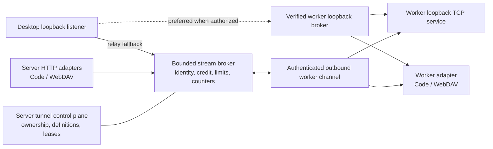

# Tunnels

Cantrip tunnels let a local desktop application reach a TCP service owned by a
worker without exposing the worker to inbound network connections. The server
owns authorization and routing; workers and desktop clients keep their
listeners on loopback. When the Tauri app and worker are on the same machine,
the server can authorize a verified loopback data path so bulk bytes avoid the
relay. The server remains the rendezvous point and automatic relay fallback is
always available.

## Using a saved tunnel

Open **Global Settings → Tunnels** to see every tunnel owned by the current
account. **Project Settings → Tunnels** first shows tunnels associated with the
open project, then a separate **All Tunnels** inventory. A project association
is only a label for organization: it never selects a worker or changes routing.

To create a tunnel:

1. Choose a name, an explicit worker, a worker-local port, and a protocol hint.
2. Optionally associate a project. Global Settings defaults this to
   **Unspecified**; Project Settings defaults it to the current project.
3. Save the definition, then choose **Start** in the Tauri desktop app.
4. Use the displayed `127.0.0.1` endpoint. HTTP and HTTPS tunnels also offer
   **Open** and **Copy URL** actions.

Automatic port selection asks the operating system for an unused loopback port.
A preferred port reports a collision instead of silently changing the endpoint.
Stopping a desktop attachment releases its listener but keeps a user-created
tunnel definition available for restart. Deleting the definition is a separate
action.

Web and mobile builds can inspect and manage tunnel definitions, but cannot bind
a port on the user's device. HTTPS is transported as unchanged TCP bytes; the
target service's certificate must still be trusted for the local hostname used
by the client.

## Managed tunnels

The same inventory includes feature-owned tunnels:

| Origin          | Purpose                                            | Lifecycle owner       |
| --------------- | -------------------------------------------------- | --------------------- |
| Browser         | Open a worker-local site in the system browser     | Browser tab/service   |
| Project share   | Carry Finder/Explorer WebDAV access                | Project share         |
| Cantrip Code    | Carry the isolated Code HTTP and WebSocket surface | Code tab/session      |
| Future features | Reuse the control plane and adapter interfaces     | Owning feature record |

Managed tunnels show only actions allowed by the server. They cannot be
retargeted or deleted independently of their owner. **Open owner** returns to
the owning surface when it still exists. An eligible Browser tunnel can be
copied into a user-managed definition with **Save as custom tunnel**.

Finder and File Explorer project shares also use the local-direct path when the
Tauri app can verify the selected worker on the same device. The server opens
and authorizes the worker's loopback-only WebDAV service, but keeps its host and
port out of the client ticket. Tauri mounts a local forwarded URL that preserves
the server-issued capability path and WebDAV credentials. If the direct broker
cannot be reached or verified, the app mounts the existing authenticated server
URL instead; remote and mobile clients therefore retain the same relay behavior.
If an established local-direct share later disconnects, the native mount
manager remounts the same server-authorized share URL through the relay. The
share credential and hard mount lease do not change during that cutover.

In a Browser tab, **Open locally** creates or reuses a managed desktop tunnel,
preserves the page path and query, and opens its loopback URL in the system
browser. The tunnel carries ordinary HTTP streaming and WebSocket/HMR traffic.
Use ordinary **Open externally** only for addresses that are already reachable
from the desktop without worker-local forwarding.

## Architecture

HTTP is authoritative for definitions, mutations, attachment authorization,
and recovery snapshots. The application live WebSocket carries only committed
`tunnel` invalidations. Stream bytes use the dedicated versioned binary data
plane on authenticated desktop/server/worker transports.

A logical tunnel is durable configuration and may have zero or more runtime
attachments. Every route names its source and destination endpoints explicitly;
the optional project ID never supplies placement. Each stream repeats its
tunnel, attachment, endpoint, connection, and sequence identities. Credit-based
flow control, bounded payloads and transport queues, per-tunnel/global
connection limits, bandwidth limits, idle expiry, maximum lifetime, and
disconnect/revocation cleanup fail closed instead of buffering indefinitely.

The Code and WebDAV HTTP formats remain bounded endpoint adapters. They no
longer own private framing or connection brokers. Shared managed-relay telemetry
batches their counters and flushes pending bytes and connection changes before
an attachment is removed.

Attachment secrets are short-lived, owner-scoped, stored only as hashes by the
server, and held in memory by the desktop. They are not placed in opened URLs,
process arguments, metrics labels, or payload logs. User destinations are
restricted to validated worker-loopback TCP targets.

For a local-direct attachment, the server mints a short-lived, one-use
capability bound to the account session, worker, tunnel, attachment, endpoint
identities, channel, and lease. Tauri accepts the route only after verifying the
worker broker's ephemeral Ed25519 identity against the server advertisement.
The TCP target is installed on the worker over its authenticated control channel
and is never disclosed in the client ticket. The app does not infer locality
from hostnames or addresses: it tries only the advertised loopback broker and
uses the ordinary server WebSocket relay if the proof, connection, or capability
cannot be used. Attachment, session, account, worker-control, and server
lifecycle revocation all tear down the direct lease.

The native forwarder keeps relay credentials short-lived. If a long-running
direct connection drops after its original relay credential expires, Tauri
marks the listener degraded and asks the server to rotate that attachment's
credential before reconnecting through the relay. The local listener and its
port stay stable during this recovery.

## Status and observability

Tunnel rows distinguish desired state from observed `starting`, `active`,
`offline`, `degraded`, `stopping`, `stopped`, or `failed` state. An offline
worker or detached desktop does not erase a saved definition; a later start can
authorize a fresh short-lived attachment. Stale and revoked attachment secrets
are rejected.

`GET /api/health` includes aggregate route, connection, byte, open, close,
rejection, and broker-termination counters. Authenticated `GET /metrics`
exports:

- `cantrip_tunnel_connections` and `cantrip_tunnel_routes`;
- `cantrip_tunnel_connections_opened_total`,
  `cantrip_tunnel_connections_closed_total`, and
  `cantrip_tunnel_connections_rejected_total`;
- `cantrip_tunnel_bytes_total`, including directional series; and
- `cantrip_tunnel_terminations_total{reason=...}` for bounded broker failures
  and lifecycle termination; and
- `cantrip_data_plane_bytes_total` and
  `cantrip_data_plane_connections_total`, split by `local-direct` versus
  `server-relay` and bounded resource/direction/event labels.

Global or Project **Settings → Tunnels** also shows a zero-configuration
desktop data-plane summary. It counts every active native forwarder—including
PTY, Code, and project-share managed routes—not only user-created tunnel rows.
The summary refreshes while open and identifies each attached tunnel as
**Local direct** or **Server relayed**.

Metrics contain no user, project, destination, credential, cookie, or payload
labels. See [the hosted deployment guide](HOSTED_DEPLOYMENT.md) for protecting
the endpoint and configuring relay quotas.

## Future worker-to-worker extension

Worker A → server → Worker B forwarding is intentionally not exposed yet. The
control-plane endpoint vocabulary reserves a `worker-listener` source, and the
broker already routes between arbitrary endpoint implementations rather than
assuming a desktop source or same-worker placement. Shipping the feature later
requires a worker-listener adapter plus authorization and UI policy for both
explicit workers. It does not require replacing tunnel records, logical IDs,
attachments, the stream envelope, broker lifecycle, settings inventory, or the
server-routed trust boundary.

Cantrip will not silently synchronize repositories, processes, or dirty files as
part of a tunnel. Those belong to the separate multi-worker project model.

## Troubleshooting

- **Start is unavailable:** local attachment requires Tauri, an online selected
  worker, and the server-provided `canAttach` capability.
- **Preferred port is busy:** select automatic allocation or stop the local
  process already bound to that loopback port.
- **Tunnel is offline:** reconnect the explicit destination worker, then start
  or refresh the attachment. Do not change the project association to route it.
- **Local HTTPS warning:** trust or replace the target service certificate; the
  tunnel does not terminate TLS.
- **Managed actions are locked:** open or stop the owning Browser, Code, or
  project-share feature instead of mutating its route independently.

The architectural decision and rejected alternatives are recorded in
[ADR 0007](adr/0007-unified-tunnel-framework.md).
The locality proof and fallback decision are recorded in
[ADR 0008](adr/0008-server-authorized-local-direct-data-plane.md).
