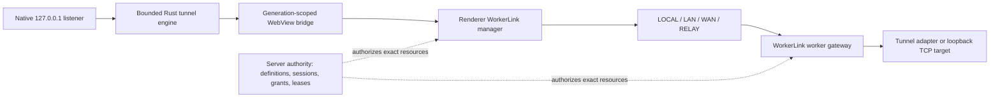

# Tunnels

Cantrip tunnels let a native desktop app reach a worker-owned TCP service
without exposing the worker to unauthenticated inbound connections. The server
owns authorization and rendezvous. WorkerLink carries the bytes over the first
available authorized route in fixed order: `LOCAL → LAN → WAN → RELAY`.

## Using a saved tunnel

Open **Global Settings → Tunnels** to see every tunnel owned by the current
account. **Project Settings → Tunnels** shows the current project's associated
tunnels followed by **All Tunnels**. A project association is organizational;
the tunnel's explicit worker remains its execution placement.

To create and use a tunnel:

1. Choose a name, explicit worker, worker-local port, and protocol hint.
2. Optionally associate a project.
3. Save the definition and choose **Start** in the native desktop app.
4. Use the displayed `127.0.0.1` endpoint. HTTP and HTTPS tunnels also provide
   **Open** and **Copy URL** actions.

Automatic port selection asks the operating system for an unused loopback port.
A requested fixed port reports a collision rather than silently changing.
Stopping a desktop attachment releases its listener but retains a user-created
definition. Deleting the definition is separate.

Web and mobile builds can inspect and manage definitions but cannot bind a
listener on the user's device. HTTPS remains unchanged TCP; Cantrip does not
terminate or replace the target service's certificate.

## Managed tunnels

Browser local-open, project share, and Cantrip Code reuse the same tunnel and
WorkerLink primitives. Managed definitions can be mutated only through their
owning feature. An eligible Browser route may be copied to a user-managed
tunnel.

Project shares always mount the native loopback listener. A carrier change
beneath WorkerLink does not replace the mount URL, credentials, or hard lease.
There is no fallback that mounts a server HTTP URL. Browser Code similarly uses
an application-origin virtual adapter backed by WorkerLink; native Code uses a
loopback forward. There is no second public Code origin or listener.

## Architecture

HTTP owns definitions, mutations, attachment authorization, and recovery
snapshots. App Live carries committed tunnel invalidations. The outer
WorkerLink envelope selects and secures the carrier session; the inner
`tunnel-data-plane-v1` protocol retains tunnel, attachment, endpoint,
connection, and sequence identities plus credit-based flow control.

A logical tunnel is durable configuration and may have zero or more runtime
attachments. Every route names its source and destination explicitly. Bounded
payloads and transport queues, per-tunnel and deployment connection limits,
bandwidth limits, idle expiry, maximum lifetime, and lifecycle revocation fail
closed rather than buffering indefinitely.

## Authorization and encryption

The server derives owner and worker identity from authenticated principals and
credentials. A WorkerLink session is bound to the server identity and
generation, owner, account session, client instance, worker, and worker
generation. Each tunnel needs an exact resource grant covering its lane,
operation, optional exact attachment, channel count, and lease.

For project shares the app generates the tunnel ID, capability path, Digest
credentials, and AES-256-GCM data key. The root, credentials, and data key are
stored only as application-sealed, worker-opened endpoint-encrypted tunnel
content. The server authorizes the
owner, project, source, worktree, worker, tunnel, and attachment but cannot
decrypt those fields. The worker opens them, validates the canonical root, and
installs the exact adapter.

Tunnel bytes retain endpoint AES-256-GCM protection and inner identity framing
across all WorkerLink carriers. Capability values, keys, credentials, and
destinations must not appear in URLs visible outside their bounded adapter,
process arguments, logs, metrics labels, or ordinary browser storage.

## Carrier selection and recovery

LOCAL uses a short-lived server-authorized loopback capability and verifies the
worker's advertised ephemeral identity. LAN and WAN use authenticated WebRTC
peer carriers. RELAY uses the authenticated server relay. A hostname, IP, or
candidate never grants authority by itself.

A reliable tunnel stream stays on its carrier until reconnect. If that carrier
fails, the renderer reacquires exact attachment authority and opens a
replacement stream through the best available route while the native listener
and port remain stable. Network change and app resume preserve RELAY and a
healthy LOCAL carrier while retiring LAN/WAN. If LOCAL remains ready, direct
probing stops there; otherwise probing resumes at the first supported direct
route.
Session, grant, attachment, account-session, worker-generation, and server
lifecycle revocation close their associated streams.

## Status and observability

Tunnel state distinguishes desired state from observed `starting`, `active`,
`offline`, `degraded`, `stopping`, `stopped`, or `failed` state. An offline
worker or detached desktop does not erase a saved definition.

Health and metrics expose bounded aggregate tunnel route, lane, connection,
byte, rejection, reconnect, and termination counters. The Tunnels Settings
summary collapses LOCAL/LAN/WAN to **Local direct** and RELAY to **Server
relayed** for active native forwards such as Code and project shares. The
Network Map exposes exact routes. Terminal is a renderer WorkerLink stream, not
a native localhost forward. Metrics contain no user, project, destination,
credential, cookie, or payload labels.

## Worker-to-worker boundary

Worker-to-worker forwarding is not exposed. WorkerLink direct carriers connect
an authorized app to one worker; they do not synchronize repositories,
processes, or dirty files and do not grant workers each other's addresses or
credentials.

## Troubleshooting

- **Start is unavailable:** a local attachment requires the native app, an
  online selected worker, and the server-provided `canAttach` capability. Start
  then obtains the attachment and exact grant.
- **Preferred port is busy:** choose automatic allocation or stop the local
  process using the loopback port.
- **Tunnel is offline:** reconnect the explicit destination worker and refresh
  the attachment; changing its project association does not reroute it.
- **A route will not promote:** inspect WorkerLink session/grant validity,
  carrier negotiation, network-change reprobes, and relay quotas.
- **Local HTTPS warns:** trust or replace the target certificate; the tunnel
  does not terminate TLS.
- **Managed actions are locked:** use the owning Browser, Code, or project-share
  feature.

The unified framework, WorkerLink authority, and native bridge are recorded in
[ADR 0007](adr/0007-unified-tunnel-framework.md),
[ADR 0009](adr/0009-worker-link-session-and-grant-authority.md), and
[ADR 0010](adr/0010-tauri-native-worker-link-carrier.md).
