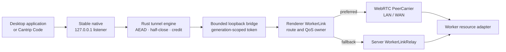

# ADR 0010: Tauri native WorkerLink carrier

- Status: Accepted
- Date: 2026-08-26

## Context

Tauri owns operating-system localhost listeners used by Cantrip Code, saved
tunnels, project shares, and unrelated desktop applications. Browser and
Capacitor can use the renderer's WebRTC `PeerCarrier` directly, but they cannot
offer a stable `127.0.0.1` TCP port to another process. Tauri therefore needs a
native path that preserves its listener while WorkerLink changes between
`LOCAL`, `LAN`, `WAN`, and `RELAY`.

The feature-facing API, server grants, WorkerLink framing, endpoint encryption,
QoS, route priority, and relay fallback are already fixed. This decision is
only about the boundary between the native listener and that shared fabric.

Three options were evaluated:

1. implement a second WebRTC stack in Rust;
2. add an encrypted, server-pinned worker peer socket; or
3. bridge the native listener into the renderer's existing WebRTC session over
   a bounded loopback WebSocket.

## Benchmark spike

The repeatable spike is
[`worker_link_native_carrier_spike.rs`](../../cantrip_app/src-tauri/examples/worker_link_native_carrier_spike.rs).
Run it with:

```bash
cargo run --release \
  --manifest-path cantrip_app/src-tauri/Cargo.toml \
  --example worker_link_native_carrier_spike
```

It measures three local handoff lower bounds with the same length-bounded echo
workload:

- an in-process asynchronous stream, representing the best possible native
  carrier handoff;
- one loopback TCP socket, representing the raw peer-socket handoff; and
- one loopback WebSocket plus a TCP peer hop, representing the extra copy and
  scheduling boundary of the selected WebView bridge.

The following values are medians of five complete runs on an Apple M4 Max with
128 GiB of memory, Darwin ARM64, and Rust 1.93.0. Each latency value is a
round-trip measurement. Throughput counts useful payload once, not echoed bytes.

| Local topology lower bound   | Payload | Iterations | p50 RTT | p95 RTT | Useful throughput |
| ---------------------------- | ------: | ---------: | ------: | ------: | ----------------: |
| Native in-process            |   1 KiB |      4,096 |   12 µs |   14 µs |        79.4 MiB/s |
| Server-pinned peer socket    |   1 KiB |      4,096 |   23 µs |   31 µs |        40.1 MiB/s |
| WebView bridge plus peer hop |   1 KiB |      4,096 |   45 µs |   52 µs |        21.6 MiB/s |
| Native in-process            |  64 KiB |      1,024 |   21 µs |   23 µs |     2,909.4 MiB/s |
| Server-pinned peer socket    |  64 KiB |      1,024 |   28 µs |   35 µs |     2,108.6 MiB/s |
| WebView bridge plus peer hop |  64 KiB |      1,024 |   71 µs |   80 µs |       883.6 MiB/s |
| Native in-process            |   1 MiB |         64 |   84 µs |   92 µs |    11,694.5 MiB/s |
| Server-pinned peer socket    |   1 MiB |         64 |  185 µs |  199 µs |     5,363.5 MiB/s |
| WebView bridge plus peer hop |   1 MiB |         64 |  472 µs |  495 µs |     2,104.3 MiB/s |

This is deliberately not a WAN, ICE, DTLS, SCTP, JavaScript-engine, or browser
benchmark. The native and peer-socket rows are optimistic lower bounds; the
bridge row substitutes a loopback TCP peer hop for WebRTC. The result answers
the local architectural question: the extra bridge boundary adds tens of
microseconds for interactive-size frames and remains above 2 GiB/s for 1 MiB
frames on the measured machine. Network RTT, WorkerLink credit, and the worker
destination dominate before this local handoff becomes the bottleneck.

## Decision

Select option 3: keep the stable Tauri localhost listener in Rust and connect
it to the renderer-owned WorkerLink session through the existing bounded,
authenticated loopback WebSocket bridge.



The bridge is an internal carrier adapter, not a new feature transport. A
Terminal, Code, or tunnel feature still asks WorkerLink for a lane and resource
stream and never chooses WebRTC, a socket address, or RELAY.

## Evaluation

| Concern                     | Native Rust WebRTC                                                                                                                                  | Server-pinned peer socket                                                                                                                                                               | Selected WebView bridge                                                                                                                                      |
| --------------------------- | --------------------------------------------------------------------------------------------------------------------------------------------------- | --------------------------------------------------------------------------------------------------------------------------------------------------------------------------------------- | ------------------------------------------------------------------------------------------------------------------------------------------------------------ |
| Security                    | Can use ICE, DTLS, SCTP, and the exact WorkerLink handshake, but duplicates candidate filtering and peer identity in a second client implementation | Needs a new encrypted handshake, pinned worker identity, replay fence, rate limits, candidate validation, and exposed worker listener; knowing an address must still grant no authority | Reuses the shipped DTLS PeerCarrier and resource grants; the added listener is loopback-only, token-authenticated, identity-bound, bounded, and rate-limited |
| LAN/WAN reachability        | Good if native ICE matches the renderer and worker exactly                                                                                          | LAN is feasible, but public WAN requires port exposure or a new ICE-like hole-punching system; STUN alone is not a raw socket transport                                                 | Reuses the proven LAN/WAN ICE rounds, configured STUN, VPN classification, selected-pair validation, and server signaling                                    |
| Latency and throughput      | Best local-handoff potential                                                                                                                        | Better local handoff than the bridge                                                                                                                                                    | Adds a small local hop; the measured lower bound is far above expected tunnel demand and below normal network latency                                        |
| Backpressure and half-close | Requires a new native WorkerLink scheduler and TCP semantic adapter                                                                                 | Requires a new socket multiplexer, queue bounds, credit, half-close, and per-channel fallback                                                                                           | Retains the existing Rust TCP engine, nested tunnel framing, WorkerLink credit, 8 MiB bridge high-water bound, send deadline, and tested half-close behavior |
| Packaging                   | Adds and maintains a second complete WebRTC/ICE/DTLS/SCTP stack in the desktop binary. The current stable `webrtc-rs` line is still pre-1.0         | Smaller protocol dependency set, but adds a new worker-facing listener and custom cross-platform transport                                                                              | Adds no production transport dependency; WebRTC remains in the renderer and existing worker implementation                                                   |
| Platform support            | Requires independent macOS, Windows, and Linux integration and packaging validation                                                                 | TCP is portable, but firewall, listener exposure, and NAT behavior differ by platform                                                                                                   | Uses WebView WebRTC on macOS and Windows; unsupported WebViews fail per channel to RELAY. Linux direct support remains capability-dependent                  |
| Reconnect and stable ports  | Can preserve the native listener if the new carrier is process-owned correctly                                                                      | Can preserve the listener, but must rebuild all route and authorization lifecycle logic                                                                                                 | The native listener already remains bound while the renderer reopens only the WorkerLink stream and walks `LOCAL -> LAN -> WAN -> RELAY`                     |
| Architectural fit           | Produces two client PeerCarrier implementations that must remain behaviorally identical                                                             | Creates a second direct protocol and risks feature or deployment coupling to it                                                                                                         | Keeps one route selector, one renderer PeerCarrier, one worker peer gateway, and one RELAY fallback                                                          |

WebRTC's ICE procedures are specifically designed for NAT traversal
([RFC 8445](https://www.rfc-editor.org/rfc/rfc8445)); its DataChannel stack
already supplies the SCTP/DTLS behavior Cantrip uses
([RFC 8831](https://www.rfc-editor.org/rfc/rfc8831)). A Rust implementation is
technically viable—the maintained
[`webrtc-rs`](https://github.com/webrtc-rs/webrtc) project provides ICE, DTLS,
SCTP, and DataChannels—but adopting it would still create a second pre-1.0
client implementation and parity burden without solving a measured bottleneck.

## T2.6B implementation contract

The implementation pass must harden the selected bridge rather than expose it
as a feature choice:

- retain each native listener and its published localhost port across carrier
  failure, ICE restart, route promotion or demotion, and grant rotation;
- bind every bridge claim to the exact account session, client instance,
  worker-process generation, route generation, tunnel, attachment, native
  forward generation, and renderer lease;
- keep the bridge on `127.0.0.1`, use a short-lived high-entropy secret with
  constant-time comparison, cap handshakes and frames, and back off invalid
  attempts;
- keep endpoint AEAD, nested tunnel framing, TCP half-close, ordered stream
  credit, and native listener ownership unchanged;
- reconnect only the affected WorkerLink stream, then retry
  `LOCAL -> LAN -> WAN -> RELAY`; do not pretend an arbitrary TCP stream
  survived;
- allow another exact live renderer lease to reclaim a degraded process-wide
  Code forward without rebinding its listener;
- add a bounded native Tauri network-interface change signal if platform tests
  show that the WebView does not proactively report a healthy-route change;
- fall back per channel when WebRTC is unavailable, unsupported, denied local
  network permission, blocked by policy, or fails ICE; and
- expose only bounded route/reconnect telemetry, never interface addresses,
  candidates, credentials, or resource identities as metric labels.

## Consequences

- Tauri native consumers gain LAN/WAN through the same PeerCarrier as renderer
  consumers while keeping their operating-system localhost contract.
- The desktop renderer remains part of the native direct-carrier data path.
  A renderer crash or reload reconnects the bridge; it does not destroy the
  native listener or imply transparent TCP resumption.
- The loopback hop costs more than a fully native carrier but is not a measured
  bottleneck. Profiling may justify a native carrier later without changing
  WorkerLink or feature APIs.
- RELAY remains mandatory and independently forceable. WebView or platform
  WebRTC limitations degrade a channel to RELAY instead of making Code or a
  tunnel unavailable.

## Rejected alternatives

### Native Rust WebRTC

Rejected for this tranche because it duplicates ICE policy, signaling,
challenge-response identity, DTLS/SCTP lifecycle, QoS DataChannels, metrics,
and platform packaging already shipped in the renderer PeerCarrier. Its local
handoff advantage does not justify that security and maintenance surface based
on the measured bridge overhead.

### Encrypted server-pinned worker peer socket

Rejected because a raw socket does not inherit the existing ICE-selected WAN
reachability. Making it reliable across NAT would require public worker ports,
manual port forwarding, or a new hole-punching and candidate-validation
protocol. It would also add another worker listener and direct authorization
surface while feature-neutral WebRTC already solves the same problem.

### Keep native tunnels on RELAY

Rejected because it violates the required route priority and needlessly sends
bandwidth-sensitive local Code and tunnel traffic through the server when the
authenticated worker is directly reachable.
