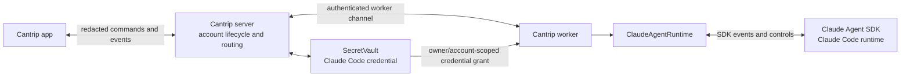

# Claude Code login integration

- Authorization: Cantrip has explicit permission to use Claude Code login and
  subscription-backed authentication in this product.
- Implementation status: approved design; not yet implemented.
- Runtime: Claude Agent SDK backed by the official Claude Code runtime.
- Related: [portable provider authentication](../PROVIDER_AUTHENTICATION.md),
  [event normalization](../CODEX_EVENT_NORMALIZATION.md),
  [agent interactions](../AGENT_INTERACTIONS.md),
  [multi-worker architecture](../MULTI_WORKER_ARCHITECTURE.md),
  [runtime compatibility](../CODEX_RUNTIME_COMPATIBILITY.md), and
  [service logging](../SERVICE_LOGS.md).

## Authorization and scope

Cantrip has explicit permission to integrate Claude Code login and use the
authenticated Claude subscription as an agent runtime. This document proceeds
on that basis. It is not a proposal to seek permission and it must not be used
to relitigate whether the integration is allowed.

The authoritative approval correspondence or agreement must remain in the
project's private records. Do not commit confidential correspondence, OAuth
client secrets, tokens, or account identifiers to this repository. This README
records the authorized product decision and technical design; it is not the
private approval artifact.

Implement only the scope Anthropic approved. In particular, permission to use
Claude Code login does not by itself imply an undocumented OAuth client
registration flow, direct access to private token endpoints, or permission to
represent a raw Anthropic API-key integration as subscription access. If the
approval includes a dedicated client configuration or refresh contract, use
the supplied contract exactly. Otherwise, use the official Claude Code login
and token setup commands described below.

## Decision

Claude Code is a separate Cantrip agent runtime, not an
`openai-compatible` model provider and not a proxy behind Codex's Responses
API. The existing Codex runtime continues to power ChatGPT, Grok, Ollama,
OpenRouter, GLM, and other compatible routes. A Claude-backed chat selects the
Claude runtime before the session begins and stays on that runtime for the
session.

Use the official
[Claude Agent SDK for TypeScript](https://code.claude.com/docs/en/agent-sdk/typescript)
for structured chat. It already owns the Claude agent loop, tool execution,
streaming, permission callbacks, MCP integration, and session semantics. A raw
`claude` terminal remains useful as a separate terminal surface, but terminal
I/O must not be parsed into Cantrip's structured chat protocol.

This separation has three consequences:

1. Claude authentication never passes through the Codex app server.
2. Codex-only features are capability-gated instead of being emulated.
3. A later raw Anthropic API-key provider must use a distinct kind, such as
   `anthropic-api`, so it cannot be confused with the authorized Claude Code
   subscription path.

## Target architecture



The app remains a control surface and never connects directly to a worker. The
server remains the credential and lifecycle authority. The selected worker
launches the Claude runtime for the selected account and project, then
normalizes SDK events into the same durable Cantrip conversation surfaces used
by Codex chats.

Use these explicit identifiers throughout protocol and storage:

```ts
type AgentRuntimeKind = "codex" | "claude-code";
type AccountProviderKind = "chatgpt" | "grok" | "claude-code";
```

Do not use a generic `claude` kind. `claude-code` makes the subscription and
runtime boundary unambiguous and leaves room for a separate API-key provider.

## Account enrollment

### Portable server-owned flow

Portable enrollment is the primary Cantrip flow. It lets a Claude Code account
follow its Cantrip owner to another compatible worker without depending on one
machine's Claude configuration directory or operating-system credential store.

```mermaid
sequenceDiagram
    participant A as "Cantrip app"
    participant S as "Cantrip server"
    participant W as "Selected worker"
    participant C as "Claude Code login"
    participant V as "SecretVault"

    A->>S: "Create Claude Code account and start login"
    S->>W: "Owner-bound, single-use enrollment request"
    W->>C: "Run the approved Claude Code token setup flow"
    C-->>W: "Authorization URL and safe user prompt"
    W-->>S: "Redacted login progress"
    S-->>A: "Display authorization action"
    A->>C: "User completes Claude account authorization"
    C-->>W: "Claude Code OAuth credential"
    W->>W: "Validate credential through Claude Code / SDK"
    W->>S: "Credential and bounded account metadata"
    S->>V: "Encrypt with owner/provider/account context"
    V-->>S: "Durable credential revision"
    S-->>W: "Persistence acknowledgement"
    W->>W: "Discard enrollment buffers and stop the PTY"
    S-->>A: "Account active; no credential returned"
```

Unless Anthropic supplied a dedicated approved OAuth client contract, the
worker should invoke the official `claude setup-token` flow in a guarded PTY.
Relay only display-safe prompts, the authorization URL, and any non-secret user
code. Capture the resulting credential only in the worker's enrollment
handler; never expose the raw terminal stream to the app, service logs, shell
history, or support bundles.

The resulting `CLAUDE_CODE_OAUTH_TOKEN` is scoped to Claude Code inference. Do
not use it for Claude Remote Control, claude.ai connectors, or any service not
included in the approved integration. Usage and model availability remain
subject to the authenticated account's subscription and the runtime metadata
Claude Code reports.

Validate the captured credential before persistence by running the supported
Claude authentication status check and initializing a minimal Agent SDK
session with that credential. Status alone proves that a credential was found;
SDK initialization proves that it is usable by the runtime Cantrip will launch.
Send only bounded display metadata, such as the account label and subscription
tier, alongside the secret.

The server stores the credential with `SecretVault` under authenticated
additional data that includes the Cantrip owner, provider, account, and
credential kind:

```text
cantrip:model-provider-account:claude-code:<ownerId>:<providerId>:<accountId>
```

The worker must retain the enrollment secret only until the server acknowledges
the exact stored credential revision. A failed or cancelled enrollment removes
the pending account and destroys the worker-side secret buffer.

### Local CLI flow

A separately exposed **Open Claude terminal** action may run `claude auth login`
and leave authentication under the native CLI's control. That is a useful local
terminal feature, but it is not portable Cantrip authentication and must not be
presented as an enrolled server account.

Do not build structured multi-account support around native credential files or
the macOS Keychain. Their storage and account-selection behavior belongs to the
CLI and can collide when several Cantrip accounts share a worker user. Portable
enrollment avoids that collision by vaulting an explicit account credential and
injecting it only into the selected Claude process.

## Credential delivery and lifecycle

The Claude Code setup credential is durable upstream authentication material,
not a short-lived access token. Reuse the existing authenticated
server-to-worker account lease route as a policy and delivery boundary, but
name the Claude response a credential grant and do not claim that its Cantrip
lease expiry shortens the upstream credential's validity.

For each runtime launch, the worker must:

1. request a grant for the selected owner, provider, account, worker, and
   credential revision;
2. keep the credential in memory only;
3. start the SDK subprocess with `CLAUDE_CODE_OAUTH_TOKEN` in that process's
   environment;
4. omit `ANTHROPIC_API_KEY` and `ANTHROPIC_AUTH_TOKEN` from the child
   environment so another credential cannot silently take precedence;
5. omit ambient Bedrock, Vertex, Foundry, profile, and federation selectors that
   could redirect authentication; and
6. discard the grant when the runtime closes.

Never place `CLAUDE_CODE_OAUTH_TOKEN` in the worker's global environment, a
project environment file, a generated shell script, a terminal command, or a
process argument. Construct a minimal child environment for the selected
runtime and redact the variable from process diagnostics. Give every runtime a
Cantrip-owned isolated Claude configuration directory. Do not read the
operator's normal `~/.claude`, Keychain account, settings, plugins, debug logs,
or cloud-provider profile.

If Anthropic's approved integration contract supplies refresh material, store
the refresh authority only on the server and deliver derived access material to
workers, following the revision-fenced refresh design used by ChatGPT. If the
approved flow supplies only a setup credential, do not invent a refresh
endpoint. An authentication failure moves the account to `reauth-required` and
starts the approved login flow again.

Sign-out is global within Cantrip. The server must deny new grants, advance the
account generation, close every matching worker runtime, remove the encrypted
credential, clear catalog and quota observations, and invoke upstream
revocation only when the approved Anthropic contract provides a supported
revocation operation. If Cantrip can remove a credential locally but cannot
revoke it upstream, the UI must say **Remove from Cantrip**, not **Revoke with
Anthropic**.

## Runtime adapter

Extract a capability-based `AgentRuntime` interface from the current
`CodexRuntime` boundary, then retain the existing implementation as
`CodexAgentRuntime` and add `ClaudeAgentRuntime`. The generic interface should
cover shared product behavior rather than every Codex app-server method:

- start, resume, steer, stop, and close a session;
- stream assistant text and normalized activity;
- request and resolve tool approvals or user input;
- report models, account identity, usage, and runtime capabilities;
- register MCP servers and project instructions where supported; and
- export the durable session identity needed for relocation.

`ClaudeAgentRuntime` calls the SDK `query()` entry point with the selected
project directory, model, permission policy, MCP configuration, abort signal,
and the scoped child environment. It translates SDK output as follows:

| Claude Agent SDK surface               | Cantrip surface                                      |
| -------------------------------------- | ---------------------------------------------------- |
| Assistant content deltas               | Chat response stream                                 |
| Tool use and tool result blocks        | Normalized Agent activity                            |
| Permission callback                    | Cantrip interaction approval                         |
| `AskUserQuestion`                      | Cantrip user-input interaction                       |
| SDK result, usage, and model metadata  | Turn completion, telemetry, and concrete route       |
| Abort signal                           | Stop or cancel                                       |
| SDK session ID and resume option       | Cantrip runtime identity and subsequent turns        |
| Initialization models/account metadata | Account-scoped model catalog and status observations |

Apply the existing event-normalization security boundary to Claude events.
Persist supported reasoning summaries, not raw thinking. Bound or omit tool
arguments, tool results, SDK payloads, and provider diagnostics before they
enter transcript or activity records. Rename Codex-specific correlation types
when they become runtime-neutral so Claude events are never mislabeled as
Codex events.

Preserve the Claude session ID beside the Cantrip thread, runtime kind, account
ID, project checkout, and credential revision. Resume only when all identity
fields are compatible. Use the SDK's
[session storage contract](https://code.claude.com/docs/en/agent-sdk/session-storage)
to mirror session data into Cantrip-controlled storage when cross-worker
relocation is enabled. Never copy an opaque live process or native credential
store between workers.

Automatic fallback must not cross from Claude to Codex, or from Codex to
Claude, after a session starts. Their tools, transcript semantics, system
instructions, and resumable session formats are different. A future explicit
conversation conversion can be designed separately; it must not masquerade as
route retry.

Pin the Agent SDK and packaged Claude runtime independently from Codex. The
worker heartbeat must advertise the Claude runtime version and negotiated
capabilities, startup must reject an incompatible combination before a turn,
and packaged builds must disable runtime auto-update.

## Capability boundary

The app must render features from runtime capabilities instead of assuming
that every agent is Codex:

| Capability                        | Claude Code behavior                              |
| --------------------------------- | ------------------------------------------------- |
| Chat, streaming, and cancellation | Implement through the Agent SDK                   |
| Tool activity and approvals       | Normalize SDK tool and permission events          |
| User questions                    | Normalize `AskUserQuestion`                       |
| Session resume                    | Persist and resume the Claude session ID          |
| MCP                               | Pass supported server configuration to the SDK    |
| Skills and project instructions   | Advertise only what the packaged runtime supports |
| Exact Codex plan/goal methods     | Hide unless implemented above the generic runtime |
| Codex customization inventory     | Hide                                              |
| ChatGPT Codex import              | Hide                                              |
| Linked Codex console              | Replace with a distinct Claude terminal action    |

Cantrip workflows may target a Claude chat once their required operations are
expressed through the generic runtime interface. Do not claim a capability or
send a Codex-specific command merely because the app already has a control for
it.

## Required changes by layer

| Layer                 | Required change                                                                                                                                                  |
| --------------------- | ---------------------------------------------------------------------------------------------------------------------------------------------------------------- |
| Shared protocol       | Add `claude-code` account/runtime discriminants, generic auth commands and events, capability schemas, Claude session identity, and credential-grant responses.  |
| Server database       | Extend provider-account constraints and indexes, store Claude credential revisions and lifecycle state, and bind sessions to a runtime kind.                     |
| Server services       | Add enrollment coordination, vault persistence, grant issuance, account status, catalog sync, sign-out fencing, and runtime shutdown broadcasts.                 |
| Worker authentication | Add the guarded Claude login PTY, bounded parser, credential validation, redacted progress events, cancellation, and cleanup.                                    |
| Worker runtime        | Extract `AgentRuntime`, implement `ClaudeAgentRuntime`, normalize SDK events, persist session IDs, and package a tested Claude runtime.                          |
| App                   | Add **Claude Code Account**, login progress, reauthentication and removal states, account/model selection, runtime capability gates, and Claude-specific errors. |
| Routing               | Include runtime kind in logical routes and runtime keys; forbid transparent cross-runtime fallback or resume.                                                    |

Use a direct protocol and schema migration. Rename Codex-specific auth or
runtime commands when they become genuinely generic rather than adding a
parallel compatibility layer that leaves the ownership boundary ambiguous.

Primary implementation touchpoints include:

- `packages/protocol/src/index.ts` for provider kinds, identities, grants,
  model metadata sources, worker commands, runtime identities, and correlation;
- `cantrip_server/src/models/account-provider.ts`,
  `provider-credentials.ts`, `provider-access-tokens.ts`, and the lifecycle,
  catalog, routing, and revocation services;
- `cantrip_server/src/db/schema.ts`, migrations, and repository filters that
  currently enumerate ChatGPT and Grok account kinds;
- `cantrip_worker/src/index.ts`, the existing Codex runtime maps and dispatch,
  and new Claude authentication, runtime, and session-store modules; and
- the app's provider-account settings, model routing, composer, transcript,
  interaction, and terminal surfaces.

## Failure semantics

- A cancelled login closes the PTY, invalidates the enrollment request, and
  persists no credential.
- Malformed or unexpectedly large CLI output fails closed and is never copied
  into an error message.
- An invalid credential marks the account `reauth-required`; it does not retry
  with a worker-global Anthropic credential.
- A mismatched owner, account, provider, credential revision, runtime kind, or
  checkout rejects the grant or resume request.
- Disabling or removing an account stops matching sessions and prevents new
  work before changing the UI state to complete.
- An unsupported Claude runtime or SDK version reports a bounded compatibility
  error before a turn begins.
- A worker disconnect leaves durable history readable. Resume is available only
  after a compatible worker reconstructs the Claude session.
- Token-shaped output is replaced with a redaction marker before any service
  log, audit event, client event, or support bundle is created.

## Security requirements

- The app never receives an OAuth credential, setup token, refresh token, or
  encrypted credential envelope.
- Only an authenticated, owner-bound worker enrollment response may carry a new
  secret to the server.
- Only the worker assigned to the selected project and account may receive a
  credential grant.
- The database envelope is authenticated with the exact owner, provider,
  account, and credential kind.
- Enrollment transcripts, process environments, SDK debug output, exceptions,
  audit events, and support bundles must pass token-leak tests.
- Account credentials must not enter project files, Git worktrees, terminal
  history, Claude configuration directories, or operating-system credential
  stores during portable enrollment.
- Runtime shutdown must clear Cantrip's in-memory references even though the
  operating system ultimately owns process-memory reclamation.
- The Claude session store must contain transcript state only; it must never
  contain the OAuth credential or inherit a personal Claude configuration.
- Removing a credential from Cantrip must not be described as upstream
  revocation unless that revocation was actually confirmed.

Treat the Claude setup credential as equivalent to a password for incident
response. A compromised worker can use credentials legitimately granted to it
while it remains enrolled. Revoking the worker blocks future grants but does
not invalidate already exposed upstream material; follow the supported
Anthropic account revocation path after suspected exposure.

## Validation and acceptance

The integration is ready only when all of the following hold:

- Protocol and database tests cover the new discriminants, migrations,
  ownership checks, credential revisions, runtime keys, and capability schemas.
- Login parser fixtures cover success, cancellation, malformed output,
  oversized output, and every token-shaped redaction path.
- Vault tests prove that a copied envelope cannot be opened for another owner,
  provider, account, or credential kind.
- End-to-end tests prove that the app never receives the secret and an
  unauthorized worker cannot request it.
- Two Claude accounts can run independently on one worker without using or
  overwriting a shared CLI credential store.
- Ambient API keys, cloud-provider selectors, profiles, and personal Claude
  configuration cannot override the account Cantrip selected.
- SDK fixtures cover streaming text, tool activity, approval, user questions,
  cancellation, completion, errors, usage, model discovery, and session resume.
- Disabling or removing an account closes matching runtimes and blocks new
  turns, catalog refreshes, and relocation.
- Cross-worker resume succeeds only through the explicit session-storage path
  and rejects incompatible runtime, account, project, or credential identity.
- Session-storage tests cover concurrent writes, compare-and-swap conflicts,
  bounded record size, retention, server restart, and deletion with the chat.
- Logs, audit events, crash reports, process diagnostics, and support bundles
  contain no Claude credential or raw enrollment transcript.
- Platform smoke tests cover packaged login, browser handoff, runtime launch,
  resume, sign-out, and reauthentication on every supported desktop platform.

## Implementation order

1. Add the protocol, database, and capability discriminants.
2. Implement server-owned Claude account lifecycle and encrypted storage.
3. Implement guarded worker enrollment and credential validation.
4. Extract the generic runtime boundary and add the Agent SDK adapter.
5. Add settings, model selection, conversation controls, and capability gates.
6. Add session storage and compatible-worker relocation.
7. Complete security, failure, packaging, and platform acceptance tests.

The first usable product slice should include portable login, one Claude
account, model discovery, structured chat, tool approvals, cancellation,
session resume, reauthentication, and removal. Broader workflow and relocation
support should follow the same capability and credential boundaries rather than
weakening them.

## Official technical references

- [Claude Code authentication](https://code.claude.com/docs/en/authentication)
- [Claude Code CLI reference](https://code.claude.com/docs/en/cli-usage)
- [Claude Agent SDK for TypeScript](https://code.claude.com/docs/en/agent-sdk/typescript)
- [Claude Agent SDK sessions](https://code.claude.com/docs/en/agent-sdk/sessions)
- [Claude Agent SDK session storage](https://code.claude.com/docs/en/agent-sdk/session-storage)
